資料呈現與繪圖
========================================================
author: 曾意儒 Yi-Ju Tseng
date: 2017/08/07
autosize: true
font-family: 'Microsoft JhengHei'
navigation: slide

資料分析步驟
========================================================
- 資料匯入
- 資料清洗處理並轉換為Tidy data
- 資料分析
- **資料呈現與視覺化**

資料呈現
========================================================
- Table 1

Table 1
========================================================

```r
library(readr)
# 讀入疾病統計檔資料，請將檔案放在專案路徑下
DiagSumS <- read_csv("DiagSumS.csv")
```

```r
#第一次使用前先安裝
#install.packages("tableone")
library(tableone)
CreateTableOne(data=DiagSumS,
               strata = "性別",
               vars = c("年齡","來源別","住院天數"))
```

```
                      Stratified by 性別
                       F             M             p      test
  n                     1672            31                    
  年齡 (mean (sd))     53.15 (11.86) 42.48 (10.55) <0.001     
  來源別 = O (%)        1423 (85.1)     24 (77.4)   0.351     
  住院天數 (mean (sd))  5.41 (7.80)   5.00 (5.07)   0.773     
```

Table 1
========================================================

```r
CreateTableOne(data=DiagSumS,
               strata = "性別",
               vars = c("年齡","來源別","住院天數"))
```

```
                      Stratified by 性別
                       F             M             p      test
  n                     1672            31                    
  年齡 (mean (sd))     53.15 (11.86) 42.48 (10.55) <0.001     
  來源別 = O (%)        1423 (85.1)     24 (77.4)   0.351     
  住院天數 (mean (sd))  5.41 (7.80)   5.00 (5.07)   0.773     
```

Table 1 to Excel?
========================================================

```r
t1<-CreateTableOne(data=DiagSumS,
               strata = "性別",
               vars = c("年齡","來源別","住院天數"))
print(t1, quote = TRUE, noSpaces = TRUE)
```

```
                        "Stratified by 性別"
 ""                      "F"             "M"             "p"      "test"
  "n"                    "1672"          "31"            ""       ""    
  "年齡 (mean (sd))"     "53.15 (11.86)" "42.48 (10.55)" "<0.001" ""    
  "來源別 = O (%)"       "1423 (85.1)"   "24 (77.4)"     "0.351"  ""    
  "住院天數 (mean (sd))" "5.41 (7.80)"   "5.00 (5.07)"   "0.773"  ""    
```

資料視覺化大綱
====================================
type:sub-section 

- 資料視覺化的目的
- ggplot2
- ggplot2+地圖
- 台灣面量圖
- Heatmap
- Treemap

資料視覺化的目的
====================================
type:sub-section 
- 探索圖 (Exploratory graphs)
    - 了解資料的特性
    - 尋找資料的模式(patterns)
    - 建議資料分析與建模的策略
- 結果圖 (Final graphs)
    - 結果呈現與溝通
    
探索圖特性
====================================
- 很快就可以做一張圖
- 主要目的是了解資料的樣子
- 不用做圖形格式調整美化

結果圖特性
====================================
- 比較，呈現差異
    - 比較什麼？誰跟誰比較？
- 呈現因果關係（causality）,機制（mechanism）,結果解釋（explanation）,系統化的結構（systematic structure）
    - 因果模型？為什麼你想要做這樣的比較
- 呈現多變數（Multivariate）資料
    - 多變數（Multivariate）：超過兩個變數就叫多變數
    - 所有真實事件都是多變數的

結果圖特性
====================================
- 將證據整合呈現
    - 在同一個畫面呈現文字、數字、圖表
    - 盡量用圖形呈現資料
- 將圖表做適當的標記與說明，包括xy軸名稱、單位、資料來源等
    - 資料圖表必須可以呈現你想說的故事
- 內容才是最重要的
    - 資料不好，分析不好，圖表再美也沒有用
    
常用的畫圖套件
====================================
type:sub-section 

- 基本功能(Base)：可自學
- `lattice`：可自學
- `ggplot2`

ggplot2簡介
====================================
type:sub-section 

- Dr. Leland Wilkinson [Grammar of Graphics](http://www.springer.com/us/book/9780387245447)

“In brief, the grammar tells us that a statistical graphic is a `mapping` from data to `aesthetic` attributes (colour, shape, size) of `geometric` objects (points, lines, bars). The plot may also contain statistical transformations of the data and is drawn on a specific coordinate system”

-from `ggplot2` book

ggplot2簡介
====================================
- [Hadley Wickham](http://hadley.nz/)開發
- 一直是最熱門的R packages之一
- [ggplot2 GitHub](https://github.com/tidyverse/ggplot2)

ggplot2簡介
====================================
- 做圖的文法包括兩個最主要元素
    - **Aesthetic attributes**：包括顏色、形狀、點的大小與線的粗細等
    - **Geometric objects**：包括點、線、盒狀圖、直條圖等

- 其他元素
    - **Facets**：提供在同一張圖內做多個子圖的方法，只要使用Faceting功能設定子圖分類的依據參數即可
    - **Stats**：將資料做統計轉換
    - **Scales**：修改點線的顏色、形狀、xy軸的範圍等

ggplot() 
====================================
type:sub-section 

使用ggplot2作圖有以下步驟：

- 準備好資料
- 設定**Aesthetic attributes**
    - 使用`aes(x, y, ...)`指定
- 指定**Geometric objects**
    - `geom_point()`
    - `geom_line()`
    - `geom_polygon()`
    - `geom_errorbar()`

ggplot() 
====================================

```r
library(ggplot2) 
##先安裝 install.packages("ggplot2")
```

- ggplot(data,...)

ggplot() 設定重要元素
====================================
- **Aesthetic attributes**
    - aes(x = Species, y = Sepal.Length)
- **Geometric objects**
    - geom_point()

```r
ggplot(iris, 
       aes(x = Species, y = Sepal.Length)) + 
    geom_point()
```


ggplot() geom_boxpolt()
====================================
用`geom_boxplot()`改畫盒狀圖

```r
ggplot(iris, 
       aes(x = Species, 
           y = Sepal.Length)) + 
    geom_boxplot()
```

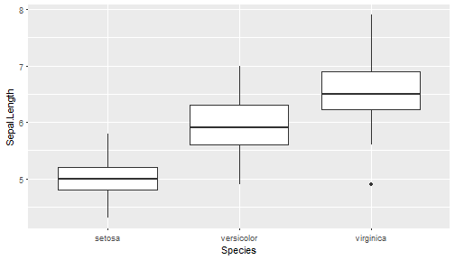

ggplot() Faceting
====================================
**直向分類**~**橫向分類**

```r
ggplot(iris, 
       aes(x = Sepal.Width, 
           y = Sepal.Length)) + 
    geom_point()+facet_grid(Species~.)
```

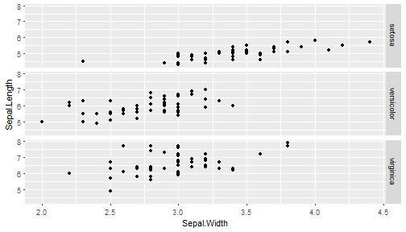

ggplot() Faceting
====================================
**直向分類**~**橫向分類**

```r
ggplot(iris, 
       aes(x = Sepal.Width, 
           y = Sepal.Length)) + 
    geom_point()+facet_grid(.~Species)
```

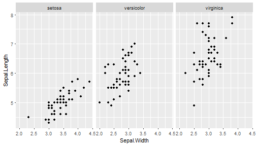

ggplot() geom_smooth()
====================================
替xy散佈圖加上趨勢線

```r
ggplot(iris, 
       aes(x = Sepal.Width, 
           y = Sepal.Length)) + 
    geom_point()+facet_grid(Species~.)+
    geom_smooth()
```

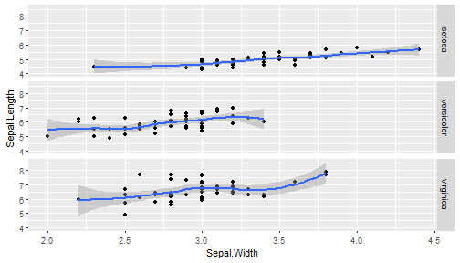

ggplot() geom_smooth()
====================================
替xy散佈圖加上趨勢線，使用linear regresion

```r
ggplot(iris, 
       aes(x = Sepal.Width, 
           y = Sepal.Length)) + 
    geom_point()+facet_grid(Species~.)+
    geom_smooth(method='lm')
```

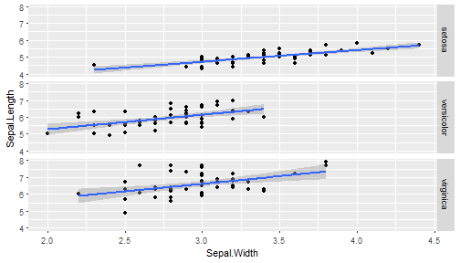

ggplot() geom_line()
====================================
改用`geom_line()`畫線

```r
ggplot(iris, 
       aes(x = Sepal.Width, 
           y = Sepal.Length)) + 
    geom_line()+facet_grid(Species~.)
```

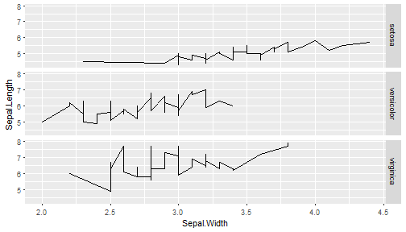

ggplot() 顏色分組
====================================
改用顏色分組，使用`aes(color='group name')`

```r
ggplot(iris, 
       aes(x = Sepal.Width, 
           y = Sepal.Length,
           color=Species)) + 
    geom_line()
```

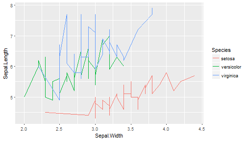

ggplot() 綜合練習 
====================================
type:alert
incremental:true

- 讀入內建iris資料
- 用**ggplot()**畫xy散佈圖
    - x軸：Sepal.Length
    - y軸：Sepal.Width
    - 子圖：Species，每個Species畫在新的**欄位**
- 用**ggplot()**做盒狀圖
    - x軸：Species
    - y軸：Sepal.Width


ggplot() 注意事項
====================================
- 提供資料時，把資料修改為想要在圖片顯示的文字
- 如果是離散性的資料，但卻又是數值時（像是1,2,3）可以用factor()轉換

ggplot() 資料標示+參數設定
====================================

- 標籤 `xlab()`, `ylab()`, `labs(x=,y=)`, `ggtitle()`
- 每一個`geom_*()`都有參數可設定
- 圖形樣式設定 `theme()`，可使用內建樣式
  - `theme_gray()`: 灰背景，預設樣式
  - `theme_bw()`: 黑白樣式
- 使用其他樣式套件
  - `ggthemes` packages [Website](https://cran.r-project.org/web/packages/ggthemes/vignettes/ggthemes.html)
  - `xkcd` packages [Website](http://xkcd.r-forge.r-project.org/)

ggplot2 參考資料
====================================
- [ggplot2 官網](http://ggplot2.tidyverse.org/)
- [ggplot2 package source code](https://github.com/tidyverse/ggplot2)
- [ggplot2 cheat sheet](https://www.rstudio.com/wp-content/uploads/2015/03/ggplot2-cheatsheet.pdf)
- [ggplot2 doc](http://docs.ggplot2.org/)


ggplot2+地圖
====================================
type:sub-section 

- Choropleth map面量圖
- ggmap()
- Density Map
- 參考資料


ggmap package
====================================
- 把google map載入並作圖的套件
- 基於`ggplot2`套件開發
- 第一次使用前需要安裝

```r
##第一次使用前先安裝
install.packages("ggmap") 
```
- `get_map()`函式取得google map圖層
    - location 地點，可以是地名，也可以是經緯度座標
    - zoom 放大倍率
    - language 地圖語言
- `ggmap()`函式將取得的圖層畫出來


get_map() + ggmap()
====================================

```r
library(ggmap)
twmap <- get_map(location = 'Taiwan', 
                 zoom = 7,
                 language = "zh-TW")
ggmap(twmap)
```

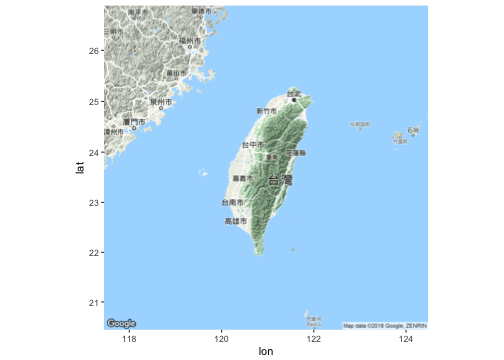

ggmap + open data 資料載入
====================================
- 只要資料有經緯度等資訊，就可以使用`ggmap` package與各式資料結合呈現
- [台北市水質資料](http://data.taipei/opendata/datalist/apiAccess?scope=resourceAquire&rid=190796c8-7c56-42e0-8068-39242b8ec927)

```r
library(jsonlite)
library(RCurl)
WaterData<-fromJSON(getURL("http://data.taipei/opendata/datalist/apiAccess?scope=resourceAquire&rid=190796c8-7c56-42e0-8068-39242b8ec927"))
WaterDataFrame<-WaterData$result$results
WaterDataFrame$longitude<-as.numeric(WaterDataFrame$longitude)
WaterDataFrame$latitude<-as.numeric(WaterDataFrame$latitude)
WaterDataFrame$qua_cntu<-as.numeric(WaterDataFrame$qua_cntu)
WaterDataClean<-WaterDataFrame[WaterDataFrame$qua_cntu>=0,]
head(WaterDataClean)
```

```
  _id update_date update_time       qua_id                code_name
1   1  2017-07-29  16:45:00   CS00                       雙溪淨水場
2   2  2017-07-29  16:45:00   CS01                         衛理女中
3   3  2017-07-29  16:45:00   CS02         雙溪國小                
4   4  2017-07-29  16:45:00   CS03                       華興加壓站
5   5  2017-07-29  16:45:00   CX00                       長興淨水場
6   6  2017-07-29  16:45:00   CX02                         市政大樓
  longitude latitude qua_cntu qua_cl qua_ph
1  121.5609 25.11574     0.02   0.57    7.4
2  121.5440 25.10325     0.08    0.4    7.6
3  121.5556 25.10763     0.06   0.33    7.6
4  121.5348 25.10356     0.12   0.42    7.4
5  121.5404 25.01633     0.03   0.51    7.3
6  121.5566 25.04250     0.05   0.57    7.3
```

ggmap + open data 繪圖
====================================

```r
library(ggmap)
TaipeiMap <- get_map(
    location = c(121.43,24.93,121.62,25.19), 
    zoom = 11, maptype = 'roadmap')
TaipeiMapO <- ggmap(TaipeiMap)+ 
    geom_point(data=WaterDataClean, 
               aes(x=longitude, y=latitude,
                   color=qua_cntu,size=3.5))+ 
    scale_color_continuous(
        low = "yellow",high = "red")+ 
    guides(size=FALSE)
TaipeiMapO
```

ggmap + open data
====================================
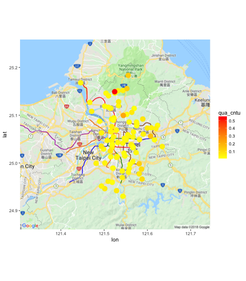

ggmap + 地圖型態
====================================
`ggmap`套件提供多種地圖型態，使用者可透過設定`maptype`自行選擇適合的地圖樣式，樣式有：

- terrain
- terrain-background
- satellite
- roadmap
- hybrid (google maps)
- watercolor
- toner (stamen maps)

ggmap + extent
====================================
透過設定`extent`參數可將地圖輸出樣式改為滿版

```r
library(ggmap)
TaipeiMap = get_map(
    location = c(121.43,24.93,121.62,25.19), 
    zoom = 14, maptype = 'roadmap')
#extent = 'device' 滿版
ggmap(TaipeiMap,extent = 'device') 
```

ggmap + extent
====================================
透過設定`extent`參數可將地圖輸出樣式改為滿版


ggmap() 練習 
====================================
type:alert
incremental:true

- 利用get_map() + ggmap()取得桃園地區的google 圖層
    - location = 'Taoyuan'
    - zoom = 11
    - language = "zh-TW"
- 在長庚大學所在地 （座標121.389539,25.035225）加上一個紅色的點
    - geom_point()
    - x= 121.389539
    - y= 25.035225
    - color ="red"

ggmap() 練習輸出圖檔
====================================
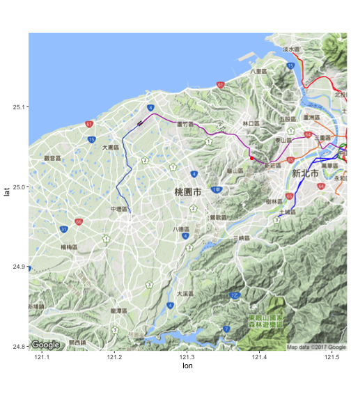


ggmap 參考資料
====================================
- [ggmap package source code](https://github.com/dkahle/ggmap)
- [ggmap cheat sheet](https://www.nceas.ucsb.edu/~frazier/RSpatialGuides/ggmap/ggmapCheatsheet.pdf)
- [ggmap doc](https://dl.dropboxusercontent.com/u/24648660/ggmap%20useR%202012.pdf)


Choropleth map面量圖
====================================
- Choropleth map[面量圖](https://en.wikipedia.org/wiki/Choropleth_map)
- **把統計資料用顏色畫在對應的地圖上**
- `choroplethr` package來畫面量圖
- 基於`ggplot2` package的`面量圖`做圖工具
- 建議同時安裝`choroplethrMaps` package

```r
##第一次使用前先安裝
install.packages(c("choroplethr",
                   "choroplethrMaps")) 
```

```r
library(choroplethr)
```

choroplethr package
====================================
- 內建美國各州地圖與人口學資料
- 使用`state_choropleth()`函式畫出美國人口分布

```r
data(df_pop_state) #記載各州人口數的資料
#把各州人口畫在地圖上
state_choropleth(df_pop_state) 
```


Taiwan的面量圖
====================================
type:sub-section 

- 台灣的面量圖尚無好的套件輔助
- Open Data: 台灣鄉鎮市邊界的經緯度檔案
    - [鄉鎮市區界線](http://data.gov.tw/node/7441)
    - 空間資料開放格式`shapefile` `.shp`
- 使用`shapefile`與`ggplot2`畫圖的步驟如下：
    - 取得空間資料檔案
    - 使用`rgdal`, `rgeos`,`maptools` package處理地圖檔shapefile
    - 使用`ggplot2` & `RColorBrewer` 畫圖
- [實作範例網址](http://yijutseng.github.io/DataScienceRBook/vis.html#taiwan)

Heatmap
====================================
type:sub-section 
- 熱度圖
- 使用顏色的深淺來表示數值的大小
- 搭配XY兩軸的變量
- 使用一張圖就能表示三個維度的資訊
- 在ggplot2套件中，可以使用`geom_tile()`來畫Heatmap
- 以下以NBA球員的資料作為範例

Heatmap
====================================

```r
#讀.csv檔案
nba <- read.csv("http://datasets.flowingdata.com/ppg2008.csv")
head(nba,3)
```

```
           Name  G  MIN  PTS  FGM  FGA   FGP FTM FTA   FTP X3PM X3PA  X3PP
1  Dwyane Wade  79 38.6 30.2 10.8 22.0 0.491 7.5 9.8 0.765  1.1  3.5 0.317
2 LeBron James  81 37.7 28.4  9.7 19.9 0.489 7.3 9.4 0.780  1.6  4.7 0.344
3  Kobe Bryant  82 36.2 26.8  9.8 20.9 0.467 5.9 6.9 0.856  1.4  4.1 0.351
  ORB DRB TRB AST STL BLK  TO  PF
1 1.1 3.9 5.0 7.5 2.2 1.3 3.4 2.3
2 1.3 6.3 7.6 7.2 1.7 1.1 3.0 1.7
3 1.1 4.1 5.2 4.9 1.5 0.5 2.6 2.3
```

Heatmap
====================================
為了做圖，將寬表轉長表

```r
library(reshape2) #for melt()
#寬表轉長表,以名字作依據
nba.m <- melt(nba,id.vars = "Name") 
head(nba.m,5)
```

|Name          |variable | value|
|:-------------|:--------|-----:|
|Dwyane Wade   |G        |    79|
|LeBron James  |G        |    81|
|Kobe Bryant   |G        |    82|
|Dirk Nowitzki |G        |    81|
|Danny Granger |G        |    67|

geom_tile()
====================================
將Geometric objects指定為`geom_tile()`

```r
library(ggplot2) #for ggplot()
ggplot(nba.m, aes(variable, Name)) + 
    geom_tile(aes(fill = value),
              colour = "white")+ 
    scale_fill_gradient(
        low = "white",high = "steelblue") 
```


geom_tile() + scale()
====================================
- 因為G欄資料明顯大於其他欄位，導致顏色差異不明顯
- 將個欄位的資料標準化處理


```r
#scale處理
library(dplyr)
nba.s<-nba %>% 
    mutate_each(funs(scale), -Name) 
head(nba.s,2)
```

|Name         |         G|       MIN|      PTS|      FGM|      FGA|       FGP|      FTM|      FTA|        FTP|       X3PM|      X3PA|        X3PP|         ORB|        DRB|        TRB|      AST|      STL|       BLK|       TO|         PF|
|:------------|---------:|---------:|--------:|--------:|--------:|---------:|--------:|--------:|----------:|----------:|---------:|-----------:|-----------:|----------:|----------:|--------:|--------:|---------:|--------:|----------:|
|Dwyane Wade  | 0.6179300| 1.0019702| 3.179941| 2.920022| 2.596832| 0.5136017| 1.917475| 2.110772| -0.7401673| -0.1080044| 0.1303647| -0.15749098| -0.27213551| -0.3465676| -0.3287465| 1.652247| 2.558238| 1.2064646| 1.790445| -0.2984568|
|LeBron James | 0.7693834| 0.6119299| 2.566974| 1.957185| 1.697237| 0.4649190| 1.778729| 1.896589| -0.5233214|  0.4920201| 0.6971679|  0.02738974| -0.06117775|  1.0080940|  0.6605370| 1.516147| 1.367252| 0.8627425| 1.059651| -1.3903719|

geom_tile() + scale()
====================================

```r
nba.s.m <- melt(nba.s) ##寬轉長
ggplot(nba.s.m, aes(variable, Name)) + 
    geom_tile(aes(fill = value),
              colour = "white")+ 
    scale_fill_gradient(
        low = "white",high = "steelblue") 
```


[How to Make a Heatmap – a Quick and Easy Solution](http://flowingdata.com/2010/01/21/how-to-make-a-heatmap-a-quick-and-easy-solution/)

Heatmap 練習 
====================================
type:alert
incremental:true

- 下載[小兒麻痺盛行率](https://raw.githubusercontent.com/CGUIM-BigDataAnalysis/BigDataCGUIM/master/104/POLIO_Incidence.csv)資料
- 將資料載入R
- 表格是寬表，需要轉成長表
- 有缺值 （-），用NA取代
    - 方法一 gsub()
    - 方法二 ifelse()
- 盛行率欄位轉換成數值
    - as.numeric()
- 用年份當x軸，州名當y軸，區塊顏色用盛行率填入
    - low = "white",high = "steelblue"

Treemap
====================================
type:sub-section 
- Treemap(矩形式樹狀結構繪圖法)
- 以二維平面的方式展示包含階層結構（hierarchical）形式的統計資訊
- `treemap` packages

treemap() data
====================================

```r
library(treemap)
data(GNI2014)
knitr::kable(head(GNI2014))
```


|   |iso3 |country          |continent     | population|    GNI|
|:--|:----|:----------------|:-------------|----------:|------:|
|3  |BMU  |Bermuda          |North America |      67837| 106140|
|4  |NOR  |Norway           |Europe        |    4676305| 103630|
|5  |QAT  |Qatar            |Asia          |     833285|  92200|
|6  |CHE  |Switzerland      |Europe        |    7604467|  88120|
|7  |MAC  |Macao SAR, China |Asia          |     559846|  76270|
|8  |LUX  |Luxembourg       |Europe        |     491775|  75990|

treemap()
====================================

```r
library(treemap)
data(GNI2014)
treemap(GNI2014,
       index=c("continent", "iso3"), #分組依據
       vSize="population", #區塊大小
       vColor="GNI", #顏色深淺
       type="value")
```

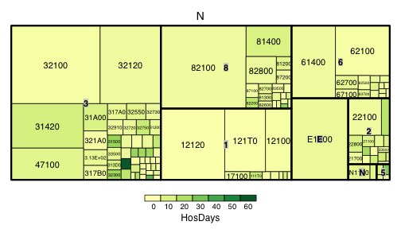

互動式資料呈現
====================================

- [互動式資料呈現](http://yijutseng.github.io/DataScienceRBook/InteractiveGraphics.html)
- [ggvis](http://yijutseng.github.io/DataScienceRBook/InteractiveGraphics.html#ggvis)
- [googleVis](http://yijutseng.github.io/DataScienceRBook/InteractiveGraphics.html#googlevis)
- [Plot.ly](http://yijutseng.github.io/DataScienceRBook/InteractiveGraphics.html#plot.ly)

參考資料
====================================
type:sub-section 

- 官方網站[文件](http://docs.ggplot2.org/current/)
- RStudio製作的[ggplot cheat sheet](https://www.rstudio.com/wp-content/uploads/2016/11/ggplot2-cheatsheet-2.1.pdf)
- DataCamp課程1 [Data Visualization with ggplot2 (Part 1)](https://www.datacamp.com/courses/data-visualization-with-ggplot2-1)
- DataCamp課程2 [Data Visualization with ggplot2 (Part 2)](https://www.datacamp.com/courses/data-visualization-with-ggplot2-2)
- DataCamp課程3 [Data Visualization with ggplot2 (Part 3)](https://www.datacamp.com/courses/data-visualization-with-ggplot2-3)
- [每個人心中都有一碗巷口的牛肉湯](http://tequila1979.blogspot.tw/2017/01/blog-post.html)

