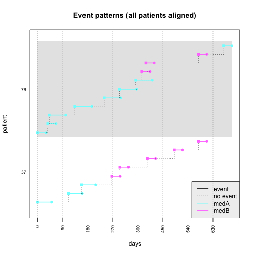
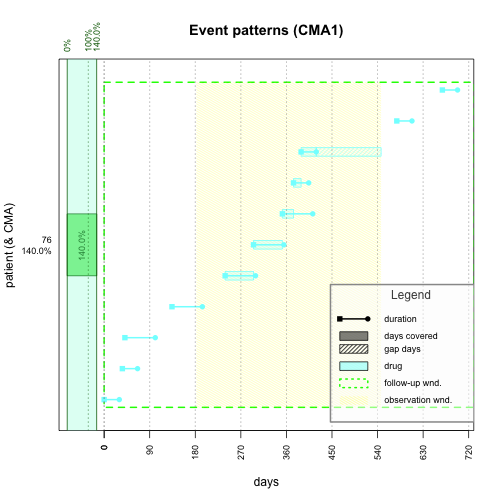

進階醫學資料處理分析
========================================================
author: 長庚資管 曾意儒 Yi-Ju Tseng
autosize: true
font-family: 'Microsoft JhengHei'
navigation: slide

大綱
========================================================
type:sub-section 
- 使用套件清單
- 研究案例篩選
- 醫學資料處理
  - 診斷碼處理
  - 藥物資料處理
  - 多重測量資料整合

使用套件清單
========================================================
- dplyr [官網](https://dplyr.tidyverse.org/)
- icd [教學](https://cran.r-project.org/web/packages/icd/vignettes/introduction.html)
- AdhereR [官網](https://github.com/ddediu/AdhereR)
- emr [官網](https://github.com/DHLab-CGU/emr)

```r
install.packages(c("dplyr","icd",
                   "AdhereR","devtools"))
install.packages(c("tidyr","ggplot2",
                   "MASS","meta","ggrepel","DT"))
devtools::install_github("PheWAS/PheWAS")
devtools::install_github("DHLab-CGU/emr")
```

研究案例篩選
========================================================
type:sub-section 
- 基於特定病人清單
- 基於醫療紀錄
  - 特定診斷碼
  - 在特定時間出現
  - 出現特定次數
- 應保留的重要資料
- 使用針對**資料列Row**做**子集**的概念，可參考[資料科學與R語言](https://yijutseng.github.io/DataScienceRBook/eda.html#filter)

研究案例篩選 - 基於特定病人清單
========================================================

先載入範例資料

```r
library(readr)
DiagSum <- read_csv("DiagSumS.csv")
knitr::kable(DiagSum[1:10,1:5])
```


|院區 | 資料年月|歸戶代號                                 | 輸入日期|住院號                                   |
|:----|--------:|:----------------------------------------|--------:|:----------------------------------------|
|8    |   201604|BAAA072314782F830F02210D13A3A549827A3D67 | 20160421|702C16076DD204640C6A5FC7F59B79F197DDB256 |
|3    |   201604|5D3719C5F07EF19DC4BCAF4CDF3307C2A397337D | 20160418|7E18FC6A8CA3C9CD01FF31AFD23DE0765FCEF7E1 |
|8    |   201604|05A02952E9CB8FF7BBAC1A135ED2A7C7E065B285 | 20160425|9E75B54E1E88CF63E99E543B2EDF48F8478CEC5E |
|2    |   201604|83949E36D0009A4BE9ED122D8219ABF399C66AB2 | 20160416|34B3E2C9602960838D69D8C0215B6F0E46B9E09C |
|3    |   201604|674BBCF56F8B25AF0E78AC5E308039459ECF055B | 20160502|F051C0914711A31F552D53BE3A8FF7F6A4CA6C0B |
|E    |   201606|9583AC8115FA1F428400A10269D7C5EA1258EE0F | 20160623|BBEEBD6E5373AABA417B1973588E50A4BB418916 |
|3    |   201606|026322633E1C2D8D6999445B587AEC7ABF4FBE25 | 20160627|4E78B439FAC4F490A383E738AF0964E512C3EFAD |
|8    |   201606|ECD64C74AAA107ADBD55EA002D054F2FDE2C8B6E | 20160613|11817F33763B2D11EA2F582792881F6F44F104B3 |
|1    |   201606|BA115A73BD30BCDB95493964FB36619325C79810 | 20160616|9F10798D5C4F7FDEADC6A87E43A4E9E2F9CE67E1 |
|3    |   201606|3435DAE792B502572E9C86BB2D431DC2224C3C2D | 20160618|54837CCD1F237967F0FA52F7FD3D9173EFE57366 |

研究案例篩選 - 基於特定病人清單
========================================================

提供歸戶代號清單(向量)，並使用**%in%**篩選符合此條件之所有資料

```r
library(dplyr)
SelectedCase<-DiagSum %>% 
  filter(歸戶代號 %in% c("05A02952E9CB8FF7BBAC1A135ED2A7C7E065B285",
                     "83949E36D0009A4BE9ED122D8219ABF399C66AB2"))
knitr::kable(SelectedCase [1:10,c(1,3,12,26)])
```


|院區 |歸戶代號                                 | 住院日期|診斷類別1 |
|:----|:----------------------------------------|--------:|:---------|
|8    |05A02952E9CB8FF7BBAC1A135ED2A7C7E065B285 | 20160226|C7932     |
|2    |83949E36D0009A4BE9ED122D8219ABF399C66AB2 | 20160412|C50911    |
|8    |05A02952E9CB8FF7BBAC1A135ED2A7C7E065B285 | 20160531|C50811    |
|2    |83949E36D0009A4BE9ED122D8219ABF399C66AB2 | 20160614|C50911    |
|2    |83949E36D0009A4BE9ED122D8219ABF399C66AB2 | 20160705|C50911    |
|2    |83949E36D0009A4BE9ED122D8219ABF399C66AB2 | 20160726|C50911    |
|2    |83949E36D0009A4BE9ED122D8219ABF399C66AB2 | 20160524|C50911    |
|8    |05A02952E9CB8FF7BBAC1A135ED2A7C7E065B285 | 20100629|1748      |
|8    |05A02952E9CB8FF7BBAC1A135ED2A7C7E065B285 | 20100528|1748      |
|2    |83949E36D0009A4BE9ED122D8219ABF399C66AB2 | 20160503|C50911    |


研究案例篩選 - 基於特定病人清單
========================================================
type:alert

- 使用疾病分類統計檔DiagSum與基本資料檔

```r
library(readr)
DiagSum <- read_csv("DiagSumS.csv")
BasicS <- read_csv("BasicS.csv")
knitr::kable(BasicS[1:3,])
```


|院區 |歸戶代號                                 |性別 |     生日|
|:----|:----------------------------------------|:----|--------:|
|1    |DB26EFB5F66F696208693AA3D402D03B2B8D1CB5 |F    | 19581201|
|5    |80DB2AFAAEADC0874A35C71DB8CC693B6B33D7BF |F    | 19680725|
|E    |0E48E47A75EC741DFF678BFDCB36D394546E6A82 |F    | 19540914|
- 篩選條件：只留下**歸戶代號**有出現在**基本資料檔案**中的紀錄
- 符合條件的患者共有幾人？
- 子集 or inner_join()

研究案例篩選 - 基於醫療紀錄
========================================================

提供診斷碼清單(向量)，並使用**%in%**或**grepl()**篩選符合此條件之所有資料


```r
library(dplyr)
# 174.0 Malignant neoplasm of nipple and areola of female breast
# 174.1 Malignant neoplasm of central portion of female breast
SelectedCase<-DiagSum %>% 
  filter(診斷類別1 %in% c("1740","1741"))
knitr::kable(SelectedCase [1:10,c(1,3,12,26)])
```


|院區 |歸戶代號                                 | 住院日期|診斷類別1 |
|:----|:----------------------------------------|--------:|:---------|
|N    |CB97DD083522D6D3F62D67146288DDEADAAC6C96 | 20060618|1741      |
|3    |142FBA9E34A712DEA6E6C086DDBA6B47A48030BA | 20070816|1741      |
|1    |903C5D9A705D2C011F7EC783355958CE03CC3F87 | 20060101|1741      |
|3    |E86879FF32808EC2FC68CB70379C2889748043EB | 20040211|1741      |
|3    |0B69826187B2F6ACF5B60DB1B0EC4F4B1013C20D | 20040520|1741      |
|8    |CDE47E6AC4AB0C98BAA4BD17D17B1BE6D55E894F | 20140703|1741      |
|1    |58E092642ECA3F9C89AC0D381591384A2B14A34F | 20140622|1740      |
|8    |05DC279074ED4AF2E42DCEE034BCA2FDEB928326 | 20150129|1741      |
|8    |71CA2DB3AD17753C889B7BAC7D4B8981B29B66BF | 20141220|1741      |
|NA   |NA                                       |       NA|NA        |


研究案例篩選 - 基於醫療紀錄
========================================================

提供診斷碼清單(向量)，並使用**%in%**或**grepl()**篩選符合此條件之所有資料


```r
library(dplyr)
# 174.* Malignant neoplasm of female breast
SelectedCase<-DiagSum %>% 
  filter(grepl("^174",診斷類別1))
knitr::kable(SelectedCase [1:10,c(1,3,12,26)])
```


|院區 |歸戶代號                                 | 住院日期|診斷類別1 |
|:----|:----------------------------------------|--------:|:---------|
|1    |57F193B5869DA564114CD08B6CE3F67882EAE617 | 20100124|1742      |
|1    |B2F80C7326546F8ADE1D5474119B70424F00FD5F | 20100122|1748      |
|1    |B2F80C7326546F8ADE1D5474119B70424F00FD5F | 20100326|1749      |
|1    |B2F80C7326546F8ADE1D5474119B70424F00FD5F | 20100226|1748      |
|1    |B2F80C7326546F8ADE1D5474119B70424F00FD5F | 20100423|1749      |
|3    |0BC0E21FAE4ADE290D434EA0C2DEC71F86A3C0E8 | 20100504|1742      |
|1    |B2F80C7326546F8ADE1D5474119B70424F00FD5F | 20100626|1749      |
|1    |B2F80C7326546F8ADE1D5474119B70424F00FD5F | 20100521|1749      |
|1    |59B5F0B18A4A1F6B89DBCF46AE1079D7EEA93E2A | 20100516|1744      |
|3    |5ED0C70C64E6CEE7BB8CC488909AE9A1432AD4EA | 20100708|1744      |

研究案例篩選 - 基於醫療紀錄
========================================================
type:alert

- 使用疾病分類統計檔DiagSum
- 篩選條件：**診斷類別1**欄位中，出現**174**開頭或**175**開頭的診斷碼
- 符合條件的患者共有幾人？
- 提示：|

研究案例篩選 - 基於醫療紀錄
========================================================

若要搜尋**多個欄位**，可用以下方式:
- **filter_at**
  - `filter_at(欲篩選欄位,篩選條件)`
  - `vars()`: 用法同`select()`，條列欲篩選欄位
  - `any_vars()`: 其中有一個欄位符合條件即可
  - `all_vars()`: 所有欄位都要符合條件
- 寬表轉長表

研究案例篩選 - 基於醫療紀錄
========================================================
- `filter_at(欲篩選欄位,篩選條件)`
- `vars()`: 用法同`select()`，條列欲篩選欄位
- `any_vars()`: 其中有一個欄位符合條件即可
- `all_vars()`: 所有欄位都要符合條件

```r
library(dplyr)
# 174.* Malignant neoplasm of female breast
SelectedCase<-DiagSum %>% 
  filter_at(vars(starts_with("診斷類別")), 
            any_vars(grepl("^174",.)))
knitr::kable(SelectedCase [1:10,c(1,3,12,26,27,28)])
```


|院區 |歸戶代號                                 | 住院日期|診斷類別1 |診斷類別2 |診斷類別3 |
|:----|:----------------------------------------|--------:|:---------|:---------|:---------|
|1    |B479DED3B05A6A39F32B49730ABAC8D36D63BE89 | 20100111|V581      |1748      |NA        |
|1    |57F193B5869DA564114CD08B6CE3F67882EAE617 | 20100124|1742      |4279      |NA        |
|1    |B2F80C7326546F8ADE1D5474119B70424F00FD5F | 20100122|1748      |NA        |NA        |
|3    |BC9343E012826E01ECE6B33D9C2B774F11EFC549 | 20091216|99859     |1749      |1970      |
|3    |49633CF7DEAAE3D677CF74464AD5F455EA981637 | 20100104|V581      |1748      |5990      |
|3    |BC9343E012826E01ECE6B33D9C2B774F11EFC549 | 20100209|99859     |1749      |1970      |
|1    |57F193B5869DA564114CD08B6CE3F67882EAE617 | 20100222|V581      |1742      |V0261     |
|1    |57F193B5869DA564114CD08B6CE3F67882EAE617 | 20100406|V581      |1742      |NA        |
|1    |57F193B5869DA564114CD08B6CE3F67882EAE617 | 20100315|V581      |1742      |NA        |
|3    |BC9343E012826E01ECE6B33D9C2B774F11EFC549 | 20100222|99859     |1749      |1970      |


研究案例篩選 - 基於醫療紀錄
========================================================

若要搜尋多個欄位，可用以下方式:
- filter_at
- **寬表轉長表**
  - `tidyr`套件中的`gather(data,原欄位名稱,數值名稱,轉長表欄位)`
  - ?select_helpers

```r
library(tidyr)
library(dplyr)
DiagSumForGather<-DiagSum %>% 
  select(院區,歸戶代號,住院日期,num_range("診斷類別",1:10))
knitr::kable(DiagSumForGather [1:10,])
```


|院區 |歸戶代號                                 | 住院日期|診斷類別1 |診斷類別2 |診斷類別3 |診斷類別4 |診斷類別5 |診斷類別6 |診斷類別7 |診斷類別8 |診斷類別9 |診斷類別10 |
|:----|:----------------------------------------|--------:|:---------|:---------|:---------|:---------|:---------|:---------|:---------|:---------|:---------|:----------|
|8    |BAAA072314782F830F02210D13A3A549827A3D67 | 20160415|C182      |C184      |C186      |D630      |C787      |C786      |C784      |C7889     |C770      |Z800       |
|3    |5D3719C5F07EF19DC4BCAF4CDF3307C2A397337D | 20160408|Z5111     |C50912    |F410      |NA        |NA        |NA        |NA        |NA        |NA        |NA         |
|8    |05A02952E9CB8FF7BBAC1A135ED2A7C7E065B285 | 20160226|C7932     |G9529     |C50812    |G8221     |NA        |NA        |NA        |NA        |NA        |NA         |
|2    |83949E36D0009A4BE9ED122D8219ABF399C66AB2 | 20160412|C50911    |NA        |NA        |NA        |NA        |NA        |NA        |NA        |NA        |NA         |
|3    |674BBCF56F8B25AF0E78AC5E308039459ECF055B | 20160331|C50912    |NA        |NA        |NA        |NA        |NA        |NA        |NA        |NA        |NA         |
|E    |9583AC8115FA1F428400A10269D7C5EA1258EE0F | 20160618|Z5111     |C50911    |E119      |R112      |R5383     |Z862      |NA        |NA        |NA        |NA         |
|3    |026322633E1C2D8D6999445B587AEC7ABF4FBE25 | 20160625|Z5111     |C50911    |I10       |E119      |E785      |NA        |NA        |NA        |NA        |NA         |
|8    |ECD64C74AAA107ADBD55EA002D054F2FDE2C8B6E | 20160522|C50212    |C773      |C770      |C7802     |C7989     |I10       |NA        |NA        |NA        |NA         |
|1    |BA115A73BD30BCDB95493964FB36619325C79810 | 20160613|Z5111     |C50911    |E119      |NA        |NA        |NA        |NA        |NA        |NA        |NA         |
|3    |3435DAE792B502572E9C86BB2D431DC2224C3C2D | 20160611|Z5111     |Z5112     |C50912    |C773      |NA        |NA        |NA        |NA        |NA        |NA         |

研究案例篩選 - 基於醫療紀錄
========================================================

若要搜尋多個欄位，可用以下方式:
- filter_at
- **寬表轉長表**
  - `tidyr`套件中的`gather(data,原欄位名稱,數值名稱,轉長表欄位)`

```r
DiagSumLong<-DiagSumForGather %>%
  gather(診斷類別,診斷碼,starts_with("診斷類別"))
knitr::kable(DiagSumLong [1:10,])
```


|院區 |歸戶代號                                 | 住院日期|診斷類別  |診斷碼 |
|:----|:----------------------------------------|--------:|:---------|:------|
|8    |BAAA072314782F830F02210D13A3A549827A3D67 | 20160415|診斷類別1 |C182   |
|3    |5D3719C5F07EF19DC4BCAF4CDF3307C2A397337D | 20160408|診斷類別1 |Z5111  |
|8    |05A02952E9CB8FF7BBAC1A135ED2A7C7E065B285 | 20160226|診斷類別1 |C7932  |
|2    |83949E36D0009A4BE9ED122D8219ABF399C66AB2 | 20160412|診斷類別1 |C50911 |
|3    |674BBCF56F8B25AF0E78AC5E308039459ECF055B | 20160331|診斷類別1 |C50912 |
|E    |9583AC8115FA1F428400A10269D7C5EA1258EE0F | 20160618|診斷類別1 |Z5111  |
|3    |026322633E1C2D8D6999445B587AEC7ABF4FBE25 | 20160625|診斷類別1 |Z5111  |
|8    |ECD64C74AAA107ADBD55EA002D054F2FDE2C8B6E | 20160522|診斷類別1 |C50212 |
|1    |BA115A73BD30BCDB95493964FB36619325C79810 | 20160613|診斷類別1 |Z5111  |
|3    |3435DAE792B502572E9C86BB2D431DC2224C3C2D | 20160611|診斷類別1 |Z5111  |

研究案例篩選 - 基於醫療紀錄
========================================================

若要搜尋多個欄位，可用以下方式:
- filter_at
- **寬表轉長表**
  - `tidyr`套件中的`gather(data,原欄位名稱,數值名稱,轉長表欄位)`

```r
SelectedCase<-DiagSumLong %>% 
  filter(grepl("^174",診斷碼))
knitr::kable(SelectedCase [1:10,])
```


|院區 |歸戶代號                                 | 住院日期|診斷類別  |診斷碼 |
|:----|:----------------------------------------|--------:|:---------|:------|
|1    |57F193B5869DA564114CD08B6CE3F67882EAE617 | 20100124|診斷類別1 |1742   |
|1    |B2F80C7326546F8ADE1D5474119B70424F00FD5F | 20100122|診斷類別1 |1748   |
|1    |B2F80C7326546F8ADE1D5474119B70424F00FD5F | 20100326|診斷類別1 |1749   |
|1    |B2F80C7326546F8ADE1D5474119B70424F00FD5F | 20100226|診斷類別1 |1748   |
|1    |B2F80C7326546F8ADE1D5474119B70424F00FD5F | 20100423|診斷類別1 |1749   |
|3    |0BC0E21FAE4ADE290D434EA0C2DEC71F86A3C0E8 | 20100504|診斷類別1 |1742   |
|1    |B2F80C7326546F8ADE1D5474119B70424F00FD5F | 20100626|診斷類別1 |1749   |
|1    |B2F80C7326546F8ADE1D5474119B70424F00FD5F | 20100521|診斷類別1 |1749   |
|1    |59B5F0B18A4A1F6B89DBCF46AE1079D7EEA93E2A | 20100516|診斷類別1 |1744   |
|3    |5ED0C70C64E6CEE7BB8CC488909AE9A1432AD4EA | 20100708|診斷類別1 |1744   |

研究案例篩選 - 基於醫療紀錄
========================================================
type:alert

- 使用疾病分類統計檔DiagSum
- 篩選條件：**診斷類別1~6**欄位中，出現**1740**或**1741**診斷碼
- 符合條件的患者共有幾人？
- 寬轉長？
- filter_at？

研究案例篩選 - 醫療紀錄+特定時間
========================================================

使用`lubridate`套件中的`ymd()`做日期轉換


```r
library(lubridate)
head(DiagSum$住院日期)
```

```
[1] 20160415 20160408 20160226 20160412 20160331 20160618
```

```r
DiagSum$AdmDate<-ymd(DiagSum$住院日期)
head(DiagSum$AdmDate)
```

```
[1] "2016-04-15" "2016-04-08" "2016-02-26" "2016-04-12" "2016-03-31"
[6] "2016-06-18"
```


研究案例篩選 - 醫療紀錄+特定時間
========================================================

提供診斷碼清單(向量)，並使用**%in%**或**grepl()**篩選符合此條件之所有資料，並加上日期條件


```r
library(dplyr)
# 174.* Malignant neoplasm of female breast
SelectedCase<-DiagSum %>% 
  filter(grepl("^174",診斷類別1)&
           AdmDate>ymd("2012-12-31"))
knitr::kable(SelectedCase [1:10,c(1,3,12,26)])
```


|院區 |歸戶代號                                 | 住院日期|診斷類別1 |
|:----|:----------------------------------------|--------:|:---------|
|8    |A7B2A63E6C58C58A3825B156558BDB9B08993966 | 20140210|1742      |
|3    |AFFD20E7A2A2728BDCBE61E9CA46DA3F46BD2B6D | 20130925|1749      |
|8    |7E4AEE0316A28EB2139AD39388874224112B9774 | 20130304|1749      |
|3    |0F007753270BCACC2DC384A56132F58EF3BDCFA5 | 20130328|1749      |
|8    |E007DFB91FF02101AD75AB1FF95C02D6C010C25D | 20130424|1744      |
|3    |D9232A7B633A4F43B099015E54BD036D57ACE857 | 20131121|1748      |
|3    |0F007753270BCACC2DC384A56132F58EF3BDCFA5 | 20131022|1749      |
|1    |D57CF9517701B15866C4AAA44CD053214784D81F | 20130728|1749      |
|8    |437FF764461388694719D416BC5A2BC1EA34DB17 | 20130714|1744      |
|1    |3EB97C463914D89AEC5BB79B6C54E81B844447F3 | 20130927|1744      |


研究案例篩選 - 醫療紀錄+特定首次診斷時間
========================================================

利用`dplyr`套件協助判斷資料內首次診斷

- 同歸戶代號
- 同**診斷碼**或診斷群組
- 住院時間由小到大排序
- 取同一歸戶代號、同診斷碼的第一筆資料


```r
library(dplyr)
FirstRecord<-DiagSum %>% 
  filter(grepl("^174",診斷類別1)) %>% 
           group_by(歸戶代號) %>%
  arrange(AdmDate) %>% slice(1)
knitr::kable(FirstRecord[1:10,c(1,3,12,26)])
```


|院區 |歸戶代號                                 | 住院日期|診斷類別1 |
|:----|:----------------------------------------|--------:|:---------|
|3    |00B766EC8F773BF7B5D932161CB1385997DEAA41 | 20110316|1748      |
|1    |0176B6DEBF43D8D78768D6678E3348FB2DBB40AA | 20090607|1744      |
|1    |03DACAAA84AA7C66EABE6CB2B5960BF8FBC59792 | 20130505|1749      |
|1    |04D85B2FA6D7B18F3396921347BDCB542329FD89 | 20101205|1742      |
|8    |05A02952E9CB8FF7BBAC1A135ED2A7C7E065B285 | 20100528|1748      |
|8    |05DC279074ED4AF2E42DCEE034BCA2FDEB928326 | 20150129|1741      |
|8    |05E34DD62D8CB436CD0D3086AC681ED024512385 | 20081109|1742      |
|8    |066621B2355FB7687DF0F2C9C66F81B9BE16013E | 20150823|1742      |
|1    |0681F5827C1CA8129D038B9E127D7629D5B417FA | 20141123|1749      |
|8    |070637BACE79ADDA1BBBAF025941777A5808357C | 20140807|1742      |


研究案例篩選 - 醫療紀錄+特定首次診斷時間
========================================================

利用`dplyr`套件協助判斷資料內首次診斷

- 同歸戶代號
- 同診斷碼或**診斷群組**
- 住院時間由小到大排序
- 取同一歸戶代號、同**診斷群組**的第一筆資料


```r
library(dplyr)
FirstRecord<-DiagSum %>% group_by(歸戶代號,診斷類別1) %>%
  arrange(AdmDate) %>% slice(1)
knitr::kable(FirstRecord[1:10,c(1,3,12,26)])
```


|院區 |歸戶代號                                 | 住院日期|診斷類別1 |
|:----|:----------------------------------------|--------:|:---------|
|3    |00B766EC8F773BF7B5D932161CB1385997DEAA41 | 20110316|1748      |
|3    |00E05BA39F1C72D1A508C04DD4F92EC78791F573 | 20091105|2113      |
|3    |00E05BA39F1C72D1A508C04DD4F92EC78791F573 | 20050821|6180      |
|1    |0176B6DEBF43D8D78768D6678E3348FB2DBB40AA | 20090607|1744      |
|3    |0176B6DEBF43D8D78768D6678E3348FB2DBB40AA | 20140103|38610     |
|3    |0176B6DEBF43D8D78768D6678E3348FB2DBB40AA | 20121005|38612     |
|3    |0176B6DEBF43D8D78768D6678E3348FB2DBB40AA | 20130705|4139      |
|3    |0176B6DEBF43D8D78768D6678E3348FB2DBB40AA | 20140626|41401     |
|3    |0176B6DEBF43D8D78768D6678E3348FB2DBB40AA | 20041230|49322     |
|3    |0176B6DEBF43D8D78768D6678E3348FB2DBB40AA | 20140814|49390     |


研究案例篩選 - 醫療紀錄+特定首次診斷時間
========================================================

利用`dplyr`套件協助判斷資料內首次診斷

- 同歸戶代號
- 同診斷碼或**診斷群組**
- 住院時間由小到大排序
- 取同一歸戶代號、同**診斷群組**的第一筆資料


```r
library(dplyr)
FirstRecord<-DiagSum %>% group_by(歸戶代號,診斷類別1) %>%
  arrange(AdmDate) %>% slice(1)
knitr::kable(FirstRecord[1:10,c(1,3,12,26)])
```


|院區 |歸戶代號                                 | 住院日期|診斷類別1 |
|:----|:----------------------------------------|--------:|:---------|
|3    |00B766EC8F773BF7B5D932161CB1385997DEAA41 | 20110316|1748      |
|3    |00E05BA39F1C72D1A508C04DD4F92EC78791F573 | 20091105|2113      |
|3    |00E05BA39F1C72D1A508C04DD4F92EC78791F573 | 20050821|6180      |
|1    |0176B6DEBF43D8D78768D6678E3348FB2DBB40AA | 20090607|1744      |
|3    |0176B6DEBF43D8D78768D6678E3348FB2DBB40AA | 20140103|38610     |
|3    |0176B6DEBF43D8D78768D6678E3348FB2DBB40AA | 20121005|38612     |
|3    |0176B6DEBF43D8D78768D6678E3348FB2DBB40AA | 20130705|4139      |
|3    |0176B6DEBF43D8D78768D6678E3348FB2DBB40AA | 20140626|41401     |
|3    |0176B6DEBF43D8D78768D6678E3348FB2DBB40AA | 20041230|49322     |
|3    |0176B6DEBF43D8D78768D6678E3348FB2DBB40AA | 20140814|49390     |

研究案例篩選 - 醫療紀錄+特定首次診斷時間
========================================================
type:alert

- 使用疾病分類統計檔DiagSum
- 篩選條件：**診斷類別1~6**欄位中，**1740**或**1741**診斷碼第一次出現的日期在2014年的患者
- 符合條件的患者共有幾人？
- 寬轉長？
- filter_at？

研究案例篩選 - 醫療紀錄+出現特定次數
========================================================

利用`dplyr`套件協助判斷資料特定診斷出現次數

- 同歸戶代號`group_by()`
- 同**診斷碼**或診斷群組`group_by()`
- 取同一歸戶代號、同**診斷碼**的資料筆數`Count`


```r
library(dplyr)
DiagCount<-DiagSum %>% 
  group_by(歸戶代號,診斷類別1) %>% summarise(Count=n())
knitr::kable(DiagCount[1:10,])
```


|歸戶代號                                 |診斷類別1 | Count|
|:----------------------------------------|:---------|-----:|
|00B766EC8F773BF7B5D932161CB1385997DEAA41 |1748      |     1|
|00E05BA39F1C72D1A508C04DD4F92EC78791F573 |2113      |     1|
|00E05BA39F1C72D1A508C04DD4F92EC78791F573 |6180      |     1|
|0176B6DEBF43D8D78768D6678E3348FB2DBB40AA |1744      |     1|
|0176B6DEBF43D8D78768D6678E3348FB2DBB40AA |38610     |     1|
|0176B6DEBF43D8D78768D6678E3348FB2DBB40AA |38612     |     1|
|0176B6DEBF43D8D78768D6678E3348FB2DBB40AA |4139      |     1|
|0176B6DEBF43D8D78768D6678E3348FB2DBB40AA |41401     |     1|
|0176B6DEBF43D8D78768D6678E3348FB2DBB40AA |49322     |     1|
|0176B6DEBF43D8D78768D6678E3348FB2DBB40AA |49390     |     1|

研究案例篩選 - 醫療紀錄+出現特定次數
========================================================

利用`dplyr`套件協助判斷資料特定診斷出現次數

- 同歸戶代號`group_by()`
- 同診斷碼或**診斷群組**`group_by()`
- 取同一歸戶代號、同**診斷群組**的資料筆數`Count`


```r
library(dplyr)
DiagCount<-DiagSum %>% 
  filter(grepl("^174",診斷類別1)) %>% 
  group_by(歸戶代號) %>% summarise(Count=n())
knitr::kable(DiagCount[1:10,])
```


|歸戶代號                                 | Count|
|:----------------------------------------|-----:|
|00B766EC8F773BF7B5D932161CB1385997DEAA41 |     1|
|0176B6DEBF43D8D78768D6678E3348FB2DBB40AA |     1|
|03DACAAA84AA7C66EABE6CB2B5960BF8FBC59792 |     1|
|04D85B2FA6D7B18F3396921347BDCB542329FD89 |     1|
|05A02952E9CB8FF7BBAC1A135ED2A7C7E065B285 |     2|
|05DC279074ED4AF2E42DCEE034BCA2FDEB928326 |     1|
|05E34DD62D8CB436CD0D3086AC681ED024512385 |     1|
|066621B2355FB7687DF0F2C9C66F81B9BE16013E |     1|
|0681F5827C1CA8129D038B9E127D7629D5B417FA |     2|
|070637BACE79ADDA1BBBAF025941777A5808357C |     1|

研究案例篩選 - 醫療紀錄+時間內出現多次
========================================================

利用`dplyr`套件協助判斷資料特定診斷出現次數

- 同歸戶代號`group_by()`
- 同**診斷碼**或診斷群組`group_by()`
- 住院時間由小到大排序
- 計算診斷時間間隔
- 取同一歸戶代號、同**診斷碼**的資料筆數`Count`


```r
library(dplyr)
DiagCount<-DiagSum %>% 
  group_by(歸戶代號,診斷類別1) %>% 
  arrange(歸戶代號,診斷類別1,AdmDate)%>%
  mutate(Gap=(lead(AdmDate)-AdmDate),isFit=Gap<365) %>%
  summarise(Count=sum(isFit,na.rm = T))
DiagCount %>% arrange(desc(Count)) %>%
  head() %>%knitr::kable()
```


|歸戶代號                                 |診斷類別1 | Count|
|:----------------------------------------|:---------|-----:|
|DDF87DF95BBE2A307F8990DD73E24D90037D981C |V581      |    29|
|CFB70120AB9762B7CD3702DC56A7303AE24DD81D |V581      |    23|
|66DF791F1AC1FB65AD81111876AB535EC6BEEA14 |V581      |    20|
|4DF238036B3C27E93AF4D002E2090C62ABBB2C16 |V581      |    19|
|88BACAB1B03C638855F7A2ED7D272736AE3634E8 |V581      |    19|
|53979DEA0D192868DD24C6ADF9C0FBAA19D87032 |V581      |    17|

研究案例篩選 - 醫療紀錄+時間內出現多次 步驟1
========================================================
分組排序

```r
DiagSum %>% 
  group_by(歸戶代號,診斷類別1) %>% 
  arrange(歸戶代號,診斷類別1,AdmDate) %>% 
  select(歸戶代號,診斷類別1,AdmDate) %>%
  filter(歸戶代號=="43CCF41959798888F18EAED638A141F37A2B15C8") %>%
  head() %>% knitr::kable()
```


|歸戶代號                                 |診斷類別1 |AdmDate    |
|:----------------------------------------|:---------|:----------|
|43CCF41959798888F18EAED638A141F37A2B15C8 |1744      |2003-03-20 |
|43CCF41959798888F18EAED638A141F37A2B15C8 |1744      |2005-10-19 |
|43CCF41959798888F18EAED638A141F37A2B15C8 |1744      |2005-11-24 |
|43CCF41959798888F18EAED638A141F37A2B15C8 |1744      |2005-12-09 |
|43CCF41959798888F18EAED638A141F37A2B15C8 |1972      |2005-08-09 |
|43CCF41959798888F18EAED638A141F37A2B15C8 |6213      |2004-12-16 |

研究案例篩選 - 醫療紀錄+時間內出現多次  步驟2
========================================================
前後列相減

```r
DiagSum %>% 
  group_by(歸戶代號,診斷類別1) %>% 
  arrange(歸戶代號,診斷類別1,AdmDate)%>%
  mutate(Gap=(lead(AdmDate)-AdmDate),isFit=Gap<365) %>% 
  select(歸戶代號,診斷類別1,AdmDate,Gap,isFit) %>%
  filter(歸戶代號=="43CCF41959798888F18EAED638A141F37A2B15C8") %>%
  head() %>% knitr::kable()
```


|歸戶代號                                 |診斷類別1 |AdmDate    |Gap      |isFit |
|:----------------------------------------|:---------|:----------|:--------|:-----|
|43CCF41959798888F18EAED638A141F37A2B15C8 |1744      |2003-03-20 |944 days |FALSE |
|43CCF41959798888F18EAED638A141F37A2B15C8 |1744      |2005-10-19 |36 days  |TRUE  |
|43CCF41959798888F18EAED638A141F37A2B15C8 |1744      |2005-11-24 |15 days  |TRUE  |
|43CCF41959798888F18EAED638A141F37A2B15C8 |1744      |2005-12-09 |NA       |NA    |
|43CCF41959798888F18EAED638A141F37A2B15C8 |1972      |2005-08-09 |NA       |NA    |
|43CCF41959798888F18EAED638A141F37A2B15C8 |6213      |2004-12-16 |NA       |NA    |

研究案例篩選 - 醫療紀錄+時間內出現多次
========================================================
計算TRUE的個數


```r
DiagSum %>% 
  group_by(歸戶代號,診斷類別1) %>% 
  arrange(歸戶代號,診斷類別1,AdmDate)%>%
  mutate(Gap=(lead(AdmDate)-AdmDate),isFit=Gap<365) %>%
  summarise(Count=sum(isFit,na.rm = T)) %>% 
  select(歸戶代號,診斷類別1,Count) %>%
  filter(歸戶代號=="43CCF41959798888F18EAED638A141F37A2B15C8") %>%
  head() %>% knitr::kable()
```


|歸戶代號                                 |診斷類別1 | Count|
|:----------------------------------------|:---------|-----:|
|43CCF41959798888F18EAED638A141F37A2B15C8 |1744      |     2|
|43CCF41959798888F18EAED638A141F37A2B15C8 |1972      |     0|
|43CCF41959798888F18EAED638A141F37A2B15C8 |6213      |     0|
|43CCF41959798888F18EAED638A141F37A2B15C8 |V581      |     0|

研究案例篩選 - 醫療紀錄+時間內出現多次
========================================================
type:alert

- 使用疾病分類統計檔DiagSum
- 診斷類別**1~6欄位**中，出現**174**開頭診斷碼在60天內大於1次
- 符合條件的患者共有幾人？

研究案例篩選 - 應保留的重要資料
========================================================
- ID
- 時間
- 診斷碼或其他篩選條件
- 出生年月日（可計算診斷年齡）

研究案例篩選 - 小結
========================================================
- `dplyr`套件是你的好朋友
- 資料量大（txt檔超過500MB）改用`data.table`套件，加速處理
  - `data.table` [教學](http://yijutseng.github.io/DataScienceRBook/eda.html#datatable)
- 搭配`tidyr`套件使用
  - 長寬表轉換


醫學資料處理: 診斷碼處理
========================================================
type:sub-section 

- icd 9 vs. icd 10
- icd轉型
- icd分群
- `emr`套件

醫學資料處理: 診斷碼處理 -icd 9 vs. icd 10
========================================================


醫學資料處理: 診斷碼處理 -icd轉型
========================================================
174.8 vs. 1748 ?

MALIGNANT NEOPLASM OF OTHER SPECIFIED SITES OF FEMALE BREAST

```r
DiagSum %>% 
  filter(診斷類別1=="1748") %>% 
  select(歸戶代號,住院日期,診斷類別1) %>%
  head() %>% knitr::kable()
```


|歸戶代號                                 | 住院日期|診斷類別1 |
|:----------------------------------------|--------:|:---------|
|B2F80C7326546F8ADE1D5474119B70424F00FD5F | 20100122|1748      |
|B2F80C7326546F8ADE1D5474119B70424F00FD5F | 20100226|1748      |
|A54C54685232EBDFACC384513BD4673377BB7057 | 20100912|1748      |
|DDC5108FE11AA36C336B27FF9015FB364C737DFB | 20110816|1748      |
|62B577E63C6B4E59620887B4779C5AB130686327 | 20111127|1748      |
|D1FE3231A588F711B84010E22002ED43994F7583 | 20090104|1748      |

醫學資料處理: 診斷碼處理 -icd轉型
========================================================
使用`icd`套件，icd 9和icd 10分開處理

- 將icd 9 和 10分開
  - 2016-01-01
  - 跨年度資料要特別檢查
- 分別使用`icd_short_to_decimal()`轉換


```r
DiagSumICD9<-DiagSum %>% 
  filter(出院日期<"20160101") 
DiagSumICD10<-DiagSum %>% 
  filter(出院日期>="20160101") 
```

醫學資料處理: 診斷碼處理 -icd轉型
========================================================
使用`icd`套件，icd 9和icd 10分開處理

- 將icd 9 和 10分開
  - 2016-01-01
  - 跨年度資料要特別檢查
- 分別使用`icd_short_to_decimal()`轉換

```r
library(icd)
icd_short_to_decimal.icd9(DiagSumICD9$診斷類別1) %>% head()
```

```
[1] "514"    "V58.1"  "174.2"  "174.8"  "384.2"  "998.59"
attr(,"icd_short_diag")
[1] FALSE
attr(,"class")
[1] "icd9"      "character"
```

```r
icd_short_to_decimal.icd10(DiagSumICD10$診斷類別1) %>% head()
```

```
[1] "C18.2"   "Z51.11"  "C79.32"  "C50.911" "C50.912" "Z51.11" 
attr(,"icd_short_diag")
[1] FALSE
attr(,"class")
[1] "icd10"     "character"
```


醫學資料處理: 診斷碼處理 -icd分群
========================================================
- 不可能每個診斷碼都視為不同病 --> 須整合
  -使用`icd`套件，將icd 9和icd 10分群
  - [Elixhauser](https://www.hcup-us.ahrq.gov/toolssoftware/comorbidity/comorbidity.jsp)
  

```r
DiagSumICD10Small<-
  DiagSumICD10 %>% select(歸戶代號,診斷類別1)
library(icd)
icd10_comorbid_elix(DiagSumICD10Small) %>% 
  head() %>% knitr::kable()
```


|                                         |CHF   |Arrhythmia |Valvular |PHTN  |PVD   |HTN   |Paralysis |NeuroOther |Pulmonary |DM    |DMcx  |Hypothyroid |Renal |Liver |PUD   |HIV   |Lymphoma |Mets  |Tumor |Rheumatic |Coagulopathy |Obesity |WeightLoss |FluidsLytes |BloodLoss |Anemia |Alcohol |Drugs |Psychoses |Depression |
|:----------------------------------------|:-----|:----------|:--------|:-----|:-----|:-----|:---------|:----------|:---------|:-----|:-----|:-----------|:-----|:-----|:-----|:-----|:--------|:-----|:-----|:---------|:------------|:-------|:----------|:-----------|:---------|:------|:-------|:-----|:---------|:----------|
|BAAA072314782F830F02210D13A3A549827A3D67 |FALSE |FALSE      |FALSE    |FALSE |FALSE |FALSE |FALSE     |FALSE      |FALSE     |FALSE |FALSE |FALSE       |FALSE |FALSE |TRUE  |FALSE |FALSE    |FALSE |TRUE  |FALSE     |FALSE        |FALSE   |FALSE      |FALSE       |FALSE     |FALSE  |FALSE   |FALSE |FALSE     |FALSE      |
|5D3719C5F07EF19DC4BCAF4CDF3307C2A397337D |FALSE |FALSE      |FALSE    |FALSE |FALSE |FALSE |FALSE     |FALSE      |FALSE     |FALSE |FALSE |FALSE       |FALSE |FALSE |FALSE |FALSE |FALSE    |FALSE |TRUE  |FALSE     |FALSE        |FALSE   |FALSE      |FALSE       |FALSE     |FALSE  |FALSE   |FALSE |FALSE     |FALSE      |
|05A02952E9CB8FF7BBAC1A135ED2A7C7E065B285 |FALSE |FALSE      |FALSE    |FALSE |FALSE |FALSE |FALSE     |FALSE      |FALSE     |FALSE |FALSE |FALSE       |FALSE |FALSE |FALSE |FALSE |FALSE    |TRUE  |FALSE |FALSE     |FALSE        |FALSE   |FALSE      |FALSE       |FALSE     |FALSE  |FALSE   |FALSE |FALSE     |FALSE      |
|83949E36D0009A4BE9ED122D8219ABF399C66AB2 |FALSE |FALSE      |FALSE    |FALSE |FALSE |FALSE |FALSE     |FALSE      |FALSE     |FALSE |FALSE |FALSE       |FALSE |FALSE |FALSE |FALSE |FALSE    |FALSE |TRUE  |FALSE     |FALSE        |FALSE   |FALSE      |FALSE       |FALSE     |FALSE  |FALSE   |FALSE |FALSE     |FALSE      |
|674BBCF56F8B25AF0E78AC5E308039459ECF055B |FALSE |FALSE      |FALSE    |FALSE |FALSE |FALSE |FALSE     |FALSE      |FALSE     |FALSE |FALSE |FALSE       |FALSE |FALSE |FALSE |FALSE |FALSE    |FALSE |TRUE  |FALSE     |FALSE        |FALSE   |FALSE      |FALSE       |FALSE     |FALSE  |FALSE   |FALSE |FALSE     |FALSE      |
|9583AC8115FA1F428400A10269D7C5EA1258EE0F |FALSE |FALSE      |FALSE    |FALSE |FALSE |FALSE |FALSE     |FALSE      |FALSE     |FALSE |FALSE |FALSE       |FALSE |FALSE |FALSE |FALSE |FALSE    |FALSE |TRUE  |FALSE     |FALSE        |FALSE   |FALSE      |FALSE       |FALSE     |FALSE  |FALSE   |FALSE |FALSE     |FALSE      |

醫學資料處理: 診斷碼處理 -icd分群
========================================================
- 不可能每個診斷碼都視為不同病 --> 須整合
  -使用`emr`套件，將icd 9和icd 10分群
  - CCS
      - [icd 9](https://www.hcup-us.ahrq.gov/toolssoftware/ccs/ccs.jsp)
      - [icd 10](https://www.hcup-us.ahrq.gov/toolssoftware/ccs10/ccs10.jsp)
      - `groupIcdBasedOnCCS(資料名稱,ID欄位名稱,診斷碼欄位名稱,日期欄位名稱,ICD10轉換日)`

```r
## bug 修復中
library(emr)
groupIcdBasedOnCCS(DiagSum,歸戶代號,
                    診斷類別1,AdmDate,"2016-01-01")
```


醫學資料處理: 藥物資料處理
========================================================
type:sub-section 

- `AdhereR`
  - Estimating the adherence to medications 
  - [教學](https://cran.r-project.org/web/packages/AdhereR/vignettes/AdhereR-overview.html)

醫學資料處理: 藥物資料載入
========================================================

```r
library(AdhereR)
ExamplePats <- 
  med.events[med.events$PATIENT_ID %in% c(37, 76), ]
knitr::kable(ExamplePats)
```


|    | PATIENT_ID|DATE       | PERDAY|CATEGORY | DURATION|
|:---|----------:|:----------|------:|:--------|--------:|
|14  |         37|04/10/2036 |      4|medA     |       50|
|15  |         37|07/30/2036 |      4|medA     |       50|
|16  |         37|09/15/2036 |      4|medA     |       50|
|17  |         37|01/02/2037 |      4|medB     |       30|
|18  |         37|01/31/2037 |      4|medB     |       30|
|19  |         37|05/09/2037 |      4|medB     |       30|
|20  |         37|08/13/2037 |      4|medB     |       30|
|21  |         37|11/09/2037 |      4|medB     |       30|
|813 |         76|12/13/2035 |     20|medA     |       30|
|814 |         76|01/18/2036 |     20|medA     |       30|
|815 |         76|01/23/2036 |      2|medA     |       60|
|816 |         76|04/25/2036 |      2|medA     |       60|
|817 |         76|08/08/2036 |      2|medA     |       60|
|818 |         76|10/03/2036 |      2|medA     |       60|
|819 |         76|11/29/2036 |      2|medA     |       60|
|820 |         76|12/21/2036 |      6|medB     |       30|
|821 |         76|01/05/2037 |      6|medB     |       30|
|822 |         76|07/13/2037 |      6|medB     |       30|
|823 |         76|10/11/2037 |      2|medA     |       30|

醫學資料處理: 藥物資料視覺化
========================================================

```r
cma0 <- CMA0(data=ExamplePats,
             ID.colname="PATIENT_ID", 
             event.date.colname="DATE", 
             event.duration.colname="DURATION", 
             event.daily.dose.colname="PERDAY", 
             medication.class.colname="CATEGORY", 
             followup.window.start=0,  
             observation.window.start=182, 
             observation.window.duration=365,
             date.format="%m/%d/%Y");
plot(cma0, 
     align.all.patients=TRUE); 
```


醫學資料處理: 藥物資料視覺化
========================================================

```r
plot(cma0, 
     align.all.patients=TRUE); 
```



醫學資料處理: 藥物遵從性計算
========================================================
CMA1~8

```r
cma1 <- CMA1(data=ExamplePats,
             ID.colname="PATIENT_ID",
             event.date.colname="DATE",
             event.duration.colname="DURATION",
             followup.window.start=0, 
             observation.window.start=182, 
             observation.window.duration=365,
             date.format="%m/%d/%Y");
cma1$CMA
```

```
  PATIENT_ID       CMA
1         37 0.4035874
2         76 1.4000000
```


醫學資料處理: 藥物資料視覺化
========================================================

```r
# plot only patient 76 
plot(cma1, 
     patients.to.plot=c("76"), 
     legend.x=520); 
```




醫學資料處理: 多重測量資料整合
========================================================
type:sub-section 

- 許多醫療紀錄在一段時間內有有多筆資料
  - 量多次血壓
  - 測多次血糖
  - 等等等...
- 處理方式
  - 不處理
  - 取平均、最大、最小
  - 取第一點、最後一點
  - 取變化量
  
  
醫學資料處理: 多重測量資料整合
========================================================
先載入範例資料

```r
library(readr)
LabSum <- read_csv("LabS.csv")
knitr::kable(LabSum[1:10,c(3,9,10,12)])
```


|歸戶代號                                 |檢驗名稱縮寫  | 輸入日期|檢驗結果值 |
|:----------------------------------------|:-------------|--------:|:----------|
|3AC44AC524BF69C01DA5D8B0404AC8946F014B01 |T-Cholesterol | 20081118|209        |
|3AC44AC524BF69C01DA5D8B0404AC8946F014B01 |Triglyceride  | 20081118|113        |
|3AC44AC524BF69C01DA5D8B0404AC8946F014B01 |Creatinine    | 20081118|0.65       |
|3AC44AC524BF69C01DA5D8B0404AC8946F014B01 |AST/GOT       | 20081118|9          |
|3AC44AC524BF69C01DA5D8B0404AC8946F014B01 |ALT/GPT       | 20081118|14         |
|FA2367C2F4ABB9D48863609C6E5CFF0C38AF65F6 |CA15-3        | 20081119|14.5       |
|9DDEFF6F7E87E37546A978A42041C65145F88862 |Hematocrit    | 20110914|36.2       |
|9DDEFF6F7E87E37546A978A42041C65145F88862 |MCV           | 20110914|89.6       |
|9DDEFF6F7E87E37546A978A42041C65145F88862 |MCH           | 20110914|29.7       |
|9DDEFF6F7E87E37546A978A42041C65145F88862 |MCHC          | 20110914|33.1       |

  
多重測量資料整合: 取平均、最大、最小、變化量
=======================================================
- 使用`dplyr`，搭配`group_by()`、`summarise()`。
- 別忘了將檢驗結果轉成數值型態！

```r
LabSum %>% group_by(歸戶代號,檢驗名稱縮寫,檢體) %>%
  mutate(Result=as.numeric(檢驗結果值)) %>%
  summarise(COUNT=n(),
            MEAN=mean(Result),
            MAX=max(Result),
            MIN=min(Result),
            SD=sd(Result)) %>%
  knitr::kable()
```


|歸戶代號                                 |檢驗名稱縮寫    |檢體 | COUNT|          MEAN|       MAX|       MIN|           SD|
|:----------------------------------------|:---------------|:----|-----:|-------------:|---------:|---------:|------------:|
|00E05BA39F1C72D1A508C04DD4F92EC78791F573 |Albumin         |B    |     1|     4.1000000|     4.100|     4.100|           NA|
|00E05BA39F1C72D1A508C04DD4F92EC78791F573 |ALK-P           |B    |     1|    74.0000000|    74.000|    74.000|           NA|
|00E05BA39F1C72D1A508C04DD4F92EC78791F573 |ALT/GPT         |B    |     1|    69.0000000|    69.000|    69.000|           NA|
|00E05BA39F1C72D1A508C04DD4F92EC78791F573 |AST/GOT         |B    |     1|    71.0000000|    71.000|    71.000|           NA|
|00E05BA39F1C72D1A508C04DD4F92EC78791F573 |Bacteria        |U    |     1|            NA|        NA|        NA|           NA|
|00E05BA39F1C72D1A508C04DD4F92EC78791F573 |Basophil        |B    |     1|     0.3000000|     0.300|     0.300|           NA|
|00E05BA39F1C72D1A508C04DD4F92EC78791F573 |Bilirubin       |U    |     1|            NA|        NA|        NA|           NA|
|00E05BA39F1C72D1A508C04DD4F92EC78791F573 |Blood           |U    |     1|            NA|        NA|        NA|           NA|
|00E05BA39F1C72D1A508C04DD4F92EC78791F573 |BUN             |B    |     1|    10.4000000|    10.400|    10.400|           NA|
|00E05BA39F1C72D1A508C04DD4F92EC78791F573 |Cl              |B    |     1|   105.0000000|   105.000|   105.000|           NA|
|00E05BA39F1C72D1A508C04DD4F92EC78791F573 |Color           |U    |     1|            NA|        NA|        NA|           NA|
|00E05BA39F1C72D1A508C04DD4F92EC78791F573 |Creatinine      |B    |     1|     0.6600000|     0.660|     0.660|           NA|
|00E05BA39F1C72D1A508C04DD4F92EC78791F573 |D. Bilirubin    |B    |     1|     0.2000000|     0.200|     0.200|           NA|
|00E05BA39F1C72D1A508C04DD4F92EC78791F573 |Eosinophil      |B    |     1|     1.3000000|     1.300|     1.300|           NA|
|00E05BA39F1C72D1A508C04DD4F92EC78791F573 |Epith-Cell      |U    |     1|    10.0000000|    10.000|    10.000|           NA|
|00E05BA39F1C72D1A508C04DD4F92EC78791F573 |Glucose         |U    |     1|            NA|        NA|        NA|           NA|
|00E05BA39F1C72D1A508C04DD4F92EC78791F573 |Glucose(AC)     |B    |     1|   105.0000000|   105.000|   105.000|           NA|
|00E05BA39F1C72D1A508C04DD4F92EC78791F573 |Hematocrit      |B    |     1|    41.2000000|    41.200|    41.200|           NA|
|00E05BA39F1C72D1A508C04DD4F92EC78791F573 |Hemoglobin      |B    |     1|    13.4000000|    13.400|    13.400|           NA|
|00E05BA39F1C72D1A508C04DD4F92EC78791F573 |K               |B    |     1|     3.3000000|     3.300|     3.300|           NA|
|00E05BA39F1C72D1A508C04DD4F92EC78791F573 |Ketone          |U    |     1|            NA|        NA|        NA|           NA|
|00E05BA39F1C72D1A508C04DD4F92EC78791F573 |Leukocyte       |U    |     1|            NA|        NA|        NA|           NA|
|00E05BA39F1C72D1A508C04DD4F92EC78791F573 |Lymphocyte      |B    |     1|    42.6000000|    42.600|    42.600|           NA|
|00E05BA39F1C72D1A508C04DD4F92EC78791F573 |MCH             |B    |     1|    30.5000000|    30.500|    30.500|           NA|
|00E05BA39F1C72D1A508C04DD4F92EC78791F573 |MCHC            |B    |     1|    32.5000000|    32.500|    32.500|           NA|
|00E05BA39F1C72D1A508C04DD4F92EC78791F573 |MCV             |B    |     1|    93.6000000|    93.600|    93.600|           NA|
|00E05BA39F1C72D1A508C04DD4F92EC78791F573 |Monocyte        |B    |     1|     5.8000000|     5.800|     5.800|           NA|
|00E05BA39F1C72D1A508C04DD4F92EC78791F573 |Nitrite         |U    |     1|            NA|        NA|        NA|           NA|
|00E05BA39F1C72D1A508C04DD4F92EC78791F573 |pH              |U    |     1|     6.5000000|     6.500|     6.500|           NA|
|00E05BA39F1C72D1A508C04DD4F92EC78791F573 |Platelets       |B    |     1|   196.0000000|   196.000|   196.000|           NA|
|00E05BA39F1C72D1A508C04DD4F92EC78791F573 |Protein         |U    |     1|            NA|        NA|        NA|           NA|
|00E05BA39F1C72D1A508C04DD4F92EC78791F573 |RBC             |B    |     1|     4.4000000|     4.400|     4.400|           NA|
|00E05BA39F1C72D1A508C04DD4F92EC78791F573 |RBC             |U    |     1|     1.0000000|     1.000|     1.000|           NA|
|00E05BA39F1C72D1A508C04DD4F92EC78791F573 |RDW             |B    |     1|    13.9000000|    13.900|    13.900|           NA|
|00E05BA39F1C72D1A508C04DD4F92EC78791F573 |Segment         |B    |     1|    50.0000000|    50.000|    50.000|           NA|
|00E05BA39F1C72D1A508C04DD4F92EC78791F573 |SP.Gravity      |U    |     1|     1.0030000|     1.003|     1.003|           NA|
|00E05BA39F1C72D1A508C04DD4F92EC78791F573 |Total Bilirubin |B    |     1|     0.5000000|     0.500|     0.500|           NA|
|00E05BA39F1C72D1A508C04DD4F92EC78791F573 |Total Protein   |B    |     1|     7.6000000|     7.600|     7.600|           NA|
|00E05BA39F1C72D1A508C04DD4F92EC78791F573 |Turbidity       |U    |     1|            NA|        NA|        NA|           NA|
|00E05BA39F1C72D1A508C04DD4F92EC78791F573 |Urobilinogen    |U    |     1|     0.1000000|     0.100|     0.100|           NA|
|00E05BA39F1C72D1A508C04DD4F92EC78791F573 |WBC             |B    |     1|     7.2000000|     7.200|     7.200|           NA|
|00E05BA39F1C72D1A508C04DD4F92EC78791F573 |WBC             |U    |     1|    51.0000000|    51.000|    51.000|           NA|
|00E05BA39F1C72D1A508C04DD4F92EC78791F573 |NA              |B    |     1|   139.0000000|   139.000|   139.000|           NA|
|0176B6DEBF43D8D78768D6678E3348FB2DBB40AA |ALK-P           |B    |     1|    59.0000000|    59.000|    59.000|           NA|
|0176B6DEBF43D8D78768D6678E3348FB2DBB40AA |AST/GOT         |B    |     1|    14.0000000|    14.000|    14.000|           NA|
|0176B6DEBF43D8D78768D6678E3348FB2DBB40AA |Creatinine      |B    |     1|     0.9300000|     0.930|     0.930|           NA|
|0176B6DEBF43D8D78768D6678E3348FB2DBB40AA |Estimated GFR   |B    |     1|            NA|        NA|        NA|           NA|
|0176B6DEBF43D8D78768D6678E3348FB2DBB40AA |Hematocrit      |B    |     1|    35.7000000|    35.700|    35.700|           NA|
|0176B6DEBF43D8D78768D6678E3348FB2DBB40AA |Hemoglobin      |B    |     1|    11.6000000|    11.600|    11.600|           NA|
|0176B6DEBF43D8D78768D6678E3348FB2DBB40AA |MCH             |B    |     1|    29.2000000|    29.200|    29.200|           NA|
|0176B6DEBF43D8D78768D6678E3348FB2DBB40AA |MCHC            |B    |     1|    32.5000000|    32.500|    32.500|           NA|
|0176B6DEBF43D8D78768D6678E3348FB2DBB40AA |MCV             |B    |     1|    89.9000000|    89.900|    89.900|           NA|
|0176B6DEBF43D8D78768D6678E3348FB2DBB40AA |Platelets       |B    |     1|   321.0000000|   321.000|   321.000|           NA|
|0176B6DEBF43D8D78768D6678E3348FB2DBB40AA |RBC             |B    |     1|     3.9700000|     3.970|     3.970|           NA|
|0176B6DEBF43D8D78768D6678E3348FB2DBB40AA |RDW             |B    |     1|    13.7000000|    13.700|    13.700|           NA|
|0176B6DEBF43D8D78768D6678E3348FB2DBB40AA |WBC             |B    |     1|    12.8000000|    12.800|    12.800|           NA|
|026322633E1C2D8D6999445B587AEC7ABF4FBE25 |Bacteria        |U    |     1|            NA|        NA|        NA|           NA|
|026322633E1C2D8D6999445B587AEC7ABF4FBE25 |Bilirubin       |U    |     1|            NA|        NA|        NA|           NA|
|026322633E1C2D8D6999445B587AEC7ABF4FBE25 |Blood           |U    |     1|            NA|        NA|        NA|           NA|
|026322633E1C2D8D6999445B587AEC7ABF4FBE25 |Color           |U    |     1|            NA|        NA|        NA|           NA|
|026322633E1C2D8D6999445B587AEC7ABF4FBE25 |Epith-Cell      |U    |     1|     3.0000000|     3.000|     3.000|           NA|
|026322633E1C2D8D6999445B587AEC7ABF4FBE25 |Glucose         |U    |     1|            NA|        NA|        NA|           NA|
|026322633E1C2D8D6999445B587AEC7ABF4FBE25 |Ketone          |U    |     1|            NA|        NA|        NA|           NA|
|026322633E1C2D8D6999445B587AEC7ABF4FBE25 |Leukocyte       |U    |     1|            NA|        NA|        NA|           NA|
|026322633E1C2D8D6999445B587AEC7ABF4FBE25 |Nitrite         |U    |     1|            NA|        NA|        NA|           NA|
|026322633E1C2D8D6999445B587AEC7ABF4FBE25 |pH              |U    |     1|     6.0000000|     6.000|     6.000|           NA|
|026322633E1C2D8D6999445B587AEC7ABF4FBE25 |Protein         |U    |     1|            NA|        NA|        NA|           NA|
|026322633E1C2D8D6999445B587AEC7ABF4FBE25 |RBC             |U    |     1|     2.0000000|     2.000|     2.000|           NA|
|026322633E1C2D8D6999445B587AEC7ABF4FBE25 |SP.Gravity      |U    |     1|     1.0140000|     1.014|     1.014|           NA|
|026322633E1C2D8D6999445B587AEC7ABF4FBE25 |Turbidity       |U    |     1|            NA|        NA|        NA|           NA|
|026322633E1C2D8D6999445B587AEC7ABF4FBE25 |Urobilinogen    |U    |     1|     0.1000000|     0.100|     0.100|           NA|
|026322633E1C2D8D6999445B587AEC7ABF4FBE25 |WBC             |U    |     1|    22.0000000|    22.000|    22.000|           NA|
|052DADE8163D6E286D6BBD69FE9FDB8472809CDC |ABE             |B    |     1|     1.6000000|     1.600|     1.600|           NA|
|052DADE8163D6E286D6BBD69FE9FDB8472809CDC |Acid Fast B(SP) |SP   |     1|            NA|        NA|        NA|           NA|
|052DADE8163D6E286D6BBD69FE9FDB8472809CDC |AST (GOT)       |B    |     1|    29.0000000|    29.000|    29.000|           NA|
|052DADE8163D6E286D6BBD69FE9FDB8472809CDC |Bacteria        |U    |     1|            NA|        NA|        NA|           NA|
|052DADE8163D6E286D6BBD69FE9FDB8472809CDC |Band            |B    |     1|    16.0000000|    16.000|    16.000|           NA|
|052DADE8163D6E286D6BBD69FE9FDB8472809CDC |Bilirubin       |U    |     1|            NA|        NA|        NA|           NA|
|052DADE8163D6E286D6BBD69FE9FDB8472809CDC |Blood           |U    |     1|            NA|        NA|        NA|           NA|
|052DADE8163D6E286D6BBD69FE9FDB8472809CDC |BUN (B)         |B    |     1|    65.0000000|    65.000|    65.000|           NA|
|052DADE8163D6E286D6BBD69FE9FDB8472809CDC |Color           |U    |     1|            NA|        NA|        NA|           NA|
|052DADE8163D6E286D6BBD69FE9FDB8472809CDC |Creatinine(B)   |B    |     1|     1.4000000|     1.400|     1.400|           NA|
|052DADE8163D6E286D6BBD69FE9FDB8472809CDC |Epith-Cell      |U    |     1|     5.0000000|     5.000|     5.000|           NA|
|052DADE8163D6E286D6BBD69FE9FDB8472809CDC |Glucose         |U    |     1|            NA|        NA|        NA|           NA|
|052DADE8163D6E286D6BBD69FE9FDB8472809CDC |GNB             |SP   |     1|            NA|        NA|        NA|           NA|
|052DADE8163D6E286D6BBD69FE9FDB8472809CDC |GNDC            |SP   |     1|            NA|        NA|        NA|           NA|
|052DADE8163D6E286D6BBD69FE9FDB8472809CDC |GPB             |SP   |     1|            NA|        NA|        NA|           NA|
|052DADE8163D6E286D6BBD69FE9FDB8472809CDC |GPC             |SP   |     1|            NA|        NA|        NA|           NA|
|052DADE8163D6E286D6BBD69FE9FDB8472809CDC |HCO3            |B    |     1|    26.3000000|    26.300|    26.300|           NA|
|052DADE8163D6E286D6BBD69FE9FDB8472809CDC |Hematocrit      |B    |     1|    31.3000000|    31.300|    31.300|           NA|
|052DADE8163D6E286D6BBD69FE9FDB8472809CDC |Hemoglobin      |B    |     1|    10.6000000|    10.600|    10.600|           NA|
|052DADE8163D6E286D6BBD69FE9FDB8472809CDC |K               |B    |     1|     3.9000000|     3.900|     3.900|           NA|
|052DADE8163D6E286D6BBD69FE9FDB8472809CDC |Ketone          |U    |     1|            NA|        NA|        NA|           NA|
|052DADE8163D6E286D6BBD69FE9FDB8472809CDC |Lactate (B)     |B    |     1|     9.9000000|     9.900|     9.900|           NA|
|052DADE8163D6E286D6BBD69FE9FDB8472809CDC |Leukocyte       |U    |     1|            NA|        NA|        NA|           NA|
|052DADE8163D6E286D6BBD69FE9FDB8472809CDC |Lymphocyte      |B    |     1|     7.0000000|     7.000|     7.000|           NA|
|052DADE8163D6E286D6BBD69FE9FDB8472809CDC |MCH             |B    |     1|    32.2000000|    32.200|    32.200|           NA|
|052DADE8163D6E286D6BBD69FE9FDB8472809CDC |MCHC            |B    |     1|    33.9000000|    33.900|    33.900|           NA|
|052DADE8163D6E286D6BBD69FE9FDB8472809CDC |MCV             |B    |     1|    95.1000000|    95.100|    95.100|           NA|
|052DADE8163D6E286D6BBD69FE9FDB8472809CDC |Monocyte        |B    |     1|     4.0000000|     4.000|     4.000|           NA|
|052DADE8163D6E286D6BBD69FE9FDB8472809CDC |Neutrophil      |SP   |     1|            NA|        NA|        NA|           NA|
|052DADE8163D6E286D6BBD69FE9FDB8472809CDC |Nitrite         |U    |     1|            NA|        NA|        NA|           NA|
|052DADE8163D6E286D6BBD69FE9FDB8472809CDC |PCO2            |B    |     1|    41.8000000|    41.800|    41.800|           NA|
|052DADE8163D6E286D6BBD69FE9FDB8472809CDC |pH              |B    |     1|     7.4170000|     7.417|     7.417|           NA|
|052DADE8163D6E286D6BBD69FE9FDB8472809CDC |pH              |U    |     1|     8.0000000|     8.000|     8.000|           NA|
|052DADE8163D6E286D6BBD69FE9FDB8472809CDC |Platelets       |B    |     1|   116.0000000|   116.000|   116.000|           NA|
|052DADE8163D6E286D6BBD69FE9FDB8472809CDC |PO2             |B    |     1|   171.8000000|   171.800|   171.800|           NA|
|052DADE8163D6E286D6BBD69FE9FDB8472809CDC |Protein         |U    |     1|   150.0000000|   150.000|   150.000|           NA|
|052DADE8163D6E286D6BBD69FE9FDB8472809CDC |RBC             |B    |     1|     3.2900000|     3.290|     3.290|           NA|
|052DADE8163D6E286D6BBD69FE9FDB8472809CDC |RBC             |U    |     1|    70.0000000|    70.000|    70.000|           NA|
|052DADE8163D6E286D6BBD69FE9FDB8472809CDC |RDW             |B    |     1|    13.8000000|    13.800|    13.800|           NA|
|052DADE8163D6E286D6BBD69FE9FDB8472809CDC |SAT             |B    |     1|    99.7000000|    99.700|    99.700|           NA|
|052DADE8163D6E286D6BBD69FE9FDB8472809CDC |SBC             |B    |     1|    26.0000000|    26.000|    26.000|           NA|
|052DADE8163D6E286D6BBD69FE9FDB8472809CDC |SBE             |B    |     1|     1.8000000|     1.800|     1.800|           NA|
|052DADE8163D6E286D6BBD69FE9FDB8472809CDC |Segment         |B    |     1|    73.0000000|    73.000|    73.000|           NA|
|052DADE8163D6E286D6BBD69FE9FDB8472809CDC |SP.Gravity      |U    |     1|     1.0200000|     1.020|     1.020|           NA|
|052DADE8163D6E286D6BBD69FE9FDB8472809CDC |Sugar           |B    |     1|   169.0000000|   169.000|   169.000|           NA|
|052DADE8163D6E286D6BBD69FE9FDB8472809CDC |TCO2            |B    |     1|    27.6000000|    27.600|    27.600|           NA|
|052DADE8163D6E286D6BBD69FE9FDB8472809CDC |Temperature     |B    |     1|    37.0000000|    37.000|    37.000|           NA|
|052DADE8163D6E286D6BBD69FE9FDB8472809CDC |Turbidity       |U    |     1|            NA|        NA|        NA|           NA|
|052DADE8163D6E286D6BBD69FE9FDB8472809CDC |Urobilinogen    |U    |     1|     0.1000000|     0.100|     0.100|           NA|
|052DADE8163D6E286D6BBD69FE9FDB8472809CDC |WBC             |B    |     1|    20.9000000|    20.900|    20.900|           NA|
|052DADE8163D6E286D6BBD69FE9FDB8472809CDC |WBC             |U    |     1|            NA|        NA|        NA|           NA|
|052DADE8163D6E286D6BBD69FE9FDB8472809CDC |NA              |B    |     1|   134.0000000|   134.000|   134.000|           NA|
|05A02952E9CB8FF7BBAC1A135ED2A7C7E065B285 |ALK-P           |B    |     2|    51.5000000|    55.000|    48.000|    4.9497475|
|05A02952E9CB8FF7BBAC1A135ED2A7C7E065B285 |AST/GOT         |B    |     2|    30.0000000|    32.000|    28.000|    2.8284271|
|05A02952E9CB8FF7BBAC1A135ED2A7C7E065B285 |D. Bilirubin    |B    |     2|     0.0500000|     0.100|     0.000|    0.0707107|
|05A02952E9CB8FF7BBAC1A135ED2A7C7E065B285 |Total Bilirubin |B    |     2|     0.2500000|     0.300|     0.200|    0.0707107|
|05E34DD62D8CB436CD0D3086AC681ED024512385 |ALK-P           |B    |     1|    39.0000000|    39.000|    39.000|           NA|
|05E34DD62D8CB436CD0D3086AC681ED024512385 |AST/GOT         |B    |     1|    20.0000000|    20.000|    20.000|           NA|
|05E34DD62D8CB436CD0D3086AC681ED024512385 |D. Bilirubin    |B    |     1|     0.1000000|     0.100|     0.100|           NA|
|05E34DD62D8CB436CD0D3086AC681ED024512385 |Total Bilirubin |B    |     1|     0.3000000|     0.300|     0.300|           NA|
|06AE1D6F540FB6B235BBAC36C5A2328818780576 |ALK-P           |B    |     1|    51.0000000|    51.000|    51.000|           NA|
|06AE1D6F540FB6B235BBAC36C5A2328818780576 |AST/GOT         |B    |     1|    23.0000000|    23.000|    23.000|           NA|
|06AE1D6F540FB6B235BBAC36C5A2328818780576 |Creatinine      |B    |     1|     0.7300000|     0.730|     0.730|           NA|
|06AE1D6F540FB6B235BBAC36C5A2328818780576 |Estimated GFR   |B    |     1|            NA|        NA|        NA|           NA|
|08F291F2DE37094695F780891D72EACD408DF9BC |Albumin         |B    |     1|     4.3200000|     4.320|     4.320|           NA|
|08F291F2DE37094695F780891D72EACD408DF9BC |ALK-P           |B    |     1|    45.0000000|    45.000|    45.000|           NA|
|08F291F2DE37094695F780891D72EACD408DF9BC |ALT/GPT         |B    |     1|    13.0000000|    13.000|    13.000|           NA|
|08F291F2DE37094695F780891D72EACD408DF9BC |AST/GOT         |B    |     1|    11.0000000|    11.000|    11.000|           NA|
|08F291F2DE37094695F780891D72EACD408DF9BC |Basophil        |B    |     2|     0.8000000|     1.100|     0.500|    0.4242641|
|08F291F2DE37094695F780891D72EACD408DF9BC |BUN             |B    |     1|    15.1000000|    15.100|    15.100|           NA|
|08F291F2DE37094695F780891D72EACD408DF9BC |CA15-3          |B    |     1|     6.4000000|     6.400|     6.400|           NA|
|08F291F2DE37094695F780891D72EACD408DF9BC |Calcium         |B    |     1|     9.0000000|     9.000|     9.000|           NA|
|08F291F2DE37094695F780891D72EACD408DF9BC |CEA             |B    |     1|     2.5000000|     2.500|     2.500|           NA|
|08F291F2DE37094695F780891D72EACD408DF9BC |Creatinine      |B    |     1|     0.6100000|     0.610|     0.610|           NA|
|08F291F2DE37094695F780891D72EACD408DF9BC |D. Bilirubin    |B    |     1|     0.2000000|     0.200|     0.200|           NA|
|08F291F2DE37094695F780891D72EACD408DF9BC |Eosinophil      |B    |     2|     2.2500000|     3.400|     1.100|    1.6263456|
|08F291F2DE37094695F780891D72EACD408DF9BC |Estimated GFR   |B    |     1|            NA|        NA|        NA|           NA|
|08F291F2DE37094695F780891D72EACD408DF9BC |Hematocrit      |B    |     1|    39.3000000|    39.300|    39.300|           NA|
|08F291F2DE37094695F780891D72EACD408DF9BC |Hemoglobin      |B    |     1|    13.3000000|    13.300|    13.300|           NA|
|08F291F2DE37094695F780891D72EACD408DF9BC |Inorganic P     |B    |     1|     3.2000000|     3.200|     3.200|           NA|
|08F291F2DE37094695F780891D72EACD408DF9BC |Lymphocyte      |B    |     2|    34.8000000|    45.600|    24.000|   15.2735065|
|08F291F2DE37094695F780891D72EACD408DF9BC |MCH             |B    |     1|    32.0000000|    32.000|    32.000|           NA|
|08F291F2DE37094695F780891D72EACD408DF9BC |MCHC            |B    |     1|    33.8000000|    33.800|    33.800|           NA|
|08F291F2DE37094695F780891D72EACD408DF9BC |MCV             |B    |     1|    94.7000000|    94.700|    94.700|           NA|
|08F291F2DE37094695F780891D72EACD408DF9BC |Monocyte        |B    |     2|     5.5500000|     6.400|     4.700|    1.2020815|
|08F291F2DE37094695F780891D72EACD408DF9BC |Platelets       |B    |     1|   206.0000000|   206.000|   206.000|           NA|
|08F291F2DE37094695F780891D72EACD408DF9BC |RBC             |B    |     1|     4.1500000|     4.150|     4.150|           NA|
|08F291F2DE37094695F780891D72EACD408DF9BC |RDW             |B    |     1|    12.9000000|    12.900|    12.900|           NA|
|08F291F2DE37094695F780891D72EACD408DF9BC |Segment         |B    |     2|    56.6000000|    69.700|    43.500|   18.5261977|
|08F291F2DE37094695F780891D72EACD408DF9BC |T-Cholesterol   |B    |     1|   200.0000000|   200.000|   200.000|           NA|
|08F291F2DE37094695F780891D72EACD408DF9BC |Total Bilirubin |B    |     1|     0.3000000|     0.300|     0.300|           NA|
|08F291F2DE37094695F780891D72EACD408DF9BC |Total Protein   |B    |     1|     6.9000000|     6.900|     6.900|           NA|
|08F291F2DE37094695F780891D72EACD408DF9BC |Uric Acid       |B    |     1|     3.9000000|     3.900|     3.900|           NA|
|08F291F2DE37094695F780891D72EACD408DF9BC |WBC             |B    |     2|     6.9000000|     8.500|     5.300|    2.2627417|
|098BF7FEEACB28A7CD0B717D186CCAC387CB2B11 |ALT/GPT         |B    |     1|    64.0000000|    64.000|    64.000|           NA|
|098BF7FEEACB28A7CD0B717D186CCAC387CB2B11 |Glucose(AC)     |B    |     4|   114.7500000|   130.000|   103.000|   11.2361025|
|098BF7FEEACB28A7CD0B717D186CCAC387CB2B11 |Hb-A1c          |B    |     4|     6.5500000|     7.000|     6.000|    0.4795832|
|098BF7FEEACB28A7CD0B717D186CCAC387CB2B11 |HDL-C           |B    |     1|    39.0000000|    39.000|    39.000|           NA|
|098BF7FEEACB28A7CD0B717D186CCAC387CB2B11 |LDL-C(calc)     |B    |     1|    86.0000000|    86.000|    86.000|           NA|
|098BF7FEEACB28A7CD0B717D186CCAC387CB2B11 |LDL-C(direct)   |B    |     3|    98.0000000|   110.000|    78.000|   17.4355958|
|098BF7FEEACB28A7CD0B717D186CCAC387CB2B11 |LDL-C/HDL-C     |B    |     1|     2.2200000|     2.220|     2.220|           NA|
|098BF7FEEACB28A7CD0B717D186CCAC387CB2B11 |T-CHOL/HDL-C    |B    |     1|     4.0300000|     4.030|     4.030|           NA|
|098BF7FEEACB28A7CD0B717D186CCAC387CB2B11 |T-Cholesterol   |B    |     1|   157.0000000|   157.000|   157.000|           NA|
|098BF7FEEACB28A7CD0B717D186CCAC387CB2B11 |Triglyceride    |B    |     2|   156.0000000|   158.000|   154.000|    2.8284271|
|0B56E00ECB7746BFB610895CDFC5E71BF6BFC026 |ALK-P           |B    |     4|    60.0000000|    85.000|    49.000|   16.9509095|
|0B56E00ECB7746BFB610895CDFC5E71BF6BFC026 |ALT/GPT         |B    |     1|    63.0000000|    63.000|    63.000|           NA|
|0B56E00ECB7746BFB610895CDFC5E71BF6BFC026 |AST/GOT         |B    |     4|    28.2500000|    41.000|    21.000|    8.8459030|
|0B56E00ECB7746BFB610895CDFC5E71BF6BFC026 |CA15-3          |B    |     4|     8.1000000|     9.300|     6.500|    1.2110601|
|0B56E00ECB7746BFB610895CDFC5E71BF6BFC026 |CEA             |B    |     4|     1.7075000|     2.100|     1.320|    0.3277575|
|0BC0E21FAE4ADE290D434EA0C2DEC71F86A3C0E8 |ALK-P           |B    |     3|    66.6666667|    71.000|    63.000|    4.0414519|
|0BC0E21FAE4ADE290D434EA0C2DEC71F86A3C0E8 |ALT/GPT         |B    |     3|    31.6666667|    35.000|    29.000|    3.0550505|
|0BC0E21FAE4ADE290D434EA0C2DEC71F86A3C0E8 |AST/GOT         |B    |     3|    26.6666667|    29.000|    25.000|    2.0816660|
|0BC0E21FAE4ADE290D434EA0C2DEC71F86A3C0E8 |Basophil        |B    |     3|     0.5333333|     0.700|     0.300|    0.2081666|
|0BC0E21FAE4ADE290D434EA0C2DEC71F86A3C0E8 |Creatinine      |B    |     3|     0.7633333|     0.800|     0.690|    0.0635085|
|0BC0E21FAE4ADE290D434EA0C2DEC71F86A3C0E8 |Eosinophil      |B    |     3|     1.4000000|     1.600|     1.100|    0.2645751|
|0BC0E21FAE4ADE290D434EA0C2DEC71F86A3C0E8 |Estimated GFR   |B    |     2|            NA|        NA|        NA|           NA|
|0BC0E21FAE4ADE290D434EA0C2DEC71F86A3C0E8 |Hematocrit      |B    |     3|    43.0333333|    43.900|    42.400|    0.7767453|
|0BC0E21FAE4ADE290D434EA0C2DEC71F86A3C0E8 |Hemoglobin      |B    |     3|    14.5000000|    15.100|    14.000|    0.5567764|
|0BC0E21FAE4ADE290D434EA0C2DEC71F86A3C0E8 |LDH             |B    |     3|   173.3333333|   177.000|   168.000|    4.7258156|
|0BC0E21FAE4ADE290D434EA0C2DEC71F86A3C0E8 |Lymphocyte      |B    |     3|    38.1333333|    41.100|    36.400|    2.5813433|
|0BC0E21FAE4ADE290D434EA0C2DEC71F86A3C0E8 |MCH             |B    |     3|    31.6000000|    32.600|    29.900|    1.4798649|
|0BC0E21FAE4ADE290D434EA0C2DEC71F86A3C0E8 |MCHC            |B    |     3|    33.7000000|    34.400|    32.700|    0.8888194|
|0BC0E21FAE4ADE290D434EA0C2DEC71F86A3C0E8 |MCV             |B    |     3|    93.7333333|    95.900|    91.300|    2.3115651|
|0BC0E21FAE4ADE290D434EA0C2DEC71F86A3C0E8 |Monocyte        |B    |     3|     6.0000000|     6.700|     5.500|    0.6244998|
|0BC0E21FAE4ADE290D434EA0C2DEC71F86A3C0E8 |Platelets       |B    |     3|   268.3333333|   284.000|   249.000|   17.7857621|
|0BC0E21FAE4ADE290D434EA0C2DEC71F86A3C0E8 |RBC             |B    |     3|     4.5933333|     4.690|     4.420|    0.1504438|
|0BC0E21FAE4ADE290D434EA0C2DEC71F86A3C0E8 |RDW             |B    |     3|    13.1000000|    14.800|    12.200|    1.4730920|
|0BC0E21FAE4ADE290D434EA0C2DEC71F86A3C0E8 |Segment         |B    |     3|    53.9333333|    56.000|    51.600|    2.2120880|
|0BC0E21FAE4ADE290D434EA0C2DEC71F86A3C0E8 |Total Bilirubin |B    |     3|     0.6000000|     0.700|     0.500|    0.1000000|
|0BC0E21FAE4ADE290D434EA0C2DEC71F86A3C0E8 |WBC             |B    |     3|     7.4000000|     7.900|     7.000|    0.4582576|
|0C641BDB701FB9536423228B9EC06002DA27EAF8 |ALK-P           |B    |     7|    68.8571429|    80.000|    58.000|    8.2951506|
|0C641BDB701FB9536423228B9EC06002DA27EAF8 |ALT/GPT         |B    |     4|    72.0000000|   121.000|    26.000|   39.0811122|
|0C641BDB701FB9536423228B9EC06002DA27EAF8 |AST (GOT)       |B    |     1|    44.0000000|    44.000|    44.000|           NA|
|0C641BDB701FB9536423228B9EC06002DA27EAF8 |AST/GOT         |B    |     7|    55.1428571|   133.000|    16.000|   37.9096671|
|0C641BDB701FB9536423228B9EC06002DA27EAF8 |CA15-3          |B    |     1|     9.6000000|     9.600|     9.600|           NA|
|0C641BDB701FB9536423228B9EC06002DA27EAF8 |CEA             |B    |     1|     6.3000000|     6.300|     6.300|           NA|
|0C641BDB701FB9536423228B9EC06002DA27EAF8 |CK              |B    |     1|    48.0000000|    48.000|    48.000|           NA|
|0C641BDB701FB9536423228B9EC06002DA27EAF8 |Creatinine      |B    |     1|     1.1000000|     1.100|     1.100|           NA|
|0C641BDB701FB9536423228B9EC06002DA27EAF8 |Creatinine (U)  |U    |     1|   275.0000000|   275.000|   275.000|           NA|
|0C641BDB701FB9536423228B9EC06002DA27EAF8 |Glucose(AC)     |B    |     1|   201.0000000|   201.000|   201.000|           NA|
|0C641BDB701FB9536423228B9EC06002DA27EAF8 |Hb-A1c          |B    |     1|     8.8000000|     8.800|     8.800|           NA|
|0C641BDB701FB9536423228B9EC06002DA27EAF8 |HDL-C           |B    |     1|    81.0000000|    81.000|    81.000|           NA|
|0C641BDB701FB9536423228B9EC06002DA27EAF8 |Hematocrit      |B    |     2|    39.6000000|    40.400|    38.800|    1.1313708|
|0C641BDB701FB9536423228B9EC06002DA27EAF8 |Hemoglobin      |B    |     2|    13.3500000|    13.400|    13.300|    0.0707107|
|0C641BDB701FB9536423228B9EC06002DA27EAF8 |K               |B    |     1|     3.4000000|     3.400|     3.400|           NA|
|0C641BDB701FB9536423228B9EC06002DA27EAF8 |LDL-C(calc)     |B    |     1|    50.0000000|    50.000|    50.000|           NA|
|0C641BDB701FB9536423228B9EC06002DA27EAF8 |LDL-C/HDL-C     |B    |     1|     0.6100000|     0.610|     0.610|           NA|
|0C641BDB701FB9536423228B9EC06002DA27EAF8 |MCH             |B    |     2|    28.7500000|    29.100|    28.400|    0.4949747|
|0C641BDB701FB9536423228B9EC06002DA27EAF8 |MCHC            |B    |     2|    33.7000000|    34.500|    32.900|    1.1313708|
|0C641BDB701FB9536423228B9EC06002DA27EAF8 |MCV             |B    |     2|    85.1500000|    86.100|    84.200|    1.3435029|
|0C641BDB701FB9536423228B9EC06002DA27EAF8 |MicroALB(U)     |U    |     1|   150.0000000|   150.000|   150.000|           NA|
|0C641BDB701FB9536423228B9EC06002DA27EAF8 |Platelets       |B    |     2|   356.0000000|   427.000|   285.000|  100.4091629|
|0C641BDB701FB9536423228B9EC06002DA27EAF8 |RBC             |B    |     2|     4.6500000|     4.690|     4.610|    0.0565685|
|0C641BDB701FB9536423228B9EC06002DA27EAF8 |RDW             |B    |     2|    12.0500000|    12.300|    11.800|    0.3535534|
|0C641BDB701FB9536423228B9EC06002DA27EAF8 |T-CHOL/HDL-C    |B    |     1|     2.3200000|     2.320|     2.320|           NA|
|0C641BDB701FB9536423228B9EC06002DA27EAF8 |T-Cholesterol   |B    |     1|   188.0000000|   188.000|   188.000|           NA|
|0C641BDB701FB9536423228B9EC06002DA27EAF8 |Triglyceride    |B    |     1|   287.0000000|   287.000|   287.000|           NA|
|0C641BDB701FB9536423228B9EC06002DA27EAF8 |Uric Acid       |B    |     1|     6.7000000|     6.700|     6.700|           NA|
|0C641BDB701FB9536423228B9EC06002DA27EAF8 |WBC             |B    |     2|    10.1500000|    10.700|     9.600|    0.7778175|
|0DD8773EEDC2C2B79BCC5C6CBCE62EA1EDCA3E41 |ALT/GPT         |B    |     5|    16.8000000|    18.000|    15.000|    1.0954451|
|0DD8773EEDC2C2B79BCC5C6CBCE62EA1EDCA3E41 |AST/GOT         |B    |     5|    20.8000000|    22.000|    20.000|    0.8366600|
|0DD8773EEDC2C2B79BCC5C6CBCE62EA1EDCA3E41 |Creatinine      |B    |     5|     0.8100000|     1.000|     0.670|    0.1421267|
|0DD8773EEDC2C2B79BCC5C6CBCE62EA1EDCA3E41 |CRP             |B    |     1|            NA|        NA|        NA|           NA|
|0DD8773EEDC2C2B79BCC5C6CBCE62EA1EDCA3E41 |ESR             |B    |     5|    18.0000000|    27.000|    13.000|    5.7008771|
|0DD8773EEDC2C2B79BCC5C6CBCE62EA1EDCA3E41 |Hematocrit      |B    |     5|    37.9200000|    39.500|    36.200|    1.1987493|
|0DD8773EEDC2C2B79BCC5C6CBCE62EA1EDCA3E41 |Hemoglobin      |B    |     5|    12.1000000|    12.700|    11.800|    0.3674235|
|0DD8773EEDC2C2B79BCC5C6CBCE62EA1EDCA3E41 |MCH             |B    |     5|    26.5000000|    27.700|    25.500|    0.8803408|
|0DD8773EEDC2C2B79BCC5C6CBCE62EA1EDCA3E41 |MCHC            |B    |     5|    31.9400000|    32.600|    31.000|    0.6387488|
|0DD8773EEDC2C2B79BCC5C6CBCE62EA1EDCA3E41 |MCV             |B    |     5|    83.0000000|    85.900|    81.600|    1.6688319|
|0DD8773EEDC2C2B79BCC5C6CBCE62EA1EDCA3E41 |Platelets       |B    |     5|   248.2000000|   271.000|   220.000|   19.8670582|
|0DD8773EEDC2C2B79BCC5C6CBCE62EA1EDCA3E41 |RBC             |B    |     5|     4.5700000|     4.780|     4.390|    0.1702939|
|0DD8773EEDC2C2B79BCC5C6CBCE62EA1EDCA3E41 |RDW             |B    |     5|    14.4600000|    15.000|    13.600|    0.5272571|
|0DD8773EEDC2C2B79BCC5C6CBCE62EA1EDCA3E41 |WBC             |B    |     5|     5.9000000|     6.300|     5.000|    0.5196152|
|0DEE9E21EB8F9AAE4AB7D774E9890087D71AFA12 |ALK-P           |B    |     1|    80.0000000|    80.000|    80.000|           NA|
|0DEE9E21EB8F9AAE4AB7D774E9890087D71AFA12 |ALT/GPT         |B    |     1|    27.0000000|    27.000|    27.000|           NA|
|0DEE9E21EB8F9AAE4AB7D774E9890087D71AFA12 |AST/GOT         |B    |     1|    31.0000000|    31.000|    31.000|           NA|
|0DEE9E21EB8F9AAE4AB7D774E9890087D71AFA12 |Basophil        |B    |     1|     0.6000000|     0.600|     0.600|           NA|
|0DEE9E21EB8F9AAE4AB7D774E9890087D71AFA12 |BUN             |B    |     1|    14.0000000|    14.000|    14.000|           NA|
|0DEE9E21EB8F9AAE4AB7D774E9890087D71AFA12 |Calcium         |B    |     2|     8.8500000|     9.200|     8.500|    0.4949747|
|0DEE9E21EB8F9AAE4AB7D774E9890087D71AFA12 |Cl              |B    |     2|   104.5000000|   105.000|   104.000|    0.7071068|
|0DEE9E21EB8F9AAE4AB7D774E9890087D71AFA12 |Creatinine      |B    |     1|     0.7500000|     0.750|     0.750|           NA|
|0DEE9E21EB8F9AAE4AB7D774E9890087D71AFA12 |Eosinophil      |B    |     1|     8.3000000|     8.300|     8.300|           NA|
|0DEE9E21EB8F9AAE4AB7D774E9890087D71AFA12 |Estimated GFR   |B    |     1|            NA|        NA|        NA|           NA|
|0DEE9E21EB8F9AAE4AB7D774E9890087D71AFA12 |Glucose(PC)     |B    |     1|   133.0000000|   133.000|   133.000|           NA|
|0DEE9E21EB8F9AAE4AB7D774E9890087D71AFA12 |Hematocrit      |B    |     1|    39.5000000|    39.500|    39.500|           NA|
|0DEE9E21EB8F9AAE4AB7D774E9890087D71AFA12 |Hemoglobin      |B    |     1|    13.1000000|    13.100|    13.100|           NA|
|0DEE9E21EB8F9AAE4AB7D774E9890087D71AFA12 |Inorganic P     |B    |     1|     3.3000000|     3.300|     3.300|           NA|
|0DEE9E21EB8F9AAE4AB7D774E9890087D71AFA12 |K               |B    |     2|     3.8000000|     4.000|     3.600|    0.2828427|
|0DEE9E21EB8F9AAE4AB7D774E9890087D71AFA12 |Lymphocyte      |B    |     1|    33.4000000|    33.400|    33.400|           NA|
|0DEE9E21EB8F9AAE4AB7D774E9890087D71AFA12 |MCH             |B    |     1|    31.3000000|    31.300|    31.300|           NA|
|0DEE9E21EB8F9AAE4AB7D774E9890087D71AFA12 |MCHC            |B    |     1|    33.2000000|    33.200|    33.200|           NA|
|0DEE9E21EB8F9AAE4AB7D774E9890087D71AFA12 |MCV             |B    |     1|    94.3000000|    94.300|    94.300|           NA|
|0DEE9E21EB8F9AAE4AB7D774E9890087D71AFA12 |Monocyte        |B    |     1|     6.3000000|     6.300|     6.300|           NA|
|0DEE9E21EB8F9AAE4AB7D774E9890087D71AFA12 |Platelets       |B    |     1|   235.0000000|   235.000|   235.000|           NA|
|0DEE9E21EB8F9AAE4AB7D774E9890087D71AFA12 |RBC             |B    |     1|     4.1900000|     4.190|     4.190|           NA|
|0DEE9E21EB8F9AAE4AB7D774E9890087D71AFA12 |RDW-CV          |B    |     1|    12.8000000|    12.800|    12.800|           NA|
|0DEE9E21EB8F9AAE4AB7D774E9890087D71AFA12 |RDW-SD          |B    |     1|    43.9000000|    43.900|    43.900|           NA|
|0DEE9E21EB8F9AAE4AB7D774E9890087D71AFA12 |Segment         |B    |     1|    51.4000000|    51.400|    51.400|           NA|
|0DEE9E21EB8F9AAE4AB7D774E9890087D71AFA12 |Total Bilirubin |B    |     1|     0.6000000|     0.600|     0.600|           NA|
|0DEE9E21EB8F9AAE4AB7D774E9890087D71AFA12 |WBC             |B    |     1|     4.9000000|     4.900|     4.900|           NA|
|0DEE9E21EB8F9AAE4AB7D774E9890087D71AFA12 |NA              |B    |     2|   137.5000000|   139.000|   136.000|    2.1213203|
|0E45E43E77439911DCF32F18346854C8E39B60D4 |ALK-P           |B    |     1|    77.0000000|    77.000|    77.000|           NA|
|0E45E43E77439911DCF32F18346854C8E39B60D4 |AST/GOT         |B    |     1|    19.0000000|    19.000|    19.000|           NA|
|0E45E43E77439911DCF32F18346854C8E39B60D4 |Creatinine      |B    |     1|     0.5300000|     0.530|     0.530|           NA|
|0E45E43E77439911DCF32F18346854C8E39B60D4 |Estimated GFR   |B    |     1|            NA|        NA|        NA|           NA|
|0E45E43E77439911DCF32F18346854C8E39B60D4 |Hematocrit      |B    |     1|    39.8000000|    39.800|    39.800|           NA|
|0E45E43E77439911DCF32F18346854C8E39B60D4 |Hemoglobin      |B    |     1|    13.5000000|    13.500|    13.500|           NA|
|0E45E43E77439911DCF32F18346854C8E39B60D4 |MCH             |B    |     1|    30.8000000|    30.800|    30.800|           NA|
|0E45E43E77439911DCF32F18346854C8E39B60D4 |MCHC            |B    |     1|    33.9000000|    33.900|    33.900|           NA|
|0E45E43E77439911DCF32F18346854C8E39B60D4 |MCV             |B    |     1|    90.7000000|    90.700|    90.700|           NA|
|0E45E43E77439911DCF32F18346854C8E39B60D4 |Platelets       |B    |     1|   233.0000000|   233.000|   233.000|           NA|
|0E45E43E77439911DCF32F18346854C8E39B60D4 |RBC             |B    |     1|     4.3900000|     4.390|     4.390|           NA|
|0E45E43E77439911DCF32F18346854C8E39B60D4 |RDW             |B    |     1|    12.1000000|    12.100|    12.100|           NA|
|0E45E43E77439911DCF32F18346854C8E39B60D4 |WBC             |B    |     1|     7.0000000|     7.000|     7.000|           NA|
|0F46339A1C04CB7A93F818746DB1CB3130ED1C90 |ALK-P           |B    |     3|    82.0000000|    82.000|    82.000|    0.0000000|
|0F46339A1C04CB7A93F818746DB1CB3130ED1C90 |ALT/GPT         |B    |     4|    46.7500000|    91.000|    30.000|   29.5451632|
|0F46339A1C04CB7A93F818746DB1CB3130ED1C90 |AST/GOT         |B    |     4|    44.5000000|    75.000|    32.000|   20.4042479|
|0F46339A1C04CB7A93F818746DB1CB3130ED1C90 |Basophil        |B    |     3|     0.3666667|     0.500|     0.200|    0.1527525|
|0F46339A1C04CB7A93F818746DB1CB3130ED1C90 |CA15-3          |B    |     1|    10.8000000|    10.800|    10.800|           NA|
|0F46339A1C04CB7A93F818746DB1CB3130ED1C90 |Calcium         |B    |     1|     9.1000000|     9.100|     9.100|           NA|
|0F46339A1C04CB7A93F818746DB1CB3130ED1C90 |CEA             |B    |     1|     1.8800000|     1.880|     1.880|           NA|
|0F46339A1C04CB7A93F818746DB1CB3130ED1C90 |Creatinine(B)   |B    |     2|     0.8000000|     0.820|     0.780|    0.0282843|
|0F46339A1C04CB7A93F818746DB1CB3130ED1C90 |Eosinophil      |B    |     3|     1.1333333|     2.100|     0.600|    0.8386497|
|0F46339A1C04CB7A93F818746DB1CB3130ED1C90 |Hematocrit      |B    |     3|    39.4666667|    40.300|    37.900|    1.3576941|
|0F46339A1C04CB7A93F818746DB1CB3130ED1C90 |Hemoglobin      |B    |     3|    13.3333333|    13.700|    12.700|    0.5507571|
|0F46339A1C04CB7A93F818746DB1CB3130ED1C90 |Lymphocyte      |B    |     3|    37.1666667|    41.400|    33.000|    4.2003968|
|0F46339A1C04CB7A93F818746DB1CB3130ED1C90 |MCH             |B    |     3|    31.5333333|    31.900|    31.000|    0.4725816|
|0F46339A1C04CB7A93F818746DB1CB3130ED1C90 |MCHC            |B    |     3|    33.7666667|    34.000|    33.500|    0.2516611|
|0F46339A1C04CB7A93F818746DB1CB3130ED1C90 |MCV             |B    |     3|    93.2666667|    94.100|    92.400|    0.8504901|
|0F46339A1C04CB7A93F818746DB1CB3130ED1C90 |Monocyte        |B    |     3|     6.1333333|     7.400|     5.500|    1.0969655|
|0F46339A1C04CB7A93F818746DB1CB3130ED1C90 |Platelets       |B    |     3|   213.6666667|   243.000|   192.000|   26.3502056|
|0F46339A1C04CB7A93F818746DB1CB3130ED1C90 |RBC             |B    |     3|     4.2300000|     4.320|     4.100|    0.1153256|
|0F46339A1C04CB7A93F818746DB1CB3130ED1C90 |RDW-CV          |B    |     3|    12.5666667|    12.700|    12.400|    0.1527525|
|0F46339A1C04CB7A93F818746DB1CB3130ED1C90 |RDW-SD          |B    |     3|    42.7333333|    43.200|    42.100|    0.5686241|
|0F46339A1C04CB7A93F818746DB1CB3130ED1C90 |Segment         |B    |     3|    55.2000000|    59.000|    50.000|    4.6604721|
|0F46339A1C04CB7A93F818746DB1CB3130ED1C90 |Total Bilirubin |B    |     4|     0.4750000|     0.600|     0.200|    0.1892969|
|0F46339A1C04CB7A93F818746DB1CB3130ED1C90 |WBC             |B    |     3|     4.9333333|     5.600|     4.400|    0.6110101|
|0FF616BF067812EF78AC869BB3D3160C0309E33E |ALK-P           |B    |     3|    81.0000000|    90.000|    73.000|    8.5440037|
|0FF616BF067812EF78AC869BB3D3160C0309E33E |ALT/GPT         |B    |     3|    13.3333333|    16.000|    10.000|    3.0550505|
|0FF616BF067812EF78AC869BB3D3160C0309E33E |Anti-HBs        |B    |     1|            NA|        NA|        NA|           NA|
|0FF616BF067812EF78AC869BB3D3160C0309E33E |Anti-HCV        |B    |     1|            NA|        NA|        NA|           NA|
|0FF616BF067812EF78AC869BB3D3160C0309E33E |AST/GOT         |B    |     3|    18.3333333|    22.000|    15.000|    3.5118846|
|0FF616BF067812EF78AC869BB3D3160C0309E33E |Basophil        |B    |     1|     0.5000000|     0.500|     0.500|           NA|
|0FF616BF067812EF78AC869BB3D3160C0309E33E |BUN             |B    |     1|    13.0000000|    13.000|    13.000|           NA|
|0FF616BF067812EF78AC869BB3D3160C0309E33E |CA15-3          |B    |     1|     5.7000000|     5.700|     5.700|           NA|
|0FF616BF067812EF78AC869BB3D3160C0309E33E |CEA             |B    |     1|     0.8000000|     0.800|     0.800|           NA|
|0FF616BF067812EF78AC869BB3D3160C0309E33E |Creatinine(B)   |B    |     1|     0.5300000|     0.530|     0.530|           NA|
|0FF616BF067812EF78AC869BB3D3160C0309E33E |CRP             |B    |     1|     1.4000000|     1.400|     1.400|           NA|
|0FF616BF067812EF78AC869BB3D3160C0309E33E |Eosinophil      |B    |     1|     1.4000000|     1.400|     1.400|           NA|
|0FF616BF067812EF78AC869BB3D3160C0309E33E |Estimated GFR   |B    |     1|            NA|        NA|        NA|           NA|
|0FF616BF067812EF78AC869BB3D3160C0309E33E |HBsAg           |B    |     1|            NA|        NA|        NA|           NA|
|0FF616BF067812EF78AC869BB3D3160C0309E33E |Hematocrit      |B    |     1|    38.2000000|    38.200|    38.200|           NA|
|0FF616BF067812EF78AC869BB3D3160C0309E33E |Hemoglobin      |B    |     1|    13.0000000|    13.000|    13.000|           NA|
|0FF616BF067812EF78AC869BB3D3160C0309E33E |K               |B    |     1|     3.9000000|     3.900|     3.900|           NA|
|0FF616BF067812EF78AC869BB3D3160C0309E33E |Lymphocyte      |B    |     1|    17.4000000|    17.400|    17.400|           NA|
|0FF616BF067812EF78AC869BB3D3160C0309E33E |MCH             |B    |     1|    29.0000000|    29.000|    29.000|           NA|
|0FF616BF067812EF78AC869BB3D3160C0309E33E |MCHC            |B    |     1|    34.0000000|    34.000|    34.000|           NA|
|0FF616BF067812EF78AC869BB3D3160C0309E33E |MCV             |B    |     1|    85.1000000|    85.100|    85.100|           NA|
|0FF616BF067812EF78AC869BB3D3160C0309E33E |Monocyte        |B    |     1|     2.9000000|     2.900|     2.900|           NA|
|0FF616BF067812EF78AC869BB3D3160C0309E33E |Platelets       |B    |     1|   228.0000000|   228.000|   228.000|           NA|
|0FF616BF067812EF78AC869BB3D3160C0309E33E |RBC             |B    |     1|     4.4900000|     4.490|     4.490|           NA|
|0FF616BF067812EF78AC869BB3D3160C0309E33E |RDW-CV          |B    |     1|    12.3000000|    12.300|    12.300|           NA|
|0FF616BF067812EF78AC869BB3D3160C0309E33E |RDW-SD          |B    |     1|    37.7000000|    37.700|    37.700|           NA|
|0FF616BF067812EF78AC869BB3D3160C0309E33E |Segment         |B    |     1|    77.8000000|    77.800|    77.800|           NA|
|0FF616BF067812EF78AC869BB3D3160C0309E33E |Total Bilirubin |B    |     1|     0.4000000|     0.400|     0.400|           NA|
|0FF616BF067812EF78AC869BB3D3160C0309E33E |WBC             |B    |     1|     5.8000000|     5.800|     5.800|           NA|
|0FF616BF067812EF78AC869BB3D3160C0309E33E |NA              |B    |     1|   142.0000000|   142.000|   142.000|           NA|
|11931B362F300B682A7D8B55B7423A3ACF1D72DD |ALK-P           |B    |     2|    89.0000000|    90.000|    88.000|    1.4142136|
|11931B362F300B682A7D8B55B7423A3ACF1D72DD |AST/GOT         |B    |     2|    26.5000000|    28.000|    25.000|    2.1213203|
|11931B362F300B682A7D8B55B7423A3ACF1D72DD |CA15-3          |B    |     2|     6.9000000|     7.800|     6.000|    1.2727922|
|11931B362F300B682A7D8B55B7423A3ACF1D72DD |CEA             |B    |     2|     1.6150000|     1.750|     1.480|    0.1909188|
|11931B362F300B682A7D8B55B7423A3ACF1D72DD |Glucose(PC)     |B    |     2|   113.5000000|   129.000|    98.000|   21.9203102|
|11931B362F300B682A7D8B55B7423A3ACF1D72DD |Hematocrit      |B    |     1|    39.1000000|    39.100|    39.100|           NA|
|11931B362F300B682A7D8B55B7423A3ACF1D72DD |Hemoglobin      |B    |     1|    13.1000000|    13.100|    13.100|           NA|
|11931B362F300B682A7D8B55B7423A3ACF1D72DD |MCH             |B    |     1|    31.3000000|    31.300|    31.300|           NA|
|11931B362F300B682A7D8B55B7423A3ACF1D72DD |MCHC            |B    |     1|    33.5000000|    33.500|    33.500|           NA|
|11931B362F300B682A7D8B55B7423A3ACF1D72DD |MCV             |B    |     1|    93.3000000|    93.300|    93.300|           NA|
|11931B362F300B682A7D8B55B7423A3ACF1D72DD |Platelets       |B    |     1|   193.0000000|   193.000|   193.000|           NA|
|11931B362F300B682A7D8B55B7423A3ACF1D72DD |RBC             |B    |     1|     4.1900000|     4.190|     4.190|           NA|
|11931B362F300B682A7D8B55B7423A3ACF1D72DD |RDW             |B    |     1|    13.2000000|    13.200|    13.200|           NA|
|11931B362F300B682A7D8B55B7423A3ACF1D72DD |WBC             |B    |     1|     6.5000000|     6.500|     6.500|           NA|
|142FBA9E34A712DEA6E6C086DDBA6B47A48030BA |Acid Fast B(SP) |SP   |     1|            NA|        NA|        NA|           NA|
|142FBA9E34A712DEA6E6C086DDBA6B47A48030BA |ALB             |B    |     1|     3.6000000|     3.600|     3.600|           NA|
|142FBA9E34A712DEA6E6C086DDBA6B47A48030BA |Albumin         |B    |     1|     4.8000000|     4.800|     4.800|           NA|
|142FBA9E34A712DEA6E6C086DDBA6B47A48030BA |ALK-P           |B    |     2|    60.5000000|    73.000|    48.000|   17.6776695|
|142FBA9E34A712DEA6E6C086DDBA6B47A48030BA |ALT/GPT         |B    |     3|    25.6666667|    34.000|    14.000|   10.4083300|
|142FBA9E34A712DEA6E6C086DDBA6B47A48030BA |AST (GOT)       |B    |     2|    63.5000000|    96.000|    31.000|   45.9619408|
|142FBA9E34A712DEA6E6C086DDBA6B47A48030BA |AST/GOT         |B    |     2|    28.0000000|    28.000|    28.000|    0.0000000|
|142FBA9E34A712DEA6E6C086DDBA6B47A48030BA |Atypical-Lympho |B    |     2|     1.5000000|     2.000|     1.000|    0.7071068|
|142FBA9E34A712DEA6E6C086DDBA6B47A48030BA |Bacteria        |U    |     1|            NA|        NA|        NA|           NA|
|142FBA9E34A712DEA6E6C086DDBA6B47A48030BA |Band            |B    |     1|     2.5000000|     2.500|     2.500|           NA|
|142FBA9E34A712DEA6E6C086DDBA6B47A48030BA |Basophil        |B    |     3|     0.8000000|     2.000|     0.100|    1.0440307|
|142FBA9E34A712DEA6E6C086DDBA6B47A48030BA |Bilirubin       |U    |     1|            NA|        NA|        NA|           NA|
|142FBA9E34A712DEA6E6C086DDBA6B47A48030BA |Blood           |U    |     1|            NA|        NA|        NA|           NA|
|142FBA9E34A712DEA6E6C086DDBA6B47A48030BA |BUN             |B    |     1|    12.0000000|    12.000|    12.000|           NA|
|142FBA9E34A712DEA6E6C086DDBA6B47A48030BA |BUN (B)         |B    |     2|    14.5000000|    20.000|     9.000|    7.7781746|
|142FBA9E34A712DEA6E6C086DDBA6B47A48030BA |CA15-3          |B    |     1|     7.7000000|     7.700|     7.700|           NA|
|142FBA9E34A712DEA6E6C086DDBA6B47A48030BA |Calcium         |B    |     3|     9.3000000|     9.500|     9.000|    0.2645751|
|142FBA9E34A712DEA6E6C086DDBA6B47A48030BA |CEA             |B    |     1|     0.9000000|     0.900|     0.900|           NA|
|142FBA9E34A712DEA6E6C086DDBA6B47A48030BA |Cl              |B    |     2|   101.5000000|   102.000|   101.000|    0.7071068|
|142FBA9E34A712DEA6E6C086DDBA6B47A48030BA |Color           |U    |     1|            NA|        NA|        NA|           NA|
|142FBA9E34A712DEA6E6C086DDBA6B47A48030BA |Creatinine      |B    |     2|     0.7000000|     0.800|     0.600|    0.1414214|
|142FBA9E34A712DEA6E6C086DDBA6B47A48030BA |Creatinine(B)   |B    |     2|     0.4500000|     0.500|     0.400|    0.0707107|
|142FBA9E34A712DEA6E6C086DDBA6B47A48030BA |Eosinophil      |B    |     2|     0.2000000|     0.300|     0.100|    0.1414214|
|142FBA9E34A712DEA6E6C086DDBA6B47A48030BA |Epith-Cell      |U    |     1|     7.0000000|     7.000|     7.000|           NA|
|142FBA9E34A712DEA6E6C086DDBA6B47A48030BA |Glucose         |U    |     1|            NA|        NA|        NA|           NA|
|142FBA9E34A712DEA6E6C086DDBA6B47A48030BA |Glucose(AC)     |B    |     1|   102.0000000|   102.000|   102.000|           NA|
|142FBA9E34A712DEA6E6C086DDBA6B47A48030BA |Gram Stain      |SP   |     1|            NA|        NA|        NA|           NA|
|142FBA9E34A712DEA6E6C086DDBA6B47A48030BA |Hematocrit      |B    |     6|    35.3333333|    37.700|    29.500|    2.9655803|
|142FBA9E34A712DEA6E6C086DDBA6B47A48030BA |Hemoglobin      |B    |     6|    11.7333333|    12.900|     8.900|    1.4486776|
|142FBA9E34A712DEA6E6C086DDBA6B47A48030BA |Inorganic P     |B    |     2|     4.1500000|     4.200|     4.100|    0.0707107|
|142FBA9E34A712DEA6E6C086DDBA6B47A48030BA |INR             |B    |     1|     1.0000000|     1.000|     1.000|           NA|
|142FBA9E34A712DEA6E6C086DDBA6B47A48030BA |K               |B    |     2|     3.1000000|     3.200|     3.000|    0.1414214|
|142FBA9E34A712DEA6E6C086DDBA6B47A48030BA |Ketone          |U    |     1|            NA|        NA|        NA|           NA|
|142FBA9E34A712DEA6E6C086DDBA6B47A48030BA |Leukocyte       |U    |     1|            NA|        NA|        NA|           NA|
|142FBA9E34A712DEA6E6C086DDBA6B47A48030BA |Lymphocyte      |B    |     6|    24.0666667|    50.000|     6.000|   16.7825703|
|142FBA9E34A712DEA6E6C086DDBA6B47A48030BA |MCH             |B    |     6|    28.0833333|    29.500|    23.800|    2.1479448|
|142FBA9E34A712DEA6E6C086DDBA6B47A48030BA |MCHC            |B    |     6|    33.1166667|    34.200|    30.200|    1.5289430|
|142FBA9E34A712DEA6E6C086DDBA6B47A48030BA |MCV             |B    |     6|    84.7666667|    86.500|    78.900|    2.9028721|
|142FBA9E34A712DEA6E6C086DDBA6B47A48030BA |Meta-Myelocyte  |B    |     2|     2.2500000|     3.500|     1.000|    1.7677670|
|142FBA9E34A712DEA6E6C086DDBA6B47A48030BA |Monocyte        |B    |     6|     7.6666667|    18.000|     3.000|    5.4591819|
|142FBA9E34A712DEA6E6C086DDBA6B47A48030BA |Myelocyte       |B    |     1|     1.0000000|     1.000|     1.000|           NA|
|142FBA9E34A712DEA6E6C086DDBA6B47A48030BA |Nitrite         |U    |     1|            NA|        NA|        NA|           NA|
|142FBA9E34A712DEA6E6C086DDBA6B47A48030BA |Nor.plasma mean |B    |     1|    11.3000000|    11.300|    11.300|           NA|
|142FBA9E34A712DEA6E6C086DDBA6B47A48030BA |Nucleated RBC   |B    |     1|     1.5000000|     1.500|     1.500|           NA|
|142FBA9E34A712DEA6E6C086DDBA6B47A48030BA |P.T             |B    |     1|    11.5000000|    11.500|    11.500|           NA|
|142FBA9E34A712DEA6E6C086DDBA6B47A48030BA |pH              |U    |     1|     6.0000000|     6.000|     6.000|           NA|
|142FBA9E34A712DEA6E6C086DDBA6B47A48030BA |Platelets       |B    |     6|   297.5000000|   469.000|   164.000|  120.3906143|
|142FBA9E34A712DEA6E6C086DDBA6B47A48030BA |Protein         |U    |     1|            NA|        NA|        NA|           NA|
|142FBA9E34A712DEA6E6C086DDBA6B47A48030BA |RBC             |B    |     6|     4.1633333|     4.410|     3.740|    0.2338946|
|142FBA9E34A712DEA6E6C086DDBA6B47A48030BA |RBC             |U    |     1|     7.0000000|     7.000|     7.000|           NA|
|142FBA9E34A712DEA6E6C086DDBA6B47A48030BA |RDW             |B    |     6|    15.8000000|    23.900|    12.400|    4.1918969|
|142FBA9E34A712DEA6E6C086DDBA6B47A48030BA |Segment         |B    |     6|    65.9666667|    84.000|    30.000|   21.3635827|
|142FBA9E34A712DEA6E6C086DDBA6B47A48030BA |SP.Gravity      |U    |     1|     1.0250000|     1.025|     1.025|           NA|
|142FBA9E34A712DEA6E6C086DDBA6B47A48030BA |Sugar           |B    |     1|    94.0000000|    94.000|    94.000|           NA|
|142FBA9E34A712DEA6E6C086DDBA6B47A48030BA |Total Bilirubin |B    |     1|     0.4000000|     0.400|     0.400|           NA|
|142FBA9E34A712DEA6E6C086DDBA6B47A48030BA |Total Protein   |B    |     1|     7.1000000|     7.100|     7.100|           NA|
|142FBA9E34A712DEA6E6C086DDBA6B47A48030BA |Troponin-I      |B    |     1|     0.0160000|     0.016|     0.016|           NA|
|142FBA9E34A712DEA6E6C086DDBA6B47A48030BA |Turbidity       |U    |     1|            NA|        NA|        NA|           NA|
|142FBA9E34A712DEA6E6C086DDBA6B47A48030BA |Urobilinogen    |U    |     1|     0.1000000|     0.100|     0.100|           NA|
|142FBA9E34A712DEA6E6C086DDBA6B47A48030BA |WBC             |B    |     6|     7.4333333|    17.400|     2.000|    5.6422218|
|142FBA9E34A712DEA6E6C086DDBA6B47A48030BA |WBC             |U    |     1|     3.0000000|     3.000|     3.000|           NA|
|142FBA9E34A712DEA6E6C086DDBA6B47A48030BA |NA              |B    |     2|   138.5000000|   142.000|   135.000|    4.9497475|
|1481C91F7C944F0C47A64B6C393C781921431855 |ALK-P           |B    |     4|    43.0000000|    46.000|    41.000|    2.1602469|
|1481C91F7C944F0C47A64B6C393C781921431855 |ALT/GPT         |B    |     6|    13.8333333|    16.000|    12.000|    1.4719601|
|1481C91F7C944F0C47A64B6C393C781921431855 |Band            |B    |     2|     1.5000000|     2.000|     1.000|    0.7071068|
|1481C91F7C944F0C47A64B6C393C781921431855 |Basophil        |B    |     8|     0.7250000|     1.900|     0.000|    0.7186296|
|1481C91F7C944F0C47A64B6C393C781921431855 |Creatinine(B)   |B    |     6|     0.4783333|     0.510|     0.440|    0.0278687|
|1481C91F7C944F0C47A64B6C393C781921431855 |Eosinophil      |B    |     8|     2.7375000|     7.800|     0.000|    2.5213021|
|1481C91F7C944F0C47A64B6C393C781921431855 |Estimated GFR   |B    |     6|            NA|        NA|        NA|           NA|
|1481C91F7C944F0C47A64B6C393C781921431855 |Hematocrit      |B    |     8|    37.1625000|    38.100|    36.300|    0.6926914|
|1481C91F7C944F0C47A64B6C393C781921431855 |Hemoglobin      |B    |     8|    12.1500000|    12.500|    11.700|    0.2725541|
|1481C91F7C944F0C47A64B6C393C781921431855 |Lymphocyte      |B    |     8|    24.3250000|    32.200|    16.600|    6.5888976|
|1481C91F7C944F0C47A64B6C393C781921431855 |MCH             |B    |     8|    29.1750000|    30.100|    28.400|    0.5230406|
|1481C91F7C944F0C47A64B6C393C781921431855 |MCHC            |B    |     8|    32.6875000|    33.900|    31.900|    0.6034129|
|1481C91F7C944F0C47A64B6C393C781921431855 |MCV             |B    |     8|    89.2000000|    91.500|    86.900|    1.5004761|
|1481C91F7C944F0C47A64B6C393C781921431855 |Meta-Myelocyte  |B    |     1|     1.0000000|     1.000|     1.000|           NA|
|1481C91F7C944F0C47A64B6C393C781921431855 |Monocyte        |B    |     8|    10.3750000|    18.000|     2.900|    5.3065324|
|1481C91F7C944F0C47A64B6C393C781921431855 |Platelets       |B    |     8|   194.3750000|   224.000|   165.000|   20.2762176|
|1481C91F7C944F0C47A64B6C393C781921431855 |RBC             |B    |     8|     4.1662500|     4.250|     3.990|    0.1047361|
|1481C91F7C944F0C47A64B6C393C781921431855 |RDW             |B    |     8|    14.8250000|    15.300|    14.400|    0.3240370|
|1481C91F7C944F0C47A64B6C393C781921431855 |Segment         |B    |     8|    61.3375000|    75.000|    51.000|    7.3480683|
|1481C91F7C944F0C47A64B6C393C781921431855 |Total Bilirubin |B    |     4|     0.4500000|     0.600|     0.300|    0.1290994|
|1481C91F7C944F0C47A64B6C393C781921431855 |WBC             |B    |     8|     3.1500000|     4.300|     2.400|    0.5631544|
|17C8B089611BC9070E46E7CBE40FF4E86FAE22FA |ALK-P           |B    |     1|    69.0000000|    69.000|    69.000|           NA|
|17C8B089611BC9070E46E7CBE40FF4E86FAE22FA |AST/GOT         |B    |     1|    42.0000000|    42.000|    42.000|           NA|
|17C8B089611BC9070E46E7CBE40FF4E86FAE22FA |CA15-3          |B    |     1|    14.0000000|    14.000|    14.000|           NA|
|17C8B089611BC9070E46E7CBE40FF4E86FAE22FA |CEA             |B    |     1|     2.7300000|     2.730|     2.730|           NA|
|1834286EF3B67E82DDC6D57845406F9218EAE204 |ALK-P           |B    |     3|    72.6666667|    99.000|    58.000|   22.8546130|
|1834286EF3B67E82DDC6D57845406F9218EAE204 |ALT/GPT         |B    |     1|    45.0000000|    45.000|    45.000|           NA|
|1834286EF3B67E82DDC6D57845406F9218EAE204 |AST/GOT         |B    |     3|    40.3333333|    65.000|    16.000|   24.5017006|
|1834286EF3B67E82DDC6D57845406F9218EAE204 |O.B. (EIA)      |S    |     1|            NA|        NA|        NA|           NA|
|1834286EF3B67E82DDC6D57845406F9218EAE204 |Total Bilirubin |B    |     3|     0.5333333|     0.700|     0.400|    0.1527525|
|185E5BA5B424021B21B36E5DCFD31C2E22F67E60 |AFP             |B    |     1|     2.9100000|     2.910|     2.910|           NA|
|185E5BA5B424021B21B36E5DCFD31C2E22F67E60 |Albumin         |B    |     1|     4.0000000|     4.000|     4.000|           NA|
|185E5BA5B424021B21B36E5DCFD31C2E22F67E60 |ALK-P           |B    |     5|    55.8000000|    61.000|    51.000|    3.5637059|
|185E5BA5B424021B21B36E5DCFD31C2E22F67E60 |ALT/GPT         |B    |     4|    22.5000000|    29.000|    16.000|    5.3229065|
|185E5BA5B424021B21B36E5DCFD31C2E22F67E60 |Anti-HBsAb      |B    |     1|            NA|        NA|        NA|           NA|
|185E5BA5B424021B21B36E5DCFD31C2E22F67E60 |AST/GOT         |B    |     2|    22.0000000|    24.000|    20.000|    2.8284271|
|185E5BA5B424021B21B36E5DCFD31C2E22F67E60 |Basophil        |B    |     5|     0.5200000|     1.000|     0.300|    0.2774887|
|185E5BA5B424021B21B36E5DCFD31C2E22F67E60 |Bilirubin       |U    |     1|            NA|        NA|        NA|           NA|
|185E5BA5B424021B21B36E5DCFD31C2E22F67E60 |Blood           |U    |     1|            NA|        NA|        NA|           NA|
|185E5BA5B424021B21B36E5DCFD31C2E22F67E60 |BUN             |B    |     1|    12.0000000|    12.000|    12.000|           NA|
|185E5BA5B424021B21B36E5DCFD31C2E22F67E60 |CA-125          |B    |     1|    40.6000000|    40.600|    40.600|           NA|
|185E5BA5B424021B21B36E5DCFD31C2E22F67E60 |CA15-3          |B    |     2|    14.5500000|    14.600|    14.500|    0.0707107|
|185E5BA5B424021B21B36E5DCFD31C2E22F67E60 |Calcium         |B    |     1|     9.1000000|     9.100|     9.100|           NA|
|185E5BA5B424021B21B36E5DCFD31C2E22F67E60 |CEA             |B    |     2|     4.3350000|     4.400|     4.270|    0.0919239|
|185E5BA5B424021B21B36E5DCFD31C2E22F67E60 |Cl              |B    |     1|   105.0000000|   105.000|   105.000|           NA|
|185E5BA5B424021B21B36E5DCFD31C2E22F67E60 |Color           |U    |     1|            NA|        NA|        NA|           NA|
|185E5BA5B424021B21B36E5DCFD31C2E22F67E60 |Creatinine      |B    |     2|     0.5750000|     0.700|     0.450|    0.1767767|
|185E5BA5B424021B21B36E5DCFD31C2E22F67E60 |Creatinine(B)   |B    |     3|     0.6166667|     0.640|     0.600|    0.0208167|
|185E5BA5B424021B21B36E5DCFD31C2E22F67E60 |Eosinophil      |B    |     5|     0.8600000|     3.300|     0.000|    1.3867228|
|185E5BA5B424021B21B36E5DCFD31C2E22F67E60 |Epith-Cell      |U    |     1|    11.0000000|    11.000|    11.000|           NA|
|185E5BA5B424021B21B36E5DCFD31C2E22F67E60 |Estimated GFR   |B    |     4|            NA|        NA|        NA|           NA|
|185E5BA5B424021B21B36E5DCFD31C2E22F67E60 |Glucose         |U    |     1|            NA|        NA|        NA|           NA|
|185E5BA5B424021B21B36E5DCFD31C2E22F67E60 |Glucose(AC)     |B    |     1|    97.0000000|    97.000|    97.000|           NA|
|185E5BA5B424021B21B36E5DCFD31C2E22F67E60 |Glucose(PC)     |B    |     1|   102.0000000|   102.000|   102.000|           NA|
|185E5BA5B424021B21B36E5DCFD31C2E22F67E60 |HBsAg           |B    |     1|            NA|        NA|        NA|           NA|
|185E5BA5B424021B21B36E5DCFD31C2E22F67E60 |HCV Ab          |B    |     1|            NA|        NA|        NA|           NA|
|185E5BA5B424021B21B36E5DCFD31C2E22F67E60 |HDL-C           |B    |     1|    50.0000000|    50.000|    50.000|           NA|
|185E5BA5B424021B21B36E5DCFD31C2E22F67E60 |Hematocrit      |B    |     5|    37.3400000|    42.200|    34.200|    3.0129720|
|185E5BA5B424021B21B36E5DCFD31C2E22F67E60 |Hemoglobin      |B    |     5|    12.0600000|    13.900|    11.000|    1.1282730|
|185E5BA5B424021B21B36E5DCFD31C2E22F67E60 |HS-CRP          |B    |     1|     5.4000000|     5.400|     5.400|           NA|
|185E5BA5B424021B21B36E5DCFD31C2E22F67E60 |Inorganic P     |B    |     1|     3.9000000|     3.900|     3.900|           NA|
|185E5BA5B424021B21B36E5DCFD31C2E22F67E60 |K               |B    |     1|     3.8000000|     3.800|     3.800|           NA|
|185E5BA5B424021B21B36E5DCFD31C2E22F67E60 |Ketone          |U    |     1|            NA|        NA|        NA|           NA|
|185E5BA5B424021B21B36E5DCFD31C2E22F67E60 |LDL-C(calc)     |B    |     1|   155.0000000|   155.000|   155.000|           NA|
|185E5BA5B424021B21B36E5DCFD31C2E22F67E60 |LDL-C/HDL-C     |B    |     1|     3.1000000|     3.100|     3.100|           NA|
|185E5BA5B424021B21B36E5DCFD31C2E22F67E60 |Leukocyte       |U    |     1|            NA|        NA|        NA|           NA|
|185E5BA5B424021B21B36E5DCFD31C2E22F67E60 |Lymphocyte      |B    |     5|    24.2600000|    30.900|    15.000|    7.5523506|
|185E5BA5B424021B21B36E5DCFD31C2E22F67E60 |MCH             |B    |     5|    27.7800000|    28.500|    27.300|    0.4438468|
|185E5BA5B424021B21B36E5DCFD31C2E22F67E60 |MCHC            |B    |     5|    32.2600000|    32.900|    31.700|    0.4615192|
|185E5BA5B424021B21B36E5DCFD31C2E22F67E60 |MCV             |B    |     5|    86.1200000|    87.100|    85.100|    0.8786353|
|185E5BA5B424021B21B36E5DCFD31C2E22F67E60 |Monocyte        |B    |     5|     6.0200000|     7.100|     5.000|    0.8642916|
|185E5BA5B424021B21B36E5DCFD31C2E22F67E60 |Nitrite         |U    |     1|            NA|        NA|        NA|           NA|
|185E5BA5B424021B21B36E5DCFD31C2E22F67E60 |O.B. (EIA)      |S    |     1|            NA|        NA|        NA|           NA|
|185E5BA5B424021B21B36E5DCFD31C2E22F67E60 |pH              |U    |     1|     7.0000000|     7.000|     7.000|           NA|
|185E5BA5B424021B21B36E5DCFD31C2E22F67E60 |Platelets       |B    |     5|   205.0000000|   256.000|   165.000|   34.3584051|
|185E5BA5B424021B21B36E5DCFD31C2E22F67E60 |Protein         |U    |     1|            NA|        NA|        NA|           NA|
|185E5BA5B424021B21B36E5DCFD31C2E22F67E60 |RBC             |B    |     5|     4.3360000|     4.870|     3.960|    0.3434094|
|185E5BA5B424021B21B36E5DCFD31C2E22F67E60 |RBC             |U    |     1|    54.0000000|    54.000|    54.000|           NA|
|185E5BA5B424021B21B36E5DCFD31C2E22F67E60 |RDW             |B    |     5|    15.2000000|    16.400|    12.700|    1.4404860|
|185E5BA5B424021B21B36E5DCFD31C2E22F67E60 |RPR             |B    |     1|            NA|        NA|        NA|           NA|
|185E5BA5B424021B21B36E5DCFD31C2E22F67E60 |Segment         |B    |     5|    68.3400000|    79.000|    59.900|    8.2166295|
|185E5BA5B424021B21B36E5DCFD31C2E22F67E60 |SP.Gravity      |U    |     1|     1.0090000|     1.009|     1.009|           NA|
|185E5BA5B424021B21B36E5DCFD31C2E22F67E60 |T-CHOL/HDL-C    |B    |     1|     4.5000000|     4.500|     4.500|           NA|
|185E5BA5B424021B21B36E5DCFD31C2E22F67E60 |T-Cholesterol   |B    |     1|   225.0000000|   225.000|   225.000|           NA|
|185E5BA5B424021B21B36E5DCFD31C2E22F67E60 |Total Bilirubin |B    |     3|     0.5000000|     0.700|     0.300|    0.2000000|
|185E5BA5B424021B21B36E5DCFD31C2E22F67E60 |Total Protein   |B    |     1|     7.4000000|     7.400|     7.400|           NA|
|185E5BA5B424021B21B36E5DCFD31C2E22F67E60 |Triglyceride    |B    |     1|   101.0000000|   101.000|   101.000|           NA|
|185E5BA5B424021B21B36E5DCFD31C2E22F67E60 |TSH             |B    |     1|     1.0200000|     1.020|     1.020|           NA|
|185E5BA5B424021B21B36E5DCFD31C2E22F67E60 |Turbidity       |U    |     1|            NA|        NA|        NA|           NA|
|185E5BA5B424021B21B36E5DCFD31C2E22F67E60 |Uric Acid       |B    |     1|     6.9000000|     6.900|     6.900|           NA|
|185E5BA5B424021B21B36E5DCFD31C2E22F67E60 |Urobilinogen    |U    |     1|     0.1000000|     0.100|     0.100|           NA|
|185E5BA5B424021B21B36E5DCFD31C2E22F67E60 |VLDL-C          |B    |     1|    20.0000000|    20.000|    20.000|           NA|
|185E5BA5B424021B21B36E5DCFD31C2E22F67E60 |WBC             |B    |     5|     8.3800000|     9.000|     7.600|    0.5761944|
|185E5BA5B424021B21B36E5DCFD31C2E22F67E60 |WBC             |U    |     1|     3.0000000|     3.000|     3.000|           NA|
|185E5BA5B424021B21B36E5DCFD31C2E22F67E60 |NA              |B    |     1|   142.0000000|   142.000|   142.000|           NA|
|1B88B14CFE049E740EDE56F6B711CA6BE5336A6D |AFP             |B    |     1|     2.9000000|     2.900|     2.900|           NA|
|1B88B14CFE049E740EDE56F6B711CA6BE5336A6D |ALT/GPT         |B    |     1|    32.0000000|    32.000|    32.000|           NA|
|1B88B14CFE049E740EDE56F6B711CA6BE5336A6D |Anti-HBe        |B    |     1|            NA|        NA|        NA|           NA|
|1B88B14CFE049E740EDE56F6B711CA6BE5336A6D |AST/GOT         |B    |     1|    35.0000000|    35.000|    35.000|           NA|
|1B88B14CFE049E740EDE56F6B711CA6BE5336A6D |HBeAg           |B    |     1|            NA|        NA|        NA|           NA|
|1B88B14CFE049E740EDE56F6B711CA6BE5336A6D |HBsAg           |B    |     1|            NA|        NA|        NA|           NA|
|1B88B14CFE049E740EDE56F6B711CA6BE5336A6D |Total Bilirubin |B    |     1|     0.9000000|     0.900|     0.900|           NA|
|1C78D9E7EED011BAF7AD5D141810CDD0B2BC7D03 |ALK-P           |B    |     5|   115.4000000|   158.000|    96.000|   25.6085923|
|1C78D9E7EED011BAF7AD5D141810CDD0B2BC7D03 |ALT/GPT         |B    |     1|    27.0000000|    27.000|    27.000|           NA|
|1C78D9E7EED011BAF7AD5D141810CDD0B2BC7D03 |AST/GOT         |B    |     5|    33.6000000|    48.000|    24.000|    9.9146356|
|1C78D9E7EED011BAF7AD5D141810CDD0B2BC7D03 |Atypical-Lympho |B    |     3|     1.0000000|     1.000|     1.000|    0.0000000|
|1C78D9E7EED011BAF7AD5D141810CDD0B2BC7D03 |Band            |B    |     1|     1.0000000|     1.000|     1.000|           NA|
|1C78D9E7EED011BAF7AD5D141810CDD0B2BC7D03 |Basophil        |B    |     5|     0.5600000|     1.000|     0.300|    0.3209361|
|1C78D9E7EED011BAF7AD5D141810CDD0B2BC7D03 |Creatinine      |B    |     4|     0.8000000|     1.000|     0.680|    0.1423610|
|1C78D9E7EED011BAF7AD5D141810CDD0B2BC7D03 |Eosinophil      |B    |     9|     3.3000000|     5.000|     1.300|    1.3638182|
|1C78D9E7EED011BAF7AD5D141810CDD0B2BC7D03 |Estimated GFR   |B    |     2|            NA|        NA|        NA|           NA|
|1C78D9E7EED011BAF7AD5D141810CDD0B2BC7D03 |Glucose(AC)     |B    |     1|   298.0000000|   298.000|   298.000|           NA|
|1C78D9E7EED011BAF7AD5D141810CDD0B2BC7D03 |Hematocrit      |B    |     9|    44.4888889|    47.200|    41.600|    1.5551884|
|1C78D9E7EED011BAF7AD5D141810CDD0B2BC7D03 |Hemoglobin      |B    |     9|    14.8111111|    15.900|    13.900|    0.5688683|
|1C78D9E7EED011BAF7AD5D141810CDD0B2BC7D03 |Lymphocyte      |B    |     9|    28.0555556|    41.000|    14.500|    8.3129584|
|1C78D9E7EED011BAF7AD5D141810CDD0B2BC7D03 |MCH             |B    |     9|    28.7333333|    29.100|    28.400|    0.2783882|
|1C78D9E7EED011BAF7AD5D141810CDD0B2BC7D03 |MCHC            |B    |     9|    33.3111111|    33.900|    32.500|    0.4728754|
|1C78D9E7EED011BAF7AD5D141810CDD0B2BC7D03 |MCV             |B    |     9|    86.3444444|    88.300|    84.400|    1.3389465|
|1C78D9E7EED011BAF7AD5D141810CDD0B2BC7D03 |Meta-Myelocyte  |B    |     1|     1.0000000|     1.000|     1.000|           NA|
|1C78D9E7EED011BAF7AD5D141810CDD0B2BC7D03 |Monocyte        |B    |     9|    13.4333333|    26.000|     6.400|    6.4998077|
|1C78D9E7EED011BAF7AD5D141810CDD0B2BC7D03 |Myelocyte       |B    |     1|     1.0000000|     1.000|     1.000|           NA|
|1C78D9E7EED011BAF7AD5D141810CDD0B2BC7D03 |Nucleated RBC   |B    |     1|     1.0000000|     1.000|     1.000|           NA|
|1C78D9E7EED011BAF7AD5D141810CDD0B2BC7D03 |Platelets       |B    |     9|   200.7777778|   237.000|   161.000|   23.4615525|
|1C78D9E7EED011BAF7AD5D141810CDD0B2BC7D03 |RBC             |B    |     9|     5.1533333|     5.590|     4.870|    0.1929378|
|1C78D9E7EED011BAF7AD5D141810CDD0B2BC7D03 |RDW             |B    |     9|    13.4888889|    14.100|    13.200|    0.2713137|
|1C78D9E7EED011BAF7AD5D141810CDD0B2BC7D03 |Segment         |B    |     9|    54.2333333|    77.400|    41.000|   11.0305258|
|1C78D9E7EED011BAF7AD5D141810CDD0B2BC7D03 |Total Bilirubin |B    |     1|     0.7000000|     0.700|     0.700|           NA|
|1C78D9E7EED011BAF7AD5D141810CDD0B2BC7D03 |WBC             |B    |    10|     3.5000000|     5.600|     2.600|    0.8881942|
|1D938C0B2FC4EA9850A9170DCC158D9119C8B4AB |ALK-P           |B    |     1|    64.0000000|    64.000|    64.000|           NA|
|1D938C0B2FC4EA9850A9170DCC158D9119C8B4AB |ALT/GPT         |B    |     1|    16.0000000|    16.000|    16.000|           NA|
|1D938C0B2FC4EA9850A9170DCC158D9119C8B4AB |AST/GOT         |B    |     1|    22.0000000|    22.000|    22.000|           NA|
|1D938C0B2FC4EA9850A9170DCC158D9119C8B4AB |Bilirubin       |U    |     1|            NA|        NA|        NA|           NA|
|1D938C0B2FC4EA9850A9170DCC158D9119C8B4AB |Blood           |U    |     1|            NA|        NA|        NA|           NA|
|1D938C0B2FC4EA9850A9170DCC158D9119C8B4AB |CA15-3          |B    |     1|     5.5000000|     5.500|     5.500|           NA|
|1D938C0B2FC4EA9850A9170DCC158D9119C8B4AB |CEA             |B    |     1|     1.0600000|     1.060|     1.060|           NA|
|1D938C0B2FC4EA9850A9170DCC158D9119C8B4AB |Color           |U    |     1|            NA|        NA|        NA|           NA|
|1D938C0B2FC4EA9850A9170DCC158D9119C8B4AB |Creatinine      |B    |     1|     0.5800000|     0.580|     0.580|           NA|
|1D938C0B2FC4EA9850A9170DCC158D9119C8B4AB |Epith-Cell      |U    |     1|    68.0000000|    68.000|    68.000|           NA|
|1D938C0B2FC4EA9850A9170DCC158D9119C8B4AB |Estimated GFR   |B    |     1|            NA|        NA|        NA|           NA|
|1D938C0B2FC4EA9850A9170DCC158D9119C8B4AB |Glucose         |U    |     1|            NA|        NA|        NA|           NA|
|1D938C0B2FC4EA9850A9170DCC158D9119C8B4AB |Glucose(AC)     |B    |     1|    86.0000000|    86.000|    86.000|           NA|
|1D938C0B2FC4EA9850A9170DCC158D9119C8B4AB |Ketone          |U    |     1|            NA|        NA|        NA|           NA|
|1D938C0B2FC4EA9850A9170DCC158D9119C8B4AB |Leukocyte       |U    |     1|            NA|        NA|        NA|           NA|
|1D938C0B2FC4EA9850A9170DCC158D9119C8B4AB |Nitrite         |U    |     1|            NA|        NA|        NA|           NA|
|1D938C0B2FC4EA9850A9170DCC158D9119C8B4AB |pH              |U    |     1|     6.0000000|     6.000|     6.000|           NA|
|1D938C0B2FC4EA9850A9170DCC158D9119C8B4AB |Protein         |U    |     1|            NA|        NA|        NA|           NA|
|1D938C0B2FC4EA9850A9170DCC158D9119C8B4AB |RBC             |U    |     1|     2.0000000|     2.000|     2.000|           NA|
|1D938C0B2FC4EA9850A9170DCC158D9119C8B4AB |SP.Gravity      |U    |     1|     1.0180000|     1.018|     1.018|           NA|
|1D938C0B2FC4EA9850A9170DCC158D9119C8B4AB |T-Cholesterol   |B    |     1|   240.0000000|   240.000|   240.000|           NA|
|1D938C0B2FC4EA9850A9170DCC158D9119C8B4AB |Triglyceride    |B    |     1|    69.0000000|    69.000|    69.000|           NA|
|1D938C0B2FC4EA9850A9170DCC158D9119C8B4AB |Turbidity       |U    |     1|            NA|        NA|        NA|           NA|
|1D938C0B2FC4EA9850A9170DCC158D9119C8B4AB |Uric Acid       |B    |     1|     5.9000000|     5.900|     5.900|           NA|
|1D938C0B2FC4EA9850A9170DCC158D9119C8B4AB |Urobilinogen    |U    |     1|     0.1000000|     0.100|     0.100|           NA|
|1D938C0B2FC4EA9850A9170DCC158D9119C8B4AB |WBC             |U    |     1|     5.0000000|     5.000|     5.000|           NA|
|1D9A6EF3E6538CB871EDFDE4DCE6AE8B1F5483DC |AFP             |B    |     1|     3.9500000|     3.950|     3.950|           NA|
|1D9A6EF3E6538CB871EDFDE4DCE6AE8B1F5483DC |Albumin         |B    |     1|     4.6000000|     4.600|     4.600|           NA|
|1D9A6EF3E6538CB871EDFDE4DCE6AE8B1F5483DC |ALK-P           |B    |     1|    83.0000000|    83.000|    83.000|           NA|
|1D9A6EF3E6538CB871EDFDE4DCE6AE8B1F5483DC |ALT/GPT         |B    |     1|    24.0000000|    24.000|    24.000|           NA|
|1D9A6EF3E6538CB871EDFDE4DCE6AE8B1F5483DC |Anti-HBsAb      |B    |     1|            NA|        NA|        NA|           NA|
|1D9A6EF3E6538CB871EDFDE4DCE6AE8B1F5483DC |AST/GOT         |B    |     1|    16.0000000|    16.000|    16.000|           NA|
|1D9A6EF3E6538CB871EDFDE4DCE6AE8B1F5483DC |Bacteria        |U    |     1|            NA|        NA|        NA|           NA|
|1D9A6EF3E6538CB871EDFDE4DCE6AE8B1F5483DC |Basophil        |B    |     1|     0.3000000|     0.300|     0.300|           NA|
|1D9A6EF3E6538CB871EDFDE4DCE6AE8B1F5483DC |Bilirubin       |U    |     1|            NA|        NA|        NA|           NA|
|1D9A6EF3E6538CB871EDFDE4DCE6AE8B1F5483DC |Blood           |U    |     1|            NA|        NA|        NA|           NA|
|1D9A6EF3E6538CB871EDFDE4DCE6AE8B1F5483DC |BUN             |B    |     1|    15.0000000|    15.000|    15.000|           NA|
|1D9A6EF3E6538CB871EDFDE4DCE6AE8B1F5483DC |CA-125          |B    |     1|     4.9000000|     4.900|     4.900|           NA|
|1D9A6EF3E6538CB871EDFDE4DCE6AE8B1F5483DC |CA15-3          |B    |     1|     6.4000000|     6.400|     6.400|           NA|
|1D9A6EF3E6538CB871EDFDE4DCE6AE8B1F5483DC |Calcium         |B    |     1|     9.4000000|     9.400|     9.400|           NA|
|1D9A6EF3E6538CB871EDFDE4DCE6AE8B1F5483DC |CEA             |B    |     1|     1.6200000|     1.620|     1.620|           NA|
|1D9A6EF3E6538CB871EDFDE4DCE6AE8B1F5483DC |Cl              |B    |     1|   108.0000000|   108.000|   108.000|           NA|
|1D9A6EF3E6538CB871EDFDE4DCE6AE8B1F5483DC |Color           |U    |     1|            NA|        NA|        NA|           NA|
|1D9A6EF3E6538CB871EDFDE4DCE6AE8B1F5483DC |Creatinine      |B    |     1|     0.9800000|     0.980|     0.980|           NA|
|1D9A6EF3E6538CB871EDFDE4DCE6AE8B1F5483DC |Eosinophil      |B    |     1|     0.7000000|     0.700|     0.700|           NA|
|1D9A6EF3E6538CB871EDFDE4DCE6AE8B1F5483DC |Epith-Cell      |U    |     1|    13.0000000|    13.000|    13.000|           NA|
|1D9A6EF3E6538CB871EDFDE4DCE6AE8B1F5483DC |Glucose         |U    |     1|            NA|        NA|        NA|           NA|
|1D9A6EF3E6538CB871EDFDE4DCE6AE8B1F5483DC |Glucose(AC)     |B    |     1|   100.0000000|   100.000|   100.000|           NA|
|1D9A6EF3E6538CB871EDFDE4DCE6AE8B1F5483DC |Glucose(PC)     |B    |     1|    95.0000000|    95.000|    95.000|           NA|
|1D9A6EF3E6538CB871EDFDE4DCE6AE8B1F5483DC |HBsAg           |B    |     1|            NA|        NA|        NA|           NA|
|1D9A6EF3E6538CB871EDFDE4DCE6AE8B1F5483DC |HCV Ab          |B    |     1|            NA|        NA|        NA|           NA|
|1D9A6EF3E6538CB871EDFDE4DCE6AE8B1F5483DC |HDL-C           |B    |     1|    49.0000000|    49.000|    49.000|           NA|
|1D9A6EF3E6538CB871EDFDE4DCE6AE8B1F5483DC |Hematocrit      |B    |     1|    40.9000000|    40.900|    40.900|           NA|
|1D9A6EF3E6538CB871EDFDE4DCE6AE8B1F5483DC |Hemoglobin      |B    |     1|    13.2000000|    13.200|    13.200|           NA|
|1D9A6EF3E6538CB871EDFDE4DCE6AE8B1F5483DC |HS-CRP          |B    |     1|     1.7900000|     1.790|     1.790|           NA|
|1D9A6EF3E6538CB871EDFDE4DCE6AE8B1F5483DC |Inorganic P     |B    |     1|     3.7000000|     3.700|     3.700|           NA|
|1D9A6EF3E6538CB871EDFDE4DCE6AE8B1F5483DC |K               |B    |     1|     4.2000000|     4.200|     4.200|           NA|
|1D9A6EF3E6538CB871EDFDE4DCE6AE8B1F5483DC |Ketone          |U    |     1|            NA|        NA|        NA|           NA|
|1D9A6EF3E6538CB871EDFDE4DCE6AE8B1F5483DC |LDL-C(calc)     |B    |     1|   120.0000000|   120.000|   120.000|           NA|
|1D9A6EF3E6538CB871EDFDE4DCE6AE8B1F5483DC |LDL-C/HDL-C     |B    |     1|     2.4400000|     2.440|     2.440|           NA|
|1D9A6EF3E6538CB871EDFDE4DCE6AE8B1F5483DC |Leukocyte       |U    |     1|            NA|        NA|        NA|           NA|
|1D9A6EF3E6538CB871EDFDE4DCE6AE8B1F5483DC |Lymphocyte      |B    |     1|    36.1000000|    36.100|    36.100|           NA|
|1D9A6EF3E6538CB871EDFDE4DCE6AE8B1F5483DC |MCH             |B    |     1|    26.9000000|    26.900|    26.900|           NA|
|1D9A6EF3E6538CB871EDFDE4DCE6AE8B1F5483DC |MCHC            |B    |     1|    32.3000000|    32.300|    32.300|           NA|
|1D9A6EF3E6538CB871EDFDE4DCE6AE8B1F5483DC |MCV             |B    |     1|    83.3000000|    83.300|    83.300|           NA|
|1D9A6EF3E6538CB871EDFDE4DCE6AE8B1F5483DC |Monocyte        |B    |     1|     4.9000000|     4.900|     4.900|           NA|
|1D9A6EF3E6538CB871EDFDE4DCE6AE8B1F5483DC |Mucus           |U    |     1|            NA|        NA|        NA|           NA|
|1D9A6EF3E6538CB871EDFDE4DCE6AE8B1F5483DC |Nitrite         |U    |     1|            NA|        NA|        NA|           NA|
|1D9A6EF3E6538CB871EDFDE4DCE6AE8B1F5483DC |O.B. (EIA)      |S    |     1|            NA|        NA|        NA|           NA|
|1D9A6EF3E6538CB871EDFDE4DCE6AE8B1F5483DC |pH              |U    |     1|     6.0000000|     6.000|     6.000|           NA|
|1D9A6EF3E6538CB871EDFDE4DCE6AE8B1F5483DC |Platelets       |B    |     1|   335.0000000|   335.000|   335.000|           NA|
|1D9A6EF3E6538CB871EDFDE4DCE6AE8B1F5483DC |Protein         |U    |     1|            NA|        NA|        NA|           NA|
|1D9A6EF3E6538CB871EDFDE4DCE6AE8B1F5483DC |RBC             |B    |     1|     4.9100000|     4.910|     4.910|           NA|
|1D9A6EF3E6538CB871EDFDE4DCE6AE8B1F5483DC |RBC             |U    |     1|     1.0000000|     1.000|     1.000|           NA|
|1D9A6EF3E6538CB871EDFDE4DCE6AE8B1F5483DC |RDW             |B    |     1|    13.3000000|    13.300|    13.300|           NA|
|1D9A6EF3E6538CB871EDFDE4DCE6AE8B1F5483DC |RPR             |B    |     1|            NA|        NA|        NA|           NA|
|1D9A6EF3E6538CB871EDFDE4DCE6AE8B1F5483DC |Segment         |B    |     1|    58.0000000|    58.000|    58.000|           NA|
|1D9A6EF3E6538CB871EDFDE4DCE6AE8B1F5483DC |SP.Gravity      |U    |     1|     1.0270000|     1.027|     1.027|           NA|
|1D9A6EF3E6538CB871EDFDE4DCE6AE8B1F5483DC |T-CHOL/HDL-C    |B    |     1|     3.9400000|     3.940|     3.940|           NA|
|1D9A6EF3E6538CB871EDFDE4DCE6AE8B1F5483DC |T-Cholesterol   |B    |     1|   193.0000000|   193.000|   193.000|           NA|
|1D9A6EF3E6538CB871EDFDE4DCE6AE8B1F5483DC |Total Bilirubin |B    |     1|     0.9000000|     0.900|     0.900|           NA|
|1D9A6EF3E6538CB871EDFDE4DCE6AE8B1F5483DC |Total Protein   |B    |     1|     7.5000000|     7.500|     7.500|           NA|
|1D9A6EF3E6538CB871EDFDE4DCE6AE8B1F5483DC |Triglyceride    |B    |     1|   121.0000000|   121.000|   121.000|           NA|
|1D9A6EF3E6538CB871EDFDE4DCE6AE8B1F5483DC |TSH             |B    |     1|     0.2930000|     0.293|     0.293|           NA|
|1D9A6EF3E6538CB871EDFDE4DCE6AE8B1F5483DC |Turbidity       |U    |     1|            NA|        NA|        NA|           NA|
|1D9A6EF3E6538CB871EDFDE4DCE6AE8B1F5483DC |Uric Acid       |B    |     1|     5.7000000|     5.700|     5.700|           NA|
|1D9A6EF3E6538CB871EDFDE4DCE6AE8B1F5483DC |Urobilinogen    |U    |     1|     0.1000000|     0.100|     0.100|           NA|
|1D9A6EF3E6538CB871EDFDE4DCE6AE8B1F5483DC |VLDL-C          |B    |     1|    24.0000000|    24.000|    24.000|           NA|
|1D9A6EF3E6538CB871EDFDE4DCE6AE8B1F5483DC |WBC             |B    |     1|     7.4000000|     7.400|     7.400|           NA|
|1D9A6EF3E6538CB871EDFDE4DCE6AE8B1F5483DC |WBC             |U    |     1|     6.0000000|     6.000|     6.000|           NA|
|1D9A6EF3E6538CB871EDFDE4DCE6AE8B1F5483DC |NA              |B    |     1|   146.0000000|   146.000|   146.000|           NA|
|1E4767E035E75234D9C61624E21CE92F51BFFCCE |ALB             |B    |     2|     4.7000000|     4.700|     4.700|    0.0000000|
|1E4767E035E75234D9C61624E21CE92F51BFFCCE |ALK-P           |B    |     5|    76.2000000|    92.000|    64.000|   10.0598211|
|1E4767E035E75234D9C61624E21CE92F51BFFCCE |ALT/GPT         |B    |     2|   195.5000000|   277.000|   114.000|  115.2584053|
|1E4767E035E75234D9C61624E21CE92F51BFFCCE |AST (GOT)       |B    |     2|   132.0000000|   193.000|    71.000|   86.2670273|
|1E4767E035E75234D9C61624E21CE92F51BFFCCE |AST/GOT         |B    |     3|    27.3333333|    36.000|    23.000|    7.5055535|
|1E4767E035E75234D9C61624E21CE92F51BFFCCE |Basophil        |B    |     4|     0.8250000|     2.000|     0.100|    0.8539126|
|1E4767E035E75234D9C61624E21CE92F51BFFCCE |BUN (B)         |B    |     2|    14.5000000|    15.000|    14.000|    0.7071068|
|1E4767E035E75234D9C61624E21CE92F51BFFCCE |CA15-3          |B    |     3|     6.5000000|     7.700|     5.900|    1.0392305|
|1E4767E035E75234D9C61624E21CE92F51BFFCCE |CEA             |B    |     3|     2.3066667|     2.660|     1.760|    0.4801389|
|1E4767E035E75234D9C61624E21CE92F51BFFCCE |Creatinine(B)   |B    |     2|     0.6500000|     0.700|     0.600|    0.0707107|
|1E4767E035E75234D9C61624E21CE92F51BFFCCE |Eosinophil      |B    |     4|     0.8500000|     2.200|     0.000|    1.0630146|
|1E4767E035E75234D9C61624E21CE92F51BFFCCE |Hematocrit      |B    |     6|    36.2500000|    39.100|    34.400|    1.7615334|
|1E4767E035E75234D9C61624E21CE92F51BFFCCE |Hemoglobin      |B    |     6|    12.0500000|    12.900|    11.300|    0.6804410|
|1E4767E035E75234D9C61624E21CE92F51BFFCCE |Lymphocyte      |B    |     4|    22.6250000|    37.900|     7.400|   15.9458197|
|1E4767E035E75234D9C61624E21CE92F51BFFCCE |MCH             |B    |     6|    27.6833333|    28.400|    27.000|    0.5776389|
|1E4767E035E75234D9C61624E21CE92F51BFFCCE |MCHC            |B    |     6|    33.2500000|    34.100|    32.700|    0.5958188|
|1E4767E035E75234D9C61624E21CE92F51BFFCCE |MCV             |B    |     6|    83.3833333|    84.300|    82.300|    0.7277820|
|1E4767E035E75234D9C61624E21CE92F51BFFCCE |Monocyte        |B    |     4|     5.6500000|    11.800|     0.100|    5.6841886|
|1E4767E035E75234D9C61624E21CE92F51BFFCCE |Platelets       |B    |     6|   316.1666667|   385.000|   251.000|   61.0259508|
|1E4767E035E75234D9C61624E21CE92F51BFFCCE |RBC             |B    |     6|     4.3466667|     4.640|     4.170|    0.1815122|
|1E4767E035E75234D9C61624E21CE92F51BFFCCE |RDW             |B    |     6|    14.8333333|    16.400|    12.800|    1.5769168|
|1E4767E035E75234D9C61624E21CE92F51BFFCCE |Segment         |B    |     4|    70.0500000|    92.200|    46.100|   23.3841114|
|1E4767E035E75234D9C61624E21CE92F51BFFCCE |Total Bilirubin |B    |     1|     0.4000000|     0.400|     0.400|           NA|
|1E4767E035E75234D9C61624E21CE92F51BFFCCE |WBC             |B    |     6|     7.1833333|     9.800|     5.100|    2.0213032|
|2023683C833F7F348D7076B50804E8B30D9B353D |Albumin         |B    |     1|     4.9000000|     4.900|     4.900|           NA|
|2023683C833F7F348D7076B50804E8B30D9B353D |ALK-P           |B    |     3|    68.6666667|    74.000|    63.000|    5.5075705|
|2023683C833F7F348D7076B50804E8B30D9B353D |ALT/GPT         |B    |     1|    11.0000000|    11.000|    11.000|           NA|
|2023683C833F7F348D7076B50804E8B30D9B353D |AST/GOT         |B    |     3|    20.3333333|    22.000|    18.000|    2.0816660|
|2023683C833F7F348D7076B50804E8B30D9B353D |Bilirubin       |U    |     1|            NA|        NA|        NA|           NA|
|2023683C833F7F348D7076B50804E8B30D9B353D |Blood           |U    |     1|            NA|        NA|        NA|           NA|
|2023683C833F7F348D7076B50804E8B30D9B353D |BUN             |B    |     1|    13.0000000|    13.000|    13.000|           NA|
|2023683C833F7F348D7076B50804E8B30D9B353D |CA15-3          |B    |     3|     5.2666667|     5.700|     4.400|    0.7505553|
|2023683C833F7F348D7076B50804E8B30D9B353D |Calcium         |B    |     1|     9.7000000|     9.700|     9.700|           NA|
|2023683C833F7F348D7076B50804E8B30D9B353D |CEA             |B    |     1|     2.1000000|     2.100|     2.100|           NA|
|2023683C833F7F348D7076B50804E8B30D9B353D |Color           |U    |     1|            NA|        NA|        NA|           NA|
|2023683C833F7F348D7076B50804E8B30D9B353D |Creatinine      |B    |     1|     0.6600000|     0.660|     0.660|           NA|
|2023683C833F7F348D7076B50804E8B30D9B353D |Epith-Cell      |U    |     1|     3.0000000|     3.000|     3.000|           NA|
|2023683C833F7F348D7076B50804E8B30D9B353D |Estimated GFR   |B    |     1|            NA|        NA|        NA|           NA|
|2023683C833F7F348D7076B50804E8B30D9B353D |Glucose         |U    |     1|            NA|        NA|        NA|           NA|
|2023683C833F7F348D7076B50804E8B30D9B353D |Hematocrit      |B    |     2|    38.3000000|    38.600|    38.000|    0.4242641|
|2023683C833F7F348D7076B50804E8B30D9B353D |Hemoglobin      |B    |     2|    12.5000000|    12.500|    12.500|    0.0000000|
|2023683C833F7F348D7076B50804E8B30D9B353D |Inorganic P     |B    |     1|     4.1000000|     4.100|     4.100|           NA|
|2023683C833F7F348D7076B50804E8B30D9B353D |Ketone          |U    |     1|            NA|        NA|        NA|           NA|
|2023683C833F7F348D7076B50804E8B30D9B353D |Leukocyte       |U    |     1|            NA|        NA|        NA|           NA|
|2023683C833F7F348D7076B50804E8B30D9B353D |Nitrite         |U    |     1|            NA|        NA|        NA|           NA|
|2023683C833F7F348D7076B50804E8B30D9B353D |pH              |U    |     1|     6.5000000|     6.500|     6.500|           NA|
|2023683C833F7F348D7076B50804E8B30D9B353D |Protein         |U    |     1|    25.0000000|    25.000|    25.000|           NA|
|2023683C833F7F348D7076B50804E8B30D9B353D |RBC             |U    |     1|            NA|        NA|        NA|           NA|
|2023683C833F7F348D7076B50804E8B30D9B353D |SP.Gravity      |U    |     1|     1.0120000|     1.012|     1.012|           NA|
|2023683C833F7F348D7076B50804E8B30D9B353D |T-Cholesterol   |B    |     1|   186.0000000|   186.000|   186.000|           NA|
|2023683C833F7F348D7076B50804E8B30D9B353D |Total Bilirubin |B    |     1|     0.6000000|     0.600|     0.600|           NA|
|2023683C833F7F348D7076B50804E8B30D9B353D |Total Protein   |B    |     1|     7.4000000|     7.400|     7.400|           NA|
|2023683C833F7F348D7076B50804E8B30D9B353D |Turbidity       |U    |     1|            NA|        NA|        NA|           NA|
|2023683C833F7F348D7076B50804E8B30D9B353D |Uric Acid       |B    |     1|     4.8000000|     4.800|     4.800|           NA|
|2023683C833F7F348D7076B50804E8B30D9B353D |Urobilinogen    |U    |     1|     0.1000000|     0.100|     0.100|           NA|
|2023683C833F7F348D7076B50804E8B30D9B353D |WBC             |U    |     1|     9.0000000|     9.000|     9.000|           NA|
|205A13EBCCA26B5E3678657DE3719E2C2B9F448D |ALK-P           |B    |     1|    59.0000000|    59.000|    59.000|           NA|
|205A13EBCCA26B5E3678657DE3719E2C2B9F448D |AST/GOT         |B    |     1|    28.0000000|    28.000|    28.000|           NA|
|205A13EBCCA26B5E3678657DE3719E2C2B9F448D |CA15-3          |B    |     1|    13.9000000|    13.900|    13.900|           NA|
|205A13EBCCA26B5E3678657DE3719E2C2B9F448D |CEA             |B    |     1|     3.2800000|     3.280|     3.280|           NA|
|214DE71654DBAF6F96ED936A32C7F7F901F1DACF |ALK-P           |B    |     2|    82.0000000|    96.000|    68.000|   19.7989899|
|214DE71654DBAF6F96ED936A32C7F7F901F1DACF |AST/GOT         |B    |     2|    21.5000000|    22.000|    21.000|    0.7071068|
|214DE71654DBAF6F96ED936A32C7F7F901F1DACF |CA15-3          |B    |     2|     6.4000000|     7.200|     5.600|    1.1313708|
|214DE71654DBAF6F96ED936A32C7F7F901F1DACF |CEA             |B    |     2|     2.9750000|     3.420|     2.530|    0.6293250|
|2179DCEEE8012C6499C9559549D028070D436857 |A-DSDNA         |B    |     1|            NA|        NA|        NA|           NA|
|2179DCEEE8012C6499C9559549D028070D436857 |C3              |B    |     1|    90.4000000|    90.400|    90.400|           NA|
|2179DCEEE8012C6499C9559549D028070D436857 |C4              |B    |     1|    24.8000000|    24.800|    24.800|           NA|
|237F944304AE33A5C2491EAF47E11FF5C2B225B0 |ALK-P           |B    |    12|    59.0833333|    83.000|    49.000|   11.3414632|
|237F944304AE33A5C2491EAF47E11FF5C2B225B0 |AST (GOT)       |B    |     4|    20.7500000|    22.000|    20.000|    0.9574271|
|237F944304AE33A5C2491EAF47E11FF5C2B225B0 |AST/GOT         |B    |     8|    19.2500000|    23.000|    16.000|    2.6049404|
|237F944304AE33A5C2491EAF47E11FF5C2B225B0 |Basophil        |B    |    10|     0.5000000|     0.700|     0.200|    0.1563472|
|237F944304AE33A5C2491EAF47E11FF5C2B225B0 |BUN (B)         |B    |     8|    15.3625000|    19.300|    11.400|    2.4680458|
|237F944304AE33A5C2491EAF47E11FF5C2B225B0 |c-erbB-2        |B    |     1|     0.9000000|     0.900|     0.900|           NA|
|237F944304AE33A5C2491EAF47E11FF5C2B225B0 |CA15-3          |B    |     4|     5.2500000|     9.100|     3.700|    2.5852144|
|237F944304AE33A5C2491EAF47E11FF5C2B225B0 |CEA             |B    |     4|     4.4875000|     5.690|     2.900|    1.1615328|
|237F944304AE33A5C2491EAF47E11FF5C2B225B0 |Creatinine(B)   |B    |     8|     0.6237500|     0.720|     0.540|    0.0639056|
|237F944304AE33A5C2491EAF47E11FF5C2B225B0 |Eosinophil      |B    |    10|     0.8700000|     1.400|     0.500|    0.2750757|
|237F944304AE33A5C2491EAF47E11FF5C2B225B0 |Estimated GFR   |B    |     8|            NA|        NA|        NA|           NA|
|237F944304AE33A5C2491EAF47E11FF5C2B225B0 |Glucose(AC)     |B    |     1|   102.0000000|   102.000|   102.000|           NA|
|237F944304AE33A5C2491EAF47E11FF5C2B225B0 |HDL-C           |B    |     1|    41.0000000|    41.000|    41.000|           NA|
|237F944304AE33A5C2491EAF47E11FF5C2B225B0 |Hematocrit      |B    |    14|    31.5142857|    35.400|    29.000|    1.8997397|
|237F944304AE33A5C2491EAF47E11FF5C2B225B0 |Hemoglobin      |B    |    14|     9.7142857|    10.900|     9.100|    0.5613954|
|237F944304AE33A5C2491EAF47E11FF5C2B225B0 |LDL-C(calc)     |B    |     1|   118.0000000|   118.000|   118.000|           NA|
|237F944304AE33A5C2491EAF47E11FF5C2B225B0 |LDL-C/HDL-C     |B    |     1|     2.8900000|     2.890|     2.890|           NA|
|237F944304AE33A5C2491EAF47E11FF5C2B225B0 |Lymphocyte      |B    |    10|    32.1900000|    35.900|    28.000|    2.7241512|
|237F944304AE33A5C2491EAF47E11FF5C2B225B0 |MCH             |B    |    14|    21.6857143|    22.300|    20.800|    0.4785509|
|237F944304AE33A5C2491EAF47E11FF5C2B225B0 |MCHC            |B    |    14|    30.8214286|    31.500|    30.000|    0.4709705|
|237F944304AE33A5C2491EAF47E11FF5C2B225B0 |MCV             |B    |    14|    70.3714286|    72.700|    66.900|    1.7485944|
|237F944304AE33A5C2491EAF47E11FF5C2B225B0 |Monocyte        |B    |    10|     4.3700000|     5.200|     3.400|    0.5538752|
|237F944304AE33A5C2491EAF47E11FF5C2B225B0 |Platelets       |B    |    14|   258.1428571|   299.000|   200.000|   31.7753101|
|237F944304AE33A5C2491EAF47E11FF5C2B225B0 |RBC             |B    |    14|     4.4842857|     5.170|     4.080|    0.3505757|
|237F944304AE33A5C2491EAF47E11FF5C2B225B0 |RDW             |B    |    14|    16.1857143|    18.600|    14.300|    1.1285506|
|237F944304AE33A5C2491EAF47E11FF5C2B225B0 |Segment         |B    |    10|    62.0700000|    66.800|    57.900|    3.0601561|
|237F944304AE33A5C2491EAF47E11FF5C2B225B0 |T-CHOL/HDL-C    |B    |     1|     4.2900000|     4.290|     4.290|           NA|
|237F944304AE33A5C2491EAF47E11FF5C2B225B0 |T-Cholesterol   |B    |     1|   176.0000000|   176.000|   176.000|           NA|
|237F944304AE33A5C2491EAF47E11FF5C2B225B0 |Total Bilirubin |B    |     8|     0.2500000|     0.300|     0.200|    0.0534522|
|237F944304AE33A5C2491EAF47E11FF5C2B225B0 |Triglyceride    |B    |     1|    83.0000000|    83.000|    83.000|           NA|
|237F944304AE33A5C2491EAF47E11FF5C2B225B0 |WBC             |B    |    14|     4.0928571|     5.100|     3.500|    0.4066075|
|24A2F330482B277591368D2D87657E0C94DF76C5 |AFP             |B    |     2|     2.2000000|     2.300|     2.100|    0.1414214|
|24A2F330482B277591368D2D87657E0C94DF76C5 |ALB             |B    |     1|     4.1000000|     4.100|     4.100|           NA|
|24A2F330482B277591368D2D87657E0C94DF76C5 |Albumin         |B    |     1|     5.0000000|     5.000|     5.000|           NA|
|24A2F330482B277591368D2D87657E0C94DF76C5 |ALK-P           |B    |     9|    83.6666667|   110.000|    73.000|   11.4127122|
|24A2F330482B277591368D2D87657E0C94DF76C5 |ALT/GPT         |B    |    13|    41.7692308|    92.000|    23.000|   21.2804834|
|24A2F330482B277591368D2D87657E0C94DF76C5 |Anti-HAV        |B    |     1|            NA|        NA|        NA|           NA|
|24A2F330482B277591368D2D87657E0C94DF76C5 |Anti-HBe        |B    |     2|            NA|        NA|        NA|           NA|
|24A2F330482B277591368D2D87657E0C94DF76C5 |AST (GOT)       |B    |     5|    33.6000000|    41.000|    28.000|    4.7222876|
|24A2F330482B277591368D2D87657E0C94DF76C5 |AST/GOT         |B    |     7|    53.4285714|   141.000|    22.000|   42.0034012|
|24A2F330482B277591368D2D87657E0C94DF76C5 |Basophil        |B    |     8|     0.3875000|     0.600|     0.200|    0.1552648|
|24A2F330482B277591368D2D87657E0C94DF76C5 |BUN             |B    |     1|    13.0000000|    13.000|    13.000|           NA|
|24A2F330482B277591368D2D87657E0C94DF76C5 |BUN (B)         |B    |     5|    16.0000000|    21.000|    13.000|    3.3166248|
|24A2F330482B277591368D2D87657E0C94DF76C5 |CA15-3          |B    |     2|    13.4500000|    20.300|     6.600|    9.6873629|
|24A2F330482B277591368D2D87657E0C94DF76C5 |CEA             |B    |     2|     2.5800000|     2.960|     2.200|    0.5374012|
|24A2F330482B277591368D2D87657E0C94DF76C5 |Creatinine      |B    |     3|     0.8100000|     0.900|     0.730|    0.0854400|
|24A2F330482B277591368D2D87657E0C94DF76C5 |Creatinine(B)   |B    |     6|     0.7100000|     0.800|     0.580|    0.1001998|
|24A2F330482B277591368D2D87657E0C94DF76C5 |Eosinophil      |B    |     9|     2.5222222|     6.400|     0.600|    2.1707014|
|24A2F330482B277591368D2D87657E0C94DF76C5 |Estimated GFR   |B    |     2|            NA|        NA|        NA|           NA|
|24A2F330482B277591368D2D87657E0C94DF76C5 |HBeAg           |B    |     2|            NA|        NA|        NA|           NA|
|24A2F330482B277591368D2D87657E0C94DF76C5 |HCV Ab          |B    |     1|            NA|        NA|        NA|           NA|
|24A2F330482B277591368D2D87657E0C94DF76C5 |Hematocrit      |B    |    10|    35.0000000|    41.000|    29.900|    3.2310989|
|24A2F330482B277591368D2D87657E0C94DF76C5 |Hemoglobin      |B    |    10|    11.7400000|    13.800|     9.900|    1.1500725|
|24A2F330482B277591368D2D87657E0C94DF76C5 |INR             |B    |     2|     1.0500000|     1.100|     1.000|    0.0707107|
|24A2F330482B277591368D2D87657E0C94DF76C5 |Lymphocyte      |B    |     9|    26.6000000|    34.700|    15.200|    6.5682951|
|24A2F330482B277591368D2D87657E0C94DF76C5 |MCH             |B    |    10|    31.4000000|    32.200|    30.200|    0.6429101|
|24A2F330482B277591368D2D87657E0C94DF76C5 |MCHC            |B    |    10|    33.5200000|    34.300|    32.800|    0.4732864|
|24A2F330482B277591368D2D87657E0C94DF76C5 |MCV             |B    |    10|    93.6400000|    95.800|    90.500|    1.7614388|
|24A2F330482B277591368D2D87657E0C94DF76C5 |Monocyte        |B    |     9|     7.5777778|    10.100|     1.000|    2.8730549|
|24A2F330482B277591368D2D87657E0C94DF76C5 |Nor.plasma mean |B    |     2|    11.1500000|    11.200|    11.100|    0.0707107|
|24A2F330482B277591368D2D87657E0C94DF76C5 |P.T             |B    |     2|    11.8500000|    12.600|    11.100|    1.0606602|
|24A2F330482B277591368D2D87657E0C94DF76C5 |Platelets       |B    |    10|   154.7000000|   216.000|    73.000|   43.7646483|
|24A2F330482B277591368D2D87657E0C94DF76C5 |RBC             |B    |    10|     3.7420000|     4.530|     3.130|    0.3853945|
|24A2F330482B277591368D2D87657E0C94DF76C5 |RDW             |B    |    10|    13.2700000|    14.500|    12.200|    0.8138386|
|24A2F330482B277591368D2D87657E0C94DF76C5 |Segment         |B    |     9|    62.9555556|    75.300|    48.800|    9.0080674|
|24A2F330482B277591368D2D87657E0C94DF76C5 |Total Bilirubin |B    |    10|     0.6200000|     0.800|     0.400|    0.1229273|
|24A2F330482B277591368D2D87657E0C94DF76C5 |Total Protein   |B    |     1|     8.1000000|     8.100|     8.100|           NA|
|24A2F330482B277591368D2D87657E0C94DF76C5 |TP (B)          |B    |     1|     6.5000000|     6.500|     6.500|           NA|
|24A2F330482B277591368D2D87657E0C94DF76C5 |WBC             |B    |    10|     4.2100000|     8.000|     2.700|    1.5737076|
|24A2F330482B277591368D2D87657E0C94DF76C5 |γ-GT           |B    |     1|    16.0000000|    16.000|    16.000|           NA|
|26FBB7940F09D6079DB57217652A3E3E46E4B4F2 |ALK-P           |B    |     3|    78.6666667|    94.000|    66.000|   14.1891978|
|26FBB7940F09D6079DB57217652A3E3E46E4B4F2 |AST/GOT         |B    |     3|    26.6666667|    39.000|    18.000|   10.9696551|
|26FBB7940F09D6079DB57217652A3E3E46E4B4F2 |CA15-3          |B    |     3|    20.6000000|    21.600|    19.000|    1.4000000|
|26FBB7940F09D6079DB57217652A3E3E46E4B4F2 |CEA             |B    |     3|            NA|        NA|        NA|           NA|
|26FBB7940F09D6079DB57217652A3E3E46E4B4F2 |WBC             |B    |     1|     6.5000000|     6.500|     6.500|           NA|
|29FA4C0973C651385CE1459594B633CD03D46F8C |ALB             |B    |     1|     3.2200000|     3.220|     3.220|           NA|
|29FA4C0973C651385CE1459594B633CD03D46F8C |ALT/GPT         |B    |     7|    25.1428571|    69.000|     7.000|   20.1942943|
|29FA4C0973C651385CE1459594B633CD03D46F8C |AST (GOT)       |B    |     1|    54.0000000|    54.000|    54.000|           NA|
|29FA4C0973C651385CE1459594B633CD03D46F8C |AST/GOT         |B    |     5|    29.6000000|    34.000|    24.000|    4.0373258|
|29FA4C0973C651385CE1459594B633CD03D46F8C |Basophil        |B    |     2|     0.5000000|     0.500|     0.500|    0.0000000|
|29FA4C0973C651385CE1459594B633CD03D46F8C |BUN (B)         |B    |     1|    18.7000000|    18.700|    18.700|           NA|
|29FA4C0973C651385CE1459594B633CD03D46F8C |Creatinine      |B    |     1|     0.5200000|     0.520|     0.520|           NA|
|29FA4C0973C651385CE1459594B633CD03D46F8C |Creatinine(B)   |B    |     1|     0.2500000|     0.250|     0.250|           NA|
|29FA4C0973C651385CE1459594B633CD03D46F8C |CRP             |B    |     1|    10.0000000|    10.000|    10.000|           NA|
|29FA4C0973C651385CE1459594B633CD03D46F8C |Eosinophil      |B    |     2|     2.2500000|     3.400|     1.100|    1.6263456|
|29FA4C0973C651385CE1459594B633CD03D46F8C |Estimated GFR   |B    |     2|            NA|        NA|        NA|           NA|
|29FA4C0973C651385CE1459594B633CD03D46F8C |Glucose(PC)     |B    |     1|    80.0000000|    80.000|    80.000|           NA|
|29FA4C0973C651385CE1459594B633CD03D46F8C |Hematocrit      |B    |     2|    40.2000000|    40.300|    40.100|    0.1414214|
|29FA4C0973C651385CE1459594B633CD03D46F8C |Hemoglobin      |B    |     2|    12.8000000|    12.900|    12.700|    0.1414214|
|29FA4C0973C651385CE1459594B633CD03D46F8C |INR             |B    |     1|     1.1000000|     1.100|     1.100|           NA|
|29FA4C0973C651385CE1459594B633CD03D46F8C |K               |B    |     1|     3.4000000|     3.400|     3.400|           NA|
|29FA4C0973C651385CE1459594B633CD03D46F8C |Lymphocyte      |B    |     2|    39.2500000|    39.900|    38.600|    0.9192388|
|29FA4C0973C651385CE1459594B633CD03D46F8C |MCH             |B    |     2|    27.7000000|    28.400|    27.000|    0.9899495|
|29FA4C0973C651385CE1459594B633CD03D46F8C |MCHC            |B    |     2|    31.8500000|    32.000|    31.700|    0.2121320|
|29FA4C0973C651385CE1459594B633CD03D46F8C |MCV             |B    |     2|    87.1000000|    89.700|    84.500|    3.6769553|
|29FA4C0973C651385CE1459594B633CD03D46F8C |Monocyte        |B    |     2|     9.1500000|     9.800|     8.500|    0.9192388|
|29FA4C0973C651385CE1459594B633CD03D46F8C |Nor.plasma mean |B    |     1|    11.5000000|    11.500|    11.500|           NA|
|29FA4C0973C651385CE1459594B633CD03D46F8C |P.T             |B    |     1|    13.0000000|    13.000|    13.000|           NA|
|29FA4C0973C651385CE1459594B633CD03D46F8C |Platelets       |B    |     2|   209.5000000|   243.000|   176.000|   47.3761543|
|29FA4C0973C651385CE1459594B633CD03D46F8C |RBC             |B    |     2|     4.6200000|     4.770|     4.470|    0.2121320|
|29FA4C0973C651385CE1459594B633CD03D46F8C |RDW             |B    |     2|    14.1000000|    14.400|    13.800|    0.4242641|
|29FA4C0973C651385CE1459594B633CD03D46F8C |Segment         |B    |     2|    48.8500000|    50.000|    47.700|    1.6263456|
|29FA4C0973C651385CE1459594B633CD03D46F8C |Total Bilirubin |B    |     5|     0.6200000|     0.800|     0.500|    0.1303840|
|29FA4C0973C651385CE1459594B633CD03D46F8C |Uric Acid       |B    |     1|     4.3000000|     4.300|     4.300|           NA|
|29FA4C0973C651385CE1459594B633CD03D46F8C |WBC             |B    |     2|     6.1500000|     6.400|     5.900|    0.3535534|
|29FA4C0973C651385CE1459594B633CD03D46F8C |NA              |B    |     1|   143.0000000|   143.000|   143.000|           NA|
|2DD09325B9944DE09007EB6412325F6F44A8A119 |AFP             |B    |     1|     2.5400000|     2.540|     2.540|           NA|
|2DD09325B9944DE09007EB6412325F6F44A8A119 |Albumin         |B    |     1|     4.8000000|     4.800|     4.800|           NA|
|2DD09325B9944DE09007EB6412325F6F44A8A119 |ALK-P           |B    |     1|    61.0000000|    61.000|    61.000|           NA|
|2DD09325B9944DE09007EB6412325F6F44A8A119 |ALT/GPT         |B    |     2|    15.0000000|    16.000|    14.000|    1.4142136|
|2DD09325B9944DE09007EB6412325F6F44A8A119 |Anti-HBsAb      |B    |     1|            NA|        NA|        NA|           NA|
|2DD09325B9944DE09007EB6412325F6F44A8A119 |AST/GOT         |B    |     1|    15.0000000|    15.000|    15.000|           NA|
|2DD09325B9944DE09007EB6412325F6F44A8A119 |Bacteria        |U    |     1|            NA|        NA|        NA|           NA|
|2DD09325B9944DE09007EB6412325F6F44A8A119 |Basophil        |B    |     1|     0.5000000|     0.500|     0.500|           NA|
|2DD09325B9944DE09007EB6412325F6F44A8A119 |Bilirubin       |U    |     3|            NA|        NA|        NA|           NA|
|2DD09325B9944DE09007EB6412325F6F44A8A119 |Blood           |U    |     3|            NA|        NA|        NA|           NA|
|2DD09325B9944DE09007EB6412325F6F44A8A119 |BUN             |B    |     1|    12.0000000|    12.000|    12.000|           NA|
|2DD09325B9944DE09007EB6412325F6F44A8A119 |CA-125          |B    |     1|     9.7000000|     9.700|     9.700|           NA|
|2DD09325B9944DE09007EB6412325F6F44A8A119 |CA15-3          |B    |     1|    12.2000000|    12.200|    12.200|           NA|
|2DD09325B9944DE09007EB6412325F6F44A8A119 |Calcium         |B    |     1|     9.4000000|     9.400|     9.400|           NA|
|2DD09325B9944DE09007EB6412325F6F44A8A119 |CEA             |B    |     1|     1.2500000|     1.250|     1.250|           NA|
|2DD09325B9944DE09007EB6412325F6F44A8A119 |Cl              |B    |     1|   106.0000000|   106.000|   106.000|           NA|
|2DD09325B9944DE09007EB6412325F6F44A8A119 |Color           |U    |     3|            NA|        NA|        NA|           NA|
|2DD09325B9944DE09007EB6412325F6F44A8A119 |Creatinine      |B    |     2|     0.8000000|     0.800|     0.800|    0.0000000|
|2DD09325B9944DE09007EB6412325F6F44A8A119 |Eosinophil      |B    |     1|     0.7000000|     0.700|     0.700|           NA|
|2DD09325B9944DE09007EB6412325F6F44A8A119 |Epith-Cell      |U    |     3|     1.6666667|     5.000|     0.000|    2.8867513|
|2DD09325B9944DE09007EB6412325F6F44A8A119 |Glucose         |U    |     3|            NA|        NA|        NA|           NA|
|2DD09325B9944DE09007EB6412325F6F44A8A119 |Glucose(AC)     |B    |     2|   104.5000000|   106.000|   103.000|    2.1213203|
|2DD09325B9944DE09007EB6412325F6F44A8A119 |Glucose(PC)     |B    |     1|   103.0000000|   103.000|   103.000|           NA|
|2DD09325B9944DE09007EB6412325F6F44A8A119 |H.PYAB          |B    |     1|            NA|        NA|        NA|           NA|
|2DD09325B9944DE09007EB6412325F6F44A8A119 |HBsAg           |B    |     1|            NA|        NA|        NA|           NA|
|2DD09325B9944DE09007EB6412325F6F44A8A119 |HCV Ab          |B    |     1|            NA|        NA|        NA|           NA|
|2DD09325B9944DE09007EB6412325F6F44A8A119 |HDL-C           |B    |     1|    45.0000000|    45.000|    45.000|           NA|
|2DD09325B9944DE09007EB6412325F6F44A8A119 |Hematocrit      |B    |     1|    39.2000000|    39.200|    39.200|           NA|
|2DD09325B9944DE09007EB6412325F6F44A8A119 |Hemoglobin      |B    |     1|    12.8000000|    12.800|    12.800|           NA|
|2DD09325B9944DE09007EB6412325F6F44A8A119 |HS-CRP          |B    |     1|     0.2900000|     0.290|     0.290|           NA|
|2DD09325B9944DE09007EB6412325F6F44A8A119 |Inorganic P     |B    |     1|     3.9000000|     3.900|     3.900|           NA|
|2DD09325B9944DE09007EB6412325F6F44A8A119 |K               |B    |     2|     4.1500000|     4.400|     3.900|    0.3535534|
|2DD09325B9944DE09007EB6412325F6F44A8A119 |Ketone          |U    |     3|            NA|        NA|        NA|           NA|
|2DD09325B9944DE09007EB6412325F6F44A8A119 |LDL-C(calc)     |B    |     1|   140.0000000|   140.000|   140.000|           NA|
|2DD09325B9944DE09007EB6412325F6F44A8A119 |LDL-C/HDL-C     |B    |     1|     3.1100000|     3.110|     3.110|           NA|
|2DD09325B9944DE09007EB6412325F6F44A8A119 |Leukocyte       |U    |     3|            NA|        NA|        NA|           NA|
|2DD09325B9944DE09007EB6412325F6F44A8A119 |Lymphocyte      |B    |     1|    25.6000000|    25.600|    25.600|           NA|
|2DD09325B9944DE09007EB6412325F6F44A8A119 |MCH             |B    |     1|    29.9000000|    29.900|    29.900|           NA|
|2DD09325B9944DE09007EB6412325F6F44A8A119 |MCHC            |B    |     1|    32.7000000|    32.700|    32.700|           NA|
|2DD09325B9944DE09007EB6412325F6F44A8A119 |MCV             |B    |     1|    91.6000000|    91.600|    91.600|           NA|
|2DD09325B9944DE09007EB6412325F6F44A8A119 |Monocyte        |B    |     1|     5.0000000|     5.000|     5.000|           NA|
|2DD09325B9944DE09007EB6412325F6F44A8A119 |Nitrite         |U    |     3|            NA|        NA|        NA|           NA|
|2DD09325B9944DE09007EB6412325F6F44A8A119 |O.B. (EIA)      |S    |     1|            NA|        NA|        NA|           NA|
|2DD09325B9944DE09007EB6412325F6F44A8A119 |pH              |U    |     3|     6.0000000|     6.000|     6.000|    0.0000000|
|2DD09325B9944DE09007EB6412325F6F44A8A119 |Platelets       |B    |     1|   310.0000000|   310.000|   310.000|           NA|
|2DD09325B9944DE09007EB6412325F6F44A8A119 |Protein         |U    |     3|            NA|        NA|        NA|           NA|
|2DD09325B9944DE09007EB6412325F6F44A8A119 |RBC             |B    |     1|     4.2800000|     4.280|     4.280|           NA|
|2DD09325B9944DE09007EB6412325F6F44A8A119 |RBC             |U    |     3|     2.6666667|     6.000|     0.000|    3.0550505|
|2DD09325B9944DE09007EB6412325F6F44A8A119 |RDW             |B    |     1|    13.3000000|    13.300|    13.300|           NA|
|2DD09325B9944DE09007EB6412325F6F44A8A119 |RPR             |B    |     1|            NA|        NA|        NA|           NA|
|2DD09325B9944DE09007EB6412325F6F44A8A119 |Segment         |B    |     1|    68.2000000|    68.200|    68.200|           NA|
|2DD09325B9944DE09007EB6412325F6F44A8A119 |SP.Gravity      |U    |     3|     1.0070000|     1.011|     1.004|    0.0036056|
|2DD09325B9944DE09007EB6412325F6F44A8A119 |T-CHOL/HDL-C    |B    |     1|     4.9600000|     4.960|     4.960|           NA|
|2DD09325B9944DE09007EB6412325F6F44A8A119 |T-Cholesterol   |B    |     2|   209.0000000|   223.000|   195.000|   19.7989899|
|2DD09325B9944DE09007EB6412325F6F44A8A119 |Total Bilirubin |B    |     1|     1.1000000|     1.100|     1.100|           NA|
|2DD09325B9944DE09007EB6412325F6F44A8A119 |Total Protein   |B    |     1|     7.2000000|     7.200|     7.200|           NA|
|2DD09325B9944DE09007EB6412325F6F44A8A119 |Triglyceride    |B    |     2|   161.0000000|   191.000|   131.000|   42.4264069|
|2DD09325B9944DE09007EB6412325F6F44A8A119 |TSH             |B    |     1|     1.9700000|     1.970|     1.970|           NA|
|2DD09325B9944DE09007EB6412325F6F44A8A119 |Turbidity       |U    |     3|            NA|        NA|        NA|           NA|
|2DD09325B9944DE09007EB6412325F6F44A8A119 |Urea Breat.Test |OTH  |     1|            NA|        NA|        NA|           NA|
|2DD09325B9944DE09007EB6412325F6F44A8A119 |Uric Acid       |B    |     1|     5.0000000|     5.000|     5.000|           NA|
|2DD09325B9944DE09007EB6412325F6F44A8A119 |Urobilinogen    |U    |     3|     0.1000000|     0.100|     0.100|    0.0000000|
|2DD09325B9944DE09007EB6412325F6F44A8A119 |VLDL-C          |B    |     1|    38.0000000|    38.000|    38.000|           NA|
|2DD09325B9944DE09007EB6412325F6F44A8A119 |WBC             |B    |     1|     4.4000000|     4.400|     4.400|           NA|
|2DD09325B9944DE09007EB6412325F6F44A8A119 |WBC             |U    |     3|     5.3333333|    15.000|     0.000|    8.3864971|
|2DD09325B9944DE09007EB6412325F6F44A8A119 |NA              |B    |     1|   142.0000000|   142.000|   142.000|           NA|
|2E0FDE7832AF4E2A40FE34E22B06A8C0C4D8A799 |ALB             |B    |     1|     4.4000000|     4.400|     4.400|           NA|
|2E0FDE7832AF4E2A40FE34E22B06A8C0C4D8A799 |ALK-P           |B    |     4|    45.2500000|    52.000|    33.000|    8.4212034|
|2E0FDE7832AF4E2A40FE34E22B06A8C0C4D8A799 |ALT/GPT         |B    |     1|    13.0000000|    13.000|    13.000|           NA|
|2E0FDE7832AF4E2A40FE34E22B06A8C0C4D8A799 |ANA             |B    |     1|            NA|        NA|        NA|           NA|
|2E0FDE7832AF4E2A40FE34E22B06A8C0C4D8A799 |AST (GOT)       |B    |     1|    18.0000000|    18.000|    18.000|           NA|
|2E0FDE7832AF4E2A40FE34E22B06A8C0C4D8A799 |AST/GOT         |B    |     3|    19.0000000|    20.000|    18.000|    1.0000000|
|2E0FDE7832AF4E2A40FE34E22B06A8C0C4D8A799 |Basophil        |B    |     2|     0.3000000|     0.300|     0.300|    0.0000000|
|2E0FDE7832AF4E2A40FE34E22B06A8C0C4D8A799 |BUN (B)         |B    |     1|    11.0000000|    11.000|    11.000|           NA|
|2E0FDE7832AF4E2A40FE34E22B06A8C0C4D8A799 |CA15-3          |B    |     1|    13.8000000|    13.800|    13.800|           NA|
|2E0FDE7832AF4E2A40FE34E22B06A8C0C4D8A799 |Calcium         |B    |     1|     9.0000000|     9.000|     9.000|           NA|
|2E0FDE7832AF4E2A40FE34E22B06A8C0C4D8A799 |CEA             |B    |     1|     2.5500000|     2.550|     2.550|           NA|
|2E0FDE7832AF4E2A40FE34E22B06A8C0C4D8A799 |Color           |S    |     1|            NA|        NA|        NA|           NA|
|2E0FDE7832AF4E2A40FE34E22B06A8C0C4D8A799 |Creatinine      |B    |     3|     0.7666667|     0.800|     0.740|    0.0305505|
|2E0FDE7832AF4E2A40FE34E22B06A8C0C4D8A799 |Creatinine(B)   |B    |     1|     0.7000000|     0.700|     0.700|           NA|
|2E0FDE7832AF4E2A40FE34E22B06A8C0C4D8A799 |Eosinophil      |B    |     2|     2.4000000|     2.700|     2.100|    0.4242641|
|2E0FDE7832AF4E2A40FE34E22B06A8C0C4D8A799 |Estimated GFR   |B    |     2|            NA|        NA|        NA|           NA|
|2E0FDE7832AF4E2A40FE34E22B06A8C0C4D8A799 |Form            |S    |     1|            NA|        NA|        NA|           NA|
|2E0FDE7832AF4E2A40FE34E22B06A8C0C4D8A799 |Free-T4         |B    |     1|     1.3100000|     1.310|     1.310|           NA|
|2E0FDE7832AF4E2A40FE34E22B06A8C0C4D8A799 |Hematocrit      |B    |     3|    40.6666667|    42.500|    38.700|    1.9035055|
|2E0FDE7832AF4E2A40FE34E22B06A8C0C4D8A799 |Hemoglobin      |B    |     3|    13.3666667|    14.100|    12.900|    0.6429101|
|2E0FDE7832AF4E2A40FE34E22B06A8C0C4D8A799 |INR             |B    |     1|     1.1000000|     1.100|     1.100|           NA|
|2E0FDE7832AF4E2A40FE34E22B06A8C0C4D8A799 |Lymphocyte      |B    |     2|    29.0000000|    32.900|    25.100|    5.5154329|
|2E0FDE7832AF4E2A40FE34E22B06A8C0C4D8A799 |MCH             |B    |     3|    28.8333333|    28.900|    28.800|    0.0577350|
|2E0FDE7832AF4E2A40FE34E22B06A8C0C4D8A799 |MCHC            |B    |     3|    32.8666667|    33.300|    32.100|    0.6658328|
|2E0FDE7832AF4E2A40FE34E22B06A8C0C4D8A799 |MCV             |B    |     3|    87.6666667|    89.700|    86.600|    1.7616280|
|2E0FDE7832AF4E2A40FE34E22B06A8C0C4D8A799 |Monocyte        |B    |     2|     3.3500000|     4.000|     2.700|    0.9192388|
|2E0FDE7832AF4E2A40FE34E22B06A8C0C4D8A799 |Mucus           |S    |     1|            NA|        NA|        NA|           NA|
|2E0FDE7832AF4E2A40FE34E22B06A8C0C4D8A799 |Nor.plasma mean |B    |     1|    10.8000000|    10.800|    10.800|           NA|
|2E0FDE7832AF4E2A40FE34E22B06A8C0C4D8A799 |O.B. (CHEM)     |S    |     2|            NA|        NA|        NA|           NA|
|2E0FDE7832AF4E2A40FE34E22B06A8C0C4D8A799 |O.B. (EIA)      |S    |     1|            NA|        NA|        NA|           NA|
|2E0FDE7832AF4E2A40FE34E22B06A8C0C4D8A799 |OVA(DIR)        |S    |     1|            NA|        NA|        NA|           NA|
|2E0FDE7832AF4E2A40FE34E22B06A8C0C4D8A799 |P.T             |B    |     1|    11.3000000|    11.300|    11.300|           NA|
|2E0FDE7832AF4E2A40FE34E22B06A8C0C4D8A799 |Platelets       |B    |     3|   220.3333333|   265.000|   176.000|   44.5009363|
|2E0FDE7832AF4E2A40FE34E22B06A8C0C4D8A799 |PUS             |S    |     1|            NA|        NA|        NA|           NA|
|2E0FDE7832AF4E2A40FE34E22B06A8C0C4D8A799 |RBC             |B    |     3|     4.6400000|     4.900|     4.470|    0.2286919|
|2E0FDE7832AF4E2A40FE34E22B06A8C0C4D8A799 |RBC             |S    |     1|            NA|        NA|        NA|           NA|
|2E0FDE7832AF4E2A40FE34E22B06A8C0C4D8A799 |RDW             |B    |     3|    13.0666667|    13.500|    12.800|    0.3785939|
|2E0FDE7832AF4E2A40FE34E22B06A8C0C4D8A799 |Segment         |B    |     2|    64.9500000|    69.800|    60.100|    6.8589358|
|2E0FDE7832AF4E2A40FE34E22B06A8C0C4D8A799 |Sugar           |B    |     1|    76.0000000|    76.000|    76.000|           NA|
|2E0FDE7832AF4E2A40FE34E22B06A8C0C4D8A799 |Total Bilirubin |B    |     1|     0.7000000|     0.700|     0.700|           NA|
|2E0FDE7832AF4E2A40FE34E22B06A8C0C4D8A799 |TSH             |B    |     1|     0.6790000|     0.679|     0.679|           NA|
|2E0FDE7832AF4E2A40FE34E22B06A8C0C4D8A799 |WBC             |B    |     3|     6.5666667|     6.700|     6.300|    0.2309401|
|2F8B42ABBAF9328D2BE095CD03D63AC5C9833D42 |ALK-P           |B    |     1|    55.0000000|    55.000|    55.000|           NA|
|2F8B42ABBAF9328D2BE095CD03D63AC5C9833D42 |ALT/GPT         |B    |     1|    13.0000000|    13.000|    13.000|           NA|
|2F8B42ABBAF9328D2BE095CD03D63AC5C9833D42 |APTT            |B    |     1|    31.8000000|    31.800|    31.800|           NA|
|2F8B42ABBAF9328D2BE095CD03D63AC5C9833D42 |AST/GOT         |B    |     1|    18.0000000|    18.000|    18.000|           NA|
|2F8B42ABBAF9328D2BE095CD03D63AC5C9833D42 |Basophil        |B    |     2|     0.4000000|     0.500|     0.300|    0.1414214|
|2F8B42ABBAF9328D2BE095CD03D63AC5C9833D42 |BUN             |B    |     1|     6.0000000|     6.000|     6.000|           NA|
|2F8B42ABBAF9328D2BE095CD03D63AC5C9833D42 |BUN (B)         |B    |     1|     9.0000000|     9.000|     9.000|           NA|
|2F8B42ABBAF9328D2BE095CD03D63AC5C9833D42 |Calcium         |B    |     2|     9.8500000|    10.100|     9.600|    0.3535534|
|2F8B42ABBAF9328D2BE095CD03D63AC5C9833D42 |Cl              |B    |     1|   104.0000000|   104.000|   104.000|           NA|
|2F8B42ABBAF9328D2BE095CD03D63AC5C9833D42 |Creatinine      |B    |     1|     0.6700000|     0.670|     0.670|           NA|
|2F8B42ABBAF9328D2BE095CD03D63AC5C9833D42 |Creatinine(B)   |B    |     1|     0.7000000|     0.700|     0.700|           NA|
|2F8B42ABBAF9328D2BE095CD03D63AC5C9833D42 |Eosinophil      |B    |     2|     1.8000000|     1.900|     1.700|    0.1414214|
|2F8B42ABBAF9328D2BE095CD03D63AC5C9833D42 |Estimated GFR   |B    |     2|            NA|        NA|        NA|           NA|
|2F8B42ABBAF9328D2BE095CD03D63AC5C9833D42 |Glucose(PC)     |B    |     1|   150.0000000|   150.000|   150.000|           NA|
|2F8B42ABBAF9328D2BE095CD03D63AC5C9833D42 |Hematocrit      |B    |     2|    38.0500000|    38.600|    37.500|    0.7778175|
|2F8B42ABBAF9328D2BE095CD03D63AC5C9833D42 |Hemoglobin      |B    |     2|    12.1000000|    12.400|    11.800|    0.4242641|
|2F8B42ABBAF9328D2BE095CD03D63AC5C9833D42 |Inorganic P     |B    |     1|     4.1000000|     4.100|     4.100|           NA|
|2F8B42ABBAF9328D2BE095CD03D63AC5C9833D42 |INR             |B    |     1|     1.0500000|     1.050|     1.050|           NA|
|2F8B42ABBAF9328D2BE095CD03D63AC5C9833D42 |K               |B    |     2|     4.4500000|     4.700|     4.200|    0.3535534|
|2F8B42ABBAF9328D2BE095CD03D63AC5C9833D42 |Lymphocyte      |B    |     2|    30.1500000|    32.800|    27.500|    3.7476659|
|2F8B42ABBAF9328D2BE095CD03D63AC5C9833D42 |MCH             |B    |     2|    20.4000000|    20.500|    20.300|    0.1414214|
|2F8B42ABBAF9328D2BE095CD03D63AC5C9833D42 |MCHC            |B    |     2|    31.8000000|    32.100|    31.500|    0.4242641|
|2F8B42ABBAF9328D2BE095CD03D63AC5C9833D42 |MCV             |B    |     2|    64.2000000|    64.700|    63.700|    0.7071068|
|2F8B42ABBAF9328D2BE095CD03D63AC5C9833D42 |Monocyte        |B    |     2|     4.7500000|     5.000|     4.500|    0.3535534|
|2F8B42ABBAF9328D2BE095CD03D63AC5C9833D42 |Nor.plasma mean |B    |     2|    19.0000000|    27.500|    10.500|   12.0208153|
|2F8B42ABBAF9328D2BE095CD03D63AC5C9833D42 |P.T             |B    |     1|    11.0000000|    11.000|    11.000|           NA|
|2F8B42ABBAF9328D2BE095CD03D63AC5C9833D42 |Platelets       |B    |     2|   365.5000000|   388.000|   343.000|   31.8198052|
|2F8B42ABBAF9328D2BE095CD03D63AC5C9833D42 |RBC             |B    |     2|     5.9300000|     6.060|     5.800|    0.1838478|
|2F8B42ABBAF9328D2BE095CD03D63AC5C9833D42 |RDW-CV          |B    |     2|    15.2500000|    15.300|    15.200|    0.0707107|
|2F8B42ABBAF9328D2BE095CD03D63AC5C9833D42 |RDW-SD          |B    |     2|    35.2500000|    35.300|    35.200|    0.0707107|
|2F8B42ABBAF9328D2BE095CD03D63AC5C9833D42 |Segment         |B    |     2|    62.9000000|    65.500|    60.300|    3.6769553|
|2F8B42ABBAF9328D2BE095CD03D63AC5C9833D42 |Total Bilirubin |B    |     1|     0.3000000|     0.300|     0.300|           NA|
|2F8B42ABBAF9328D2BE095CD03D63AC5C9833D42 |WBC             |B    |     2|    10.1500000|    10.600|     9.700|    0.6363961|
|2F8B42ABBAF9328D2BE095CD03D63AC5C9833D42 |NA              |B    |     2|   139.5000000|   141.000|   138.000|    2.1213203|
|341D70EB0A5BF51BA778773B270FC9A809845B2A |Glucose(AC)     |B    |     1|   108.0000000|   108.000|   108.000|           NA|
|341D70EB0A5BF51BA778773B270FC9A809845B2A |Hb-A1c          |B    |     1|     6.6000000|     6.600|     6.600|           NA|
|341D70EB0A5BF51BA778773B270FC9A809845B2A |HDL-C           |B    |     1|    65.0000000|    65.000|    65.000|           NA|
|341D70EB0A5BF51BA778773B270FC9A809845B2A |LDL-C(calc)     |B    |     1|    98.0000000|    98.000|    98.000|           NA|
|341D70EB0A5BF51BA778773B270FC9A809845B2A |LDL-C/HDL-C     |B    |     1|     1.5100000|     1.510|     1.510|           NA|
|341D70EB0A5BF51BA778773B270FC9A809845B2A |T-CHOL/HDL-C    |B    |     1|     2.6800000|     2.680|     2.680|           NA|
|341D70EB0A5BF51BA778773B270FC9A809845B2A |T-Cholesterol   |B    |     1|   174.0000000|   174.000|   174.000|           NA|
|341D70EB0A5BF51BA778773B270FC9A809845B2A |Triglyceride    |B    |     1|    55.0000000|    55.000|    55.000|           NA|
|341D70EB0A5BF51BA778773B270FC9A809845B2A |Uric Acid       |B    |     1|     4.8000000|     4.800|     4.800|           NA|
|3444DAB2892DD4715187C10D9267F01148B93F3F |Albumin         |B    |     1|     4.7000000|     4.700|     4.700|           NA|
|3444DAB2892DD4715187C10D9267F01148B93F3F |ALK-P           |B    |     2|    86.5000000|    91.000|    82.000|    6.3639610|
|3444DAB2892DD4715187C10D9267F01148B93F3F |ALT/GPT         |B    |     2|    21.5000000|    22.000|    21.000|    0.7071068|
|3444DAB2892DD4715187C10D9267F01148B93F3F |AST/GOT         |B    |     2|    22.5000000|    23.000|    22.000|    0.7071068|
|3444DAB2892DD4715187C10D9267F01148B93F3F |BUN             |B    |     1|    12.0000000|    12.000|    12.000|           NA|
|3444DAB2892DD4715187C10D9267F01148B93F3F |Calcium         |B    |     1|     9.1000000|     9.100|     9.100|           NA|
|3444DAB2892DD4715187C10D9267F01148B93F3F |Creatinine      |B    |     2|     0.7000000|     0.700|     0.700|    0.0000000|
|3444DAB2892DD4715187C10D9267F01148B93F3F |D. Bilirubin    |B    |     1|     0.4000000|     0.400|     0.400|           NA|
|3444DAB2892DD4715187C10D9267F01148B93F3F |Hematocrit      |B    |     1|    38.5000000|    38.500|    38.500|           NA|
|3444DAB2892DD4715187C10D9267F01148B93F3F |Hemoglobin      |B    |     1|    12.7000000|    12.700|    12.700|           NA|
|3444DAB2892DD4715187C10D9267F01148B93F3F |Inorganic P     |B    |     1|     4.3000000|     4.300|     4.300|           NA|
|3444DAB2892DD4715187C10D9267F01148B93F3F |MCH             |B    |     1|    31.4000000|    31.400|    31.400|           NA|
|3444DAB2892DD4715187C10D9267F01148B93F3F |MCHC            |B    |     1|    33.0000000|    33.000|    33.000|           NA|
|3444DAB2892DD4715187C10D9267F01148B93F3F |MCV             |B    |     1|    95.3000000|    95.300|    95.300|           NA|
|3444DAB2892DD4715187C10D9267F01148B93F3F |Platelets       |B    |     1|   246.0000000|   246.000|   246.000|           NA|
|3444DAB2892DD4715187C10D9267F01148B93F3F |RBC             |B    |     1|     4.0400000|     4.040|     4.040|           NA|
|3444DAB2892DD4715187C10D9267F01148B93F3F |RDW             |B    |     1|    12.0000000|    12.000|    12.000|           NA|
|3444DAB2892DD4715187C10D9267F01148B93F3F |T-Cholesterol   |B    |     1|   174.0000000|   174.000|   174.000|           NA|
|3444DAB2892DD4715187C10D9267F01148B93F3F |Total Bilirubin |B    |     2|     1.3500000|     1.400|     1.300|    0.0707107|
|3444DAB2892DD4715187C10D9267F01148B93F3F |Total Protein   |B    |     1|     7.8000000|     7.800|     7.800|           NA|
|3444DAB2892DD4715187C10D9267F01148B93F3F |Uric Acid       |B    |     1|     4.9000000|     4.900|     4.900|           NA|
|3444DAB2892DD4715187C10D9267F01148B93F3F |WBC             |B    |     1|     7.9000000|     7.900|     7.900|           NA|
|355ACDAA5E7401E11F4FBD77A2F767408E17FAF1 |O.B. (EIA)      |S    |     1|            NA|        NA|        NA|           NA|
|380D2537282591F61E149039139638A933131DD6 |Albumin         |B    |     1|     4.6100000|     4.610|     4.610|           NA|
|380D2537282591F61E149039139638A933131DD6 |ALK-P           |B    |     1|    86.0000000|    86.000|    86.000|           NA|
|380D2537282591F61E149039139638A933131DD6 |ALT/GPT         |B    |     1|    17.0000000|    17.000|    17.000|           NA|
|380D2537282591F61E149039139638A933131DD6 |AST/GOT         |B    |     1|    15.0000000|    15.000|    15.000|           NA|
|380D2537282591F61E149039139638A933131DD6 |BUN             |B    |     1|     8.5000000|     8.500|     8.500|           NA|
|380D2537282591F61E149039139638A933131DD6 |CA15-3          |B    |     1|     6.7000000|     6.700|     6.700|           NA|
|380D2537282591F61E149039139638A933131DD6 |Calcium         |B    |     1|     9.8000000|     9.800|     9.800|           NA|
|380D2537282591F61E149039139638A933131DD6 |CEA             |B    |     1|     1.3000000|     1.300|     1.300|           NA|
|380D2537282591F61E149039139638A933131DD6 |Creatinine      |B    |     1|     0.9000000|     0.900|     0.900|           NA|
|380D2537282591F61E149039139638A933131DD6 |Estimated GFR   |B    |     1|            NA|        NA|        NA|           NA|
|380D2537282591F61E149039139638A933131DD6 |Hematocrit      |B    |     1|    36.4000000|    36.400|    36.400|           NA|
|380D2537282591F61E149039139638A933131DD6 |Hemoglobin      |B    |     1|    11.3000000|    11.300|    11.300|           NA|
|380D2537282591F61E149039139638A933131DD6 |Inorganic P     |B    |     1|     3.1000000|     3.100|     3.100|           NA|
|380D2537282591F61E149039139638A933131DD6 |MCH             |B    |     1|    22.9000000|    22.900|    22.900|           NA|
|380D2537282591F61E149039139638A933131DD6 |MCHC            |B    |     1|    31.0000000|    31.000|    31.000|           NA|
|380D2537282591F61E149039139638A933131DD6 |MCV             |B    |     1|    73.8000000|    73.800|    73.800|           NA|
|380D2537282591F61E149039139638A933131DD6 |Platelets       |B    |     1|   307.0000000|   307.000|   307.000|           NA|
|380D2537282591F61E149039139638A933131DD6 |RBC             |B    |     1|     4.9300000|     4.930|     4.930|           NA|
|380D2537282591F61E149039139638A933131DD6 |RDW             |B    |     1|    14.7000000|    14.700|    14.700|           NA|
|380D2537282591F61E149039139638A933131DD6 |T-Cholesterol   |B    |     1|   256.0000000|   256.000|   256.000|           NA|
|380D2537282591F61E149039139638A933131DD6 |Total Bilirubin |B    |     1|     0.4000000|     0.400|     0.400|           NA|
|380D2537282591F61E149039139638A933131DD6 |Total Protein   |B    |     1|     8.3000000|     8.300|     8.300|           NA|
|380D2537282591F61E149039139638A933131DD6 |Uric Acid       |B    |     1|     4.6000000|     4.600|     4.600|           NA|
|380D2537282591F61E149039139638A933131DD6 |WBC             |B    |     1|    14.5000000|    14.500|    14.500|           NA|
|381C737DC5D139C8521855583CB120408B4D718B |Albumin         |B    |     1|     3.3000000|     3.300|     3.300|           NA|
|381C737DC5D139C8521855583CB120408B4D718B |ALK-P           |B    |     1|   166.0000000|   166.000|   166.000|           NA|
|381C737DC5D139C8521855583CB120408B4D718B |ALT/GPT         |B    |     2|    46.5000000|    74.000|    19.000|   38.8908730|
|381C737DC5D139C8521855583CB120408B4D718B |AST/GOT         |B    |     1|    38.0000000|    38.000|    38.000|           NA|
|381C737DC5D139C8521855583CB120408B4D718B |Bacteria        |U    |     1|            NA|        NA|        NA|           NA|
|381C737DC5D139C8521855583CB120408B4D718B |Basophil        |B    |     2|     0.1500000|     0.300|     0.000|    0.2121320|
|381C737DC5D139C8521855583CB120408B4D718B |Bilirubin       |U    |     1|            NA|        NA|        NA|           NA|
|381C737DC5D139C8521855583CB120408B4D718B |Blood           |U    |     1|            NA|        NA|        NA|           NA|
|381C737DC5D139C8521855583CB120408B4D718B |BUN (B)         |B    |     1|    20.0000000|    20.000|    20.000|           NA|
|381C737DC5D139C8521855583CB120408B4D718B |Color           |U    |     1|            NA|        NA|        NA|           NA|
|381C737DC5D139C8521855583CB120408B4D718B |Creatinine(B)   |B    |     2|     1.1000000|     1.180|     1.020|    0.1131371|
|381C737DC5D139C8521855583CB120408B4D718B |CRP             |B    |     2|   193.8950000|   249.600|   138.190|   78.7787665|
|381C737DC5D139C8521855583CB120408B4D718B |Eosinophil      |B    |     2|     0.4000000|     0.800|     0.000|    0.5656854|
|381C737DC5D139C8521855583CB120408B4D718B |Epith-Cell      |U    |     1|     1.0000000|     1.000|     1.000|           NA|
|381C737DC5D139C8521855583CB120408B4D718B |Glucose         |U    |     1|            NA|        NA|        NA|           NA|
|381C737DC5D139C8521855583CB120408B4D718B |Hematocrit      |B    |     2|    32.4000000|    33.700|    31.100|    1.8384776|
|381C737DC5D139C8521855583CB120408B4D718B |Hemoglobin      |B    |     2|    11.3500000|    12.000|    10.700|    0.9192388|
|381C737DC5D139C8521855583CB120408B4D718B |INR             |B    |     1|     1.2000000|     1.200|     1.200|           NA|
|381C737DC5D139C8521855583CB120408B4D718B |K               |B    |     2|     3.3500000|     3.600|     3.100|    0.3535534|
|381C737DC5D139C8521855583CB120408B4D718B |Ketone          |U    |     1|            NA|        NA|        NA|           NA|
|381C737DC5D139C8521855583CB120408B4D718B |Leukocyte       |U    |     1|            NA|        NA|        NA|           NA|
|381C737DC5D139C8521855583CB120408B4D718B |Lymphocyte      |B    |     2|     9.8000000|    15.600|     4.000|    8.2024387|
|381C737DC5D139C8521855583CB120408B4D718B |MCH             |B    |     2|    30.4500000|    30.800|    30.100|    0.4949747|
|381C737DC5D139C8521855583CB120408B4D718B |MCHC            |B    |     2|    35.0000000|    35.600|    34.400|    0.8485281|
|381C737DC5D139C8521855583CB120408B4D718B |MCV             |B    |     2|    87.0000000|    87.600|    86.400|    0.8485281|
|381C737DC5D139C8521855583CB120408B4D718B |Monocyte        |B    |     2|     7.6000000|     8.200|     7.000|    0.8485281|
|381C737DC5D139C8521855583CB120408B4D718B |Nitrite         |U    |     1|            NA|        NA|        NA|           NA|
|381C737DC5D139C8521855583CB120408B4D718B |Nor.plasma mean |B    |     1|    11.5000000|    11.500|    11.500|           NA|
|381C737DC5D139C8521855583CB120408B4D718B |P.T             |B    |     1|    13.4000000|    13.400|    13.400|           NA|
|381C737DC5D139C8521855583CB120408B4D718B |pH              |U    |     1|     5.5000000|     5.500|     5.500|           NA|
|381C737DC5D139C8521855583CB120408B4D718B |Platelets       |B    |     2|   177.0000000|   213.000|   141.000|   50.9116882|
|381C737DC5D139C8521855583CB120408B4D718B |Protein         |U    |     1|            NA|        NA|        NA|           NA|
|381C737DC5D139C8521855583CB120408B4D718B |RBC             |B    |     2|     3.7250000|     3.900|     3.550|    0.2474874|
|381C737DC5D139C8521855583CB120408B4D718B |RBC             |U    |     1|     3.0000000|     3.000|     3.000|           NA|
|381C737DC5D139C8521855583CB120408B4D718B |RDW             |B    |     2|    13.5000000|    13.600|    13.400|    0.1414214|
|381C737DC5D139C8521855583CB120408B4D718B |Segment         |B    |     2|    82.0500000|    89.000|    75.100|    9.8287843|
|381C737DC5D139C8521855583CB120408B4D718B |SP.Gravity      |U    |     1|     1.0100000|     1.010|     1.010|           NA|
|381C737DC5D139C8521855583CB120408B4D718B |Total Bilirubin |B    |     1|     0.7000000|     0.700|     0.700|           NA|
|381C737DC5D139C8521855583CB120408B4D718B |Turbidity       |U    |     1|            NA|        NA|        NA|           NA|
|381C737DC5D139C8521855583CB120408B4D718B |Urobilinogen    |U    |     1|     1.0000000|     1.000|     1.000|           NA|
|381C737DC5D139C8521855583CB120408B4D718B |WBC             |B    |     2|     9.4000000|    12.500|     6.300|    4.3840620|
|381C737DC5D139C8521855583CB120408B4D718B |WBC             |U    |     1|   120.0000000|   120.000|   120.000|           NA|
|381C737DC5D139C8521855583CB120408B4D718B |NA              |B    |     2|   137.0000000|   144.000|   130.000|    9.8994949|
|3A85DFA0735145421DCB2296C41ED9EEE2D7A4B3 |Albumin         |B    |     1|     4.4000000|     4.400|     4.400|           NA|
|3A85DFA0735145421DCB2296C41ED9EEE2D7A4B3 |ALT/GPT         |B    |     2|    15.5000000|    16.000|    15.000|    0.7071068|
|3A85DFA0735145421DCB2296C41ED9EEE2D7A4B3 |ANA             |B    |     1|            NA|        NA|        NA|           NA|
|3A85DFA0735145421DCB2296C41ED9EEE2D7A4B3 |AST/GOT         |B    |     2|    22.5000000|    23.000|    22.000|    0.7071068|
|3A85DFA0735145421DCB2296C41ED9EEE2D7A4B3 |Basophil        |B    |     1|     0.5000000|     0.500|     0.500|           NA|
|3A85DFA0735145421DCB2296C41ED9EEE2D7A4B3 |Bilirubin       |U    |     2|            NA|        NA|        NA|           NA|
|3A85DFA0735145421DCB2296C41ED9EEE2D7A4B3 |Blood           |U    |     2|            NA|        NA|        NA|           NA|
|3A85DFA0735145421DCB2296C41ED9EEE2D7A4B3 |BUN             |B    |     2|    11.0000000|    11.000|    11.000|    0.0000000|
|3A85DFA0735145421DCB2296C41ED9EEE2D7A4B3 |Color           |U    |     2|            NA|        NA|        NA|           NA|
|3A85DFA0735145421DCB2296C41ED9EEE2D7A4B3 |Creatinine      |B    |     3|     0.9466667|     1.100|     0.840|    0.1361372|
|3A85DFA0735145421DCB2296C41ED9EEE2D7A4B3 |Eosinophil      |B    |     1|     1.3000000|     1.300|     1.300|           NA|
|3A85DFA0735145421DCB2296C41ED9EEE2D7A4B3 |Epith-Cell      |U    |     2|    15.5000000|    19.000|    12.000|    4.9497475|
|3A85DFA0735145421DCB2296C41ED9EEE2D7A4B3 |Globulin        |B    |     1|     3.4000000|     3.400|     3.400|           NA|
|3A85DFA0735145421DCB2296C41ED9EEE2D7A4B3 |Glucose         |U    |     2|            NA|        NA|        NA|           NA|
|3A85DFA0735145421DCB2296C41ED9EEE2D7A4B3 |Glucose(AC)     |B    |     2|    92.5000000|    93.000|    92.000|    0.7071068|
|3A85DFA0735145421DCB2296C41ED9EEE2D7A4B3 |Glucose(PC)     |B    |     2|   100.5000000|   103.000|    98.000|    3.5355339|
|3A85DFA0735145421DCB2296C41ED9EEE2D7A4B3 |Hb-A1c          |B    |     1|     5.7000000|     5.700|     5.700|           NA|
|3A85DFA0735145421DCB2296C41ED9EEE2D7A4B3 |Hematocrit      |B    |     2|    40.2500000|    41.500|    39.000|    1.7677670|
|3A85DFA0735145421DCB2296C41ED9EEE2D7A4B3 |Hemoglobin      |B    |     2|    13.7500000|    14.000|    13.500|    0.3535534|
|3A85DFA0735145421DCB2296C41ED9EEE2D7A4B3 |Ketone          |U    |     2|            NA|        NA|        NA|           NA|
|3A85DFA0735145421DCB2296C41ED9EEE2D7A4B3 |LDL-C(direct)   |B    |     1|   141.0000000|   141.000|   141.000|           NA|
|3A85DFA0735145421DCB2296C41ED9EEE2D7A4B3 |Leukocyte       |U    |     2|            NA|        NA|        NA|           NA|
|3A85DFA0735145421DCB2296C41ED9EEE2D7A4B3 |Lymphocyte      |B    |     1|    34.4000000|    34.400|    34.400|           NA|
|3A85DFA0735145421DCB2296C41ED9EEE2D7A4B3 |MCH             |B    |     1|    29.5000000|    29.500|    29.500|           NA|
|3A85DFA0735145421DCB2296C41ED9EEE2D7A4B3 |MCHC            |B    |     1|    33.7000000|    33.700|    33.700|           NA|
|3A85DFA0735145421DCB2296C41ED9EEE2D7A4B3 |MCV             |B    |     1|    87.6000000|    87.600|    87.600|           NA|
|3A85DFA0735145421DCB2296C41ED9EEE2D7A4B3 |Monocyte        |B    |     1|     4.4000000|     4.400|     4.400|           NA|
|3A85DFA0735145421DCB2296C41ED9EEE2D7A4B3 |Nitrite         |U    |     2|            NA|        NA|        NA|           NA|
|3A85DFA0735145421DCB2296C41ED9EEE2D7A4B3 |pH              |U    |     2|     7.5000000|     8.000|     7.000|    0.7071068|
|3A85DFA0735145421DCB2296C41ED9EEE2D7A4B3 |Platelets       |B    |     2|   312.5000000|   334.000|   291.000|   30.4055916|
|3A85DFA0735145421DCB2296C41ED9EEE2D7A4B3 |Protein         |U    |     2|            NA|        NA|        NA|           NA|
|3A85DFA0735145421DCB2296C41ED9EEE2D7A4B3 |RBC             |B    |     2|     4.5900000|     4.740|     4.440|    0.2121320|
|3A85DFA0735145421DCB2296C41ED9EEE2D7A4B3 |RBC             |U    |     2|     9.5000000|    11.000|     8.000|    2.1213203|
|3A85DFA0735145421DCB2296C41ED9EEE2D7A4B3 |RDW             |B    |     1|    12.4000000|    12.400|    12.400|           NA|
|3A85DFA0735145421DCB2296C41ED9EEE2D7A4B3 |Segment         |B    |     1|    59.4000000|    59.400|    59.400|           NA|
|3A85DFA0735145421DCB2296C41ED9EEE2D7A4B3 |SP.Gravity      |U    |     2|     1.0140000|     1.015|     1.013|    0.0014142|
|3A85DFA0735145421DCB2296C41ED9EEE2D7A4B3 |T-Cholesterol   |B    |     3|   217.0000000|   230.000|   196.000|   18.3575598|
|3A85DFA0735145421DCB2296C41ED9EEE2D7A4B3 |Total Protein   |B    |     1|     7.8000000|     7.800|     7.800|           NA|
|3A85DFA0735145421DCB2296C41ED9EEE2D7A4B3 |Triglyceride    |B    |     2|    93.0000000|    99.000|    87.000|    8.4852814|
|3A85DFA0735145421DCB2296C41ED9EEE2D7A4B3 |TSH             |B    |     1|     0.9420000|     0.942|     0.942|           NA|
|3A85DFA0735145421DCB2296C41ED9EEE2D7A4B3 |Turbidity       |U    |     2|            NA|        NA|        NA|           NA|
|3A85DFA0735145421DCB2296C41ED9EEE2D7A4B3 |Uric Acid       |B    |     2|     5.7500000|     5.900|     5.600|    0.2121320|
|3A85DFA0735145421DCB2296C41ED9EEE2D7A4B3 |Urobilinogen    |U    |     2|     0.1000000|     0.100|     0.100|    0.0000000|
|3A85DFA0735145421DCB2296C41ED9EEE2D7A4B3 |WBC             |B    |     2|     8.3000000|     8.500|     8.100|    0.2828427|
|3A85DFA0735145421DCB2296C41ED9EEE2D7A4B3 |WBC             |U    |     2|     6.0000000|    10.000|     2.000|    5.6568542|
|3AC44AC524BF69C01DA5D8B0404AC8946F014B01 |ALK-P           |B    |     2|    32.0000000|    33.000|    31.000|    1.4142136|
|3AC44AC524BF69C01DA5D8B0404AC8946F014B01 |ALT/GPT         |B    |     3|    16.6666667|    18.000|    14.000|    2.3094011|
|3AC44AC524BF69C01DA5D8B0404AC8946F014B01 |Ameba           |S    |     1|            NA|        NA|        NA|           NA|
|3AC44AC524BF69C01DA5D8B0404AC8946F014B01 |Anti-HBc        |B    |     1|            NA|        NA|        NA|           NA|
|3AC44AC524BF69C01DA5D8B0404AC8946F014B01 |Anti-HBcAb      |B    |     1|            NA|        NA|        NA|           NA|
|3AC44AC524BF69C01DA5D8B0404AC8946F014B01 |Anti-HBs        |B    |     1|            NA|        NA|        NA|           NA|
|3AC44AC524BF69C01DA5D8B0404AC8946F014B01 |Anti-HBsAb      |B    |     1|            NA|        NA|        NA|           NA|
|3AC44AC524BF69C01DA5D8B0404AC8946F014B01 |AST/GOT         |B    |     4|    15.0000000|    18.000|     9.000|    4.0824829|
|3AC44AC524BF69C01DA5D8B0404AC8946F014B01 |Bacteria        |U    |     1|            NA|        NA|        NA|           NA|
|3AC44AC524BF69C01DA5D8B0404AC8946F014B01 |Bilirubin       |U    |     4|            NA|        NA|        NA|           NA|
|3AC44AC524BF69C01DA5D8B0404AC8946F014B01 |Blood           |U    |     4|            NA|        NA|        NA|           NA|
|3AC44AC524BF69C01DA5D8B0404AC8946F014B01 |CA15-3          |B    |     2|     6.5500000|     7.000|     6.100|    0.6363961|
|3AC44AC524BF69C01DA5D8B0404AC8946F014B01 |CEA             |B    |     2|     0.9500000|     1.000|     0.900|    0.0707107|
|3AC44AC524BF69C01DA5D8B0404AC8946F014B01 |Color           |S    |     2|            NA|        NA|        NA|           NA|
|3AC44AC524BF69C01DA5D8B0404AC8946F014B01 |Color           |U    |     4|            NA|        NA|        NA|           NA|
|3AC44AC524BF69C01DA5D8B0404AC8946F014B01 |Creatinine      |B    |     2|     0.6350000|     0.650|     0.620|    0.0212132|
|3AC44AC524BF69C01DA5D8B0404AC8946F014B01 |Cyst            |S    |     1|            NA|        NA|        NA|           NA|
|3AC44AC524BF69C01DA5D8B0404AC8946F014B01 |Epith-Cell      |U    |     3|     2.6666667|     5.000|     1.000|    2.0816660|
|3AC44AC524BF69C01DA5D8B0404AC8946F014B01 |Form            |S    |     2|            NA|        NA|        NA|           NA|
|3AC44AC524BF69C01DA5D8B0404AC8946F014B01 |Glucose         |U    |     4|            NA|        NA|        NA|           NA|
|3AC44AC524BF69C01DA5D8B0404AC8946F014B01 |HBsAg           |B    |     2|            NA|        NA|        NA|           NA|
|3AC44AC524BF69C01DA5D8B0404AC8946F014B01 |HDL-C           |B    |     2|    64.5000000|    68.000|    61.000|    4.9497475|
|3AC44AC524BF69C01DA5D8B0404AC8946F014B01 |Hematocrit      |B    |     1|    39.5000000|    39.500|    39.500|           NA|
|3AC44AC524BF69C01DA5D8B0404AC8946F014B01 |Hemoglobin      |B    |     1|    12.8000000|    12.800|    12.800|           NA|
|3AC44AC524BF69C01DA5D8B0404AC8946F014B01 |HIV 1+2 Ab      |B    |     2|            NA|        NA|        NA|           NA|
|3AC44AC524BF69C01DA5D8B0404AC8946F014B01 |Ketone          |U    |     4|            NA|        NA|        NA|           NA|
|3AC44AC524BF69C01DA5D8B0404AC8946F014B01 |LDL-C(calc)     |B    |     2|   106.5000000|   109.000|   104.000|    3.5355339|
|3AC44AC524BF69C01DA5D8B0404AC8946F014B01 |LDL-C/HDL-C     |B    |     2|     1.6550000|     1.790|     1.520|    0.1909188|
|3AC44AC524BF69C01DA5D8B0404AC8946F014B01 |Leukocyte       |U    |     4|            NA|        NA|        NA|           NA|
|3AC44AC524BF69C01DA5D8B0404AC8946F014B01 |Mucus           |S    |     2|            NA|        NA|        NA|           NA|
|3AC44AC524BF69C01DA5D8B0404AC8946F014B01 |Nitrite         |U    |     4|            NA|        NA|        NA|           NA|
|3AC44AC524BF69C01DA5D8B0404AC8946F014B01 |O.B. (CHEM)     |S    |     2|            NA|        NA|        NA|           NA|
|3AC44AC524BF69C01DA5D8B0404AC8946F014B01 |OVA(DIR)        |S    |     2|            NA|        NA|        NA|           NA|
|3AC44AC524BF69C01DA5D8B0404AC8946F014B01 |pH              |U    |     4|     6.1250000|     6.500|     6.000|    0.2500000|
|3AC44AC524BF69C01DA5D8B0404AC8946F014B01 |Protein         |U    |     4|            NA|        NA|        NA|           NA|
|3AC44AC524BF69C01DA5D8B0404AC8946F014B01 |PUS             |S    |     2|            NA|        NA|        NA|           NA|
|3AC44AC524BF69C01DA5D8B0404AC8946F014B01 |RBC             |S    |     2|            NA|        NA|        NA|           NA|
|3AC44AC524BF69C01DA5D8B0404AC8946F014B01 |RBC             |U    |     3|     0.3333333|     1.000|     0.000|    0.5773503|
|3AC44AC524BF69C01DA5D8B0404AC8946F014B01 |RPR             |B    |     2|            NA|        NA|        NA|           NA|
|3AC44AC524BF69C01DA5D8B0404AC8946F014B01 |SP.Gravity      |U    |     4|     1.0167500|     1.020|     1.014|    0.0027538|
|3AC44AC524BF69C01DA5D8B0404AC8946F014B01 |T-CHOL/HDL-C    |B    |     2|     3.0550000|     3.230|     2.880|    0.2474874|
|3AC44AC524BF69C01DA5D8B0404AC8946F014B01 |T-Cholesterol   |B    |     4|   191.7500000|   209.000|   165.000|   18.7860764|
|3AC44AC524BF69C01DA5D8B0404AC8946F014B01 |Triglyceride    |B    |     4|   125.2500000|   135.000|   113.000|    9.8107084|
|3AC44AC524BF69C01DA5D8B0404AC8946F014B01 |Trophozoit      |S    |     1|            NA|        NA|        NA|           NA|
|3AC44AC524BF69C01DA5D8B0404AC8946F014B01 |Turbidity       |U    |     4|            NA|        NA|        NA|           NA|
|3AC44AC524BF69C01DA5D8B0404AC8946F014B01 |Urobilinogen    |U    |     4|     0.1000000|     0.100|     0.100|    0.0000000|
|3AC44AC524BF69C01DA5D8B0404AC8946F014B01 |WBC             |B    |     1|     5.0000000|     5.000|     5.000|           NA|
|3AC44AC524BF69C01DA5D8B0404AC8946F014B01 |WBC             |U    |     3|     5.3333333|     6.000|     5.000|    0.5773503|
|3DECA394741631809B6862F92E51EF22EB918B16 |ALK-P           |B    |    12|   131.2500000|   181.000|    87.000|   34.0964541|
|3DECA394741631809B6862F92E51EF22EB918B16 |ALT/GPT         |B    |    10|    49.5000000|    73.000|    19.000|   17.5007936|
|3DECA394741631809B6862F92E51EF22EB918B16 |AST (GOT)       |B    |     5|    53.6000000|    72.000|    41.000|   12.4819870|
|3DECA394741631809B6862F92E51EF22EB918B16 |AST/GOT         |B    |     3|    88.3333333|   143.000|    61.000|   47.3427221|
|3DECA394741631809B6862F92E51EF22EB918B16 |Band            |B    |     3|     2.3333333|     3.000|     2.000|    0.5773503|
|3DECA394741631809B6862F92E51EF22EB918B16 |Basophil        |B    |     5|     1.0400000|     2.000|     0.300|    0.6107373|
|3DECA394741631809B6862F92E51EF22EB918B16 |BUN             |B    |     1|    17.0000000|    17.000|    17.000|           NA|
|3DECA394741631809B6862F92E51EF22EB918B16 |CA15-3          |B    |     1|    10.1000000|    10.100|    10.100|           NA|
|3DECA394741631809B6862F92E51EF22EB918B16 |CEA             |B    |     1|     0.7200000|     0.720|     0.720|           NA|
|3DECA394741631809B6862F92E51EF22EB918B16 |Cl              |B    |     1|   105.0000000|   105.000|   105.000|           NA|
|3DECA394741631809B6862F92E51EF22EB918B16 |Creatinine      |B    |     2|     0.8500000|     0.900|     0.800|    0.0707107|
|3DECA394741631809B6862F92E51EF22EB918B16 |Eosinophil      |B    |     6|     2.3666667|     3.000|     1.000|    0.8617811|
|3DECA394741631809B6862F92E51EF22EB918B16 |Glucose(AC)     |B    |     1|   111.0000000|   111.000|   111.000|           NA|
|3DECA394741631809B6862F92E51EF22EB918B16 |Hematocrit      |B    |     9|    33.4444444|    37.100|    30.200|    2.6575887|
|3DECA394741631809B6862F92E51EF22EB918B16 |Hemoglobin      |B    |     9|    11.4444444|    12.600|    10.400|    0.8545629|
|3DECA394741631809B6862F92E51EF22EB918B16 |K               |B    |     1|     3.3000000|     3.300|     3.300|           NA|
|3DECA394741631809B6862F92E51EF22EB918B16 |Lymphocyte      |B    |     6|    37.8333333|    48.700|    22.000|    9.2629729|
|3DECA394741631809B6862F92E51EF22EB918B16 |MCH             |B    |     9|    32.4666667|    33.400|    31.500|    0.7262920|
|3DECA394741631809B6862F92E51EF22EB918B16 |MCHC            |B    |     9|    34.2333333|    34.700|    34.000|    0.2345208|
|3DECA394741631809B6862F92E51EF22EB918B16 |MCV             |B    |     9|    94.8666667|    97.100|    92.500|    1.6439282|
|3DECA394741631809B6862F92E51EF22EB918B16 |Meta-Myelocyte  |B    |     3|     1.3333333|     2.000|     1.000|    0.5773503|
|3DECA394741631809B6862F92E51EF22EB918B16 |Monocyte        |B    |     6|    11.0166667|    14.000|     5.600|    3.4469794|
|3DECA394741631809B6862F92E51EF22EB918B16 |Myelocyte       |B    |     2|     1.0000000|     1.000|     1.000|    0.0000000|
|3DECA394741631809B6862F92E51EF22EB918B16 |Platelets       |B    |     9|   230.4444444|   311.000|   147.000|   49.5330978|
|3DECA394741631809B6862F92E51EF22EB918B16 |RBC             |B    |     9|     3.5288889|     4.000|     3.110|    0.3211092|
|3DECA394741631809B6862F92E51EF22EB918B16 |RDW             |B    |     9|    12.9777778|    14.200|    11.700|    1.0485440|
|3DECA394741631809B6862F92E51EF22EB918B16 |Segment         |B    |     6|    45.7500000|    65.000|    37.000|    9.8585496|
|3DECA394741631809B6862F92E51EF22EB918B16 |Total Bilirubin |B    |     4|     0.5250000|     0.600|     0.400|    0.0957427|
|3DECA394741631809B6862F92E51EF22EB918B16 |WBC             |B    |     9|     4.8222222|     6.200|     3.200|    0.9743944|
|3DECA394741631809B6862F92E51EF22EB918B16 |NA              |B    |     1|   140.0000000|   140.000|   140.000|           NA|
|437FF764461388694719D416BC5A2BC1EA34DB17 |ALK-P           |B    |     1|    73.0000000|    73.000|    73.000|           NA|
|437FF764461388694719D416BC5A2BC1EA34DB17 |ALT/GPT         |B    |     1|    14.0000000|    14.000|    14.000|           NA|
|437FF764461388694719D416BC5A2BC1EA34DB17 |AST/GOT         |B    |     1|    24.0000000|    24.000|    24.000|           NA|
|437FF764461388694719D416BC5A2BC1EA34DB17 |Total Bilirubin |B    |     1|     0.8000000|     0.800|     0.800|           NA|
|44980C1E771C4DF2B04AD433EBFECA2F2977BF14 |Albumin         |B    |     1|     4.2000000|     4.200|     4.200|           NA|
|44980C1E771C4DF2B04AD433EBFECA2F2977BF14 |ALK-P           |B    |     1|    50.0000000|    50.000|    50.000|           NA|
|44980C1E771C4DF2B04AD433EBFECA2F2977BF14 |ALT/GPT         |B    |     1|    12.0000000|    12.000|    12.000|           NA|
|44980C1E771C4DF2B04AD433EBFECA2F2977BF14 |APTT            |B    |     1|    31.8000000|    31.800|    31.800|           NA|
|44980C1E771C4DF2B04AD433EBFECA2F2977BF14 |AST/GOT         |B    |     1|    13.0000000|    13.000|    13.000|           NA|
|44980C1E771C4DF2B04AD433EBFECA2F2977BF14 |Basophil        |B    |     1|     0.2000000|     0.200|     0.200|           NA|
|44980C1E771C4DF2B04AD433EBFECA2F2977BF14 |BUN             |B    |     1|    11.0000000|    11.000|    11.000|           NA|
|44980C1E771C4DF2B04AD433EBFECA2F2977BF14 |Calcium         |B    |     1|     8.9000000|     8.900|     8.900|           NA|
|44980C1E771C4DF2B04AD433EBFECA2F2977BF14 |Creatinine      |B    |     1|     0.5100000|     0.510|     0.510|           NA|
|44980C1E771C4DF2B04AD433EBFECA2F2977BF14 |D. Bilirubin    |B    |     1|     0.1000000|     0.100|     0.100|           NA|
|44980C1E771C4DF2B04AD433EBFECA2F2977BF14 |Eosinophil      |B    |     1|     1.3000000|     1.300|     1.300|           NA|
|44980C1E771C4DF2B04AD433EBFECA2F2977BF14 |Estimated GFR   |B    |     1|            NA|        NA|        NA|           NA|
|44980C1E771C4DF2B04AD433EBFECA2F2977BF14 |Hematocrit      |B    |     1|    30.7000000|    30.700|    30.700|           NA|
|44980C1E771C4DF2B04AD433EBFECA2F2977BF14 |Hemoglobin      |B    |     1|     9.3000000|     9.300|     9.300|           NA|
|44980C1E771C4DF2B04AD433EBFECA2F2977BF14 |Inorganic P     |B    |     1|     3.0000000|     3.000|     3.000|           NA|
|44980C1E771C4DF2B04AD433EBFECA2F2977BF14 |INR             |B    |     1|     1.0000000|     1.000|     1.000|           NA|
|44980C1E771C4DF2B04AD433EBFECA2F2977BF14 |Lymphocyte      |B    |     1|    26.4000000|    26.400|    26.400|           NA|
|44980C1E771C4DF2B04AD433EBFECA2F2977BF14 |MCH             |B    |     1|    22.5000000|    22.500|    22.500|           NA|
|44980C1E771C4DF2B04AD433EBFECA2F2977BF14 |MCHC            |B    |     1|    30.3000000|    30.300|    30.300|           NA|
|44980C1E771C4DF2B04AD433EBFECA2F2977BF14 |MCV             |B    |     1|    74.3000000|    74.300|    74.300|           NA|
|44980C1E771C4DF2B04AD433EBFECA2F2977BF14 |Monocyte        |B    |     1|     4.3000000|     4.300|     4.300|           NA|
|44980C1E771C4DF2B04AD433EBFECA2F2977BF14 |Nor.plasma mean |B    |     2|    18.0500000|    25.400|    10.700|   10.3944697|
|44980C1E771C4DF2B04AD433EBFECA2F2977BF14 |P.T             |B    |     1|    11.0000000|    11.000|    11.000|           NA|
|44980C1E771C4DF2B04AD433EBFECA2F2977BF14 |Platelets       |B    |     1|   273.0000000|   273.000|   273.000|           NA|
|44980C1E771C4DF2B04AD433EBFECA2F2977BF14 |RBC             |B    |     1|     4.1300000|     4.130|     4.130|           NA|
|44980C1E771C4DF2B04AD433EBFECA2F2977BF14 |RDW             |B    |     1|    16.1000000|    16.100|    16.100|           NA|
|44980C1E771C4DF2B04AD433EBFECA2F2977BF14 |Segment         |B    |     1|    67.8000000|    67.800|    67.800|           NA|
|44980C1E771C4DF2B04AD433EBFECA2F2977BF14 |T-Cholesterol   |B    |     1|   179.0000000|   179.000|   179.000|           NA|
|44980C1E771C4DF2B04AD433EBFECA2F2977BF14 |Total Bilirubin |B    |     1|     0.4000000|     0.400|     0.400|           NA|
|44980C1E771C4DF2B04AD433EBFECA2F2977BF14 |Total Protein   |B    |     1|     7.6000000|     7.600|     7.600|           NA|
|44980C1E771C4DF2B04AD433EBFECA2F2977BF14 |Uric Acid       |B    |     1|     4.7000000|     4.700|     4.700|           NA|
|44980C1E771C4DF2B04AD433EBFECA2F2977BF14 |WBC             |B    |     1|     6.1000000|     6.100|     6.100|           NA|
|470166F774428D3BA5EE1B41E382459F6FE13431 |ALK-P           |B    |     2|    54.5000000|    61.000|    48.000|    9.1923882|
|470166F774428D3BA5EE1B41E382459F6FE13431 |APTT            |B    |     1|    25.5000000|    25.500|    25.500|           NA|
|470166F774428D3BA5EE1B41E382459F6FE13431 |AST/GOT         |B    |     2|    15.0000000|    17.000|    13.000|    2.8284271|
|470166F774428D3BA5EE1B41E382459F6FE13431 |Basophil        |B    |     1|     0.2000000|     0.200|     0.200|           NA|
|470166F774428D3BA5EE1B41E382459F6FE13431 |BUN             |B    |     1|    18.0000000|    18.000|    18.000|           NA|
|470166F774428D3BA5EE1B41E382459F6FE13431 |CA15-3          |B    |     2|    21.0000000|    22.600|    19.400|    2.2627417|
|470166F774428D3BA5EE1B41E382459F6FE13431 |CEA             |B    |     2|     0.9900000|     1.100|     0.880|    0.1555635|
|470166F774428D3BA5EE1B41E382459F6FE13431 |Creatinine      |B    |     1|     0.8000000|     0.800|     0.800|           NA|
|470166F774428D3BA5EE1B41E382459F6FE13431 |Eosinophil      |B    |     1|     1.6000000|     1.600|     1.600|           NA|
|470166F774428D3BA5EE1B41E382459F6FE13431 |Hematocrit      |B    |     1|    36.9000000|    36.900|    36.900|           NA|
|470166F774428D3BA5EE1B41E382459F6FE13431 |Hemoglobin      |B    |     1|    12.0000000|    12.000|    12.000|           NA|
|470166F774428D3BA5EE1B41E382459F6FE13431 |INR             |B    |     1|     1.1000000|     1.100|     1.100|           NA|
|470166F774428D3BA5EE1B41E382459F6FE13431 |Lymphocyte      |B    |     1|    32.6000000|    32.600|    32.600|           NA|
|470166F774428D3BA5EE1B41E382459F6FE13431 |MCH             |B    |     1|    31.3000000|    31.300|    31.300|           NA|
|470166F774428D3BA5EE1B41E382459F6FE13431 |MCHC            |B    |     1|    32.5000000|    32.500|    32.500|           NA|
|470166F774428D3BA5EE1B41E382459F6FE13431 |MCV             |B    |     1|    96.1000000|    96.100|    96.100|           NA|
|470166F774428D3BA5EE1B41E382459F6FE13431 |Monocyte        |B    |     1|     5.6000000|     5.600|     5.600|           NA|
|470166F774428D3BA5EE1B41E382459F6FE13431 |Nor.plasma mean |B    |     2|    18.4000000|    26.000|    10.800|   10.7480231|
|470166F774428D3BA5EE1B41E382459F6FE13431 |P.T             |B    |     1|    11.3000000|    11.300|    11.300|           NA|
|470166F774428D3BA5EE1B41E382459F6FE13431 |Platelets       |B    |     1|   228.0000000|   228.000|   228.000|           NA|
|470166F774428D3BA5EE1B41E382459F6FE13431 |RBC             |B    |     1|     3.8400000|     3.840|     3.840|           NA|
|470166F774428D3BA5EE1B41E382459F6FE13431 |RDW             |B    |     1|    12.7000000|    12.700|    12.700|           NA|
|470166F774428D3BA5EE1B41E382459F6FE13431 |Segment         |B    |     1|    60.0000000|    60.000|    60.000|           NA|
|470166F774428D3BA5EE1B41E382459F6FE13431 |T-Cholesterol   |B    |     1|   202.0000000|   202.000|   202.000|           NA|
|470166F774428D3BA5EE1B41E382459F6FE13431 |Uric Acid       |B    |     1|     4.7000000|     4.700|     4.700|           NA|
|470166F774428D3BA5EE1B41E382459F6FE13431 |WBC             |B    |     1|     4.3000000|     4.300|     4.300|           NA|
|48357F385441F4318BF294B66148807C614BFE22 |CA15-3          |B    |     1|    15.4000000|    15.400|    15.400|           NA|
|48357F385441F4318BF294B66148807C614BFE22 |CEA             |B    |     1|     3.3200000|     3.320|     3.320|           NA|
|486967B458624A27B07E00A71BB70493A907F370 |Albumin         |B    |     1|     4.6000000|     4.600|     4.600|           NA|
|486967B458624A27B07E00A71BB70493A907F370 |ALK-P           |B    |     1|    55.0000000|    55.000|    55.000|           NA|
|486967B458624A27B07E00A71BB70493A907F370 |ALT/GPT         |B    |     1|    15.0000000|    15.000|    15.000|           NA|
|486967B458624A27B07E00A71BB70493A907F370 |AST/GOT         |B    |     2|    15.5000000|    17.000|    14.000|    2.1213203|
|486967B458624A27B07E00A71BB70493A907F370 |Bilirubin       |U    |     1|            NA|        NA|        NA|           NA|
|486967B458624A27B07E00A71BB70493A907F370 |Blood           |U    |     1|            NA|        NA|        NA|           NA|
|486967B458624A27B07E00A71BB70493A907F370 |BUN             |B    |     1|    14.2000000|    14.200|    14.200|           NA|
|486967B458624A27B07E00A71BB70493A907F370 |CA15-3          |B    |     1|    11.0000000|    11.000|    11.000|           NA|
|486967B458624A27B07E00A71BB70493A907F370 |CEA             |B    |     1|     3.5600000|     3.560|     3.560|           NA|
|486967B458624A27B07E00A71BB70493A907F370 |Color           |U    |     1|            NA|        NA|        NA|           NA|
|486967B458624A27B07E00A71BB70493A907F370 |Creatinine      |B    |     1|     0.9100000|     0.910|     0.910|           NA|
|486967B458624A27B07E00A71BB70493A907F370 |Epith-Cell      |U    |     1|     1.0000000|     1.000|     1.000|           NA|
|486967B458624A27B07E00A71BB70493A907F370 |Glucose         |U    |     1|            NA|        NA|        NA|           NA|
|486967B458624A27B07E00A71BB70493A907F370 |Glucose(AC)     |B    |     1|    96.0000000|    96.000|    96.000|           NA|
|486967B458624A27B07E00A71BB70493A907F370 |HDL-C           |B    |     1|    65.0000000|    65.000|    65.000|           NA|
|486967B458624A27B07E00A71BB70493A907F370 |Hematocrit      |B    |     1|    45.1000000|    45.100|    45.100|           NA|
|486967B458624A27B07E00A71BB70493A907F370 |Hemoglobin      |B    |     1|    15.2000000|    15.200|    15.200|           NA|
|486967B458624A27B07E00A71BB70493A907F370 |Ketone          |U    |     1|            NA|        NA|        NA|           NA|
|486967B458624A27B07E00A71BB70493A907F370 |LDL-C(direct)   |B    |     1|   154.0000000|   154.000|   154.000|           NA|
|486967B458624A27B07E00A71BB70493A907F370 |Leukocyte       |U    |     1|            NA|        NA|        NA|           NA|
|486967B458624A27B07E00A71BB70493A907F370 |MCH             |B    |     1|    30.5000000|    30.500|    30.500|           NA|
|486967B458624A27B07E00A71BB70493A907F370 |MCHC            |B    |     1|    33.7000000|    33.700|    33.700|           NA|
|486967B458624A27B07E00A71BB70493A907F370 |MCV             |B    |     1|    90.6000000|    90.600|    90.600|           NA|
|486967B458624A27B07E00A71BB70493A907F370 |Nitrite         |U    |     1|            NA|        NA|        NA|           NA|
|486967B458624A27B07E00A71BB70493A907F370 |O.B. (EIA)      |S    |     1|            NA|        NA|        NA|           NA|
|486967B458624A27B07E00A71BB70493A907F370 |pH              |U    |     1|     6.0000000|     6.000|     6.000|           NA|
|486967B458624A27B07E00A71BB70493A907F370 |Platelets       |B    |     1|   166.0000000|   166.000|   166.000|           NA|
|486967B458624A27B07E00A71BB70493A907F370 |Protein         |U    |     1|            NA|        NA|        NA|           NA|
|486967B458624A27B07E00A71BB70493A907F370 |RBC             |B    |     1|     4.9800000|     4.980|     4.980|           NA|
|486967B458624A27B07E00A71BB70493A907F370 |RBC             |U    |     1|     2.0000000|     2.000|     2.000|           NA|
|486967B458624A27B07E00A71BB70493A907F370 |RDW             |B    |     1|    13.0000000|    13.000|    13.000|           NA|
|486967B458624A27B07E00A71BB70493A907F370 |SP.Gravity      |U    |     1|     1.0160000|     1.016|     1.016|           NA|
|486967B458624A27B07E00A71BB70493A907F370 |T-Cholesterol   |B    |     1|   222.0000000|   222.000|   222.000|           NA|
|486967B458624A27B07E00A71BB70493A907F370 |Total Protein   |B    |     1|     7.4000000|     7.400|     7.400|           NA|
|486967B458624A27B07E00A71BB70493A907F370 |Triglyceride    |B    |     1|   122.0000000|   122.000|   122.000|           NA|
|486967B458624A27B07E00A71BB70493A907F370 |Turbidity       |U    |     1|            NA|        NA|        NA|           NA|
|486967B458624A27B07E00A71BB70493A907F370 |Uric Acid       |B    |     1|     5.7000000|     5.700|     5.700|           NA|
|486967B458624A27B07E00A71BB70493A907F370 |Urobilinogen    |U    |     1|     0.1000000|     0.100|     0.100|           NA|
|486967B458624A27B07E00A71BB70493A907F370 |WBC             |B    |     1|     8.3000000|     8.300|     8.300|           NA|
|486967B458624A27B07E00A71BB70493A907F370 |WBC             |U    |     1|    36.0000000|    36.000|    36.000|           NA|
|48A67E2CF9166742AA67D7DED3F5E0575E085204 |5-HIAA          |U    |     1|     1.0000000|     1.000|     1.000|           NA|
|49633CF7DEAAE3D677CF74464AD5F455EA981637 |ALB             |B    |     1|     3.6400000|     3.640|     3.640|           NA|
|49633CF7DEAAE3D677CF74464AD5F455EA981637 |Albumin         |B    |     1|     3.8000000|     3.800|     3.800|           NA|
|49633CF7DEAAE3D677CF74464AD5F455EA981637 |ALK-P           |B    |     3|    59.3333333|    63.000|    54.000|    4.7258156|
|49633CF7DEAAE3D677CF74464AD5F455EA981637 |ALT/GPT         |B    |     4|    47.2500000|    60.000|    37.000|    9.6393292|
|49633CF7DEAAE3D677CF74464AD5F455EA981637 |AST (GOT)       |B    |     1|    40.0000000|    40.000|    40.000|           NA|
|49633CF7DEAAE3D677CF74464AD5F455EA981637 |AST/GOT         |B    |     2|    37.0000000|    38.000|    36.000|    1.4142136|
|49633CF7DEAAE3D677CF74464AD5F455EA981637 |Basophil        |B    |     6|     0.4333333|     0.900|     0.100|    0.3265986|
|49633CF7DEAAE3D677CF74464AD5F455EA981637 |BUN             |B    |     1|    15.0000000|    15.000|    15.000|           NA|
|49633CF7DEAAE3D677CF74464AD5F455EA981637 |BUN (B)         |B    |     1|    13.0000000|    13.000|    13.000|           NA|
|49633CF7DEAAE3D677CF74464AD5F455EA981637 |CA15-3          |B    |     1|    19.9000000|    19.900|    19.900|           NA|
|49633CF7DEAAE3D677CF74464AD5F455EA981637 |Calcium         |B    |     2|     8.7500000|     9.100|     8.400|    0.4949747|
|49633CF7DEAAE3D677CF74464AD5F455EA981637 |CEA             |B    |     1|     1.5000000|     1.500|     1.500|           NA|
|49633CF7DEAAE3D677CF74464AD5F455EA981637 |Cl              |B    |     1|   107.0000000|   107.000|   107.000|           NA|
|49633CF7DEAAE3D677CF74464AD5F455EA981637 |Creatinine      |B    |     3|     0.6233333|     0.650|     0.600|    0.0251661|
|49633CF7DEAAE3D677CF74464AD5F455EA981637 |Creatinine(B)   |B    |     1|     0.7200000|     0.720|     0.720|           NA|
|49633CF7DEAAE3D677CF74464AD5F455EA981637 |Direct Bilirubi |B    |     1|     0.1000000|     0.100|     0.100|           NA|
|49633CF7DEAAE3D677CF74464AD5F455EA981637 |Eosinophil      |B    |     6|     2.4500000|     5.100|     0.100|    2.1961330|
|49633CF7DEAAE3D677CF74464AD5F455EA981637 |Estimated GFR   |B    |     4|            NA|        NA|        NA|           NA|
|49633CF7DEAAE3D677CF74464AD5F455EA981637 |Ferritin        |B    |     1|    12.3000000|    12.300|    12.300|           NA|
|49633CF7DEAAE3D677CF74464AD5F455EA981637 |Glucose(AC)     |B    |     1|   102.0000000|   102.000|   102.000|           NA|
|49633CF7DEAAE3D677CF74464AD5F455EA981637 |Hematocrit      |B    |     6|    33.3333333|    39.900|    24.900|    5.0654384|
|49633CF7DEAAE3D677CF74464AD5F455EA981637 |Hemoglobin      |B    |     6|    10.0166667|    12.700|     6.800|    1.9893885|
|49633CF7DEAAE3D677CF74464AD5F455EA981637 |Hemoglobin A    |B    |     1|    98.3000000|    98.300|    98.300|           NA|
|49633CF7DEAAE3D677CF74464AD5F455EA981637 |Hemoglobin A2   |B    |     1|     1.7000000|     1.700|     1.700|           NA|
|49633CF7DEAAE3D677CF74464AD5F455EA981637 |Hemoglobin BART |B    |     1|     0.0000000|     0.000|     0.000|           NA|
|49633CF7DEAAE3D677CF74464AD5F455EA981637 |Hemoglobin F    |B    |     1|     0.0000000|     0.000|     0.000|           NA|
|49633CF7DEAAE3D677CF74464AD5F455EA981637 |Hemoglobin H    |B    |     1|     0.0000000|     0.000|     0.000|           NA|
|49633CF7DEAAE3D677CF74464AD5F455EA981637 |Inorganic P     |B    |     1|     3.5000000|     3.500|     3.500|           NA|
|49633CF7DEAAE3D677CF74464AD5F455EA981637 |INR             |B    |     1|     1.1000000|     1.100|     1.100|           NA|
|49633CF7DEAAE3D677CF74464AD5F455EA981637 |K               |B    |     1|     4.4000000|     4.400|     4.400|           NA|
|49633CF7DEAAE3D677CF74464AD5F455EA981637 |Lymphocyte      |B    |     6|    26.3666667|    37.200|    13.300|    9.2700953|
|49633CF7DEAAE3D677CF74464AD5F455EA981637 |MCH             |B    |     6|    23.2666667|    28.700|    17.900|    3.9021362|
|49633CF7DEAAE3D677CF74464AD5F455EA981637 |MCHC            |B    |     6|    29.8666667|    31.800|    27.300|    1.6966634|
|49633CF7DEAAE3D677CF74464AD5F455EA981637 |MCV             |B    |     6|    77.5833333|    90.300|    65.700|    9.0180744|
|49633CF7DEAAE3D677CF74464AD5F455EA981637 |Monocyte        |B    |     6|     5.6000000|     7.700|     3.800|    1.4993332|
|49633CF7DEAAE3D677CF74464AD5F455EA981637 |Nor.plasma mean |B    |     1|    11.5000000|    11.500|    11.500|           NA|
|49633CF7DEAAE3D677CF74464AD5F455EA981637 |P.T             |B    |     1|    12.6000000|    12.600|    12.600|           NA|
|49633CF7DEAAE3D677CF74464AD5F455EA981637 |Platelets       |B    |     6|   259.8333333|   327.000|   212.000|   44.0700200|
|49633CF7DEAAE3D677CF74464AD5F455EA981637 |RBC             |B    |     6|     4.2833333|     4.470|     3.790|    0.2574231|
|49633CF7DEAAE3D677CF74464AD5F455EA981637 |RDW             |B    |     6|    22.5833333|    31.800|    18.600|    5.1308544|
|49633CF7DEAAE3D677CF74464AD5F455EA981637 |Segment         |B    |     6|    65.1500000|    82.700|    51.200|   12.8997287|
|49633CF7DEAAE3D677CF74464AD5F455EA981637 |Sugar           |B    |     1|   103.0000000|   103.000|   103.000|           NA|
|49633CF7DEAAE3D677CF74464AD5F455EA981637 |Total Bilirubin |B    |     3|     0.3666667|     0.500|     0.300|    0.1154701|
|49633CF7DEAAE3D677CF74464AD5F455EA981637 |Total Protein   |B    |     1|     7.2000000|     7.200|     7.200|           NA|
|49633CF7DEAAE3D677CF74464AD5F455EA981637 |WBC             |B    |     6|     7.3333333|    11.500|     5.300|    2.6066581|
|49633CF7DEAAE3D677CF74464AD5F455EA981637 |NA              |B    |     1|   141.0000000|   141.000|   141.000|           NA|
|4E7B5C073E146B7540AFFE79329946AE37D471F4 |ALK-P           |B    |     1|    63.0000000|    63.000|    63.000|           NA|
|4E7B5C073E146B7540AFFE79329946AE37D471F4 |AST/GOT         |B    |     1|    13.0000000|    13.000|    13.000|           NA|
|4E7B5C073E146B7540AFFE79329946AE37D471F4 |CA15-3          |B    |     1|     9.3000000|     9.300|     9.300|           NA|
|4E7B5C073E146B7540AFFE79329946AE37D471F4 |CEA             |B    |     1|     1.0000000|     1.000|     1.000|           NA|
|4E7B5C073E146B7540AFFE79329946AE37D471F4 |Hematocrit      |B    |     2|    37.3000000|    37.700|    36.900|    0.5656854|
|4E7B5C073E146B7540AFFE79329946AE37D471F4 |Hemoglobin      |B    |     2|    11.5500000|    12.200|    10.900|    0.9192388|
|4E7B5C073E146B7540AFFE79329946AE37D471F4 |MCH             |B    |     2|    24.0500000|    26.000|    22.100|    2.7577164|
|4E7B5C073E146B7540AFFE79329946AE37D471F4 |MCHC            |B    |     2|    30.9500000|    32.400|    29.500|    2.0506097|
|4E7B5C073E146B7540AFFE79329946AE37D471F4 |MCV             |B    |     2|    77.5500000|    80.400|    74.700|    4.0305087|
|4E7B5C073E146B7540AFFE79329946AE37D471F4 |Platelets       |B    |     2|   285.5000000|   288.000|   283.000|    3.5355339|
|4E7B5C073E146B7540AFFE79329946AE37D471F4 |RBC             |B    |     2|     4.8150000|     4.940|     4.690|    0.1767767|
|4E7B5C073E146B7540AFFE79329946AE37D471F4 |RDW             |B    |     2|    18.5500000|    19.800|    17.300|    1.7677670|
|4E7B5C073E146B7540AFFE79329946AE37D471F4 |WBC             |B    |     2|     9.1000000|    10.400|     7.800|    1.8384776|
|50BF2743FD9DC09F16737CC77B43FAB0AAFB9E7D |APTT            |B    |     1|    23.4000000|    23.400|    23.400|           NA|
|50BF2743FD9DC09F16737CC77B43FAB0AAFB9E7D |AST/GOT         |B    |     1|    27.0000000|    27.000|    27.000|           NA|
|50BF2743FD9DC09F16737CC77B43FAB0AAFB9E7D |Basophil        |B    |     1|     0.2000000|     0.200|     0.200|           NA|
|50BF2743FD9DC09F16737CC77B43FAB0AAFB9E7D |BUN             |B    |     1|     9.0000000|     9.000|     9.000|           NA|
|50BF2743FD9DC09F16737CC77B43FAB0AAFB9E7D |Creatinine      |B    |     1|     0.9200000|     0.920|     0.920|           NA|
|50BF2743FD9DC09F16737CC77B43FAB0AAFB9E7D |Eosinophil      |B    |     1|     2.7000000|     2.700|     2.700|           NA|
|50BF2743FD9DC09F16737CC77B43FAB0AAFB9E7D |Glucose(AC)     |B    |     1|   106.0000000|   106.000|   106.000|           NA|
|50BF2743FD9DC09F16737CC77B43FAB0AAFB9E7D |Hematocrit      |B    |     1|    39.6000000|    39.600|    39.600|           NA|
|50BF2743FD9DC09F16737CC77B43FAB0AAFB9E7D |Hemoglobin      |B    |     1|    14.4000000|    14.400|    14.400|           NA|
|50BF2743FD9DC09F16737CC77B43FAB0AAFB9E7D |INR             |B    |     1|     1.0000000|     1.000|     1.000|           NA|
|50BF2743FD9DC09F16737CC77B43FAB0AAFB9E7D |K               |B    |     1|     3.7000000|     3.700|     3.700|           NA|
|50BF2743FD9DC09F16737CC77B43FAB0AAFB9E7D |Lymphocyte      |B    |     1|    31.0000000|    31.000|    31.000|           NA|
|50BF2743FD9DC09F16737CC77B43FAB0AAFB9E7D |MCH             |B    |     1|    33.9000000|    33.900|    33.900|           NA|
|50BF2743FD9DC09F16737CC77B43FAB0AAFB9E7D |MCHC            |B    |     1|    36.4000000|    36.400|    36.400|           NA|
|50BF2743FD9DC09F16737CC77B43FAB0AAFB9E7D |MCV             |B    |     1|    93.2000000|    93.200|    93.200|           NA|
|50BF2743FD9DC09F16737CC77B43FAB0AAFB9E7D |Monocyte        |B    |     1|     4.9000000|     4.900|     4.900|           NA|
|50BF2743FD9DC09F16737CC77B43FAB0AAFB9E7D |Nor.plasma mean |B    |     2|    17.9000000|    25.100|    10.700|   10.1823376|
|50BF2743FD9DC09F16737CC77B43FAB0AAFB9E7D |P.T             |B    |     1|    10.9000000|    10.900|    10.900|           NA|
|50BF2743FD9DC09F16737CC77B43FAB0AAFB9E7D |Platelets       |B    |     1|   159.0000000|   159.000|   159.000|           NA|
|50BF2743FD9DC09F16737CC77B43FAB0AAFB9E7D |RBC             |B    |     1|     4.2500000|     4.250|     4.250|           NA|
|50BF2743FD9DC09F16737CC77B43FAB0AAFB9E7D |RDW             |B    |     1|    12.0000000|    12.000|    12.000|           NA|
|50BF2743FD9DC09F16737CC77B43FAB0AAFB9E7D |Segment         |B    |     1|    61.2000000|    61.200|    61.200|           NA|
|50BF2743FD9DC09F16737CC77B43FAB0AAFB9E7D |WBC             |B    |     1|     4.1000000|     4.100|     4.100|           NA|
|50BF2743FD9DC09F16737CC77B43FAB0AAFB9E7D |NA              |B    |     1|   139.0000000|   139.000|   139.000|           NA|
|50CDEAB3C35F60F463451B73122257B07CA73FA5 |ALK-P           |B    |     1|    60.0000000|    60.000|    60.000|           NA|
|50CDEAB3C35F60F463451B73122257B07CA73FA5 |ALT/GPT         |B    |     2|    14.5000000|    15.000|    14.000|    0.7071068|
|50CDEAB3C35F60F463451B73122257B07CA73FA5 |APTT            |B    |     3|    27.2000000|    27.500|    26.800|    0.3605551|
|50CDEAB3C35F60F463451B73122257B07CA73FA5 |AST/GOT         |B    |     1|    21.0000000|    21.000|    21.000|           NA|
|50CDEAB3C35F60F463451B73122257B07CA73FA5 |Basophil        |B    |     1|     0.3000000|     0.300|     0.300|           NA|
|50CDEAB3C35F60F463451B73122257B07CA73FA5 |BUN             |B    |     1|    17.0000000|    17.000|    17.000|           NA|
|50CDEAB3C35F60F463451B73122257B07CA73FA5 |Cl              |B    |     1|   107.0000000|   107.000|   107.000|           NA|
|50CDEAB3C35F60F463451B73122257B07CA73FA5 |COLOR           |S    |     1|            NA|        NA|        NA|           NA|
|50CDEAB3C35F60F463451B73122257B07CA73FA5 |Creatinine      |B    |     1|     0.5800000|     0.580|     0.580|           NA|
|50CDEAB3C35F60F463451B73122257B07CA73FA5 |Creatinine(B)   |B    |     1|     0.7000000|     0.700|     0.700|           NA|
|50CDEAB3C35F60F463451B73122257B07CA73FA5 |D. Bilirubin    |B    |     1|            NA|        NA|        NA|           NA|
|50CDEAB3C35F60F463451B73122257B07CA73FA5 |Eosinophil      |B    |     1|     3.8000000|     3.800|     3.800|           NA|
|50CDEAB3C35F60F463451B73122257B07CA73FA5 |Estimated GFR   |B    |     2|            NA|        NA|        NA|           NA|
|50CDEAB3C35F60F463451B73122257B07CA73FA5 |FORM            |S    |     1|            NA|        NA|        NA|           NA|
|50CDEAB3C35F60F463451B73122257B07CA73FA5 |Glucose(PC)     |B    |     1|   108.0000000|   108.000|   108.000|           NA|
|50CDEAB3C35F60F463451B73122257B07CA73FA5 |Hematocrit      |B    |     3|    37.5333333|    39.000|    35.000|    2.2030282|
|50CDEAB3C35F60F463451B73122257B07CA73FA5 |Hemoglobin      |B    |     3|    12.0333333|    12.500|    11.300|    0.6429101|
|50CDEAB3C35F60F463451B73122257B07CA73FA5 |INR             |B    |     3|     1.0500000|     1.070|     1.020|    0.0264575|
|50CDEAB3C35F60F463451B73122257B07CA73FA5 |K               |B    |     1|     3.6000000|     3.600|     3.600|           NA|
|50CDEAB3C35F60F463451B73122257B07CA73FA5 |Lymphocyte      |B    |     1|    34.2000000|    34.200|    34.200|           NA|
|50CDEAB3C35F60F463451B73122257B07CA73FA5 |MCH             |B    |     3|    29.4333333|    29.600|    29.300|    0.1527525|
|50CDEAB3C35F60F463451B73122257B07CA73FA5 |MCHC            |B    |     3|    32.1000000|    32.300|    31.900|    0.2000000|
|50CDEAB3C35F60F463451B73122257B07CA73FA5 |MCV             |B    |     3|    91.7666667|    91.900|    91.600|    0.1527525|
|50CDEAB3C35F60F463451B73122257B07CA73FA5 |Monocyte        |B    |     1|     3.8000000|     3.800|     3.800|           NA|
|50CDEAB3C35F60F463451B73122257B07CA73FA5 |MUCUS           |S    |     1|            NA|        NA|        NA|           NA|
|50CDEAB3C35F60F463451B73122257B07CA73FA5 |Nor.plasma mean |B    |     6|    19.3000000|    28.200|    10.200|    9.7500769|
|50CDEAB3C35F60F463451B73122257B07CA73FA5 |O.B. (EIA)      |S    |     1|            NA|        NA|        NA|           NA|
|50CDEAB3C35F60F463451B73122257B07CA73FA5 |O.B.(CHEM)      |S    |     1|            NA|        NA|        NA|           NA|
|50CDEAB3C35F60F463451B73122257B07CA73FA5 |OVA(DIR)        |S    |     1|            NA|        NA|        NA|           NA|
|50CDEAB3C35F60F463451B73122257B07CA73FA5 |P.T             |B    |     3|    10.9000000|    11.200|    10.700|    0.2645751|
|50CDEAB3C35F60F463451B73122257B07CA73FA5 |Platelets       |B    |     3|   169.3333333|   178.000|   156.000|   11.7189306|
|50CDEAB3C35F60F463451B73122257B07CA73FA5 |PUS             |S    |     1|            NA|        NA|        NA|           NA|
|50CDEAB3C35F60F463451B73122257B07CA73FA5 |RBC             |B    |     3|     4.0900000|     4.250|     3.820|    0.2351595|
|50CDEAB3C35F60F463451B73122257B07CA73FA5 |RBC             |S    |     1|            NA|        NA|        NA|           NA|
|50CDEAB3C35F60F463451B73122257B07CA73FA5 |RDW-CV          |B    |     3|    13.6666667|    13.900|    13.400|    0.2516611|
|50CDEAB3C35F60F463451B73122257B07CA73FA5 |RDW-SD          |B    |     3|    45.3333333|    46.100|    44.500|    0.8020806|
|50CDEAB3C35F60F463451B73122257B07CA73FA5 |Segment         |B    |     1|    57.9000000|    57.900|    57.900|           NA|
|50CDEAB3C35F60F463451B73122257B07CA73FA5 |Total Bilirubin |B    |     1|     0.5000000|     0.500|     0.500|           NA|
|50CDEAB3C35F60F463451B73122257B07CA73FA5 |WBC             |B    |     3|     3.7000000|     4.000|     3.500|    0.2645751|
|50CDEAB3C35F60F463451B73122257B07CA73FA5 |NA              |B    |     1|   141.0000000|   141.000|   141.000|           NA|
|51CDCF7B9253C522B9067B2D2699EC9C00BDFE4B |ALK-P           |B    |     4|    67.7500000|    77.000|    54.000|   10.2753751|
|51CDCF7B9253C522B9067B2D2699EC9C00BDFE4B |AST/GOT         |B    |     4|    26.0000000|    30.000|    20.000|    4.3204938|
|51CDCF7B9253C522B9067B2D2699EC9C00BDFE4B |CA-125          |B    |     1|    10.4000000|    10.400|    10.400|           NA|
|51CDCF7B9253C522B9067B2D2699EC9C00BDFE4B |Hematocrit      |B    |     4|    36.7250000|    38.300|    34.000|    2.0155644|
|51CDCF7B9253C522B9067B2D2699EC9C00BDFE4B |Hemoglobin      |B    |     4|    11.9750000|    12.600|    11.300|    0.5560276|
|51CDCF7B9253C522B9067B2D2699EC9C00BDFE4B |MCH             |B    |     4|    29.8250000|    30.200|    29.400|    0.3862210|
|51CDCF7B9253C522B9067B2D2699EC9C00BDFE4B |MCHC            |B    |     4|    32.6000000|    33.200|    31.900|    0.5715476|
|51CDCF7B9253C522B9067B2D2699EC9C00BDFE4B |MCV             |B    |     4|    91.3750000|    92.000|    90.900|    0.4645787|
|51CDCF7B9253C522B9067B2D2699EC9C00BDFE4B |Platelets       |B    |     4|   140.5000000|   169.000|   123.000|   20.4205779|
|51CDCF7B9253C522B9067B2D2699EC9C00BDFE4B |RBC             |B    |     4|     4.0175000|     4.190|     3.740|    0.2041854|
|51CDCF7B9253C522B9067B2D2699EC9C00BDFE4B |RDW             |B    |     4|    13.1000000|    13.300|    12.900|    0.1632993|
|51CDCF7B9253C522B9067B2D2699EC9C00BDFE4B |WBC             |B    |     4|     5.2250000|     6.000|     4.600|    0.6130525|
|5225241564D95E6ECBD58E9539EA6B3287E10FDB |ALK-P           |B    |     2|    40.5000000|    42.000|    39.000|    2.1213203|
|5225241564D95E6ECBD58E9539EA6B3287E10FDB |AST/GOT         |B    |     2|    27.5000000|    33.000|    22.000|    7.7781746|
|5225241564D95E6ECBD58E9539EA6B3287E10FDB |Creatinine      |B    |     1|     0.6700000|     0.670|     0.670|           NA|
|5225241564D95E6ECBD58E9539EA6B3287E10FDB |Hematocrit      |B    |     1|    39.9000000|    39.900|    39.900|           NA|
|5225241564D95E6ECBD58E9539EA6B3287E10FDB |Hemoglobin      |B    |     1|    13.2000000|    13.200|    13.200|           NA|
|5225241564D95E6ECBD58E9539EA6B3287E10FDB |MCH             |B    |     1|    29.5000000|    29.500|    29.500|           NA|
|5225241564D95E6ECBD58E9539EA6B3287E10FDB |MCHC            |B    |     1|    33.1000000|    33.100|    33.100|           NA|
|5225241564D95E6ECBD58E9539EA6B3287E10FDB |MCV             |B    |     1|    89.1000000|    89.100|    89.100|           NA|
|5225241564D95E6ECBD58E9539EA6B3287E10FDB |Platelets       |B    |     1|   239.0000000|   239.000|   239.000|           NA|
|5225241564D95E6ECBD58E9539EA6B3287E10FDB |RBC             |B    |     1|     4.4800000|     4.480|     4.480|           NA|
|5225241564D95E6ECBD58E9539EA6B3287E10FDB |RDW             |B    |     1|    12.3000000|    12.300|    12.300|           NA|
|5225241564D95E6ECBD58E9539EA6B3287E10FDB |WBC             |B    |     1|     6.2000000|     6.200|     6.200|           NA|
|53979DEA0D192868DD24C6ADF9C0FBAA19D87032 |ALK-P           |B    |     6|    63.8333333|    76.000|    52.000|    7.7824589|
|53979DEA0D192868DD24C6ADF9C0FBAA19D87032 |ALT/GPT         |B    |     3|    25.3333333|    33.000|    15.000|    9.2915732|
|53979DEA0D192868DD24C6ADF9C0FBAA19D87032 |AST (GOT)       |B    |     1|    30.0000000|    30.000|    30.000|           NA|
|53979DEA0D192868DD24C6ADF9C0FBAA19D87032 |AST/GOT         |B    |     5|    19.4000000|    23.000|    15.000|    3.5777088|
|53979DEA0D192868DD24C6ADF9C0FBAA19D87032 |Basophil        |B    |     1|     0.3000000|     0.300|     0.300|           NA|
|53979DEA0D192868DD24C6ADF9C0FBAA19D87032 |BUN             |B    |     2|    17.5000000|    20.000|    15.000|    3.5355339|
|53979DEA0D192868DD24C6ADF9C0FBAA19D87032 |c-erbB-2        |B    |     1|     4.6000000|     4.600|     4.600|           NA|
|53979DEA0D192868DD24C6ADF9C0FBAA19D87032 |CA15-3          |B    |     4|     7.6000000|     8.100|     7.200|    0.4242641|
|53979DEA0D192868DD24C6ADF9C0FBAA19D87032 |CEA             |B    |     4|     2.1000000|     3.000|     1.310|    0.7448937|
|53979DEA0D192868DD24C6ADF9C0FBAA19D87032 |Creatinine      |B    |     2|     0.8500000|     0.900|     0.800|    0.0707107|
|53979DEA0D192868DD24C6ADF9C0FBAA19D87032 |Creatinine(B)   |B    |     1|     0.8000000|     0.800|     0.800|           NA|
|53979DEA0D192868DD24C6ADF9C0FBAA19D87032 |Eosinophil      |B    |     1|     0.0000000|     0.000|     0.000|           NA|
|53979DEA0D192868DD24C6ADF9C0FBAA19D87032 |Hematocrit      |B    |     3|    39.4000000|    42.600|    34.800|    4.0841156|
|53979DEA0D192868DD24C6ADF9C0FBAA19D87032 |Hemoglobin      |B    |     3|    12.4000000|    13.400|    10.800|    1.4000000|
|53979DEA0D192868DD24C6ADF9C0FBAA19D87032 |Lymphocyte      |B    |     1|    46.8000000|    46.800|    46.800|           NA|
|53979DEA0D192868DD24C6ADF9C0FBAA19D87032 |MCH             |B    |     3|    28.5000000|    29.100|    27.300|    1.0392305|
|53979DEA0D192868DD24C6ADF9C0FBAA19D87032 |MCHC            |B    |     3|    31.4666667|    31.900|    31.000|    0.4509250|
|53979DEA0D192868DD24C6ADF9C0FBAA19D87032 |MCV             |B    |     3|    90.6000000|    92.400|    88.100|    2.2338308|
|53979DEA0D192868DD24C6ADF9C0FBAA19D87032 |Monocyte        |B    |     1|     1.7000000|     1.700|     1.700|           NA|
|53979DEA0D192868DD24C6ADF9C0FBAA19D87032 |Platelets       |B    |     3|   244.0000000|   253.000|   238.000|    7.9372539|
|53979DEA0D192868DD24C6ADF9C0FBAA19D87032 |RBC             |B    |     3|     4.3433333|     4.610|     3.950|    0.3477547|
|53979DEA0D192868DD24C6ADF9C0FBAA19D87032 |RDW             |B    |     3|    14.4666667|    16.900|    13.100|    2.1126603|
|53979DEA0D192868DD24C6ADF9C0FBAA19D87032 |Segment         |B    |     1|    51.2000000|    51.200|    51.200|           NA|
|53979DEA0D192868DD24C6ADF9C0FBAA19D87032 |Total Bilirubin |B    |     2|     0.5000000|     0.600|     0.400|    0.1414214|
|53979DEA0D192868DD24C6ADF9C0FBAA19D87032 |WBC             |B    |     4|     7.4250000|     9.600|     3.600|    2.6537709|
|5425CB56CDF62E60EC129C5E9C313227FCB0041C |Albumin         |B    |     2|     4.5500000|     4.600|     4.500|    0.0707107|
|5425CB56CDF62E60EC129C5E9C313227FCB0041C |ALK-P           |B    |     2|    59.5000000|    62.000|    57.000|    3.5355339|
|5425CB56CDF62E60EC129C5E9C313227FCB0041C |ALT/GPT         |B    |     2|    20.0000000|    23.000|    17.000|    4.2426407|
|5425CB56CDF62E60EC129C5E9C313227FCB0041C |AST/GOT         |B    |     2|    22.0000000|    24.000|    20.000|    2.8284271|
|5425CB56CDF62E60EC129C5E9C313227FCB0041C |Basophil        |B    |     2|     0.4000000|     0.400|     0.400|    0.0000000|
|5425CB56CDF62E60EC129C5E9C313227FCB0041C |CA15-3          |B    |     2|     6.0500000|     6.100|     6.000|    0.0707107|
|5425CB56CDF62E60EC129C5E9C313227FCB0041C |Calcium         |B    |     2|     9.0000000|     9.200|     8.800|    0.2828427|
|5425CB56CDF62E60EC129C5E9C313227FCB0041C |CEA             |B    |     2|     0.8900000|     0.980|     0.800|    0.1272792|
|5425CB56CDF62E60EC129C5E9C313227FCB0041C |Creatinine      |B    |     1|     0.6900000|     0.690|     0.690|           NA|
|5425CB56CDF62E60EC129C5E9C313227FCB0041C |Creatinine(B)   |B    |     1|     0.6200000|     0.620|     0.620|           NA|
|5425CB56CDF62E60EC129C5E9C313227FCB0041C |Eosinophil      |B    |     2|     0.8000000|     0.900|     0.700|    0.1414214|
|5425CB56CDF62E60EC129C5E9C313227FCB0041C |Estimated GFR   |B    |     2|            NA|        NA|        NA|           NA|
|5425CB56CDF62E60EC129C5E9C313227FCB0041C |Hematocrit      |B    |     2|    37.9000000|    38.100|    37.700|    0.2828427|
|5425CB56CDF62E60EC129C5E9C313227FCB0041C |Hemoglobin      |B    |     2|    11.7500000|    11.800|    11.700|    0.0707107|
|5425CB56CDF62E60EC129C5E9C313227FCB0041C |Lymphocyte      |B    |     2|    39.4500000|    40.400|    38.500|    1.3435029|
|5425CB56CDF62E60EC129C5E9C313227FCB0041C |MCH             |B    |     2|    20.9000000|    21.000|    20.800|    0.1414214|
|5425CB56CDF62E60EC129C5E9C313227FCB0041C |MCHC            |B    |     2|    31.0000000|    31.300|    30.700|    0.4242641|
|5425CB56CDF62E60EC129C5E9C313227FCB0041C |MCV             |B    |     2|    67.4000000|    67.700|    67.100|    0.4242641|
|5425CB56CDF62E60EC129C5E9C313227FCB0041C |Monocyte        |B    |     2|     4.0500000|     4.300|     3.800|    0.3535534|
|5425CB56CDF62E60EC129C5E9C313227FCB0041C |Platelets       |B    |     2|   211.5000000|   216.000|   207.000|    6.3639610|
|5425CB56CDF62E60EC129C5E9C313227FCB0041C |RBC             |B    |     2|     5.6250000|     5.630|     5.620|    0.0070711|
|5425CB56CDF62E60EC129C5E9C313227FCB0041C |RDW-CV          |B    |     2|    14.7000000|    14.700|    14.700|    0.0000000|
|5425CB56CDF62E60EC129C5E9C313227FCB0041C |RDW-SD          |B    |     2|    35.6500000|    35.900|    35.400|    0.3535534|
|5425CB56CDF62E60EC129C5E9C313227FCB0041C |Segment         |B    |     2|    55.3000000|    56.100|    54.500|    1.1313708|
|5425CB56CDF62E60EC129C5E9C313227FCB0041C |Total Bilirubin |B    |     2|     1.0000000|     1.100|     0.900|    0.1414214|
|5425CB56CDF62E60EC129C5E9C313227FCB0041C |WBC             |B    |     2|     5.5000000|     5.600|     5.400|    0.1414214|
|55BCEEEAFB8148BA9ED1893A68E8E68710A71ACB |ALT/GPT         |B    |    11|    22.2727273|    39.000|    14.000|    9.6030298|
|55BCEEEAFB8148BA9ED1893A68E8E68710A71ACB |Amylase(B)      |B    |     1|    81.0000000|    81.000|    81.000|           NA|
|55BCEEEAFB8148BA9ED1893A68E8E68710A71ACB |AST/GOT         |B    |    10|    29.2000000|    46.000|    23.000|    7.8429020|
|55BCEEEAFB8148BA9ED1893A68E8E68710A71ACB |Basophil        |B    |     1|     0.0000000|     0.000|     0.000|           NA|
|55BCEEEAFB8148BA9ED1893A68E8E68710A71ACB |BUN (B)         |B    |     1|     9.0000000|     9.000|     9.000|           NA|
|55BCEEEAFB8148BA9ED1893A68E8E68710A71ACB |Creatinine      |B    |     1|     0.7000000|     0.700|     0.700|           NA|
|55BCEEEAFB8148BA9ED1893A68E8E68710A71ACB |Creatinine(B)   |B    |     1|     0.6500000|     0.650|     0.650|           NA|
|55BCEEEAFB8148BA9ED1893A68E8E68710A71ACB |CRP             |B    |     1|     2.9000000|     2.900|     2.900|           NA|
|55BCEEEAFB8148BA9ED1893A68E8E68710A71ACB |Eosinophil      |B    |     1|     1.1000000|     1.100|     1.100|           NA|
|55BCEEEAFB8148BA9ED1893A68E8E68710A71ACB |Estimated GFR   |B    |     2|            NA|        NA|        NA|           NA|
|55BCEEEAFB8148BA9ED1893A68E8E68710A71ACB |Glucose(AC)     |B    |     1|    98.0000000|    98.000|    98.000|           NA|
|55BCEEEAFB8148BA9ED1893A68E8E68710A71ACB |Hematocrit      |B    |     8|    29.4625000|    30.200|    28.300|    0.7049569|
|55BCEEEAFB8148BA9ED1893A68E8E68710A71ACB |Hemoglobin      |B    |     8|     9.4750000|     9.800|     9.000|    0.3011881|
|55BCEEEAFB8148BA9ED1893A68E8E68710A71ACB |K               |B    |     1|     3.2000000|     3.200|     3.200|           NA|
|55BCEEEAFB8148BA9ED1893A68E8E68710A71ACB |Lipase          |B    |     1|    27.0000000|    27.000|    27.000|           NA|
|55BCEEEAFB8148BA9ED1893A68E8E68710A71ACB |Lymphocyte      |B    |     1|    26.5000000|    26.500|    26.500|           NA|
|55BCEEEAFB8148BA9ED1893A68E8E68710A71ACB |MCH             |B    |     8|    29.5125000|    30.000|    28.800|    0.3758324|
|55BCEEEAFB8148BA9ED1893A68E8E68710A71ACB |MCHC            |B    |     8|    32.1625000|    32.600|    31.400|    0.3889087|
|55BCEEEAFB8148BA9ED1893A68E8E68710A71ACB |MCV             |B    |     8|    91.7750000|    92.600|    90.900|    0.7126410|
|55BCEEEAFB8148BA9ED1893A68E8E68710A71ACB |Monocyte        |B    |     1|    10.9000000|    10.900|    10.900|           NA|
|55BCEEEAFB8148BA9ED1893A68E8E68710A71ACB |O.B. (EIA)      |S    |     1|            NA|        NA|        NA|           NA|
|55BCEEEAFB8148BA9ED1893A68E8E68710A71ACB |Platelets       |B    |     8|   174.7500000|   196.000|   152.000|   15.7457477|
|55BCEEEAFB8148BA9ED1893A68E8E68710A71ACB |RBC             |B    |     8|     3.2112500|     3.310|     3.060|    0.0970180|
|55BCEEEAFB8148BA9ED1893A68E8E68710A71ACB |RDW-CV          |B    |     8|    13.4000000|    13.600|    13.100|    0.1690309|
|55BCEEEAFB8148BA9ED1893A68E8E68710A71ACB |RDW-SD          |B    |     8|    44.5000000|    45.500|    43.400|    0.7615773|
|55BCEEEAFB8148BA9ED1893A68E8E68710A71ACB |Segment         |B    |     1|    61.5000000|    61.500|    61.500|           NA|
|55BCEEEAFB8148BA9ED1893A68E8E68710A71ACB |T-Cholesterol   |B    |     1|   187.0000000|   187.000|   187.000|           NA|
|55BCEEEAFB8148BA9ED1893A68E8E68710A71ACB |Total Bilirubin |B    |    11|     0.6545455|     1.000|     0.400|    0.1694912|
|55BCEEEAFB8148BA9ED1893A68E8E68710A71ACB |Triglyceride    |B    |     1|   107.0000000|   107.000|   107.000|           NA|
|55BCEEEAFB8148BA9ED1893A68E8E68710A71ACB |WBC             |B    |     8|     2.3750000|     2.800|     2.100|    0.2866058|
|55BCEEEAFB8148BA9ED1893A68E8E68710A71ACB |NA              |B    |     1|   135.0000000|   135.000|   135.000|           NA|
|59522DCD3D09651211F845B7EBFB4002C97FD287 |Hematocrit      |B    |     1|    35.8000000|    35.800|    35.800|           NA|
|59522DCD3D09651211F845B7EBFB4002C97FD287 |Hemoglobin      |B    |     1|    11.5000000|    11.500|    11.500|           NA|
|59522DCD3D09651211F845B7EBFB4002C97FD287 |MCH             |B    |     1|    23.8000000|    23.800|    23.800|           NA|
|59522DCD3D09651211F845B7EBFB4002C97FD287 |MCHC            |B    |     1|    32.1000000|    32.100|    32.100|           NA|
|59522DCD3D09651211F845B7EBFB4002C97FD287 |MCV             |B    |     1|    74.1000000|    74.100|    74.100|           NA|
|59522DCD3D09651211F845B7EBFB4002C97FD287 |Platelets       |B    |     1|   302.0000000|   302.000|   302.000|           NA|
|59522DCD3D09651211F845B7EBFB4002C97FD287 |RBC             |B    |     1|     4.8300000|     4.830|     4.830|           NA|
|59522DCD3D09651211F845B7EBFB4002C97FD287 |RDW             |B    |     1|    17.3000000|    17.300|    17.300|           NA|
|59522DCD3D09651211F845B7EBFB4002C97FD287 |WBC             |B    |     1|     8.8000000|     8.800|     8.800|           NA|
|5C8AC4BFEDF345B2064C0A51198F635E7A4AEAA5 |ALT/GPT         |B    |     1|    15.0000000|    15.000|    15.000|           NA|
|5C8AC4BFEDF345B2064C0A51198F635E7A4AEAA5 |AST/GOT         |B    |     1|    19.0000000|    19.000|    19.000|           NA|
|5C8AC4BFEDF345B2064C0A51198F635E7A4AEAA5 |Total Bilirubin |B    |     1|     0.2000000|     0.200|     0.200|           NA|
|5CFBCF9258F490470BC0F5B2BD71DC111E3C852A |ALK-P           |B    |     5|    53.8000000|    59.000|    50.000|    4.3243497|
|5CFBCF9258F490470BC0F5B2BD71DC111E3C852A |ALT/GPT         |B    |     6|    28.8333333|    37.000|    24.000|    5.0760877|
|5CFBCF9258F490470BC0F5B2BD71DC111E3C852A |AST/GOT         |B    |     6|    28.1666667|    32.000|    24.000|    3.0605010|
|5CFBCF9258F490470BC0F5B2BD71DC111E3C852A |Basophil        |B    |     6|     0.4833333|     0.600|     0.300|    0.0983192|
|5CFBCF9258F490470BC0F5B2BD71DC111E3C852A |BUN             |B    |     5|    11.6000000|    14.000|    10.000|    1.5165751|
|5CFBCF9258F490470BC0F5B2BD71DC111E3C852A |Cl              |B    |     1|   104.0000000|   104.000|   104.000|           NA|
|5CFBCF9258F490470BC0F5B2BD71DC111E3C852A |Creatinine      |B    |     6|     0.6400000|     0.780|     0.570|    0.0774597|
|5CFBCF9258F490470BC0F5B2BD71DC111E3C852A |D. Bilirubin    |B    |     5|            NA|        NA|        NA|           NA|
|5CFBCF9258F490470BC0F5B2BD71DC111E3C852A |Eosinophil      |B    |     6|     1.3000000|     5.100|     0.200|    1.8782971|
|5CFBCF9258F490470BC0F5B2BD71DC111E3C852A |Estimated GFR   |B    |     6|            NA|        NA|        NA|           NA|
|5CFBCF9258F490470BC0F5B2BD71DC111E3C852A |Glucose(AC)     |B    |     1|   162.0000000|   162.000|   162.000|           NA|
|5CFBCF9258F490470BC0F5B2BD71DC111E3C852A |Glucose(PC)     |B    |     2|   111.5000000|   122.000|   101.000|   14.8492424|
|5CFBCF9258F490470BC0F5B2BD71DC111E3C852A |Hematocrit      |B    |     6|    34.9666667|    37.400|    32.900|    1.8959606|
|5CFBCF9258F490470BC0F5B2BD71DC111E3C852A |Hemoglobin      |B    |     6|    11.2000000|    12.000|    10.500|    0.6693280|
|5CFBCF9258F490470BC0F5B2BD71DC111E3C852A |K               |B    |     3|     3.8333333|     3.900|     3.700|    0.1154701|
|5CFBCF9258F490470BC0F5B2BD71DC111E3C852A |Lymphocyte      |B    |     6|    21.0000000|    34.800|    15.000|    7.0208262|
|5CFBCF9258F490470BC0F5B2BD71DC111E3C852A |MCH             |B    |     6|    29.1166667|    29.500|    28.700|    0.3311596|
|5CFBCF9258F490470BC0F5B2BD71DC111E3C852A |MCHC            |B    |     6|    32.0166667|    32.500|    31.700|    0.2857738|
|5CFBCF9258F490470BC0F5B2BD71DC111E3C852A |MCV             |B    |     6|    90.8833333|    92.300|    89.900|    0.8471521|
|5CFBCF9258F490470BC0F5B2BD71DC111E3C852A |Monocyte        |B    |     6|     7.2833333|    10.400|     4.800|    2.0103897|
|5CFBCF9258F490470BC0F5B2BD71DC111E3C852A |O.B. (EIA)      |S    |     1|            NA|        NA|        NA|           NA|
|5CFBCF9258F490470BC0F5B2BD71DC111E3C852A |Platelets       |B    |     6|   341.3333333|   433.000|   288.000|   60.5695193|
|5CFBCF9258F490470BC0F5B2BD71DC111E3C852A |RBC             |B    |     6|     3.8466667|     4.090|     3.650|    0.1890679|
|5CFBCF9258F490470BC0F5B2BD71DC111E3C852A |RDW-CV          |B    |     6|    14.0833333|    15.000|    12.800|    0.7678976|
|5CFBCF9258F490470BC0F5B2BD71DC111E3C852A |RDW-SD          |B    |     6|    46.2666667|    49.800|    42.600|    2.5200529|
|5CFBCF9258F490470BC0F5B2BD71DC111E3C852A |Segment         |B    |     6|    69.9333333|    76.500|    57.100|    7.2989497|
|5CFBCF9258F490470BC0F5B2BD71DC111E3C852A |Total Bilirubin |B    |     6|     0.3833333|     0.700|     0.200|    0.1834848|
|5CFBCF9258F490470BC0F5B2BD71DC111E3C852A |WBC             |B    |     6|     6.6666667|     7.900|     6.100|    0.6345602|
|5CFBCF9258F490470BC0F5B2BD71DC111E3C852A |NA              |B    |     3|   141.0000000|   142.000|   140.000|    1.0000000|
|5D3719C5F07EF19DC4BCAF4CDF3307C2A397337D |APTT            |B    |     2|    35.2500000|    35.600|    34.900|    0.4949747|
|5D3719C5F07EF19DC4BCAF4CDF3307C2A397337D |Basophil        |B    |     2|     0.1500000|     0.200|     0.100|    0.0707107|
|5D3719C5F07EF19DC4BCAF4CDF3307C2A397337D |CRP             |B    |     1|    41.3000000|    41.300|    41.300|           NA|
|5D3719C5F07EF19DC4BCAF4CDF3307C2A397337D |Eosinophil      |B    |     2|     0.3500000|     0.600|     0.100|    0.3535534|
|5D3719C5F07EF19DC4BCAF4CDF3307C2A397337D |Hematocrit      |B    |     2|    35.0500000|    36.600|    33.500|    2.1920310|
|5D3719C5F07EF19DC4BCAF4CDF3307C2A397337D |Hemoglobin      |B    |     2|    11.5500000|    11.900|    11.200|    0.4949747|
|5D3719C5F07EF19DC4BCAF4CDF3307C2A397337D |INR             |B    |     2|     0.9600000|     1.030|     0.890|    0.0989949|
|5D3719C5F07EF19DC4BCAF4CDF3307C2A397337D |Lymphocyte      |B    |     2|    14.3000000|    15.600|    13.000|    1.8384776|
|5D3719C5F07EF19DC4BCAF4CDF3307C2A397337D |MCH             |B    |     2|    30.1500000|    30.500|    29.800|    0.4949747|
|5D3719C5F07EF19DC4BCAF4CDF3307C2A397337D |MCHC            |B    |     2|    32.9500000|    33.400|    32.500|    0.6363961|
|5D3719C5F07EF19DC4BCAF4CDF3307C2A397337D |MCV             |B    |     2|    91.5000000|    91.700|    91.300|    0.2828427|
|5D3719C5F07EF19DC4BCAF4CDF3307C2A397337D |Monocyte        |B    |     2|     3.4000000|     4.500|     2.300|    1.5556349|
|5D3719C5F07EF19DC4BCAF4CDF3307C2A397337D |Nor.plasma mean |B    |     4|    19.3500000|    28.800|    10.200|   10.5683490|
|5D3719C5F07EF19DC4BCAF4CDF3307C2A397337D |P.T             |B    |     2|     9.8000000|    10.500|     9.100|    0.9899495|
|5D3719C5F07EF19DC4BCAF4CDF3307C2A397337D |Platelets       |B    |     2|   248.5000000|   293.000|   204.000|   62.9325035|
|5D3719C5F07EF19DC4BCAF4CDF3307C2A397337D |RBC             |B    |     2|     3.8300000|     3.990|     3.670|    0.2262742|
|5D3719C5F07EF19DC4BCAF4CDF3307C2A397337D |RDW-CV          |B    |     2|    13.1000000|    13.500|    12.700|    0.5656854|
|5D3719C5F07EF19DC4BCAF4CDF3307C2A397337D |RDW-SD          |B    |     2|    43.9500000|    44.800|    43.100|    1.2020815|
|5D3719C5F07EF19DC4BCAF4CDF3307C2A397337D |Segment         |B    |     2|    81.8000000|    82.300|    81.300|    0.7071068|
|5D3719C5F07EF19DC4BCAF4CDF3307C2A397337D |WBC             |B    |     2|    11.5000000|    12.400|    10.600|    1.2727922|
|5E50709499C0D51FE8120E15CC83F3AEDDB55567 |Acid Fast B(SP) |SP   |     1|            NA|        NA|        NA|           NA|
|5E50709499C0D51FE8120E15CC83F3AEDDB55567 |Albumin         |B    |     1|     4.5000000|     4.500|     4.500|           NA|
|5E50709499C0D51FE8120E15CC83F3AEDDB55567 |ALT/GPT         |B    |     3|    26.3333333|    36.000|    19.000|    8.7368949|
|5E50709499C0D51FE8120E15CC83F3AEDDB55567 |Anti-TPO Ab     |B    |     1|     6.7000000|     6.700|     6.700|           NA|
|5E50709499C0D51FE8120E15CC83F3AEDDB55567 |APTT            |B    |     2|    28.8000000|    31.600|    26.000|    3.9597980|
|5E50709499C0D51FE8120E15CC83F3AEDDB55567 |AST (GOT)       |B    |     1|    30.0000000|    30.000|    30.000|           NA|
|5E50709499C0D51FE8120E15CC83F3AEDDB55567 |AST/GOT         |B    |     2|    18.0000000|    20.000|    16.000|    2.8284271|
|5E50709499C0D51FE8120E15CC83F3AEDDB55567 |Basophil        |B    |     3|     0.4000000|     0.700|     0.200|    0.2645751|
|5E50709499C0D51FE8120E15CC83F3AEDDB55567 |Bilirubin       |U    |     1|            NA|        NA|        NA|           NA|
|5E50709499C0D51FE8120E15CC83F3AEDDB55567 |Bleed Time-DUKE |B    |     1|     2.0000000|     2.000|     2.000|           NA|
|5E50709499C0D51FE8120E15CC83F3AEDDB55567 |Blood           |U    |     1|            NA|        NA|        NA|           NA|
|5E50709499C0D51FE8120E15CC83F3AEDDB55567 |BUN             |B    |     2|    15.0000000|    16.000|    14.000|    1.4142136|
|5E50709499C0D51FE8120E15CC83F3AEDDB55567 |BUN (B)         |B    |     1|    10.0000000|    10.000|    10.000|           NA|
|5E50709499C0D51FE8120E15CC83F3AEDDB55567 |Calcium         |B    |     1|     8.9000000|     8.900|     8.900|           NA|
|5E50709499C0D51FE8120E15CC83F3AEDDB55567 |CK-MB           |B    |     1|     2.7000000|     2.700|     2.700|           NA|
|5E50709499C0D51FE8120E15CC83F3AEDDB55567 |Color           |U    |     1|            NA|        NA|        NA|           NA|
|5E50709499C0D51FE8120E15CC83F3AEDDB55567 |Creatinine      |B    |     1|     1.1600000|     1.160|     1.160|           NA|
|5E50709499C0D51FE8120E15CC83F3AEDDB55567 |Creatinine(B)   |B    |     2|     1.2000000|     1.300|     1.100|    0.1414214|
|5E50709499C0D51FE8120E15CC83F3AEDDB55567 |Eosinophil      |B    |     3|     1.0666667|     1.900|     0.200|    0.8504901|
|5E50709499C0D51FE8120E15CC83F3AEDDB55567 |Estimated GFR   |B    |     1|            NA|        NA|        NA|           NA|
|5E50709499C0D51FE8120E15CC83F3AEDDB55567 |Free-T4         |B    |     1|     1.0700000|     1.070|     1.070|           NA|
|5E50709499C0D51FE8120E15CC83F3AEDDB55567 |Glucose         |U    |     1|            NA|        NA|        NA|           NA|
|5E50709499C0D51FE8120E15CC83F3AEDDB55567 |GNB             |SP   |     1|            NA|        NA|        NA|           NA|
|5E50709499C0D51FE8120E15CC83F3AEDDB55567 |GPB             |SP   |     1|            NA|        NA|        NA|           NA|
|5E50709499C0D51FE8120E15CC83F3AEDDB55567 |GPC/chain       |SP   |     1|            NA|        NA|        NA|           NA|
|5E50709499C0D51FE8120E15CC83F3AEDDB55567 |GPC/Clust       |SP   |     1|            NA|        NA|        NA|           NA|
|5E50709499C0D51FE8120E15CC83F3AEDDB55567 |Hematocrit      |B    |     4|    42.3750000|    43.000|    41.400|    0.7135592|
|5E50709499C0D51FE8120E15CC83F3AEDDB55567 |Hemoglobin      |B    |     4|    14.4750000|    14.700|    14.100|    0.2629956|
|5E50709499C0D51FE8120E15CC83F3AEDDB55567 |INR             |B    |     2|     1.0000000|     1.000|     1.000|    0.0000000|
|5E50709499C0D51FE8120E15CC83F3AEDDB55567 |K               |B    |     3|     3.7333333|     4.100|     3.500|    0.3214550|
|5E50709499C0D51FE8120E15CC83F3AEDDB55567 |Ketone          |U    |     1|            NA|        NA|        NA|           NA|
|5E50709499C0D51FE8120E15CC83F3AEDDB55567 |Leukocyte       |U    |     1|            NA|        NA|        NA|           NA|
|5E50709499C0D51FE8120E15CC83F3AEDDB55567 |Lymphocyte      |B    |     4|    27.7000000|    36.500|    20.300|    6.8600292|
|5E50709499C0D51FE8120E15CC83F3AEDDB55567 |MCH             |B    |     4|    29.2000000|    29.500|    29.000|    0.2449490|
|5E50709499C0D51FE8120E15CC83F3AEDDB55567 |MCHC            |B    |     4|    34.1750000|    34.300|    34.000|    0.1500000|
|5E50709499C0D51FE8120E15CC83F3AEDDB55567 |MCV             |B    |     4|    85.5250000|    85.900|    85.200|    0.2872281|
|5E50709499C0D51FE8120E15CC83F3AEDDB55567 |Monocyte        |B    |     4|     7.7500000|    11.300|     4.700|    2.9737743|
|5E50709499C0D51FE8120E15CC83F3AEDDB55567 |Neutrophil      |SP   |     1|            NA|        NA|        NA|           NA|
|5E50709499C0D51FE8120E15CC83F3AEDDB55567 |Nitrite         |U    |     1|            NA|        NA|        NA|           NA|
|5E50709499C0D51FE8120E15CC83F3AEDDB55567 |Nor.plasma mean |B    |     4|    18.0750000|    25.400|    10.700|    8.2874906|
|5E50709499C0D51FE8120E15CC83F3AEDDB55567 |P.T             |B    |     2|    10.9000000|    11.100|    10.700|    0.2828427|
|5E50709499C0D51FE8120E15CC83F3AEDDB55567 |pH              |U    |     1|     6.5000000|     6.500|     6.500|           NA|
|5E50709499C0D51FE8120E15CC83F3AEDDB55567 |Platelets       |B    |     4|   224.5000000|   246.000|   205.000|   22.0378462|
|5E50709499C0D51FE8120E15CC83F3AEDDB55567 |Protein         |U    |     1|            NA|        NA|        NA|           NA|
|5E50709499C0D51FE8120E15CC83F3AEDDB55567 |RBC             |B    |     4|     4.9550000|     5.030|     4.860|    0.0714143|
|5E50709499C0D51FE8120E15CC83F3AEDDB55567 |RDW             |B    |     4|    13.3750000|    13.900|    12.900|    0.4112988|
|5E50709499C0D51FE8120E15CC83F3AEDDB55567 |Segment         |B    |     4|    63.4500000|    68.000|    54.900|    5.8426592|
|5E50709499C0D51FE8120E15CC83F3AEDDB55567 |SP.Gravity      |U    |     1|     1.0120000|     1.012|     1.012|           NA|
|5E50709499C0D51FE8120E15CC83F3AEDDB55567 |Sugar           |B    |     1|   107.0000000|   107.000|   107.000|           NA|
|5E50709499C0D51FE8120E15CC83F3AEDDB55567 |Troponin-I      |B    |     1|     0.0120000|     0.012|     0.012|           NA|
|5E50709499C0D51FE8120E15CC83F3AEDDB55567 |TSH             |B    |     1|     4.2100000|     4.210|     4.210|           NA|
|5E50709499C0D51FE8120E15CC83F3AEDDB55567 |Turbidity       |U    |     1|            NA|        NA|        NA|           NA|
|5E50709499C0D51FE8120E15CC83F3AEDDB55567 |Urobilinogen    |U    |     1|     0.1000000|     0.100|     0.100|           NA|
|5E50709499C0D51FE8120E15CC83F3AEDDB55567 |WBC             |B    |     4|     7.3750000|     9.100|     4.900|    1.8062392|
|5E50709499C0D51FE8120E15CC83F3AEDDB55567 |Yeast-like      |SP   |     1|            NA|        NA|        NA|           NA|
|5E50709499C0D51FE8120E15CC83F3AEDDB55567 |NA              |B    |     3|   137.3333333|   142.000|   133.000|    4.5092498|
|5ED0C70C64E6CEE7BB8CC488909AE9A1432AD4EA |ALT/GPT         |B    |     1|    28.0000000|    28.000|    28.000|           NA|
|5ED0C70C64E6CEE7BB8CC488909AE9A1432AD4EA |Creatinine      |B    |     1|     0.8000000|     0.800|     0.800|           NA|
|5ED0C70C64E6CEE7BB8CC488909AE9A1432AD4EA |Glucose(AC)     |B    |     1|    83.0000000|    83.000|    83.000|           NA|
|5ED0C70C64E6CEE7BB8CC488909AE9A1432AD4EA |T-Cholesterol   |B    |     1|   222.0000000|   222.000|   222.000|           NA|
|5ED0C70C64E6CEE7BB8CC488909AE9A1432AD4EA |Triglyceride    |B    |     1|   171.0000000|   171.000|   171.000|           NA|
|5ED0C70C64E6CEE7BB8CC488909AE9A1432AD4EA |TSH             |B    |     1|     1.2300000|     1.230|     1.230|           NA|
|5FBB9B76A6623237D70683BB6575B2CE8E6860CA |ALK-P           |B    |     2|    83.0000000|    89.000|    77.000|    8.4852814|
|5FBB9B76A6623237D70683BB6575B2CE8E6860CA |AST/GOT         |B    |     2|    22.0000000|    26.000|    18.000|    5.6568542|
|5FBB9B76A6623237D70683BB6575B2CE8E6860CA |Basophil        |B    |     1|     0.5000000|     0.500|     0.500|           NA|
|5FBB9B76A6623237D70683BB6575B2CE8E6860CA |CA15-3          |B    |     2|    15.5500000|    16.700|    14.400|    1.6263456|
|5FBB9B76A6623237D70683BB6575B2CE8E6860CA |CEA             |B    |     2|     0.6100000|     0.620|     0.600|    0.0141421|
|5FBB9B76A6623237D70683BB6575B2CE8E6860CA |Eosinophil      |B    |     1|     5.2000000|     5.200|     5.200|           NA|
|5FBB9B76A6623237D70683BB6575B2CE8E6860CA |Hematocrit      |B    |     1|    36.2000000|    36.200|    36.200|           NA|
|5FBB9B76A6623237D70683BB6575B2CE8E6860CA |Hemoglobin      |B    |     1|    11.4000000|    11.400|    11.400|           NA|
|5FBB9B76A6623237D70683BB6575B2CE8E6860CA |Lymphocyte      |B    |     1|    40.7000000|    40.700|    40.700|           NA|
|5FBB9B76A6623237D70683BB6575B2CE8E6860CA |MCH             |B    |     1|    22.3000000|    22.300|    22.300|           NA|
|5FBB9B76A6623237D70683BB6575B2CE8E6860CA |MCHC            |B    |     1|    31.5000000|    31.500|    31.500|           NA|
|5FBB9B76A6623237D70683BB6575B2CE8E6860CA |MCV             |B    |     1|    70.7000000|    70.700|    70.700|           NA|
|5FBB9B76A6623237D70683BB6575B2CE8E6860CA |Monocyte        |B    |     1|     5.8000000|     5.800|     5.800|           NA|
|5FBB9B76A6623237D70683BB6575B2CE8E6860CA |Platelets       |B    |     1|   290.0000000|   290.000|   290.000|           NA|
|5FBB9B76A6623237D70683BB6575B2CE8E6860CA |RBC             |B    |     1|     5.1200000|     5.120|     5.120|           NA|
|5FBB9B76A6623237D70683BB6575B2CE8E6860CA |RDW             |B    |     1|    14.9000000|    14.900|    14.900|           NA|
|5FBB9B76A6623237D70683BB6575B2CE8E6860CA |Segment         |B    |     1|    47.8000000|    47.800|    47.800|           NA|
|5FBB9B76A6623237D70683BB6575B2CE8E6860CA |WBC             |B    |     1|     6.5000000|     6.500|     6.500|           NA|
|60C71F98B9319AD11CCFA748BB7CE00267CD621E |CA15-3          |B    |     1|     9.9000000|     9.900|     9.900|           NA|
|60C71F98B9319AD11CCFA748BB7CE00267CD621E |CEA             |B    |     1|     2.6600000|     2.660|     2.660|           NA|
|60E506763DFB1EAC5F959EDC08E02AEFA343CAD2 |Creatinine      |B    |     1|     0.8000000|     0.800|     0.800|           NA|
|60E506763DFB1EAC5F959EDC08E02AEFA343CAD2 |Glucose(AC)     |B    |     1|   109.0000000|   109.000|   109.000|           NA|
|60E506763DFB1EAC5F959EDC08E02AEFA343CAD2 |HDL-C           |B    |     1|    47.0000000|    47.000|    47.000|           NA|
|60E506763DFB1EAC5F959EDC08E02AEFA343CAD2 |LDL-C(calc)     |B    |     1|   100.0000000|   100.000|   100.000|           NA|
|60E506763DFB1EAC5F959EDC08E02AEFA343CAD2 |LDL-C/HDL-C     |B    |     1|     2.1200000|     2.120|     2.120|           NA|
|60E506763DFB1EAC5F959EDC08E02AEFA343CAD2 |T-CHOL/HDL-C    |B    |     1|     3.3400000|     3.340|     3.340|           NA|
|60E506763DFB1EAC5F959EDC08E02AEFA343CAD2 |T-Cholesterol   |B    |     1|   157.0000000|   157.000|   157.000|           NA|
|60E506763DFB1EAC5F959EDC08E02AEFA343CAD2 |Triglyceride    |B    |     1|    51.0000000|    51.000|    51.000|           NA|
|60E506763DFB1EAC5F959EDC08E02AEFA343CAD2 |Uric Acid       |B    |     1|     5.9000000|     5.900|     5.900|           NA|
|61925A540CD807670BB73CCCE5DBEB411DB05FF8 |CA-125          |B    |     1|    11.2000000|    11.200|    11.200|           NA|
|61925A540CD807670BB73CCCE5DBEB411DB05FF8 |Estradiol       |B    |     1|            NA|        NA|        NA|           NA|
|61925A540CD807670BB73CCCE5DBEB411DB05FF8 |FSH             |B    |     1|    66.8000000|    66.800|    66.800|           NA|
|61A44F045DC2E77386A848B623331F3D32092E82 |ALB             |B    |     1|     3.0000000|     3.000|     3.000|           NA|
|61A44F045DC2E77386A848B623331F3D32092E82 |ALK-P           |B    |     7|    38.7142857|    43.000|    36.000|    2.9277002|
|61A44F045DC2E77386A848B623331F3D32092E82 |ALT/GPT         |B    |     6|    29.1666667|    42.000|    24.000|    6.6458007|
|61A44F045DC2E77386A848B623331F3D32092E82 |AST (GOT)       |B    |     1|    30.0000000|    30.000|    30.000|           NA|
|61A44F045DC2E77386A848B623331F3D32092E82 |AST/GOT         |B    |     1|    25.0000000|    25.000|    25.000|           NA|
|61A44F045DC2E77386A848B623331F3D32092E82 |Basophil        |B    |    12|     0.5000000|     1.000|     0.000|    0.2449490|
|61A44F045DC2E77386A848B623331F3D32092E82 |Bilirubin       |U    |     6|            NA|        NA|        NA|           NA|
|61A44F045DC2E77386A848B623331F3D32092E82 |Blood           |U    |     6|            NA|        NA|        NA|           NA|
|61A44F045DC2E77386A848B623331F3D32092E82 |BUN (B)         |B    |     1|    17.0000000|    17.000|    17.000|           NA|
|61A44F045DC2E77386A848B623331F3D32092E82 |Color           |U    |     6|            NA|        NA|        NA|           NA|
|61A44F045DC2E77386A848B623331F3D32092E82 |Creatinine      |B    |     1|     0.5400000|     0.540|     0.540|           NA|
|61A44F045DC2E77386A848B623331F3D32092E82 |Creatinine(B)   |B    |     2|     0.5850000|     0.600|     0.570|    0.0212132|
|61A44F045DC2E77386A848B623331F3D32092E82 |Eosinophil      |B    |    11|     2.0181818|     5.200|     0.000|    1.3227382|
|61A44F045DC2E77386A848B623331F3D32092E82 |Epith-Cell      |U    |     5|     5.8000000|    19.000|     1.000|    7.5299402|
|61A44F045DC2E77386A848B623331F3D32092E82 |Estimated GFR   |B    |     1|            NA|        NA|        NA|           NA|
|61A44F045DC2E77386A848B623331F3D32092E82 |Glucose         |U    |     6|            NA|        NA|        NA|           NA|
|61A44F045DC2E77386A848B623331F3D32092E82 |Granular Cast   |U    |     2|     1.5000000|     2.000|     1.000|    0.7071068|
|61A44F045DC2E77386A848B623331F3D32092E82 |Hematocrit      |B    |    13|    32.1461538|    40.400|    28.400|    3.4060278|
|61A44F045DC2E77386A848B623331F3D32092E82 |Hemoglobin      |B    |    13|    10.6846154|    13.400|     9.500|    1.1141859|
|61A44F045DC2E77386A848B623331F3D32092E82 |K               |B    |     1|     4.0000000|     4.000|     4.000|           NA|
|61A44F045DC2E77386A848B623331F3D32092E82 |Ketone          |U    |     6|            NA|        NA|        NA|           NA|
|61A44F045DC2E77386A848B623331F3D32092E82 |Leukocyte       |U    |     6|            NA|        NA|        NA|           NA|
|61A44F045DC2E77386A848B623331F3D32092E82 |Lymphocyte      |B    |    12|    33.1916667|    41.500|    11.100|    7.8222827|
|61A44F045DC2E77386A848B623331F3D32092E82 |MCH             |B    |    13|    30.9000000|    31.500|    30.000|    0.4163332|
|61A44F045DC2E77386A848B623331F3D32092E82 |MCHC            |B    |    13|    33.2461538|    34.300|    32.500|    0.4943268|
|61A44F045DC2E77386A848B623331F3D32092E82 |MCV             |B    |    13|    92.9538462|    94.200|    91.300|    1.0349037|
|61A44F045DC2E77386A848B623331F3D32092E82 |Monocyte        |B    |    12|     9.4500000|    13.400|     0.200|    3.5615370|
|61A44F045DC2E77386A848B623331F3D32092E82 |Nitrite         |U    |     6|            NA|        NA|        NA|           NA|
|61A44F045DC2E77386A848B623331F3D32092E82 |pH              |U    |     6|     6.0833333|     7.000|     5.000|    0.6645801|
|61A44F045DC2E77386A848B623331F3D32092E82 |Platelets       |B    |    13|   251.8461538|   300.000|   144.000|   36.9139679|
|61A44F045DC2E77386A848B623331F3D32092E82 |Protein         |U    |     6|   183.3333333|   500.000|    75.000|  159.4260539|
|61A44F045DC2E77386A848B623331F3D32092E82 |RBC             |B    |    13|     3.4576923|     4.290|     3.020|    0.3557423|
|61A44F045DC2E77386A848B623331F3D32092E82 |RBC             |U    |     5|     5.8000000|    12.000|     2.000|    4.8166378|
|61A44F045DC2E77386A848B623331F3D32092E82 |RDW             |B    |    13|    14.5923077|    15.800|    12.300|    1.2412773|
|61A44F045DC2E77386A848B623331F3D32092E82 |Segment         |B    |    12|    55.0083333|    88.700|    44.800|   11.2042572|
|61A44F045DC2E77386A848B623331F3D32092E82 |SP.Gravity      |U    |     6|     1.0118333|     1.016|     1.008|    0.0026394|
|61A44F045DC2E77386A848B623331F3D32092E82 |T-Cholesterol   |B    |     1|   329.0000000|   329.000|   329.000|           NA|
|61A44F045DC2E77386A848B623331F3D32092E82 |T-Protein (U)   |U    |     2|    82.2000000|   130.000|    34.400|   67.5994083|
|61A44F045DC2E77386A848B623331F3D32092E82 |Total Bilirubin |B    |     1|     0.4000000|     0.400|     0.400|           NA|
|61A44F045DC2E77386A848B623331F3D32092E82 |TP (B)          |B    |     1|     5.4000000|     5.400|     5.400|           NA|
|61A44F045DC2E77386A848B623331F3D32092E82 |Triglyceride    |B    |     1|    99.0000000|    99.000|    99.000|           NA|
|61A44F045DC2E77386A848B623331F3D32092E82 |Turbidity       |U    |     6|            NA|        NA|        NA|           NA|
|61A44F045DC2E77386A848B623331F3D32092E82 |Uric Acid (B)   |B    |     1|     6.2000000|     6.200|     6.200|           NA|
|61A44F045DC2E77386A848B623331F3D32092E82 |Urobilinogen    |U    |     6|     0.1000000|     0.100|     0.100|    0.0000000|
|61A44F045DC2E77386A848B623331F3D32092E82 |WBC             |B    |    13|     4.2307692|     6.500|     2.900|    0.8479236|
|61A44F045DC2E77386A848B623331F3D32092E82 |WBC             |U    |     5|     4.0000000|     7.000|     1.000|    2.8284271|
|61A44F045DC2E77386A848B623331F3D32092E82 |NA              |B    |     2|   139.0000000|   139.000|   139.000|    0.0000000|
|63022EEE29ED750C1E0B4CBC5F11D94713416CC0 |Free-T4         |B    |     2|     1.1650000|     1.210|     1.120|    0.0636396|
|63022EEE29ED750C1E0B4CBC5F11D94713416CC0 |TSH             |B    |     2|     3.1200000|     3.360|     2.880|    0.3394113|
|63027975497570B6FD6CEB3220A24D614BC3059B |Bilirubin       |U    |     3|            NA|        NA|        NA|           NA|
|63027975497570B6FD6CEB3220A24D614BC3059B |Blood           |U    |     3|            NA|        NA|        NA|           NA|
|63027975497570B6FD6CEB3220A24D614BC3059B |CA15-3          |B    |     1|    13.3000000|    13.300|    13.300|           NA|
|63027975497570B6FD6CEB3220A24D614BC3059B |CEA             |B    |     1|     2.8000000|     2.800|     2.800|           NA|
|63027975497570B6FD6CEB3220A24D614BC3059B |Color           |U    |     3|            NA|        NA|        NA|           NA|
|63027975497570B6FD6CEB3220A24D614BC3059B |Epith-Cell      |U    |     3|     3.3333333|    10.000|     0.000|    5.7735027|
|63027975497570B6FD6CEB3220A24D614BC3059B |Glucose         |U    |     3|            NA|        NA|        NA|           NA|
|63027975497570B6FD6CEB3220A24D614BC3059B |Ketone          |U    |     3|            NA|        NA|        NA|           NA|
|63027975497570B6FD6CEB3220A24D614BC3059B |Leukocyte       |U    |     3|            NA|        NA|        NA|           NA|
|63027975497570B6FD6CEB3220A24D614BC3059B |Nitrite         |U    |     3|            NA|        NA|        NA|           NA|
|63027975497570B6FD6CEB3220A24D614BC3059B |pH              |U    |     3|     6.6666667|     7.000|     6.500|    0.2886751|
|63027975497570B6FD6CEB3220A24D614BC3059B |Protein         |U    |     3|            NA|        NA|        NA|           NA|
|63027975497570B6FD6CEB3220A24D614BC3059B |RBC             |U    |     3|     0.0000000|     0.000|     0.000|    0.0000000|
|63027975497570B6FD6CEB3220A24D614BC3059B |SP.Gravity      |U    |     3|     1.0116667|     1.013|     1.010|    0.0015275|
|63027975497570B6FD6CEB3220A24D614BC3059B |Turbidity       |U    |     3|            NA|        NA|        NA|           NA|
|63027975497570B6FD6CEB3220A24D614BC3059B |Urobilinogen    |U    |     3|     0.1000000|     0.100|     0.100|    0.0000000|
|63027975497570B6FD6CEB3220A24D614BC3059B |WBC             |U    |     3|     3.0000000|     8.000|     0.000|    4.3588989|
|64BEF22FEECA360EE6318957996F6BDC57D93DDF |ALK-P           |B    |     1|    47.0000000|    47.000|    47.000|           NA|
|64BEF22FEECA360EE6318957996F6BDC57D93DDF |ALT/GPT         |B    |     1|    20.0000000|    20.000|    20.000|           NA|
|64BEF22FEECA360EE6318957996F6BDC57D93DDF |Bilirubin       |U    |     1|            NA|        NA|        NA|           NA|
|64BEF22FEECA360EE6318957996F6BDC57D93DDF |Blood           |U    |     1|            NA|        NA|        NA|           NA|
|64BEF22FEECA360EE6318957996F6BDC57D93DDF |Color           |U    |     1|            NA|        NA|        NA|           NA|
|64BEF22FEECA360EE6318957996F6BDC57D93DDF |Creatinine      |B    |     2|     0.7850000|     0.870|     0.700|    0.1202082|
|64BEF22FEECA360EE6318957996F6BDC57D93DDF |Creatinine (U)  |U    |     1|    40.0000000|    40.000|    40.000|           NA|
|64BEF22FEECA360EE6318957996F6BDC57D93DDF |Epith-Cell      |U    |     1|    17.0000000|    17.000|    17.000|           NA|
|64BEF22FEECA360EE6318957996F6BDC57D93DDF |Estimated GFR   |B    |     1|            NA|        NA|        NA|           NA|
|64BEF22FEECA360EE6318957996F6BDC57D93DDF |Glucose         |U    |     1|            NA|        NA|        NA|           NA|
|64BEF22FEECA360EE6318957996F6BDC57D93DDF |Glucose(AC)     |B    |     3|   135.0000000|   149.000|   127.000|   12.1655251|
|64BEF22FEECA360EE6318957996F6BDC57D93DDF |Glucose(PC)     |B    |     3|   156.3333333|   174.000|   123.000|   28.8848288|
|64BEF22FEECA360EE6318957996F6BDC57D93DDF |Hb-A1c          |B    |     6|     6.8000000|     6.900|     6.700|    0.0632456|
|64BEF22FEECA360EE6318957996F6BDC57D93DDF |HDL-C           |B    |     1|    53.0000000|    53.000|    53.000|           NA|
|64BEF22FEECA360EE6318957996F6BDC57D93DDF |Hematocrit      |B    |     1|    38.4000000|    38.400|    38.400|           NA|
|64BEF22FEECA360EE6318957996F6BDC57D93DDF |Hemoglobin      |B    |     1|    12.6000000|    12.600|    12.600|           NA|
|64BEF22FEECA360EE6318957996F6BDC57D93DDF |Ketone          |U    |     1|            NA|        NA|        NA|           NA|
|64BEF22FEECA360EE6318957996F6BDC57D93DDF |LDL-C(calc)     |B    |     1|   104.0000000|   104.000|   104.000|           NA|
|64BEF22FEECA360EE6318957996F6BDC57D93DDF |LDL-C(direct)   |B    |     1|   104.0000000|   104.000|   104.000|           NA|
|64BEF22FEECA360EE6318957996F6BDC57D93DDF |LDL-C/HDL-C     |B    |     1|     1.9700000|     1.970|     1.970|           NA|
|64BEF22FEECA360EE6318957996F6BDC57D93DDF |Leukocyte       |U    |     1|            NA|        NA|        NA|           NA|
|64BEF22FEECA360EE6318957996F6BDC57D93DDF |MCH             |B    |     1|    28.6000000|    28.600|    28.600|           NA|
|64BEF22FEECA360EE6318957996F6BDC57D93DDF |MCHC            |B    |     1|    32.8000000|    32.800|    32.800|           NA|
|64BEF22FEECA360EE6318957996F6BDC57D93DDF |MCV             |B    |     1|    87.3000000|    87.300|    87.300|           NA|
|64BEF22FEECA360EE6318957996F6BDC57D93DDF |MicroALB(U)     |U    |     1|            NA|        NA|        NA|           NA|
|64BEF22FEECA360EE6318957996F6BDC57D93DDF |Nitrite         |U    |     1|            NA|        NA|        NA|           NA|
|64BEF22FEECA360EE6318957996F6BDC57D93DDF |pH              |U    |     1|     5.5000000|     5.500|     5.500|           NA|
|64BEF22FEECA360EE6318957996F6BDC57D93DDF |Platelets       |B    |     1|   244.0000000|   244.000|   244.000|           NA|
|64BEF22FEECA360EE6318957996F6BDC57D93DDF |Protein         |U    |     1|            NA|        NA|        NA|           NA|
|64BEF22FEECA360EE6318957996F6BDC57D93DDF |RBC             |B    |     1|     4.4000000|     4.400|     4.400|           NA|
|64BEF22FEECA360EE6318957996F6BDC57D93DDF |RBC             |U    |     1|    19.0000000|    19.000|    19.000|           NA|
|64BEF22FEECA360EE6318957996F6BDC57D93DDF |RDW             |B    |     1|    13.1000000|    13.100|    13.100|           NA|
|64BEF22FEECA360EE6318957996F6BDC57D93DDF |SP.Gravity      |U    |     1|     1.0210000|     1.021|     1.021|           NA|
|64BEF22FEECA360EE6318957996F6BDC57D93DDF |T-CHOL/HDL-C    |B    |     1|     3.2500000|     3.250|     3.250|           NA|
|64BEF22FEECA360EE6318957996F6BDC57D93DDF |T-Cholesterol   |B    |     1|   172.0000000|   172.000|   172.000|           NA|
|64BEF22FEECA360EE6318957996F6BDC57D93DDF |Triglyceride    |B    |     1|    73.0000000|    73.000|    73.000|           NA|
|64BEF22FEECA360EE6318957996F6BDC57D93DDF |Turbidity       |U    |     1|            NA|        NA|        NA|           NA|
|64BEF22FEECA360EE6318957996F6BDC57D93DDF |Uric Acid       |B    |     2|     7.5000000|     7.700|     7.300|    0.2828427|
|64BEF22FEECA360EE6318957996F6BDC57D93DDF |Urobilinogen    |U    |     1|     0.1000000|     0.100|     0.100|           NA|
|64BEF22FEECA360EE6318957996F6BDC57D93DDF |WBC             |B    |     1|     7.3000000|     7.300|     7.300|           NA|
|64BEF22FEECA360EE6318957996F6BDC57D93DDF |WBC             |U    |     1|     5.0000000|     5.000|     5.000|           NA|
|675613DC9BA4B7D38DB3D60D8BACBAC61803F018 |AFP             |B    |     1|     1.9800000|     1.980|     1.980|           NA|
|675613DC9BA4B7D38DB3D60D8BACBAC61803F018 |ALK-P           |B    |     2|    94.5000000|    99.000|    90.000|    6.3639610|
|675613DC9BA4B7D38DB3D60D8BACBAC61803F018 |ALT/GPT         |B    |     1|    40.0000000|    40.000|    40.000|           NA|
|675613DC9BA4B7D38DB3D60D8BACBAC61803F018 |AST/GOT         |B    |     2|    31.0000000|    36.000|    26.000|    7.0710678|
|675613DC9BA4B7D38DB3D60D8BACBAC61803F018 |CA15-3          |B    |     2|     8.1500000|     8.200|     8.100|    0.0707107|
|675613DC9BA4B7D38DB3D60D8BACBAC61803F018 |CEA             |B    |     2|     2.3850000|     3.040|     1.730|    0.9263099|
|675613DC9BA4B7D38DB3D60D8BACBAC61803F018 |Creatinine      |B    |     1|     0.7800000|     0.780|     0.780|           NA|
|675613DC9BA4B7D38DB3D60D8BACBAC61803F018 |Glucose(AC)     |B    |     1|   113.0000000|   113.000|   113.000|           NA|
|675613DC9BA4B7D38DB3D60D8BACBAC61803F018 |HBsAg           |B    |     1|            NA|        NA|        NA|           NA|
|675613DC9BA4B7D38DB3D60D8BACBAC61803F018 |HCV Ab          |B    |     1|            NA|        NA|        NA|           NA|
|675613DC9BA4B7D38DB3D60D8BACBAC61803F018 |Hematocrit      |B    |     1|    43.7000000|    43.700|    43.700|           NA|
|675613DC9BA4B7D38DB3D60D8BACBAC61803F018 |Hemoglobin      |B    |     1|    14.4000000|    14.400|    14.400|           NA|
|675613DC9BA4B7D38DB3D60D8BACBAC61803F018 |MCH             |B    |     1|    30.3000000|    30.300|    30.300|           NA|
|675613DC9BA4B7D38DB3D60D8BACBAC61803F018 |MCHC            |B    |     1|    33.0000000|    33.000|    33.000|           NA|
|675613DC9BA4B7D38DB3D60D8BACBAC61803F018 |MCV             |B    |     1|    92.0000000|    92.000|    92.000|           NA|
|675613DC9BA4B7D38DB3D60D8BACBAC61803F018 |Platelets       |B    |     1|   200.0000000|   200.000|   200.000|           NA|
|675613DC9BA4B7D38DB3D60D8BACBAC61803F018 |RBC             |B    |     1|     4.7500000|     4.750|     4.750|           NA|
|675613DC9BA4B7D38DB3D60D8BACBAC61803F018 |RDW             |B    |     1|    12.7000000|    12.700|    12.700|           NA|
|675613DC9BA4B7D38DB3D60D8BACBAC61803F018 |WBC             |B    |     1|     6.5000000|     6.500|     6.500|           NA|
|68376C3A6CD3300C66577EA6F79946D461477466 |ALK-P           |B    |     2|    53.0000000|    60.000|    46.000|    9.8994949|
|68376C3A6CD3300C66577EA6F79946D461477466 |AST/GOT         |B    |     2|    13.5000000|    14.000|    13.000|    0.7071068|
|68376C3A6CD3300C66577EA6F79946D461477466 |CA15-3          |B    |     2|     7.2000000|     7.500|     6.900|    0.4242641|
|68376C3A6CD3300C66577EA6F79946D461477466 |CEA             |B    |     2|     2.3000000|     3.100|     1.500|    1.1313708|
|68376C3A6CD3300C66577EA6F79946D461477466 |Hematocrit      |B    |     5|    31.1600000|    36.900|    24.700|    4.3997727|
|68376C3A6CD3300C66577EA6F79946D461477466 |Hemoglobin      |B    |     5|     9.4400000|    11.500|     7.800|    1.4842507|
|68376C3A6CD3300C66577EA6F79946D461477466 |MCH             |B    |     5|    22.6600000|    27.000|    18.900|    3.5746328|
|68376C3A6CD3300C66577EA6F79946D461477466 |MCHC            |B    |     5|    30.3000000|    31.800|    28.400|    1.7029386|
|68376C3A6CD3300C66577EA6F79946D461477466 |MCV             |B    |     5|    74.5200000|    84.900|    66.300|    7.8537889|
|68376C3A6CD3300C66577EA6F79946D461477466 |Platelets       |B    |     5|   333.4000000|   437.000|   289.000|   59.8188933|
|68376C3A6CD3300C66577EA6F79946D461477466 |RBC             |B    |     5|     4.2100000|     4.750|     3.220|    0.6582932|
|68376C3A6CD3300C66577EA6F79946D461477466 |RDW             |B    |     5|    16.0600000|    19.500|    13.400|    2.8562213|
|68376C3A6CD3300C66577EA6F79946D461477466 |WBC             |B    |     5|     6.0000000|     6.500|     5.200|    0.5567764|
|6899964307E6D6B2CFEE8149EE89553BDC2F1359 |ALK-P           |B    |     2|    81.5000000|    82.000|    81.000|    0.7071068|
|6899964307E6D6B2CFEE8149EE89553BDC2F1359 |AST/GOT         |B    |     2|    27.5000000|    29.000|    26.000|    2.1213203|
|6899964307E6D6B2CFEE8149EE89553BDC2F1359 |Creatinine      |B    |     1|     0.7000000|     0.700|     0.700|           NA|
|6899964307E6D6B2CFEE8149EE89553BDC2F1359 |Hematocrit      |B    |     1|    38.6000000|    38.600|    38.600|           NA|
|6899964307E6D6B2CFEE8149EE89553BDC2F1359 |Hemoglobin      |B    |     1|    12.8000000|    12.800|    12.800|           NA|
|6899964307E6D6B2CFEE8149EE89553BDC2F1359 |MCH             |B    |     1|    30.7000000|    30.700|    30.700|           NA|
|6899964307E6D6B2CFEE8149EE89553BDC2F1359 |MCHC            |B    |     1|    33.2000000|    33.200|    33.200|           NA|
|6899964307E6D6B2CFEE8149EE89553BDC2F1359 |MCV             |B    |     1|    92.6000000|    92.600|    92.600|           NA|
|6899964307E6D6B2CFEE8149EE89553BDC2F1359 |Platelets       |B    |     1|   289.0000000|   289.000|   289.000|           NA|
|6899964307E6D6B2CFEE8149EE89553BDC2F1359 |RBC             |B    |     1|     4.1700000|     4.170|     4.170|           NA|
|6899964307E6D6B2CFEE8149EE89553BDC2F1359 |RDW             |B    |     1|    13.8000000|    13.800|    13.800|           NA|
|6899964307E6D6B2CFEE8149EE89553BDC2F1359 |WBC             |B    |     1|     5.8000000|     5.800|     5.800|           NA|
|68F6AFBA4910F279753A54B8732C90B62CA1A427 |O.B. (EIA)      |S    |     1|            NA|        NA|        NA|           NA|
|69C7F47995F8A9265B3D115058E8B4D4F164B9AB |ABE             |B    |     3|     1.3000000|     6.400|    -7.000|    7.2505172|
|69C7F47995F8A9265B3D115058E8B4D4F164B9AB |ALB             |B    |     1|     1.2700000|     1.270|     1.270|           NA|
|69C7F47995F8A9265B3D115058E8B4D4F164B9AB |Albumin         |B    |     1|     3.8000000|     3.800|     3.800|           NA|
|69C7F47995F8A9265B3D115058E8B4D4F164B9AB |ALK-P           |B    |     7|   334.8571429|   507.000|   127.000|  164.7558078|
|69C7F47995F8A9265B3D115058E8B4D4F164B9AB |ALT/GPT         |B    |     4|    34.0000000|    46.000|    17.000|   12.7279221|
|69C7F47995F8A9265B3D115058E8B4D4F164B9AB |Ammonia         |B    |     2|    71.0000000|    85.000|    57.000|   19.7989899|
|69C7F47995F8A9265B3D115058E8B4D4F164B9AB |Appearence      |PL   |     1|            NA|        NA|        NA|           NA|
|69C7F47995F8A9265B3D115058E8B4D4F164B9AB |APTT            |B    |     1|    76.1000000|    76.100|    76.100|           NA|
|69C7F47995F8A9265B3D115058E8B4D4F164B9AB |AST (GOT)       |B    |     2|    55.0000000|    84.000|    26.000|   41.0121933|
|69C7F47995F8A9265B3D115058E8B4D4F164B9AB |AST/GOT         |B    |     2|    22.0000000|    23.000|    21.000|    1.4142136|
|69C7F47995F8A9265B3D115058E8B4D4F164B9AB |Atypical-Lympho |B    |     1|     0.5000000|     0.500|     0.500|           NA|
|69C7F47995F8A9265B3D115058E8B4D4F164B9AB |Band            |B    |     3|     2.1666667|     4.000|     0.500|    1.7559423|
|69C7F47995F8A9265B3D115058E8B4D4F164B9AB |Basophil        |B    |     5|     0.2000000|     1.000|     0.000|    0.4472136|
|69C7F47995F8A9265B3D115058E8B4D4F164B9AB |Bilirubin       |U    |     1|            NA|        NA|        NA|           NA|
|69C7F47995F8A9265B3D115058E8B4D4F164B9AB |Blood           |U    |     1|            NA|        NA|        NA|           NA|
|69C7F47995F8A9265B3D115058E8B4D4F164B9AB |BUN             |B    |     2|    88.0000000|    90.000|    86.000|    2.8284271|
|69C7F47995F8A9265B3D115058E8B4D4F164B9AB |BUN (B)         |B    |    12|    92.1083333|   117.000|    23.300|   26.5287994|
|69C7F47995F8A9265B3D115058E8B4D4F164B9AB |Calcium         |B    |     4|     9.5000000|    12.000|     7.100|    2.3252240|
|69C7F47995F8A9265B3D115058E8B4D4F164B9AB |CK-MB           |B    |     2|     1.7000000|     1.800|     1.600|    0.1414214|
|69C7F47995F8A9265B3D115058E8B4D4F164B9AB |Cl              |B    |     1|   100.0000000|   100.000|   100.000|           NA|
|69C7F47995F8A9265B3D115058E8B4D4F164B9AB |CO2             |B    |    10|    13.7400000|    14.900|    12.100|    0.9788883|
|69C7F47995F8A9265B3D115058E8B4D4F164B9AB |Color           |PL   |     1|            NA|        NA|        NA|           NA|
|69C7F47995F8A9265B3D115058E8B4D4F164B9AB |Color           |U    |     1|            NA|        NA|        NA|           NA|
|69C7F47995F8A9265B3D115058E8B4D4F164B9AB |Creatinine      |B    |     2|     6.9400000|     7.000|     6.880|    0.0848528|
|69C7F47995F8A9265B3D115058E8B4D4F164B9AB |Creatinine (U)  |U    |     1|    34.2000000|    34.200|    34.200|           NA|
|69C7F47995F8A9265B3D115058E8B4D4F164B9AB |Creatinine(B)   |B    |    12|     6.2350000|     7.480|     3.130|    1.1410960|
|69C7F47995F8A9265B3D115058E8B4D4F164B9AB |CRP             |B    |     3|   173.9233333|   275.150|    77.490|   98.9171418|
|69C7F47995F8A9265B3D115058E8B4D4F164B9AB |Direct Bilirubi |B    |     3|     1.9666667|     2.500|     1.500|    0.5033223|
|69C7F47995F8A9265B3D115058E8B4D4F164B9AB |Eosinophil      |B    |     5|     1.2000000|     3.000|     0.000|    1.0954451|
|69C7F47995F8A9265B3D115058E8B4D4F164B9AB |Epith-Cell      |U    |     1|     0.0000000|     0.000|     0.000|           NA|
|69C7F47995F8A9265B3D115058E8B4D4F164B9AB |Fe              |B    |     2|    84.0000000|    93.000|    75.000|   12.7279221|
|69C7F47995F8A9265B3D115058E8B4D4F164B9AB |Glucose         |U    |     1|     0.1000000|     0.100|     0.100|           NA|
|69C7F47995F8A9265B3D115058E8B4D4F164B9AB |Glucose (PL)    |PL   |     1|   135.0000000|   135.000|   135.000|           NA|
|69C7F47995F8A9265B3D115058E8B4D4F164B9AB |HCO3            |B    |     3|    25.1666667|    29.000|    17.900|    6.2962952|
|69C7F47995F8A9265B3D115058E8B4D4F164B9AB |Hematocrit      |B    |    17|    21.4705882|    27.900|    17.700|    2.3860964|
|69C7F47995F8A9265B3D115058E8B4D4F164B9AB |Hemoglobin      |B    |    17|     7.0764706|     9.300|     5.800|    0.8496539|
|69C7F47995F8A9265B3D115058E8B4D4F164B9AB |Inorganic P     |B    |     2|     4.7500000|     5.600|     3.900|    1.2020815|
|69C7F47995F8A9265B3D115058E8B4D4F164B9AB |INR             |B    |     2|     2.3000000|     3.000|     1.600|    0.9899495|
|69C7F47995F8A9265B3D115058E8B4D4F164B9AB |K               |B    |    16|     4.7625000|     6.000|     3.200|    0.8640023|
|69C7F47995F8A9265B3D115058E8B4D4F164B9AB |Ketone          |U    |     1|            NA|        NA|        NA|           NA|
|69C7F47995F8A9265B3D115058E8B4D4F164B9AB |LDH (PL)        |PL   |     1|   285.0000000|   285.000|   285.000|           NA|
|69C7F47995F8A9265B3D115058E8B4D4F164B9AB |Leukocyte       |U    |     1|            NA|        NA|        NA|           NA|
|69C7F47995F8A9265B3D115058E8B4D4F164B9AB |Lymphocyte      |B    |     5|     5.0000000|     7.000|     2.000|    1.8708287|
|69C7F47995F8A9265B3D115058E8B4D4F164B9AB |Lymphocyte      |PL   |     1|    29.0000000|    29.000|    29.000|           NA|
|69C7F47995F8A9265B3D115058E8B4D4F164B9AB |Macrophage      |PL   |     1|            NA|        NA|        NA|           NA|
|69C7F47995F8A9265B3D115058E8B4D4F164B9AB |MCH             |B    |    14|    30.3571429|    31.600|    29.300|    0.6744961|
|69C7F47995F8A9265B3D115058E8B4D4F164B9AB |MCHC            |B    |    14|    32.8571429|    34.000|    31.700|    0.7186679|
|69C7F47995F8A9265B3D115058E8B4D4F164B9AB |MCV             |B    |    14|    92.4785714|    96.400|    88.900|    2.2295838|
|69C7F47995F8A9265B3D115058E8B4D4F164B9AB |Meta-Myelocyte  |B    |     3|     0.8333333|     1.000|     0.500|    0.2886751|
|69C7F47995F8A9265B3D115058E8B4D4F164B9AB |Mg              |B    |     1|     1.5000000|     1.500|     1.500|           NA|
|69C7F47995F8A9265B3D115058E8B4D4F164B9AB |Monocyte        |B    |     5|     4.8000000|     7.000|     2.000|    2.2803509|
|69C7F47995F8A9265B3D115058E8B4D4F164B9AB |Myelocyte       |B    |     2|     1.5000000|     2.000|     1.000|    0.7071068|
|69C7F47995F8A9265B3D115058E8B4D4F164B9AB |Neutrophil      |PL   |     1|    71.0000000|    71.000|    71.000|           NA|
|69C7F47995F8A9265B3D115058E8B4D4F164B9AB |Nitrite         |U    |     1|            NA|        NA|        NA|           NA|
|69C7F47995F8A9265B3D115058E8B4D4F164B9AB |Nor.plasma mean |B    |     3|    16.5333333|    26.600|    11.500|    8.7179891|
|69C7F47995F8A9265B3D115058E8B4D4F164B9AB |Nucleated RBC   |B    |     3|     3.6666667|     8.000|     1.000|    3.7859389|
|69C7F47995F8A9265B3D115058E8B4D4F164B9AB |O.B. (CHEM)     |S    |     1|            NA|        NA|        NA|           NA|
|69C7F47995F8A9265B3D115058E8B4D4F164B9AB |P.T             |B    |     2|    27.7500000|    36.700|    18.800|   12.6572114|
|69C7F47995F8A9265B3D115058E8B4D4F164B9AB |PCO2            |B    |     3|    36.9000000|    42.400|    33.800|    4.7759816|
|69C7F47995F8A9265B3D115058E8B4D4F164B9AB |pH              |B    |     3|     7.4436667|     7.545|     7.333|    0.1063077|
|69C7F47995F8A9265B3D115058E8B4D4F164B9AB |pH              |U    |     1|     5.0000000|     5.000|     5.000|           NA|
|69C7F47995F8A9265B3D115058E8B4D4F164B9AB |Platelets       |B    |    14|   101.7857143|   152.000|    33.000|   39.1862978|
|69C7F47995F8A9265B3D115058E8B4D4F164B9AB |PO2             |B    |     3|    73.8666667|   139.600|    27.800|   58.4370887|
|69C7F47995F8A9265B3D115058E8B4D4F164B9AB |Protein         |PL   |     1|            NA|        NA|        NA|           NA|
|69C7F47995F8A9265B3D115058E8B4D4F164B9AB |Protein         |U    |     1|            NA|        NA|        NA|           NA|
|69C7F47995F8A9265B3D115058E8B4D4F164B9AB |RBC             |B    |    14|     2.3464286|     3.140|     1.870|    0.3291856|
|69C7F47995F8A9265B3D115058E8B4D4F164B9AB |RBC             |PL   |     1| 30000.0000000| 30000.000| 30000.000|           NA|
|69C7F47995F8A9265B3D115058E8B4D4F164B9AB |RBC             |U    |     1|    20.0000000|    20.000|    20.000|           NA|
|69C7F47995F8A9265B3D115058E8B4D4F164B9AB |RDW             |B    |    14|    16.7214286|    23.300|    13.300|    3.8306815|
|69C7F47995F8A9265B3D115058E8B4D4F164B9AB |SAT             |B    |     3|    81.9000000|    98.600|    55.100|   23.4429094|
|69C7F47995F8A9265B3D115058E8B4D4F164B9AB |SBC             |B    |     3|    25.4666667|    30.100|    18.900|    5.8449408|
|69C7F47995F8A9265B3D115058E8B4D4F164B9AB |SBE             |B    |     3|     1.1000000|     6.200|    -8.000|    7.9000000|
|69C7F47995F8A9265B3D115058E8B4D4F164B9AB |Segment         |B    |     5|    86.3000000|    90.000|    85.000|    2.1095023|
|69C7F47995F8A9265B3D115058E8B4D4F164B9AB |SP.Gravity      |PL   |     1|     1.0260000|     1.026|     1.026|           NA|
|69C7F47995F8A9265B3D115058E8B4D4F164B9AB |SP.Gravity      |U    |     1|     1.0080000|     1.008|     1.008|           NA|
|69C7F47995F8A9265B3D115058E8B4D4F164B9AB |Specimen        |PL   |     1|            NA|        NA|        NA|           NA|
|69C7F47995F8A9265B3D115058E8B4D4F164B9AB |Sugar           |B    |     2|   105.0000000|   129.000|    81.000|   33.9411255|
|69C7F47995F8A9265B3D115058E8B4D4F164B9AB |T-Cholesterol   |B    |     1|   155.0000000|   155.000|   155.000|           NA|
|69C7F47995F8A9265B3D115058E8B4D4F164B9AB |T-Protein (PL)  |PL   |     1|     2.7000000|     2.700|     2.700|           NA|
|69C7F47995F8A9265B3D115058E8B4D4F164B9AB |T-Protein(U)    |U    |     1|    45.6000000|    45.600|    45.600|           NA|
|69C7F47995F8A9265B3D115058E8B4D4F164B9AB |TCO2            |B    |     3|    26.3333333|    30.300|    19.000|    6.3579347|
|69C7F47995F8A9265B3D115058E8B4D4F164B9AB |Temperature     |B    |     3|    37.0000000|    37.000|    37.000|    0.0000000|
|69C7F47995F8A9265B3D115058E8B4D4F164B9AB |TIBC            |B    |     2|   213.5000000|   217.000|   210.000|    4.9497475|
|69C7F47995F8A9265B3D115058E8B4D4F164B9AB |Total Bilirubin |B    |     4|     3.0250000|     4.100|     2.400|    0.7804913|
|69C7F47995F8A9265B3D115058E8B4D4F164B9AB |Total Protein   |B    |     1|     6.8000000|     6.800|     6.800|           NA|
|69C7F47995F8A9265B3D115058E8B4D4F164B9AB |Triglyceride    |B    |     1|    81.0000000|    81.000|    81.000|           NA|
|69C7F47995F8A9265B3D115058E8B4D4F164B9AB |Troponin-I      |B    |     3|            NA|        NA|        NA|           NA|
|69C7F47995F8A9265B3D115058E8B4D4F164B9AB |Turbidity       |U    |     1|            NA|        NA|        NA|           NA|
|69C7F47995F8A9265B3D115058E8B4D4F164B9AB |Urobilinogen    |U    |     1|     0.1000000|     0.100|     0.100|           NA|
|69C7F47995F8A9265B3D115058E8B4D4F164B9AB |WBC             |B    |    14|     5.9357143|    10.300|     3.300|    2.7159379|
|69C7F47995F8A9265B3D115058E8B4D4F164B9AB |WBC             |PL   |     1|   540.0000000|   540.000|   540.000|           NA|
|69C7F47995F8A9265B3D115058E8B4D4F164B9AB |WBC             |U    |     1|     0.0000000|     0.000|     0.000|           NA|
|69C7F47995F8A9265B3D115058E8B4D4F164B9AB |γ-GT           |B    |     1|   418.0000000|   418.000|   418.000|           NA|
|69C7F47995F8A9265B3D115058E8B4D4F164B9AB |NA              |B    |     6|   135.1666667|   144.000|   119.000|    8.5186071|
|69E2DD66027FEBA516A3740F2BBE7FEE454ED3C4 |AFP             |B    |     1|     2.9800000|     2.980|     2.980|           NA|
|69E2DD66027FEBA516A3740F2BBE7FEE454ED3C4 |ALB             |B    |     1|     3.3000000|     3.300|     3.300|           NA|
|69E2DD66027FEBA516A3740F2BBE7FEE454ED3C4 |Albumin         |B    |     1|     4.3000000|     4.300|     4.300|           NA|
|69E2DD66027FEBA516A3740F2BBE7FEE454ED3C4 |ALK-P           |B    |     4|   135.5000000|   143.000|   121.000|    9.9833194|
|69E2DD66027FEBA516A3740F2BBE7FEE454ED3C4 |ALT/GPT         |B    |     5|    16.2000000|    22.000|    12.000|    4.2661458|
|69E2DD66027FEBA516A3740F2BBE7FEE454ED3C4 |AST (GOT)       |B    |     3|    29.6666667|    35.000|    23.000|    6.1101009|
|69E2DD66027FEBA516A3740F2BBE7FEE454ED3C4 |AST/GOT         |B    |     1|    21.0000000|    21.000|    21.000|           NA|
|69E2DD66027FEBA516A3740F2BBE7FEE454ED3C4 |Band            |B    |     1|     1.0000000|     1.000|     1.000|           NA|
|69E2DD66027FEBA516A3740F2BBE7FEE454ED3C4 |Basophil        |B    |     4|     0.4750000|     1.000|     0.200|    0.3593976|
|69E2DD66027FEBA516A3740F2BBE7FEE454ED3C4 |Bilirubin       |U    |     2|            NA|        NA|        NA|           NA|
|69E2DD66027FEBA516A3740F2BBE7FEE454ED3C4 |Blood           |U    |     2|            NA|        NA|        NA|           NA|
|69E2DD66027FEBA516A3740F2BBE7FEE454ED3C4 |BUN             |B    |     1|    14.0000000|    14.000|    14.000|           NA|
|69E2DD66027FEBA516A3740F2BBE7FEE454ED3C4 |CA15-3          |B    |     1|  1231.4000000|  1231.400|  1231.400|           NA|
|69E2DD66027FEBA516A3740F2BBE7FEE454ED3C4 |Calcium         |B    |     2|     8.8500000|     9.000|     8.700|    0.2121320|
|69E2DD66027FEBA516A3740F2BBE7FEE454ED3C4 |CEA             |B    |     1|    11.4700000|    11.470|    11.470|           NA|
|69E2DD66027FEBA516A3740F2BBE7FEE454ED3C4 |Cl              |B    |     1|   107.0000000|   107.000|   107.000|           NA|
|69E2DD66027FEBA516A3740F2BBE7FEE454ED3C4 |Color           |S    |     1|            NA|        NA|        NA|           NA|
|69E2DD66027FEBA516A3740F2BBE7FEE454ED3C4 |Color           |U    |     2|            NA|        NA|        NA|           NA|
|69E2DD66027FEBA516A3740F2BBE7FEE454ED3C4 |Cortisol        |B    |     1|     7.0000000|     7.000|     7.000|           NA|
|69E2DD66027FEBA516A3740F2BBE7FEE454ED3C4 |Creatinine      |B    |     1|     0.5800000|     0.580|     0.580|           NA|
|69E2DD66027FEBA516A3740F2BBE7FEE454ED3C4 |Creatinine(B)   |B    |     3|     0.6933333|     0.770|     0.600|    0.0862168|
|69E2DD66027FEBA516A3740F2BBE7FEE454ED3C4 |Cyst            |S    |     1|            NA|        NA|        NA|           NA|
|69E2DD66027FEBA516A3740F2BBE7FEE454ED3C4 |Eosinophil      |B    |     4|     0.8000000|     1.000|     0.700|    0.1414214|
|69E2DD66027FEBA516A3740F2BBE7FEE454ED3C4 |Epith-Cell      |U    |     2|     1.5000000|     2.000|     1.000|    0.7071068|
|69E2DD66027FEBA516A3740F2BBE7FEE454ED3C4 |Estimated GFR   |B    |     1|            NA|        NA|        NA|           NA|
|69E2DD66027FEBA516A3740F2BBE7FEE454ED3C4 |Form            |S    |     1|            NA|        NA|        NA|           NA|
|69E2DD66027FEBA516A3740F2BBE7FEE454ED3C4 |Glucose         |U    |     2|            NA|        NA|        NA|           NA|
|69E2DD66027FEBA516A3740F2BBE7FEE454ED3C4 |Glucose(AC)     |B    |     1|    81.0000000|    81.000|    81.000|           NA|
|69E2DD66027FEBA516A3740F2BBE7FEE454ED3C4 |Hb-A1c          |B    |     1|     5.6000000|     5.600|     5.600|           NA|
|69E2DD66027FEBA516A3740F2BBE7FEE454ED3C4 |HDL-C           |B    |     1|    50.0000000|    50.000|    50.000|           NA|
|69E2DD66027FEBA516A3740F2BBE7FEE454ED3C4 |Hematocrit      |B    |     5|    30.2600000|    32.500|    24.300|    3.3982348|
|69E2DD66027FEBA516A3740F2BBE7FEE454ED3C4 |Hemoglobin      |B    |     5|     9.1600000|     9.900|     7.200|    1.1238327|
|69E2DD66027FEBA516A3740F2BBE7FEE454ED3C4 |Inorganic P     |B    |     2|     5.0000000|     5.600|     4.400|    0.8485281|
|69E2DD66027FEBA516A3740F2BBE7FEE454ED3C4 |K               |B    |     2|     4.6000000|     4.800|     4.400|    0.2828427|
|69E2DD66027FEBA516A3740F2BBE7FEE454ED3C4 |Ketone          |U    |     2|            NA|        NA|        NA|           NA|
|69E2DD66027FEBA516A3740F2BBE7FEE454ED3C4 |LDL-C(direct)   |B    |     1|    98.0000000|    98.000|    98.000|           NA|
|69E2DD66027FEBA516A3740F2BBE7FEE454ED3C4 |Leukocyte       |U    |     2|            NA|        NA|        NA|           NA|
|69E2DD66027FEBA516A3740F2BBE7FEE454ED3C4 |Lymphocyte      |B    |     5|    37.1800000|    40.900|    31.000|    3.7592552|
|69E2DD66027FEBA516A3740F2BBE7FEE454ED3C4 |MCH             |B    |     5|    28.7200000|    29.200|    28.400|    0.3114482|
|69E2DD66027FEBA516A3740F2BBE7FEE454ED3C4 |MCHC            |B    |     5|    30.2400000|    30.700|    29.600|    0.4393177|
|69E2DD66027FEBA516A3740F2BBE7FEE454ED3C4 |MCV             |B    |     5|    94.9000000|    96.000|    92.600|    1.4247807|
|69E2DD66027FEBA516A3740F2BBE7FEE454ED3C4 |Monocyte        |B    |     5|     6.8000000|     7.700|     5.400|    0.8455767|
|69E2DD66027FEBA516A3740F2BBE7FEE454ED3C4 |Mucus           |S    |     1|            NA|        NA|        NA|           NA|
|69E2DD66027FEBA516A3740F2BBE7FEE454ED3C4 |Myelocyte       |B    |     1|     1.0000000|     1.000|     1.000|           NA|
|69E2DD66027FEBA516A3740F2BBE7FEE454ED3C4 |Nitrite         |U    |     2|            NA|        NA|        NA|           NA|
|69E2DD66027FEBA516A3740F2BBE7FEE454ED3C4 |Nucleated RBC   |B    |     2|     5.0000000|     8.000|     2.000|    4.2426407|
|69E2DD66027FEBA516A3740F2BBE7FEE454ED3C4 |O.B. (CHEM)     |S    |     1|            NA|        NA|        NA|           NA|
|69E2DD66027FEBA516A3740F2BBE7FEE454ED3C4 |OVA(DIR)        |S    |     1|            NA|        NA|        NA|           NA|
|69E2DD66027FEBA516A3740F2BBE7FEE454ED3C4 |pH              |U    |     2|     5.5000000|     6.000|     5.000|    0.7071068|
|69E2DD66027FEBA516A3740F2BBE7FEE454ED3C4 |Platelets       |B    |     5|   236.0000000|   273.000|   217.000|   21.8632111|
|69E2DD66027FEBA516A3740F2BBE7FEE454ED3C4 |Protein         |U    |     2|            NA|        NA|        NA|           NA|
|69E2DD66027FEBA516A3740F2BBE7FEE454ED3C4 |PUS             |S    |     1|            NA|        NA|        NA|           NA|
|69E2DD66027FEBA516A3740F2BBE7FEE454ED3C4 |RBC             |B    |     5|     3.1920000|     3.490|     2.530|    0.3863548|
|69E2DD66027FEBA516A3740F2BBE7FEE454ED3C4 |RBC             |S    |     1|            NA|        NA|        NA|           NA|
|69E2DD66027FEBA516A3740F2BBE7FEE454ED3C4 |RBC             |U    |     2|     7.0000000|    14.000|     0.000|    9.8994949|
|69E2DD66027FEBA516A3740F2BBE7FEE454ED3C4 |RDW             |B    |     5|    17.8800000|    19.800|    16.400|    1.2988456|
|69E2DD66027FEBA516A3740F2BBE7FEE454ED3C4 |Segment         |B    |     5|    54.6000000|    60.000|    52.800|    3.0594117|
|69E2DD66027FEBA516A3740F2BBE7FEE454ED3C4 |SP.Gravity      |U    |     2|     1.0115000|     1.013|     1.010|    0.0021213|
|69E2DD66027FEBA516A3740F2BBE7FEE454ED3C4 |T-Cholesterol   |B    |     1|   164.0000000|   164.000|   164.000|           NA|
|69E2DD66027FEBA516A3740F2BBE7FEE454ED3C4 |T4              |B    |     1|    12.3000000|    12.300|    12.300|           NA|
|69E2DD66027FEBA516A3740F2BBE7FEE454ED3C4 |Total Bilirubin |B    |     4|     0.5500000|     0.600|     0.500|    0.0577350|
|69E2DD66027FEBA516A3740F2BBE7FEE454ED3C4 |Total Protein   |B    |     1|     7.8000000|     7.800|     7.800|           NA|
|69E2DD66027FEBA516A3740F2BBE7FEE454ED3C4 |Triglyceride    |B    |     1|    96.0000000|    96.000|    96.000|           NA|
|69E2DD66027FEBA516A3740F2BBE7FEE454ED3C4 |Trophozoit      |S    |     1|            NA|        NA|        NA|           NA|
|69E2DD66027FEBA516A3740F2BBE7FEE454ED3C4 |TSH             |B    |     1|     0.8760000|     0.876|     0.876|           NA|
|69E2DD66027FEBA516A3740F2BBE7FEE454ED3C4 |Turbidity       |U    |     2|            NA|        NA|        NA|           NA|
|69E2DD66027FEBA516A3740F2BBE7FEE454ED3C4 |Uric Acid       |B    |     1|     6.8000000|     6.800|     6.800|           NA|
|69E2DD66027FEBA516A3740F2BBE7FEE454ED3C4 |Urobilinogen    |U    |     2|     0.1000000|     0.100|     0.100|    0.0000000|
|69E2DD66027FEBA516A3740F2BBE7FEE454ED3C4 |WBC             |B    |     5|     5.0400000|     6.600|     3.800|    1.0502381|
|69E2DD66027FEBA516A3740F2BBE7FEE454ED3C4 |WBC             |U    |     2|    21.0000000|    23.000|    19.000|    2.8284271|
|69E2DD66027FEBA516A3740F2BBE7FEE454ED3C4 |NA              |B    |     2|   139.5000000|   142.000|   137.000|    3.5355339|
|6A42028F58ADB6795FB5AE4A5707FBA3DC0D43F8 |ALT/GPT         |B    |     1|    13.0000000|    13.000|    13.000|           NA|
|6A42028F58ADB6795FB5AE4A5707FBA3DC0D43F8 |AST/GOT         |B    |     1|    14.0000000|    14.000|    14.000|           NA|
|6A42028F58ADB6795FB5AE4A5707FBA3DC0D43F8 |BUN             |B    |     1|    13.0000000|    13.000|    13.000|           NA|
|6A42028F58ADB6795FB5AE4A5707FBA3DC0D43F8 |Creatinine      |B    |     1|     1.0000000|     1.000|     1.000|           NA|
|6A42028F58ADB6795FB5AE4A5707FBA3DC0D43F8 |Glucose(AC)     |B    |     1|   111.0000000|   111.000|   111.000|           NA|
|6A42028F58ADB6795FB5AE4A5707FBA3DC0D43F8 |Glucose(PC)     |B    |     2|    97.0000000|   127.000|    67.000|   42.4264069|
|6A42028F58ADB6795FB5AE4A5707FBA3DC0D43F8 |Hematocrit      |B    |     1|    42.7000000|    42.700|    42.700|           NA|
|6A42028F58ADB6795FB5AE4A5707FBA3DC0D43F8 |Hemoglobin      |B    |     1|    14.2000000|    14.200|    14.200|           NA|
|6A42028F58ADB6795FB5AE4A5707FBA3DC0D43F8 |K               |B    |     1|     4.0000000|     4.000|     4.000|           NA|
|6A42028F58ADB6795FB5AE4A5707FBA3DC0D43F8 |MCH             |B    |     1|    28.1000000|    28.100|    28.100|           NA|
|6A42028F58ADB6795FB5AE4A5707FBA3DC0D43F8 |MCHC            |B    |     1|    33.3000000|    33.300|    33.300|           NA|
|6A42028F58ADB6795FB5AE4A5707FBA3DC0D43F8 |MCV             |B    |     1|    84.4000000|    84.400|    84.400|           NA|
|6A42028F58ADB6795FB5AE4A5707FBA3DC0D43F8 |Platelets       |B    |     1|   271.0000000|   271.000|   271.000|           NA|
|6A42028F58ADB6795FB5AE4A5707FBA3DC0D43F8 |RBC             |B    |     1|     5.0600000|     5.060|     5.060|           NA|
|6A42028F58ADB6795FB5AE4A5707FBA3DC0D43F8 |RDW             |B    |     1|    13.0000000|    13.000|    13.000|           NA|
|6A42028F58ADB6795FB5AE4A5707FBA3DC0D43F8 |WBC             |B    |     1|     7.1000000|     7.100|     7.100|           NA|
|6A42028F58ADB6795FB5AE4A5707FBA3DC0D43F8 |NA              |B    |     1|   142.0000000|   142.000|   142.000|           NA|
|6A4D0DF7854B03DECE278DF68CD32B3153200DEA |Alb/Cre ratio   |U    |     1|     8.3000000|     8.300|     8.300|           NA|
|6A4D0DF7854B03DECE278DF68CD32B3153200DEA |ALK-P           |B    |     3|    67.6666667|    68.000|    67.000|    0.5773503|
|6A4D0DF7854B03DECE278DF68CD32B3153200DEA |AST/GOT         |B    |     3|    18.3333333|    20.000|    17.000|    1.5275252|
|6A4D0DF7854B03DECE278DF68CD32B3153200DEA |CK              |B    |     1|    52.0000000|    52.000|    52.000|           NA|
|6A4D0DF7854B03DECE278DF68CD32B3153200DEA |Creatinine(U)   |U    |     1|   144.3000000|   144.300|   144.300|           NA|
|6A4D0DF7854B03DECE278DF68CD32B3153200DEA |D. Bilirubin    |B    |     3|     0.3666667|     0.400|     0.300|    0.0577350|
|6A4D0DF7854B03DECE278DF68CD32B3153200DEA |Hb-A1c          |B    |     2|     5.4000000|     5.400|     5.400|    0.0000000|
|6A4D0DF7854B03DECE278DF68CD32B3153200DEA |HDL-C           |B    |     3|    55.3333333|    62.000|    47.000|    7.6376262|
|6A4D0DF7854B03DECE278DF68CD32B3153200DEA |HS-CRP          |B    |     2|     2.2000000|     2.220|     2.180|    0.0282843|
|6A4D0DF7854B03DECE278DF68CD32B3153200DEA |LDL-C(calc)     |B    |     2|   154.5000000|   157.000|   152.000|    3.5355339|
|6A4D0DF7854B03DECE278DF68CD32B3153200DEA |LDL-C(direct)   |B    |     3|   144.0000000|   157.000|   123.000|   18.3575598|
|6A4D0DF7854B03DECE278DF68CD32B3153200DEA |LDL-C/HDL-C     |B    |     3|     2.6566667|     3.230|     1.990|    0.6252466|
|6A4D0DF7854B03DECE278DF68CD32B3153200DEA |MicroALB(U)     |U    |     1|     1.2000000|     1.200|     1.200|           NA|
|6A4D0DF7854B03DECE278DF68CD32B3153200DEA |T-CHOL/HDL-C    |B    |     3|     3.7866667|     4.360|     3.190|    0.5853489|
|6A4D0DF7854B03DECE278DF68CD32B3153200DEA |T-Cholesterol   |B    |     3|   206.6666667|   217.000|   198.000|    9.6090235|
|6A4D0DF7854B03DECE278DF68CD32B3153200DEA |T-Protein(U)    |U    |     1|     7.8000000|     7.800|     7.800|           NA|
|6A4D0DF7854B03DECE278DF68CD32B3153200DEA |Total Bilirubin |B    |     3|     1.7000000|     1.900|     1.400|    0.2645751|
|6A4D0DF7854B03DECE278DF68CD32B3153200DEA |TP(U)/Cre ratio |U    |     1|    54.1000000|    54.100|    54.100|           NA|
|6A4D0DF7854B03DECE278DF68CD32B3153200DEA |Triglyceride    |B    |     3|    68.6666667|    72.000|    63.000|    4.9328829|
|6A4D0DF7854B03DECE278DF68CD32B3153200DEA |VLDL-C          |B    |     3|     7.3333333|    13.000|     3.000|    5.1316014|
|6C811DF0CA1252AAE4F11F480FA6129BC36D92D9 |ALK-P           |B    |     1|    64.0000000|    64.000|    64.000|           NA|
|6C811DF0CA1252AAE4F11F480FA6129BC36D92D9 |AST/GOT         |B    |     1|    22.0000000|    22.000|    22.000|           NA|
|6C811DF0CA1252AAE4F11F480FA6129BC36D92D9 |Calcium         |B    |     1|     9.4000000|     9.400|     9.400|           NA|
|6C811DF0CA1252AAE4F11F480FA6129BC36D92D9 |Total Bilirubin |B    |     1|     0.4000000|     0.400|     0.400|           NA|
|6E4FEF7D00E8AABED85365C6EAB84A2D34A1D530 |Creatinine      |B    |     3|     0.6933333|     0.800|     0.620|    0.0945163|
|6E4FEF7D00E8AABED85365C6EAB84A2D34A1D530 |Glucose(AC)     |B    |     4|   107.0000000|   109.000|   103.000|    2.7080128|
|6E4FEF7D00E8AABED85365C6EAB84A2D34A1D530 |Glucose(PC)     |B    |     1|   106.0000000|   106.000|   106.000|           NA|
|6E4FEF7D00E8AABED85365C6EAB84A2D34A1D530 |Hb-A1c          |B    |     1|     5.9000000|     5.900|     5.900|           NA|
|6E4FEF7D00E8AABED85365C6EAB84A2D34A1D530 |HDL-C           |B    |     4|    60.0000000|    62.000|    58.000|    1.8257419|
|6E4FEF7D00E8AABED85365C6EAB84A2D34A1D530 |K               |B    |     2|     4.4000000|     4.500|     4.300|    0.1414214|
|6E4FEF7D00E8AABED85365C6EAB84A2D34A1D530 |LDL-C(calc)     |B    |     4|   134.5000000|   149.000|   124.000|   10.4721854|
|6E4FEF7D00E8AABED85365C6EAB84A2D34A1D530 |LDL-C/HDL-C     |B    |     4|     2.2400000|     2.570|     2.090|    0.2219610|
|6E4FEF7D00E8AABED85365C6EAB84A2D34A1D530 |T-CHOL/HDL-C    |B    |     4|     3.6850000|     4.050|     3.440|    0.2656439|
|6E4FEF7D00E8AABED85365C6EAB84A2D34A1D530 |T-Cholesterol   |B    |     4|   221.0000000|   235.000|   203.000|   13.4907376|
|6E4FEF7D00E8AABED85365C6EAB84A2D34A1D530 |Triglyceride    |B    |     4|   133.2500000|   165.000|   102.000|   26.3486243|
|6E4FEF7D00E8AABED85365C6EAB84A2D34A1D530 |Uric Acid       |B    |     1|     7.9000000|     7.900|     7.900|           NA|
|71157E89D1D2BC7D8A6FBAC066740731744DCAAC |ALK-P           |B    |     3|    46.6666667|    53.000|    42.000|    5.6862407|
|71157E89D1D2BC7D8A6FBAC066740731744DCAAC |ALT/GPT         |B    |     3|    21.3333333|    26.000|    16.000|    5.0332230|
|71157E89D1D2BC7D8A6FBAC066740731744DCAAC |CA15-3          |B    |     3|     7.5000000|     8.400|     6.700|    0.8544004|
|71157E89D1D2BC7D8A6FBAC066740731744DCAAC |CEA             |B    |     3|     1.2733333|     1.350|     1.200|    0.0750555|
|74209F3B0803658C08B4F23782CA2257567299A6 |ALK-P           |B    |     2|    72.5000000|    78.000|    67.000|    7.7781746|
|74209F3B0803658C08B4F23782CA2257567299A6 |ALT/GPT         |B    |     2|    46.0000000|    70.000|    22.000|   33.9411255|
|74209F3B0803658C08B4F23782CA2257567299A6 |AST/GOT         |B    |     2|    45.5000000|    71.000|    20.000|   36.0624458|
|74209F3B0803658C08B4F23782CA2257567299A6 |Basophil        |B    |     1|     0.6000000|     0.600|     0.600|           NA|
|74209F3B0803658C08B4F23782CA2257567299A6 |BUN             |B    |     1|    15.0000000|    15.000|    15.000|           NA|
|74209F3B0803658C08B4F23782CA2257567299A6 |CA15-3          |B    |     2|    15.5000000|    17.700|    13.300|    3.1112698|
|74209F3B0803658C08B4F23782CA2257567299A6 |Calcium         |B    |     1|     8.8000000|     8.800|     8.800|           NA|
|74209F3B0803658C08B4F23782CA2257567299A6 |CEA             |B    |     2|     3.7250000|     4.550|     2.900|    1.1667262|
|74209F3B0803658C08B4F23782CA2257567299A6 |Creatinine      |B    |     1|     0.9300000|     0.930|     0.930|           NA|
|74209F3B0803658C08B4F23782CA2257567299A6 |Eosinophil      |B    |     1|     1.2000000|     1.200|     1.200|           NA|
|74209F3B0803658C08B4F23782CA2257567299A6 |Estimated GFR   |B    |     1|            NA|        NA|        NA|           NA|
|74209F3B0803658C08B4F23782CA2257567299A6 |Hematocrit      |B    |     2|    39.3000000|    40.200|    38.400|    1.2727922|
|74209F3B0803658C08B4F23782CA2257567299A6 |Hemoglobin      |B    |     2|    12.8000000|    12.800|    12.800|    0.0000000|
|74209F3B0803658C08B4F23782CA2257567299A6 |Inorganic P     |B    |     1|     3.4000000|     3.400|     3.400|           NA|
|74209F3B0803658C08B4F23782CA2257567299A6 |INR             |B    |     1|     1.0000000|     1.000|     1.000|           NA|
|74209F3B0803658C08B4F23782CA2257567299A6 |Lymphocyte      |B    |     1|    32.8000000|    32.800|    32.800|           NA|
|74209F3B0803658C08B4F23782CA2257567299A6 |MCH             |B    |     2|    29.0500000|    29.800|    28.300|    1.0606602|
|74209F3B0803658C08B4F23782CA2257567299A6 |MCHC            |B    |     2|    32.5500000|    33.300|    31.800|    1.0606602|
|74209F3B0803658C08B4F23782CA2257567299A6 |MCV             |B    |     2|    89.1000000|    89.500|    88.700|    0.5656854|
|74209F3B0803658C08B4F23782CA2257567299A6 |Monocyte        |B    |     1|     5.1000000|     5.100|     5.100|           NA|
|74209F3B0803658C08B4F23782CA2257567299A6 |Nor.plasma mean |B    |     1|    10.7000000|    10.700|    10.700|           NA|
|74209F3B0803658C08B4F23782CA2257567299A6 |P.T             |B    |     1|    11.1000000|    11.100|    11.100|           NA|
|74209F3B0803658C08B4F23782CA2257567299A6 |Platelets       |B    |     2|   171.5000000|   198.000|   145.000|   37.4766594|
|74209F3B0803658C08B4F23782CA2257567299A6 |RBC             |B    |     2|     4.4100000|     4.530|     4.290|    0.1697056|
|74209F3B0803658C08B4F23782CA2257567299A6 |RDW             |B    |     2|    13.0000000|    13.300|    12.700|    0.4242641|
|74209F3B0803658C08B4F23782CA2257567299A6 |Segment         |B    |     1|    60.3000000|    60.300|    60.300|           NA|
|74209F3B0803658C08B4F23782CA2257567299A6 |Total Bilirubin |B    |     2|     0.4500000|     0.500|     0.400|    0.0707107|
|74209F3B0803658C08B4F23782CA2257567299A6 |WBC             |B    |     2|     6.2500000|     6.500|     6.000|    0.3535534|
|7500F9B1B7CAFCBE93D8624388E03CD2DF27B629 |Alb/Cre ratio   |U    |     1|   350.3000000|   350.300|   350.300|           NA|
|7500F9B1B7CAFCBE93D8624388E03CD2DF27B629 |ALT/GPT         |B    |     8|    26.6250000|    39.000|    20.000|    6.2549980|
|7500F9B1B7CAFCBE93D8624388E03CD2DF27B629 |Bilirubin       |U    |     1|            NA|        NA|        NA|           NA|
|7500F9B1B7CAFCBE93D8624388E03CD2DF27B629 |Blood           |U    |     1|            NA|        NA|        NA|           NA|
|7500F9B1B7CAFCBE93D8624388E03CD2DF27B629 |Color           |U    |     1|            NA|        NA|        NA|           NA|
|7500F9B1B7CAFCBE93D8624388E03CD2DF27B629 |Creatinine      |B    |     4|     1.0675000|     1.150|     0.920|    0.1024288|
|7500F9B1B7CAFCBE93D8624388E03CD2DF27B629 |Creatinine(U)   |U    |     2|   116.8000000|   153.600|    80.000|   52.0430591|
|7500F9B1B7CAFCBE93D8624388E03CD2DF27B629 |Glucose         |U    |     1|            NA|        NA|        NA|           NA|
|7500F9B1B7CAFCBE93D8624388E03CD2DF27B629 |Glucose(AC)     |B    |     8|   133.6250000|   149.000|   118.000|   12.2816646|
|7500F9B1B7CAFCBE93D8624388E03CD2DF27B629 |Glucose(PC)     |B    |     8|   210.6250000|   254.000|   154.000|   35.2377132|
|7500F9B1B7CAFCBE93D8624388E03CD2DF27B629 |Hb-A1c          |B    |     8|     6.7787500|     7.400|     6.400|    0.3245409|
|7500F9B1B7CAFCBE93D8624388E03CD2DF27B629 |HDL-C           |B    |     8|    31.6250000|    36.000|    27.000|    3.1139089|
|7500F9B1B7CAFCBE93D8624388E03CD2DF27B629 |Ketone          |U    |     1|            NA|        NA|        NA|           NA|
|7500F9B1B7CAFCBE93D8624388E03CD2DF27B629 |LDL-C(calc)     |B    |     5|    69.0000000|    94.000|    46.000|   18.3711731|
|7500F9B1B7CAFCBE93D8624388E03CD2DF27B629 |LDL-C(direct)   |B    |     8|    67.7500000|    94.000|    46.000|   14.2001006|
|7500F9B1B7CAFCBE93D8624388E03CD2DF27B629 |LDL-C/HDL-C     |B    |     8|     2.1275000|     2.610|     1.640|    0.2763409|
|7500F9B1B7CAFCBE93D8624388E03CD2DF27B629 |Leukocyte       |U    |     1|            NA|        NA|        NA|           NA|
|7500F9B1B7CAFCBE93D8624388E03CD2DF27B629 |MicroALB(U)     |U    |     2|    44.8650000|    53.800|    35.930|   12.6359982|
|7500F9B1B7CAFCBE93D8624388E03CD2DF27B629 |Nitrite         |U    |     1|            NA|        NA|        NA|           NA|
|7500F9B1B7CAFCBE93D8624388E03CD2DF27B629 |pH              |U    |     1|     5.5000000|     5.500|     5.500|           NA|
|7500F9B1B7CAFCBE93D8624388E03CD2DF27B629 |Protein         |U    |     1|            NA|        NA|        NA|           NA|
|7500F9B1B7CAFCBE93D8624388E03CD2DF27B629 |RBC             |U    |     1|     0.0000000|     0.000|     0.000|           NA|
|7500F9B1B7CAFCBE93D8624388E03CD2DF27B629 |SP.Gravity      |U    |     1|     1.0120000|     1.012|     1.012|           NA|
|7500F9B1B7CAFCBE93D8624388E03CD2DF27B629 |Squamus Epi     |U    |     1|     1.0000000|     1.000|     1.000|           NA|
|7500F9B1B7CAFCBE93D8624388E03CD2DF27B629 |T-CHOL/HDL-C    |B    |     8|     5.2662500|     5.750|     4.560|    0.4494739|
|7500F9B1B7CAFCBE93D8624388E03CD2DF27B629 |T-Cholesterol   |B    |     8|   165.8750000|   194.000|   143.000|   15.6610299|
|7500F9B1B7CAFCBE93D8624388E03CD2DF27B629 |Triglyceride    |B    |     8|   626.3750000|  1128.000|   416.000|  235.6152660|
|7500F9B1B7CAFCBE93D8624388E03CD2DF27B629 |Turbidity       |U    |     1|            NA|        NA|        NA|           NA|
|7500F9B1B7CAFCBE93D8624388E03CD2DF27B629 |Urobilinogen    |U    |     1|     0.1000000|     0.100|     0.100|           NA|
|7500F9B1B7CAFCBE93D8624388E03CD2DF27B629 |VLDL-C          |B    |     5|    61.0000000|    87.000|    46.000|   16.2634560|
|7500F9B1B7CAFCBE93D8624388E03CD2DF27B629 |WBC             |U    |     1|     5.0000000|     5.000|     5.000|           NA|
|75C24C0DE8C22CA2288FBE1BCE47C138DE678FAF |ALK-P           |B    |     3|    79.0000000|    82.000|    75.000|    3.6055513|
|75C24C0DE8C22CA2288FBE1BCE47C138DE678FAF |ALT/GPT         |B    |     3|    49.3333333|    62.000|    28.000|   18.5831465|
|75C24C0DE8C22CA2288FBE1BCE47C138DE678FAF |AST/GOT         |B    |     3|    34.3333333|    45.000|    25.000|   10.0664459|
|75C24C0DE8C22CA2288FBE1BCE47C138DE678FAF |CA15-3          |B    |     3|    10.4666667|    11.700|     9.700|    1.0785793|
|75C24C0DE8C22CA2288FBE1BCE47C138DE678FAF |CEA             |B    |     3|     2.0533333|     2.400|     1.780|    0.3164385|
|75DE820A17B6D9CD3233657883DFC6DD8F2222AE |Albumin         |B    |     1|     4.5000000|     4.500|     4.500|           NA|
|75DE820A17B6D9CD3233657883DFC6DD8F2222AE |ALK-P           |B    |     5|    55.8000000|    67.000|    46.000|    8.2583291|
|75DE820A17B6D9CD3233657883DFC6DD8F2222AE |ALT/GPT         |B    |     3|    16.6666667|    21.000|    12.000|    4.5092498|
|75DE820A17B6D9CD3233657883DFC6DD8F2222AE |AST (GOT)       |B    |     1|    13.0000000|    13.000|    13.000|           NA|
|75DE820A17B6D9CD3233657883DFC6DD8F2222AE |AST/GOT         |B    |     4|    15.5000000|    19.000|    11.000|    3.4156503|
|75DE820A17B6D9CD3233657883DFC6DD8F2222AE |Atypical-Lympho |B    |     1|     4.0000000|     4.000|     4.000|           NA|
|75DE820A17B6D9CD3233657883DFC6DD8F2222AE |Band            |B    |     1|     4.0000000|     4.000|     4.000|           NA|
|75DE820A17B6D9CD3233657883DFC6DD8F2222AE |Basophil        |B    |     5|     0.9000000|     2.000|     0.000|    0.7314369|
|75DE820A17B6D9CD3233657883DFC6DD8F2222AE |BUN             |B    |     2|    11.5000000|    12.000|    11.000|    0.7071068|
|75DE820A17B6D9CD3233657883DFC6DD8F2222AE |CA15-3          |B    |     3|     4.2666667|     4.900|     3.200|    0.9291573|
|75DE820A17B6D9CD3233657883DFC6DD8F2222AE |Calcium         |B    |     1|     8.9000000|     8.900|     8.900|           NA|
|75DE820A17B6D9CD3233657883DFC6DD8F2222AE |CEA             |B    |     2|     2.1500000|     2.700|     1.600|    0.7778175|
|75DE820A17B6D9CD3233657883DFC6DD8F2222AE |Creatinine      |B    |     2|     0.6450000|     0.660|     0.630|    0.0212132|
|75DE820A17B6D9CD3233657883DFC6DD8F2222AE |Creatinine(B)   |B    |     1|     0.7600000|     0.760|     0.760|           NA|
|75DE820A17B6D9CD3233657883DFC6DD8F2222AE |Eosinophil      |B    |     5|     1.1200000|     4.000|     0.000|    1.6300307|
|75DE820A17B6D9CD3233657883DFC6DD8F2222AE |Estimated GFR   |B    |     3|            NA|        NA|        NA|           NA|
|75DE820A17B6D9CD3233657883DFC6DD8F2222AE |Glucose(AC)     |B    |     1|   100.0000000|   100.000|   100.000|           NA|
|75DE820A17B6D9CD3233657883DFC6DD8F2222AE |Glucose(PC)     |B    |     1|    94.0000000|    94.000|    94.000|           NA|
|75DE820A17B6D9CD3233657883DFC6DD8F2222AE |Hematocrit      |B    |     6|    40.3166667|    43.500|    33.800|    3.7854546|
|75DE820A17B6D9CD3233657883DFC6DD8F2222AE |Hemoglobin      |B    |     6|    13.1833333|    14.100|    10.900|    1.2671490|
|75DE820A17B6D9CD3233657883DFC6DD8F2222AE |HPV DNA         |CS   |     1|            NA|        NA|        NA|           NA|
|75DE820A17B6D9CD3233657883DFC6DD8F2222AE |INR             |B    |     1|     1.1000000|     1.100|     1.100|           NA|
|75DE820A17B6D9CD3233657883DFC6DD8F2222AE |Lymphocyte      |B    |     5|    28.0800000|    54.000|     2.000|   18.8076314|
|75DE820A17B6D9CD3233657883DFC6DD8F2222AE |MCH             |B    |     6|    28.3333333|    29.300|    27.600|    0.5715476|
|75DE820A17B6D9CD3233657883DFC6DD8F2222AE |MCHC            |B    |     6|    32.7000000|    33.100|    32.200|    0.3577709|
|75DE820A17B6D9CD3233657883DFC6DD8F2222AE |MCV             |B    |     6|    86.6833333|    88.500|    85.500|    1.1303392|
|75DE820A17B6D9CD3233657883DFC6DD8F2222AE |Monocyte        |B    |     5|    10.4200000|    28.000|     0.000|   10.6114090|
|75DE820A17B6D9CD3233657883DFC6DD8F2222AE |Nor.plasma mean |B    |     1|    10.7000000|    10.700|    10.700|           NA|
|75DE820A17B6D9CD3233657883DFC6DD8F2222AE |P.T             |B    |     1|    11.3000000|    11.300|    11.300|           NA|
|75DE820A17B6D9CD3233657883DFC6DD8F2222AE |Platelets       |B    |     6|   238.1666667|   283.000|   152.000|   47.7971408|
|75DE820A17B6D9CD3233657883DFC6DD8F2222AE |RBC             |B    |     6|     4.6516667|     5.000|     3.950|    0.4408817|
|75DE820A17B6D9CD3233657883DFC6DD8F2222AE |RDW             |B    |     6|    12.8500000|    13.100|    12.700|    0.1974842|
|75DE820A17B6D9CD3233657883DFC6DD8F2222AE |Segment         |B    |     5|    57.8800000|    98.000|     4.000|   34.3199213|
|75DE820A17B6D9CD3233657883DFC6DD8F2222AE |Total Bilirubin |B    |     3|     0.5666667|     0.700|     0.500|    0.1154701|
|75DE820A17B6D9CD3233657883DFC6DD8F2222AE |WBC             |B    |     6|     5.8166667|    13.300|     0.800|    4.1441123|
|78434D87869A6332C80926D80C698D719EB86E1A |ALK-P           |B    |     3|    56.3333333|    59.000|    53.000|    3.0550505|
|78434D87869A6332C80926D80C698D719EB86E1A |ALT/GPT         |B    |     3|    14.6666667|    17.000|    12.000|    2.5166115|
|78434D87869A6332C80926D80C698D719EB86E1A |AST/GOT         |B    |     3|    16.6666667|    18.000|    15.000|    1.5275252|
|78434D87869A6332C80926D80C698D719EB86E1A |CA-125          |B    |     1|    14.7000000|    14.700|    14.700|           NA|
|78434D87869A6332C80926D80C698D719EB86E1A |CA15-3          |B    |     3|    12.3666667|    14.000|    10.900|    1.5567059|
|78434D87869A6332C80926D80C698D719EB86E1A |CEA             |B    |     3|     1.3233333|     1.620|     1.050|    0.2857155|
|7CFBE76C299F9A396FF714E747D3268699B1C5D3 |ALK-P           |B    |     1|    39.0000000|    39.000|    39.000|           NA|
|7CFBE76C299F9A396FF714E747D3268699B1C5D3 |ALT/GPT         |B    |     1|    15.0000000|    15.000|    15.000|           NA|
|7CFBE76C299F9A396FF714E747D3268699B1C5D3 |AST/GOT         |B    |     1|    23.0000000|    23.000|    23.000|           NA|
|7CFBE76C299F9A396FF714E747D3268699B1C5D3 |Basophil        |B    |     1|     1.1000000|     1.100|     1.100|           NA|
|7CFBE76C299F9A396FF714E747D3268699B1C5D3 |Creatinine      |B    |     1|     0.7000000|     0.700|     0.700|           NA|
|7CFBE76C299F9A396FF714E747D3268699B1C5D3 |Eosinophil      |B    |     1|     1.1000000|     1.100|     1.100|           NA|
|7CFBE76C299F9A396FF714E747D3268699B1C5D3 |Hematocrit      |B    |     1|    40.1000000|    40.100|    40.100|           NA|
|7CFBE76C299F9A396FF714E747D3268699B1C5D3 |Hemoglobin      |B    |     1|    12.7000000|    12.700|    12.700|           NA|
|7CFBE76C299F9A396FF714E747D3268699B1C5D3 |Lymphocyte      |B    |     1|    20.7000000|    20.700|    20.700|           NA|
|7CFBE76C299F9A396FF714E747D3268699B1C5D3 |MCH             |B    |     1|    29.1000000|    29.100|    29.100|           NA|
|7CFBE76C299F9A396FF714E747D3268699B1C5D3 |MCHC            |B    |     1|    31.7000000|    31.700|    31.700|           NA|
|7CFBE76C299F9A396FF714E747D3268699B1C5D3 |MCV             |B    |     1|    91.8000000|    91.800|    91.800|           NA|
|7CFBE76C299F9A396FF714E747D3268699B1C5D3 |Monocyte        |B    |     1|     5.7000000|     5.700|     5.700|           NA|
|7CFBE76C299F9A396FF714E747D3268699B1C5D3 |Platelets       |B    |     1|   210.0000000|   210.000|   210.000|           NA|
|7CFBE76C299F9A396FF714E747D3268699B1C5D3 |RBC             |B    |     1|     4.3700000|     4.370|     4.370|           NA|
|7CFBE76C299F9A396FF714E747D3268699B1C5D3 |RDW             |B    |     1|    13.1000000|    13.100|    13.100|           NA|
|7CFBE76C299F9A396FF714E747D3268699B1C5D3 |Segment         |B    |     1|    71.4000000|    71.400|    71.400|           NA|
|7CFBE76C299F9A396FF714E747D3268699B1C5D3 |WBC             |B    |     1|     5.3000000|     5.300|     5.300|           NA|
|7E6566B5F77DC0CE2DD6B069944A017CD2B51AAF |ALK-P           |B    |     1|    66.0000000|    66.000|    66.000|           NA|
|7E6566B5F77DC0CE2DD6B069944A017CD2B51AAF |ALT/GPT         |B    |     1|    12.0000000|    12.000|    12.000|           NA|
|7E6566B5F77DC0CE2DD6B069944A017CD2B51AAF |AST/GOT         |B    |     1|    16.0000000|    16.000|    16.000|           NA|
|7E6566B5F77DC0CE2DD6B069944A017CD2B51AAF |Creatinine      |B    |     1|     0.8000000|     0.800|     0.800|           NA|
|7E6566B5F77DC0CE2DD6B069944A017CD2B51AAF |LDH             |B    |     1|   169.0000000|   169.000|   169.000|           NA|
|7E6566B5F77DC0CE2DD6B069944A017CD2B51AAF |Total Bilirubin |B    |     1|     0.4000000|     0.400|     0.400|           NA|
|7FA440633331E0B00CDEE038C2F8D3E9FD718679 |AFP             |B    |     1|     4.6000000|     4.600|     4.600|           NA|
|7FA440633331E0B00CDEE038C2F8D3E9FD718679 |Albumin         |B    |     1|     4.5900000|     4.590|     4.590|           NA|
|7FA440633331E0B00CDEE038C2F8D3E9FD718679 |ALK-P           |B    |     1|    59.0000000|    59.000|    59.000|           NA|
|7FA440633331E0B00CDEE038C2F8D3E9FD718679 |ALT/GPT         |B    |     1|    12.0000000|    12.000|    12.000|           NA|
|7FA440633331E0B00CDEE038C2F8D3E9FD718679 |Anti-HAV        |B    |     1|            NA|        NA|        NA|           NA|
|7FA440633331E0B00CDEE038C2F8D3E9FD718679 |AST/GOT         |B    |     1|    15.0000000|    15.000|    15.000|           NA|
|7FA440633331E0B00CDEE038C2F8D3E9FD718679 |Basophil        |B    |     1|     0.2000000|     0.200|     0.200|           NA|
|7FA440633331E0B00CDEE038C2F8D3E9FD718679 |Bilirubin       |U    |     2|            NA|        NA|        NA|           NA|
|7FA440633331E0B00CDEE038C2F8D3E9FD718679 |Blood           |U    |     2|            NA|        NA|        NA|           NA|
|7FA440633331E0B00CDEE038C2F8D3E9FD718679 |BUN             |B    |     1|    17.0000000|    17.000|    17.000|           NA|
|7FA440633331E0B00CDEE038C2F8D3E9FD718679 |CA-125          |B    |     1|     6.7000000|     6.700|     6.700|           NA|
|7FA440633331E0B00CDEE038C2F8D3E9FD718679 |Calcium         |B    |     1|     9.4000000|     9.400|     9.400|           NA|
|7FA440633331E0B00CDEE038C2F8D3E9FD718679 |CEA             |B    |     1|     4.0000000|     4.000|     4.000|           NA|
|7FA440633331E0B00CDEE038C2F8D3E9FD718679 |Color           |U    |     2|            NA|        NA|        NA|           NA|
|7FA440633331E0B00CDEE038C2F8D3E9FD718679 |Creatinine      |B    |     1|     0.7400000|     0.740|     0.740|           NA|
|7FA440633331E0B00CDEE038C2F8D3E9FD718679 |D. Bilirubin    |B    |     1|     0.3000000|     0.300|     0.300|           NA|
|7FA440633331E0B00CDEE038C2F8D3E9FD718679 |Eosinophil      |B    |     1|     1.2000000|     1.200|     1.200|           NA|
|7FA440633331E0B00CDEE038C2F8D3E9FD718679 |Epith-Cell      |U    |     2|     7.5000000|    15.000|     0.000|   10.6066017|
|7FA440633331E0B00CDEE038C2F8D3E9FD718679 |Glucose         |U    |     2|            NA|        NA|        NA|           NA|
|7FA440633331E0B00CDEE038C2F8D3E9FD718679 |Glucose(AC)     |B    |     6|   215.8333333|   324.000|   129.000|   77.3418817|
|7FA440633331E0B00CDEE038C2F8D3E9FD718679 |Hb-A1c          |B    |     5|     8.0000000|     8.300|     7.600|    0.2645751|
|7FA440633331E0B00CDEE038C2F8D3E9FD718679 |HDL-C           |B    |     1|    77.0000000|    77.000|    77.000|           NA|
|7FA440633331E0B00CDEE038C2F8D3E9FD718679 |Hematocrit      |B    |     1|    36.5000000|    36.500|    36.500|           NA|
|7FA440633331E0B00CDEE038C2F8D3E9FD718679 |Hemoglobin      |B    |     1|    12.0000000|    12.000|    12.000|           NA|
|7FA440633331E0B00CDEE038C2F8D3E9FD718679 |K               |B    |     1|     4.8000000|     4.800|     4.800|           NA|
|7FA440633331E0B00CDEE038C2F8D3E9FD718679 |Ketone          |U    |     2|            NA|        NA|        NA|           NA|
|7FA440633331E0B00CDEE038C2F8D3E9FD718679 |LDH             |B    |     1|   166.0000000|   166.000|   166.000|           NA|
|7FA440633331E0B00CDEE038C2F8D3E9FD718679 |Leukocyte       |U    |     2|            NA|        NA|        NA|           NA|
|7FA440633331E0B00CDEE038C2F8D3E9FD718679 |Lymphocyte      |B    |     1|    36.9000000|    36.900|    36.900|           NA|
|7FA440633331E0B00CDEE038C2F8D3E9FD718679 |MCH             |B    |     1|    30.2000000|    30.200|    30.200|           NA|
|7FA440633331E0B00CDEE038C2F8D3E9FD718679 |MCHC            |B    |     1|    32.9000000|    32.900|    32.900|           NA|
|7FA440633331E0B00CDEE038C2F8D3E9FD718679 |MCV             |B    |     1|    91.9000000|    91.900|    91.900|           NA|
|7FA440633331E0B00CDEE038C2F8D3E9FD718679 |Monocyte        |B    |     1|     4.6000000|     4.600|     4.600|           NA|
|7FA440633331E0B00CDEE038C2F8D3E9FD718679 |Nitrite         |U    |     2|            NA|        NA|        NA|           NA|
|7FA440633331E0B00CDEE038C2F8D3E9FD718679 |O.B. (EIA)      |S    |     2|            NA|        NA|        NA|           NA|
|7FA440633331E0B00CDEE038C2F8D3E9FD718679 |pH              |U    |     2|     6.5000000|     6.500|     6.500|    0.0000000|
|7FA440633331E0B00CDEE038C2F8D3E9FD718679 |Platelets       |B    |     1|   239.0000000|   239.000|   239.000|           NA|
|7FA440633331E0B00CDEE038C2F8D3E9FD718679 |Protein         |U    |     2|            NA|        NA|        NA|           NA|
|7FA440633331E0B00CDEE038C2F8D3E9FD718679 |RBC             |B    |     1|     3.9700000|     3.970|     3.970|           NA|
|7FA440633331E0B00CDEE038C2F8D3E9FD718679 |RBC             |U    |     2|     0.0000000|     0.000|     0.000|    0.0000000|
|7FA440633331E0B00CDEE038C2F8D3E9FD718679 |RDW             |B    |     1|    12.3000000|    12.300|    12.300|           NA|
|7FA440633331E0B00CDEE038C2F8D3E9FD718679 |Segment         |B    |     1|    57.1000000|    57.100|    57.100|           NA|
|7FA440633331E0B00CDEE038C2F8D3E9FD718679 |SP.Gravity      |U    |     2|     1.0170000|     1.019|     1.015|    0.0028284|
|7FA440633331E0B00CDEE038C2F8D3E9FD718679 |T-Cholesterol   |B    |     1|   151.0000000|   151.000|   151.000|           NA|
|7FA440633331E0B00CDEE038C2F8D3E9FD718679 |Total Bilirubin |B    |     1|     0.8000000|     0.800|     0.800|           NA|
|7FA440633331E0B00CDEE038C2F8D3E9FD718679 |Total Protein   |B    |     1|     7.4000000|     7.400|     7.400|           NA|
|7FA440633331E0B00CDEE038C2F8D3E9FD718679 |Triglyceride    |B    |     1|    44.0000000|    44.000|    44.000|           NA|
|7FA440633331E0B00CDEE038C2F8D3E9FD718679 |TSH             |B    |     1|     1.8770000|     1.877|     1.877|           NA|
|7FA440633331E0B00CDEE038C2F8D3E9FD718679 |Turbidity       |U    |     2|            NA|        NA|        NA|           NA|
|7FA440633331E0B00CDEE038C2F8D3E9FD718679 |Uric Acid       |B    |     1|     4.7000000|     4.700|     4.700|           NA|
|7FA440633331E0B00CDEE038C2F8D3E9FD718679 |Urobilinogen    |U    |     2|     0.1000000|     0.100|     0.100|    0.0000000|
|7FA440633331E0B00CDEE038C2F8D3E9FD718679 |WBC             |B    |     1|     5.0000000|     5.000|     5.000|           NA|
|7FA440633331E0B00CDEE038C2F8D3E9FD718679 |WBC             |U    |     2|    12.5000000|    25.000|     0.000|   17.6776695|
|7FA440633331E0B00CDEE038C2F8D3E9FD718679 |γ-GT           |B    |     1|    11.0000000|    11.000|    11.000|           NA|
|7FA440633331E0B00CDEE038C2F8D3E9FD718679 |NA              |B    |     1|   137.0000000|   137.000|   137.000|           NA|
|8040628C9D0CF3D6DF19A6D8D754EF5F8FDE0A79 |CA-125          |B    |     1|    17.1000000|    17.100|    17.100|           NA|
|8040628C9D0CF3D6DF19A6D8D754EF5F8FDE0A79 |CEA             |B    |     1|     1.0600000|     1.060|     1.060|           NA|
|81F4F8656DEE62C9881390FFC59DE84C3F484A81 |ALK-P           |B    |     2|    67.0000000|    74.000|    60.000|    9.8994949|
|81F4F8656DEE62C9881390FFC59DE84C3F484A81 |ALT/GPT         |B    |     2|    17.0000000|    20.000|    14.000|    4.2426407|
|81F4F8656DEE62C9881390FFC59DE84C3F484A81 |AST/GOT         |B    |     1|    21.0000000|    21.000|    21.000|           NA|
|81F4F8656DEE62C9881390FFC59DE84C3F484A81 |Basophil        |B    |     2|     0.2500000|     0.300|     0.200|    0.0707107|
|81F4F8656DEE62C9881390FFC59DE84C3F484A81 |Creatinine      |B    |     2|     0.8500000|     0.900|     0.800|    0.0707107|
|81F4F8656DEE62C9881390FFC59DE84C3F484A81 |Eosinophil      |B    |     2|     0.6500000|     0.800|     0.500|    0.2121320|
|81F4F8656DEE62C9881390FFC59DE84C3F484A81 |Hematocrit      |B    |     2|    38.9000000|    39.200|    38.600|    0.4242641|
|81F4F8656DEE62C9881390FFC59DE84C3F484A81 |Hemoglobin      |B    |     2|    12.9000000|    13.000|    12.800|    0.1414214|
|81F4F8656DEE62C9881390FFC59DE84C3F484A81 |Lymphocyte      |B    |     2|    50.0000000|    51.600|    48.400|    2.2627417|
|81F4F8656DEE62C9881390FFC59DE84C3F484A81 |MCH             |B    |     2|    30.4500000|    30.500|    30.400|    0.0707107|
|81F4F8656DEE62C9881390FFC59DE84C3F484A81 |MCHC            |B    |     2|    33.2000000|    33.200|    33.200|    0.0000000|
|81F4F8656DEE62C9881390FFC59DE84C3F484A81 |MCV             |B    |     2|    91.9500000|    92.100|    91.800|    0.2121320|
|81F4F8656DEE62C9881390FFC59DE84C3F484A81 |Monocyte        |B    |     2|     6.0000000|     7.000|     5.000|    1.4142136|
|81F4F8656DEE62C9881390FFC59DE84C3F484A81 |Platelets       |B    |     2|   215.0000000|   221.000|   209.000|    8.4852814|
|81F4F8656DEE62C9881390FFC59DE84C3F484A81 |RBC             |B    |     2|     4.2300000|     4.270|     4.190|    0.0565685|
|81F4F8656DEE62C9881390FFC59DE84C3F484A81 |RDW             |B    |     2|    13.4500000|    13.600|    13.300|    0.2121320|
|81F4F8656DEE62C9881390FFC59DE84C3F484A81 |Segment         |B    |     2|    43.1000000|    45.900|    40.300|    3.9597980|
|81F4F8656DEE62C9881390FFC59DE84C3F484A81 |WBC             |B    |     2|     4.0500000|     4.400|     3.700|    0.4949747|
|82F34489A409E3DAF07AA4E7A5287A00813F2612 |Anti-TPO Ab     |B    |     1|     7.4000000|     7.400|     7.400|           NA|
|83E27D5CA0DCCCF9168124D7452E9F410BDA2F31 |ALT/GPT         |B    |     3|    18.6666667|    37.000|     7.000|   16.0727513|
|83E27D5CA0DCCCF9168124D7452E9F410BDA2F31 |APTT            |B    |     1|    26.2000000|    26.200|    26.200|           NA|
|83E27D5CA0DCCCF9168124D7452E9F410BDA2F31 |AST (GOT)       |B    |     4|    23.7500000|    27.000|    20.000|    2.9860788|
|83E27D5CA0DCCCF9168124D7452E9F410BDA2F31 |Basophil        |B    |     1|     0.3000000|     0.300|     0.300|           NA|
|83E27D5CA0DCCCF9168124D7452E9F410BDA2F31 |BNP             |B    |     1|  1820.0000000|  1820.000|  1820.000|           NA|
|83E27D5CA0DCCCF9168124D7452E9F410BDA2F31 |BUN (B)         |B    |     1|    59.3000000|    59.300|    59.300|           NA|
|83E27D5CA0DCCCF9168124D7452E9F410BDA2F31 |CK-MB           |B    |     1|     2.5000000|     2.500|     2.500|           NA|
|83E27D5CA0DCCCF9168124D7452E9F410BDA2F31 |Creatinine      |B    |     2|     1.8450000|     2.090|     1.600|    0.3464823|
|83E27D5CA0DCCCF9168124D7452E9F410BDA2F31 |Creatinine(B)   |B    |     5|     1.5780000|     1.940|     1.190|    0.3157847|
|83E27D5CA0DCCCF9168124D7452E9F410BDA2F31 |Eosinophil      |B    |     1|     1.9000000|     1.900|     1.900|           NA|
|83E27D5CA0DCCCF9168124D7452E9F410BDA2F31 |Estimated GFR   |B    |     3|            NA|        NA|        NA|           NA|
|83E27D5CA0DCCCF9168124D7452E9F410BDA2F31 |Glucose(AC)     |B    |     1|   124.0000000|   124.000|   124.000|           NA|
|83E27D5CA0DCCCF9168124D7452E9F410BDA2F31 |Glucose(PC)     |B    |     1|   114.0000000|   114.000|   114.000|           NA|
|83E27D5CA0DCCCF9168124D7452E9F410BDA2F31 |Hb-A1c          |B    |     4|     6.8250000|     7.600|     6.400|    0.5315073|
|83E27D5CA0DCCCF9168124D7452E9F410BDA2F31 |HDL-C           |B    |     1|    71.0000000|    71.000|    71.000|           NA|
|83E27D5CA0DCCCF9168124D7452E9F410BDA2F31 |Hematocrit      |B    |     2|    30.8000000|    31.000|    30.600|    0.2828427|
|83E27D5CA0DCCCF9168124D7452E9F410BDA2F31 |Hemoglobin      |B    |     2|    10.1500000|    10.300|    10.000|    0.2121320|
|83E27D5CA0DCCCF9168124D7452E9F410BDA2F31 |Homocysteine    |B    |     1|    10.0000000|    10.000|    10.000|           NA|
|83E27D5CA0DCCCF9168124D7452E9F410BDA2F31 |HS-CRP          |B    |     1|    13.8500000|    13.850|    13.850|           NA|
|83E27D5CA0DCCCF9168124D7452E9F410BDA2F31 |INR             |B    |     1|     1.0000000|     1.000|     1.000|           NA|
|83E27D5CA0DCCCF9168124D7452E9F410BDA2F31 |K               |B    |     7|     4.4714286|     5.000|     3.800|    0.3903600|
|83E27D5CA0DCCCF9168124D7452E9F410BDA2F31 |LDL-C(calc)     |B    |     1|   140.0000000|   140.000|   140.000|           NA|
|83E27D5CA0DCCCF9168124D7452E9F410BDA2F31 |LDL-C/HDL-C     |B    |     1|     1.9800000|     1.980|     1.980|           NA|
|83E27D5CA0DCCCF9168124D7452E9F410BDA2F31 |Lymphocyte      |B    |     1|    35.6000000|    35.600|    35.600|           NA|
|83E27D5CA0DCCCF9168124D7452E9F410BDA2F31 |MCH             |B    |     1|    30.3000000|    30.300|    30.300|           NA|
|83E27D5CA0DCCCF9168124D7452E9F410BDA2F31 |MCHC            |B    |     1|    32.7000000|    32.700|    32.700|           NA|
|83E27D5CA0DCCCF9168124D7452E9F410BDA2F31 |MCV             |B    |     1|    92.7000000|    92.700|    92.700|           NA|
|83E27D5CA0DCCCF9168124D7452E9F410BDA2F31 |Monocyte        |B    |     1|     4.1000000|     4.100|     4.100|           NA|
|83E27D5CA0DCCCF9168124D7452E9F410BDA2F31 |Nor.plasma mean |B    |     2|    19.4500000|    27.400|    11.500|   11.2429978|
|83E27D5CA0DCCCF9168124D7452E9F410BDA2F31 |P.T             |B    |     1|    12.0000000|    12.000|    12.000|           NA|
|83E27D5CA0DCCCF9168124D7452E9F410BDA2F31 |Platelets       |B    |     1|   309.0000000|   309.000|   309.000|           NA|
|83E27D5CA0DCCCF9168124D7452E9F410BDA2F31 |RBC             |B    |     1|     3.3000000|     3.300|     3.300|           NA|
|83E27D5CA0DCCCF9168124D7452E9F410BDA2F31 |RDW             |B    |     1|    14.3000000|    14.300|    14.300|           NA|
|83E27D5CA0DCCCF9168124D7452E9F410BDA2F31 |Segment         |B    |     1|    58.1000000|    58.100|    58.100|           NA|
|83E27D5CA0DCCCF9168124D7452E9F410BDA2F31 |Sugar           |B    |     3|   155.3333333|   180.000|   135.000|   22.8108161|
|83E27D5CA0DCCCF9168124D7452E9F410BDA2F31 |T-CHOL/HDL-C    |B    |     1|     3.2100000|     3.210|     3.210|           NA|
|83E27D5CA0DCCCF9168124D7452E9F410BDA2F31 |T-Cholesterol   |B    |     1|   228.0000000|   228.000|   228.000|           NA|
|83E27D5CA0DCCCF9168124D7452E9F410BDA2F31 |Total Bilirubin |B    |     1|     0.6000000|     0.600|     0.600|           NA|
|83E27D5CA0DCCCF9168124D7452E9F410BDA2F31 |Triglyceride    |B    |     1|    83.0000000|    83.000|    83.000|           NA|
|83E27D5CA0DCCCF9168124D7452E9F410BDA2F31 |Troponin-I      |B    |     2|     0.0225000|     0.024|     0.021|    0.0021213|
|83E27D5CA0DCCCF9168124D7452E9F410BDA2F31 |Uric Acid       |B    |     2|     9.1000000|     9.600|     8.600|    0.7071068|
|83E27D5CA0DCCCF9168124D7452E9F410BDA2F31 |Uric Acid (B)   |B    |     1|     6.2000000|     6.200|     6.200|           NA|
|83E27D5CA0DCCCF9168124D7452E9F410BDA2F31 |WBC             |B    |     1|     6.8000000|     6.800|     6.800|           NA|
|83E27D5CA0DCCCF9168124D7452E9F410BDA2F31 |NA              |B    |     1|   138.0000000|   138.000|   138.000|           NA|
|889ADBDAFC9CC89931A48F7B176CEF2F0AE8BE54 |ALK-P           |B    |     2|   103.0000000|   110.000|    96.000|    9.8994949|
|889ADBDAFC9CC89931A48F7B176CEF2F0AE8BE54 |AST/GOT         |B    |     2|    22.5000000|    23.000|    22.000|    0.7071068|
|889ADBDAFC9CC89931A48F7B176CEF2F0AE8BE54 |Bilirubin       |U    |     2|            NA|        NA|        NA|           NA|
|889ADBDAFC9CC89931A48F7B176CEF2F0AE8BE54 |Blood           |U    |     2|            NA|        NA|        NA|           NA|
|889ADBDAFC9CC89931A48F7B176CEF2F0AE8BE54 |Calcium         |B    |     2|     8.9000000|     9.100|     8.700|    0.2828427|
|889ADBDAFC9CC89931A48F7B176CEF2F0AE8BE54 |Color           |U    |     2|            NA|        NA|        NA|           NA|
|889ADBDAFC9CC89931A48F7B176CEF2F0AE8BE54 |Creatinine      |B    |     2|     0.5900000|     0.590|     0.590|    0.0000000|
|889ADBDAFC9CC89931A48F7B176CEF2F0AE8BE54 |Estimated GFR   |B    |     1|            NA|        NA|        NA|           NA|
|889ADBDAFC9CC89931A48F7B176CEF2F0AE8BE54 |Glucose         |U    |     2|            NA|        NA|        NA|           NA|
|889ADBDAFC9CC89931A48F7B176CEF2F0AE8BE54 |Glucose(AC)     |B    |     2|   178.5000000|   202.000|   155.000|   33.2340187|
|889ADBDAFC9CC89931A48F7B176CEF2F0AE8BE54 |Hb-A1c          |B    |     1|     9.3000000|     9.300|     9.300|           NA|
|889ADBDAFC9CC89931A48F7B176CEF2F0AE8BE54 |Inorganic P     |B    |     1|     3.4000000|     3.400|     3.400|           NA|
|889ADBDAFC9CC89931A48F7B176CEF2F0AE8BE54 |Ketone          |U    |     2|            NA|        NA|        NA|           NA|
|889ADBDAFC9CC89931A48F7B176CEF2F0AE8BE54 |Leukocyte       |U    |     2|            NA|        NA|        NA|           NA|
|889ADBDAFC9CC89931A48F7B176CEF2F0AE8BE54 |Nitrite         |U    |     2|            NA|        NA|        NA|           NA|
|889ADBDAFC9CC89931A48F7B176CEF2F0AE8BE54 |pH              |U    |     2|     5.7500000|     6.000|     5.500|    0.3535534|
|889ADBDAFC9CC89931A48F7B176CEF2F0AE8BE54 |Protein         |U    |     2|            NA|        NA|        NA|           NA|
|889ADBDAFC9CC89931A48F7B176CEF2F0AE8BE54 |RBC             |U    |     1|     0.0000000|     0.000|     0.000|           NA|
|889ADBDAFC9CC89931A48F7B176CEF2F0AE8BE54 |SP.Gravity      |U    |     2|     1.0160000|     1.017|     1.015|    0.0014142|
|889ADBDAFC9CC89931A48F7B176CEF2F0AE8BE54 |Squamus Epi     |U    |     1|     0.0000000|     0.000|     0.000|           NA|
|889ADBDAFC9CC89931A48F7B176CEF2F0AE8BE54 |T-Cholesterol   |B    |     2|   300.0000000|   316.000|   284.000|   22.6274170|
|889ADBDAFC9CC89931A48F7B176CEF2F0AE8BE54 |Triglyceride    |B    |     2|   171.0000000|   175.000|   167.000|    5.6568542|
|889ADBDAFC9CC89931A48F7B176CEF2F0AE8BE54 |Turbidity       |U    |     2|            NA|        NA|        NA|           NA|
|889ADBDAFC9CC89931A48F7B176CEF2F0AE8BE54 |Uric Acid       |B    |     2|     3.6500000|     3.800|     3.500|    0.2121320|
|889ADBDAFC9CC89931A48F7B176CEF2F0AE8BE54 |Urobilinogen    |U    |     2|     0.1000000|     0.100|     0.100|    0.0000000|
|889ADBDAFC9CC89931A48F7B176CEF2F0AE8BE54 |WBC             |U    |     1|     0.0000000|     0.000|     0.000|           NA|
|8A9BA5E90328920835FF513511EED9EC0D0D2463 |ALK-P           |B    |     4|    59.5000000|    70.000|    51.000|    7.8528127|
|8A9BA5E90328920835FF513511EED9EC0D0D2463 |AST/GOT         |B    |     4|    22.7500000|    26.000|    20.000|    2.5000000|
|8A9BA5E90328920835FF513511EED9EC0D0D2463 |CA15-3          |B    |     4|     6.9250000|     7.800|     6.300|    0.6500000|
|8A9BA5E90328920835FF513511EED9EC0D0D2463 |Hematocrit      |B    |     4|    38.5500000|    40.100|    38.000|    1.0344080|
|8A9BA5E90328920835FF513511EED9EC0D0D2463 |Hemoglobin      |B    |     4|    11.8000000|    12.400|    11.400|    0.4320494|
|8E328EBD319981B67DD7977E7D9BC184121A77C7 |ALK-P           |B    |     3|    37.6666667|    38.000|    37.000|    0.5773503|
|8E328EBD319981B67DD7977E7D9BC184121A77C7 |AST/GOT         |B    |     3|    24.0000000|    30.000|    20.000|    5.2915026|
|8E328EBD319981B67DD7977E7D9BC184121A77C7 |Hematocrit      |B    |     2|    35.3500000|    35.600|    35.100|    0.3535534|
|8E328EBD319981B67DD7977E7D9BC184121A77C7 |Hemoglobin      |B    |     2|    11.7000000|    11.700|    11.700|    0.0000000|
|8E328EBD319981B67DD7977E7D9BC184121A77C7 |MCH             |B    |     2|    30.2000000|    30.600|    29.800|    0.5656854|
|8E328EBD319981B67DD7977E7D9BC184121A77C7 |MCHC            |B    |     2|    33.1000000|    33.300|    32.900|    0.2828427|
|8E328EBD319981B67DD7977E7D9BC184121A77C7 |MCV             |B    |     2|    91.3500000|    91.900|    90.800|    0.7778175|
|8E328EBD319981B67DD7977E7D9BC184121A77C7 |Platelets       |B    |     2|   235.5000000|   249.000|   222.000|   19.0918831|
|8E328EBD319981B67DD7977E7D9BC184121A77C7 |RBC             |B    |     2|     3.8700000|     3.920|     3.820|    0.0707107|
|8E328EBD319981B67DD7977E7D9BC184121A77C7 |RDW             |B    |     2|    13.1000000|    13.100|    13.100|    0.0000000|
|8E328EBD319981B67DD7977E7D9BC184121A77C7 |WBC             |B    |     2|     6.4500000|     7.600|     5.300|    1.6263456|
|90472ABA5D095F94B217E42E1A353B03727CFCF2 |ALK-P           |B    |     7|    59.4285714|    73.000|    40.000|   10.4220462|
|90472ABA5D095F94B217E42E1A353B03727CFCF2 |ALT/GPT         |B    |     4|    11.7500000|    13.000|    11.000|    0.9574271|
|90472ABA5D095F94B217E42E1A353B03727CFCF2 |AST/GOT         |B    |     7|    16.1428571|    20.000|    14.000|    2.0354010|
|90472ABA5D095F94B217E42E1A353B03727CFCF2 |Basophil        |B    |     6|     0.5000000|     0.700|     0.200|    0.1788854|
|90472ABA5D095F94B217E42E1A353B03727CFCF2 |BUN             |B    |     2|     7.0000000|     9.000|     5.000|    2.8284271|
|90472ABA5D095F94B217E42E1A353B03727CFCF2 |CA15-3          |B    |     3|     6.7666667|     7.500|     5.800|    0.8736895|
|90472ABA5D095F94B217E42E1A353B03727CFCF2 |CEA             |B    |     3|     1.9000000|     2.500|     1.300|    0.6000000|
|90472ABA5D095F94B217E42E1A353B03727CFCF2 |Creatinine      |B    |     3|     0.8666667|     1.000|     0.800|    0.1154701|
|90472ABA5D095F94B217E42E1A353B03727CFCF2 |Eosinophil      |B    |     6|     0.4333333|     0.900|     0.200|    0.2732520|
|90472ABA5D095F94B217E42E1A353B03727CFCF2 |Hematocrit      |B    |     6|    34.9833333|    39.400|    30.600|    3.3421051|
|90472ABA5D095F94B217E42E1A353B03727CFCF2 |Hemoglobin      |B    |     6|    11.4333333|    13.000|     9.800|    1.1910779|
|90472ABA5D095F94B217E42E1A353B03727CFCF2 |Lymphocyte      |B    |     6|    20.8500000|    28.900|    15.400|    4.9746357|
|90472ABA5D095F94B217E42E1A353B03727CFCF2 |MCH             |B    |     6|    30.8000000|    31.000|    30.300|    0.2607681|
|90472ABA5D095F94B217E42E1A353B03727CFCF2 |MCHC            |B    |     6|    32.6666667|    33.000|    32.000|    0.3559026|
|90472ABA5D095F94B217E42E1A353B03727CFCF2 |MCV             |B    |     6|    94.2833333|    96.200|    92.900|    1.1720353|
|90472ABA5D095F94B217E42E1A353B03727CFCF2 |Monocyte        |B    |     6|     7.0833333|     9.500|     3.600|    1.9893885|
|90472ABA5D095F94B217E42E1A353B03727CFCF2 |Platelets       |B    |     6|   305.5000000|   359.000|   254.000|   37.4953330|
|90472ABA5D095F94B217E42E1A353B03727CFCF2 |RBC             |B    |     6|     3.7116667|     4.210|     3.180|    0.3698333|
|90472ABA5D095F94B217E42E1A353B03727CFCF2 |RDW             |B    |     6|    14.7833333|    16.400|    13.500|    1.0647378|
|90472ABA5D095F94B217E42E1A353B03727CFCF2 |Segment         |B    |     6|    71.1333333|    76.600|    66.000|    4.1979360|
|90472ABA5D095F94B217E42E1A353B03727CFCF2 |Total Bilirubin |B    |     3|     0.4000000|     0.400|     0.400|    0.0000000|
|90472ABA5D095F94B217E42E1A353B03727CFCF2 |WBC             |B    |     6|     6.0000000|     7.100|     5.100|    0.8438009|
|91AB86C3C15F9AE12AE3FAC0DCD7C9BA9E69B58A |ALK-P           |B    |     2|    82.0000000|    87.000|    77.000|    7.0710678|
|91AB86C3C15F9AE12AE3FAC0DCD7C9BA9E69B58A |ALT/GPT         |B    |     2|    22.0000000|    22.000|    22.000|    0.0000000|
|91AB86C3C15F9AE12AE3FAC0DCD7C9BA9E69B58A |AST/GOT         |B    |     2|    24.0000000|    25.000|    23.000|    1.4142136|
|91AB86C3C15F9AE12AE3FAC0DCD7C9BA9E69B58A |HDL-C           |B    |     2|    63.5000000|    73.000|    54.000|   13.4350288|
|91AB86C3C15F9AE12AE3FAC0DCD7C9BA9E69B58A |Hematocrit      |B    |     2|    40.0000000|    41.000|    39.000|    1.4142136|
|91AB86C3C15F9AE12AE3FAC0DCD7C9BA9E69B58A |Hemoglobin      |B    |     2|    13.3500000|    13.600|    13.100|    0.3535534|
|91AB86C3C15F9AE12AE3FAC0DCD7C9BA9E69B58A |LDL-C(calc)     |B    |     2|   128.0000000|   148.000|   108.000|   28.2842712|
|91AB86C3C15F9AE12AE3FAC0DCD7C9BA9E69B58A |LDL-C/HDL-C     |B    |     2|     2.0150000|     2.030|     2.000|    0.0212132|
|91AB86C3C15F9AE12AE3FAC0DCD7C9BA9E69B58A |MCH             |B    |     2|    29.9000000|    30.000|    29.800|    0.1414214|
|91AB86C3C15F9AE12AE3FAC0DCD7C9BA9E69B58A |MCHC            |B    |     2|    33.4000000|    33.600|    33.200|    0.2828427|
|91AB86C3C15F9AE12AE3FAC0DCD7C9BA9E69B58A |MCV             |B    |     2|    89.5500000|    90.300|    88.800|    1.0606602|
|91AB86C3C15F9AE12AE3FAC0DCD7C9BA9E69B58A |O.B. (EIA)      |S    |     1|            NA|        NA|        NA|           NA|
|91AB86C3C15F9AE12AE3FAC0DCD7C9BA9E69B58A |Platelets       |B    |     2|   187.0000000|   187.000|   187.000|    0.0000000|
|91AB86C3C15F9AE12AE3FAC0DCD7C9BA9E69B58A |RBC             |B    |     2|     4.4650000|     4.540|     4.390|    0.1060660|
|91AB86C3C15F9AE12AE3FAC0DCD7C9BA9E69B58A |RDW-CV          |B    |     2|    12.0000000|    12.100|    11.900|    0.1414214|
|91AB86C3C15F9AE12AE3FAC0DCD7C9BA9E69B58A |RDW-SD          |B    |     2|    39.1000000|    39.200|    39.000|    0.1414214|
|91AB86C3C15F9AE12AE3FAC0DCD7C9BA9E69B58A |Sugar           |B    |     2|    87.5000000|    92.000|    83.000|    6.3639610|
|91AB86C3C15F9AE12AE3FAC0DCD7C9BA9E69B58A |T-CHOL/HDL-C    |B    |     2|     3.4050000|     3.480|     3.330|    0.1060660|
|91AB86C3C15F9AE12AE3FAC0DCD7C9BA9E69B58A |T-Cholesterol   |B    |     2|   215.5000000|   243.000|   188.000|   38.8908730|
|91AB86C3C15F9AE12AE3FAC0DCD7C9BA9E69B58A |Triglyceride    |B    |     2|   120.0000000|   130.000|   110.000|   14.1421356|
|91AB86C3C15F9AE12AE3FAC0DCD7C9BA9E69B58A |VLDL-C          |B    |     1|    26.0000000|    26.000|    26.000|           NA|
|91AB86C3C15F9AE12AE3FAC0DCD7C9BA9E69B58A |WBC             |B    |     2|     4.1000000|     4.300|     3.900|    0.2828427|
|91DFF271F2E77BE568BD5C84901B1E36E8A6BDB5 |ALB             |B    |     1|     4.4000000|     4.400|     4.400|           NA|
|91DFF271F2E77BE568BD5C84901B1E36E8A6BDB5 |ALK-P           |B    |     2|    39.5000000|    40.000|    39.000|    0.7071068|
|91DFF271F2E77BE568BD5C84901B1E36E8A6BDB5 |ALT/GPT         |B    |     2|    15.5000000|    17.000|    14.000|    2.1213203|
|91DFF271F2E77BE568BD5C84901B1E36E8A6BDB5 |AST (GOT)       |B    |     1|    18.0000000|    18.000|    18.000|           NA|
|91DFF271F2E77BE568BD5C84901B1E36E8A6BDB5 |AST/GOT         |B    |     1|    17.0000000|    17.000|    17.000|           NA|
|91DFF271F2E77BE568BD5C84901B1E36E8A6BDB5 |Basophil        |B    |     3|     0.4666667|     0.700|     0.100|    0.3214550|
|91DFF271F2E77BE568BD5C84901B1E36E8A6BDB5 |Bilirubin       |U    |     1|            NA|        NA|        NA|           NA|
|91DFF271F2E77BE568BD5C84901B1E36E8A6BDB5 |Blood           |U    |     1|            NA|        NA|        NA|           NA|
|91DFF271F2E77BE568BD5C84901B1E36E8A6BDB5 |BUN (B)         |B    |     1|     7.0000000|     7.000|     7.000|           NA|
|91DFF271F2E77BE568BD5C84901B1E36E8A6BDB5 |CA15-3          |B    |     1|     8.9000000|     8.900|     8.900|           NA|
|91DFF271F2E77BE568BD5C84901B1E36E8A6BDB5 |Calcium         |B    |     1|     8.9000000|     8.900|     8.900|           NA|
|91DFF271F2E77BE568BD5C84901B1E36E8A6BDB5 |CEA             |B    |     1|     1.6500000|     1.650|     1.650|           NA|
|91DFF271F2E77BE568BD5C84901B1E36E8A6BDB5 |Color           |U    |     1|            NA|        NA|        NA|           NA|
|91DFF271F2E77BE568BD5C84901B1E36E8A6BDB5 |Creatinine(B)   |B    |     2|     0.4800000|     0.510|     0.450|    0.0424264|
|91DFF271F2E77BE568BD5C84901B1E36E8A6BDB5 |CRP             |B    |     2|            NA|        NA|        NA|           NA|
|91DFF271F2E77BE568BD5C84901B1E36E8A6BDB5 |Eosinophil      |B    |     3|     2.3000000|     3.500|     0.400|    1.6643317|
|91DFF271F2E77BE568BD5C84901B1E36E8A6BDB5 |Epith-Cell      |U    |     1|     5.0000000|     5.000|     5.000|           NA|
|91DFF271F2E77BE568BD5C84901B1E36E8A6BDB5 |Estimated GFR   |B    |     1|            NA|        NA|        NA|           NA|
|91DFF271F2E77BE568BD5C84901B1E36E8A6BDB5 |Glucose         |U    |     1|            NA|        NA|        NA|           NA|
|91DFF271F2E77BE568BD5C84901B1E36E8A6BDB5 |Hematocrit      |B    |     4|    35.2000000|    36.000|    34.200|    0.8124038|
|91DFF271F2E77BE568BD5C84901B1E36E8A6BDB5 |Hemoglobin      |B    |     4|    11.8250000|    12.000|    11.500|    0.2217356|
|91DFF271F2E77BE568BD5C84901B1E36E8A6BDB5 |Inf A Ag:       |NP   |     1|            NA|        NA|        NA|           NA|
|91DFF271F2E77BE568BD5C84901B1E36E8A6BDB5 |Inf B Ag:       |NP   |     1|            NA|        NA|        NA|           NA|
|91DFF271F2E77BE568BD5C84901B1E36E8A6BDB5 |INR             |B    |     1|     1.1000000|     1.100|     1.100|           NA|
|91DFF271F2E77BE568BD5C84901B1E36E8A6BDB5 |Ketone          |U    |     1|            NA|        NA|        NA|           NA|
|91DFF271F2E77BE568BD5C84901B1E36E8A6BDB5 |Leukocyte       |U    |     1|            NA|        NA|        NA|           NA|
|91DFF271F2E77BE568BD5C84901B1E36E8A6BDB5 |Lymphocyte      |B    |     3|    30.9000000|    46.000|     6.700|   21.1714430|
|91DFF271F2E77BE568BD5C84901B1E36E8A6BDB5 |MCH             |B    |     4|    31.0250000|    31.200|    30.700|    0.2362908|
|91DFF271F2E77BE568BD5C84901B1E36E8A6BDB5 |MCHC            |B    |     4|    33.5750000|    34.100|    33.300|    0.3774917|
|91DFF271F2E77BE568BD5C84901B1E36E8A6BDB5 |MCV             |B    |     4|    92.3500000|    93.500|    90.200|    1.5588457|
|91DFF271F2E77BE568BD5C84901B1E36E8A6BDB5 |Monocyte        |B    |     3|     4.5000000|     5.500|     2.700|    1.5620499|
|91DFF271F2E77BE568BD5C84901B1E36E8A6BDB5 |Nitrite         |U    |     1|            NA|        NA|        NA|           NA|
|91DFF271F2E77BE568BD5C84901B1E36E8A6BDB5 |Nor.plasma mean |B    |     1|    10.8000000|    10.800|    10.800|           NA|
|91DFF271F2E77BE568BD5C84901B1E36E8A6BDB5 |P.T             |B    |     1|    12.2000000|    12.200|    12.200|           NA|
|91DFF271F2E77BE568BD5C84901B1E36E8A6BDB5 |pH              |U    |     1|     7.5000000|     7.500|     7.500|           NA|
|91DFF271F2E77BE568BD5C84901B1E36E8A6BDB5 |Platelets       |B    |     4|   190.5000000|   223.000|   153.000|   36.7105798|
|91DFF271F2E77BE568BD5C84901B1E36E8A6BDB5 |Protein         |U    |     1|            NA|        NA|        NA|           NA|
|91DFF271F2E77BE568BD5C84901B1E36E8A6BDB5 |RBC             |B    |     4|     3.8125000|     3.870|     3.710|    0.0713559|
|91DFF271F2E77BE568BD5C84901B1E36E8A6BDB5 |RBC             |U    |     1|     3.0000000|     3.000|     3.000|           NA|
|91DFF271F2E77BE568BD5C84901B1E36E8A6BDB5 |RDW             |B    |     4|    12.4000000|    12.600|    12.200|    0.1825742|
|91DFF271F2E77BE568BD5C84901B1E36E8A6BDB5 |Segment         |B    |     3|    61.8333333|    90.100|    45.000|   24.6281005|
|91DFF271F2E77BE568BD5C84901B1E36E8A6BDB5 |SP.Gravity      |U    |     1|     1.0200000|     1.020|     1.020|           NA|
|91DFF271F2E77BE568BD5C84901B1E36E8A6BDB5 |Sugar           |B    |     1|    94.0000000|    94.000|    94.000|           NA|
|91DFF271F2E77BE568BD5C84901B1E36E8A6BDB5 |Total Bilirubin |B    |     1|     0.6000000|     0.600|     0.600|           NA|
|91DFF271F2E77BE568BD5C84901B1E36E8A6BDB5 |TP (B)          |B    |     1|     7.4000000|     7.400|     7.400|           NA|
|91DFF271F2E77BE568BD5C84901B1E36E8A6BDB5 |Turbidity       |U    |     1|            NA|        NA|        NA|           NA|
|91DFF271F2E77BE568BD5C84901B1E36E8A6BDB5 |Urobilinogen    |U    |     1|     0.1000000|     0.100|     0.100|           NA|
|91DFF271F2E77BE568BD5C84901B1E36E8A6BDB5 |WBC             |B    |     4|     6.6500000|     9.500|     5.500|    1.9070046|
|91DFF271F2E77BE568BD5C84901B1E36E8A6BDB5 |WBC             |U    |     1|     4.0000000|     4.000|     4.000|           NA|
|92CFDC7CDA3FACD7F74984B4A25E7CB375849C25 |ALK-P           |B    |     1|    86.0000000|    86.000|    86.000|           NA|
|92CFDC7CDA3FACD7F74984B4A25E7CB375849C25 |ALT/GPT         |B    |     2|    17.5000000|    19.000|    16.000|    2.1213203|
|92CFDC7CDA3FACD7F74984B4A25E7CB375849C25 |AST/GOT         |B    |     1|    23.0000000|    23.000|    23.000|           NA|
|92CFDC7CDA3FACD7F74984B4A25E7CB375849C25 |Bilirubin       |U    |     1|            NA|        NA|        NA|           NA|
|92CFDC7CDA3FACD7F74984B4A25E7CB375849C25 |Blood           |U    |     1|            NA|        NA|        NA|           NA|
|92CFDC7CDA3FACD7F74984B4A25E7CB375849C25 |CA15-3          |B    |     1|    14.7000000|    14.700|    14.700|           NA|
|92CFDC7CDA3FACD7F74984B4A25E7CB375849C25 |CEA             |B    |     1|     1.0500000|     1.050|     1.050|           NA|
|92CFDC7CDA3FACD7F74984B4A25E7CB375849C25 |Color           |U    |     1|            NA|        NA|        NA|           NA|
|92CFDC7CDA3FACD7F74984B4A25E7CB375849C25 |Creatinine      |B    |     1|     0.7000000|     0.700|     0.700|           NA|
|92CFDC7CDA3FACD7F74984B4A25E7CB375849C25 |Epith-Cell      |U    |     1|     3.0000000|     3.000|     3.000|           NA|
|92CFDC7CDA3FACD7F74984B4A25E7CB375849C25 |Glucose         |U    |     1|            NA|        NA|        NA|           NA|
|92CFDC7CDA3FACD7F74984B4A25E7CB375849C25 |Glucose(AC)     |B    |     2|   114.0000000|   115.000|   113.000|    1.4142136|
|92CFDC7CDA3FACD7F74984B4A25E7CB375849C25 |Hb-A1c          |B    |     2|     6.4000000|     6.400|     6.400|    0.0000000|
|92CFDC7CDA3FACD7F74984B4A25E7CB375849C25 |HDL-C           |B    |     1|    52.0000000|    52.000|    52.000|           NA|
|92CFDC7CDA3FACD7F74984B4A25E7CB375849C25 |Ketone          |U    |     1|            NA|        NA|        NA|           NA|
|92CFDC7CDA3FACD7F74984B4A25E7CB375849C25 |LDL-C(calc)     |B    |     1|   113.0000000|   113.000|   113.000|           NA|
|92CFDC7CDA3FACD7F74984B4A25E7CB375849C25 |LDL-C/HDL-C     |B    |     1|     2.1700000|     2.170|     2.170|           NA|
|92CFDC7CDA3FACD7F74984B4A25E7CB375849C25 |Leukocyte       |U    |     1|            NA|        NA|        NA|           NA|
|92CFDC7CDA3FACD7F74984B4A25E7CB375849C25 |Nitrite         |U    |     1|            NA|        NA|        NA|           NA|
|92CFDC7CDA3FACD7F74984B4A25E7CB375849C25 |pH              |U    |     1|     6.5000000|     6.500|     6.500|           NA|
|92CFDC7CDA3FACD7F74984B4A25E7CB375849C25 |Protein         |U    |     1|            NA|        NA|        NA|           NA|
|92CFDC7CDA3FACD7F74984B4A25E7CB375849C25 |RBC             |U    |     1|     1.0000000|     1.000|     1.000|           NA|
|92CFDC7CDA3FACD7F74984B4A25E7CB375849C25 |SP.Gravity      |U    |     1|     1.0060000|     1.006|     1.006|           NA|
|92CFDC7CDA3FACD7F74984B4A25E7CB375849C25 |T-CHOL/HDL-C    |B    |     1|     3.6300000|     3.630|     3.630|           NA|
|92CFDC7CDA3FACD7F74984B4A25E7CB375849C25 |T-Cholesterol   |B    |     2|   197.5000000|   206.000|   189.000|   12.0208153|
|92CFDC7CDA3FACD7F74984B4A25E7CB375849C25 |Triglyceride    |B    |     2|   144.0000000|   168.000|   120.000|   33.9411255|
|92CFDC7CDA3FACD7F74984B4A25E7CB375849C25 |Turbidity       |U    |     1|            NA|        NA|        NA|           NA|
|92CFDC7CDA3FACD7F74984B4A25E7CB375849C25 |Urobilinogen    |U    |     1|     0.1000000|     0.100|     0.100|           NA|
|92CFDC7CDA3FACD7F74984B4A25E7CB375849C25 |WBC             |U    |     1|    50.0000000|    50.000|    50.000|           NA|
|953B17C87C7CFF5FDEFA513E7A058017462CBE1E |ALK-P           |B    |     1|    49.0000000|    49.000|    49.000|           NA|
|953B17C87C7CFF5FDEFA513E7A058017462CBE1E |AST/GOT         |B    |     1|    31.0000000|    31.000|    31.000|           NA|
|953B17C87C7CFF5FDEFA513E7A058017462CBE1E |Bilirubin       |U    |     1|            NA|        NA|        NA|           NA|
|953B17C87C7CFF5FDEFA513E7A058017462CBE1E |Blood           |U    |     1|            NA|        NA|        NA|           NA|
|953B17C87C7CFF5FDEFA513E7A058017462CBE1E |BUN             |B    |     1|    32.0000000|    32.000|    32.000|           NA|
|953B17C87C7CFF5FDEFA513E7A058017462CBE1E |Calcium         |B    |     1|     9.3000000|     9.300|     9.300|           NA|
|953B17C87C7CFF5FDEFA513E7A058017462CBE1E |Creatinine      |B    |     1|     2.4500000|     2.450|     2.450|           NA|
|953B17C87C7CFF5FDEFA513E7A058017462CBE1E |D. Bilirubin    |B    |     1|     0.1000000|     0.100|     0.100|           NA|
|953B17C87C7CFF5FDEFA513E7A058017462CBE1E |Glucose         |U    |     1|            NA|        NA|        NA|           NA|
|953B17C87C7CFF5FDEFA513E7A058017462CBE1E |Inorganic P     |B    |     1|     4.0000000|     4.000|     4.000|           NA|
|953B17C87C7CFF5FDEFA513E7A058017462CBE1E |Ketone          |U    |     1|            NA|        NA|        NA|           NA|
|953B17C87C7CFF5FDEFA513E7A058017462CBE1E |Nitrite         |U    |     1|            NA|        NA|        NA|           NA|
|953B17C87C7CFF5FDEFA513E7A058017462CBE1E |Protein         |U    |     1|            NA|        NA|        NA|           NA|
|953B17C87C7CFF5FDEFA513E7A058017462CBE1E |RBC             |U    |     1|     0.0000000|     0.000|     0.000|           NA|
|953B17C87C7CFF5FDEFA513E7A058017462CBE1E |Squamus Epi     |U    |     1|     0.0000000|     0.000|     0.000|           NA|
|953B17C87C7CFF5FDEFA513E7A058017462CBE1E |Total Bilirubin |B    |     1|     0.5000000|     0.500|     0.500|           NA|
|953B17C87C7CFF5FDEFA513E7A058017462CBE1E |Urobilinogen    |U    |     1|     0.1000000|     0.100|     0.100|           NA|
|953B17C87C7CFF5FDEFA513E7A058017462CBE1E |WBC             |U    |     1|     0.0000000|     0.000|     0.000|           NA|
|965DB6A1F0881745BE9D300516F24770C7689395 |ALT/GPT         |B    |     2|    21.5000000|    24.000|    19.000|    3.5355339|
|965DB6A1F0881745BE9D300516F24770C7689395 |CA15-3          |B    |     1|     4.6000000|     4.600|     4.600|           NA|
|965DB6A1F0881745BE9D300516F24770C7689395 |CEA             |B    |     1|     2.2800000|     2.280|     2.280|           NA|
|965DB6A1F0881745BE9D300516F24770C7689395 |Creatinine      |B    |     3|     0.6733333|     0.800|     0.600|    0.1101514|
|965DB6A1F0881745BE9D300516F24770C7689395 |Glucose(AC)     |B    |     3|   125.6666667|   142.000|   110.000|   16.0104133|
|965DB6A1F0881745BE9D300516F24770C7689395 |Glucose(PC)     |B    |     1|   252.0000000|   252.000|   252.000|           NA|
|965DB6A1F0881745BE9D300516F24770C7689395 |Hb-A1c          |B    |     3|     6.8333333|     7.300|     6.500|    0.4163332|
|965DB6A1F0881745BE9D300516F24770C7689395 |HDL-C           |B    |     2|    24.0000000|    24.000|    24.000|    0.0000000|
|965DB6A1F0881745BE9D300516F24770C7689395 |LDL-C(calc)     |B    |     2|    80.5000000|    82.000|    79.000|    2.1213203|
|965DB6A1F0881745BE9D300516F24770C7689395 |LDL-C/HDL-C     |B    |     2|     3.3450000|     3.410|     3.280|    0.0919239|
|965DB6A1F0881745BE9D300516F24770C7689395 |T-CHOL/HDL-C    |B    |     2|     5.1450000|     5.170|     5.120|    0.0353553|
|965DB6A1F0881745BE9D300516F24770C7689395 |T-Cholesterol   |B    |     2|   123.5000000|   124.000|   123.000|    0.7071068|
|965DB6A1F0881745BE9D300516F24770C7689395 |Triglyceride    |B    |     2|    96.0000000|   101.000|    91.000|    7.0710678|
|978F765109405778A83BA3BF00D14CA806595754 |ALK-P           |B    |     2|    58.5000000|    70.000|    47.000|   16.2634560|
|978F765109405778A83BA3BF00D14CA806595754 |AST/GOT         |B    |     3|    20.0000000|    23.000|    18.000|    2.6457513|
|978F765109405778A83BA3BF00D14CA806595754 |CA15-3          |B    |     2|     7.2500000|     7.800|     6.700|    0.7778175|
|978F765109405778A83BA3BF00D14CA806595754 |CEA             |B    |     2|     1.7150000|     1.730|     1.700|    0.0212132|
|978F765109405778A83BA3BF00D14CA806595754 |Estradiol       |B    |     1|            NA|        NA|        NA|           NA|
|978F765109405778A83BA3BF00D14CA806595754 |FSH             |B    |     1|    13.7000000|    13.700|    13.700|           NA|
|978F765109405778A83BA3BF00D14CA806595754 |LH              |B    |     1|     8.2000000|     8.200|     8.200|           NA|
|978F765109405778A83BA3BF00D14CA806595754 |Progesterone    |B    |     1|     0.3800000|     0.380|     0.380|           NA|
|981172B1AC94DCA442D7C77A7219D4476A8C459F |ALK-P           |B    |     1|    37.0000000|    37.000|    37.000|           NA|
|981172B1AC94DCA442D7C77A7219D4476A8C459F |ALT/GPT         |B    |     1|    10.0000000|    10.000|    10.000|           NA|
|981172B1AC94DCA442D7C77A7219D4476A8C459F |AST/GOT         |B    |     1|    14.0000000|    14.000|    14.000|           NA|
|981172B1AC94DCA442D7C77A7219D4476A8C459F |Basophil        |B    |     1|     0.2000000|     0.200|     0.200|           NA|
|981172B1AC94DCA442D7C77A7219D4476A8C459F |BUN             |B    |     1|     9.0000000|     9.000|     9.000|           NA|
|981172B1AC94DCA442D7C77A7219D4476A8C459F |Creatinine      |B    |     1|     0.5300000|     0.530|     0.530|           NA|
|981172B1AC94DCA442D7C77A7219D4476A8C459F |Eosinophil      |B    |     1|     0.2000000|     0.200|     0.200|           NA|
|981172B1AC94DCA442D7C77A7219D4476A8C459F |Estimated GFR   |B    |     1|            NA|        NA|        NA|           NA|
|981172B1AC94DCA442D7C77A7219D4476A8C459F |Hematocrit      |B    |     1|    39.2000000|    39.200|    39.200|           NA|
|981172B1AC94DCA442D7C77A7219D4476A8C459F |Hemoglobin      |B    |     1|    13.1000000|    13.100|    13.100|           NA|
|981172B1AC94DCA442D7C77A7219D4476A8C459F |Lymphocyte      |B    |     1|    32.4000000|    32.400|    32.400|           NA|
|981172B1AC94DCA442D7C77A7219D4476A8C459F |MCH             |B    |     1|    27.5000000|    27.500|    27.500|           NA|
|981172B1AC94DCA442D7C77A7219D4476A8C459F |MCHC            |B    |     1|    33.4000000|    33.400|    33.400|           NA|
|981172B1AC94DCA442D7C77A7219D4476A8C459F |MCV             |B    |     1|    82.2000000|    82.200|    82.200|           NA|
|981172B1AC94DCA442D7C77A7219D4476A8C459F |Monocyte        |B    |     1|     4.5000000|     4.500|     4.500|           NA|
|981172B1AC94DCA442D7C77A7219D4476A8C459F |Platelets       |B    |     1|   196.0000000|   196.000|   196.000|           NA|
|981172B1AC94DCA442D7C77A7219D4476A8C459F |RBC             |B    |     1|     4.7700000|     4.770|     4.770|           NA|
|981172B1AC94DCA442D7C77A7219D4476A8C459F |RDW             |B    |     1|    14.0000000|    14.000|    14.000|           NA|
|981172B1AC94DCA442D7C77A7219D4476A8C459F |Segment         |B    |     1|    62.7000000|    62.700|    62.700|           NA|
|981172B1AC94DCA442D7C77A7219D4476A8C459F |Total Bilirubin |B    |     1|     1.5000000|     1.500|     1.500|           NA|
|981172B1AC94DCA442D7C77A7219D4476A8C459F |WBC             |B    |     1|     6.5000000|     6.500|     6.500|           NA|
|9DDEFF6F7E87E37546A978A42041C65145F88862 |Albumin         |B    |     1|     4.6000000|     4.600|     4.600|           NA|
|9DDEFF6F7E87E37546A978A42041C65145F88862 |ALK-P           |B    |    12|    75.8333333|    87.000|    57.000|    9.7125349|
|9DDEFF6F7E87E37546A978A42041C65145F88862 |ALT/GPT         |B    |    10|    31.5000000|    46.000|    17.000|    9.5014619|
|9DDEFF6F7E87E37546A978A42041C65145F88862 |AST/GOT         |B    |    11|    27.1818182|    40.000|    19.000|    6.8237553|
|9DDEFF6F7E87E37546A978A42041C65145F88862 |Band            |B    |     1|     1.0000000|     1.000|     1.000|           NA|
|9DDEFF6F7E87E37546A978A42041C65145F88862 |Basophil        |B    |    11|     0.4636364|     2.000|     0.000|    0.5554687|
|9DDEFF6F7E87E37546A978A42041C65145F88862 |CA-125          |B    |     1|     8.0000000|     8.000|     8.000|           NA|
|9DDEFF6F7E87E37546A978A42041C65145F88862 |CA15-3          |B    |     2|     9.2000000|    10.700|     7.700|    2.1213203|
|9DDEFF6F7E87E37546A978A42041C65145F88862 |CA19-9          |B    |     1|    11.1200000|    11.120|    11.120|           NA|
|9DDEFF6F7E87E37546A978A42041C65145F88862 |Calcium         |B    |     2|     9.1500000|     9.300|     9.000|    0.2121320|
|9DDEFF6F7E87E37546A978A42041C65145F88862 |CEA             |B    |     3|     2.2100000|     3.110|     1.490|    0.8248636|
|9DDEFF6F7E87E37546A978A42041C65145F88862 |Cl              |B    |     1|   107.0000000|   107.000|   107.000|           NA|
|9DDEFF6F7E87E37546A978A42041C65145F88862 |Creatinine      |B    |     3|     0.7400000|     0.810|     0.650|    0.0818535|
|9DDEFF6F7E87E37546A978A42041C65145F88862 |Creatinine(B)   |B    |     7|     0.6914286|     0.770|     0.620|    0.0674360|
|9DDEFF6F7E87E37546A978A42041C65145F88862 |D. Bilirubin    |B    |     1|            NA|        NA|        NA|           NA|
|9DDEFF6F7E87E37546A978A42041C65145F88862 |Eosinophil      |B    |    11|     1.4090909|     3.700|     0.000|    1.3382485|
|9DDEFF6F7E87E37546A978A42041C65145F88862 |Estimated GFR   |B    |     7|            NA|        NA|        NA|           NA|
|9DDEFF6F7E87E37546A978A42041C65145F88862 |Glucose(AC)     |B    |     1|   101.0000000|   101.000|   101.000|           NA|
|9DDEFF6F7E87E37546A978A42041C65145F88862 |Glucose(PC)     |B    |     1|   105.0000000|   105.000|   105.000|           NA|
|9DDEFF6F7E87E37546A978A42041C65145F88862 |HBsAg           |B    |     1|            NA|        NA|        NA|           NA|
|9DDEFF6F7E87E37546A978A42041C65145F88862 |HDL-C           |B    |     1|    77.0000000|    77.000|    77.000|           NA|
|9DDEFF6F7E87E37546A978A42041C65145F88862 |Hematocrit      |B    |    13|    38.8461538|    41.200|    36.000|    1.7732340|
|9DDEFF6F7E87E37546A978A42041C65145F88862 |Hemoglobin      |B    |    13|    13.2461538|    14.300|    12.000|    0.7545588|
|9DDEFF6F7E87E37546A978A42041C65145F88862 |K               |B    |     1|     4.0000000|     4.000|     4.000|           NA|
|9DDEFF6F7E87E37546A978A42041C65145F88862 |LDL-C(calc)     |B    |     1|   110.0000000|   110.000|   110.000|           NA|
|9DDEFF6F7E87E37546A978A42041C65145F88862 |LDL-C/HDL-C     |B    |     1|     1.4200000|     1.420|     1.420|           NA|
|9DDEFF6F7E87E37546A978A42041C65145F88862 |Lymphocyte      |B    |    11|    34.1545455|    44.400|    20.500|    9.8135991|
|9DDEFF6F7E87E37546A978A42041C65145F88862 |MCH             |B    |    13|    30.7615385|    32.600|    29.500|    1.0087438|
|9DDEFF6F7E87E37546A978A42041C65145F88862 |MCHC            |B    |    13|    34.0692308|    34.800|    33.100|    0.5647782|
|9DDEFF6F7E87E37546A978A42041C65145F88862 |MCV             |B    |    13|    90.2000000|    93.500|    88.600|    1.7291616|
|9DDEFF6F7E87E37546A978A42041C65145F88862 |Monocyte        |B    |    11|     6.6090909|    18.000|     0.300|    4.5260258|
|9DDEFF6F7E87E37546A978A42041C65145F88862 |Myelocyte       |B    |     1|     2.0000000|     2.000|     2.000|           NA|
|9DDEFF6F7E87E37546A978A42041C65145F88862 |Platelets       |B    |    13|   183.2307692|   248.000|   147.000|   30.7548203|
|9DDEFF6F7E87E37546A978A42041C65145F88862 |RBC             |B    |    13|     4.3069231|     4.550|     4.040|    0.1647920|
|9DDEFF6F7E87E37546A978A42041C65145F88862 |RDW-CV          |B    |    13|    13.0461538|    14.100|    12.200|    0.5621616|
|9DDEFF6F7E87E37546A978A42041C65145F88862 |RDW-SD          |B    |    13|    42.8307692|    46.600|    39.600|    2.0511723|
|9DDEFF6F7E87E37546A978A42041C65145F88862 |Segment         |B    |    11|    57.0909091|    71.500|    47.200|    9.6623449|
|9DDEFF6F7E87E37546A978A42041C65145F88862 |T-CHOL/HDL-C    |B    |     1|     2.6400000|     2.640|     2.640|           NA|
|9DDEFF6F7E87E37546A978A42041C65145F88862 |T-Cholesterol   |B    |     1|   203.0000000|   203.000|   203.000|           NA|
|9DDEFF6F7E87E37546A978A42041C65145F88862 |Total Bilirubin |B    |    10|     0.5900000|     1.000|     0.300|    0.2685351|
|9DDEFF6F7E87E37546A978A42041C65145F88862 |Triglyceride    |B    |     1|    82.0000000|    82.000|    82.000|           NA|
|9DDEFF6F7E87E37546A978A42041C65145F88862 |WBC             |B    |    13|     5.7000000|     9.500|     3.400|    1.5668440|
|9DDEFF6F7E87E37546A978A42041C65145F88862 |NA              |B    |     1|   141.0000000|   141.000|   141.000|           NA|
|9F8461BB301B59AE72EF6BBDC741E925F44A28DA |CA15-3          |B    |     1|    17.2000000|    17.200|    17.200|           NA|
|9F8461BB301B59AE72EF6BBDC741E925F44A28DA |CEA             |B    |     1|     1.8300000|     1.830|     1.830|           NA|
|9FB7595F8E548806C2DCB754F2FDF64CA3CADF32 |ALK-P           |B    |     6|    84.5000000|   140.000|    61.000|   29.0017241|
|9FB7595F8E548806C2DCB754F2FDF64CA3CADF32 |ALT/GPT         |B    |     5|    34.0000000|    43.000|    28.000|    6.1644140|
|9FB7595F8E548806C2DCB754F2FDF64CA3CADF32 |AST/GOT         |B    |     1|    71.0000000|    71.000|    71.000|           NA|
|9FB7595F8E548806C2DCB754F2FDF64CA3CADF32 |Band            |B    |     3|     1.6666667|     2.000|     1.000|    0.5773503|
|9FB7595F8E548806C2DCB754F2FDF64CA3CADF32 |Basophil        |B    |     6|     0.4833333|     1.000|     0.000|    0.5307228|
|9FB7595F8E548806C2DCB754F2FDF64CA3CADF32 |Creatinine      |B    |     1|     0.6100000|     0.610|     0.610|           NA|
|9FB7595F8E548806C2DCB754F2FDF64CA3CADF32 |Creatinine(B)   |B    |     5|     0.6460000|     0.730|     0.580|    0.0606630|
|9FB7595F8E548806C2DCB754F2FDF64CA3CADF32 |Eosinophil      |B    |     6|     1.0166667|     2.000|     0.000|    0.8953584|
|9FB7595F8E548806C2DCB754F2FDF64CA3CADF32 |Estimated GFR   |B    |     6|            NA|        NA|        NA|           NA|
|9FB7595F8E548806C2DCB754F2FDF64CA3CADF32 |Hematocrit      |B    |     6|    33.9833333|    36.100|    31.900|    1.6400203|
|9FB7595F8E548806C2DCB754F2FDF64CA3CADF32 |Hemoglobin      |B    |     6|    11.1833333|    11.900|    10.500|    0.5231316|
|9FB7595F8E548806C2DCB754F2FDF64CA3CADF32 |Lymphocyte      |B    |     6|    19.6666667|    33.000|    12.000|    8.0415587|
|9FB7595F8E548806C2DCB754F2FDF64CA3CADF32 |MCH             |B    |     6|    28.9666667|    29.600|    28.600|    0.3983298|
|9FB7595F8E548806C2DCB754F2FDF64CA3CADF32 |MCHC            |B    |     6|    32.9166667|    33.200|    32.700|    0.1722401|
|9FB7595F8E548806C2DCB754F2FDF64CA3CADF32 |MCV             |B    |     6|    88.0000000|    89.100|    86.900|    1.0039920|
|9FB7595F8E548806C2DCB754F2FDF64CA3CADF32 |Meta-Myelocyte  |B    |     3|     1.0000000|     1.000|     1.000|    0.0000000|
|9FB7595F8E548806C2DCB754F2FDF64CA3CADF32 |Monocyte        |B    |     6|     9.1833333|    15.000|     3.000|    4.5958314|
|9FB7595F8E548806C2DCB754F2FDF64CA3CADF32 |Myelocyte       |B    |     3|     1.3333333|     2.000|     1.000|    0.5773503|
|9FB7595F8E548806C2DCB754F2FDF64CA3CADF32 |Nucleated RBC   |B    |     1|     1.0000000|     1.000|     1.000|           NA|
|9FB7595F8E548806C2DCB754F2FDF64CA3CADF32 |Platelets       |B    |     6|   255.0000000|   290.000|   199.000|   32.6619044|
|9FB7595F8E548806C2DCB754F2FDF64CA3CADF32 |RBC             |B    |     6|     3.8633333|     4.150|     3.580|    0.2095392|
|9FB7595F8E548806C2DCB754F2FDF64CA3CADF32 |RDW             |B    |     6|    13.7833333|    14.400|    13.100|    0.4578937|
|9FB7595F8E548806C2DCB754F2FDF64CA3CADF32 |Segment         |B    |     6|    67.6500000|    83.000|    53.000|   12.7127888|
|9FB7595F8E548806C2DCB754F2FDF64CA3CADF32 |Total Bilirubin |B    |     5|     0.3400000|     0.400|     0.300|    0.0547723|
|9FB7595F8E548806C2DCB754F2FDF64CA3CADF32 |WBC             |B    |     6|     4.6333333|     6.000|     3.500|    0.9626353|
|9FF517DD6F477DCCFB543F3EEAF8A2A8BC66D382 |ABE             |B    |     3|    -3.9666667|    -1.200|    -9.200|    4.5346812|
|9FF517DD6F477DCCFB543F3EEAF8A2A8BC66D382 |Albumin         |B    |     4|     2.6500000|     3.300|     2.100|    0.5000000|
|9FF517DD6F477DCCFB543F3EEAF8A2A8BC66D382 |ALK-P           |B    |     1|    52.0000000|    52.000|    52.000|           NA|
|9FF517DD6F477DCCFB543F3EEAF8A2A8BC66D382 |ALT/GPT         |B    |     1|     9.0000000|     9.000|     9.000|           NA|
|9FF517DD6F477DCCFB543F3EEAF8A2A8BC66D382 |Appearence      |OTH  |     2|            NA|        NA|        NA|           NA|
|9FF517DD6F477DCCFB543F3EEAF8A2A8BC66D382 |APTT            |B    |     2|    31.3000000|    31.300|    31.300|    0.0000000|
|9FF517DD6F477DCCFB543F3EEAF8A2A8BC66D382 |AST/GOT         |B    |     1|    26.0000000|    26.000|    26.000|           NA|
|9FF517DD6F477DCCFB543F3EEAF8A2A8BC66D382 |Basophil        |B    |     6|     0.4666667|     1.000|     0.000|    0.3444803|
|9FF517DD6F477DCCFB543F3EEAF8A2A8BC66D382 |BNP             |B    |     1|  1326.0000000|  1326.000|  1326.000|           NA|
|9FF517DD6F477DCCFB543F3EEAF8A2A8BC66D382 |BUN (B)         |B    |     4|    52.5000000|    69.000|     8.000|   29.6928723|
|9FF517DD6F477DCCFB543F3EEAF8A2A8BC66D382 |Calcium         |B    |     2|     8.7500000|     8.800|     8.700|    0.0707107|
|9FF517DD6F477DCCFB543F3EEAF8A2A8BC66D382 |Color           |OTH  |     2|            NA|        NA|        NA|           NA|
|9FF517DD6F477DCCFB543F3EEAF8A2A8BC66D382 |Creatinine      |B    |     1|     1.1200000|     1.120|     1.120|           NA|
|9FF517DD6F477DCCFB543F3EEAF8A2A8BC66D382 |Creatinine(B)   |B    |    11|     1.9200000|     3.290|     0.970|    1.0542865|
|9FF517DD6F477DCCFB543F3EEAF8A2A8BC66D382 |CRP             |B    |     1|    33.4000000|    33.400|    33.400|           NA|
|9FF517DD6F477DCCFB543F3EEAF8A2A8BC66D382 |D-dimer         |B    |     3|     4.0133333|     6.170|     1.860|    2.1550019|
|9FF517DD6F477DCCFB543F3EEAF8A2A8BC66D382 |Eosinophil      |B    |     6|     1.2333333|     1.800|     0.900|    0.4033196|
|9FF517DD6F477DCCFB543F3EEAF8A2A8BC66D382 |Estimated GFR   |B    |     7|            NA|        NA|        NA|           NA|
|9FF517DD6F477DCCFB543F3EEAF8A2A8BC66D382 |Glucose (PC)    |PC   |     2|   102.0000000|   130.000|    74.000|   39.5979797|
|9FF517DD6F477DCCFB543F3EEAF8A2A8BC66D382 |HCO3            |B    |     3|    22.8000000|    23.700|    21.000|    1.5588457|
|9FF517DD6F477DCCFB543F3EEAF8A2A8BC66D382 |Hematocrit      |B    |    17|    30.2470588|    40.500|    23.800|    4.3357695|
|9FF517DD6F477DCCFB543F3EEAF8A2A8BC66D382 |Hemoglobin      |B    |    17|     9.6470588|    13.400|     7.400|    1.4543545|
|9FF517DD6F477DCCFB543F3EEAF8A2A8BC66D382 |Inorganic P     |B    |     1|     4.2000000|     4.200|     4.200|           NA|
|9FF517DD6F477DCCFB543F3EEAF8A2A8BC66D382 |INR             |B    |     2|     1.1250000|     1.140|     1.110|    0.0212132|
|9FF517DD6F477DCCFB543F3EEAF8A2A8BC66D382 |K               |B    |    10|     4.4700000|     6.600|     2.800|    1.4071642|
|9FF517DD6F477DCCFB543F3EEAF8A2A8BC66D382 |LACTATE(B)      |B    |     1|     6.0000000|     6.000|     6.000|           NA|
|9FF517DD6F477DCCFB543F3EEAF8A2A8BC66D382 |LDH (PC)        |PC   |     2|   329.5000000|   333.000|   326.000|    4.9497475|
|9FF517DD6F477DCCFB543F3EEAF8A2A8BC66D382 |Lymphocyte      |B    |     6|    16.8333333|    21.600|    10.000|    4.2884341|
|9FF517DD6F477DCCFB543F3EEAF8A2A8BC66D382 |Lymphocyte      |OTH  |     1|    14.0000000|    14.000|    14.000|           NA|
|9FF517DD6F477DCCFB543F3EEAF8A2A8BC66D382 |MCH             |B    |    13|    27.8846154|    29.400|    26.700|    0.8224416|
|9FF517DD6F477DCCFB543F3EEAF8A2A8BC66D382 |MCHC            |B    |    13|    31.7307692|    33.100|    30.500|    0.7856893|
|9FF517DD6F477DCCFB543F3EEAF8A2A8BC66D382 |MCV             |B    |    13|    87.8769231|    91.900|    83.500|    2.9218013|
|9FF517DD6F477DCCFB543F3EEAF8A2A8BC66D382 |Mg              |B    |     1|     1.6000000|     1.600|     1.600|           NA|
|9FF517DD6F477DCCFB543F3EEAF8A2A8BC66D382 |Monocyte        |B    |     6|     6.6833333|    12.500|     2.000|    4.1744061|
|9FF517DD6F477DCCFB543F3EEAF8A2A8BC66D382 |Monocyte        |OTH  |     1|    14.0000000|    14.000|    14.000|           NA|
|9FF517DD6F477DCCFB543F3EEAF8A2A8BC66D382 |Neutrophil      |OTH  |     1|    72.0000000|    72.000|    72.000|           NA|
|9FF517DD6F477DCCFB543F3EEAF8A2A8BC66D382 |Nor.plasma mean |B    |     4|    19.3500000|    28.800|    10.200|   10.5683490|
|9FF517DD6F477DCCFB543F3EEAF8A2A8BC66D382 |P.T             |B    |     2|    11.4500000|    11.600|    11.300|    0.2121320|
|9FF517DD6F477DCCFB543F3EEAF8A2A8BC66D382 |pCO2            |B    |     3|    48.8000000|    64.400|    40.600|   13.5159165|
|9FF517DD6F477DCCFB543F3EEAF8A2A8BC66D382 |pH              |B    |     3|     7.2966667|     7.384|     7.131|    0.1435421|
|9FF517DD6F477DCCFB543F3EEAF8A2A8BC66D382 |pH(OTH)         |OTH  |     2|     7.9500000|     8.200|     7.700|    0.3535534|
|9FF517DD6F477DCCFB543F3EEAF8A2A8BC66D382 |Platelets       |B    |    13|   257.3846154|   413.000|    96.000|  121.3552213|
|9FF517DD6F477DCCFB543F3EEAF8A2A8BC66D382 |pO2             |B    |     3|   178.1000000|   260.800|    89.800|   85.6374334|
|9FF517DD6F477DCCFB543F3EEAF8A2A8BC66D382 |Protein         |OTH  |     2|            NA|        NA|        NA|           NA|
|9FF517DD6F477DCCFB543F3EEAF8A2A8BC66D382 |RBC             |B    |    13|     3.5192308|     4.850|     2.680|    0.6198583|
|9FF517DD6F477DCCFB543F3EEAF8A2A8BC66D382 |RBC             |OTH  |     2|  1850.0000000|  3625.000|    75.000| 2510.2290732|
|9FF517DD6F477DCCFB543F3EEAF8A2A8BC66D382 |RDW-CV          |B    |    13|    18.4846154|    22.000|    13.900|    2.4815473|
|9FF517DD6F477DCCFB543F3EEAF8A2A8BC66D382 |RDW-SD          |B    |    13|    59.1307692|    71.700|    42.200|    8.9677556|
|9FF517DD6F477DCCFB543F3EEAF8A2A8BC66D382 |SAT             |B    |     3|    97.5333333|    99.600|    93.800|    3.2393415|
|9FF517DD6F477DCCFB543F3EEAF8A2A8BC66D382 |SBC             |B    |     3|    21.3333333|    23.500|    17.200|    3.5809682|
|9FF517DD6F477DCCFB543F3EEAF8A2A8BC66D382 |SBE             |B    |     3|    -3.7000000|    -1.400|    -8.200|    3.8974351|
|9FF517DD6F477DCCFB543F3EEAF8A2A8BC66D382 |Segment         |B    |     6|    74.7833333|    87.000|    68.400|    6.5600051|
|9FF517DD6F477DCCFB543F3EEAF8A2A8BC66D382 |SP.Gravity      |OTH  |     2|     1.0270000|     1.040|     1.014|    0.0183848|
|9FF517DD6F477DCCFB543F3EEAF8A2A8BC66D382 |Specimen        |OTH  |     2|            NA|        NA|        NA|           NA|
|9FF517DD6F477DCCFB543F3EEAF8A2A8BC66D382 |Sugar           |B    |     1|    93.0000000|    93.000|    93.000|           NA|
|9FF517DD6F477DCCFB543F3EEAF8A2A8BC66D382 |T-Protein (PC)  |PC   |     2|     4.9000000|     5.100|     4.700|    0.2828427|
|9FF517DD6F477DCCFB543F3EEAF8A2A8BC66D382 |TCO2            |B    |     3|    24.2666667|    24.900|    23.000|    1.0969655|
|9FF517DD6F477DCCFB543F3EEAF8A2A8BC66D382 |Temperature     |B    |     3|    37.0000000|    37.000|    37.000|    0.0000000|
|9FF517DD6F477DCCFB543F3EEAF8A2A8BC66D382 |WBC             |B    |    13|     5.7076923|     8.900|     3.200|    1.4326325|
|9FF517DD6F477DCCFB543F3EEAF8A2A8BC66D382 |WBC             |OTH  |     2|   455.5000000|   882.000|    29.000|  603.1620844|
|9FF517DD6F477DCCFB543F3EEAF8A2A8BC66D382 |NA              |B    |     5|   134.8000000|   137.000|   132.000|    2.1679483|
|A1F4143E466E8A7F94AF3A5D5DBE89486EF52BF2 |ALK-P           |B    |     4|    50.7500000|    55.000|    42.000|    5.9651767|
|A1F4143E466E8A7F94AF3A5D5DBE89486EF52BF2 |AST/GOT         |B    |     4|    18.7500000|    20.000|    17.000|    1.2583057|
|A1F4143E466E8A7F94AF3A5D5DBE89486EF52BF2 |CA15-3          |B    |     4|     5.2500000|     6.100|     4.500|    0.7000000|
|A1F4143E466E8A7F94AF3A5D5DBE89486EF52BF2 |CEA             |B    |     4|     1.6200000|     2.810|     1.100|    0.8004582|
|A1F4143E466E8A7F94AF3A5D5DBE89486EF52BF2 |Hematocrit      |B    |     2|    40.1500000|    41.000|    39.300|    1.2020815|
|A1F4143E466E8A7F94AF3A5D5DBE89486EF52BF2 |Hemoglobin      |B    |     2|    13.4500000|    13.700|    13.200|    0.3535534|
|A1F4143E466E8A7F94AF3A5D5DBE89486EF52BF2 |MCH             |B    |     2|    30.5500000|    30.800|    30.300|    0.3535534|
|A1F4143E466E8A7F94AF3A5D5DBE89486EF52BF2 |MCHC            |B    |     2|    33.5000000|    33.600|    33.400|    0.1414214|
|A1F4143E466E8A7F94AF3A5D5DBE89486EF52BF2 |MCV             |B    |     2|    91.1000000|    92.100|    90.100|    1.4142136|
|A1F4143E466E8A7F94AF3A5D5DBE89486EF52BF2 |Platelets       |B    |     2|   209.5000000|   232.000|   187.000|   31.8198052|
|A1F4143E466E8A7F94AF3A5D5DBE89486EF52BF2 |RBC             |B    |     2|     4.4050000|     4.450|     4.360|    0.0636396|
|A1F4143E466E8A7F94AF3A5D5DBE89486EF52BF2 |RDW             |B    |     2|    13.2500000|    13.500|    13.000|    0.3535534|
|A1F4143E466E8A7F94AF3A5D5DBE89486EF52BF2 |WBC             |B    |     2|     7.6500000|     9.500|     5.800|    2.6162951|
|A39164A63725F0FF76460D58B898D3064D0392C2 |ALK-P           |B    |     3|    40.0000000|    43.000|    37.000|    3.0000000|
|A39164A63725F0FF76460D58B898D3064D0392C2 |ALT/GPT         |B    |     1|    15.0000000|    15.000|    15.000|           NA|
|A39164A63725F0FF76460D58B898D3064D0392C2 |AST/GOT         |B    |     2|    19.0000000|    19.000|    19.000|    0.0000000|
|A39164A63725F0FF76460D58B898D3064D0392C2 |Bilirubin       |U    |     1|            NA|        NA|        NA|           NA|
|A39164A63725F0FF76460D58B898D3064D0392C2 |Blood           |U    |     1|            NA|        NA|        NA|           NA|
|A39164A63725F0FF76460D58B898D3064D0392C2 |Color           |U    |     1|            NA|        NA|        NA|           NA|
|A39164A63725F0FF76460D58B898D3064D0392C2 |Creatinine      |B    |     3|     0.5800000|     0.600|     0.540|    0.0346410|
|A39164A63725F0FF76460D58B898D3064D0392C2 |Creatinine (U)  |U    |     1|    65.0000000|    65.000|    65.000|           NA|
|A39164A63725F0FF76460D58B898D3064D0392C2 |Epith-Cell      |U    |     1|    10.0000000|    10.000|    10.000|           NA|
|A39164A63725F0FF76460D58B898D3064D0392C2 |Estimated GFR   |B    |     1|            NA|        NA|        NA|           NA|
|A39164A63725F0FF76460D58B898D3064D0392C2 |Glucose         |U    |     1|            NA|        NA|        NA|           NA|
|A39164A63725F0FF76460D58B898D3064D0392C2 |Glucose(AC)     |B    |     2|   103.0000000|   107.000|    99.000|    5.6568542|
|A39164A63725F0FF76460D58B898D3064D0392C2 |Glucose(PC)     |B    |     4|   180.2500000|   216.000|   155.000|   25.8376341|
|A39164A63725F0FF76460D58B898D3064D0392C2 |Hb-A1c          |B    |     6|     6.9833333|     7.500|     6.600|    0.2994439|
|A39164A63725F0FF76460D58B898D3064D0392C2 |HDL-C           |B    |     1|    68.0000000|    68.000|    68.000|           NA|
|A39164A63725F0FF76460D58B898D3064D0392C2 |Hematocrit      |B    |     1|    37.4000000|    37.400|    37.400|           NA|
|A39164A63725F0FF76460D58B898D3064D0392C2 |Hemoglobin      |B    |     1|    12.8000000|    12.800|    12.800|           NA|
|A39164A63725F0FF76460D58B898D3064D0392C2 |Ketone          |U    |     1|            NA|        NA|        NA|           NA|
|A39164A63725F0FF76460D58B898D3064D0392C2 |LDL-C(calc)     |B    |     1|    88.0000000|    88.000|    88.000|           NA|
|A39164A63725F0FF76460D58B898D3064D0392C2 |LDL-C(direct)   |B    |     1|   122.0000000|   122.000|   122.000|           NA|
|A39164A63725F0FF76460D58B898D3064D0392C2 |LDL-C/HDL-C     |B    |     1|     1.2900000|     1.290|     1.290|           NA|
|A39164A63725F0FF76460D58B898D3064D0392C2 |Leukocyte       |U    |     1|            NA|        NA|        NA|           NA|
|A39164A63725F0FF76460D58B898D3064D0392C2 |MCH             |B    |     1|    31.8000000|    31.800|    31.800|           NA|
|A39164A63725F0FF76460D58B898D3064D0392C2 |MCHC            |B    |     1|    34.2000000|    34.200|    34.200|           NA|
|A39164A63725F0FF76460D58B898D3064D0392C2 |MCV             |B    |     1|    92.8000000|    92.800|    92.800|           NA|
|A39164A63725F0FF76460D58B898D3064D0392C2 |MicroALB(U)     |U    |     1|    11.5000000|    11.500|    11.500|           NA|
|A39164A63725F0FF76460D58B898D3064D0392C2 |Nitrite         |U    |     1|            NA|        NA|        NA|           NA|
|A39164A63725F0FF76460D58B898D3064D0392C2 |pH              |U    |     1|     5.5000000|     5.500|     5.500|           NA|
|A39164A63725F0FF76460D58B898D3064D0392C2 |Platelets       |B    |     1|   214.0000000|   214.000|   214.000|           NA|
|A39164A63725F0FF76460D58B898D3064D0392C2 |Protein         |U    |     1|            NA|        NA|        NA|           NA|
|A39164A63725F0FF76460D58B898D3064D0392C2 |RBC             |B    |     1|     4.0300000|     4.030|     4.030|           NA|
|A39164A63725F0FF76460D58B898D3064D0392C2 |RBC             |U    |     1|    10.0000000|    10.000|    10.000|           NA|
|A39164A63725F0FF76460D58B898D3064D0392C2 |RDW             |B    |     1|    12.4000000|    12.400|    12.400|           NA|
|A39164A63725F0FF76460D58B898D3064D0392C2 |SP.Gravity      |U    |     1|     1.0180000|     1.018|     1.018|           NA|
|A39164A63725F0FF76460D58B898D3064D0392C2 |T-CHOL/HDL-C    |B    |     1|     2.5300000|     2.530|     2.530|           NA|
|A39164A63725F0FF76460D58B898D3064D0392C2 |T-Cholesterol   |B    |     2|   187.0000000|   202.000|   172.000|   21.2132034|
|A39164A63725F0FF76460D58B898D3064D0392C2 |Triglyceride    |B    |     1|    81.0000000|    81.000|    81.000|           NA|
|A39164A63725F0FF76460D58B898D3064D0392C2 |Turbidity       |U    |     1|            NA|        NA|        NA|           NA|
|A39164A63725F0FF76460D58B898D3064D0392C2 |Uric Acid       |B    |     1|     4.0000000|     4.000|     4.000|           NA|
|A39164A63725F0FF76460D58B898D3064D0392C2 |Urobilinogen    |U    |     1|     1.0000000|     1.000|     1.000|           NA|
|A39164A63725F0FF76460D58B898D3064D0392C2 |WBC             |B    |     1|     5.2000000|     5.200|     5.200|           NA|
|A39164A63725F0FF76460D58B898D3064D0392C2 |WBC             |U    |     1|     0.0000000|     0.000|     0.000|           NA|
|A3AD608A2029625680DAF24F82EB8897F72AD48D |Amylase         |B    |     1|    88.0000000|    88.000|    88.000|           NA|
|A3AD608A2029625680DAF24F82EB8897F72AD48D |CEA             |B    |     1|     2.6500000|     2.650|     2.650|           NA|
|A3AD608A2029625680DAF24F82EB8897F72AD48D |Creatinine      |B    |     3|     0.7400000|     0.820|     0.600|    0.1216553|
|A3AD608A2029625680DAF24F82EB8897F72AD48D |Glucose(AC)     |B    |     3|   115.0000000|   123.000|   110.000|    7.0000000|
|A3AD608A2029625680DAF24F82EB8897F72AD48D |HDL-C           |B    |     3|    58.3333333|    61.000|    55.000|    3.0550505|
|A3AD608A2029625680DAF24F82EB8897F72AD48D |LDL-C(calc)     |B    |     3|   135.0000000|   179.000|   103.000|   39.3954312|
|A3AD608A2029625680DAF24F82EB8897F72AD48D |LDL-C(direct)   |B    |     1|   145.0000000|   145.000|   145.000|           NA|
|A3AD608A2029625680DAF24F82EB8897F72AD48D |LDL-C/HDL-C     |B    |     3|     2.3100000|     3.030|     1.880|    0.6274552|
|A3AD608A2029625680DAF24F82EB8897F72AD48D |Lipase          |B    |     1|    34.0000000|    34.000|    34.000|           NA|
|A3AD608A2029625680DAF24F82EB8897F72AD48D |T-CHOL/HDL-C    |B    |     3|     3.6600000|     4.360|     3.240|    0.6102459|
|A3AD608A2029625680DAF24F82EB8897F72AD48D |T-Cholesterol   |B    |     3|   213.6666667|   257.000|   178.000|   40.0541300|
|A3AD608A2029625680DAF24F82EB8897F72AD48D |Triglyceride    |B    |     3|   100.6666667|   109.000|    95.000|    7.3711148|
|A3AD608A2029625680DAF24F82EB8897F72AD48D |Uric Acid       |B    |     3|     5.9000000|     6.300|     5.200|    0.6082763|
|A3DE6FD2069B65F4A64AE5C2B7090431BADF3061 |Albumin         |B    |     1|     4.0000000|     4.000|     4.000|           NA|
|A3DE6FD2069B65F4A64AE5C2B7090431BADF3061 |ALK-P           |B    |     8|   100.5000000|   154.000|    55.000|   38.6522962|
|A3DE6FD2069B65F4A64AE5C2B7090431BADF3061 |ALT/GPT         |B    |     8|    18.5000000|    59.000|     7.000|   16.8268493|
|A3DE6FD2069B65F4A64AE5C2B7090431BADF3061 |AST (GOT)       |B    |     6|    23.6666667|    29.000|    20.000|    3.5590261|
|A3DE6FD2069B65F4A64AE5C2B7090431BADF3061 |AST/GOT         |B    |     2|    18.5000000|    21.000|    16.000|    3.5355339|
|A3DE6FD2069B65F4A64AE5C2B7090431BADF3061 |Atypical-Lympho |B    |     5|     2.4000000|     5.000|     1.000|    1.6733201|
|A3DE6FD2069B65F4A64AE5C2B7090431BADF3061 |Band            |B    |     6|     3.0000000|     7.000|     1.000|    2.2803509|
|A3DE6FD2069B65F4A64AE5C2B7090431BADF3061 |Basophil        |B    |    13|     1.2153846|     3.200|     0.000|    1.0815469|
|A3DE6FD2069B65F4A64AE5C2B7090431BADF3061 |Bilirubin       |U    |     1|            NA|        NA|        NA|           NA|
|A3DE6FD2069B65F4A64AE5C2B7090431BADF3061 |Blood           |U    |     1|            NA|        NA|        NA|           NA|
|A3DE6FD2069B65F4A64AE5C2B7090431BADF3061 |BUN             |B    |     1|    20.0000000|    20.000|    20.000|           NA|
|A3DE6FD2069B65F4A64AE5C2B7090431BADF3061 |BUN (B)         |B    |     4|    10.3250000|    12.000|     9.000|    1.4637281|
|A3DE6FD2069B65F4A64AE5C2B7090431BADF3061 |CA15-3          |B    |     2|    15.7000000|    17.900|    13.500|    3.1112698|
|A3DE6FD2069B65F4A64AE5C2B7090431BADF3061 |Calcium         |B    |     2|     9.1000000|     9.300|     8.900|    0.2828427|
|A3DE6FD2069B65F4A64AE5C2B7090431BADF3061 |CEA             |B    |     1|     5.5000000|     5.500|     5.500|           NA|
|A3DE6FD2069B65F4A64AE5C2B7090431BADF3061 |Color           |U    |     1|            NA|        NA|        NA|           NA|
|A3DE6FD2069B65F4A64AE5C2B7090431BADF3061 |Creatinine      |B    |     1|     1.0000000|     1.000|     1.000|           NA|
|A3DE6FD2069B65F4A64AE5C2B7090431BADF3061 |Creatinine(B)   |B    |     7|     0.7885714|     0.850|     0.670|    0.0612178|
|A3DE6FD2069B65F4A64AE5C2B7090431BADF3061 |CRP             |B    |     1|    79.9200000|    79.920|    79.920|           NA|
|A3DE6FD2069B65F4A64AE5C2B7090431BADF3061 |eGFR(MDRD)      |B    |     1|            NA|        NA|        NA|           NA|
|A3DE6FD2069B65F4A64AE5C2B7090431BADF3061 |Eosinophil      |B    |    10|     0.6600000|     1.500|     0.000|    0.5777350|
|A3DE6FD2069B65F4A64AE5C2B7090431BADF3061 |Epith-Cell      |U    |     1|     3.0000000|     3.000|     3.000|           NA|
|A3DE6FD2069B65F4A64AE5C2B7090431BADF3061 |Estimated GFR   |B    |     4|            NA|        NA|        NA|           NA|
|A3DE6FD2069B65F4A64AE5C2B7090431BADF3061 |Glucose         |U    |     1|     0.3000000|     0.300|     0.300|           NA|
|A3DE6FD2069B65F4A64AE5C2B7090431BADF3061 |Glucose(PC)     |B    |     1|   120.0000000|   120.000|   120.000|           NA|
|A3DE6FD2069B65F4A64AE5C2B7090431BADF3061 |Hematocrit      |B    |    17|    28.4529412|    37.100|    21.500|    4.8954210|
|A3DE6FD2069B65F4A64AE5C2B7090431BADF3061 |Hemoglobin      |B    |    17|     9.4764706|    12.600|     7.400|    1.5396953|
|A3DE6FD2069B65F4A64AE5C2B7090431BADF3061 |INR             |B    |     1|     1.0000000|     1.000|     1.000|           NA|
|A3DE6FD2069B65F4A64AE5C2B7090431BADF3061 |K               |B    |     1|     3.3000000|     3.300|     3.300|           NA|
|A3DE6FD2069B65F4A64AE5C2B7090431BADF3061 |Ketone          |U    |     1|            NA|        NA|        NA|           NA|
|A3DE6FD2069B65F4A64AE5C2B7090431BADF3061 |Leukocyte       |U    |     1|            NA|        NA|        NA|           NA|
|A3DE6FD2069B65F4A64AE5C2B7090431BADF3061 |Lymphocyte      |B    |    17|    29.3882353|    67.000|     8.000|   16.3631783|
|A3DE6FD2069B65F4A64AE5C2B7090431BADF3061 |MCH             |B    |    17|    30.0352941|    31.900|    28.800|    0.7088205|
|A3DE6FD2069B65F4A64AE5C2B7090431BADF3061 |MCHC            |B    |    17|    33.3941176|    35.000|    31.600|    0.9058633|
|A3DE6FD2069B65F4A64AE5C2B7090431BADF3061 |MCV             |B    |    17|    90.0294118|    93.900|    87.000|    2.1438181|
|A3DE6FD2069B65F4A64AE5C2B7090431BADF3061 |Meta-Myelocyte  |B    |     5|     3.2000000|     7.000|     1.000|    2.2803509|
|A3DE6FD2069B65F4A64AE5C2B7090431BADF3061 |Monocyte        |B    |    17|     7.9764706|    18.000|     0.200|    6.1698389|
|A3DE6FD2069B65F4A64AE5C2B7090431BADF3061 |Myelocyte       |B    |     4|     4.7500000|     9.000|     1.000|    3.3040379|
|A3DE6FD2069B65F4A64AE5C2B7090431BADF3061 |Nitrite         |U    |     1|            NA|        NA|        NA|           NA|
|A3DE6FD2069B65F4A64AE5C2B7090431BADF3061 |Nor.plasma mean |B    |     1|    10.7000000|    10.700|    10.700|           NA|
|A3DE6FD2069B65F4A64AE5C2B7090431BADF3061 |Nucleated RBC   |B    |     1|     1.0000000|     1.000|     1.000|           NA|
|A3DE6FD2069B65F4A64AE5C2B7090431BADF3061 |P.T             |B    |     1|    10.5000000|    10.500|    10.500|           NA|
|A3DE6FD2069B65F4A64AE5C2B7090431BADF3061 |pH              |U    |     1|     6.0000000|     6.000|     6.000|           NA|
|A3DE6FD2069B65F4A64AE5C2B7090431BADF3061 |Platelets       |B    |    17|   293.4117647|   535.000|   141.000|  118.2032459|
|A3DE6FD2069B65F4A64AE5C2B7090431BADF3061 |Protein         |U    |     1|            NA|        NA|        NA|           NA|
|A3DE6FD2069B65F4A64AE5C2B7090431BADF3061 |RBC             |B    |    17|     3.1517647|     4.000|     2.460|    0.4801723|
|A3DE6FD2069B65F4A64AE5C2B7090431BADF3061 |RBC             |U    |     1|     0.0000000|     0.000|     0.000|           NA|
|A3DE6FD2069B65F4A64AE5C2B7090431BADF3061 |RDW             |B    |    17|    13.5764706|    16.600|    11.900|    1.5097721|
|A3DE6FD2069B65F4A64AE5C2B7090431BADF3061 |Segment         |B    |    17|    57.4941176|    91.100|    15.000|   21.7615622|
|A3DE6FD2069B65F4A64AE5C2B7090431BADF3061 |SP.Gravity      |U    |     1|     1.0040000|     1.004|     1.004|           NA|
|A3DE6FD2069B65F4A64AE5C2B7090431BADF3061 |Total Bilirubin |B    |     8|     0.7125000|     1.200|     0.400|    0.2900123|
|A3DE6FD2069B65F4A64AE5C2B7090431BADF3061 |Total Protein   |B    |     1|     6.6000000|     6.600|     6.600|           NA|
|A3DE6FD2069B65F4A64AE5C2B7090431BADF3061 |Turbidity       |U    |     1|            NA|        NA|        NA|           NA|
|A3DE6FD2069B65F4A64AE5C2B7090431BADF3061 |Urobilinogen    |U    |     1|     0.1000000|     0.100|     0.100|           NA|
|A3DE6FD2069B65F4A64AE5C2B7090431BADF3061 |WBC             |B    |    17|     4.5470588|     9.400|     0.700|    2.7157222|
|A3DE6FD2069B65F4A64AE5C2B7090431BADF3061 |WBC             |U    |     1|     1.0000000|     1.000|     1.000|           NA|
|A3DE6FD2069B65F4A64AE5C2B7090431BADF3061 |NA              |B    |     1|   128.0000000|   128.000|   128.000|           NA|
|A44A3C471C479039E192C83A315B8FBB1E22E203 |AFP             |B    |     1|     3.8100000|     3.810|     3.810|           NA|
|A44A3C471C479039E192C83A315B8FBB1E22E203 |Albumin         |B    |     1|     4.6000000|     4.600|     4.600|           NA|
|A44A3C471C479039E192C83A315B8FBB1E22E203 |ALK-P           |B    |     1|    61.0000000|    61.000|    61.000|           NA|
|A44A3C471C479039E192C83A315B8FBB1E22E203 |ALT/GPT         |B    |     1|    18.0000000|    18.000|    18.000|           NA|
|A44A3C471C479039E192C83A315B8FBB1E22E203 |Anti-HBsAb      |B    |     1|            NA|        NA|        NA|           NA|
|A44A3C471C479039E192C83A315B8FBB1E22E203 |AST/GOT         |B    |     1|    14.0000000|    14.000|    14.000|           NA|
|A44A3C471C479039E192C83A315B8FBB1E22E203 |Basophil        |B    |     1|     0.4000000|     0.400|     0.400|           NA|
|A44A3C471C479039E192C83A315B8FBB1E22E203 |Bilirubin       |U    |     1|            NA|        NA|        NA|           NA|
|A44A3C471C479039E192C83A315B8FBB1E22E203 |Blood           |U    |     1|            NA|        NA|        NA|           NA|
|A44A3C471C479039E192C83A315B8FBB1E22E203 |BUN             |B    |     1|    14.0000000|    14.000|    14.000|           NA|
|A44A3C471C479039E192C83A315B8FBB1E22E203 |CA-125          |B    |     1|    15.0000000|    15.000|    15.000|           NA|
|A44A3C471C479039E192C83A315B8FBB1E22E203 |CA15-3          |B    |     1|     4.5000000|     4.500|     4.500|           NA|
|A44A3C471C479039E192C83A315B8FBB1E22E203 |Calcium         |B    |     1|     9.1000000|     9.100|     9.100|           NA|
|A44A3C471C479039E192C83A315B8FBB1E22E203 |CEA             |B    |     1|     2.4500000|     2.450|     2.450|           NA|
|A44A3C471C479039E192C83A315B8FBB1E22E203 |Cl              |B    |     1|   108.0000000|   108.000|   108.000|           NA|
|A44A3C471C479039E192C83A315B8FBB1E22E203 |Color           |U    |     1|            NA|        NA|        NA|           NA|
|A44A3C471C479039E192C83A315B8FBB1E22E203 |Creatinine      |B    |     1|     0.9000000|     0.900|     0.900|           NA|
|A44A3C471C479039E192C83A315B8FBB1E22E203 |Eosinophil      |B    |     1|     1.5000000|     1.500|     1.500|           NA|
|A44A3C471C479039E192C83A315B8FBB1E22E203 |Epith-Cell      |U    |     1|     0.0000000|     0.000|     0.000|           NA|
|A44A3C471C479039E192C83A315B8FBB1E22E203 |Glucose         |U    |     1|            NA|        NA|        NA|           NA|
|A44A3C471C479039E192C83A315B8FBB1E22E203 |Glucose(AC)     |B    |     1|    90.0000000|    90.000|    90.000|           NA|
|A44A3C471C479039E192C83A315B8FBB1E22E203 |Glucose(PC)     |B    |     1|    85.0000000|    85.000|    85.000|           NA|
|A44A3C471C479039E192C83A315B8FBB1E22E203 |HBsAg           |B    |     1|            NA|        NA|        NA|           NA|
|A44A3C471C479039E192C83A315B8FBB1E22E203 |HCV Ab          |B    |     1|            NA|        NA|        NA|           NA|
|A44A3C471C479039E192C83A315B8FBB1E22E203 |HDL-C           |B    |     1|    47.0000000|    47.000|    47.000|           NA|
|A44A3C471C479039E192C83A315B8FBB1E22E203 |Hematocrit      |B    |     1|    46.1000000|    46.100|    46.100|           NA|
|A44A3C471C479039E192C83A315B8FBB1E22E203 |Hemoglobin      |B    |     1|    15.4000000|    15.400|    15.400|           NA|
|A44A3C471C479039E192C83A315B8FBB1E22E203 |HS-CRP          |B    |     1|     1.3300000|     1.330|     1.330|           NA|
|A44A3C471C479039E192C83A315B8FBB1E22E203 |Inorganic P     |B    |     1|     3.6000000|     3.600|     3.600|           NA|
|A44A3C471C479039E192C83A315B8FBB1E22E203 |K               |B    |     1|     4.1000000|     4.100|     4.100|           NA|
|A44A3C471C479039E192C83A315B8FBB1E22E203 |Ketone          |U    |     1|            NA|        NA|        NA|           NA|
|A44A3C471C479039E192C83A315B8FBB1E22E203 |LDL-C(calc)     |B    |     1|   102.0000000|   102.000|   102.000|           NA|
|A44A3C471C479039E192C83A315B8FBB1E22E203 |LDL-C/HDL-C     |B    |     1|     2.1600000|     2.160|     2.160|           NA|
|A44A3C471C479039E192C83A315B8FBB1E22E203 |Leukocyte       |U    |     1|            NA|        NA|        NA|           NA|
|A44A3C471C479039E192C83A315B8FBB1E22E203 |Lymphocyte      |B    |     1|    40.1000000|    40.100|    40.100|           NA|
|A44A3C471C479039E192C83A315B8FBB1E22E203 |MCH             |B    |     1|    29.3000000|    29.300|    29.300|           NA|
|A44A3C471C479039E192C83A315B8FBB1E22E203 |MCHC            |B    |     1|    33.4000000|    33.400|    33.400|           NA|
|A44A3C471C479039E192C83A315B8FBB1E22E203 |MCV             |B    |     1|    87.6000000|    87.600|    87.600|           NA|
|A44A3C471C479039E192C83A315B8FBB1E22E203 |Monocyte        |B    |     1|     3.2000000|     3.200|     3.200|           NA|
|A44A3C471C479039E192C83A315B8FBB1E22E203 |Nitrite         |U    |     1|            NA|        NA|        NA|           NA|
|A44A3C471C479039E192C83A315B8FBB1E22E203 |O.B. (EIA)      |S    |     1|            NA|        NA|        NA|           NA|
|A44A3C471C479039E192C83A315B8FBB1E22E203 |pH              |U    |     1|     6.0000000|     6.000|     6.000|           NA|
|A44A3C471C479039E192C83A315B8FBB1E22E203 |Platelets       |B    |     1|   150.0000000|   150.000|   150.000|           NA|
|A44A3C471C479039E192C83A315B8FBB1E22E203 |Protein         |U    |     1|            NA|        NA|        NA|           NA|
|A44A3C471C479039E192C83A315B8FBB1E22E203 |RBC             |B    |     1|     5.2600000|     5.260|     5.260|           NA|
|A44A3C471C479039E192C83A315B8FBB1E22E203 |RBC             |U    |     1|     0.0000000|     0.000|     0.000|           NA|
|A44A3C471C479039E192C83A315B8FBB1E22E203 |RDW             |B    |     1|    12.3000000|    12.300|    12.300|           NA|
|A44A3C471C479039E192C83A315B8FBB1E22E203 |RPR             |B    |     1|            NA|        NA|        NA|           NA|
|A44A3C471C479039E192C83A315B8FBB1E22E203 |Segment         |B    |     1|    54.8000000|    54.800|    54.800|           NA|
|A44A3C471C479039E192C83A315B8FBB1E22E203 |SP.Gravity      |U    |     1|     1.0040000|     1.004|     1.004|           NA|
|A44A3C471C479039E192C83A315B8FBB1E22E203 |T-CHOL/HDL-C    |B    |     1|     3.7900000|     3.790|     3.790|           NA|
|A44A3C471C479039E192C83A315B8FBB1E22E203 |T-Cholesterol   |B    |     1|   178.0000000|   178.000|   178.000|           NA|
|A44A3C471C479039E192C83A315B8FBB1E22E203 |Total Bilirubin |B    |     1|     0.8000000|     0.800|     0.800|           NA|
|A44A3C471C479039E192C83A315B8FBB1E22E203 |Total Protein   |B    |     1|     7.1000000|     7.100|     7.100|           NA|
|A44A3C471C479039E192C83A315B8FBB1E22E203 |Triglyceride    |B    |     1|   147.0000000|   147.000|   147.000|           NA|
|A44A3C471C479039E192C83A315B8FBB1E22E203 |TSH             |B    |     1|     1.4300000|     1.430|     1.430|           NA|
|A44A3C471C479039E192C83A315B8FBB1E22E203 |Turbidity       |U    |     1|            NA|        NA|        NA|           NA|
|A44A3C471C479039E192C83A315B8FBB1E22E203 |Uric Acid       |B    |     1|     6.6000000|     6.600|     6.600|           NA|
|A44A3C471C479039E192C83A315B8FBB1E22E203 |Urobilinogen    |U    |     1|     0.1000000|     0.100|     0.100|           NA|
|A44A3C471C479039E192C83A315B8FBB1E22E203 |VLDL-C          |B    |     1|    29.0000000|    29.000|    29.000|           NA|
|A44A3C471C479039E192C83A315B8FBB1E22E203 |WBC             |B    |     1|     5.4000000|     5.400|     5.400|           NA|
|A44A3C471C479039E192C83A315B8FBB1E22E203 |WBC             |U    |     1|     1.0000000|     1.000|     1.000|           NA|
|A44A3C471C479039E192C83A315B8FBB1E22E203 |NA              |B    |     1|   145.0000000|   145.000|   145.000|           NA|
|A6F9C9CCB505D2F9897D58A0FE46A7DD45537A89 |AFP             |B    |     1|     2.9700000|     2.970|     2.970|           NA|
|A6F9C9CCB505D2F9897D58A0FE46A7DD45537A89 |ALT/GPT         |B    |     2|    31.0000000|    39.000|    23.000|   11.3137085|
|A6F9C9CCB505D2F9897D58A0FE46A7DD45537A89 |AST/GOT         |B    |     2|    26.5000000|    30.000|    23.000|    4.9497475|
|A6F9C9CCB505D2F9897D58A0FE46A7DD45537A89 |Glucose(PC)     |B    |     1|    88.0000000|    88.000|    88.000|           NA|
|A6F9C9CCB505D2F9897D58A0FE46A7DD45537A89 |Hematocrit      |B    |     1|    36.4000000|    36.400|    36.400|           NA|
|A6F9C9CCB505D2F9897D58A0FE46A7DD45537A89 |Hemoglobin      |B    |     1|    11.6000000|    11.600|    11.600|           NA|
|A6F9C9CCB505D2F9897D58A0FE46A7DD45537A89 |MCH             |B    |     1|    20.0000000|    20.000|    20.000|           NA|
|A6F9C9CCB505D2F9897D58A0FE46A7DD45537A89 |MCHC            |B    |     1|    31.9000000|    31.900|    31.900|           NA|
|A6F9C9CCB505D2F9897D58A0FE46A7DD45537A89 |MCV             |B    |     1|    62.7000000|    62.700|    62.700|           NA|
|A6F9C9CCB505D2F9897D58A0FE46A7DD45537A89 |Platelets       |B    |     1|   189.0000000|   189.000|   189.000|           NA|
|A6F9C9CCB505D2F9897D58A0FE46A7DD45537A89 |RBC             |B    |     1|     5.8100000|     5.810|     5.810|           NA|
|A6F9C9CCB505D2F9897D58A0FE46A7DD45537A89 |RDW-CV          |B    |     1|    15.7000000|    15.700|    15.700|           NA|
|A6F9C9CCB505D2F9897D58A0FE46A7DD45537A89 |RDW-SD          |B    |     1|    34.3000000|    34.300|    34.300|           NA|
|A6F9C9CCB505D2F9897D58A0FE46A7DD45537A89 |Total Bilirubin |B    |     1|     1.2000000|     1.200|     1.200|           NA|
|A6F9C9CCB505D2F9897D58A0FE46A7DD45537A89 |WBC             |B    |     1|     6.4000000|     6.400|     6.400|           NA|
|A7B2A63E6C58C58A3825B156558BDB9B08993966 |ALK-P           |B    |     1|    49.0000000|    49.000|    49.000|           NA|
|A7B2A63E6C58C58A3825B156558BDB9B08993966 |Basophil        |B    |     1|     0.8000000|     0.800|     0.800|           NA|
|A7B2A63E6C58C58A3825B156558BDB9B08993966 |CK-MB           |B    |     1|     1.0000000|     1.000|     1.000|           NA|
|A7B2A63E6C58C58A3825B156558BDB9B08993966 |Creatinine(B)   |B    |     1|     0.6500000|     0.650|     0.650|           NA|
|A7B2A63E6C58C58A3825B156558BDB9B08993966 |Eosinophil      |B    |     1|     1.1000000|     1.100|     1.100|           NA|
|A7B2A63E6C58C58A3825B156558BDB9B08993966 |Estimated GFR   |B    |     1|            NA|        NA|        NA|           NA|
|A7B2A63E6C58C58A3825B156558BDB9B08993966 |Glucose(AC)     |B    |     1|    89.0000000|    89.000|    89.000|           NA|
|A7B2A63E6C58C58A3825B156558BDB9B08993966 |Hematocrit      |B    |     1|    37.7000000|    37.700|    37.700|           NA|
|A7B2A63E6C58C58A3825B156558BDB9B08993966 |Hemoglobin      |B    |     1|    12.7000000|    12.700|    12.700|           NA|
|A7B2A63E6C58C58A3825B156558BDB9B08993966 |K               |B    |     1|     3.8000000|     3.800|     3.800|           NA|
|A7B2A63E6C58C58A3825B156558BDB9B08993966 |Lymphocyte      |B    |     1|    29.0000000|    29.000|    29.000|           NA|
|A7B2A63E6C58C58A3825B156558BDB9B08993966 |MCH             |B    |     1|    30.0000000|    30.000|    30.000|           NA|
|A7B2A63E6C58C58A3825B156558BDB9B08993966 |MCHC            |B    |     1|    33.7000000|    33.700|    33.700|           NA|
|A7B2A63E6C58C58A3825B156558BDB9B08993966 |MCV             |B    |     1|    88.9000000|    88.900|    88.900|           NA|
|A7B2A63E6C58C58A3825B156558BDB9B08993966 |Monocyte        |B    |     1|     3.9000000|     3.900|     3.900|           NA|
|A7B2A63E6C58C58A3825B156558BDB9B08993966 |Platelets       |B    |     1|   244.0000000|   244.000|   244.000|           NA|
|A7B2A63E6C58C58A3825B156558BDB9B08993966 |RBC             |B    |     1|     4.2400000|     4.240|     4.240|           NA|
|A7B2A63E6C58C58A3825B156558BDB9B08993966 |RDW-CV          |B    |     1|    12.9000000|    12.900|    12.900|           NA|
|A7B2A63E6C58C58A3825B156558BDB9B08993966 |RDW-SD          |B    |     1|    41.1000000|    41.100|    41.100|           NA|
|A7B2A63E6C58C58A3825B156558BDB9B08993966 |Segment         |B    |     1|    65.2000000|    65.200|    65.200|           NA|
|A7B2A63E6C58C58A3825B156558BDB9B08993966 |Sugar           |B    |     1|   102.0000000|   102.000|   102.000|           NA|
|A7B2A63E6C58C58A3825B156558BDB9B08993966 |Troponin-I      |B    |     1|            NA|        NA|        NA|           NA|
|A7B2A63E6C58C58A3825B156558BDB9B08993966 |WBC             |B    |     1|     6.5000000|     6.500|     6.500|           NA|
|A7B2A63E6C58C58A3825B156558BDB9B08993966 |γ-GT           |B    |     1|    20.0000000|    20.000|    20.000|           NA|
|A7B2A63E6C58C58A3825B156558BDB9B08993966 |NA              |B    |     1|   142.0000000|   142.000|   142.000|           NA|
|A842EEA92753456CC7F3D8FA8B02E3DFEADFF498 |ALK-P           |B    |     1|    80.0000000|    80.000|    80.000|           NA|
|A842EEA92753456CC7F3D8FA8B02E3DFEADFF498 |ALT/GPT         |B    |     1|    34.0000000|    34.000|    34.000|           NA|
|A842EEA92753456CC7F3D8FA8B02E3DFEADFF498 |AST/GOT         |B    |     1|    28.0000000|    28.000|    28.000|           NA|
|A842EEA92753456CC7F3D8FA8B02E3DFEADFF498 |Creatinine      |B    |     1|     0.7100000|     0.710|     0.710|           NA|
|A842EEA92753456CC7F3D8FA8B02E3DFEADFF498 |Hematocrit      |B    |     1|    40.4000000|    40.400|    40.400|           NA|
|A842EEA92753456CC7F3D8FA8B02E3DFEADFF498 |Hemoglobin      |B    |     1|    13.2000000|    13.200|    13.200|           NA|
|A842EEA92753456CC7F3D8FA8B02E3DFEADFF498 |MCH             |B    |     1|    30.6000000|    30.600|    30.600|           NA|
|A842EEA92753456CC7F3D8FA8B02E3DFEADFF498 |MCHC            |B    |     1|    32.7000000|    32.700|    32.700|           NA|
|A842EEA92753456CC7F3D8FA8B02E3DFEADFF498 |MCV             |B    |     1|    93.5000000|    93.500|    93.500|           NA|
|A842EEA92753456CC7F3D8FA8B02E3DFEADFF498 |Platelets       |B    |     1|   228.0000000|   228.000|   228.000|           NA|
|A842EEA92753456CC7F3D8FA8B02E3DFEADFF498 |RBC             |B    |     1|     4.3200000|     4.320|     4.320|           NA|
|A842EEA92753456CC7F3D8FA8B02E3DFEADFF498 |RDW             |B    |     1|    12.6000000|    12.600|    12.600|           NA|
|A842EEA92753456CC7F3D8FA8B02E3DFEADFF498 |WBC             |B    |     1|     7.0000000|     7.000|     7.000|           NA|
|A89B64F5B0EF6E3E0788914048697618A1A96621 |AFP             |B    |     3|     2.5333333|     2.700|     2.400|    0.1527525|
|A89B64F5B0EF6E3E0788914048697618A1A96621 |ALK-P           |B    |     1|    61.0000000|    61.000|    61.000|           NA|
|A89B64F5B0EF6E3E0788914048697618A1A96621 |ALT/GPT         |B    |     3|    23.3333333|    24.000|    23.000|    0.5773503|
|A89B64F5B0EF6E3E0788914048697618A1A96621 |AST (GOT)       |B    |     1|    20.0000000|    20.000|    20.000|           NA|
|A89B64F5B0EF6E3E0788914048697618A1A96621 |AST/GOT         |B    |     3|    23.0000000|    27.000|    21.000|    3.4641016|
|A89B64F5B0EF6E3E0788914048697618A1A96621 |Basophil        |B    |     2|     0.3500000|     0.500|     0.200|    0.2121320|
|A89B64F5B0EF6E3E0788914048697618A1A96621 |Bilirubin       |U    |     2|            NA|        NA|        NA|           NA|
|A89B64F5B0EF6E3E0788914048697618A1A96621 |Blood           |U    |     2|            NA|        NA|        NA|           NA|
|A89B64F5B0EF6E3E0788914048697618A1A96621 |Color           |U    |     2|            NA|        NA|        NA|           NA|
|A89B64F5B0EF6E3E0788914048697618A1A96621 |Creatinine(B)   |B    |     1|     0.5600000|     0.560|     0.560|           NA|
|A89B64F5B0EF6E3E0788914048697618A1A96621 |CRP             |B    |     1|    57.0900000|    57.090|    57.090|           NA|
|A89B64F5B0EF6E3E0788914048697618A1A96621 |Eosinophil      |B    |     2|     1.2500000|     1.700|     0.800|    0.6363961|
|A89B64F5B0EF6E3E0788914048697618A1A96621 |Epith-Cell      |U    |     2|     6.0000000|    12.000|     0.000|    8.4852814|
|A89B64F5B0EF6E3E0788914048697618A1A96621 |Glucose         |U    |     2|            NA|        NA|        NA|           NA|
|A89B64F5B0EF6E3E0788914048697618A1A96621 |Hematocrit      |B    |     2|    34.1500000|    34.600|    33.700|    0.6363961|
|A89B64F5B0EF6E3E0788914048697618A1A96621 |Hemoglobin      |B    |     2|    11.6500000|    11.900|    11.400|    0.3535534|
|A89B64F5B0EF6E3E0788914048697618A1A96621 |K               |B    |     1|     3.8000000|     3.800|     3.800|           NA|
|A89B64F5B0EF6E3E0788914048697618A1A96621 |Ketone          |U    |     2|            NA|        NA|        NA|           NA|
|A89B64F5B0EF6E3E0788914048697618A1A96621 |Leukocyte       |U    |     2|            NA|        NA|        NA|           NA|
|A89B64F5B0EF6E3E0788914048697618A1A96621 |Lipase          |B    |     2|    18.5000000|    20.000|    17.000|    2.1213203|
|A89B64F5B0EF6E3E0788914048697618A1A96621 |Lymphocyte      |B    |     2|    25.5500000|    35.000|    16.100|   13.3643182|
|A89B64F5B0EF6E3E0788914048697618A1A96621 |MCH             |B    |     2|    31.0000000|    31.200|    30.800|    0.2828427|
|A89B64F5B0EF6E3E0788914048697618A1A96621 |MCHC            |B    |     2|    34.1000000|    34.400|    33.800|    0.4242641|
|A89B64F5B0EF6E3E0788914048697618A1A96621 |MCV             |B    |     2|    90.9500000|    91.100|    90.800|    0.2121320|
|A89B64F5B0EF6E3E0788914048697618A1A96621 |Monocyte        |B    |     2|     5.6500000|     8.000|     3.300|    3.3234019|
|A89B64F5B0EF6E3E0788914048697618A1A96621 |Nitrite         |U    |     2|            NA|        NA|        NA|           NA|
|A89B64F5B0EF6E3E0788914048697618A1A96621 |O.B. (CHEM)     |S    |     1|            NA|        NA|        NA|           NA|
|A89B64F5B0EF6E3E0788914048697618A1A96621 |pH              |U    |     2|     6.5000000|     6.500|     6.500|    0.0000000|
|A89B64F5B0EF6E3E0788914048697618A1A96621 |Platelets       |B    |     2|   250.5000000|   293.000|   208.000|   60.1040764|
|A89B64F5B0EF6E3E0788914048697618A1A96621 |Protein         |U    |     2|            NA|        NA|        NA|           NA|
|A89B64F5B0EF6E3E0788914048697618A1A96621 |RBC             |B    |     2|     3.7550000|     3.810|     3.700|    0.0777817|
|A89B64F5B0EF6E3E0788914048697618A1A96621 |RBC             |U    |     2|     8.0000000|     9.000|     7.000|    1.4142136|
|A89B64F5B0EF6E3E0788914048697618A1A96621 |RDW             |B    |     2|    12.1500000|    12.200|    12.100|    0.0707107|
|A89B64F5B0EF6E3E0788914048697618A1A96621 |Segment         |B    |     2|    67.2000000|    74.900|    59.500|   10.8894444|
|A89B64F5B0EF6E3E0788914048697618A1A96621 |SP.Gravity      |U    |     2|     1.0110000|     1.019|     1.003|    0.0113137|
|A89B64F5B0EF6E3E0788914048697618A1A96621 |Sugar           |B    |     1|    97.0000000|    97.000|    97.000|           NA|
|A89B64F5B0EF6E3E0788914048697618A1A96621 |Total Bilirubin |B    |     3|     0.8333333|     0.900|     0.700|    0.1154701|
|A89B64F5B0EF6E3E0788914048697618A1A96621 |Turbidity       |U    |     2|            NA|        NA|        NA|           NA|
|A89B64F5B0EF6E3E0788914048697618A1A96621 |Urobilinogen    |U    |     2|     0.1000000|     0.100|     0.100|    0.0000000|
|A89B64F5B0EF6E3E0788914048697618A1A96621 |WBC             |B    |     2|     7.6000000|     9.200|     6.000|    2.2627417|
|A89B64F5B0EF6E3E0788914048697618A1A96621 |WBC             |U    |     2|     5.0000000|    10.000|     0.000|    7.0710678|
|A89B64F5B0EF6E3E0788914048697618A1A96621 |NA              |B    |     1|   137.0000000|   137.000|   137.000|           NA|
|A8B4305174062C1B0D14BAB2A4D2E3890A4E0EB3 |ALK-P           |B    |     1|    75.0000000|    75.000|    75.000|           NA|
|A8B4305174062C1B0D14BAB2A4D2E3890A4E0EB3 |Anti-TPO Ab     |B    |     2|   311.8500000|   390.500|   233.200|  111.2278967|
|A8B4305174062C1B0D14BAB2A4D2E3890A4E0EB3 |AST/GOT         |B    |     1|    42.0000000|    42.000|    42.000|           NA|
|A8B4305174062C1B0D14BAB2A4D2E3890A4E0EB3 |CA15-3          |B    |     1|     5.7000000|     5.700|     5.700|           NA|
|A8B4305174062C1B0D14BAB2A4D2E3890A4E0EB3 |CEA             |B    |     1|     1.5400000|     1.540|     1.540|           NA|
|A8B4305174062C1B0D14BAB2A4D2E3890A4E0EB3 |Hematocrit      |B    |     1|    39.8000000|    39.800|    39.800|           NA|
|A8B4305174062C1B0D14BAB2A4D2E3890A4E0EB3 |Hemoglobin      |B    |     1|    13.5000000|    13.500|    13.500|           NA|
|A8B4305174062C1B0D14BAB2A4D2E3890A4E0EB3 |MCH             |B    |     1|    29.1000000|    29.100|    29.100|           NA|
|A8B4305174062C1B0D14BAB2A4D2E3890A4E0EB3 |MCHC            |B    |     1|    33.9000000|    33.900|    33.900|           NA|
|A8B4305174062C1B0D14BAB2A4D2E3890A4E0EB3 |MCV             |B    |     1|    85.8000000|    85.800|    85.800|           NA|
|A8B4305174062C1B0D14BAB2A4D2E3890A4E0EB3 |Platelets       |B    |     1|   243.0000000|   243.000|   243.000|           NA|
|A8B4305174062C1B0D14BAB2A4D2E3890A4E0EB3 |RBC             |B    |     1|     4.6400000|     4.640|     4.640|           NA|
|A8B4305174062C1B0D14BAB2A4D2E3890A4E0EB3 |RDW             |B    |     1|    12.3000000|    12.300|    12.300|           NA|
|A8B4305174062C1B0D14BAB2A4D2E3890A4E0EB3 |T-Cholesterol   |B    |     1|   216.0000000|   216.000|   216.000|           NA|
|A8B4305174062C1B0D14BAB2A4D2E3890A4E0EB3 |Triglyceride    |B    |     1|    65.0000000|    65.000|    65.000|           NA|
|A8B4305174062C1B0D14BAB2A4D2E3890A4E0EB3 |WBC             |B    |     1|     6.1000000|     6.100|     6.100|           NA|
|AA857B69EE4850095204EC29E380F67AB49F9166 |AFP             |B    |     1|     5.0000000|     5.000|     5.000|           NA|
|AA857B69EE4850095204EC29E380F67AB49F9166 |ALK-P           |B    |     1|   102.0000000|   102.000|   102.000|           NA|
|AA857B69EE4850095204EC29E380F67AB49F9166 |ALT/GPT         |B    |     1|    18.0000000|    18.000|    18.000|           NA|
|AA857B69EE4850095204EC29E380F67AB49F9166 |Amylase         |B    |     1|    39.0000000|    39.000|    39.000|           NA|
|AA857B69EE4850095204EC29E380F67AB49F9166 |AST/GOT         |B    |     1|    22.0000000|    22.000|    22.000|           NA|
|AA857B69EE4850095204EC29E380F67AB49F9166 |Bilirubin       |U    |     1|            NA|        NA|        NA|           NA|
|AA857B69EE4850095204EC29E380F67AB49F9166 |Blood           |U    |     1|            NA|        NA|        NA|           NA|
|AA857B69EE4850095204EC29E380F67AB49F9166 |BUN             |B    |     1|    11.0000000|    11.000|    11.000|           NA|
|AA857B69EE4850095204EC29E380F67AB49F9166 |CA-125          |B    |     1|    12.1000000|    12.100|    12.100|           NA|
|AA857B69EE4850095204EC29E380F67AB49F9166 |CA19-9          |B    |     1|     0.6000000|     0.600|     0.600|           NA|
|AA857B69EE4850095204EC29E380F67AB49F9166 |Color           |U    |     1|            NA|        NA|        NA|           NA|
|AA857B69EE4850095204EC29E380F67AB49F9166 |Creatinine      |B    |     1|     0.6100000|     0.610|     0.610|           NA|
|AA857B69EE4850095204EC29E380F67AB49F9166 |D. Bilirubin    |B    |     1|     0.1000000|     0.100|     0.100|           NA|
|AA857B69EE4850095204EC29E380F67AB49F9166 |Estimated GFR   |B    |     1|            NA|        NA|        NA|           NA|
|AA857B69EE4850095204EC29E380F67AB49F9166 |Glucose         |U    |     1|            NA|        NA|        NA|           NA|
|AA857B69EE4850095204EC29E380F67AB49F9166 |Glucose(AC)     |B    |     1|    96.0000000|    96.000|    96.000|           NA|
|AA857B69EE4850095204EC29E380F67AB49F9166 |Hb-A1c          |B    |     1|     6.0000000|     6.000|     6.000|           NA|
|AA857B69EE4850095204EC29E380F67AB49F9166 |HDL-C           |B    |     1|    78.0000000|    78.000|    78.000|           NA|
|AA857B69EE4850095204EC29E380F67AB49F9166 |Ketone          |U    |     1|            NA|        NA|        NA|           NA|
|AA857B69EE4850095204EC29E380F67AB49F9166 |LDL-C(calc)     |B    |     1|   116.0000000|   116.000|   116.000|           NA|
|AA857B69EE4850095204EC29E380F67AB49F9166 |LDL-C/HDL-C     |B    |     1|     1.4800000|     1.480|     1.480|           NA|
|AA857B69EE4850095204EC29E380F67AB49F9166 |Leukocyte       |U    |     1|            NA|        NA|        NA|           NA|
|AA857B69EE4850095204EC29E380F67AB49F9166 |Lipase          |B    |     1|    25.1000000|    25.100|    25.100|           NA|
|AA857B69EE4850095204EC29E380F67AB49F9166 |Nitrite         |U    |     1|            NA|        NA|        NA|           NA|
|AA857B69EE4850095204EC29E380F67AB49F9166 |pH              |U    |     1|     6.0000000|     6.000|     6.000|           NA|
|AA857B69EE4850095204EC29E380F67AB49F9166 |Protein         |U    |     1|            NA|        NA|        NA|           NA|
|AA857B69EE4850095204EC29E380F67AB49F9166 |RBC             |U    |     1|     2.0000000|     2.000|     2.000|           NA|
|AA857B69EE4850095204EC29E380F67AB49F9166 |SP.Gravity      |U    |     1|     1.0110000|     1.011|     1.011|           NA|
|AA857B69EE4850095204EC29E380F67AB49F9166 |Squamus Epi     |U    |     1|     1.0000000|     1.000|     1.000|           NA|
|AA857B69EE4850095204EC29E380F67AB49F9166 |T-CHOL/HDL-C    |B    |     1|     2.7300000|     2.730|     2.730|           NA|
|AA857B69EE4850095204EC29E380F67AB49F9166 |T-Cholesterol   |B    |     1|   213.0000000|   213.000|   213.000|           NA|
|AA857B69EE4850095204EC29E380F67AB49F9166 |Total Bilirubin |B    |     1|     0.4000000|     0.400|     0.400|           NA|
|AA857B69EE4850095204EC29E380F67AB49F9166 |Triglyceride    |B    |     1|    97.0000000|    97.000|    97.000|           NA|
|AA857B69EE4850095204EC29E380F67AB49F9166 |Turbidity       |U    |     1|            NA|        NA|        NA|           NA|
|AA857B69EE4850095204EC29E380F67AB49F9166 |Urobilinogen    |U    |     1|     0.1000000|     0.100|     0.100|           NA|
|AA857B69EE4850095204EC29E380F67AB49F9166 |VLDL-C          |B    |     1|    19.0000000|    19.000|    19.000|           NA|
|AA857B69EE4850095204EC29E380F67AB49F9166 |WBC             |U    |     1|    31.0000000|    31.000|    31.000|           NA|
|AA857B69EE4850095204EC29E380F67AB49F9166 |γ-GT           |B    |     1|    36.0000000|    36.000|    36.000|           NA|
|ABCAF426224882676B0BC47BA703C67D629E8548 |ALK-P           |B    |     1|    77.0000000|    77.000|    77.000|           NA|
|ABCAF426224882676B0BC47BA703C67D629E8548 |ALT/GPT         |B    |     2|    28.5000000|    30.000|    27.000|    2.1213203|
|ABCAF426224882676B0BC47BA703C67D629E8548 |AST/GOT         |B    |     1|    25.0000000|    25.000|    25.000|           NA|
|ABCAF426224882676B0BC47BA703C67D629E8548 |Creatinine      |B    |     2|     0.7200000|     0.730|     0.710|    0.0141421|
|ABCAF426224882676B0BC47BA703C67D629E8548 |Estimated GFR   |B    |     2|            NA|        NA|        NA|           NA|
|ABCAF426224882676B0BC47BA703C67D629E8548 |Glucose(AC)     |B    |     2|   120.0000000|   126.000|   114.000|    8.4852814|
|ABCAF426224882676B0BC47BA703C67D629E8548 |Hb-A1c          |B    |     3|     6.2333333|     6.400|     6.000|    0.2081666|
|ABCAF426224882676B0BC47BA703C67D629E8548 |HDL-C           |B    |     2|    73.5000000|    74.000|    73.000|    0.7071068|
|ABCAF426224882676B0BC47BA703C67D629E8548 |LDL-C(calc)     |B    |     2|    96.5000000|    97.000|    96.000|    0.7071068|
|ABCAF426224882676B0BC47BA703C67D629E8548 |LDL-C(direct)   |B    |     1|    97.0000000|    97.000|    97.000|           NA|
|ABCAF426224882676B0BC47BA703C67D629E8548 |LDL-C/HDL-C     |B    |     2|     1.3150000|     1.330|     1.300|    0.0212132|
|ABCAF426224882676B0BC47BA703C67D629E8548 |O.B. (EIA)      |S    |     1|            NA|        NA|        NA|           NA|
|ABCAF426224882676B0BC47BA703C67D629E8548 |T-CHOL/HDL-C    |B    |     2|     2.6200000|     2.690|     2.550|    0.0989949|
|ABCAF426224882676B0BC47BA703C67D629E8548 |T-Cholesterol   |B    |     2|   192.5000000|   199.000|   186.000|    9.1923882|
|ABCAF426224882676B0BC47BA703C67D629E8548 |Total Bilirubin |B    |     1|     0.6000000|     0.600|     0.600|           NA|
|ABCAF426224882676B0BC47BA703C67D629E8548 |Triglyceride    |B    |     2|   106.5000000|   145.000|    68.000|   54.4472222|
|ABCAF426224882676B0BC47BA703C67D629E8548 |VLDL-C          |B    |     2|    22.5000000|    29.000|    16.000|    9.1923882|
|AC5E4E579292447B00DF05DD96F7A48536E8CF4C |ALT/GPT         |B    |     1|    19.0000000|    19.000|    19.000|           NA|
|AC5E4E579292447B00DF05DD96F7A48536E8CF4C |ANA             |B    |     1|            NA|        NA|        NA|           NA|
|AC5E4E579292447B00DF05DD96F7A48536E8CF4C |Basophil        |B    |     1|     0.4000000|     0.400|     0.400|           NA|
|AC5E4E579292447B00DF05DD96F7A48536E8CF4C |Bilirubin       |U    |     1|            NA|        NA|        NA|           NA|
|AC5E4E579292447B00DF05DD96F7A48536E8CF4C |Blood           |U    |     1|            NA|        NA|        NA|           NA|
|AC5E4E579292447B00DF05DD96F7A48536E8CF4C |Color           |U    |     1|            NA|        NA|        NA|           NA|
|AC5E4E579292447B00DF05DD96F7A48536E8CF4C |Creatinine      |B    |     3|     0.5866667|     0.700|     0.520|    0.0986577|
|AC5E4E579292447B00DF05DD96F7A48536E8CF4C |Creatinine (U)  |U    |     1|    99.2000000|    99.200|    99.200|           NA|
|AC5E4E579292447B00DF05DD96F7A48536E8CF4C |Creatinine(U)   |U    |     1|    57.1000000|    57.100|    57.100|           NA|
|AC5E4E579292447B00DF05DD96F7A48536E8CF4C |Eosinophil      |B    |     1|     1.4000000|     1.400|     1.400|           NA|
|AC5E4E579292447B00DF05DD96F7A48536E8CF4C |Estimated GFR   |B    |     2|            NA|        NA|        NA|           NA|
|AC5E4E579292447B00DF05DD96F7A48536E8CF4C |Glucose         |U    |     1|            NA|        NA|        NA|           NA|
|AC5E4E579292447B00DF05DD96F7A48536E8CF4C |Glucose(AC)     |B    |     6|   242.6666667|   299.000|   179.000|   42.5613283|
|AC5E4E579292447B00DF05DD96F7A48536E8CF4C |Glucose(PC)     |B    |     5|   309.0000000|   404.000|   218.000|   79.9687439|
|AC5E4E579292447B00DF05DD96F7A48536E8CF4C |Hb-A1c          |B    |     5|    10.7000000|    12.100|     8.700|    1.4053469|
|AC5E4E579292447B00DF05DD96F7A48536E8CF4C |HDL-C           |B    |     2|    51.5000000|    54.000|    49.000|    3.5355339|
|AC5E4E579292447B00DF05DD96F7A48536E8CF4C |Hematocrit      |B    |     1|    39.7000000|    39.700|    39.700|           NA|
|AC5E4E579292447B00DF05DD96F7A48536E8CF4C |Hemoglobin      |B    |     1|    12.8000000|    12.800|    12.800|           NA|
|AC5E4E579292447B00DF05DD96F7A48536E8CF4C |Ketone          |U    |     1|            NA|        NA|        NA|           NA|
|AC5E4E579292447B00DF05DD96F7A48536E8CF4C |LDL-C(calc)     |B    |     1|   104.0000000|   104.000|   104.000|           NA|
|AC5E4E579292447B00DF05DD96F7A48536E8CF4C |LDL-C(direct)   |B    |     1|   158.0000000|   158.000|   158.000|           NA|
|AC5E4E579292447B00DF05DD96F7A48536E8CF4C |LDL-C/HDL-C     |B    |     1|     2.1100000|     2.110|     2.110|           NA|
|AC5E4E579292447B00DF05DD96F7A48536E8CF4C |Leukocyte       |U    |     1|            NA|        NA|        NA|           NA|
|AC5E4E579292447B00DF05DD96F7A48536E8CF4C |Lymphocyte      |B    |     1|    32.8000000|    32.800|    32.800|           NA|
|AC5E4E579292447B00DF05DD96F7A48536E8CF4C |MCH             |B    |     1|    30.0000000|    30.000|    30.000|           NA|
|AC5E4E579292447B00DF05DD96F7A48536E8CF4C |MCHC            |B    |     1|    32.2000000|    32.200|    32.200|           NA|
|AC5E4E579292447B00DF05DD96F7A48536E8CF4C |MCV             |B    |     1|    93.0000000|    93.000|    93.000|           NA|
|AC5E4E579292447B00DF05DD96F7A48536E8CF4C |MicroALB(U)     |U    |     2|     5.8350000|     6.550|     5.120|    1.0111627|
|AC5E4E579292447B00DF05DD96F7A48536E8CF4C |Monocyte        |B    |     1|     4.4000000|     4.400|     4.400|           NA|
|AC5E4E579292447B00DF05DD96F7A48536E8CF4C |Nitrite         |U    |     1|            NA|        NA|        NA|           NA|
|AC5E4E579292447B00DF05DD96F7A48536E8CF4C |pH              |U    |     1|     5.0000000|     5.000|     5.000|           NA|
|AC5E4E579292447B00DF05DD96F7A48536E8CF4C |Platelets       |B    |     1|   326.0000000|   326.000|   326.000|           NA|
|AC5E4E579292447B00DF05DD96F7A48536E8CF4C |Protein         |U    |     1|            NA|        NA|        NA|           NA|
|AC5E4E579292447B00DF05DD96F7A48536E8CF4C |RBC             |B    |     1|     4.2700000|     4.270|     4.270|           NA|
|AC5E4E579292447B00DF05DD96F7A48536E8CF4C |RDW             |B    |     1|    13.8000000|    13.800|    13.800|           NA|
|AC5E4E579292447B00DF05DD96F7A48536E8CF4C |RPR             |B    |     1|            NA|        NA|        NA|           NA|
|AC5E4E579292447B00DF05DD96F7A48536E8CF4C |Segment         |B    |     1|    61.0000000|    61.000|    61.000|           NA|
|AC5E4E579292447B00DF05DD96F7A48536E8CF4C |SP.Gravity      |U    |     1|     1.0340000|     1.034|     1.034|           NA|
|AC5E4E579292447B00DF05DD96F7A48536E8CF4C |T-CHOL/HDL-C    |B    |     1|     3.3100000|     3.310|     3.310|           NA|
|AC5E4E579292447B00DF05DD96F7A48536E8CF4C |T-Cholesterol   |B    |     3|   186.6666667|   218.000|   162.000|   28.5890422|
|AC5E4E579292447B00DF05DD96F7A48536E8CF4C |Triglyceride    |B    |     3|    72.3333333|    87.000|    47.000|   22.0302822|
|AC5E4E579292447B00DF05DD96F7A48536E8CF4C |TSH             |B    |     1|     1.9100000|     1.910|     1.910|           NA|
|AC5E4E579292447B00DF05DD96F7A48536E8CF4C |Turbidity       |U    |     1|            NA|        NA|        NA|           NA|
|AC5E4E579292447B00DF05DD96F7A48536E8CF4C |Uric Acid       |B    |     1|     3.9000000|     3.900|     3.900|           NA|
|AC5E4E579292447B00DF05DD96F7A48536E8CF4C |Urobilinogen    |U    |     1|     0.1000000|     0.100|     0.100|           NA|
|AC5E4E579292447B00DF05DD96F7A48536E8CF4C |WBC             |B    |     1|     8.5000000|     8.500|     8.500|           NA|
|AC5E4E579292447B00DF05DD96F7A48536E8CF4C |NA              |B    |     1|   139.0000000|   139.000|   139.000|           NA|
|AC8CE606E67ADD0899B53AC18C8F8409042EF8AF |T4              |B    |     5|    10.2600000|    11.700|     8.800|    1.1717508|
|AC8CE606E67ADD0899B53AC18C8F8409042EF8AF |TSH             |B    |     5|     0.4978000|     0.885|     0.160|    0.3266921|
|AD1DCDD2DDB802BF64B255A5417568C9644AC060 |AFP             |B    |     1|     1.4600000|     1.460|     1.460|           NA|
|AD1DCDD2DDB802BF64B255A5417568C9644AC060 |ALT/GPT         |B    |     2|    23.0000000|    25.000|    21.000|    2.8284271|
|AD1DCDD2DDB802BF64B255A5417568C9644AC060 |AST/GOT         |B    |     3|    19.0000000|    24.000|    15.000|    4.5825757|
|AD1DCDD2DDB802BF64B255A5417568C9644AC060 |Bilirubin       |U    |     1|            NA|        NA|        NA|           NA|
|AD1DCDD2DDB802BF64B255A5417568C9644AC060 |Blood           |U    |     1|            NA|        NA|        NA|           NA|
|AD1DCDD2DDB802BF64B255A5417568C9644AC060 |CA-125          |B    |     1|     8.3000000|     8.300|     8.300|           NA|
|AD1DCDD2DDB802BF64B255A5417568C9644AC060 |CA15-3          |B    |     1|    11.5000000|    11.500|    11.500|           NA|
|AD1DCDD2DDB802BF64B255A5417568C9644AC060 |CA19-9          |B    |     1|    29.1000000|    29.100|    29.100|           NA|
|AD1DCDD2DDB802BF64B255A5417568C9644AC060 |CEA             |B    |     1|     2.9800000|     2.980|     2.980|           NA|
|AD1DCDD2DDB802BF64B255A5417568C9644AC060 |Color           |U    |     1|            NA|        NA|        NA|           NA|
|AD1DCDD2DDB802BF64B255A5417568C9644AC060 |Creatinine      |B    |     3|     0.7266667|     0.900|     0.630|    0.1504438|
|AD1DCDD2DDB802BF64B255A5417568C9644AC060 |CYFRA21-1       |B    |     1|     1.2400000|     1.240|     1.240|           NA|
|AD1DCDD2DDB802BF64B255A5417568C9644AC060 |EBV EA+NA IgA   |B    |     1|            NA|        NA|        NA|           NA|
|AD1DCDD2DDB802BF64B255A5417568C9644AC060 |Estimated GFR   |B    |     2|            NA|        NA|        NA|           NA|
|AD1DCDD2DDB802BF64B255A5417568C9644AC060 |Glucose         |U    |     1|            NA|        NA|        NA|           NA|
|AD1DCDD2DDB802BF64B255A5417568C9644AC060 |Glucose(AC)     |B    |     3|   110.0000000|   117.000|   104.000|    6.5574385|
|AD1DCDD2DDB802BF64B255A5417568C9644AC060 |Glucose(PC)     |B    |     1|   155.0000000|   155.000|   155.000|           NA|
|AD1DCDD2DDB802BF64B255A5417568C9644AC060 |Hb-A1c          |B    |     3|     6.9000000|     7.500|     6.400|    0.5567764|
|AD1DCDD2DDB802BF64B255A5417568C9644AC060 |HDL-C           |B    |     3|    63.0000000|    68.000|    60.000|    4.3588989|
|AD1DCDD2DDB802BF64B255A5417568C9644AC060 |Ketone          |U    |     1|            NA|        NA|        NA|           NA|
|AD1DCDD2DDB802BF64B255A5417568C9644AC060 |LDL-C(calc)     |B    |     3|   102.6666667|   113.000|    93.000|   10.0166528|
|AD1DCDD2DDB802BF64B255A5417568C9644AC060 |LDL-C/HDL-C     |B    |     3|     1.6266667|     1.670|     1.550|    0.0665833|
|AD1DCDD2DDB802BF64B255A5417568C9644AC060 |Leukocyte       |U    |     1|            NA|        NA|        NA|           NA|
|AD1DCDD2DDB802BF64B255A5417568C9644AC060 |Nitrite         |U    |     1|            NA|        NA|        NA|           NA|
|AD1DCDD2DDB802BF64B255A5417568C9644AC060 |pH              |U    |     1|     6.0000000|     6.000|     6.000|           NA|
|AD1DCDD2DDB802BF64B255A5417568C9644AC060 |Protein         |U    |     1|            NA|        NA|        NA|           NA|
|AD1DCDD2DDB802BF64B255A5417568C9644AC060 |SCC             |B    |     1|            NA|        NA|        NA|           NA|
|AD1DCDD2DDB802BF64B255A5417568C9644AC060 |SP.Gravity      |U    |     1|     1.0170000|     1.017|     1.017|           NA|
|AD1DCDD2DDB802BF64B255A5417568C9644AC060 |T-CHOL/HDL-C    |B    |     3|     2.9166667|     3.000|     2.870|    0.0723418|
|AD1DCDD2DDB802BF64B255A5417568C9644AC060 |T-Cholesterol   |B    |     3|   183.6666667|   196.000|   172.000|   12.0138809|
|AD1DCDD2DDB802BF64B255A5417568C9644AC060 |Triglyceride    |B    |     3|    90.6666667|   102.000|    74.000|   14.7422296|
|AD1DCDD2DDB802BF64B255A5417568C9644AC060 |Turbidity       |U    |     1|            NA|        NA|        NA|           NA|
|AD1DCDD2DDB802BF64B255A5417568C9644AC060 |Urobilinogen    |U    |     1|     0.1000000|     0.100|     0.100|           NA|
|B2F80C7326546F8ADE1D5474119B70424F00FD5F |Albumin         |B    |     1|     5.0000000|     5.000|     5.000|           NA|
|B2F80C7326546F8ADE1D5474119B70424F00FD5F |ALK-P           |B    |     2|    29.0000000|    34.000|    24.000|    7.0710678|
|B2F80C7326546F8ADE1D5474119B70424F00FD5F |ALT/GPT         |B    |     1|    11.0000000|    11.000|    11.000|           NA|
|B2F80C7326546F8ADE1D5474119B70424F00FD5F |AST/GOT         |B    |     2|    18.0000000|    22.000|    14.000|    5.6568542|
|B2F80C7326546F8ADE1D5474119B70424F00FD5F |Basophil        |B    |     1|     1.0000000|     1.000|     1.000|           NA|
|B2F80C7326546F8ADE1D5474119B70424F00FD5F |BUN             |B    |     1|     5.0000000|     5.000|     5.000|           NA|
|B2F80C7326546F8ADE1D5474119B70424F00FD5F |CA15-3          |B    |     2|    12.1500000|    14.000|    10.300|    2.6162951|
|B2F80C7326546F8ADE1D5474119B70424F00FD5F |Calcium         |B    |     1|     8.8000000|     8.800|     8.800|           NA|
|B2F80C7326546F8ADE1D5474119B70424F00FD5F |CEA             |B    |     2|     1.2250000|     1.350|     1.100|    0.1767767|
|B2F80C7326546F8ADE1D5474119B70424F00FD5F |Creatinine      |B    |     1|     0.6500000|     0.650|     0.650|           NA|
|B2F80C7326546F8ADE1D5474119B70424F00FD5F |Eosinophil      |B    |     1|     1.0000000|     1.000|     1.000|           NA|
|B2F80C7326546F8ADE1D5474119B70424F00FD5F |Estimated GFR   |B    |     1|            NA|        NA|        NA|           NA|
|B2F80C7326546F8ADE1D5474119B70424F00FD5F |Hematocrit      |B    |     4|    39.0750000|    42.700|    37.100|    2.5038304|
|B2F80C7326546F8ADE1D5474119B70424F00FD5F |Hemoglobin      |B    |     4|    12.7000000|    13.700|    12.000|    0.7257180|
|B2F80C7326546F8ADE1D5474119B70424F00FD5F |Inorganic P     |B    |     1|     4.0000000|     4.000|     4.000|           NA|
|B2F80C7326546F8ADE1D5474119B70424F00FD5F |Lymphocyte      |B    |     1|    25.0000000|    25.000|    25.000|           NA|
|B2F80C7326546F8ADE1D5474119B70424F00FD5F |MCH             |B    |     4|    27.2000000|    27.400|    26.800|    0.2708013|
|B2F80C7326546F8ADE1D5474119B70424F00FD5F |MCHC            |B    |     4|    32.5000000|    32.800|    32.100|    0.3559026|
|B2F80C7326546F8ADE1D5474119B70424F00FD5F |MCV             |B    |     4|    83.5250000|    84.300|    83.000|    0.5500000|
|B2F80C7326546F8ADE1D5474119B70424F00FD5F |Monocyte        |B    |     1|     1.0000000|     1.000|     1.000|           NA|
|B2F80C7326546F8ADE1D5474119B70424F00FD5F |Platelets       |B    |     4|   193.0000000|   243.000|   152.000|   44.5795170|
|B2F80C7326546F8ADE1D5474119B70424F00FD5F |RBC             |B    |     4|     4.6775000|     5.120|     4.400|    0.3135150|
|B2F80C7326546F8ADE1D5474119B70424F00FD5F |RDW             |B    |     4|    12.5250000|    13.200|    12.000|    0.5377422|
|B2F80C7326546F8ADE1D5474119B70424F00FD5F |Segment         |B    |     1|    72.0000000|    72.000|    72.000|           NA|
|B2F80C7326546F8ADE1D5474119B70424F00FD5F |T-Cholesterol   |B    |     1|   185.0000000|   185.000|   185.000|           NA|
|B2F80C7326546F8ADE1D5474119B70424F00FD5F |Total Bilirubin |B    |     1|     0.6000000|     0.600|     0.600|           NA|
|B2F80C7326546F8ADE1D5474119B70424F00FD5F |Total Protein   |B    |     1|     7.9000000|     7.900|     7.900|           NA|
|B2F80C7326546F8ADE1D5474119B70424F00FD5F |Uric Acid       |B    |     1|     4.4000000|     4.400|     4.400|           NA|
|B2F80C7326546F8ADE1D5474119B70424F00FD5F |WBC             |B    |     4|     3.9000000|     8.200|     0.900|    3.3555923|
|B360A855AD73F6262D9BF688E8D47FED33B22132 |ALT/GPT         |B    |     2|    35.5000000|    39.000|    32.000|    4.9497475|
|B360A855AD73F6262D9BF688E8D47FED33B22132 |AST/GOT         |B    |     2|    30.0000000|    32.000|    28.000|    2.8284271|
|B360A855AD73F6262D9BF688E8D47FED33B22132 |BUN             |B    |     1|    17.0000000|    17.000|    17.000|           NA|
|B360A855AD73F6262D9BF688E8D47FED33B22132 |Creatinine      |B    |     2|     0.9150000|     0.940|     0.890|    0.0353553|
|B360A855AD73F6262D9BF688E8D47FED33B22132 |Estimated GFR   |B    |     1|            NA|        NA|        NA|           NA|
|B360A855AD73F6262D9BF688E8D47FED33B22132 |Glucose(AC)     |B    |     2|    95.5000000|    96.000|    95.000|    0.7071068|
|B360A855AD73F6262D9BF688E8D47FED33B22132 |HDL-C           |B    |     2|    44.5000000|    49.000|    40.000|    6.3639610|
|B360A855AD73F6262D9BF688E8D47FED33B22132 |Hematocrit      |B    |     1|    44.2000000|    44.200|    44.200|           NA|
|B360A855AD73F6262D9BF688E8D47FED33B22132 |Hemoglobin      |B    |     1|    14.6000000|    14.600|    14.600|           NA|
|B360A855AD73F6262D9BF688E8D47FED33B22132 |LDL-C(calc)     |B    |     2|   138.0000000|   154.000|   122.000|   22.6274170|
|B360A855AD73F6262D9BF688E8D47FED33B22132 |LDL-C/HDL-C     |B    |     2|     3.1050000|     3.150|     3.060|    0.0636396|
|B360A855AD73F6262D9BF688E8D47FED33B22132 |MCH             |B    |     1|    31.7000000|    31.700|    31.700|           NA|
|B360A855AD73F6262D9BF688E8D47FED33B22132 |MCHC            |B    |     1|    33.0000000|    33.000|    33.000|           NA|
|B360A855AD73F6262D9BF688E8D47FED33B22132 |MCV             |B    |     1|    95.9000000|    95.900|    95.900|           NA|
|B360A855AD73F6262D9BF688E8D47FED33B22132 |Platelets       |B    |     1|   244.0000000|   244.000|   244.000|           NA|
|B360A855AD73F6262D9BF688E8D47FED33B22132 |RBC             |B    |     1|     4.6100000|     4.610|     4.610|           NA|
|B360A855AD73F6262D9BF688E8D47FED33B22132 |RDW             |B    |     1|    13.2000000|    13.200|    13.200|           NA|
|B360A855AD73F6262D9BF688E8D47FED33B22132 |T-CHOL/HDL-C    |B    |     2|     4.8850000|     5.120|     4.650|    0.3323402|
|B360A855AD73F6262D9BF688E8D47FED33B22132 |T-Cholesterol   |B    |     2|   216.5000000|   228.000|   205.000|   16.2634560|
|B360A855AD73F6262D9BF688E8D47FED33B22132 |Triglyceride    |B    |     2|   169.0000000|   214.000|   124.000|   63.6396103|
|B360A855AD73F6262D9BF688E8D47FED33B22132 |Uric Acid       |B    |     2|     7.8500000|     8.200|     7.500|    0.4949747|
|B360A855AD73F6262D9BF688E8D47FED33B22132 |WBC             |B    |     1|     7.0000000|     7.000|     7.000|           NA|
|B4532D1DBAC3A3330FD6D83CDA8B2D8A0C0A0A2F |A-MICRO         |B    |     1|            NA|        NA|        NA|           NA|
|B4532D1DBAC3A3330FD6D83CDA8B2D8A0C0A0A2F |ALT/GPT         |B    |     1|    18.0000000|    18.000|    18.000|           NA|
|B4532D1DBAC3A3330FD6D83CDA8B2D8A0C0A0A2F |ANA             |B    |     1|            NA|        NA|        NA|           NA|
|B4532D1DBAC3A3330FD6D83CDA8B2D8A0C0A0A2F |Calcium         |B    |     1|     9.3000000|     9.300|     9.300|           NA|
|B4532D1DBAC3A3330FD6D83CDA8B2D8A0C0A0A2F |CK              |B    |     1|    51.0000000|    51.000|    51.000|           NA|
|B4532D1DBAC3A3330FD6D83CDA8B2D8A0C0A0A2F |Creatinine      |B    |     1|     0.7800000|     0.780|     0.780|           NA|
|B4532D1DBAC3A3330FD6D83CDA8B2D8A0C0A0A2F |ESR             |B    |     1|    17.0000000|    17.000|    17.000|           NA|
|B4532D1DBAC3A3330FD6D83CDA8B2D8A0C0A0A2F |Estimated GFR   |B    |     1|            NA|        NA|        NA|           NA|
|B4532D1DBAC3A3330FD6D83CDA8B2D8A0C0A0A2F |Glucose(AC)     |B    |     1|   103.0000000|   103.000|   103.000|           NA|
|B4532D1DBAC3A3330FD6D83CDA8B2D8A0C0A0A2F |HDL-C           |B    |     1|    46.0000000|    46.000|    46.000|           NA|
|B4532D1DBAC3A3330FD6D83CDA8B2D8A0C0A0A2F |Hematocrit      |B    |     1|    40.8000000|    40.800|    40.800|           NA|
|B4532D1DBAC3A3330FD6D83CDA8B2D8A0C0A0A2F |Hemoglobin      |B    |     1|    14.3000000|    14.300|    14.300|           NA|
|B4532D1DBAC3A3330FD6D83CDA8B2D8A0C0A0A2F |LDL-C(calc)     |B    |     1|   194.0000000|   194.000|   194.000|           NA|
|B4532D1DBAC3A3330FD6D83CDA8B2D8A0C0A0A2F |LDL-C/HDL-C     |B    |     1|     4.2300000|     4.230|     4.230|           NA|
|B4532D1DBAC3A3330FD6D83CDA8B2D8A0C0A0A2F |MCH             |B    |     1|    31.7000000|    31.700|    31.700|           NA|
|B4532D1DBAC3A3330FD6D83CDA8B2D8A0C0A0A2F |MCHC            |B    |     1|    35.0000000|    35.000|    35.000|           NA|
|B4532D1DBAC3A3330FD6D83CDA8B2D8A0C0A0A2F |MCV             |B    |     1|    90.5000000|    90.500|    90.500|           NA|
|B4532D1DBAC3A3330FD6D83CDA8B2D8A0C0A0A2F |O.B. (EIA)      |S    |     1|            NA|        NA|        NA|           NA|
|B4532D1DBAC3A3330FD6D83CDA8B2D8A0C0A0A2F |Platelets       |B    |     1|   274.0000000|   274.000|   274.000|           NA|
|B4532D1DBAC3A3330FD6D83CDA8B2D8A0C0A0A2F |RBC             |B    |     1|     4.5100000|     4.510|     4.510|           NA|
|B4532D1DBAC3A3330FD6D83CDA8B2D8A0C0A0A2F |RDW-CV          |B    |     1|    13.1000000|    13.100|    13.100|           NA|
|B4532D1DBAC3A3330FD6D83CDA8B2D8A0C0A0A2F |RDW-SD          |B    |     1|    43.1000000|    43.100|    43.100|           NA|
|B4532D1DBAC3A3330FD6D83CDA8B2D8A0C0A0A2F |RPR             |B    |     1|            NA|        NA|        NA|           NA|
|B4532D1DBAC3A3330FD6D83CDA8B2D8A0C0A0A2F |T-CHOL/HDL-C    |B    |     1|     6.3700000|     6.370|     6.370|           NA|
|B4532D1DBAC3A3330FD6D83CDA8B2D8A0C0A0A2F |T-Cholesterol   |B    |     1|   293.0000000|   293.000|   293.000|           NA|
|B4532D1DBAC3A3330FD6D83CDA8B2D8A0C0A0A2F |Triglyceride    |B    |     1|   263.0000000|   263.000|   263.000|           NA|
|B4532D1DBAC3A3330FD6D83CDA8B2D8A0C0A0A2F |Uric Acid       |B    |     1|     5.4000000|     5.400|     5.400|           NA|
|B4532D1DBAC3A3330FD6D83CDA8B2D8A0C0A0A2F |WBC             |B    |     1|     6.0000000|     6.000|     6.000|           NA|
|B4532D1DBAC3A3330FD6D83CDA8B2D8A0C0A0A2F |γ-GT           |B    |     1|    52.0000000|    52.000|    52.000|           NA|
|B479DED3B05A6A39F32B49730ABAC8D36D63BE89 |ALB             |B    |     1|     3.9400000|     3.940|     3.940|           NA|
|B479DED3B05A6A39F32B49730ABAC8D36D63BE89 |ALK-P           |B    |     1|    62.0000000|    62.000|    62.000|           NA|
|B479DED3B05A6A39F32B49730ABAC8D36D63BE89 |ALT/GPT         |B    |     1|    13.0000000|    13.000|    13.000|           NA|
|B479DED3B05A6A39F32B49730ABAC8D36D63BE89 |AST (GOT)       |B    |     4|    21.5000000|    31.000|    17.000|    6.6080759|
|B479DED3B05A6A39F32B49730ABAC8D36D63BE89 |AST/GOT         |B    |     1|    19.0000000|    19.000|    19.000|           NA|
|B479DED3B05A6A39F32B49730ABAC8D36D63BE89 |Atypical-Lympho |B    |     1|     1.0000000|     1.000|     1.000|           NA|
|B479DED3B05A6A39F32B49730ABAC8D36D63BE89 |Basophil        |B    |     5|     0.2800000|     0.500|     0.000|    0.1788854|
|B479DED3B05A6A39F32B49730ABAC8D36D63BE89 |BUN (B)         |B    |     5|    19.7800000|    23.300|    16.700|    3.0833423|
|B479DED3B05A6A39F32B49730ABAC8D36D63BE89 |Calcium         |B    |     1|     9.0000000|     9.000|     9.000|           NA|
|B479DED3B05A6A39F32B49730ABAC8D36D63BE89 |Creatinine(B)   |B    |     5|     0.6700000|     0.890|     0.570|    0.1258968|
|B479DED3B05A6A39F32B49730ABAC8D36D63BE89 |Eosinophil      |B    |     5|     0.2600000|     1.300|     0.000|    0.5813777|
|B479DED3B05A6A39F32B49730ABAC8D36D63BE89 |Estimated GFR   |B    |     5|            NA|        NA|        NA|           NA|
|B479DED3B05A6A39F32B49730ABAC8D36D63BE89 |Hematocrit      |B    |     5|    31.1800000|    32.900|    29.600|    1.2755391|
|B479DED3B05A6A39F32B49730ABAC8D36D63BE89 |Hemoglobin      |B    |     5|     9.9800000|    10.600|     9.400|    0.4549725|
|B479DED3B05A6A39F32B49730ABAC8D36D63BE89 |INR             |B    |     1|     1.0000000|     1.000|     1.000|           NA|
|B479DED3B05A6A39F32B49730ABAC8D36D63BE89 |Lymphocyte      |B    |     5|    29.6400000|    33.800|    26.900|    3.1085366|
|B479DED3B05A6A39F32B49730ABAC8D36D63BE89 |MCH             |B    |     5|    30.4200000|    31.400|    29.900|    0.6099180|
|B479DED3B05A6A39F32B49730ABAC8D36D63BE89 |MCHC            |B    |     5|    32.0200000|    32.200|    31.800|    0.1483240|
|B479DED3B05A6A39F32B49730ABAC8D36D63BE89 |MCV             |B    |     5|    95.1000000|    97.300|    93.500|    1.4195070|
|B479DED3B05A6A39F32B49730ABAC8D36D63BE89 |Meta-Myelocyte  |B    |     1|     1.0000000|     1.000|     1.000|           NA|
|B479DED3B05A6A39F32B49730ABAC8D36D63BE89 |Monocyte        |B    |     5|     9.9400000|    19.000|     7.300|    5.0885165|
|B479DED3B05A6A39F32B49730ABAC8D36D63BE89 |Myelocyte       |B    |     1|     2.0000000|     2.000|     2.000|           NA|
|B479DED3B05A6A39F32B49730ABAC8D36D63BE89 |Nor.plasma mean |B    |     1|    11.4000000|    11.400|    11.400|           NA|
|B479DED3B05A6A39F32B49730ABAC8D36D63BE89 |P.T             |B    |     1|    11.4000000|    11.400|    11.400|           NA|
|B479DED3B05A6A39F32B49730ABAC8D36D63BE89 |Platelets       |B    |     5|   319.6000000|   409.000|   261.000|   55.0617835|
|B479DED3B05A6A39F32B49730ABAC8D36D63BE89 |RBC             |B    |     5|     3.2780000|     3.380|     3.130|    0.0975705|
|B479DED3B05A6A39F32B49730ABAC8D36D63BE89 |RDW             |B    |     5|    15.2000000|    16.400|    14.400|    0.7968689|
|B479DED3B05A6A39F32B49730ABAC8D36D63BE89 |Segment         |B    |     5|    59.0800000|    64.300|    50.000|    5.8264054|
|B479DED3B05A6A39F32B49730ABAC8D36D63BE89 |Sugar           |B    |     1|   131.0000000|   131.000|   131.000|           NA|
|B479DED3B05A6A39F32B49730ABAC8D36D63BE89 |Total Bilirubin |B    |     1|     0.2000000|     0.200|     0.200|           NA|
|B479DED3B05A6A39F32B49730ABAC8D36D63BE89 |Total Protein   |B    |     1|     6.5000000|     6.500|     6.500|           NA|
|B479DED3B05A6A39F32B49730ABAC8D36D63BE89 |WBC             |B    |     5|     6.6800000|     7.600|     6.200|    0.5805170|
|B47EE63C26EF0C5192680163D6DEE8F67AB8C079 |Inf A Ag:       |TH   |     1|            NA|        NA|        NA|           NA|
|B47EE63C26EF0C5192680163D6DEE8F67AB8C079 |Inf B Ag:       |TH   |     1|            NA|        NA|        NA|           NA|
|B5B28E87DDCAD5D750D58BCC3282653FF7E8ACA0 |Hemoglobin A    |B    |     1|    98.2000000|    98.200|    98.200|           NA|
|B5B28E87DDCAD5D750D58BCC3282653FF7E8ACA0 |Hemoglobin A2   |B    |     1|     1.8000000|     1.800|     1.800|           NA|
|B6AF8DFF6E3E1356A60D1D2B2DAA4FE78EA4FC62 |ALK-P           |B    |     2|    53.5000000|    59.000|    48.000|    7.7781746|
|B6AF8DFF6E3E1356A60D1D2B2DAA4FE78EA4FC62 |ALT/GPT         |B    |     2|    19.0000000|    21.000|    17.000|    2.8284271|
|B6AF8DFF6E3E1356A60D1D2B2DAA4FE78EA4FC62 |AST/GOT         |B    |     2|    21.0000000|    22.000|    20.000|    1.4142136|
|B6AF8DFF6E3E1356A60D1D2B2DAA4FE78EA4FC62 |Basophil        |B    |     2|     0.2000000|     0.200|     0.200|    0.0000000|
|B6AF8DFF6E3E1356A60D1D2B2DAA4FE78EA4FC62 |BUN             |B    |     1|     8.0000000|     8.000|     8.000|           NA|
|B6AF8DFF6E3E1356A60D1D2B2DAA4FE78EA4FC62 |Calcium         |B    |     1|     9.6000000|     9.600|     9.600|           NA|
|B6AF8DFF6E3E1356A60D1D2B2DAA4FE78EA4FC62 |Cl              |B    |     1|   108.0000000|   108.000|   108.000|           NA|
|B6AF8DFF6E3E1356A60D1D2B2DAA4FE78EA4FC62 |Creatinine      |B    |     2|     0.6300000|     0.630|     0.630|    0.0000000|
|B6AF8DFF6E3E1356A60D1D2B2DAA4FE78EA4FC62 |Eosinophil      |B    |     2|     0.2000000|     0.200|     0.200|    0.0000000|
|B6AF8DFF6E3E1356A60D1D2B2DAA4FE78EA4FC62 |Estimated GFR   |B    |     2|            NA|        NA|        NA|           NA|
|B6AF8DFF6E3E1356A60D1D2B2DAA4FE78EA4FC62 |Glucose(PC)     |B    |     1|   140.0000000|   140.000|   140.000|           NA|
|B6AF8DFF6E3E1356A60D1D2B2DAA4FE78EA4FC62 |Hematocrit      |B    |     2|    39.1500000|    40.300|    38.000|    1.6263456|
|B6AF8DFF6E3E1356A60D1D2B2DAA4FE78EA4FC62 |Hemoglobin      |B    |     2|    12.3000000|    12.700|    11.900|    0.5656854|
|B6AF8DFF6E3E1356A60D1D2B2DAA4FE78EA4FC62 |K               |B    |     1|     3.8000000|     3.800|     3.800|           NA|
|B6AF8DFF6E3E1356A60D1D2B2DAA4FE78EA4FC62 |Lymphocyte      |B    |     2|    31.2500000|    34.200|    28.300|    4.1719300|
|B6AF8DFF6E3E1356A60D1D2B2DAA4FE78EA4FC62 |MCH             |B    |     2|    23.4500000|    23.600|    23.300|    0.2121320|
|B6AF8DFF6E3E1356A60D1D2B2DAA4FE78EA4FC62 |MCHC            |B    |     2|    31.4000000|    31.500|    31.300|    0.1414214|
|B6AF8DFF6E3E1356A60D1D2B2DAA4FE78EA4FC62 |MCV             |B    |     2|    74.6500000|    74.900|    74.400|    0.3535534|
|B6AF8DFF6E3E1356A60D1D2B2DAA4FE78EA4FC62 |Monocyte        |B    |     2|     4.9000000|     5.700|     4.100|    1.1313708|
|B6AF8DFF6E3E1356A60D1D2B2DAA4FE78EA4FC62 |Platelets       |B    |     2|   236.5000000|   238.000|   235.000|    2.1213203|
|B6AF8DFF6E3E1356A60D1D2B2DAA4FE78EA4FC62 |RBC             |B    |     2|     5.2450000|     5.380|     5.110|    0.1909188|
|B6AF8DFF6E3E1356A60D1D2B2DAA4FE78EA4FC62 |RDW-CV          |B    |     2|    15.7500000|    16.000|    15.500|    0.3535534|
|B6AF8DFF6E3E1356A60D1D2B2DAA4FE78EA4FC62 |RDW-SD          |B    |     2|    41.9500000|    42.300|    41.600|    0.4949747|
|B6AF8DFF6E3E1356A60D1D2B2DAA4FE78EA4FC62 |Segment         |B    |     2|    63.4500000|    67.200|    59.700|    5.3033009|
|B6AF8DFF6E3E1356A60D1D2B2DAA4FE78EA4FC62 |Total Bilirubin |B    |     2|     0.7500000|     0.900|     0.600|    0.2121320|
|B6AF8DFF6E3E1356A60D1D2B2DAA4FE78EA4FC62 |WBC             |B    |     2|     6.4000000|     6.500|     6.300|    0.1414214|
|B6AF8DFF6E3E1356A60D1D2B2DAA4FE78EA4FC62 |NA              |B    |     1|   141.0000000|   141.000|   141.000|           NA|
|B735A804D662C9CFD5D2FDB456165E4310BAD47A |ALK-P           |B    |     4|    80.2500000|    90.000|    70.000|    8.6554414|
|B735A804D662C9CFD5D2FDB456165E4310BAD47A |AST/GOT         |B    |     4|    25.2500000|    26.000|    24.000|    0.9574271|
|B735A804D662C9CFD5D2FDB456165E4310BAD47A |Total Bilirubin |B    |     4|     0.3000000|     0.400|     0.200|    0.0816497|
|B8B5049AB79707ACAAAD29B2455DCFBC85A0EF6B |ALK-P           |B    |     4|    48.5000000|    52.000|    44.000|    3.4156503|
|B8B5049AB79707ACAAAD29B2455DCFBC85A0EF6B |ALT/GPT         |B    |     2|    18.0000000|    24.000|    12.000|    8.4852814|
|B8B5049AB79707ACAAAD29B2455DCFBC85A0EF6B |AST/GOT         |B    |     4|    22.7500000|    30.000|    20.000|    4.8562674|
|B8B5049AB79707ACAAAD29B2455DCFBC85A0EF6B |CA15-3          |B    |     1|     7.9000000|     7.900|     7.900|           NA|
|B8B5049AB79707ACAAAD29B2455DCFBC85A0EF6B |CEA             |B    |     1|     1.5000000|     1.500|     1.500|           NA|
|B8B5049AB79707ACAAAD29B2455DCFBC85A0EF6B |Creatinine      |B    |     3|     0.5566667|     0.650|     0.500|    0.0814453|
|B8B5049AB79707ACAAAD29B2455DCFBC85A0EF6B |Estimated GFR   |B    |     1|            NA|        NA|        NA|           NA|
|B8B5049AB79707ACAAAD29B2455DCFBC85A0EF6B |HCV Ab          |B    |     1|            NA|        NA|        NA|           NA|
|B8B5049AB79707ACAAAD29B2455DCFBC85A0EF6B |Hematocrit      |B    |     1|    39.7000000|    39.700|    39.700|           NA|
|B8B5049AB79707ACAAAD29B2455DCFBC85A0EF6B |Hemoglobin      |B    |     1|    13.0000000|    13.000|    13.000|           NA|
|B8B5049AB79707ACAAAD29B2455DCFBC85A0EF6B |MCH             |B    |     1|    29.7000000|    29.700|    29.700|           NA|
|B8B5049AB79707ACAAAD29B2455DCFBC85A0EF6B |MCHC            |B    |     1|    32.7000000|    32.700|    32.700|           NA|
|B8B5049AB79707ACAAAD29B2455DCFBC85A0EF6B |MCV             |B    |     1|    90.8000000|    90.800|    90.800|           NA|
|B8B5049AB79707ACAAAD29B2455DCFBC85A0EF6B |Platelets       |B    |     1|   358.0000000|   358.000|   358.000|           NA|
|B8B5049AB79707ACAAAD29B2455DCFBC85A0EF6B |RBC             |B    |     1|     4.3700000|     4.370|     4.370|           NA|
|B8B5049AB79707ACAAAD29B2455DCFBC85A0EF6B |RDW             |B    |     1|    12.4000000|    12.400|    12.400|           NA|
|B8B5049AB79707ACAAAD29B2455DCFBC85A0EF6B |RPR             |B    |     1|            NA|        NA|        NA|           NA|
|B8B5049AB79707ACAAAD29B2455DCFBC85A0EF6B |WBC             |B    |     1|     5.0000000|     5.000|     5.000|           NA|
|BA38E5B608267DC6AA0F7A81A9B0A8C5078053D9 |ALK-P           |B    |     3|    65.0000000|    77.000|    59.000|   10.3923048|
|BA38E5B608267DC6AA0F7A81A9B0A8C5078053D9 |ALT/GPT         |B    |     1|    27.0000000|    27.000|    27.000|           NA|
|BA38E5B608267DC6AA0F7A81A9B0A8C5078053D9 |AST/GOT         |B    |     3|    24.3333333|    25.000|    23.000|    1.1547005|
|BA38E5B608267DC6AA0F7A81A9B0A8C5078053D9 |CA15-3          |B    |     3|     7.0333333|     8.600|     5.700|    1.4640128|
|BA38E5B608267DC6AA0F7A81A9B0A8C5078053D9 |CEA             |B    |     3|     1.2066667|     1.250|     1.170|    0.0404145|
|BA38E5B608267DC6AA0F7A81A9B0A8C5078053D9 |Creatinine      |B    |     1|     0.6500000|     0.650|     0.650|           NA|
|BA38E5B608267DC6AA0F7A81A9B0A8C5078053D9 |Creatinine (U)  |U    |     1|    16.2000000|    16.200|    16.200|           NA|
|BA38E5B608267DC6AA0F7A81A9B0A8C5078053D9 |Creatinine(U)   |U    |     1|    76.5000000|    76.500|    76.500|           NA|
|BA38E5B608267DC6AA0F7A81A9B0A8C5078053D9 |Estimated GFR   |B    |     1|            NA|        NA|        NA|           NA|
|BA38E5B608267DC6AA0F7A81A9B0A8C5078053D9 |Glucose(AC)     |B    |     4|   143.2500000|   156.000|   128.000|   11.5289491|
|BA38E5B608267DC6AA0F7A81A9B0A8C5078053D9 |Glucose(PC)     |B    |     4|   172.2500000|   210.000|   144.000|   32.1908372|
|BA38E5B608267DC6AA0F7A81A9B0A8C5078053D9 |Hb-A1c          |B    |     4|     6.9500000|     7.300|     6.500|    0.3415650|
|BA38E5B608267DC6AA0F7A81A9B0A8C5078053D9 |HDL-C           |B    |     4|    51.7500000|    56.000|    49.000|    3.0956959|
|BA38E5B608267DC6AA0F7A81A9B0A8C5078053D9 |Hematocrit      |B    |     1|    41.0000000|    41.000|    41.000|           NA|
|BA38E5B608267DC6AA0F7A81A9B0A8C5078053D9 |Hemoglobin      |B    |     1|    13.5000000|    13.500|    13.500|           NA|
|BA38E5B608267DC6AA0F7A81A9B0A8C5078053D9 |LDL-C(calc)     |B    |     4|    95.0000000|   101.000|    86.000|    6.4807407|
|BA38E5B608267DC6AA0F7A81A9B0A8C5078053D9 |LDL-C/HDL-C     |B    |     4|     1.8375000|     1.950|     1.720|    0.1192686|
|BA38E5B608267DC6AA0F7A81A9B0A8C5078053D9 |MCH             |B    |     1|    28.1000000|    28.100|    28.100|           NA|
|BA38E5B608267DC6AA0F7A81A9B0A8C5078053D9 |MCHC            |B    |     1|    32.9000000|    32.900|    32.900|           NA|
|BA38E5B608267DC6AA0F7A81A9B0A8C5078053D9 |MCV             |B    |     1|    85.4000000|    85.400|    85.400|           NA|
|BA38E5B608267DC6AA0F7A81A9B0A8C5078053D9 |MicroALB(U)     |U    |     2|            NA|        NA|        NA|           NA|
|BA38E5B608267DC6AA0F7A81A9B0A8C5078053D9 |Platelets       |B    |     1|   266.0000000|   266.000|   266.000|           NA|
|BA38E5B608267DC6AA0F7A81A9B0A8C5078053D9 |RBC             |B    |     1|     4.8000000|     4.800|     4.800|           NA|
|BA38E5B608267DC6AA0F7A81A9B0A8C5078053D9 |RDW             |B    |     1|    12.9000000|    12.900|    12.900|           NA|
|BA38E5B608267DC6AA0F7A81A9B0A8C5078053D9 |T-CHOL/HDL-C    |B    |     4|     3.2250000|     3.330|     3.040|    0.1287116|
|BA38E5B608267DC6AA0F7A81A9B0A8C5078053D9 |T-Cholesterol   |B    |     4|   166.5000000|   171.000|   162.000|    4.6547467|
|BA38E5B608267DC6AA0F7A81A9B0A8C5078053D9 |Triglyceride    |B    |     4|    99.0000000|   130.000|    80.000|   21.8021406|
|BA38E5B608267DC6AA0F7A81A9B0A8C5078053D9 |WBC             |B    |     1|     8.0000000|     8.000|     8.000|           NA|
|BB8BDC9DD6CD89DBF6A3E70E3DBB483991100D82 |ALK-P           |B    |     2|    74.0000000|    74.000|    74.000|    0.0000000|
|BB8BDC9DD6CD89DBF6A3E70E3DBB483991100D82 |ALT/GPT         |B    |     4|    39.2500000|    53.000|    34.000|    9.2150240|
|BB8BDC9DD6CD89DBF6A3E70E3DBB483991100D82 |ANA             |B    |     2|            NA|        NA|        NA|           NA|
|BB8BDC9DD6CD89DBF6A3E70E3DBB483991100D82 |Anti-SMA        |B    |     2|            NA|        NA|        NA|           NA|
|BB8BDC9DD6CD89DBF6A3E70E3DBB483991100D82 |AST/GOT         |B    |     2|    38.0000000|    45.000|    31.000|    9.8994949|
|BB8BDC9DD6CD89DBF6A3E70E3DBB483991100D82 |Creatinine      |B    |     2|     0.5100000|     0.520|     0.500|    0.0141421|
|BB8BDC9DD6CD89DBF6A3E70E3DBB483991100D82 |Estimated GFR   |B    |     2|            NA|        NA|        NA|           NA|
|BB8BDC9DD6CD89DBF6A3E70E3DBB483991100D82 |Glucose(AC)     |B    |     1|   100.0000000|   100.000|   100.000|           NA|
|BB8BDC9DD6CD89DBF6A3E70E3DBB483991100D82 |Hb-A1c          |B    |     1|     6.0000000|     6.000|     6.000|           NA|
|BB8BDC9DD6CD89DBF6A3E70E3DBB483991100D82 |HDL-C           |B    |     4|    66.7500000|    84.000|    58.000|   11.7011395|
|BB8BDC9DD6CD89DBF6A3E70E3DBB483991100D82 |Hematocrit      |B    |     2|    41.5500000|    42.500|    40.600|    1.3435029|
|BB8BDC9DD6CD89DBF6A3E70E3DBB483991100D82 |Hemoglobin      |B    |     2|    13.6000000|    13.900|    13.300|    0.4242641|
|BB8BDC9DD6CD89DBF6A3E70E3DBB483991100D82 |IgG             |B    |     2|   883.0000000|   887.000|   879.000|    5.6568542|
|BB8BDC9DD6CD89DBF6A3E70E3DBB483991100D82 |LDL-C(calc)     |B    |     4|    99.7500000|   156.000|    70.000|   38.4046438|
|BB8BDC9DD6CD89DBF6A3E70E3DBB483991100D82 |LDL-C/HDL-C     |B    |     4|     1.5475000|     2.520|     0.990|    0.6926940|
|BB8BDC9DD6CD89DBF6A3E70E3DBB483991100D82 |MCH             |B    |     2|    30.5500000|    30.600|    30.500|    0.0707107|
|BB8BDC9DD6CD89DBF6A3E70E3DBB483991100D82 |MCHC            |B    |     2|    32.7500000|    32.800|    32.700|    0.0707107|
|BB8BDC9DD6CD89DBF6A3E70E3DBB483991100D82 |MCV             |B    |     2|    93.3500000|    93.600|    93.100|    0.3535534|
|BB8BDC9DD6CD89DBF6A3E70E3DBB483991100D82 |O.B. (EIA)      |S    |     1|            NA|        NA|        NA|           NA|
|BB8BDC9DD6CD89DBF6A3E70E3DBB483991100D82 |Platelets       |B    |     2|   314.0000000|   331.000|   297.000|   24.0416306|
|BB8BDC9DD6CD89DBF6A3E70E3DBB483991100D82 |RBC             |B    |     2|     4.4500000|     4.540|     4.360|    0.1272792|
|BB8BDC9DD6CD89DBF6A3E70E3DBB483991100D82 |RDW-CV          |B    |     2|    12.9500000|    13.000|    12.900|    0.0707107|
|BB8BDC9DD6CD89DBF6A3E70E3DBB483991100D82 |RDW-SD          |B    |     2|    43.8500000|    44.000|    43.700|    0.2121320|
|BB8BDC9DD6CD89DBF6A3E70E3DBB483991100D82 |T-CHOL/HDL-C    |B    |     4|     2.8575000|     3.920|     2.190|    0.7841503|
|BB8BDC9DD6CD89DBF6A3E70E3DBB483991100D82 |T-Cholesterol   |B    |     4|   186.7500000|   243.000|   148.000|   40.3763545|
|BB8BDC9DD6CD89DBF6A3E70E3DBB483991100D82 |Triglyceride    |B    |     4|   100.5000000|   124.000|    73.000|   24.9064918|
|BB8BDC9DD6CD89DBF6A3E70E3DBB483991100D82 |Uric Acid       |B    |     2|     6.1500000|     6.500|     5.800|    0.4949747|
|BB8BDC9DD6CD89DBF6A3E70E3DBB483991100D82 |VLDL-C          |B    |     2|    16.0000000|    17.000|    15.000|    1.4142136|
|BB8BDC9DD6CD89DBF6A3E70E3DBB483991100D82 |WBC             |B    |     2|     6.3000000|     7.600|     5.000|    1.8384776|
|BB8BDC9DD6CD89DBF6A3E70E3DBB483991100D82 |γ-GT           |B    |     2|    30.0000000|    35.000|    25.000|    7.0710678|
|BC043123C1A0336BF3DAAF279C7559A68B4D498F |ALK-P           |B    |     5|    54.0000000|    65.000|    48.000|    7.6157731|
|BC043123C1A0336BF3DAAF279C7559A68B4D498F |ALT/GPT         |B    |     2|    15.5000000|    16.000|    15.000|    0.7071068|
|BC043123C1A0336BF3DAAF279C7559A68B4D498F |AST/GOT         |B    |     5|    17.2000000|    20.000|    12.000|    3.3466401|
|BC043123C1A0336BF3DAAF279C7559A68B4D498F |Basophil        |B    |     2|     0.1500000|     0.200|     0.100|    0.0707107|
|BC043123C1A0336BF3DAAF279C7559A68B4D498F |BUN             |B    |     2|    14.5000000|    16.000|    13.000|    2.1213203|
|BC043123C1A0336BF3DAAF279C7559A68B4D498F |Calcium         |B    |     1|     8.6000000|     8.600|     8.600|           NA|
|BC043123C1A0336BF3DAAF279C7559A68B4D498F |Creatinine      |B    |     5|     0.7340000|     0.800|     0.610|    0.0804984|
|BC043123C1A0336BF3DAAF279C7559A68B4D498F |Eosinophil      |B    |     2|     0.2500000|     0.400|     0.100|    0.2121320|
|BC043123C1A0336BF3DAAF279C7559A68B4D498F |Estimated GFR   |B    |     1|            NA|        NA|        NA|           NA|
|BC043123C1A0336BF3DAAF279C7559A68B4D498F |Hematocrit      |B    |     5|    35.1000000|    37.600|    32.500|    2.2704625|
|BC043123C1A0336BF3DAAF279C7559A68B4D498F |Hemoglobin      |B    |     5|    11.0800000|    11.900|    10.100|    0.8700575|
|BC043123C1A0336BF3DAAF279C7559A68B4D498F |Inorganic P     |B    |     1|     3.3000000|     3.300|     3.300|           NA|
|BC043123C1A0336BF3DAAF279C7559A68B4D498F |Lymphocyte      |B    |     2|    18.4500000|    23.200|    13.700|    6.7175144|
|BC043123C1A0336BF3DAAF279C7559A68B4D498F |MCH             |B    |     5|    28.5800000|    30.300|    27.300|    1.3590438|
|BC043123C1A0336BF3DAAF279C7559A68B4D498F |MCHC            |B    |     5|    31.5400000|    32.800|    31.000|    0.7402702|
|BC043123C1A0336BF3DAAF279C7559A68B4D498F |MCV             |B    |     5|    90.6000000|    93.800|    87.700|    2.6485845|
|BC043123C1A0336BF3DAAF279C7559A68B4D498F |Monocyte        |B    |     2|     4.9500000|     6.100|     3.800|    1.6263456|
|BC043123C1A0336BF3DAAF279C7559A68B4D498F |Platelets       |B    |     5|   219.0000000|   263.000|   172.000|   39.7303411|
|BC043123C1A0336BF3DAAF279C7559A68B4D498F |RBC             |B    |     5|     3.8740000|     4.160|     3.580|    0.2278815|
|BC043123C1A0336BF3DAAF279C7559A68B4D498F |RDW             |B    |     5|    15.6000000|    18.000|    12.600|    2.7504545|
|BC043123C1A0336BF3DAAF279C7559A68B4D498F |Segment         |B    |     2|    76.2000000|    82.300|    70.100|    8.6267027|
|BC043123C1A0336BF3DAAF279C7559A68B4D498F |Total Bilirubin |B    |     2|     0.4000000|     0.400|     0.400|    0.0000000|
|BC043123C1A0336BF3DAAF279C7559A68B4D498F |WBC             |B    |     5|     5.9200000|     9.100|     4.500|    1.9331322|
|BC9343E012826E01ECE6B33D9C2B774F11EFC549 |ALK-P           |B    |     4|    70.7500000|    91.000|    62.000|   13.6717470|
|BC9343E012826E01ECE6B33D9C2B774F11EFC549 |ALT/GPT         |B    |     5|    16.4000000|    20.000|     9.000|    4.3931765|
|BC9343E012826E01ECE6B33D9C2B774F11EFC549 |APTT            |B    |     1|    43.0000000|    43.000|    43.000|           NA|
|BC9343E012826E01ECE6B33D9C2B774F11EFC549 |AST (GOT)       |B    |     1|    13.0000000|    13.000|    13.000|           NA|
|BC9343E012826E01ECE6B33D9C2B774F11EFC549 |AST/GOT         |B    |     5|    19.6000000|    28.000|    13.000|    6.0663004|
|BC9343E012826E01ECE6B33D9C2B774F11EFC549 |Band            |B    |     1|     1.0000000|     1.000|     1.000|           NA|
|BC9343E012826E01ECE6B33D9C2B774F11EFC549 |Basophil        |B    |    11|     0.1818182|     0.700|     0.000|    0.2088932|
|BC9343E012826E01ECE6B33D9C2B774F11EFC549 |Bilirubin       |U    |     1|            NA|        NA|        NA|           NA|
|BC9343E012826E01ECE6B33D9C2B774F11EFC549 |Blood           |U    |     1|            NA|        NA|        NA|           NA|
|BC9343E012826E01ECE6B33D9C2B774F11EFC549 |BUN             |B    |     2|    20.3500000|    29.700|    11.000|   13.2228968|
|BC9343E012826E01ECE6B33D9C2B774F11EFC549 |BUN (B)         |B    |     3|    13.5333333|    15.300|    10.500|    2.6388129|
|BC9343E012826E01ECE6B33D9C2B774F11EFC549 |CA15-3          |B    |     1|    10.9000000|    10.900|    10.900|           NA|
|BC9343E012826E01ECE6B33D9C2B774F11EFC549 |Calcium         |B    |     3|     9.6333333|     9.800|     9.500|    0.1527525|
|BC9343E012826E01ECE6B33D9C2B774F11EFC549 |CEA             |B    |     1|   390.6000000|   390.600|   390.600|           NA|
|BC9343E012826E01ECE6B33D9C2B774F11EFC549 |Color           |U    |     1|            NA|        NA|        NA|           NA|
|BC9343E012826E01ECE6B33D9C2B774F11EFC549 |Creatinine      |B    |     3|     0.7333333|     0.840|     0.660|    0.0945163|
|BC9343E012826E01ECE6B33D9C2B774F11EFC549 |Creatinine(B)   |B    |     4|     0.7900000|     0.810|     0.750|    0.0270801|
|BC9343E012826E01ECE6B33D9C2B774F11EFC549 |CRP             |B    |     2|   139.5750000|   160.910|   118.240|   30.1722464|
|BC9343E012826E01ECE6B33D9C2B774F11EFC549 |Eosinophil      |B    |    11|     1.3636364|     4.400|     0.000|    1.1482793|
|BC9343E012826E01ECE6B33D9C2B774F11EFC549 |Epith-Cell      |U    |     1|    64.0000000|    64.000|    64.000|           NA|
|BC9343E012826E01ECE6B33D9C2B774F11EFC549 |Estimated GFR   |B    |     7|            NA|        NA|        NA|           NA|
|BC9343E012826E01ECE6B33D9C2B774F11EFC549 |Glucose         |U    |     1|            NA|        NA|        NA|           NA|
|BC9343E012826E01ECE6B33D9C2B774F11EFC549 |Hematocrit      |B    |    11|    28.5000000|    33.000|    23.200|    3.6940493|
|BC9343E012826E01ECE6B33D9C2B774F11EFC549 |Hemoglobin      |B    |    11|     9.2000000|    10.600|     7.600|    1.1730303|
|BC9343E012826E01ECE6B33D9C2B774F11EFC549 |Inorganic P     |B    |     1|     4.9000000|     4.900|     4.900|           NA|
|BC9343E012826E01ECE6B33D9C2B774F11EFC549 |INR             |B    |     1|     1.0000000|     1.000|     1.000|           NA|
|BC9343E012826E01ECE6B33D9C2B774F11EFC549 |K               |B    |     4|     3.9500000|     4.600|     3.300|    0.5322906|
|BC9343E012826E01ECE6B33D9C2B774F11EFC549 |Ketone          |U    |     1|            NA|        NA|        NA|           NA|
|BC9343E012826E01ECE6B33D9C2B774F11EFC549 |Leukocyte       |U    |     1|            NA|        NA|        NA|           NA|
|BC9343E012826E01ECE6B33D9C2B774F11EFC549 |Lymphocyte      |B    |    11|    16.8000000|    26.500|    11.300|    5.4647964|
|BC9343E012826E01ECE6B33D9C2B774F11EFC549 |MCH             |B    |    11|    28.1090909|    29.600|    26.800|    0.8859510|
|BC9343E012826E01ECE6B33D9C2B774F11EFC549 |MCHC            |B    |    11|    32.2818182|    32.800|    31.400|    0.4915652|
|BC9343E012826E01ECE6B33D9C2B774F11EFC549 |MCV             |B    |    11|    87.0181818|    92.000|    83.900|    3.0268195|
|BC9343E012826E01ECE6B33D9C2B774F11EFC549 |Monocyte        |B    |    11|     7.4909091|    15.000|     1.500|    3.7383030|
|BC9343E012826E01ECE6B33D9C2B774F11EFC549 |Nitrite         |U    |     1|            NA|        NA|        NA|           NA|
|BC9343E012826E01ECE6B33D9C2B774F11EFC549 |Nor.plasma mean |B    |     2|    19.4500000|    27.400|    11.500|   11.2429978|
|BC9343E012826E01ECE6B33D9C2B774F11EFC549 |P.T             |B    |     1|    11.7000000|    11.700|    11.700|           NA|
|BC9343E012826E01ECE6B33D9C2B774F11EFC549 |pH              |U    |     1|     6.0000000|     6.000|     6.000|           NA|
|BC9343E012826E01ECE6B33D9C2B774F11EFC549 |Platelets       |B    |    11|   278.6363636|   363.000|   214.000|   57.7793609|
|BC9343E012826E01ECE6B33D9C2B774F11EFC549 |Protein         |U    |     1|            NA|        NA|        NA|           NA|
|BC9343E012826E01ECE6B33D9C2B774F11EFC549 |RBC             |B    |    11|     3.2672727|     3.770|     2.760|    0.3370784|
|BC9343E012826E01ECE6B33D9C2B774F11EFC549 |RBC             |U    |     1|     0.0000000|     0.000|     0.000|           NA|
|BC9343E012826E01ECE6B33D9C2B774F11EFC549 |RDW             |B    |    11|    15.3727273|    18.300|    14.400|    1.0564951|
|BC9343E012826E01ECE6B33D9C2B774F11EFC549 |Segment         |B    |    11|    74.0727273|    83.700|    59.000|    8.3548897|
|BC9343E012826E01ECE6B33D9C2B774F11EFC549 |SP.Gravity      |U    |     1|     1.0080000|     1.008|     1.008|           NA|
|BC9343E012826E01ECE6B33D9C2B774F11EFC549 |Sugar           |B    |     2|   119.0000000|   126.000|   112.000|    9.8994949|
|BC9343E012826E01ECE6B33D9C2B774F11EFC549 |Total Bilirubin |B    |     4|     0.5000000|     0.900|     0.200|    0.3162278|
|BC9343E012826E01ECE6B33D9C2B774F11EFC549 |Troponin-I      |B    |     2|            NA|        NA|        NA|           NA|
|BC9343E012826E01ECE6B33D9C2B774F11EFC549 |Turbidity       |U    |     1|            NA|        NA|        NA|           NA|
|BC9343E012826E01ECE6B33D9C2B774F11EFC549 |Urobilinogen    |U    |     1|     0.1000000|     0.100|     0.100|           NA|
|BC9343E012826E01ECE6B33D9C2B774F11EFC549 |WBC             |B    |    11|     5.4636364|     8.500|     2.500|    1.9561558|
|BC9343E012826E01ECE6B33D9C2B774F11EFC549 |WBC             |U    |     1|     5.0000000|     5.000|     5.000|           NA|
|BC9343E012826E01ECE6B33D9C2B774F11EFC549 |Yeast           |U    |     1|            NA|        NA|        NA|           NA|
|BC9343E012826E01ECE6B33D9C2B774F11EFC549 |NA              |B    |     4|   136.7500000|   141.000|   131.000|    5.0579970|
|BDCE4DFDA26C2EC82ADD627CC444CAC362E41870 |ALK-P           |B    |     2|    45.5000000|    46.000|    45.000|    0.7071068|
|BDCE4DFDA26C2EC82ADD627CC444CAC362E41870 |AST/GOT         |B    |     2|    29.5000000|    35.000|    24.000|    7.7781746|
|BDCE4DFDA26C2EC82ADD627CC444CAC362E41870 |CA15-3          |B    |     2|     9.5000000|     9.700|     9.300|    0.2828427|
|BDCE4DFDA26C2EC82ADD627CC444CAC362E41870 |CEA             |B    |     2|     2.1550000|     2.160|     2.150|    0.0070711|
|BE786715812FA9820BFE65B8255D1817169D8401 |Albumin         |B    |     1|     3.8000000|     3.800|     3.800|           NA|
|BE786715812FA9820BFE65B8255D1817169D8401 |ALK-P           |B    |     2|    47.0000000|    48.000|    46.000|    1.4142136|
|BE786715812FA9820BFE65B8255D1817169D8401 |ALT/GPT         |B    |     9|    18.6666667|    35.000|     8.000|    9.2601296|
|BE786715812FA9820BFE65B8255D1817169D8401 |Amorphous Phos  |U    |     1|            NA|        NA|        NA|           NA|
|BE786715812FA9820BFE65B8255D1817169D8401 |Anti-HBc        |B    |     1|            NA|        NA|        NA|           NA|
|BE786715812FA9820BFE65B8255D1817169D8401 |Anti-HBs        |B    |     1|            NA|        NA|        NA|           NA|
|BE786715812FA9820BFE65B8255D1817169D8401 |Anti-HCV        |B    |     1|            NA|        NA|        NA|           NA|
|BE786715812FA9820BFE65B8255D1817169D8401 |AST/GOT         |B    |     2|    19.0000000|    20.000|    18.000|    1.4142136|
|BE786715812FA9820BFE65B8255D1817169D8401 |Band            |B    |     8|     1.5625000|     4.000|     0.500|    1.1160357|
|BE786715812FA9820BFE65B8255D1817169D8401 |Basophil        |B    |    23|     0.0652174|     1.000|     0.000|    0.2288483|
|BE786715812FA9820BFE65B8255D1817169D8401 |Bilirubin       |U    |     3|            NA|        NA|        NA|           NA|
|BE786715812FA9820BFE65B8255D1817169D8401 |Blast cell      |B    |    23|    71.0434783|   100.000|    48.500|   18.1645966|
|BE786715812FA9820BFE65B8255D1817169D8401 |Blood           |U    |     3|            NA|        NA|        NA|           NA|
|BE786715812FA9820BFE65B8255D1817169D8401 |Blood Ketone    |B    |     1|            NA|        NA|        NA|           NA|
|BE786715812FA9820BFE65B8255D1817169D8401 |BNP             |B    |     1|    71.0000000|    71.000|    71.000|           NA|
|BE786715812FA9820BFE65B8255D1817169D8401 |BUN             |B    |     1|    30.0000000|    30.000|    30.000|           NA|
|BE786715812FA9820BFE65B8255D1817169D8401 |BUN (B)         |B    |     3|    32.3333333|    44.000|    21.000|   11.5036226|
|BE786715812FA9820BFE65B8255D1817169D8401 |Calcium         |B    |     1|     8.8000000|     8.800|     8.800|           NA|
|BE786715812FA9820BFE65B8255D1817169D8401 |CD10            |BM   |     1|     0.0000000|     0.000|     0.000|           NA|
|BE786715812FA9820BFE65B8255D1817169D8401 |CD117           |BM   |     1|    14.0000000|    14.000|    14.000|           NA|
|BE786715812FA9820BFE65B8255D1817169D8401 |CD13            |BM   |     1|    76.0000000|    76.000|    76.000|           NA|
|BE786715812FA9820BFE65B8255D1817169D8401 |CD14            |BM   |     1|     2.0000000|     2.000|     2.000|           NA|
|BE786715812FA9820BFE65B8255D1817169D8401 |CD15            |BM   |     1|    41.0000000|    41.000|    41.000|           NA|
|BE786715812FA9820BFE65B8255D1817169D8401 |CD19            |BM   |     1|     0.0000000|     0.000|     0.000|           NA|
|BE786715812FA9820BFE65B8255D1817169D8401 |CD19/CD33       |BM   |     1|     0.0000000|     0.000|     0.000|           NA|
|BE786715812FA9820BFE65B8255D1817169D8401 |CD2             |BM   |     1|     0.0000000|     0.000|     0.000|           NA|
|BE786715812FA9820BFE65B8255D1817169D8401 |CD3             |BM   |     1|     0.0000000|     0.000|     0.000|           NA|
|BE786715812FA9820BFE65B8255D1817169D8401 |CD33            |BM   |     1|    64.0000000|    64.000|    64.000|           NA|
|BE786715812FA9820BFE65B8255D1817169D8401 |CD34            |BM   |     1|    98.0000000|    98.000|    98.000|           NA|
|BE786715812FA9820BFE65B8255D1817169D8401 |CD34/CD15       |BM   |     1|    41.0000000|    41.000|    41.000|           NA|
|BE786715812FA9820BFE65B8255D1817169D8401 |CD34/CD65       |BM   |     1|    35.0000000|    35.000|    35.000|           NA|
|BE786715812FA9820BFE65B8255D1817169D8401 |CD5             |BM   |     1|     6.0000000|     6.000|     6.000|           NA|
|BE786715812FA9820BFE65B8255D1817169D8401 |CD65            |BM   |     1|    36.0000000|    36.000|    36.000|           NA|
|BE786715812FA9820BFE65B8255D1817169D8401 |CD7             |BM   |     1|    25.0000000|    25.000|    25.000|           NA|
|BE786715812FA9820BFE65B8255D1817169D8401 |CD7/CD13        |BM   |     1|    19.0000000|    19.000|    19.000|           NA|
|BE786715812FA9820BFE65B8255D1817169D8401 |CEA             |B    |     1|     1.5000000|     1.500|     1.500|           NA|
|BE786715812FA9820BFE65B8255D1817169D8401 |CK-MB           |B    |     1|     0.8000000|     0.800|     0.800|           NA|
|BE786715812FA9820BFE65B8255D1817169D8401 |Color           |U    |     3|            NA|        NA|        NA|           NA|
|BE786715812FA9820BFE65B8255D1817169D8401 |COLOR           |S    |     2|            NA|        NA|        NA|           NA|
|BE786715812FA9820BFE65B8255D1817169D8401 |Creatinine      |B    |     1|     1.7800000|     1.780|     1.780|           NA|
|BE786715812FA9820BFE65B8255D1817169D8401 |Creatinine(B)   |B    |     9|     1.7166667|     2.480|     1.090|    0.4460942|
|BE786715812FA9820BFE65B8255D1817169D8401 |CRP             |B    |     4|    89.1000000|   154.500|    53.200|   47.6554999|
|BE786715812FA9820BFE65B8255D1817169D8401 |Eosinophil      |B    |    23|     0.0000000|     0.000|     0.000|    0.0000000|
|BE786715812FA9820BFE65B8255D1817169D8401 |Fe              |B    |     1|   152.0000000|   152.000|   152.000|           NA|
|BE786715812FA9820BFE65B8255D1817169D8401 |Ferritin        |B    |     1|   670.5000000|   670.500|   670.500|           NA|
|BE786715812FA9820BFE65B8255D1817169D8401 |FORM            |S    |     2|            NA|        NA|        NA|           NA|
|BE786715812FA9820BFE65B8255D1817169D8401 |Glucose         |U    |     3|            NA|        NA|        NA|           NA|
|BE786715812FA9820BFE65B8255D1817169D8401 |Hb-A1c          |B    |     1|     9.1000000|     9.100|     9.100|           NA|
|BE786715812FA9820BFE65B8255D1817169D8401 |HBsAg           |B    |     1|            NA|        NA|        NA|           NA|
|BE786715812FA9820BFE65B8255D1817169D8401 |HDL-C           |B    |     1|    43.0000000|    43.000|    43.000|           NA|
|BE786715812FA9820BFE65B8255D1817169D8401 |Hematocrit      |B    |    26|    24.1115385|    28.600|    13.700|    3.5203780|
|BE786715812FA9820BFE65B8255D1817169D8401 |Hemoglobin      |B    |    26|     8.3038462|    10.100|     4.700|    1.2628478|
|BE786715812FA9820BFE65B8255D1817169D8401 |K               |B    |     9|     4.6555556|     6.400|     3.500|    0.7875772|
|BE786715812FA9820BFE65B8255D1817169D8401 |Ketone          |U    |     3|            NA|        NA|        NA|           NA|
|BE786715812FA9820BFE65B8255D1817169D8401 |LACTATE(B)      |B    |     1|     8.5000000|     8.500|     8.500|           NA|
|BE786715812FA9820BFE65B8255D1817169D8401 |LDH             |B    |     2|   523.5000000|   552.000|   495.000|   40.3050865|
|BE786715812FA9820BFE65B8255D1817169D8401 |LDL-C(calc)     |B    |     1|    83.0000000|    83.000|    83.000|           NA|
|BE786715812FA9820BFE65B8255D1817169D8401 |LDL-C/HDL-C     |B    |     1|     1.9400000|     1.940|     1.940|           NA|
|BE786715812FA9820BFE65B8255D1817169D8401 |Leukocyte       |U    |     3|            NA|        NA|        NA|           NA|
|BE786715812FA9820BFE65B8255D1817169D8401 |Lymphocyte      |B    |    23|    15.5434783|    48.000|     0.000|   12.8407316|
|BE786715812FA9820BFE65B8255D1817169D8401 |MCH             |B    |    23|    29.6782609|    32.600|    28.200|    0.9615123|
|BE786715812FA9820BFE65B8255D1817169D8401 |MCHC            |B    |    23|    34.3913043|    36.200|    32.700|    0.7335549|
|BE786715812FA9820BFE65B8255D1817169D8401 |MCV             |B    |    23|    86.2956522|    95.100|    82.700|    2.5281107|
|BE786715812FA9820BFE65B8255D1817169D8401 |Meta-Myelocyte  |B    |     3|     0.8333333|     1.000|     0.500|    0.2886751|
|BE786715812FA9820BFE65B8255D1817169D8401 |Monocyte        |B    |    23|     1.5869565|     6.000|     0.000|    1.7231853|
|BE786715812FA9820BFE65B8255D1817169D8401 |MUCUS           |S    |     1|            NA|        NA|        NA|           NA|
|BE786715812FA9820BFE65B8255D1817169D8401 |Myelocyte       |B    |     6|     0.6666667|     1.000|     0.500|    0.2581989|
|BE786715812FA9820BFE65B8255D1817169D8401 |Nitrite         |U    |     3|            NA|        NA|        NA|           NA|
|BE786715812FA9820BFE65B8255D1817169D8401 |NK Cell         |BM   |     1|     2.0000000|     2.000|     2.000|           NA|
|BE786715812FA9820BFE65B8255D1817169D8401 |O.B.(CHEM)      |S    |     1|            NA|        NA|        NA|           NA|
|BE786715812FA9820BFE65B8255D1817169D8401 |O.B(CHEM)       |S    |     1|            NA|        NA|        NA|           NA|
|BE786715812FA9820BFE65B8255D1817169D8401 |Osmolality(B)   |B    |     1|   285.0000000|   285.000|   285.000|           NA|
|BE786715812FA9820BFE65B8255D1817169D8401 |OVA(DIR)        |S    |     1|            NA|        NA|        NA|           NA|
|BE786715812FA9820BFE65B8255D1817169D8401 |pH              |U    |     3|     6.0000000|     6.500|     5.500|    0.5000000|
|BE786715812FA9820BFE65B8255D1817169D8401 |Platelets       |B    |    23|    23.5217391|    53.000|     9.000|   11.0077228|
|BE786715812FA9820BFE65B8255D1817169D8401 |Protein         |U    |     3|            NA|        NA|        NA|           NA|
|BE786715812FA9820BFE65B8255D1817169D8401 |PUS             |S    |     1|            NA|        NA|        NA|           NA|
|BE786715812FA9820BFE65B8255D1817169D8401 |RBC             |B    |    23|     2.8495652|     3.370|     1.440|    0.4066211|
|BE786715812FA9820BFE65B8255D1817169D8401 |RBC             |S    |     1|            NA|        NA|        NA|           NA|
|BE786715812FA9820BFE65B8255D1817169D8401 |RBC             |U    |     3|     2.0000000|     6.000|     0.000|    3.4641016|
|BE786715812FA9820BFE65B8255D1817169D8401 |RDW-CV          |B    |    23|    16.3304348|    18.700|    14.400|    1.1967512|
|BE786715812FA9820BFE65B8255D1817169D8401 |RDW-SD          |B    |    23|    51.0304348|    59.300|    44.400|    3.7460810|
|BE786715812FA9820BFE65B8255D1817169D8401 |Reticulocyte    |B    |     1|     0.6000000|     0.600|     0.600|           NA|
|BE786715812FA9820BFE65B8255D1817169D8401 |Segment         |B    |    23|    10.9347826|    38.000|     0.000|   12.3410847|
|BE786715812FA9820BFE65B8255D1817169D8401 |SP.Gravity      |U    |     3|     1.0100000|     1.013|     1.007|    0.0030000|
|BE786715812FA9820BFE65B8255D1817169D8401 |Squamus Epi     |U    |     3|     2.0000000|     5.000|     0.000|    2.6457513|
|BE786715812FA9820BFE65B8255D1817169D8401 |Sugar           |B    |     1|   504.0000000|   504.000|   504.000|           NA|
|BE786715812FA9820BFE65B8255D1817169D8401 |T-CHOL/HDL-C    |B    |     1|     3.3700000|     3.370|     3.370|           NA|
|BE786715812FA9820BFE65B8255D1817169D8401 |T-Cholesterol   |B    |     1|   145.0000000|   145.000|   145.000|           NA|
|BE786715812FA9820BFE65B8255D1817169D8401 |TDT(BM)         |BM   |     1|     0.0300000|     0.030|     0.030|           NA|
|BE786715812FA9820BFE65B8255D1817169D8401 |TIBC            |B    |     1|   225.0000000|   225.000|   225.000|           NA|
|BE786715812FA9820BFE65B8255D1817169D8401 |Total Bilirubin |B    |     6|     1.2833333|     2.800|     0.700|    0.7935154|
|BE786715812FA9820BFE65B8255D1817169D8401 |Total Protein   |B    |     1|     7.4000000|     7.400|     7.400|           NA|
|BE786715812FA9820BFE65B8255D1817169D8401 |Triglyceride    |B    |     1|    93.0000000|    93.000|    93.000|           NA|
|BE786715812FA9820BFE65B8255D1817169D8401 |Troponin-I      |B    |     1|     0.0300000|     0.030|     0.030|           NA|
|BE786715812FA9820BFE65B8255D1817169D8401 |Turbidity       |U    |     3|            NA|        NA|        NA|           NA|
|BE786715812FA9820BFE65B8255D1817169D8401 |UIBC            |B    |     1|    73.0000000|    73.000|    73.000|           NA|
|BE786715812FA9820BFE65B8255D1817169D8401 |Uric Acid       |B    |     1|     8.4000000|     8.400|     8.400|           NA|
|BE786715812FA9820BFE65B8255D1817169D8401 |Uric Acid (B)   |B    |     1|     4.3000000|     4.300|     4.300|           NA|
|BE786715812FA9820BFE65B8255D1817169D8401 |Urobilinogen    |U    |     3|     0.1000000|     0.100|     0.100|    0.0000000|
|BE786715812FA9820BFE65B8255D1817169D8401 |WBC             |B    |    23|    28.5565217|    61.300|     6.800|   17.1447534|
|BE786715812FA9820BFE65B8255D1817169D8401 |WBC             |U    |     3|     3.6666667|     9.000|     0.000|    4.7258156|
|BE786715812FA9820BFE65B8255D1817169D8401 |NA              |B    |    10|   129.4000000|   134.000|   122.000|    4.0879226|
|BEFD68D1F1ABD80059C2748F8C33439094777228 |ALK-P           |B    |     1|    65.0000000|    65.000|    65.000|           NA|
|BEFD68D1F1ABD80059C2748F8C33439094777228 |ALT/GPT         |B    |     3|    17.3333333|    20.000|    16.000|    2.3094011|
|BEFD68D1F1ABD80059C2748F8C33439094777228 |AST/GOT         |B    |     1|    16.0000000|    16.000|    16.000|           NA|
|BEFD68D1F1ABD80059C2748F8C33439094777228 |CA15-3          |B    |     1|    18.6000000|    18.600|    18.600|           NA|
|BEFD68D1F1ABD80059C2748F8C33439094777228 |CEA             |B    |     1|     1.0000000|     1.000|     1.000|           NA|
|BEFD68D1F1ABD80059C2748F8C33439094777228 |HDL-C           |B    |     3|    59.6666667|    75.000|    50.000|   13.4288247|
|BEFD68D1F1ABD80059C2748F8C33439094777228 |LDL-C           |B    |     1|    71.0000000|    71.000|    71.000|           NA|
|BEFD68D1F1ABD80059C2748F8C33439094777228 |LDL-C(calc)     |B    |     2|    81.0000000|    85.000|    77.000|    5.6568542|
|BEFD68D1F1ABD80059C2748F8C33439094777228 |LDL-C/HDL-C     |B    |     3|     1.3300000|     1.430|     1.140|    0.1646208|
|BEFD68D1F1ABD80059C2748F8C33439094777228 |T-CHOL/HDL-C    |B    |     3|     2.7800000|     3.040|     2.440|    0.3078961|
|BEFD68D1F1ABD80059C2748F8C33439094777228 |T-Cholesterol   |B    |     3|   163.3333333|   183.000|   143.000|   20.0083316|
|BEFD68D1F1ABD80059C2748F8C33439094777228 |Triglyceride    |B    |     3|   130.0000000|   164.000|   112.000|   29.4618397|
|BEFD68D1F1ABD80059C2748F8C33439094777228 |VLDL-C          |B    |     1|    22.0000000|    22.000|    22.000|           NA|
|BF7B7F03E1A27FDD94DEE9381E56826D2B94CC28 |ALK-P           |B    |     5|    68.4000000|    78.000|    61.000|    7.9561297|
|BF7B7F03E1A27FDD94DEE9381E56826D2B94CC28 |AST/GOT         |B    |     5|    43.4000000|    53.000|    36.000|    7.3006849|
|BF7B7F03E1A27FDD94DEE9381E56826D2B94CC28 |HBsAg           |B    |     1|            NA|        NA|        NA|           NA|
|BF7B7F03E1A27FDD94DEE9381E56826D2B94CC28 |HCV Ab          |B    |     1|            NA|        NA|        NA|           NA|
|BF7B7F03E1A27FDD94DEE9381E56826D2B94CC28 |Hematocrit      |B    |     5|    40.9800000|    43.700|    37.800|    2.4863628|
|BF7B7F03E1A27FDD94DEE9381E56826D2B94CC28 |Hemoglobin      |B    |     5|    13.6600000|    14.800|    12.000|    1.0899541|
|BF7B7F03E1A27FDD94DEE9381E56826D2B94CC28 |MCH             |B    |     5|    29.7000000|    31.000|    27.600|    1.3802174|
|BF7B7F03E1A27FDD94DEE9381E56826D2B94CC28 |MCHC            |B    |     5|    33.2800000|    33.900|    31.700|    0.9121403|
|BF7B7F03E1A27FDD94DEE9381E56826D2B94CC28 |MCV             |B    |     5|    89.1800000|    91.900|    86.000|    2.5742960|
|BF7B7F03E1A27FDD94DEE9381E56826D2B94CC28 |Platelets       |B    |     5|   327.8000000|   364.000|   287.000|   28.8565417|
|BF7B7F03E1A27FDD94DEE9381E56826D2B94CC28 |RBC             |B    |     5|     4.5980000|     5.080|     4.300|    0.3152301|
|BF7B7F03E1A27FDD94DEE9381E56826D2B94CC28 |RDW             |B    |     5|    13.8400000|    17.100|    12.700|    1.8487834|
|BF7B7F03E1A27FDD94DEE9381E56826D2B94CC28 |WBC             |B    |     5|     4.4200000|     5.900|     3.200|    0.9628084|
|BFA05F0D7D4537C5F9675B9F7A3D592089F55154 |AFP             |B    |     1|     2.3400000|     2.340|     2.340|           NA|
|BFA05F0D7D4537C5F9675B9F7A3D592089F55154 |ALK-P           |B    |     1|    42.0000000|    42.000|    42.000|           NA|
|BFA05F0D7D4537C5F9675B9F7A3D592089F55154 |ALT/GPT         |B    |     1|    19.0000000|    19.000|    19.000|           NA|
|BFA05F0D7D4537C5F9675B9F7A3D592089F55154 |Anti-HCV        |B    |     1|            NA|        NA|        NA|           NA|
|BFA05F0D7D4537C5F9675B9F7A3D592089F55154 |APTT            |B    |     1|    27.5000000|    27.500|    27.500|           NA|
|BFA05F0D7D4537C5F9675B9F7A3D592089F55154 |AST/GOT         |B    |     1|    24.0000000|    24.000|    24.000|           NA|
|BFA05F0D7D4537C5F9675B9F7A3D592089F55154 |Basophil        |B    |     2|     0.6000000|     0.600|     0.600|    0.0000000|
|BFA05F0D7D4537C5F9675B9F7A3D592089F55154 |Bilirubin       |U    |     2|            NA|        NA|        NA|           NA|
|BFA05F0D7D4537C5F9675B9F7A3D592089F55154 |Blood           |U    |     2|            NA|        NA|        NA|           NA|
|BFA05F0D7D4537C5F9675B9F7A3D592089F55154 |BUN             |B    |     1|     9.0000000|     9.000|     9.000|           NA|
|BFA05F0D7D4537C5F9675B9F7A3D592089F55154 |BUN (B)         |B    |     1|    11.0000000|    11.000|    11.000|           NA|
|BFA05F0D7D4537C5F9675B9F7A3D592089F55154 |Calcium         |B    |     1|     9.7000000|     9.700|     9.700|           NA|
|BFA05F0D7D4537C5F9675B9F7A3D592089F55154 |Cl              |B    |     1|   107.0000000|   107.000|   107.000|           NA|
|BFA05F0D7D4537C5F9675B9F7A3D592089F55154 |Color           |U    |     2|            NA|        NA|        NA|           NA|
|BFA05F0D7D4537C5F9675B9F7A3D592089F55154 |COLOR           |S    |     1|            NA|        NA|        NA|           NA|
|BFA05F0D7D4537C5F9675B9F7A3D592089F55154 |Creatinine      |B    |     1|     0.7600000|     0.760|     0.760|           NA|
|BFA05F0D7D4537C5F9675B9F7A3D592089F55154 |Creatinine(B)   |B    |     1|     0.7000000|     0.700|     0.700|           NA|
|BFA05F0D7D4537C5F9675B9F7A3D592089F55154 |Eosinophil      |B    |     2|     1.7500000|     2.600|     0.900|    1.2020815|
|BFA05F0D7D4537C5F9675B9F7A3D592089F55154 |Estimated GFR   |B    |     2|            NA|        NA|        NA|           NA|
|BFA05F0D7D4537C5F9675B9F7A3D592089F55154 |FORM            |S    |     1|            NA|        NA|        NA|           NA|
|BFA05F0D7D4537C5F9675B9F7A3D592089F55154 |Glucose         |U    |     2|            NA|        NA|        NA|           NA|
|BFA05F0D7D4537C5F9675B9F7A3D592089F55154 |Glucose(AC)     |B    |     1|   106.0000000|   106.000|   106.000|           NA|
|BFA05F0D7D4537C5F9675B9F7A3D592089F55154 |HBsAg           |B    |     2|            NA|        NA|        NA|           NA|
|BFA05F0D7D4537C5F9675B9F7A3D592089F55154 |Hematocrit      |B    |     2|    40.0000000|    40.400|    39.600|    0.5656854|
|BFA05F0D7D4537C5F9675B9F7A3D592089F55154 |Hemoglobin      |B    |     2|    13.4000000|    13.500|    13.300|    0.1414214|
|BFA05F0D7D4537C5F9675B9F7A3D592089F55154 |INR             |B    |     1|     1.0000000|     1.000|     1.000|           NA|
|BFA05F0D7D4537C5F9675B9F7A3D592089F55154 |K               |B    |     2|     4.2000000|     4.300|     4.100|    0.1414214|
|BFA05F0D7D4537C5F9675B9F7A3D592089F55154 |Ketone          |U    |     2|            NA|        NA|        NA|           NA|
|BFA05F0D7D4537C5F9675B9F7A3D592089F55154 |Leukocyte       |U    |     2|            NA|        NA|        NA|           NA|
|BFA05F0D7D4537C5F9675B9F7A3D592089F55154 |Lymphocyte      |B    |     2|    33.9000000|    36.900|    30.900|    4.2426407|
|BFA05F0D7D4537C5F9675B9F7A3D592089F55154 |MCH             |B    |     2|    29.8000000|    29.900|    29.700|    0.1414214|
|BFA05F0D7D4537C5F9675B9F7A3D592089F55154 |MCHC            |B    |     2|    33.5000000|    33.600|    33.400|    0.1414214|
|BFA05F0D7D4537C5F9675B9F7A3D592089F55154 |MCV             |B    |     2|    88.9000000|    89.400|    88.400|    0.7071068|
|BFA05F0D7D4537C5F9675B9F7A3D592089F55154 |Monocyte        |B    |     2|     5.1500000|     5.600|     4.700|    0.6363961|
|BFA05F0D7D4537C5F9675B9F7A3D592089F55154 |MUCUS           |S    |     1|            NA|        NA|        NA|           NA|
|BFA05F0D7D4537C5F9675B9F7A3D592089F55154 |Nitrite         |U    |     2|            NA|        NA|        NA|           NA|
|BFA05F0D7D4537C5F9675B9F7A3D592089F55154 |Nor.plasma mean |B    |     2|    19.5000000|    28.800|    10.200|   13.1521861|
|BFA05F0D7D4537C5F9675B9F7A3D592089F55154 |O.B. (EIA)      |S    |     1|            NA|        NA|        NA|           NA|
|BFA05F0D7D4537C5F9675B9F7A3D592089F55154 |O.B.(CHEM)      |S    |     1|            NA|        NA|        NA|           NA|
|BFA05F0D7D4537C5F9675B9F7A3D592089F55154 |OVA(DIR)        |S    |     1|            NA|        NA|        NA|           NA|
|BFA05F0D7D4537C5F9675B9F7A3D592089F55154 |P.T             |B    |     1|    10.2000000|    10.200|    10.200|           NA|
|BFA05F0D7D4537C5F9675B9F7A3D592089F55154 |pH              |U    |     2|     6.7500000|     7.000|     6.500|    0.3535534|
|BFA05F0D7D4537C5F9675B9F7A3D592089F55154 |Platelets       |B    |     2|   199.0000000|   201.000|   197.000|    2.8284271|
|BFA05F0D7D4537C5F9675B9F7A3D592089F55154 |Protein         |U    |     2|            NA|        NA|        NA|           NA|
|BFA05F0D7D4537C5F9675B9F7A3D592089F55154 |PUS             |S    |     1|            NA|        NA|        NA|           NA|
|BFA05F0D7D4537C5F9675B9F7A3D592089F55154 |RBC             |B    |     2|     4.5000000|     4.520|     4.480|    0.0282843|
|BFA05F0D7D4537C5F9675B9F7A3D592089F55154 |RBC             |S    |     1|            NA|        NA|        NA|           NA|
|BFA05F0D7D4537C5F9675B9F7A3D592089F55154 |RBC             |U    |     2|    14.5000000|    23.000|     6.000|   12.0208153|
|BFA05F0D7D4537C5F9675B9F7A3D592089F55154 |RDW-CV          |B    |     2|    13.7500000|    14.000|    13.500|    0.3535534|
|BFA05F0D7D4537C5F9675B9F7A3D592089F55154 |RDW-SD          |B    |     2|    44.7500000|    46.000|    43.500|    1.7677670|
|BFA05F0D7D4537C5F9675B9F7A3D592089F55154 |Segment         |B    |     2|    58.6000000|    62.000|    55.200|    4.8083261|
|BFA05F0D7D4537C5F9675B9F7A3D592089F55154 |SP.Gravity      |U    |     2|            NA|        NA|        NA|           NA|
|BFA05F0D7D4537C5F9675B9F7A3D592089F55154 |Squamus Epi     |U    |     2|    18.5000000|    28.000|     9.000|   13.4350288|
|BFA05F0D7D4537C5F9675B9F7A3D592089F55154 |Total Bilirubin |B    |     1|     0.6000000|     0.600|     0.600|           NA|
|BFA05F0D7D4537C5F9675B9F7A3D592089F55154 |Turbidity       |U    |     2|            NA|        NA|        NA|           NA|
|BFA05F0D7D4537C5F9675B9F7A3D592089F55154 |Urobilinogen    |U    |     2|     0.1000000|     0.100|     0.100|    0.0000000|
|BFA05F0D7D4537C5F9675B9F7A3D592089F55154 |WBC             |B    |     2|     6.5500000|     6.600|     6.500|    0.0707107|
|BFA05F0D7D4537C5F9675B9F7A3D592089F55154 |WBC             |U    |     2|    15.5000000|    30.000|     1.000|   20.5060967|
|BFA05F0D7D4537C5F9675B9F7A3D592089F55154 |NA              |B    |     2|   140.0000000|   142.000|   138.000|    2.8284271|
|C0E6BB7C50DE1ABEAFE49F09666432826CC1AC5E |AFP             |B    |     1|     4.4600000|     4.460|     4.460|           NA|
|C0E6BB7C50DE1ABEAFE49F09666432826CC1AC5E |ALT/GPT         |B    |     1|    24.0000000|    24.000|    24.000|           NA|
|C0E6BB7C50DE1ABEAFE49F09666432826CC1AC5E |APTT            |B    |     1|    25.2000000|    25.200|    25.200|           NA|
|C0E6BB7C50DE1ABEAFE49F09666432826CC1AC5E |Basophil        |B    |     2|     0.1000000|     0.100|     0.100|    0.0000000|
|C0E6BB7C50DE1ABEAFE49F09666432826CC1AC5E |Bilirubin       |U    |     2|            NA|        NA|        NA|           NA|
|C0E6BB7C50DE1ABEAFE49F09666432826CC1AC5E |Blood           |U    |     2|            NA|        NA|        NA|           NA|
|C0E6BB7C50DE1ABEAFE49F09666432826CC1AC5E |CEA             |B    |     1|     1.3800000|     1.380|     1.380|           NA|
|C0E6BB7C50DE1ABEAFE49F09666432826CC1AC5E |Color           |U    |     2|            NA|        NA|        NA|           NA|
|C0E6BB7C50DE1ABEAFE49F09666432826CC1AC5E |Creatinine      |B    |     1|     0.6400000|     0.640|     0.640|           NA|
|C0E6BB7C50DE1ABEAFE49F09666432826CC1AC5E |Eosinophil      |B    |     2|     0.9000000|     1.100|     0.700|    0.2828427|
|C0E6BB7C50DE1ABEAFE49F09666432826CC1AC5E |Estimated GFR   |B    |     1|            NA|        NA|        NA|           NA|
|C0E6BB7C50DE1ABEAFE49F09666432826CC1AC5E |Glucose         |U    |     2|            NA|        NA|        NA|           NA|
|C0E6BB7C50DE1ABEAFE49F09666432826CC1AC5E |Glucose(AC)     |B    |     1|    96.0000000|    96.000|    96.000|           NA|
|C0E6BB7C50DE1ABEAFE49F09666432826CC1AC5E |Glucose(PC)     |B    |     1|   159.0000000|   159.000|   159.000|           NA|
|C0E6BB7C50DE1ABEAFE49F09666432826CC1AC5E |HBeAg           |B    |     1|            NA|        NA|        NA|           NA|
|C0E6BB7C50DE1ABEAFE49F09666432826CC1AC5E |HBsAg           |B    |     1|            NA|        NA|        NA|           NA|
|C0E6BB7C50DE1ABEAFE49F09666432826CC1AC5E |Hematocrit      |B    |     3|    36.2666667|    40.200|    31.400|    4.4736264|
|C0E6BB7C50DE1ABEAFE49F09666432826CC1AC5E |Hemoglobin      |B    |     3|    12.1666667|    13.100|    10.700|    1.2858201|
|C0E6BB7C50DE1ABEAFE49F09666432826CC1AC5E |INR             |B    |     1|     0.9000000|     0.900|     0.900|           NA|
|C0E6BB7C50DE1ABEAFE49F09666432826CC1AC5E |Ketone          |U    |     2|            NA|        NA|        NA|           NA|
|C0E6BB7C50DE1ABEAFE49F09666432826CC1AC5E |Leukocyte       |U    |     2|            NA|        NA|        NA|           NA|
|C0E6BB7C50DE1ABEAFE49F09666432826CC1AC5E |Lymphocyte      |B    |     2|    13.5000000|    17.000|    10.000|    4.9497475|
|C0E6BB7C50DE1ABEAFE49F09666432826CC1AC5E |MCH             |B    |     2|    27.8000000|    28.000|    27.600|    0.2828427|
|C0E6BB7C50DE1ABEAFE49F09666432826CC1AC5E |MCHC            |B    |     2|    34.1000000|    34.100|    34.100|    0.0000000|
|C0E6BB7C50DE1ABEAFE49F09666432826CC1AC5E |MCV             |B    |     2|    81.6000000|    82.100|    81.100|    0.7071068|
|C0E6BB7C50DE1ABEAFE49F09666432826CC1AC5E |Monocyte        |B    |     2|     3.8000000|     4.400|     3.200|    0.8485281|
|C0E6BB7C50DE1ABEAFE49F09666432826CC1AC5E |Nitrite         |U    |     2|            NA|        NA|        NA|           NA|
|C0E6BB7C50DE1ABEAFE49F09666432826CC1AC5E |Nor.plasma mean |B    |     2|    19.3500000|    28.200|    10.500|   12.5157900|
|C0E6BB7C50DE1ABEAFE49F09666432826CC1AC5E |P.T             |B    |     1|     9.5000000|     9.500|     9.500|           NA|
|C0E6BB7C50DE1ABEAFE49F09666432826CC1AC5E |pH              |U    |     2|     7.0000000|     7.000|     7.000|    0.0000000|
|C0E6BB7C50DE1ABEAFE49F09666432826CC1AC5E |Platelets       |B    |     2|   197.0000000|   212.000|   182.000|   21.2132034|
|C0E6BB7C50DE1ABEAFE49F09666432826CC1AC5E |Protein         |U    |     2|            NA|        NA|        NA|           NA|
|C0E6BB7C50DE1ABEAFE49F09666432826CC1AC5E |RBC             |B    |     2|     4.2000000|     4.530|     3.870|    0.4666905|
|C0E6BB7C50DE1ABEAFE49F09666432826CC1AC5E |RBC             |U    |     1|     4.0000000|     4.000|     4.000|           NA|
|C0E6BB7C50DE1ABEAFE49F09666432826CC1AC5E |RDW-CV          |B    |     2|    14.1000000|    14.200|    14.000|    0.1414214|
|C0E6BB7C50DE1ABEAFE49F09666432826CC1AC5E |RDW-SD          |B    |     2|    41.7000000|    42.300|    41.100|    0.8485281|
|C0E6BB7C50DE1ABEAFE49F09666432826CC1AC5E |Segment         |B    |     2|    81.7000000|    86.000|    77.400|    6.0811183|
|C0E6BB7C50DE1ABEAFE49F09666432826CC1AC5E |SP.Gravity      |U    |     2|     1.0200000|     1.025|     1.015|    0.0070711|
|C0E6BB7C50DE1ABEAFE49F09666432826CC1AC5E |Squamus Epi     |U    |     1|     1.0000000|     1.000|     1.000|           NA|
|C0E6BB7C50DE1ABEAFE49F09666432826CC1AC5E |T-Cholesterol   |B    |     1|   192.0000000|   192.000|   192.000|           NA|
|C0E6BB7C50DE1ABEAFE49F09666432826CC1AC5E |Triglyceride    |B    |     1|    68.0000000|    68.000|    68.000|           NA|
|C0E6BB7C50DE1ABEAFE49F09666432826CC1AC5E |Turbidity       |U    |     2|            NA|        NA|        NA|           NA|
|C0E6BB7C50DE1ABEAFE49F09666432826CC1AC5E |Urobilinogen    |U    |     2|     0.1000000|     0.100|     0.100|    0.0000000|
|C0E6BB7C50DE1ABEAFE49F09666432826CC1AC5E |WBC             |B    |     3|     8.1000000|    12.100|     4.800|    3.7000000|
|C0E6BB7C50DE1ABEAFE49F09666432826CC1AC5E |WBC             |U    |     1|     3.0000000|     3.000|     3.000|           NA|
|C145646FD5ED6983C502CF26D45DA22CDFDBD246 |Abnormal Mono   |B    |     1|     2.5000000|     2.500|     2.500|           NA|
|C145646FD5ED6983C502CF26D45DA22CDFDBD246 |ALK-P           |B    |     5|    66.0000000|    76.000|    51.000|    9.7211110|
|C145646FD5ED6983C502CF26D45DA22CDFDBD246 |ALT/GPT         |B    |     8|   115.7500000|   150.000|    84.000|   21.7041800|
|C145646FD5ED6983C502CF26D45DA22CDFDBD246 |Amorphous Phos  |U    |     1|            NA|        NA|        NA|           NA|
|C145646FD5ED6983C502CF26D45DA22CDFDBD246 |AST (GOT)       |B    |    11|    77.7272727|   108.000|    36.000|   21.7535786|
|C145646FD5ED6983C502CF26D45DA22CDFDBD246 |AST/GOT         |B    |     1|    84.0000000|    84.000|    84.000|           NA|
|C145646FD5ED6983C502CF26D45DA22CDFDBD246 |Atypical-Lympho |B    |    11|     1.8636364|     4.000|     1.000|    1.0509736|
|C145646FD5ED6983C502CF26D45DA22CDFDBD246 |Band            |B    |    15|     2.1333333|     4.000|     1.000|    1.1254629|
|C145646FD5ED6983C502CF26D45DA22CDFDBD246 |Basophil        |B    |    25|     0.8400000|     4.000|     0.000|    1.0547512|
|C145646FD5ED6983C502CF26D45DA22CDFDBD246 |Beta-HCG        |B    |     1|            NA|        NA|        NA|           NA|
|C145646FD5ED6983C502CF26D45DA22CDFDBD246 |Bilirubin       |U    |     3|            NA|        NA|        NA|           NA|
|C145646FD5ED6983C502CF26D45DA22CDFDBD246 |Blast cell      |B    |     2|     1.2500000|     1.500|     1.000|    0.3535534|
|C145646FD5ED6983C502CF26D45DA22CDFDBD246 |Blood           |U    |     3|            NA|        NA|        NA|           NA|
|C145646FD5ED6983C502CF26D45DA22CDFDBD246 |BUN (B)         |B    |    10|    11.2900000|    15.700|     7.800|    2.5110644|
|C145646FD5ED6983C502CF26D45DA22CDFDBD246 |Color           |U    |     3|            NA|        NA|        NA|           NA|
|C145646FD5ED6983C502CF26D45DA22CDFDBD246 |Creatinine(B)   |B    |    11|     0.5427273|     0.590|     0.470|    0.0473478|
|C145646FD5ED6983C502CF26D45DA22CDFDBD246 |CRP             |B    |     1|    55.6800000|    55.680|    55.680|           NA|
|C145646FD5ED6983C502CF26D45DA22CDFDBD246 |Eosinophil      |B    |    25|     4.8360000|    25.000|     0.000|    7.3554334|
|C145646FD5ED6983C502CF26D45DA22CDFDBD246 |Epith-Cell      |U    |     3|     8.3333333|    19.000|     0.000|    9.7125349|
|C145646FD5ED6983C502CF26D45DA22CDFDBD246 |Estimated GFR   |B    |    11|            NA|        NA|        NA|           NA|
|C145646FD5ED6983C502CF26D45DA22CDFDBD246 |Glucose         |U    |     3|            NA|        NA|        NA|           NA|
|C145646FD5ED6983C502CF26D45DA22CDFDBD246 |HBsAg           |B    |     1|            NA|        NA|        NA|           NA|
|C145646FD5ED6983C502CF26D45DA22CDFDBD246 |HCV Ab          |B    |     1|            NA|        NA|        NA|           NA|
|C145646FD5ED6983C502CF26D45DA22CDFDBD246 |Hematocrit      |B    |    21|    31.8571429|    36.000|    27.500|    2.1289837|
|C145646FD5ED6983C502CF26D45DA22CDFDBD246 |Hemoglobin      |B    |    21|    10.1904762|    11.400|     8.900|    0.6556712|
|C145646FD5ED6983C502CF26D45DA22CDFDBD246 |Inf A Ag:       |NP   |     1|            NA|        NA|        NA|           NA|
|C145646FD5ED6983C502CF26D45DA22CDFDBD246 |Inf B Ag:       |NP   |     1|            NA|        NA|        NA|           NA|
|C145646FD5ED6983C502CF26D45DA22CDFDBD246 |K               |B    |     3|     2.9666667|     3.500|     2.600|    0.4725816|
|C145646FD5ED6983C502CF26D45DA22CDFDBD246 |Ketone          |U    |     3|            NA|        NA|        NA|           NA|
|C145646FD5ED6983C502CF26D45DA22CDFDBD246 |Leukocyte       |U    |     3|            NA|        NA|        NA|           NA|
|C145646FD5ED6983C502CF26D45DA22CDFDBD246 |Lymphocyte      |B    |    25|    34.2560000|    78.000|     5.000|   20.1766590|
|C145646FD5ED6983C502CF26D45DA22CDFDBD246 |MCH             |B    |    21|    27.7619048|    28.600|    27.300|    0.3456533|
|C145646FD5ED6983C502CF26D45DA22CDFDBD246 |MCHC            |B    |    21|    31.9952381|    33.500|    31.000|    0.6176376|
|C145646FD5ED6983C502CF26D45DA22CDFDBD246 |MCV             |B    |    21|    86.7857143|    90.200|    82.400|    1.9588991|
|C145646FD5ED6983C502CF26D45DA22CDFDBD246 |Meta-Myelocyte  |B    |    15|     2.6333333|     8.000|     1.000|    2.3026899|
|C145646FD5ED6983C502CF26D45DA22CDFDBD246 |Monocyte        |B    |    25|    11.2800000|    29.000|     1.000|    7.8104631|
|C145646FD5ED6983C502CF26D45DA22CDFDBD246 |Myelocyte       |B    |    10|     2.9000000|     5.000|     1.000|    1.3703203|
|C145646FD5ED6983C502CF26D45DA22CDFDBD246 |Nitrite         |U    |     3|            NA|        NA|        NA|           NA|
|C145646FD5ED6983C502CF26D45DA22CDFDBD246 |Nucleated RBC   |B    |     5|     1.1000000|     2.000|     0.500|    0.5477226|
|C145646FD5ED6983C502CF26D45DA22CDFDBD246 |pH              |U    |     3|     7.0000000|     7.500|     6.500|    0.5000000|
|C145646FD5ED6983C502CF26D45DA22CDFDBD246 |Platelets       |B    |    21|   274.3333333|   359.000|   175.000|   49.1287424|
|C145646FD5ED6983C502CF26D45DA22CDFDBD246 |Promyelocyte    |B    |     8|     1.3750000|     2.000|     1.000|    0.5175492|
|C145646FD5ED6983C502CF26D45DA22CDFDBD246 |Protein         |U    |     3|            NA|        NA|        NA|           NA|
|C145646FD5ED6983C502CF26D45DA22CDFDBD246 |RBC             |B    |    21|     3.6709524|     4.030|     3.160|    0.2346466|
|C145646FD5ED6983C502CF26D45DA22CDFDBD246 |RBC             |U    |     3|     0.0000000|     0.000|     0.000|    0.0000000|
|C145646FD5ED6983C502CF26D45DA22CDFDBD246 |RDW             |B    |    21|    16.9000000|    18.200|    15.300|    1.0416333|
|C145646FD5ED6983C502CF26D45DA22CDFDBD246 |Segment         |B    |    25|    43.3080000|    79.300|     2.000|   24.1205120|
|C145646FD5ED6983C502CF26D45DA22CDFDBD246 |SP.Gravity      |U    |     3|     1.0250000|     1.030|     1.020|    0.0050000|
|C145646FD5ED6983C502CF26D45DA22CDFDBD246 |Sugar           |B    |     1|   204.0000000|   204.000|   204.000|           NA|
|C145646FD5ED6983C502CF26D45DA22CDFDBD246 |Total Bilirubin |B    |     5|     0.5000000|     0.600|     0.400|    0.0707107|
|C145646FD5ED6983C502CF26D45DA22CDFDBD246 |Turbidity       |U    |     3|            NA|        NA|        NA|           NA|
|C145646FD5ED6983C502CF26D45DA22CDFDBD246 |Urobilinogen    |U    |     3|     0.7000000|     1.000|     0.100|    0.5196152|
|C145646FD5ED6983C502CF26D45DA22CDFDBD246 |WBC             |B    |    25|     4.6280000|    13.700|     1.100|    3.1723440|
|C145646FD5ED6983C502CF26D45DA22CDFDBD246 |WBC             |U    |     3|     1.0000000|     3.000|     0.000|    1.7320508|
|C145646FD5ED6983C502CF26D45DA22CDFDBD246 |NA              |B    |     3|   134.6666667|   138.000|   133.000|    2.8867513|
|C191B4F476FED93EF5B0CAE087A0E965F249E5FA |O.B. (EIA)      |S    |     1|            NA|        NA|        NA|           NA|
|C2BF6E92174AEEC7CEA5B1595BCDA71CF1D4E713 |ALK-P           |B    |     4|    58.7500000|    64.000|    55.000|    4.1129876|
|C2BF6E92174AEEC7CEA5B1595BCDA71CF1D4E713 |AST/GOT         |B    |     4|    20.7500000|    22.000|    18.000|    1.8929694|
|C2BF6E92174AEEC7CEA5B1595BCDA71CF1D4E713 |Creatinine      |B    |     2|     0.4500000|     0.500|     0.400|    0.0707107|
|C2BF6E92174AEEC7CEA5B1595BCDA71CF1D4E713 |Hematocrit      |B    |     4|    38.2000000|    38.900|    37.100|    0.7745967|
|C2BF6E92174AEEC7CEA5B1595BCDA71CF1D4E713 |Hemoglobin      |B    |     4|    12.3250000|    12.600|    11.900|    0.3095696|
|C2BF6E92174AEEC7CEA5B1595BCDA71CF1D4E713 |MCH             |B    |     4|    28.5500000|    29.100|    27.500|    0.7187953|
|C2BF6E92174AEEC7CEA5B1595BCDA71CF1D4E713 |MCHC            |B    |     4|    32.2500000|    32.700|    31.600|    0.5066228|
|C2BF6E92174AEEC7CEA5B1595BCDA71CF1D4E713 |MCV             |B    |     4|    88.5000000|    91.500|    85.700|    2.4385788|
|C2BF6E92174AEEC7CEA5B1595BCDA71CF1D4E713 |Platelets       |B    |     4|   249.2500000|   281.000|   226.000|   23.1138487|
|C2BF6E92174AEEC7CEA5B1595BCDA71CF1D4E713 |RBC             |B    |     4|     4.3175000|     4.390|     4.250|    0.0585235|
|C2BF6E92174AEEC7CEA5B1595BCDA71CF1D4E713 |RDW             |B    |     4|    13.5250000|    14.600|    12.900|    0.7410578|
|C2BF6E92174AEEC7CEA5B1595BCDA71CF1D4E713 |WBC             |B    |     4|     4.5500000|     7.400|     3.100|    1.9364917|
|C3AE30CCD7C6FCE1203750F2447099028EDCBA9A |ALK-P           |B    |     1|    56.0000000|    56.000|    56.000|           NA|
|C3AE30CCD7C6FCE1203750F2447099028EDCBA9A |AST/GOT         |B    |     1|    19.0000000|    19.000|    19.000|           NA|
|C3AE30CCD7C6FCE1203750F2447099028EDCBA9A |D. Bilirubin    |B    |     1|     0.1000000|     0.100|     0.100|           NA|
|C3AE30CCD7C6FCE1203750F2447099028EDCBA9A |Total Bilirubin |B    |     1|     0.6000000|     0.600|     0.600|           NA|
|C48A688B6A5B05051BC738CCA78D14B4C2A13AD9 |CA-125          |B    |     2|    21.6800000|    27.200|    16.160|    7.8064589|
|C48A688B6A5B05051BC738CCA78D14B4C2A13AD9 |Estradiol       |B    |     2|    91.4450000|   119.650|    63.240|   39.8878935|
|C48A688B6A5B05051BC738CCA78D14B4C2A13AD9 |FSH             |B    |     2|     4.8000000|     6.600|     3.000|    2.5455844|
|C48A688B6A5B05051BC738CCA78D14B4C2A13AD9 |Prolactin       |B    |     1|     9.2000000|     9.200|     9.200|           NA|
|C48A688B6A5B05051BC738CCA78D14B4C2A13AD9 |RUB-IgG         |B    |     1|            NA|        NA|        NA|           NA|
|C48A688B6A5B05051BC738CCA78D14B4C2A13AD9 |VZ-IgG          |B    |     1|            NA|        NA|        NA|           NA|
|CBC47CB26AE7645277F00FE798DFEECCEC4D592A |ALB             |B    |     1|     3.6000000|     3.600|     3.600|           NA|
|CBC47CB26AE7645277F00FE798DFEECCEC4D592A |Albumin         |B    |     1|     3.9000000|     3.900|     3.900|           NA|
|CBC47CB26AE7645277F00FE798DFEECCEC4D592A |ALK-P           |B    |     5|    76.8000000|    92.000|    68.000|   10.3778611|
|CBC47CB26AE7645277F00FE798DFEECCEC4D592A |ALT/GPT         |B    |    11|    33.5454545|    59.000|    16.000|   16.1577451|
|CBC47CB26AE7645277F00FE798DFEECCEC4D592A |AST (GOT)       |B    |     2|    53.5000000|    82.000|    25.000|   40.3050865|
|CBC47CB26AE7645277F00FE798DFEECCEC4D592A |AST/GOT         |B    |     2|    80.0000000|   131.000|    29.000|   72.1248917|
|CBC47CB26AE7645277F00FE798DFEECCEC4D592A |Atypical-Lympho |B    |     5|     2.2000000|     5.000|     1.000|    1.6431677|
|CBC47CB26AE7645277F00FE798DFEECCEC4D592A |Bacteria        |U    |     1|            NA|        NA|        NA|           NA|
|CBC47CB26AE7645277F00FE798DFEECCEC4D592A |Band            |B    |     8|     3.6250000|    16.000|     1.000|    5.1252178|
|CBC47CB26AE7645277F00FE798DFEECCEC4D592A |Basophil        |B    |     8|     1.4750000|     3.000|     0.800|    0.7778175|
|CBC47CB26AE7645277F00FE798DFEECCEC4D592A |Bilirubin       |U    |     5|            NA|        NA|        NA|           NA|
|CBC47CB26AE7645277F00FE798DFEECCEC4D592A |Blast cell      |B    |     1|     1.0000000|     1.000|     1.000|           NA|
|CBC47CB26AE7645277F00FE798DFEECCEC4D592A |Blood           |U    |     5|            NA|        NA|        NA|           NA|
|CBC47CB26AE7645277F00FE798DFEECCEC4D592A |BUN             |B    |     1|    12.0000000|    12.000|    12.000|           NA|
|CBC47CB26AE7645277F00FE798DFEECCEC4D592A |CA15-3          |B    |     1|    23.2000000|    23.200|    23.200|           NA|
|CBC47CB26AE7645277F00FE798DFEECCEC4D592A |Calcium         |B    |     1|     9.2000000|     9.200|     9.200|           NA|
|CBC47CB26AE7645277F00FE798DFEECCEC4D592A |CEA             |B    |     1|     8.5400000|     8.540|     8.540|           NA|
|CBC47CB26AE7645277F00FE798DFEECCEC4D592A |Color           |U    |     5|            NA|        NA|        NA|           NA|
|CBC47CB26AE7645277F00FE798DFEECCEC4D592A |Creatinine      |B    |     2|     0.8000000|     0.800|     0.800|    0.0000000|
|CBC47CB26AE7645277F00FE798DFEECCEC4D592A |Creatinine(B)   |B    |     4|     0.7900000|     0.900|     0.690|    0.0867948|
|CBC47CB26AE7645277F00FE798DFEECCEC4D592A |Eosinophil      |B    |     7|     1.4428571|     3.300|     1.000|    0.8715066|
|CBC47CB26AE7645277F00FE798DFEECCEC4D592A |Epith-Cell      |U    |     5|    15.4000000|    45.000|     0.000|   19.3209731|
|CBC47CB26AE7645277F00FE798DFEECCEC4D592A |Estimated GFR   |B    |     3|            NA|        NA|        NA|           NA|
|CBC47CB26AE7645277F00FE798DFEECCEC4D592A |Glucose         |U    |     5|            NA|        NA|        NA|           NA|
|CBC47CB26AE7645277F00FE798DFEECCEC4D592A |Glucose(AC)     |B    |     1|    96.0000000|    96.000|    96.000|           NA|
|CBC47CB26AE7645277F00FE798DFEECCEC4D592A |Hematocrit      |B    |    14|    32.8357143|    43.100|    25.300|    4.1538874|
|CBC47CB26AE7645277F00FE798DFEECCEC4D592A |Hemoglobin      |B    |    14|    10.9571429|    14.200|     8.600|    1.3653482|
|CBC47CB26AE7645277F00FE798DFEECCEC4D592A |Inorganic P     |B    |     1|     3.9000000|     3.900|     3.900|           NA|
|CBC47CB26AE7645277F00FE798DFEECCEC4D592A |INR             |B    |     1|     1.0000000|     1.000|     1.000|           NA|
|CBC47CB26AE7645277F00FE798DFEECCEC4D592A |K               |B    |     1|     3.2000000|     3.200|     3.200|           NA|
|CBC47CB26AE7645277F00FE798DFEECCEC4D592A |Ketone          |U    |     5|            NA|        NA|        NA|           NA|
|CBC47CB26AE7645277F00FE798DFEECCEC4D592A |Leukocyte       |U    |     5|            NA|        NA|        NA|           NA|
|CBC47CB26AE7645277F00FE798DFEECCEC4D592A |Lymphocyte      |B    |    15|    35.6333333|    76.000|    16.000|   18.4064300|
|CBC47CB26AE7645277F00FE798DFEECCEC4D592A |MCH             |B    |    14|    33.6571429|    35.300|    31.200|    1.0427141|
|CBC47CB26AE7645277F00FE798DFEECCEC4D592A |MCHC            |B    |    14|    33.3785714|    34.700|    32.300|    0.6806994|
|CBC47CB26AE7645277F00FE798DFEECCEC4D592A |MCV             |B    |    14|   100.8285714|   106.000|    96.000|    2.9748765|
|CBC47CB26AE7645277F00FE798DFEECCEC4D592A |Meta-Myelocyte  |B    |     3|     3.0000000|     4.000|     1.000|    1.7320508|
|CBC47CB26AE7645277F00FE798DFEECCEC4D592A |Monocyte        |B    |    15|    12.6200000|    29.000|     2.000|    6.8040114|
|CBC47CB26AE7645277F00FE798DFEECCEC4D592A |Myelocyte       |B    |     5|     2.0000000|     5.000|     1.000|    1.7320508|
|CBC47CB26AE7645277F00FE798DFEECCEC4D592A |Nitrite         |U    |     5|            NA|        NA|        NA|           NA|
|CBC47CB26AE7645277F00FE798DFEECCEC4D592A |Nor.plasma mean |B    |     1|    10.7000000|    10.700|    10.700|           NA|
|CBC47CB26AE7645277F00FE798DFEECCEC4D592A |Nucleated RBC   |B    |     1|     2.0000000|     2.000|     2.000|           NA|
|CBC47CB26AE7645277F00FE798DFEECCEC4D592A |P.T             |B    |     1|    10.8000000|    10.800|    10.800|           NA|
|CBC47CB26AE7645277F00FE798DFEECCEC4D592A |pH              |U    |     5|     5.8000000|     6.500|     5.000|    0.7582875|
|CBC47CB26AE7645277F00FE798DFEECCEC4D592A |Platelets       |B    |    14|   199.7142857|   307.000|   140.000|   43.6250256|
|CBC47CB26AE7645277F00FE798DFEECCEC4D592A |Protein         |U    |     5|            NA|        NA|        NA|           NA|
|CBC47CB26AE7645277F00FE798DFEECCEC4D592A |RBC             |B    |    14|     3.2578571|     4.320|     2.530|    0.4118472|
|CBC47CB26AE7645277F00FE798DFEECCEC4D592A |RBC             |U    |     5|     3.4000000|     8.000|     1.000|    2.8809721|
|CBC47CB26AE7645277F00FE798DFEECCEC4D592A |RDW             |B    |    14|    14.2357143|    17.100|    11.800|    1.8516550|
|CBC47CB26AE7645277F00FE798DFEECCEC4D592A |Segment         |B    |    15|    46.2866667|    72.000|     5.000|   17.2772711|
|CBC47CB26AE7645277F00FE798DFEECCEC4D592A |SP.Gravity      |U    |     5|     1.0142000|     1.024|     1.003|    0.0082885|
|CBC47CB26AE7645277F00FE798DFEECCEC4D592A |Sugar           |B    |     1|   231.0000000|   231.000|   231.000|           NA|
|CBC47CB26AE7645277F00FE798DFEECCEC4D592A |Total Bilirubin |B    |     3|     0.9333333|     1.100|     0.800|    0.1527525|
|CBC47CB26AE7645277F00FE798DFEECCEC4D592A |Total Protein   |B    |     1|     7.3000000|     7.300|     7.300|           NA|
|CBC47CB26AE7645277F00FE798DFEECCEC4D592A |Triglyceride    |B    |     1|   240.0000000|   240.000|   240.000|           NA|
|CBC47CB26AE7645277F00FE798DFEECCEC4D592A |Turbidity       |U    |     5|            NA|        NA|        NA|           NA|
|CBC47CB26AE7645277F00FE798DFEECCEC4D592A |Urobilinogen    |U    |     5|     0.1000000|     0.100|     0.100|    0.0000000|
|CBC47CB26AE7645277F00FE798DFEECCEC4D592A |WBC             |B    |    16|     7.3250000|    15.000|     1.900|    3.2177632|
|CBC47CB26AE7645277F00FE798DFEECCEC4D592A |WBC             |U    |     5|    83.0000000|   252.000|     0.000|  104.3264108|
|CBC47CB26AE7645277F00FE798DFEECCEC4D592A |NA              |B    |     1|   132.0000000|   132.000|   132.000|           NA|
|CBD4833C9087906AAA01BE3417D1C92BBB5F1AA6 |Sugar           |B    |     1|   136.0000000|   136.000|   136.000|           NA|
|CE79841F7AE920C712EE923B7EF91A512CBDFD1D |Basophil        |B    |     1|     0.2000000|     0.200|     0.200|           NA|
|CE79841F7AE920C712EE923B7EF91A512CBDFD1D |BUN (B)         |B    |     1|    16.0000000|    16.000|    16.000|           NA|
|CE79841F7AE920C712EE923B7EF91A512CBDFD1D |CK-MB           |B    |     1|     3.4000000|     3.400|     3.400|           NA|
|CE79841F7AE920C712EE923B7EF91A512CBDFD1D |Creatinine(B)   |B    |     1|     0.7600000|     0.760|     0.760|           NA|
|CE79841F7AE920C712EE923B7EF91A512CBDFD1D |Eosinophil      |B    |     1|     1.0000000|     1.000|     1.000|           NA|
|CE79841F7AE920C712EE923B7EF91A512CBDFD1D |Estimated GFR   |B    |     1|            NA|        NA|        NA|           NA|
|CE79841F7AE920C712EE923B7EF91A512CBDFD1D |Hematocrit      |B    |     1|    39.0000000|    39.000|    39.000|           NA|
|CE79841F7AE920C712EE923B7EF91A512CBDFD1D |Hemoglobin      |B    |     1|    13.9000000|    13.900|    13.900|           NA|
|CE79841F7AE920C712EE923B7EF91A512CBDFD1D |K               |B    |     1|     4.1000000|     4.100|     4.100|           NA|
|CE79841F7AE920C712EE923B7EF91A512CBDFD1D |Lymphocyte      |B    |     1|    26.0000000|    26.000|    26.000|           NA|
|CE79841F7AE920C712EE923B7EF91A512CBDFD1D |MCH             |B    |     1|    30.6000000|    30.600|    30.600|           NA|
|CE79841F7AE920C712EE923B7EF91A512CBDFD1D |MCHC            |B    |     1|    35.6000000|    35.600|    35.600|           NA|
|CE79841F7AE920C712EE923B7EF91A512CBDFD1D |MCV             |B    |     1|    85.9000000|    85.900|    85.900|           NA|
|CE79841F7AE920C712EE923B7EF91A512CBDFD1D |Monocyte        |B    |     1|     4.2000000|     4.200|     4.200|           NA|
|CE79841F7AE920C712EE923B7EF91A512CBDFD1D |Platelets       |B    |     1|   212.0000000|   212.000|   212.000|           NA|
|CE79841F7AE920C712EE923B7EF91A512CBDFD1D |RBC             |B    |     1|     4.5400000|     4.540|     4.540|           NA|
|CE79841F7AE920C712EE923B7EF91A512CBDFD1D |RDW-CV          |B    |     1|    11.9000000|    11.900|    11.900|           NA|
|CE79841F7AE920C712EE923B7EF91A512CBDFD1D |RDW-SD          |B    |     1|    37.2000000|    37.200|    37.200|           NA|
|CE79841F7AE920C712EE923B7EF91A512CBDFD1D |Segment         |B    |     1|    68.6000000|    68.600|    68.600|           NA|
|CE79841F7AE920C712EE923B7EF91A512CBDFD1D |Troponin-I      |B    |     1|     0.0300000|     0.030|     0.030|           NA|
|CE79841F7AE920C712EE923B7EF91A512CBDFD1D |WBC             |B    |     1|    12.8000000|    12.800|    12.800|           NA|
|CE79841F7AE920C712EE923B7EF91A512CBDFD1D |NA              |B    |     1|   137.0000000|   137.000|   137.000|           NA|
|CF98D1D8F3938C8F4E657E1E218735CE5BA7FD09 |ALK-P           |B    |     2|    49.5000000|    50.000|    49.000|    0.7071068|
|CF98D1D8F3938C8F4E657E1E218735CE5BA7FD09 |AST/GOT         |B    |     2|    25.5000000|    30.000|    21.000|    6.3639610|
|CF98D1D8F3938C8F4E657E1E218735CE5BA7FD09 |Creatinine      |B    |     1|     0.8000000|     0.800|     0.800|           NA|
|CF98D1D8F3938C8F4E657E1E218735CE5BA7FD09 |Hematocrit      |B    |     1|    36.4000000|    36.400|    36.400|           NA|
|CF98D1D8F3938C8F4E657E1E218735CE5BA7FD09 |Hemoglobin      |B    |     1|    11.4000000|    11.400|    11.400|           NA|
|CF98D1D8F3938C8F4E657E1E218735CE5BA7FD09 |MCH             |B    |     1|    28.9000000|    28.900|    28.900|           NA|
|CF98D1D8F3938C8F4E657E1E218735CE5BA7FD09 |MCHC            |B    |     1|    31.3000000|    31.300|    31.300|           NA|
|CF98D1D8F3938C8F4E657E1E218735CE5BA7FD09 |MCV             |B    |     1|    92.2000000|    92.200|    92.200|           NA|
|CF98D1D8F3938C8F4E657E1E218735CE5BA7FD09 |Platelets       |B    |     1|   122.0000000|   122.000|   122.000|           NA|
|CF98D1D8F3938C8F4E657E1E218735CE5BA7FD09 |RBC             |B    |     1|     3.9500000|     3.950|     3.950|           NA|
|CF98D1D8F3938C8F4E657E1E218735CE5BA7FD09 |RDW             |B    |     1|    13.5000000|    13.500|    13.500|           NA|
|CF98D1D8F3938C8F4E657E1E218735CE5BA7FD09 |WBC             |B    |     1|     9.4000000|     9.400|     9.400|           NA|
|D085753277EEB74787E678495A98DD919B434E55 |ALK-P           |B    |     4|    81.2500000|    92.000|    69.000|   10.6262254|
|D085753277EEB74787E678495A98DD919B434E55 |AST (GOT)       |B    |     2|    19.0000000|    20.000|    18.000|    1.4142136|
|D085753277EEB74787E678495A98DD919B434E55 |AST/GOT         |B    |     4|    26.2500000|    39.000|    17.000|    9.2150240|
|D085753277EEB74787E678495A98DD919B434E55 |Atypical-Lympho |B    |     2|     1.5000000|     2.000|     1.000|    0.7071068|
|D085753277EEB74787E678495A98DD919B434E55 |Basophil        |B    |     1|     2.0000000|     2.000|     2.000|           NA|
|D085753277EEB74787E678495A98DD919B434E55 |BUN (B)         |B    |     2|    17.0000000|    20.000|    14.000|    4.2426407|
|D085753277EEB74787E678495A98DD919B434E55 |CA15-3          |B    |     4|     7.7500000|    10.200|     6.800|    1.6441817|
|D085753277EEB74787E678495A98DD919B434E55 |CEA             |B    |     4|     5.4300000|    10.090|     1.500|    3.5927241|
|D085753277EEB74787E678495A98DD919B434E55 |Creatinine(B)   |B    |     2|     0.5500000|     0.600|     0.500|    0.0707107|
|D085753277EEB74787E678495A98DD919B434E55 |Eosinophil      |B    |     2|     2.5000000|     3.000|     2.000|    0.7071068|
|D085753277EEB74787E678495A98DD919B434E55 |Hematocrit      |B    |     4|    38.2000000|    41.700|    36.000|    2.4617067|
|D085753277EEB74787E678495A98DD919B434E55 |Hemoglobin      |B    |     4|    12.3750000|    14.000|    11.600|    1.0965856|
|D085753277EEB74787E678495A98DD919B434E55 |Lymphocyte      |B    |     3|    29.3333333|    37.000|    22.000|    7.5055535|
|D085753277EEB74787E678495A98DD919B434E55 |MCH             |B    |     4|    29.7750000|    31.200|    29.000|    1.0144785|
|D085753277EEB74787E678495A98DD919B434E55 |MCHC            |B    |     4|    32.3750000|    33.600|    31.700|    0.8421203|
|D085753277EEB74787E678495A98DD919B434E55 |MCV             |B    |     4|    91.9000000|    93.000|    90.200|    1.3241349|
|D085753277EEB74787E678495A98DD919B434E55 |Monocyte        |B    |     3|    21.3333333|    26.000|    19.000|    4.0414519|
|D085753277EEB74787E678495A98DD919B434E55 |Platelets       |B    |     4|   249.2500000|   274.000|   186.000|   42.4057779|
|D085753277EEB74787E678495A98DD919B434E55 |RBC             |B    |     4|     4.1550000|     4.490|     3.990|    0.2335951|
|D085753277EEB74787E678495A98DD919B434E55 |RDW             |B    |     4|    16.0500000|    18.000|    12.900|    2.2575798|
|D085753277EEB74787E678495A98DD919B434E55 |Segment         |B    |     3|    46.0000000|    50.000|    42.000|    4.0000000|
|D085753277EEB74787E678495A98DD919B434E55 |WBC             |B    |     4|     3.7750000|     5.600|     2.900|    1.2419742|
|D0EAC6E40037CB1C70E736DCC039F4857F9A11B9 |ALT/GPT         |B    |     1|    24.0000000|    24.000|    24.000|           NA|
|D0EAC6E40037CB1C70E736DCC039F4857F9A11B9 |AST/GOT         |B    |     1|    23.0000000|    23.000|    23.000|           NA|
|D0EAC6E40037CB1C70E736DCC039F4857F9A11B9 |Bacteria        |U    |     1|            NA|        NA|        NA|           NA|
|D0EAC6E40037CB1C70E736DCC039F4857F9A11B9 |Bilirubin       |U    |     2|            NA|        NA|        NA|           NA|
|D0EAC6E40037CB1C70E736DCC039F4857F9A11B9 |Blood           |U    |     2|            NA|        NA|        NA|           NA|
|D0EAC6E40037CB1C70E736DCC039F4857F9A11B9 |BUN             |B    |     1|    12.0000000|    12.000|    12.000|           NA|
|D0EAC6E40037CB1C70E736DCC039F4857F9A11B9 |Color           |U    |     2|            NA|        NA|        NA|           NA|
|D0EAC6E40037CB1C70E736DCC039F4857F9A11B9 |Creatinine      |B    |     1|     0.7500000|     0.750|     0.750|           NA|
|D0EAC6E40037CB1C70E736DCC039F4857F9A11B9 |Epith-Cell      |U    |     2|     5.5000000|     6.000|     5.000|    0.7071068|
|D0EAC6E40037CB1C70E736DCC039F4857F9A11B9 |Glucose         |U    |     2|            NA|        NA|        NA|           NA|
|D0EAC6E40037CB1C70E736DCC039F4857F9A11B9 |Glucose(PC)     |B    |     1|   112.0000000|   112.000|   112.000|           NA|
|D0EAC6E40037CB1C70E736DCC039F4857F9A11B9 |Hb-A1c          |B    |     1|     5.5000000|     5.500|     5.500|           NA|
|D0EAC6E40037CB1C70E736DCC039F4857F9A11B9 |Ketone          |U    |     2|            NA|        NA|        NA|           NA|
|D0EAC6E40037CB1C70E736DCC039F4857F9A11B9 |Leukocyte       |U    |     2|            NA|        NA|        NA|           NA|
|D0EAC6E40037CB1C70E736DCC039F4857F9A11B9 |Nitrite         |U    |     2|            NA|        NA|        NA|           NA|
|D0EAC6E40037CB1C70E736DCC039F4857F9A11B9 |pH              |U    |     2|     6.2500000|     6.500|     6.000|    0.3535534|
|D0EAC6E40037CB1C70E736DCC039F4857F9A11B9 |Protein         |U    |     2|            NA|        NA|        NA|           NA|
|D0EAC6E40037CB1C70E736DCC039F4857F9A11B9 |RBC             |U    |     2|     1.5000000|     2.000|     1.000|    0.7071068|
|D0EAC6E40037CB1C70E736DCC039F4857F9A11B9 |SP.Gravity      |U    |     2|     1.0065000|     1.010|     1.003|    0.0049497|
|D0EAC6E40037CB1C70E736DCC039F4857F9A11B9 |Turbidity       |U    |     2|            NA|        NA|        NA|           NA|
|D0EAC6E40037CB1C70E736DCC039F4857F9A11B9 |Urobilinogen    |U    |     2|     0.1000000|     0.100|     0.100|    0.0000000|
|D0EAC6E40037CB1C70E736DCC039F4857F9A11B9 |WBC             |U    |     2|    36.0000000|    70.000|     2.000|   48.0832611|
|D171A36CF5095947E82ACB47469B18DFAA83F666 |ALK-P           |B    |     1|    82.0000000|    82.000|    82.000|           NA|
|D171A36CF5095947E82ACB47469B18DFAA83F666 |AST/GOT         |B    |     1|    22.0000000|    22.000|    22.000|           NA|
|D171A36CF5095947E82ACB47469B18DFAA83F666 |CA15-3          |B    |     1|    12.2000000|    12.200|    12.200|           NA|
|D171A36CF5095947E82ACB47469B18DFAA83F666 |CEA             |B    |     1|     1.2200000|     1.220|     1.220|           NA|
|D1E0338F5A62EBE97C3199EF5EAD64DF9BED7209 |ALK-P           |B    |     3|    76.3333333|    84.000|    70.000|    7.0945989|
|D1E0338F5A62EBE97C3199EF5EAD64DF9BED7209 |AST/GOT         |B    |     3|    20.3333333|    25.000|    17.000|    4.1633320|
|D1E0338F5A62EBE97C3199EF5EAD64DF9BED7209 |Creatinine      |B    |     5|     0.6640000|     0.900|     0.470|    0.1594679|
|D1E0338F5A62EBE97C3199EF5EAD64DF9BED7209 |Estimated GFR   |B    |     2|            NA|        NA|        NA|           NA|
|D1E0338F5A62EBE97C3199EF5EAD64DF9BED7209 |Glucose(AC)     |B    |     3|   276.6666667|   298.000|   245.000|   27.9702223|
|D1E0338F5A62EBE97C3199EF5EAD64DF9BED7209 |Hb-A1c          |B    |     3|    10.7000000|    11.200|    10.300|    0.4582576|
|D1E0338F5A62EBE97C3199EF5EAD64DF9BED7209 |HDL-C           |B    |     3|    42.6666667|    44.000|    41.000|    1.5275252|
|D1E0338F5A62EBE97C3199EF5EAD64DF9BED7209 |Hematocrit      |B    |     2|    42.7500000|    43.800|    41.700|    1.4849242|
|D1E0338F5A62EBE97C3199EF5EAD64DF9BED7209 |Hemoglobin      |B    |     2|    14.0500000|    14.500|    13.600|    0.6363961|
|D1E0338F5A62EBE97C3199EF5EAD64DF9BED7209 |LDL-C(calc)     |B    |     3|            NA|        NA|        NA|           NA|
|D1E0338F5A62EBE97C3199EF5EAD64DF9BED7209 |LDL-C/HDL-C     |B    |     3|            NA|        NA|        NA|           NA|
|D1E0338F5A62EBE97C3199EF5EAD64DF9BED7209 |MCH             |B    |     1|    28.5000000|    28.500|    28.500|           NA|
|D1E0338F5A62EBE97C3199EF5EAD64DF9BED7209 |MCHC            |B    |     1|    33.1000000|    33.100|    33.100|           NA|
|D1E0338F5A62EBE97C3199EF5EAD64DF9BED7209 |MCV             |B    |     1|    86.2000000|    86.200|    86.200|           NA|
|D1E0338F5A62EBE97C3199EF5EAD64DF9BED7209 |Platelets       |B    |     1|   246.0000000|   246.000|   246.000|           NA|
|D1E0338F5A62EBE97C3199EF5EAD64DF9BED7209 |RBC             |B    |     1|     5.0800000|     5.080|     5.080|           NA|
|D1E0338F5A62EBE97C3199EF5EAD64DF9BED7209 |RDW             |B    |     1|    13.0000000|    13.000|    13.000|           NA|
|D1E0338F5A62EBE97C3199EF5EAD64DF9BED7209 |T-CHOL/HDL-C    |B    |     3|     4.9000000|     5.610|     4.260|    0.6777168|
|D1E0338F5A62EBE97C3199EF5EAD64DF9BED7209 |T-Cholesterol   |B    |     3|   209.3333333|   247.000|   183.000|   33.4713808|
|D1E0338F5A62EBE97C3199EF5EAD64DF9BED7209 |Triglyceride    |B    |     3|   500.3333333|   582.000|   341.000|  138.0012077|
|D1E0338F5A62EBE97C3199EF5EAD64DF9BED7209 |WBC             |B    |     1|     8.7000000|     8.700|     8.700|           NA|
|D1FE3231A588F711B84010E22002ED43994F7583 |Albumin         |B    |     1|     4.1000000|     4.100|     4.100|           NA|
|D1FE3231A588F711B84010E22002ED43994F7583 |ALK-P           |B    |     2|    66.5000000|    82.000|    51.000|   21.9203102|
|D1FE3231A588F711B84010E22002ED43994F7583 |ALT/GPT         |B    |     1|    24.0000000|    24.000|    24.000|           NA|
|D1FE3231A588F711B84010E22002ED43994F7583 |AST/GOT         |B    |     2|    22.0000000|    22.000|    22.000|    0.0000000|
|D1FE3231A588F711B84010E22002ED43994F7583 |Band            |B    |     1|     1.0000000|     1.000|     1.000|           NA|
|D1FE3231A588F711B84010E22002ED43994F7583 |Basophil        |B    |     2|     0.7000000|     1.000|     0.400|    0.4242641|
|D1FE3231A588F711B84010E22002ED43994F7583 |BUN             |B    |     1|    11.0000000|    11.000|    11.000|           NA|
|D1FE3231A588F711B84010E22002ED43994F7583 |c-erbB-2        |B    |     1|     4.0000000|     4.000|     4.000|           NA|
|D1FE3231A588F711B84010E22002ED43994F7583 |CA15-3          |B    |     2|     4.9500000|     5.000|     4.900|    0.0707107|
|D1FE3231A588F711B84010E22002ED43994F7583 |Calcium         |B    |     1|     9.0000000|     9.000|     9.000|           NA|
|D1FE3231A588F711B84010E22002ED43994F7583 |CEA             |B    |     2|     0.6200000|     0.640|     0.600|    0.0282843|
|D1FE3231A588F711B84010E22002ED43994F7583 |Creatinine      |B    |     1|     0.9000000|     0.900|     0.900|           NA|
|D1FE3231A588F711B84010E22002ED43994F7583 |Eosinophil      |B    |     2|     1.1000000|     1.200|     1.000|    0.1414214|
|D1FE3231A588F711B84010E22002ED43994F7583 |Estimated GFR   |B    |     1|            NA|        NA|        NA|           NA|
|D1FE3231A588F711B84010E22002ED43994F7583 |Estradiol       |B    |     1|            NA|        NA|        NA|           NA|
|D1FE3231A588F711B84010E22002ED43994F7583 |FSH             |B    |     1|    82.5000000|    82.500|    82.500|           NA|
|D1FE3231A588F711B84010E22002ED43994F7583 |Glucose(PC)     |B    |     1|   107.0000000|   107.000|   107.000|           NA|
|D1FE3231A588F711B84010E22002ED43994F7583 |Hematocrit      |B    |     2|    38.3000000|    38.500|    38.100|    0.2828427|
|D1FE3231A588F711B84010E22002ED43994F7583 |Hemoglobin      |B    |     2|    13.0000000|    13.100|    12.900|    0.1414214|
|D1FE3231A588F711B84010E22002ED43994F7583 |Inorganic P     |B    |     1|     4.3000000|     4.300|     4.300|           NA|
|D1FE3231A588F711B84010E22002ED43994F7583 |Lymphocyte      |B    |     2|    33.2500000|    48.000|    18.500|   20.8596500|
|D1FE3231A588F711B84010E22002ED43994F7583 |MCH             |B    |     2|    31.2500000|    31.600|    30.900|    0.4949747|
|D1FE3231A588F711B84010E22002ED43994F7583 |MCHC            |B    |     2|    33.9500000|    34.400|    33.500|    0.6363961|
|D1FE3231A588F711B84010E22002ED43994F7583 |MCV             |B    |     2|    92.0500000|    92.100|    92.000|    0.0707107|
|D1FE3231A588F711B84010E22002ED43994F7583 |Monocyte        |B    |     2|    19.3500000|    31.000|     7.700|   16.4755880|
|D1FE3231A588F711B84010E22002ED43994F7583 |Platelets       |B    |     2|   236.5000000|   253.000|   220.000|   23.3345238|
|D1FE3231A588F711B84010E22002ED43994F7583 |RBC             |B    |     2|     4.1600000|     4.180|     4.140|    0.0282843|
|D1FE3231A588F711B84010E22002ED43994F7583 |RDW             |B    |     2|    13.7000000|    13.800|    13.600|    0.1414214|
|D1FE3231A588F711B84010E22002ED43994F7583 |Segment         |B    |     2|    45.1000000|    72.200|    18.000|   38.3251875|
|D1FE3231A588F711B84010E22002ED43994F7583 |T-Cholesterol   |B    |     1|   148.0000000|   148.000|   148.000|           NA|
|D1FE3231A588F711B84010E22002ED43994F7583 |Total Bilirubin |B    |     1|     0.8000000|     0.800|     0.800|           NA|
|D1FE3231A588F711B84010E22002ED43994F7583 |Total Protein   |B    |     1|     7.0000000|     7.000|     7.000|           NA|
|D1FE3231A588F711B84010E22002ED43994F7583 |Uric Acid       |B    |     1|     5.6000000|     5.600|     5.600|           NA|
|D1FE3231A588F711B84010E22002ED43994F7583 |WBC             |B    |     2|     3.4500000|     5.000|     1.900|    2.1920310|
|D2473A0BF373B0247B8D43659704764A2D93BF10 |Bilirubin       |U    |     1|            NA|        NA|        NA|           NA|
|D2473A0BF373B0247B8D43659704764A2D93BF10 |Blood           |U    |     1|            NA|        NA|        NA|           NA|
|D2473A0BF373B0247B8D43659704764A2D93BF10 |Color           |U    |     1|            NA|        NA|        NA|           NA|
|D2473A0BF373B0247B8D43659704764A2D93BF10 |Creatinine      |B    |     1|     1.6500000|     1.650|     1.650|           NA|
|D2473A0BF373B0247B8D43659704764A2D93BF10 |Estimated GFR   |B    |     1|            NA|        NA|        NA|           NA|
|D2473A0BF373B0247B8D43659704764A2D93BF10 |Glucose         |U    |     1|            NA|        NA|        NA|           NA|
|D2473A0BF373B0247B8D43659704764A2D93BF10 |Glucose(AC)     |B    |     1|    94.0000000|    94.000|    94.000|           NA|
|D2473A0BF373B0247B8D43659704764A2D93BF10 |Hb-A1c          |B    |     1|     6.1000000|     6.100|     6.100|           NA|
|D2473A0BF373B0247B8D43659704764A2D93BF10 |K               |B    |     1|     4.2000000|     4.200|     4.200|           NA|
|D2473A0BF373B0247B8D43659704764A2D93BF10 |Ketone          |U    |     1|            NA|        NA|        NA|           NA|
|D2473A0BF373B0247B8D43659704764A2D93BF10 |Leukocyte       |U    |     1|            NA|        NA|        NA|           NA|
|D2473A0BF373B0247B8D43659704764A2D93BF10 |Nitrite         |U    |     1|            NA|        NA|        NA|           NA|
|D2473A0BF373B0247B8D43659704764A2D93BF10 |O.B. (EIA)      |S    |     1|            NA|        NA|        NA|           NA|
|D2473A0BF373B0247B8D43659704764A2D93BF10 |pH              |U    |     1|     5.0000000|     5.000|     5.000|           NA|
|D2473A0BF373B0247B8D43659704764A2D93BF10 |Protein         |U    |     1|            NA|        NA|        NA|           NA|
|D2473A0BF373B0247B8D43659704764A2D93BF10 |RBC             |U    |     1|     1.0000000|     1.000|     1.000|           NA|
|D2473A0BF373B0247B8D43659704764A2D93BF10 |SP.Gravity      |U    |     1|     1.0140000|     1.014|     1.014|           NA|
|D2473A0BF373B0247B8D43659704764A2D93BF10 |Squamus Epi     |U    |     1|     2.0000000|     2.000|     2.000|           NA|
|D2473A0BF373B0247B8D43659704764A2D93BF10 |Turbidity       |U    |     1|            NA|        NA|        NA|           NA|
|D2473A0BF373B0247B8D43659704764A2D93BF10 |Uric Acid       |B    |     1|     8.7000000|     8.700|     8.700|           NA|
|D2473A0BF373B0247B8D43659704764A2D93BF10 |Uric Acid       |U    |     1|            NA|        NA|        NA|           NA|
|D2473A0BF373B0247B8D43659704764A2D93BF10 |Urobilinogen    |U    |     1|     0.1000000|     0.100|     0.100|           NA|
|D2473A0BF373B0247B8D43659704764A2D93BF10 |WBC             |U    |     1|     3.0000000|     3.000|     3.000|           NA|
|D2B76314868B36B2F5F7CA6A9B9E308ADFA04DB7 |Hematocrit      |B    |     1|    38.9000000|    38.900|    38.900|           NA|
|D2B76314868B36B2F5F7CA6A9B9E308ADFA04DB7 |Hemoglobin      |B    |     1|    12.5000000|    12.500|    12.500|           NA|
|D2B76314868B36B2F5F7CA6A9B9E308ADFA04DB7 |MCH             |B    |     1|    29.8000000|    29.800|    29.800|           NA|
|D2B76314868B36B2F5F7CA6A9B9E308ADFA04DB7 |MCHC            |B    |     1|    32.1000000|    32.100|    32.100|           NA|
|D2B76314868B36B2F5F7CA6A9B9E308ADFA04DB7 |MCV             |B    |     1|    92.8000000|    92.800|    92.800|           NA|
|D2B76314868B36B2F5F7CA6A9B9E308ADFA04DB7 |Platelets       |B    |     1|   203.0000000|   203.000|   203.000|           NA|
|D2B76314868B36B2F5F7CA6A9B9E308ADFA04DB7 |RBC             |B    |     1|     4.1900000|     4.190|     4.190|           NA|
|D2B76314868B36B2F5F7CA6A9B9E308ADFA04DB7 |RDW             |B    |     1|    12.6000000|    12.600|    12.600|           NA|
|D2B76314868B36B2F5F7CA6A9B9E308ADFA04DB7 |T-Cholesterol   |B    |     1|   230.0000000|   230.000|   230.000|           NA|
|D2B76314868B36B2F5F7CA6A9B9E308ADFA04DB7 |Triglyceride    |B    |     1|   302.0000000|   302.000|   302.000|           NA|
|D2B76314868B36B2F5F7CA6A9B9E308ADFA04DB7 |WBC             |B    |     1|     5.1000000|     5.100|     5.100|           NA|
|D32C0BDA647A877E28B643A3D528EFBC0E0592F3 |ALK-P           |B    |     1|    47.0000000|    47.000|    47.000|           NA|
|D32C0BDA647A877E28B643A3D528EFBC0E0592F3 |ALT/GPT         |B    |     1|    12.0000000|    12.000|    12.000|           NA|
|D32C0BDA647A877E28B643A3D528EFBC0E0592F3 |AST/GOT         |B    |     1|    17.0000000|    17.000|    17.000|           NA|
|D613EBFDB93126B65C221E1E7ABA610FACC22BE2 |Abnormal Mono   |B    |     1|     2.0000000|     2.000|     2.000|           NA|
|D613EBFDB93126B65C221E1E7ABA610FACC22BE2 |Albumin         |B    |     2|     3.5500000|     3.800|     3.300|    0.3535534|
|D613EBFDB93126B65C221E1E7ABA610FACC22BE2 |ALK-P           |B    |     1|    58.0000000|    58.000|    58.000|           NA|
|D613EBFDB93126B65C221E1E7ABA610FACC22BE2 |ALT/GPT         |B    |     5|    50.6000000|    89.000|    23.000|   27.0979704|
|D613EBFDB93126B65C221E1E7ABA610FACC22BE2 |Ammonia         |B    |     1|   104.0000000|   104.000|   104.000|           NA|
|D613EBFDB93126B65C221E1E7ABA610FACC22BE2 |Anti-HBs        |B    |     1|            NA|        NA|        NA|           NA|
|D613EBFDB93126B65C221E1E7ABA610FACC22BE2 |Anti-HCV        |B    |     1|            NA|        NA|        NA|           NA|
|D613EBFDB93126B65C221E1E7ABA610FACC22BE2 |APTT            |B    |     3|    24.9000000|    26.500|    23.600|    1.4730920|
|D613EBFDB93126B65C221E1E7ABA610FACC22BE2 |AST/GOT         |B    |     7|    93.8571429|   266.000|    26.000|   94.0433031|
|D613EBFDB93126B65C221E1E7ABA610FACC22BE2 |Atypical-Lympho |B    |     1|     2.0000000|     2.000|     2.000|           NA|
|D613EBFDB93126B65C221E1E7ABA610FACC22BE2 |Bacteria        |U    |     2|            NA|        NA|        NA|           NA|
|D613EBFDB93126B65C221E1E7ABA610FACC22BE2 |Band            |B    |     2|     3.0000000|     3.000|     3.000|    0.0000000|
|D613EBFDB93126B65C221E1E7ABA610FACC22BE2 |Basophil        |B    |     7|     0.2714286|     0.500|     0.000|    0.2058663|
|D613EBFDB93126B65C221E1E7ABA610FACC22BE2 |Bilirubin       |U    |     3|            NA|        NA|        NA|           NA|
|D613EBFDB93126B65C221E1E7ABA610FACC22BE2 |Blood           |U    |     3|            NA|        NA|        NA|           NA|
|D613EBFDB93126B65C221E1E7ABA610FACC22BE2 |BUN             |B    |     1|     9.0000000|     9.000|     9.000|           NA|
|D613EBFDB93126B65C221E1E7ABA610FACC22BE2 |BUN (B)         |B    |     3|    12.0000000|    16.000|     7.000|    4.5825757|
|D613EBFDB93126B65C221E1E7ABA610FACC22BE2 |Calcium         |B    |     1|     9.4000000|     9.400|     9.400|           NA|
|D613EBFDB93126B65C221E1E7ABA610FACC22BE2 |Cl              |B    |     1|   103.0000000|   103.000|   103.000|           NA|
|D613EBFDB93126B65C221E1E7ABA610FACC22BE2 |Color           |U    |     3|            NA|        NA|        NA|           NA|
|D613EBFDB93126B65C221E1E7ABA610FACC22BE2 |Creatinine      |B    |     1|     0.5500000|     0.550|     0.550|           NA|
|D613EBFDB93126B65C221E1E7ABA610FACC22BE2 |Creatinine(B)   |B    |     3|     0.6866667|     0.840|     0.470|    0.1929594|
|D613EBFDB93126B65C221E1E7ABA610FACC22BE2 |CRP             |B    |     2|   127.2500000|   199.900|    54.600|  102.7426153|
|D613EBFDB93126B65C221E1E7ABA610FACC22BE2 |Eosinophil      |B    |     7|     2.1428571|     3.300|     1.000|    0.8753231|
|D613EBFDB93126B65C221E1E7ABA610FACC22BE2 |Estimated GFR   |B    |     4|            NA|        NA|        NA|           NA|
|D613EBFDB93126B65C221E1E7ABA610FACC22BE2 |Glucose         |U    |     3|            NA|        NA|        NA|           NA|
|D613EBFDB93126B65C221E1E7ABA610FACC22BE2 |Glucose(AC)     |B    |     1|    97.0000000|    97.000|    97.000|           NA|
|D613EBFDB93126B65C221E1E7ABA610FACC22BE2 |HBsAg           |B    |     1|            NA|        NA|        NA|           NA|
|D613EBFDB93126B65C221E1E7ABA610FACC22BE2 |Hematocrit      |B    |    11|    31.7545455|    36.800|    25.100|    3.6557800|
|D613EBFDB93126B65C221E1E7ABA610FACC22BE2 |Hemoglobin      |B    |    11|     9.9363636|    11.600|     7.700|    1.1621297|
|D613EBFDB93126B65C221E1E7ABA610FACC22BE2 |INR             |B    |     3|     0.9733333|     0.990|     0.960|    0.0152753|
|D613EBFDB93126B65C221E1E7ABA610FACC22BE2 |K               |B    |     4|     3.9250000|     4.800|     3.400|    0.6184658|
|D613EBFDB93126B65C221E1E7ABA610FACC22BE2 |Ketone          |U    |     3|            NA|        NA|        NA|           NA|
|D613EBFDB93126B65C221E1E7ABA610FACC22BE2 |Leukocyte       |U    |     3|            NA|        NA|        NA|           NA|
|D613EBFDB93126B65C221E1E7ABA610FACC22BE2 |Lymphocyte      |B    |     7|    15.8428571|    19.600|    11.000|    3.0723808|
|D613EBFDB93126B65C221E1E7ABA610FACC22BE2 |MCH             |B    |     8|    25.2000000|    30.600|    22.800|    3.2164754|
|D613EBFDB93126B65C221E1E7ABA610FACC22BE2 |MCHC            |B    |     8|    31.2875000|    31.800|    30.700|    0.4120940|
|D613EBFDB93126B65C221E1E7ABA610FACC22BE2 |MCV             |B    |     8|    80.5625000|    99.600|    72.400|   10.6514838|
|D613EBFDB93126B65C221E1E7ABA610FACC22BE2 |Meta-Myelocyte  |B    |     2|     2.7500000|     3.500|     2.000|    1.0606602|
|D613EBFDB93126B65C221E1E7ABA610FACC22BE2 |Monocyte        |B    |     7|     4.6000000|     6.600|     2.500|    1.4899664|
|D613EBFDB93126B65C221E1E7ABA610FACC22BE2 |Myelocyte       |B    |     2|     5.7500000|     9.000|     2.500|    4.5961941|
|D613EBFDB93126B65C221E1E7ABA610FACC22BE2 |Nitrite         |U    |     3|            NA|        NA|        NA|           NA|
|D613EBFDB93126B65C221E1E7ABA610FACC22BE2 |Nor.plasma mean |B    |     6|    19.2500000|    28.200|    10.200|    9.8048457|
|D613EBFDB93126B65C221E1E7ABA610FACC22BE2 |Nucleated RBC   |B    |     2|    68.3500000|    97.000|    39.700|   40.5172186|
|D613EBFDB93126B65C221E1E7ABA610FACC22BE2 |P.T             |B    |     3|    10.0333333|    10.100|     9.900|    0.1154701|
|D613EBFDB93126B65C221E1E7ABA610FACC22BE2 |pH              |U    |     3|     6.6666667|     7.000|     6.500|    0.2886751|
|D613EBFDB93126B65C221E1E7ABA610FACC22BE2 |Platelets       |B    |     8|   231.7500000|   323.000|    26.000|  109.6536756|
|D613EBFDB93126B65C221E1E7ABA610FACC22BE2 |Protein         |U    |     3|            NA|        NA|        NA|           NA|
|D613EBFDB93126B65C221E1E7ABA610FACC22BE2 |RBC             |B    |     8|     4.1200000|     5.080|     2.520|    0.8074475|
|D613EBFDB93126B65C221E1E7ABA610FACC22BE2 |RBC             |U    |     3|     0.0000000|     0.000|     0.000|    0.0000000|
|D613EBFDB93126B65C221E1E7ABA610FACC22BE2 |RDW-CV          |B    |     8|    19.7750000|    29.900|    15.600|    4.5527856|
|D613EBFDB93126B65C221E1E7ABA610FACC22BE2 |RDW-SD          |B    |     8|    58.1125000|   100.400|    42.500|   19.6943384|
|D613EBFDB93126B65C221E1E7ABA610FACC22BE2 |RPR             |B    |     1|            NA|        NA|        NA|           NA|
|D613EBFDB93126B65C221E1E7ABA610FACC22BE2 |Segment         |B    |     7|    73.2857143|    79.100|    64.000|    5.4084590|
|D613EBFDB93126B65C221E1E7ABA610FACC22BE2 |SP.Gravity      |U    |     3|     1.0150000|     1.024|     1.004|    0.0101489|
|D613EBFDB93126B65C221E1E7ABA610FACC22BE2 |Squamus Epi     |U    |     3|            NA|        NA|        NA|           NA|
|D613EBFDB93126B65C221E1E7ABA610FACC22BE2 |Sugar           |B    |     2|   254.5000000|   407.000|   102.000|  215.6675683|
|D613EBFDB93126B65C221E1E7ABA610FACC22BE2 |Total Bilirubin |B    |     2|     3.1000000|     6.100|     0.100|    4.2426407|
|D613EBFDB93126B65C221E1E7ABA610FACC22BE2 |Turbidity       |U    |     3|            NA|        NA|        NA|           NA|
|D613EBFDB93126B65C221E1E7ABA610FACC22BE2 |Urobilinogen    |U    |     3|     0.4000000|     1.000|     0.100|    0.5196152|
|D613EBFDB93126B65C221E1E7ABA610FACC22BE2 |WBC             |B    |     8|    10.2250000|    15.400|     8.100|    2.8872874|
|D613EBFDB93126B65C221E1E7ABA610FACC22BE2 |WBC             |U    |     3|    31.6666667|    75.000|     0.000|   38.8372673|
|D613EBFDB93126B65C221E1E7ABA610FACC22BE2 |NA              |B    |     4|   138.7500000|   143.000|   133.000|    4.1932485|
|D7554F4EF30770D7521AB59C3F018D6CDE671F05 |ALK-P           |B    |     2|    34.5000000|    35.000|    34.000|    0.7071068|
|D7554F4EF30770D7521AB59C3F018D6CDE671F05 |Appearence      |PL   |     1|            NA|        NA|        NA|           NA|
|D7554F4EF30770D7521AB59C3F018D6CDE671F05 |AST/GOT         |B    |     2|    21.5000000|    22.000|    21.000|    0.7071068|
|D7554F4EF30770D7521AB59C3F018D6CDE671F05 |CA15-3          |B    |     3|    14.0000000|    32.200|     4.800|   15.7619796|
|D7554F4EF30770D7521AB59C3F018D6CDE671F05 |CEA             |B    |     3|     1.0166667|     1.220|     0.730|    0.2554082|
|D7554F4EF30770D7521AB59C3F018D6CDE671F05 |Color           |PL   |     1|            NA|        NA|        NA|           NA|
|D7554F4EF30770D7521AB59C3F018D6CDE671F05 |Glucose (PL)    |PL   |     1|    93.0000000|    93.000|    93.000|           NA|
|D7554F4EF30770D7521AB59C3F018D6CDE671F05 |Hematocrit      |B    |     1|    37.2000000|    37.200|    37.200|           NA|
|D7554F4EF30770D7521AB59C3F018D6CDE671F05 |Hemoglobin      |B    |     1|    11.8000000|    11.800|    11.800|           NA|
|D7554F4EF30770D7521AB59C3F018D6CDE671F05 |LDH (PL)        |PL   |     1|   249.0000000|   249.000|   249.000|           NA|
|D7554F4EF30770D7521AB59C3F018D6CDE671F05 |Lymphocyte      |PL   |     1|    98.0000000|    98.000|    98.000|           NA|
|D7554F4EF30770D7521AB59C3F018D6CDE671F05 |Macrophage      |PL   |     1|            NA|        NA|        NA|           NA|
|D7554F4EF30770D7521AB59C3F018D6CDE671F05 |MCH             |B    |     1|    28.3000000|    28.300|    28.300|           NA|
|D7554F4EF30770D7521AB59C3F018D6CDE671F05 |MCHC            |B    |     1|    31.7000000|    31.700|    31.700|           NA|
|D7554F4EF30770D7521AB59C3F018D6CDE671F05 |MCV             |B    |     1|    89.2000000|    89.200|    89.200|           NA|
|D7554F4EF30770D7521AB59C3F018D6CDE671F05 |Mesothel cell   |PL   |     1|            NA|        NA|        NA|           NA|
|D7554F4EF30770D7521AB59C3F018D6CDE671F05 |Neutrophil      |PL   |     1|     2.0000000|     2.000|     2.000|           NA|
|D7554F4EF30770D7521AB59C3F018D6CDE671F05 |Platelets       |B    |     1|   166.0000000|   166.000|   166.000|           NA|
|D7554F4EF30770D7521AB59C3F018D6CDE671F05 |Protein         |PL   |     1|            NA|        NA|        NA|           NA|
|D7554F4EF30770D7521AB59C3F018D6CDE671F05 |RBC             |B    |     1|     4.1700000|     4.170|     4.170|           NA|
|D7554F4EF30770D7521AB59C3F018D6CDE671F05 |RBC             |PL   |     1|    34.0000000|    34.000|    34.000|           NA|
|D7554F4EF30770D7521AB59C3F018D6CDE671F05 |RDW             |B    |     1|    13.3000000|    13.300|    13.300|           NA|
|D7554F4EF30770D7521AB59C3F018D6CDE671F05 |SP.Gravity      |PL   |     1|     1.0330000|     1.033|     1.033|           NA|
|D7554F4EF30770D7521AB59C3F018D6CDE671F05 |Specimen        |PL   |     1|            NA|        NA|        NA|           NA|
|D7554F4EF30770D7521AB59C3F018D6CDE671F05 |T-Protein (PL)  |PL   |     1|     4.9000000|     4.900|     4.900|           NA|
|D7554F4EF30770D7521AB59C3F018D6CDE671F05 |WBC             |B    |     1|     4.2000000|     4.200|     4.200|           NA|
|D7554F4EF30770D7521AB59C3F018D6CDE671F05 |WBC             |PL   |     1|    62.0000000|    62.000|    62.000|           NA|
|D831CAE8AC100116BB3FFAAC5752AC6942EA07AE |Alb/Cre ratio   |U    |     2|     7.2500000|     7.300|     7.200|    0.0707107|
|D831CAE8AC100116BB3FFAAC5752AC6942EA07AE |ALT/GPT         |B    |     6|    22.8333333|    54.000|    13.000|   15.5488478|
|D831CAE8AC100116BB3FFAAC5752AC6942EA07AE |AST/GOT         |B    |     3|    30.6666667|    46.000|    23.000|   13.2790562|
|D831CAE8AC100116BB3FFAAC5752AC6942EA07AE |Bilirubin       |U    |     2|            NA|        NA|        NA|           NA|
|D831CAE8AC100116BB3FFAAC5752AC6942EA07AE |Blood           |U    |     2|            NA|        NA|        NA|           NA|
|D831CAE8AC100116BB3FFAAC5752AC6942EA07AE |Color           |U    |     2|            NA|        NA|        NA|           NA|
|D831CAE8AC100116BB3FFAAC5752AC6942EA07AE |Creatinine      |B    |     4|     0.6525000|     0.740|     0.570|    0.0694622|
|D831CAE8AC100116BB3FFAAC5752AC6942EA07AE |Creatinine(U)   |U    |     3|   119.7333333|   150.600|    83.400|   33.9318926|
|D831CAE8AC100116BB3FFAAC5752AC6942EA07AE |Estimated GFR   |B    |     4|            NA|        NA|        NA|           NA|
|D831CAE8AC100116BB3FFAAC5752AC6942EA07AE |Glucose         |U    |     2|            NA|        NA|        NA|           NA|
|D831CAE8AC100116BB3FFAAC5752AC6942EA07AE |Glucose(AC)     |B    |     7|    96.2857143|   116.000|    88.000|   10.4517030|
|D831CAE8AC100116BB3FFAAC5752AC6942EA07AE |Hb-A1c          |B    |     7|     6.7142857|     7.100|     6.400|    0.2794553|
|D831CAE8AC100116BB3FFAAC5752AC6942EA07AE |HDL-C           |B    |     3|    56.6666667|    61.000|    54.000|    3.7859389|
|D831CAE8AC100116BB3FFAAC5752AC6942EA07AE |Ketone          |U    |     2|            NA|        NA|        NA|           NA|
|D831CAE8AC100116BB3FFAAC5752AC6942EA07AE |LDL-C(calc)     |B    |     3|    90.6666667|    95.000|    82.000|    7.5055535|
|D831CAE8AC100116BB3FFAAC5752AC6942EA07AE |LDL-C/HDL-C     |B    |     3|     1.6000000|     1.760|     1.490|    0.1417745|
|D831CAE8AC100116BB3FFAAC5752AC6942EA07AE |Leukocyte       |U    |     2|            NA|        NA|        NA|           NA|
|D831CAE8AC100116BB3FFAAC5752AC6942EA07AE |MicroALB(U)     |U    |     3|     0.9600000|     1.100|     0.880|    0.1216553|
|D831CAE8AC100116BB3FFAAC5752AC6942EA07AE |Mucus           |U    |     1|            NA|        NA|        NA|           NA|
|D831CAE8AC100116BB3FFAAC5752AC6942EA07AE |Nitrite         |U    |     2|            NA|        NA|        NA|           NA|
|D831CAE8AC100116BB3FFAAC5752AC6942EA07AE |O.B. (EIA)      |S    |     1|            NA|        NA|        NA|           NA|
|D831CAE8AC100116BB3FFAAC5752AC6942EA07AE |pH              |U    |     2|     6.2500000|     6.500|     6.000|    0.3535534|
|D831CAE8AC100116BB3FFAAC5752AC6942EA07AE |Protein         |U    |     2|            NA|        NA|        NA|           NA|
|D831CAE8AC100116BB3FFAAC5752AC6942EA07AE |RBC             |U    |     2|     3.0000000|     3.000|     3.000|    0.0000000|
|D831CAE8AC100116BB3FFAAC5752AC6942EA07AE |SP.Gravity      |U    |     2|     1.0165000|     1.017|     1.016|    0.0007071|
|D831CAE8AC100116BB3FFAAC5752AC6942EA07AE |Squamus Epi     |U    |     2|     4.5000000|     9.000|     0.000|    6.3639610|
|D831CAE8AC100116BB3FFAAC5752AC6942EA07AE |T-CHOL/HDL-C    |B    |     3|     2.8166667|     3.020|     2.710|    0.1761628|
|D831CAE8AC100116BB3FFAAC5752AC6942EA07AE |T-Cholesterol   |B    |     3|   159.3333333|   166.000|   149.000|    9.0737717|
|D831CAE8AC100116BB3FFAAC5752AC6942EA07AE |Triglyceride    |B    |     3|    61.0000000|    70.000|    52.000|    9.0000000|
|D831CAE8AC100116BB3FFAAC5752AC6942EA07AE |Turbidity       |U    |     2|            NA|        NA|        NA|           NA|
|D831CAE8AC100116BB3FFAAC5752AC6942EA07AE |Uric Acid       |B    |     3|     6.6000000|     6.800|     6.400|    0.2000000|
|D831CAE8AC100116BB3FFAAC5752AC6942EA07AE |Urobilinogen    |U    |     2|     0.1000000|     0.100|     0.100|    0.0000000|
|D831CAE8AC100116BB3FFAAC5752AC6942EA07AE |VLDL-C          |B    |     2|    13.0000000|    14.000|    12.000|    1.4142136|
|D831CAE8AC100116BB3FFAAC5752AC6942EA07AE |WBC             |U    |     2|    36.5000000|    70.000|     3.000|   47.3761543|
|D8A9BAC1183465A50A71118FB753B623B5D95D42 |ALB             |B    |     1|     3.2000000|     3.200|     3.200|           NA|
|D8A9BAC1183465A50A71118FB753B623B5D95D42 |ALT/GPT         |B    |     1|     1.0000000|     1.000|     1.000|           NA|
|D8A9BAC1183465A50A71118FB753B623B5D95D42 |AST (GOT)       |B    |     1|    19.0000000|    19.000|    19.000|           NA|
|D8A9BAC1183465A50A71118FB753B623B5D95D42 |Atypical-Lympho |B    |     1|     1.0000000|     1.000|     1.000|           NA|
|D8A9BAC1183465A50A71118FB753B623B5D95D42 |Bacteria        |U    |     2|            NA|        NA|        NA|           NA|
|D8A9BAC1183465A50A71118FB753B623B5D95D42 |Basophil        |B    |     5|     0.5400000|     1.000|     0.100|    0.4335897|
|D8A9BAC1183465A50A71118FB753B623B5D95D42 |Bilirubin       |U    |     2|            NA|        NA|        NA|           NA|
|D8A9BAC1183465A50A71118FB753B623B5D95D42 |Blood           |U    |     2|            NA|        NA|        NA|           NA|
|D8A9BAC1183465A50A71118FB753B623B5D95D42 |BUN (B)         |B    |     5|    21.0000000|    25.000|     8.000|    7.3143694|
|D8A9BAC1183465A50A71118FB753B623B5D95D42 |Calcium         |B    |     4|     8.0000000|     8.800|     7.400|    0.5887841|
|D8A9BAC1183465A50A71118FB753B623B5D95D42 |CO2             |B    |     2|    24.8500000|    27.400|    22.300|    3.6062446|
|D8A9BAC1183465A50A71118FB753B623B5D95D42 |Color           |U    |     2|            NA|        NA|        NA|           NA|
|D8A9BAC1183465A50A71118FB753B623B5D95D42 |Creatinine(B)   |B    |     5|     4.4000000|     5.500|     2.900|    0.9695360|
|D8A9BAC1183465A50A71118FB753B623B5D95D42 |CRP             |B    |     5|            NA|        NA|        NA|           NA|
|D8A9BAC1183465A50A71118FB753B623B5D95D42 |Eosinophil      |B    |     5|     7.4600000|    17.000|     0.500|    7.3771946|
|D8A9BAC1183465A50A71118FB753B623B5D95D42 |Epith-Cell      |U    |     2|    51.5000000|    73.000|    30.000|   30.4055916|
|D8A9BAC1183465A50A71118FB753B623B5D95D42 |Fungus          |U    |     1|            NA|        NA|        NA|           NA|
|D8A9BAC1183465A50A71118FB753B623B5D95D42 |Glucose         |U    |     2|     0.3000000|     0.300|     0.300|    0.0000000|
|D8A9BAC1183465A50A71118FB753B623B5D95D42 |Hematocrit      |B    |     5|    25.0200000|    30.400|    22.000|    3.2545353|
|D8A9BAC1183465A50A71118FB753B623B5D95D42 |Hemoglobin      |B    |     5|     8.4800000|    10.300|     7.500|    1.1322544|
|D8A9BAC1183465A50A71118FB753B623B5D95D42 |Inorganic P     |B    |     4|     1.8000000|     2.400|     1.500|    0.4082483|
|D8A9BAC1183465A50A71118FB753B623B5D95D42 |INR             |B    |     1|     1.0000000|     1.000|     1.000|           NA|
|D8A9BAC1183465A50A71118FB753B623B5D95D42 |K               |B    |     5|     4.3400000|     5.000|     3.900|    0.4159327|
|D8A9BAC1183465A50A71118FB753B623B5D95D42 |Ketone          |U    |     2|            NA|        NA|        NA|           NA|
|D8A9BAC1183465A50A71118FB753B623B5D95D42 |Leukocyte       |U    |     2|            NA|        NA|        NA|           NA|
|D8A9BAC1183465A50A71118FB753B623B5D95D42 |Lymphocyte      |B    |     5|    24.9000000|    45.400|     5.200|   18.3913023|
|D8A9BAC1183465A50A71118FB753B623B5D95D42 |MCH             |B    |     4|    30.0000000|    30.700|    29.500|    0.5033223|
|D8A9BAC1183465A50A71118FB753B623B5D95D42 |MCHC            |B    |     4|    34.1750000|    34.400|    33.900|    0.2217356|
|D8A9BAC1183465A50A71118FB753B623B5D95D42 |MCV             |B    |     4|    87.7250000|    90.500|    86.100|    1.9500000|
|D8A9BAC1183465A50A71118FB753B623B5D95D42 |Monocyte        |B    |     5|     5.5000000|    12.000|     1.600|    3.9799497|
|D8A9BAC1183465A50A71118FB753B623B5D95D42 |Nitrite         |U    |     2|            NA|        NA|        NA|           NA|
|D8A9BAC1183465A50A71118FB753B623B5D95D42 |Nor.plasma mean |B    |     1|    11.1000000|    11.100|    11.100|           NA|
|D8A9BAC1183465A50A71118FB753B623B5D95D42 |P.T             |B    |     1|    10.6000000|    10.600|    10.600|           NA|
|D8A9BAC1183465A50A71118FB753B623B5D95D42 |pH              |U    |     2|     8.0000000|     8.000|     8.000|    0.0000000|
|D8A9BAC1183465A50A71118FB753B623B5D95D42 |Platelets       |B    |     5|    92.2000000|   109.000|    84.000|   10.1833197|
|D8A9BAC1183465A50A71118FB753B623B5D95D42 |Protein         |U    |     2|   150.0000000|   150.000|   150.000|    0.0000000|
|D8A9BAC1183465A50A71118FB753B623B5D95D42 |RBC             |B    |     4|     2.9000000|     3.360|     2.510|    0.3561835|
|D8A9BAC1183465A50A71118FB753B623B5D95D42 |RBC             |U    |     2|    12.5000000|    22.000|     3.000|   13.4350288|
|D8A9BAC1183465A50A71118FB753B623B5D95D42 |RDW             |B    |     4|    14.8000000|    15.800|    12.800|    1.3540064|
|D8A9BAC1183465A50A71118FB753B623B5D95D42 |Segment         |B    |     5|    61.4000000|    91.600|    39.000|   27.2984432|
|D8A9BAC1183465A50A71118FB753B623B5D95D42 |SP.Gravity      |U    |     2|     1.0130000|     1.014|     1.012|    0.0014142|
|D8A9BAC1183465A50A71118FB753B623B5D95D42 |Sugar           |B    |     1|   468.0000000|   468.000|   468.000|           NA|
|D8A9BAC1183465A50A71118FB753B623B5D95D42 |Total Bilirubin |B    |     1|     0.8000000|     0.800|     0.800|           NA|
|D8A9BAC1183465A50A71118FB753B623B5D95D42 |Turbidity       |U    |     2|            NA|        NA|        NA|           NA|
|D8A9BAC1183465A50A71118FB753B623B5D95D42 |Urobilinogen    |U    |     2|     0.1000000|     0.100|     0.100|    0.0000000|
|D8A9BAC1183465A50A71118FB753B623B5D95D42 |Vancomycin      |B    |     1|    15.7300000|    15.730|    15.730|           NA|
|D8A9BAC1183465A50A71118FB753B623B5D95D42 |WBC             |B    |     5|     7.5000000|    13.500|     2.800|    4.9864817|
|D8A9BAC1183465A50A71118FB753B623B5D95D42 |WBC             |U    |     2|    12.5000000|    18.000|     7.000|    7.7781746|
|D8A9BAC1183465A50A71118FB753B623B5D95D42 |Yeast           |U    |     2|            NA|        NA|        NA|           NA|
|D8A9BAC1183465A50A71118FB753B623B5D95D42 |NA              |B    |     5|   129.4000000|   135.000|   126.000|    3.5071356|
|D8C8E7DC6454FDC8E7A936078EDF40AE1EB16E40 |ALK-P           |B    |     1|    64.0000000|    64.000|    64.000|           NA|
|D8C8E7DC6454FDC8E7A936078EDF40AE1EB16E40 |AST/GOT         |B    |     1|    22.0000000|    22.000|    22.000|           NA|
|D8C8E7DC6454FDC8E7A936078EDF40AE1EB16E40 |Creatinine      |B    |     1|     0.8000000|     0.800|     0.800|           NA|
|D8C8E7DC6454FDC8E7A936078EDF40AE1EB16E40 |Hematocrit      |B    |     1|    33.9000000|    33.900|    33.900|           NA|
|D8C8E7DC6454FDC8E7A936078EDF40AE1EB16E40 |Hemoglobin      |B    |     1|    10.4000000|    10.400|    10.400|           NA|
|D8C8E7DC6454FDC8E7A936078EDF40AE1EB16E40 |MCH             |B    |     1|    21.4000000|    21.400|    21.400|           NA|
|D8C8E7DC6454FDC8E7A936078EDF40AE1EB16E40 |MCHC            |B    |     1|    30.7000000|    30.700|    30.700|           NA|
|D8C8E7DC6454FDC8E7A936078EDF40AE1EB16E40 |MCV             |B    |     1|    69.6000000|    69.600|    69.600|           NA|
|D8C8E7DC6454FDC8E7A936078EDF40AE1EB16E40 |Platelets       |B    |     1|   189.0000000|   189.000|   189.000|           NA|
|D8C8E7DC6454FDC8E7A936078EDF40AE1EB16E40 |RBC             |B    |     1|     4.8700000|     4.870|     4.870|           NA|
|D8C8E7DC6454FDC8E7A936078EDF40AE1EB16E40 |RDW             |B    |     1|    14.7000000|    14.700|    14.700|           NA|
|D8C8E7DC6454FDC8E7A936078EDF40AE1EB16E40 |WBC             |B    |     1|     3.4000000|     3.400|     3.400|           NA|
|D9232A7B633A4F43B099015E54BD036D57ACE857 |INR             |B    |     2|     1.3000000|     1.400|     1.200|    0.1414214|
|D9232A7B633A4F43B099015E54BD036D57ACE857 |Nor.plasma mean |B    |     2|    11.5000000|    11.500|    11.500|    0.0000000|
|D9232A7B633A4F43B099015E54BD036D57ACE857 |P.T             |B    |     2|    15.3000000|    16.500|    14.100|    1.6970563|
|DB26EFB5F66F696208693AA3D402D03B2B8D1CB5 |Anti-TPO Ab     |B    |     1|     1.9000000|     1.900|     1.900|           NA|
|DB26EFB5F66F696208693AA3D402D03B2B8D1CB5 |TSH             |B    |     1|     2.9100000|     2.910|     2.910|           NA|
|DDF87DF95BBE2A307F8990DD73E24D90037D981C |:               |B    |    31|            NA|        NA|        NA|           NA|
|DDF87DF95BBE2A307F8990DD73E24D90037D981C |:               |OTH  |     9|            NA|        NA|        NA|           NA|
|DDF87DF95BBE2A307F8990DD73E24D90037D981C |ALB             |B    |    12|     2.8333333|     3.300|     2.300|    0.3284491|
|DDF87DF95BBE2A307F8990DD73E24D90037D981C |Albumin         |B    |     1|     3.3000000|     3.300|     3.300|           NA|
|DDF87DF95BBE2A307F8990DD73E24D90037D981C |ALK-P           |B    |     4|   206.5000000|   325.000|    98.000|  104.0464640|
|DDF87DF95BBE2A307F8990DD73E24D90037D981C |ALT/GPT         |B    |     1|    42.0000000|    42.000|    42.000|           NA|
|DDF87DF95BBE2A307F8990DD73E24D90037D981C |Amorphous Phos  |U    |     2|            NA|        NA|        NA|           NA|
|DDF87DF95BBE2A307F8990DD73E24D90037D981C |Amylase (B)     |B    |     2|   181.0000000|   209.000|   153.000|   39.5979797|
|DDF87DF95BBE2A307F8990DD73E24D90037D981C |APTT            |B    |     6|            NA|        NA|        NA|           NA|
|DDF87DF95BBE2A307F8990DD73E24D90037D981C |AST (GOT)       |B    |     9|    56.0000000|   185.000|    21.000|   51.4417146|
|DDF87DF95BBE2A307F8990DD73E24D90037D981C |AST/GOT         |B    |     2|    37.5000000|    45.000|    30.000|   10.6066017|
|DDF87DF95BBE2A307F8990DD73E24D90037D981C |AT CD38(+)      |B    |     9|            NA|        NA|        NA|           NA|
|DDF87DF95BBE2A307F8990DD73E24D90037D981C |AT CD38(+)      |OTH  |     3|            NA|        NA|        NA|           NA|
|DDF87DF95BBE2A307F8990DD73E24D90037D981C |Atypical-Lympho |B    |     5|     1.9000000|     4.000|     0.500|    1.3416408|
|DDF87DF95BBE2A307F8990DD73E24D90037D981C |B-CD19          |B    |    10|     4.1700000|     5.600|     2.400|    1.1719405|
|DDF87DF95BBE2A307F8990DD73E24D90037D981C |B-CD19(+)       |B    |     9|            NA|        NA|        NA|           NA|
|DDF87DF95BBE2A307F8990DD73E24D90037D981C |B-CD19(+)       |OTH  |     3|            NA|        NA|        NA|           NA|
|DDF87DF95BBE2A307F8990DD73E24D90037D981C |Bacteria        |U    |     1|            NA|        NA|        NA|           NA|
|DDF87DF95BBE2A307F8990DD73E24D90037D981C |Band            |B    |     5|     7.0000000|    10.000|     4.000|    2.2360680|
|DDF87DF95BBE2A307F8990DD73E24D90037D981C |Basophil        |B    |    14|     0.8071429|     2.000|     0.100|    0.5455615|
|DDF87DF95BBE2A307F8990DD73E24D90037D981C |Bilirubin       |U    |     5|            NA|        NA|        NA|           NA|
|DDF87DF95BBE2A307F8990DD73E24D90037D981C |Blood           |U    |     5|            NA|        NA|        NA|           NA|
|DDF87DF95BBE2A307F8990DD73E24D90037D981C |BUN             |B    |     2|     9.5000000|    13.000|     6.000|    4.9497475|
|DDF87DF95BBE2A307F8990DD73E24D90037D981C |BUN (B)         |B    |     9|     9.7777778|    19.000|     4.000|    5.0689688|
|DDF87DF95BBE2A307F8990DD73E24D90037D981C |CA-125          |B    |     5|  1854.2600000|  4190.800|   520.000| 1757.7920833|
|DDF87DF95BBE2A307F8990DD73E24D90037D981C |CA15-3          |B    |     1|    57.2000000|    57.200|    57.200|           NA|
|DDF87DF95BBE2A307F8990DD73E24D90037D981C |Calcium         |B    |    14|     7.5785714|     8.400|     6.900|    0.5535599|
|DDF87DF95BBE2A307F8990DD73E24D90037D981C |CD4 T Cell      |B    |    10|    31.7400000|    41.000|    20.400|    5.6077724|
|DDF87DF95BBE2A307F8990DD73E24D90037D981C |CD4 T Cell      |OTH  |     3|    30.4666667|    36.100|    25.700|    5.2538874|
|DDF87DF95BBE2A307F8990DD73E24D90037D981C |CD4/CD8         |B    |    10|     0.7800000|     1.100|     0.300|    0.2043961|
|DDF87DF95BBE2A307F8990DD73E24D90037D981C |CD4/CD8         |OTH  |     3|     1.1000000|     1.900|     0.500|    0.7211103|
|DDF87DF95BBE2A307F8990DD73E24D90037D981C |CD8 T Cell      |B    |    10|    42.1600000|    60.800|    36.100|    7.0234844|
|DDF87DF95BBE2A307F8990DD73E24D90037D981C |CD8 T Cell      |OTH  |     3|    34.9000000|    57.700|    19.000|   20.2516666|
|DDF87DF95BBE2A307F8990DD73E24D90037D981C |CEA             |B    |     2|     1.7500000|     2.320|     1.180|    0.8061017|
|DDF87DF95BBE2A307F8990DD73E24D90037D981C |Cl              |B    |     9|    97.4444444|   109.000|    88.000|    6.5975585|
|DDF87DF95BBE2A307F8990DD73E24D90037D981C |Color           |U    |     5|            NA|        NA|        NA|           NA|
|DDF87DF95BBE2A307F8990DD73E24D90037D981C |Creatinine      |B    |     2|     0.8000000|     0.900|     0.700|    0.1414214|
|DDF87DF95BBE2A307F8990DD73E24D90037D981C |Creatinine(B)   |B    |    15|     0.7866667|     1.200|     0.600|    0.1767430|
|DDF87DF95BBE2A307F8990DD73E24D90037D981C |CRP             |B    |    15|    55.8233333|   194.670|     6.060|   46.2144461|
|DDF87DF95BBE2A307F8990DD73E24D90037D981C |D-dimer         |B    |    12|  2620.2500000|  6769.020|   867.800| 1702.1494272|
|DDF87DF95BBE2A307F8990DD73E24D90037D981C |Direct Bilirubi |B    |     3|     0.4666667|     0.800|     0.200|    0.3055050|
|DDF87DF95BBE2A307F8990DD73E24D90037D981C |Eosinophil      |B    |    18|     1.7166667|     5.000|     0.000|    1.5938300|
|DDF87DF95BBE2A307F8990DD73E24D90037D981C |Epith-Cell      |U    |     4|     0.5000000|     2.000|     0.000|    1.0000000|
|DDF87DF95BBE2A307F8990DD73E24D90037D981C |Fibrinogen      |B    |     1|   346.0000000|   346.000|   346.000|           NA|
|DDF87DF95BBE2A307F8990DD73E24D90037D981C |Glucose         |U    |     5|            NA|        NA|        NA|           NA|
|DDF87DF95BBE2A307F8990DD73E24D90037D981C |Glucose(AC)     |B    |     1|    92.0000000|    92.000|    92.000|           NA|
|DDF87DF95BBE2A307F8990DD73E24D90037D981C |Glucose(PC)     |B    |     1|   105.0000000|   105.000|   105.000|           NA|
|DDF87DF95BBE2A307F8990DD73E24D90037D981C |Hematocrit      |B    |    26|    29.5961538|    34.300|    23.000|    3.1244175|
|DDF87DF95BBE2A307F8990DD73E24D90037D981C |Hemoglobin      |B    |    26|    10.0461538|    12.100|     8.400|    0.9592625|
|DDF87DF95BBE2A307F8990DD73E24D90037D981C |HS-CRP          |B    |     1|    19.9700000|    19.970|    19.970|           NA|
|DDF87DF95BBE2A307F8990DD73E24D90037D981C |Hypersegmented  |B    |     2|     1.5000000|     2.000|     1.000|    0.7071068|
|DDF87DF95BBE2A307F8990DD73E24D90037D981C |Inorganic P     |B    |     2|     2.7000000|     2.800|     2.600|    0.1414214|
|DDF87DF95BBE2A307F8990DD73E24D90037D981C |INR             |B    |     6|     1.2333333|     1.400|     1.100|    0.1032796|
|DDF87DF95BBE2A307F8990DD73E24D90037D981C |K               |B    |    31|     2.9645161|     4.800|     2.200|    0.5683593|
|DDF87DF95BBE2A307F8990DD73E24D90037D981C |Ketone          |U    |     5|            NA|        NA|        NA|           NA|
|DDF87DF95BBE2A307F8990DD73E24D90037D981C |Leukocyte       |U    |     5|            NA|        NA|        NA|           NA|
|DDF87DF95BBE2A307F8990DD73E24D90037D981C |Lipase          |B    |     1|    42.0000000|    42.000|    42.000|           NA|
|DDF87DF95BBE2A307F8990DD73E24D90037D981C |Lymphocyte      |B    |    26|    14.5269231|    33.000|     1.000|    8.6085333|
|DDF87DF95BBE2A307F8990DD73E24D90037D981C |MCH             |B    |    26|    33.2038462|    35.500|    29.600|    1.8513737|
|DDF87DF95BBE2A307F8990DD73E24D90037D981C |MCHC            |B    |    26|    33.9961538|    36.500|    31.400|    1.0783249|
|DDF87DF95BBE2A307F8990DD73E24D90037D981C |MCV             |B    |    26|    97.8230769|   110.800|    82.100|    7.6072759|
|DDF87DF95BBE2A307F8990DD73E24D90037D981C |Meta-Myelocyte  |B    |     3|     1.0000000|     1.000|     1.000|    0.0000000|
|DDF87DF95BBE2A307F8990DD73E24D90037D981C |Mg              |B    |    12|     1.0250000|     1.700|     0.600|    0.3078518|
|DDF87DF95BBE2A307F8990DD73E24D90037D981C |Monocyte        |B    |    26|    11.6038462|    27.000|     1.000|    7.1952474|
|DDF87DF95BBE2A307F8990DD73E24D90037D981C |Mucus           |U    |     1|            NA|        NA|        NA|           NA|
|DDF87DF95BBE2A307F8990DD73E24D90037D981C |Myelocyte       |B    |     3|     1.0000000|     1.000|     1.000|    0.0000000|
|DDF87DF95BBE2A307F8990DD73E24D90037D981C |Nitrite         |U    |     5|            NA|        NA|        NA|           NA|
|DDF87DF95BBE2A307F8990DD73E24D90037D981C |NK-Cell         |B    |    10|    18.8700000|    27.300|     7.700|    6.0111101|
|DDF87DF95BBE2A307F8990DD73E24D90037D981C |NK-Cell         |OTH  |     3|    12.6333333|    15.700|     6.500|    5.3116225|
|DDF87DF95BBE2A307F8990DD73E24D90037D981C |Nor.plasma mean |B    |    12|    19.0333333|    28.900|    11.100|    8.2615576|
|DDF87DF95BBE2A307F8990DD73E24D90037D981C |P.T             |B    |     6|    13.5666667|    15.600|    12.200|    1.1843423|
|DDF87DF95BBE2A307F8990DD73E24D90037D981C |pH              |U    |     5|     6.6000000|     8.000|     6.000|    0.8944272|
|DDF87DF95BBE2A307F8990DD73E24D90037D981C |Platelets       |B    |    26|    35.1153846|    85.000|     5.000|   25.5770630|
|DDF87DF95BBE2A307F8990DD73E24D90037D981C |Prealbumin      |B    |     2|    12.8000000|    13.700|    11.900|    1.2727922|
|DDF87DF95BBE2A307F8990DD73E24D90037D981C |Protein         |U    |     5|            NA|        NA|        NA|           NA|
|DDF87DF95BBE2A307F8990DD73E24D90037D981C |RBC             |B    |    26|     3.0373077|     4.090|     2.440|    0.3621222|
|DDF87DF95BBE2A307F8990DD73E24D90037D981C |RBC             |U    |     5|            NA|        NA|        NA|           NA|
|DDF87DF95BBE2A307F8990DD73E24D90037D981C |RDW             |B    |    26|    18.0961538|    20.100|    15.800|    1.0239065|
|DDF87DF95BBE2A307F8990DD73E24D90037D981C |Segment         |B    |    26|    70.1884615|    95.000|    42.000|   15.0910126|
|DDF87DF95BBE2A307F8990DD73E24D90037D981C |SP.Gravity      |U    |     5|     1.0156000|     1.024|     1.010|    0.0051284|
|DDF87DF95BBE2A307F8990DD73E24D90037D981C |Sugar           |B    |     3|   132.3333333|   185.000|   104.000|   45.6544996|
|DDF87DF95BBE2A307F8990DD73E24D90037D981C |T-CD19(O)       |OTH  |     3|     1.3000000|     1.800|     0.500|    0.7000000|
|DDF87DF95BBE2A307F8990DD73E24D90037D981C |T-CD2(+)        |B    |     9|            NA|        NA|        NA|           NA|
|DDF87DF95BBE2A307F8990DD73E24D90037D981C |T-CD2(+)        |OTH  |     3|            NA|        NA|        NA|           NA|
|DDF87DF95BBE2A307F8990DD73E24D90037D981C |T-CD3           |B    |    10|    72.8200000|    88.600|    60.900|    7.4197634|
|DDF87DF95BBE2A307F8990DD73E24D90037D981C |T-CD3(O)        |OTH  |     3|    79.4000000|    89.800|    70.700|    9.6628153|
|DDF87DF95BBE2A307F8990DD73E24D90037D981C |Total Bilirubin |B    |     4|     1.3750000|     2.500|     0.400|    0.9912114|
|DDF87DF95BBE2A307F8990DD73E24D90037D981C |Triglyceride    |B    |     2|    72.5000000|    91.000|    54.000|   26.1629509|
|DDF87DF95BBE2A307F8990DD73E24D90037D981C |Turbidity       |U    |     5|            NA|        NA|        NA|           NA|
|DDF87DF95BBE2A307F8990DD73E24D90037D981C |Urobilinogen    |U    |     5|     0.1000000|     0.100|     0.100|    0.0000000|
|DDF87DF95BBE2A307F8990DD73E24D90037D981C |WBC             |B    |    26|     4.9884615|    17.600|     1.400|    4.1757708|
|DDF87DF95BBE2A307F8990DD73E24D90037D981C |WBC             |U    |     4|    12.0000000|    39.000|     0.000|   18.3484786|
|DDF87DF95BBE2A307F8990DD73E24D90037D981C |NA              |B    |    33|   127.7878788|   142.000|   103.000|    9.5057797|
|DF853D4779F1E8AA2EC5BA23EA2B61E0C276C32F |ALK-P           |B    |     2|    72.5000000|    76.000|    69.000|    4.9497475|
|DF853D4779F1E8AA2EC5BA23EA2B61E0C276C32F |ALT/GPT         |B    |     1|    50.0000000|    50.000|    50.000|           NA|
|DF853D4779F1E8AA2EC5BA23EA2B61E0C276C32F |AST/GOT         |B    |     1|    54.0000000|    54.000|    54.000|           NA|
|DF853D4779F1E8AA2EC5BA23EA2B61E0C276C32F |O.B. (EIA)      |S    |     1|            NA|        NA|        NA|           NA|
|E18DACDF6E09E94C9FC6C49C4EEA8FF2A1AF7DD7 |AFP             |B    |     2|     2.7500000|     2.900|     2.600|    0.2121320|
|E18DACDF6E09E94C9FC6C49C4EEA8FF2A1AF7DD7 |Albumin         |B    |     2|     4.1500000|     4.400|     3.900|    0.3535534|
|E18DACDF6E09E94C9FC6C49C4EEA8FF2A1AF7DD7 |ALK-P           |B    |     1|    65.0000000|    65.000|    65.000|           NA|
|E18DACDF6E09E94C9FC6C49C4EEA8FF2A1AF7DD7 |ALT/GPT         |B    |     8|    66.3750000|   248.000|    35.000|   73.4904027|
|E18DACDF6E09E94C9FC6C49C4EEA8FF2A1AF7DD7 |Anti-HBe        |B    |     1|            NA|        NA|        NA|           NA|
|E18DACDF6E09E94C9FC6C49C4EEA8FF2A1AF7DD7 |AST/GOT         |B    |     2|    36.5000000|    37.000|    36.000|    0.7071068|
|E18DACDF6E09E94C9FC6C49C4EEA8FF2A1AF7DD7 |Basophil        |B    |     3|     0.5666667|     0.700|     0.500|    0.1154701|
|E18DACDF6E09E94C9FC6C49C4EEA8FF2A1AF7DD7 |Creatinine      |B    |     3|     0.8666667|     0.900|     0.800|    0.0577350|
|E18DACDF6E09E94C9FC6C49C4EEA8FF2A1AF7DD7 |Eosinophil      |B    |     3|     3.8333333|     5.200|     2.500|    1.3503086|
|E18DACDF6E09E94C9FC6C49C4EEA8FF2A1AF7DD7 |Glucose(AC)     |B    |     1|    96.0000000|    96.000|    96.000|           NA|
|E18DACDF6E09E94C9FC6C49C4EEA8FF2A1AF7DD7 |HBeAg           |B    |     1|            NA|        NA|        NA|           NA|
|E18DACDF6E09E94C9FC6C49C4EEA8FF2A1AF7DD7 |HCV Ab          |B    |     1|            NA|        NA|        NA|           NA|
|E18DACDF6E09E94C9FC6C49C4EEA8FF2A1AF7DD7 |Hematocrit      |B    |     3|    37.3000000|    38.700|    34.800|    2.1702534|
|E18DACDF6E09E94C9FC6C49C4EEA8FF2A1AF7DD7 |Hemoglobin      |B    |     3|    12.0666667|    12.700|    10.900|    1.0115994|
|E18DACDF6E09E94C9FC6C49C4EEA8FF2A1AF7DD7 |INR             |B    |     1|            NA|        NA|        NA|           NA|
|E18DACDF6E09E94C9FC6C49C4EEA8FF2A1AF7DD7 |LDH             |B    |     1|   199.0000000|   199.000|   199.000|           NA|
|E18DACDF6E09E94C9FC6C49C4EEA8FF2A1AF7DD7 |Lymphocyte      |B    |     3|    30.8333333|    36.900|    23.500|    6.7892071|
|E18DACDF6E09E94C9FC6C49C4EEA8FF2A1AF7DD7 |MCH             |B    |     3|    30.6000000|    31.100|    30.000|    0.5567764|
|E18DACDF6E09E94C9FC6C49C4EEA8FF2A1AF7DD7 |MCHC            |B    |     3|    32.3333333|    33.100|    31.300|    0.9291573|
|E18DACDF6E09E94C9FC6C49C4EEA8FF2A1AF7DD7 |MCV             |B    |     3|    94.6666667|    95.900|    93.900|    1.0785793|
|E18DACDF6E09E94C9FC6C49C4EEA8FF2A1AF7DD7 |Monocyte        |B    |     3|     7.5000000|     9.700|     6.100|    1.9287302|
|E18DACDF6E09E94C9FC6C49C4EEA8FF2A1AF7DD7 |Nor.plasma mean |B    |     1|    10.9000000|    10.900|    10.900|           NA|
|E18DACDF6E09E94C9FC6C49C4EEA8FF2A1AF7DD7 |P.T for GI      |B    |     1|    11.9000000|    11.900|    11.900|           NA|
|E18DACDF6E09E94C9FC6C49C4EEA8FF2A1AF7DD7 |Platelets       |B    |     3|   198.6666667|   238.000|   177.000|   34.1223290|
|E18DACDF6E09E94C9FC6C49C4EEA8FF2A1AF7DD7 |RBC             |B    |     3|     3.9433333|     4.110|     3.630|    0.2715388|
|E18DACDF6E09E94C9FC6C49C4EEA8FF2A1AF7DD7 |RDW             |B    |     3|    14.4333333|    16.200|    13.500|    1.5307950|
|E18DACDF6E09E94C9FC6C49C4EEA8FF2A1AF7DD7 |Segment         |B    |     3|    57.2666667|    60.900|    54.000|    3.4645827|
|E18DACDF6E09E94C9FC6C49C4EEA8FF2A1AF7DD7 |Total Bilirubin |B    |     8|     0.5875000|     0.700|     0.400|    0.0991031|
|E18DACDF6E09E94C9FC6C49C4EEA8FF2A1AF7DD7 |WBC             |B    |     3|     3.7666667|     4.400|     2.700|    0.9291573|
|E4C3D3D9C3241D4B3CC656ABEF4C0F6C8196E9C5 |ALK-P           |B    |     4|    61.5000000|    85.000|    49.000|   16.1967075|
|E4C3D3D9C3241D4B3CC656ABEF4C0F6C8196E9C5 |AST/GOT         |B    |     4|    17.7500000|    20.000|    14.000|    2.6299556|
|E4C3D3D9C3241D4B3CC656ABEF4C0F6C8196E9C5 |CA15-3          |B    |     4|    15.2250000|    22.000|    11.200|    4.7960922|
|E4C3D3D9C3241D4B3CC656ABEF4C0F6C8196E9C5 |CEA             |B    |     4|     3.5150000|     4.090|     3.210|    0.3919609|
|E4C3D3D9C3241D4B3CC656ABEF4C0F6C8196E9C5 |Hematocrit      |B    |     1|    38.5000000|    38.500|    38.500|           NA|
|E4C3D3D9C3241D4B3CC656ABEF4C0F6C8196E9C5 |Hemoglobin      |B    |     1|    12.6000000|    12.600|    12.600|           NA|
|E4C3D3D9C3241D4B3CC656ABEF4C0F6C8196E9C5 |MCH             |B    |     1|    31.8000000|    31.800|    31.800|           NA|
|E4C3D3D9C3241D4B3CC656ABEF4C0F6C8196E9C5 |MCHC            |B    |     1|    32.7000000|    32.700|    32.700|           NA|
|E4C3D3D9C3241D4B3CC656ABEF4C0F6C8196E9C5 |MCV             |B    |     1|    97.2000000|    97.200|    97.200|           NA|
|E4C3D3D9C3241D4B3CC656ABEF4C0F6C8196E9C5 |Platelets       |B    |     1|   184.0000000|   184.000|   184.000|           NA|
|E4C3D3D9C3241D4B3CC656ABEF4C0F6C8196E9C5 |RBC             |B    |     1|     3.9600000|     3.960|     3.960|           NA|
|E4C3D3D9C3241D4B3CC656ABEF4C0F6C8196E9C5 |RDW             |B    |     1|    12.2000000|    12.200|    12.200|           NA|
|E4C3D3D9C3241D4B3CC656ABEF4C0F6C8196E9C5 |WBC             |B    |     1|     4.3000000|     4.300|     4.300|           NA|
|E872235773C1DE7A6DA4EB8A8E6E8E43F44E59B4 |ALK-P           |B    |     2|    57.5000000|    59.000|    56.000|    2.1213203|
|E872235773C1DE7A6DA4EB8A8E6E8E43F44E59B4 |ALT/GPT         |B    |     3|    19.6666667|    22.000|    16.000|    3.2145503|
|E872235773C1DE7A6DA4EB8A8E6E8E43F44E59B4 |AST/GOT         |B    |     1|    23.0000000|    23.000|    23.000|           NA|
|E872235773C1DE7A6DA4EB8A8E6E8E43F44E59B4 |Bacteria        |U    |     2|            NA|        NA|        NA|           NA|
|E872235773C1DE7A6DA4EB8A8E6E8E43F44E59B4 |Basophil        |B    |     1|     0.1000000|     0.100|     0.100|           NA|
|E872235773C1DE7A6DA4EB8A8E6E8E43F44E59B4 |Bilirubin       |U    |     4|            NA|        NA|        NA|           NA|
|E872235773C1DE7A6DA4EB8A8E6E8E43F44E59B4 |Blood           |U    |     4|            NA|        NA|        NA|           NA|
|E872235773C1DE7A6DA4EB8A8E6E8E43F44E59B4 |BUN (B)         |B    |     1|    14.0000000|    14.000|    14.000|           NA|
|E872235773C1DE7A6DA4EB8A8E6E8E43F44E59B4 |Ca.Oxalate      |U    |     1|            NA|        NA|        NA|           NA|
|E872235773C1DE7A6DA4EB8A8E6E8E43F44E59B4 |Color           |S    |     1|            NA|        NA|        NA|           NA|
|E872235773C1DE7A6DA4EB8A8E6E8E43F44E59B4 |Color           |U    |     4|            NA|        NA|        NA|           NA|
|E872235773C1DE7A6DA4EB8A8E6E8E43F44E59B4 |Creatinine      |B    |     2|     0.7900000|     0.800|     0.780|    0.0141421|
|E872235773C1DE7A6DA4EB8A8E6E8E43F44E59B4 |Creatinine (U)  |U    |     1|    84.2000000|    84.200|    84.200|           NA|
|E872235773C1DE7A6DA4EB8A8E6E8E43F44E59B4 |Creatinine(B)   |B    |     1|     0.6000000|     0.600|     0.600|           NA|
|E872235773C1DE7A6DA4EB8A8E6E8E43F44E59B4 |CRP             |B    |     2|            NA|        NA|        NA|           NA|
|E872235773C1DE7A6DA4EB8A8E6E8E43F44E59B4 |Eosinophil      |B    |     2|     0.6000000|     1.000|     0.200|    0.5656854|
|E872235773C1DE7A6DA4EB8A8E6E8E43F44E59B4 |Epith-Cell      |U    |     4|     4.7500000|    13.000|     0.000|    5.6789083|
|E872235773C1DE7A6DA4EB8A8E6E8E43F44E59B4 |ESR             |B    |     1|     9.0000000|     9.000|     9.000|           NA|
|E872235773C1DE7A6DA4EB8A8E6E8E43F44E59B4 |Estimated GFR   |B    |     1|            NA|        NA|        NA|           NA|
|E872235773C1DE7A6DA4EB8A8E6E8E43F44E59B4 |Form            |S    |     1|            NA|        NA|        NA|           NA|
|E872235773C1DE7A6DA4EB8A8E6E8E43F44E59B4 |Glucose         |U    |     4|            NA|        NA|        NA|           NA|
|E872235773C1DE7A6DA4EB8A8E6E8E43F44E59B4 |Glucose(AC)     |B    |     5|   139.8000000|   161.000|   115.000|   17.0792271|
|E872235773C1DE7A6DA4EB8A8E6E8E43F44E59B4 |Hb-A1c          |B    |     5|     7.0000000|     7.300|     6.600|    0.2549510|
|E872235773C1DE7A6DA4EB8A8E6E8E43F44E59B4 |HDL-C           |B    |     2|    55.0000000|    56.000|    54.000|    1.4142136|
|E872235773C1DE7A6DA4EB8A8E6E8E43F44E59B4 |Hematocrit      |B    |     2|    42.7000000|    46.100|    39.300|    4.8083261|
|E872235773C1DE7A6DA4EB8A8E6E8E43F44E59B4 |Hemoglobin      |B    |     2|    14.9000000|    16.200|    13.600|    1.8384776|
|E872235773C1DE7A6DA4EB8A8E6E8E43F44E59B4 |K               |B    |     1|     3.5000000|     3.500|     3.500|           NA|
|E872235773C1DE7A6DA4EB8A8E6E8E43F44E59B4 |Ketone          |U    |     4|            NA|        NA|        NA|           NA|
|E872235773C1DE7A6DA4EB8A8E6E8E43F44E59B4 |LDL-C(calc)     |B    |     2|    88.0000000|    95.000|    81.000|    9.8994949|
|E872235773C1DE7A6DA4EB8A8E6E8E43F44E59B4 |LDL-C(direct)   |B    |     1|    97.0000000|    97.000|    97.000|           NA|
|E872235773C1DE7A6DA4EB8A8E6E8E43F44E59B4 |LDL-C/HDL-C     |B    |     2|     1.5950000|     1.700|     1.490|    0.1484924|
|E872235773C1DE7A6DA4EB8A8E6E8E43F44E59B4 |Leukocyte       |U    |     4|            NA|        NA|        NA|           NA|
|E872235773C1DE7A6DA4EB8A8E6E8E43F44E59B4 |Lymphocyte      |B    |     2|    13.5500000|    24.000|     3.100|   14.7785317|
|E872235773C1DE7A6DA4EB8A8E6E8E43F44E59B4 |MCH             |B    |     2|    30.6000000|    31.000|    30.200|    0.5656854|
|E872235773C1DE7A6DA4EB8A8E6E8E43F44E59B4 |MCHC            |B    |     2|    34.8500000|    35.100|    34.600|    0.3535534|
|E872235773C1DE7A6DA4EB8A8E6E8E43F44E59B4 |MCV             |B    |     2|    87.7000000|    88.300|    87.100|    0.8485281|
|E872235773C1DE7A6DA4EB8A8E6E8E43F44E59B4 |MicroALB(U)     |U    |     1|     2.7700000|     2.770|     2.770|           NA|
|E872235773C1DE7A6DA4EB8A8E6E8E43F44E59B4 |Monocyte        |B    |     2|     5.0500000|     8.000|     2.100|    4.1719300|
|E872235773C1DE7A6DA4EB8A8E6E8E43F44E59B4 |Mucus           |S    |     1|            NA|        NA|        NA|           NA|
|E872235773C1DE7A6DA4EB8A8E6E8E43F44E59B4 |Nitrite         |U    |     4|            NA|        NA|        NA|           NA|
|E872235773C1DE7A6DA4EB8A8E6E8E43F44E59B4 |O.B. (CHEM)     |S    |     2|            NA|        NA|        NA|           NA|
|E872235773C1DE7A6DA4EB8A8E6E8E43F44E59B4 |OVA(DIR)        |S    |     1|            NA|        NA|        NA|           NA|
|E872235773C1DE7A6DA4EB8A8E6E8E43F44E59B4 |pH              |U    |     4|     5.7500000|     6.000|     5.000|    0.5000000|
|E872235773C1DE7A6DA4EB8A8E6E8E43F44E59B4 |Platelets       |B    |     2|   287.0000000|   306.000|   268.000|   26.8700577|
|E872235773C1DE7A6DA4EB8A8E6E8E43F44E59B4 |Protein         |U    |     4|            NA|        NA|        NA|           NA|
|E872235773C1DE7A6DA4EB8A8E6E8E43F44E59B4 |PUS             |S    |     1|            NA|        NA|        NA|           NA|
|E872235773C1DE7A6DA4EB8A8E6E8E43F44E59B4 |RBC             |B    |     2|     4.8650000|     5.220|     4.510|    0.5020458|
|E872235773C1DE7A6DA4EB8A8E6E8E43F44E59B4 |RBC             |S    |     1|            NA|        NA|        NA|           NA|
|E872235773C1DE7A6DA4EB8A8E6E8E43F44E59B4 |RBC             |U    |     4|     1.7500000|     6.000|     0.000|    2.8722813|
|E872235773C1DE7A6DA4EB8A8E6E8E43F44E59B4 |RDW             |B    |     2|    11.7500000|    11.800|    11.700|    0.0707107|
|E872235773C1DE7A6DA4EB8A8E6E8E43F44E59B4 |Segment         |B    |     2|    80.7500000|    94.500|    67.000|   19.4454365|
|E872235773C1DE7A6DA4EB8A8E6E8E43F44E59B4 |SP.Gravity      |U    |     4|     1.0160000|     1.022|     1.007|    0.0066833|
|E872235773C1DE7A6DA4EB8A8E6E8E43F44E59B4 |Sugar           |B    |     1|   190.0000000|   190.000|   190.000|           NA|
|E872235773C1DE7A6DA4EB8A8E6E8E43F44E59B4 |T-CHOL/HDL-C    |B    |     2|     2.9450000|     3.000|     2.890|    0.0777817|
|E872235773C1DE7A6DA4EB8A8E6E8E43F44E59B4 |T-Cholesterol   |B    |     4|   163.7500000|   169.000|   156.000|    6.0207973|
|E872235773C1DE7A6DA4EB8A8E6E8E43F44E59B4 |Triglyceride    |B    |     3|   100.0000000|   110.000|    83.000|   14.7986486|
|E872235773C1DE7A6DA4EB8A8E6E8E43F44E59B4 |Troponin-I      |B    |     1|     0.0110000|     0.011|     0.011|           NA|
|E872235773C1DE7A6DA4EB8A8E6E8E43F44E59B4 |Turbidity       |U    |     4|            NA|        NA|        NA|           NA|
|E872235773C1DE7A6DA4EB8A8E6E8E43F44E59B4 |Uric Acid       |B    |     1|     5.2000000|     5.200|     5.200|           NA|
|E872235773C1DE7A6DA4EB8A8E6E8E43F44E59B4 |Urobilinogen    |U    |     4|     0.1000000|     0.100|     0.100|    0.0000000|
|E872235773C1DE7A6DA4EB8A8E6E8E43F44E59B4 |WBC             |B    |     2|    12.2500000|    19.000|     5.500|    9.5459415|
|E872235773C1DE7A6DA4EB8A8E6E8E43F44E59B4 |WBC             |U    |     4|     2.5000000|    10.000|     0.000|    5.0000000|
|E872235773C1DE7A6DA4EB8A8E6E8E43F44E59B4 |NA              |B    |     1|   142.0000000|   142.000|   142.000|           NA|
|E8F786391C2751ACEC09AC819CB3F56A2165C412 |Glucose(AC)     |B    |     1|   121.0000000|   121.000|   121.000|           NA|
|E8F786391C2751ACEC09AC819CB3F56A2165C412 |Hb-A1c          |B    |     1|     6.2000000|     6.200|     6.200|           NA|
|E8F786391C2751ACEC09AC819CB3F56A2165C412 |HDL-C           |B    |     1|    59.0000000|    59.000|    59.000|           NA|
|E8F786391C2751ACEC09AC819CB3F56A2165C412 |Hematocrit      |B    |     1|    41.9000000|    41.900|    41.900|           NA|
|E8F786391C2751ACEC09AC819CB3F56A2165C412 |Hemoglobin      |B    |     1|    13.4000000|    13.400|    13.400|           NA|
|E8F786391C2751ACEC09AC819CB3F56A2165C412 |LDL-C(calc)     |B    |     1|   140.0000000|   140.000|   140.000|           NA|
|E8F786391C2751ACEC09AC819CB3F56A2165C412 |LDL-C/HDL-C     |B    |     1|     2.3700000|     2.370|     2.370|           NA|
|E8F786391C2751ACEC09AC819CB3F56A2165C412 |T-CHOL/HDL-C    |B    |     1|     3.9500000|     3.950|     3.950|           NA|
|E8F786391C2751ACEC09AC819CB3F56A2165C412 |T-Cholesterol   |B    |     1|   233.0000000|   233.000|   233.000|           NA|
|E8F786391C2751ACEC09AC819CB3F56A2165C412 |Triglyceride    |B    |     1|   170.0000000|   170.000|   170.000|           NA|
|EABC75E6BEAB58EAB5500AAA7F7E2B9F292A8075 |AST/GOT         |B    |     1|    17.0000000|    17.000|    17.000|           NA|
|EABC75E6BEAB58EAB5500AAA7F7E2B9F292A8075 |Creatinine      |B    |     2|     1.2500000|     1.300|     1.200|    0.0707107|
|EABC75E6BEAB58EAB5500AAA7F7E2B9F292A8075 |Glucose(AC)     |B    |     2|   102.5000000|   107.000|    98.000|    6.3639610|
|EABC75E6BEAB58EAB5500AAA7F7E2B9F292A8075 |Glucose(PC)     |B    |     5|   121.2000000|   196.000|    74.000|   47.9134637|
|EABC75E6BEAB58EAB5500AAA7F7E2B9F292A8075 |Hb-A1c          |B    |     5|     6.6800000|     7.300|     6.400|    0.4086563|
|EABC75E6BEAB58EAB5500AAA7F7E2B9F292A8075 |HDL-C           |B    |     1|    45.0000000|    45.000|    45.000|           NA|
|EABC75E6BEAB58EAB5500AAA7F7E2B9F292A8075 |LDL-C(calc)     |B    |     1|   104.0000000|   104.000|   104.000|           NA|
|EABC75E6BEAB58EAB5500AAA7F7E2B9F292A8075 |LDL-C/HDL-C     |B    |     1|     2.3000000|     2.300|     2.300|           NA|
|EABC75E6BEAB58EAB5500AAA7F7E2B9F292A8075 |T-CHOL/HDL-C    |B    |     1|     3.9300000|     3.930|     3.930|           NA|
|EABC75E6BEAB58EAB5500AAA7F7E2B9F292A8075 |T-Cholesterol   |B    |     1|   177.0000000|   177.000|   177.000|           NA|
|EABC75E6BEAB58EAB5500AAA7F7E2B9F292A8075 |Triglyceride    |B    |     1|   142.0000000|   142.000|   142.000|           NA|
|EABC75E6BEAB58EAB5500AAA7F7E2B9F292A8075 |Uric Acid       |B    |     3|     6.1333333|     7.200|     5.400|    0.9451631|
|EB2F4F388E56EF30476282C4DE076904F20240C3 |AFP             |B    |     2|    40.7500000|    47.800|    33.700|    9.9702056|
|EB2F4F388E56EF30476282C4DE076904F20240C3 |ALT/GPT         |B    |     7|    99.1428571|   291.000|    35.000|   90.8394712|
|EB2F4F388E56EF30476282C4DE076904F20240C3 |Anti-HBe        |B    |     1|            NA|        NA|        NA|           NA|
|EB2F4F388E56EF30476282C4DE076904F20240C3 |APTT            |B    |     1|    34.8000000|    34.800|    34.800|           NA|
|EB2F4F388E56EF30476282C4DE076904F20240C3 |AST (GOT)       |B    |     1|   395.0000000|   395.000|   395.000|           NA|
|EB2F4F388E56EF30476282C4DE076904F20240C3 |AST/GOT         |B    |     5|   108.4000000|   172.000|    58.000|   46.4467437|
|EB2F4F388E56EF30476282C4DE076904F20240C3 |Basophil        |B    |     2|     0.1000000|     0.200|     0.000|    0.1414214|
|EB2F4F388E56EF30476282C4DE076904F20240C3 |Creatinine      |B    |     1|     0.6100000|     0.610|     0.610|           NA|
|EB2F4F388E56EF30476282C4DE076904F20240C3 |Creatinine(B)   |B    |     1|     0.5100000|     0.510|     0.510|           NA|
|EB2F4F388E56EF30476282C4DE076904F20240C3 |Eosinophil      |B    |     2|     2.2000000|     2.200|     2.200|    0.0000000|
|EB2F4F388E56EF30476282C4DE076904F20240C3 |Estimated GFR   |B    |     2|            NA|        NA|        NA|           NA|
|EB2F4F388E56EF30476282C4DE076904F20240C3 |HBeAg           |B    |     1|            NA|        NA|        NA|           NA|
|EB2F4F388E56EF30476282C4DE076904F20240C3 |Hematocrit      |B    |     3|    30.4333333|    32.500|    27.900|    2.3352373|
|EB2F4F388E56EF30476282C4DE076904F20240C3 |Hemoglobin      |B    |     3|    10.0000000|    11.000|     8.700|    1.1789826|
|EB2F4F388E56EF30476282C4DE076904F20240C3 |INR             |B    |     7|     1.3285714|     1.400|     1.300|    0.0487950|
|EB2F4F388E56EF30476282C4DE076904F20240C3 |K               |B    |     1|     3.6000000|     3.600|     3.600|           NA|
|EB2F4F388E56EF30476282C4DE076904F20240C3 |Lymphocyte      |B    |     2|    22.9500000|    23.000|    22.900|    0.0707107|
|EB2F4F388E56EF30476282C4DE076904F20240C3 |MCH             |B    |     2|    33.6500000|    34.100|    33.200|    0.6363961|
|EB2F4F388E56EF30476282C4DE076904F20240C3 |MCHC            |B    |     2|    33.5500000|    33.800|    33.300|    0.3535534|
|EB2F4F388E56EF30476282C4DE076904F20240C3 |MCV             |B    |     2|   100.1500000|   100.600|    99.700|    0.6363961|
|EB2F4F388E56EF30476282C4DE076904F20240C3 |Monocyte        |B    |     2|     5.2500000|     5.600|     4.900|    0.4949747|
|EB2F4F388E56EF30476282C4DE076904F20240C3 |Nor.plasma mean |B    |     8|    13.3500000|    26.600|    11.200|    5.3548376|
|EB2F4F388E56EF30476282C4DE076904F20240C3 |P.T             |B    |     7|    15.2428571|    16.000|    14.600|    0.4649629|
|EB2F4F388E56EF30476282C4DE076904F20240C3 |Platelets       |B    |     2|   102.5000000|   110.000|    95.000|   10.6066017|
|EB2F4F388E56EF30476282C4DE076904F20240C3 |RBC             |B    |     2|     3.1650000|     3.230|     3.100|    0.0919239|
|EB2F4F388E56EF30476282C4DE076904F20240C3 |RDW             |B    |     2|    15.6000000|    15.700|    15.500|    0.1414214|
|EB2F4F388E56EF30476282C4DE076904F20240C3 |Segment         |B    |     2|    69.5000000|    69.800|    69.200|    0.4242641|
|EB2F4F388E56EF30476282C4DE076904F20240C3 |Sugar           |B    |     1|   141.0000000|   141.000|   141.000|           NA|
|EB2F4F388E56EF30476282C4DE076904F20240C3 |Total Bilirubin |B    |     6|     2.8000000|     3.700|     1.700|    0.8148620|
|EB2F4F388E56EF30476282C4DE076904F20240C3 |WBC             |B    |     2|     4.6000000|     6.000|     3.200|    1.9798990|
|EB2F4F388E56EF30476282C4DE076904F20240C3 |NA              |B    |     1|   142.0000000|   142.000|   142.000|           NA|
|ED38B3C9C4D777273E357AB0B90418916F507D76 |Albumin         |B    |     1|     4.8000000|     4.800|     4.800|           NA|
|ED38B3C9C4D777273E357AB0B90418916F507D76 |ALK-P           |B    |     2|    53.5000000|    56.000|    51.000|    3.5355339|
|ED38B3C9C4D777273E357AB0B90418916F507D76 |ALT/GPT         |B    |     4|    48.2500000|    98.000|    18.000|   34.6638621|
|ED38B3C9C4D777273E357AB0B90418916F507D76 |AST (GOT)       |B    |     1|    38.0000000|    38.000|    38.000|           NA|
|ED38B3C9C4D777273E357AB0B90418916F507D76 |AST/GOT         |B    |     2|    25.0000000|    32.000|    18.000|    9.8994949|
|ED38B3C9C4D777273E357AB0B90418916F507D76 |Basophil        |B    |     4|     1.3250000|     1.900|     0.700|    0.5057997|
|ED38B3C9C4D777273E357AB0B90418916F507D76 |BUN             |B    |     1|    16.0000000|    16.000|    16.000|           NA|
|ED38B3C9C4D777273E357AB0B90418916F507D76 |CA15-3          |B    |     1|     7.6000000|     7.600|     7.600|           NA|
|ED38B3C9C4D777273E357AB0B90418916F507D76 |Calcium         |B    |     1|     9.6000000|     9.600|     9.600|           NA|
|ED38B3C9C4D777273E357AB0B90418916F507D76 |CEA             |B    |     1|     1.9700000|     1.970|     1.970|           NA|
|ED38B3C9C4D777273E357AB0B90418916F507D76 |Creatinine      |B    |     1|     1.0200000|     1.020|     1.020|           NA|
|ED38B3C9C4D777273E357AB0B90418916F507D76 |Eosinophil      |B    |     4|     1.0250000|     1.700|     0.300|    0.6075909|
|ED38B3C9C4D777273E357AB0B90418916F507D76 |Glucose(AC)     |B    |     1|   100.0000000|   100.000|   100.000|           NA|
|ED38B3C9C4D777273E357AB0B90418916F507D76 |Hematocrit      |B    |     5|    35.8600000|    39.100|    34.100|    1.9269146|
|ED38B3C9C4D777273E357AB0B90418916F507D76 |Hemoglobin      |B    |     5|    12.2000000|    13.700|    11.500|    0.8717798|
|ED38B3C9C4D777273E357AB0B90418916F507D76 |Inorganic P     |B    |     1|     4.2000000|     4.200|     4.200|           NA|
|ED38B3C9C4D777273E357AB0B90418916F507D76 |INR             |B    |     1|     1.0000000|     1.000|     1.000|           NA|
|ED38B3C9C4D777273E357AB0B90418916F507D76 |Lymphocyte      |B    |     4|    40.6750000|    49.000|    36.800|    5.6162710|
|ED38B3C9C4D777273E357AB0B90418916F507D76 |MCH             |B    |     5|    30.5800000|    31.900|    29.900|    0.8348653|
|ED38B3C9C4D777273E357AB0B90418916F507D76 |MCHC            |B    |     5|    33.9800000|    35.000|    33.500|    0.6140033|
|ED38B3C9C4D777273E357AB0B90418916F507D76 |MCV             |B    |     5|    90.0000000|    93.700|    88.100|    2.2034065|
|ED38B3C9C4D777273E357AB0B90418916F507D76 |Monocyte        |B    |     4|     8.3500000|    10.000|     4.300|    2.7331301|
|ED38B3C9C4D777273E357AB0B90418916F507D76 |Nor.plasma mean |B    |     1|    10.7000000|    10.700|    10.700|           NA|
|ED38B3C9C4D777273E357AB0B90418916F507D76 |P.T             |B    |     1|    10.4000000|    10.400|    10.400|           NA|
|ED38B3C9C4D777273E357AB0B90418916F507D76 |Platelets       |B    |     5|   275.2000000|   316.000|   191.000|   50.1766878|
|ED38B3C9C4D777273E357AB0B90418916F507D76 |RBC             |B    |     5|     3.9880000|     4.440|     3.790|    0.2614766|
|ED38B3C9C4D777273E357AB0B90418916F507D76 |RDW             |B    |     5|    14.2400000|    15.700|    13.200|    1.0310189|
|ED38B3C9C4D777273E357AB0B90418916F507D76 |Segment         |B    |     4|    48.6250000|    50.900|    44.300|    3.0236567|
|ED38B3C9C4D777273E357AB0B90418916F507D76 |Total Bilirubin |B    |     1|     0.7000000|     0.700|     0.700|           NA|
|ED38B3C9C4D777273E357AB0B90418916F507D76 |Total Protein   |B    |     1|     8.0000000|     8.000|     8.000|           NA|
|ED38B3C9C4D777273E357AB0B90418916F507D76 |WBC             |B    |     5|     5.8600000|     7.000|     4.800|    0.9476286|
|EEA71CC31D0781C4CE2993416B0E44AD09339726 |ALK-P           |B    |     1|    74.0000000|    74.000|    74.000|           NA|
|EEA71CC31D0781C4CE2993416B0E44AD09339726 |ALT/GPT         |B    |     1|   114.0000000|   114.000|   114.000|           NA|
|EEA71CC31D0781C4CE2993416B0E44AD09339726 |Anti-HCV        |B    |     1|            NA|        NA|        NA|           NA|
|EEA71CC31D0781C4CE2993416B0E44AD09339726 |AST/GOT         |B    |     1|    75.0000000|    75.000|    75.000|           NA|
|EEA71CC31D0781C4CE2993416B0E44AD09339726 |Basophil        |B    |     1|     0.4000000|     0.400|     0.400|           NA|
|EEA71CC31D0781C4CE2993416B0E44AD09339726 |BUN             |B    |     1|    12.0000000|    12.000|    12.000|           NA|
|EEA71CC31D0781C4CE2993416B0E44AD09339726 |Calcium         |B    |     1|     9.1000000|     9.100|     9.100|           NA|
|EEA71CC31D0781C4CE2993416B0E44AD09339726 |Cl              |B    |     1|   113.0000000|   113.000|   113.000|           NA|
|EEA71CC31D0781C4CE2993416B0E44AD09339726 |Creatinine      |B    |     1|     0.5700000|     0.570|     0.570|           NA|
|EEA71CC31D0781C4CE2993416B0E44AD09339726 |Eosinophil      |B    |     1|     1.9000000|     1.900|     1.900|           NA|
|EEA71CC31D0781C4CE2993416B0E44AD09339726 |Estimated GFR   |B    |     1|            NA|        NA|        NA|           NA|
|EEA71CC31D0781C4CE2993416B0E44AD09339726 |Glucose(PC)     |B    |     1|    97.0000000|    97.000|    97.000|           NA|
|EEA71CC31D0781C4CE2993416B0E44AD09339726 |HBsAg           |B    |     1|            NA|        NA|        NA|           NA|
|EEA71CC31D0781C4CE2993416B0E44AD09339726 |Hematocrit      |B    |     1|    38.7000000|    38.700|    38.700|           NA|
|EEA71CC31D0781C4CE2993416B0E44AD09339726 |Hemoglobin      |B    |     1|    12.9000000|    12.900|    12.900|           NA|
|EEA71CC31D0781C4CE2993416B0E44AD09339726 |K               |B    |     1|     4.1000000|     4.100|     4.100|           NA|
|EEA71CC31D0781C4CE2993416B0E44AD09339726 |Lymphocyte      |B    |     1|    33.4000000|    33.400|    33.400|           NA|
|EEA71CC31D0781C4CE2993416B0E44AD09339726 |MCH             |B    |     1|    28.7000000|    28.700|    28.700|           NA|
|EEA71CC31D0781C4CE2993416B0E44AD09339726 |MCHC            |B    |     1|    33.3000000|    33.300|    33.300|           NA|
|EEA71CC31D0781C4CE2993416B0E44AD09339726 |MCV             |B    |     1|    86.0000000|    86.000|    86.000|           NA|
|EEA71CC31D0781C4CE2993416B0E44AD09339726 |Monocyte        |B    |     1|     4.9000000|     4.900|     4.900|           NA|
|EEA71CC31D0781C4CE2993416B0E44AD09339726 |O.B. (EIA)      |S    |     1|            NA|        NA|        NA|           NA|
|EEA71CC31D0781C4CE2993416B0E44AD09339726 |Platelets       |B    |     1|   224.0000000|   224.000|   224.000|           NA|
|EEA71CC31D0781C4CE2993416B0E44AD09339726 |RBC             |B    |     1|     4.5000000|     4.500|     4.500|           NA|
|EEA71CC31D0781C4CE2993416B0E44AD09339726 |RDW-CV          |B    |     1|    13.0000000|    13.000|    13.000|           NA|
|EEA71CC31D0781C4CE2993416B0E44AD09339726 |RDW-SD          |B    |     1|    40.9000000|    40.900|    40.900|           NA|
|EEA71CC31D0781C4CE2993416B0E44AD09339726 |Segment         |B    |     1|    59.4000000|    59.400|    59.400|           NA|
|EEA71CC31D0781C4CE2993416B0E44AD09339726 |Total Bilirubin |B    |     1|     0.7000000|     0.700|     0.700|           NA|
|EEA71CC31D0781C4CE2993416B0E44AD09339726 |WBC             |B    |     1|     8.3000000|     8.300|     8.300|           NA|
|EEA71CC31D0781C4CE2993416B0E44AD09339726 |NA              |B    |     1|   146.0000000|   146.000|   146.000|           NA|
|EFE5F81CFB83E0E8B1CB7BDD6AC654440085ECB7 |ALT/GPT         |B    |     1|     9.0000000|     9.000|     9.000|           NA|
|EFE5F81CFB83E0E8B1CB7BDD6AC654440085ECB7 |AST/GOT         |B    |     1|    17.0000000|    17.000|    17.000|           NA|
|EFE5F81CFB83E0E8B1CB7BDD6AC654440085ECB7 |Basophil        |B    |     1|     0.2000000|     0.200|     0.200|           NA|
|EFE5F81CFB83E0E8B1CB7BDD6AC654440085ECB7 |BUN             |B    |     1|    15.0000000|    15.000|    15.000|           NA|
|EFE5F81CFB83E0E8B1CB7BDD6AC654440085ECB7 |Creatinine      |B    |     1|     0.8000000|     0.800|     0.800|           NA|
|EFE5F81CFB83E0E8B1CB7BDD6AC654440085ECB7 |Eosinophil      |B    |     1|     0.8000000|     0.800|     0.800|           NA|
|EFE5F81CFB83E0E8B1CB7BDD6AC654440085ECB7 |Hematocrit      |B    |     1|    37.3000000|    37.300|    37.300|           NA|
|EFE5F81CFB83E0E8B1CB7BDD6AC654440085ECB7 |Hemoglobin      |B    |     1|    12.6000000|    12.600|    12.600|           NA|
|EFE5F81CFB83E0E8B1CB7BDD6AC654440085ECB7 |Lymphocyte      |B    |     1|    38.5000000|    38.500|    38.500|           NA|
|EFE5F81CFB83E0E8B1CB7BDD6AC654440085ECB7 |MCH             |B    |     1|    29.6000000|    29.600|    29.600|           NA|
|EFE5F81CFB83E0E8B1CB7BDD6AC654440085ECB7 |MCHC            |B    |     1|    33.8000000|    33.800|    33.800|           NA|
|EFE5F81CFB83E0E8B1CB7BDD6AC654440085ECB7 |MCV             |B    |     1|    87.8000000|    87.800|    87.800|           NA|
|EFE5F81CFB83E0E8B1CB7BDD6AC654440085ECB7 |Monocyte        |B    |     1|     6.6000000|     6.600|     6.600|           NA|
|EFE5F81CFB83E0E8B1CB7BDD6AC654440085ECB7 |Platelets       |B    |     1|   218.0000000|   218.000|   218.000|           NA|
|EFE5F81CFB83E0E8B1CB7BDD6AC654440085ECB7 |RBC             |B    |     1|     4.2500000|     4.250|     4.250|           NA|
|EFE5F81CFB83E0E8B1CB7BDD6AC654440085ECB7 |RDW             |B    |     1|    13.0000000|    13.000|    13.000|           NA|
|EFE5F81CFB83E0E8B1CB7BDD6AC654440085ECB7 |Segment         |B    |     1|    53.9000000|    53.900|    53.900|           NA|
|EFE5F81CFB83E0E8B1CB7BDD6AC654440085ECB7 |WBC             |B    |     1|     6.2000000|     6.200|     6.200|           NA|
|F158BC90FD469AC790BD9131214A09C55D2CCE79 |ALK-P           |B    |     1|    54.0000000|    54.000|    54.000|           NA|
|F158BC90FD469AC790BD9131214A09C55D2CCE79 |ALT/GPT         |B    |     1|    11.0000000|    11.000|    11.000|           NA|
|F158BC90FD469AC790BD9131214A09C55D2CCE79 |AST/GOT         |B    |     1|    14.0000000|    14.000|    14.000|           NA|
|F158BC90FD469AC790BD9131214A09C55D2CCE79 |BUN             |B    |     1|    10.0000000|    10.000|    10.000|           NA|
|F158BC90FD469AC790BD9131214A09C55D2CCE79 |CA15-3          |B    |     1|     8.7000000|     8.700|     8.700|           NA|
|F158BC90FD469AC790BD9131214A09C55D2CCE79 |CEA             |B    |     1|     2.7600000|     2.760|     2.760|           NA|
|F158BC90FD469AC790BD9131214A09C55D2CCE79 |Creatinine      |B    |     1|     0.8000000|     0.800|     0.800|           NA|
|F158BC90FD469AC790BD9131214A09C55D2CCE79 |Hematocrit      |B    |     1|    36.7000000|    36.700|    36.700|           NA|
|F158BC90FD469AC790BD9131214A09C55D2CCE79 |Hemoglobin      |B    |     1|    11.6000000|    11.600|    11.600|           NA|
|F158BC90FD469AC790BD9131214A09C55D2CCE79 |MCH             |B    |     1|    26.7000000|    26.700|    26.700|           NA|
|F158BC90FD469AC790BD9131214A09C55D2CCE79 |MCHC            |B    |     1|    31.6000000|    31.600|    31.600|           NA|
|F158BC90FD469AC790BD9131214A09C55D2CCE79 |MCV             |B    |     1|    84.4000000|    84.400|    84.400|           NA|
|F158BC90FD469AC790BD9131214A09C55D2CCE79 |Platelets       |B    |     1|   281.0000000|   281.000|   281.000|           NA|
|F158BC90FD469AC790BD9131214A09C55D2CCE79 |RBC             |B    |     1|     4.3500000|     4.350|     4.350|           NA|
|F158BC90FD469AC790BD9131214A09C55D2CCE79 |RDW             |B    |     1|    13.0000000|    13.000|    13.000|           NA|
|F158BC90FD469AC790BD9131214A09C55D2CCE79 |WBC             |B    |     1|     6.0000000|     6.000|     6.000|           NA|
|F40FBD842D8E3930C83904BC78B06168EE0AC522 |ALK-P           |B    |     2|    70.5000000|    78.000|    63.000|   10.6066017|
|F40FBD842D8E3930C83904BC78B06168EE0AC522 |ALT/GPT         |B    |     1|    22.0000000|    22.000|    22.000|           NA|
|F40FBD842D8E3930C83904BC78B06168EE0AC522 |AST/GOT         |B    |     3|    25.6666667|    28.000|    22.000|    3.2145503|
|F40FBD842D8E3930C83904BC78B06168EE0AC522 |BUN             |B    |     1|    13.0000000|    13.000|    13.000|           NA|
|F40FBD842D8E3930C83904BC78B06168EE0AC522 |Creatinine      |B    |     1|     0.6900000|     0.690|     0.690|           NA|
|F40FBD842D8E3930C83904BC78B06168EE0AC522 |Estimated GFR   |B    |     1|            NA|        NA|        NA|           NA|
|F40FBD842D8E3930C83904BC78B06168EE0AC522 |Glucose(PC)     |B    |     1|   121.0000000|   121.000|   121.000|           NA|
|F40FBD842D8E3930C83904BC78B06168EE0AC522 |Hematocrit      |B    |     1|    38.5000000|    38.500|    38.500|           NA|
|F40FBD842D8E3930C83904BC78B06168EE0AC522 |Hemoglobin      |B    |     1|    12.8000000|    12.800|    12.800|           NA|
|F40FBD842D8E3930C83904BC78B06168EE0AC522 |K               |B    |     1|     3.9000000|     3.900|     3.900|           NA|
|F40FBD842D8E3930C83904BC78B06168EE0AC522 |MCH             |B    |     1|    29.6000000|    29.600|    29.600|           NA|
|F40FBD842D8E3930C83904BC78B06168EE0AC522 |MCHC            |B    |     1|    33.2000000|    33.200|    33.200|           NA|
|F40FBD842D8E3930C83904BC78B06168EE0AC522 |MCV             |B    |     1|    89.1000000|    89.100|    89.100|           NA|
|F40FBD842D8E3930C83904BC78B06168EE0AC522 |O.B. (EIA)      |S    |     1|            NA|        NA|        NA|           NA|
|F40FBD842D8E3930C83904BC78B06168EE0AC522 |Platelets       |B    |     1|   232.0000000|   232.000|   232.000|           NA|
|F40FBD842D8E3930C83904BC78B06168EE0AC522 |RBC             |B    |     1|     4.3200000|     4.320|     4.320|           NA|
|F40FBD842D8E3930C83904BC78B06168EE0AC522 |RDW-CV          |B    |     1|    12.5000000|    12.500|    12.500|           NA|
|F40FBD842D8E3930C83904BC78B06168EE0AC522 |RDW-SD          |B    |     1|    40.0000000|    40.000|    40.000|           NA|
|F40FBD842D8E3930C83904BC78B06168EE0AC522 |WBC             |B    |     1|     6.7000000|     6.700|     6.700|           NA|
|F40FBD842D8E3930C83904BC78B06168EE0AC522 |NA              |B    |     1|   138.0000000|   138.000|   138.000|           NA|
|F589B7B5D36E2B11764F3E385BE01F3408F2AF68 |ALK-P           |B    |     2|    63.0000000|    70.000|    56.000|    9.8994949|
|F589B7B5D36E2B11764F3E385BE01F3408F2AF68 |AST/GOT         |B    |     2|    13.5000000|    15.000|    12.000|    2.1213203|
|F589B7B5D36E2B11764F3E385BE01F3408F2AF68 |Hematocrit      |B    |     2|    39.5000000|    40.800|    38.200|    1.8384776|
|F589B7B5D36E2B11764F3E385BE01F3408F2AF68 |Hemoglobin      |B    |     2|    13.1000000|    13.600|    12.600|    0.7071068|
|F589B7B5D36E2B11764F3E385BE01F3408F2AF68 |MCH             |B    |     2|    30.4000000|    30.600|    30.200|    0.2828427|
|F589B7B5D36E2B11764F3E385BE01F3408F2AF68 |MCHC            |B    |     2|    33.1500000|    33.300|    33.000|    0.2121320|
|F589B7B5D36E2B11764F3E385BE01F3408F2AF68 |MCV             |B    |     2|    91.6000000|    92.700|    90.500|    1.5556349|
|F589B7B5D36E2B11764F3E385BE01F3408F2AF68 |Platelets       |B    |     2|   241.0000000|   243.000|   239.000|    2.8284271|
|F589B7B5D36E2B11764F3E385BE01F3408F2AF68 |RBC             |B    |     2|     4.3150000|     4.510|     4.120|    0.2757716|
|F589B7B5D36E2B11764F3E385BE01F3408F2AF68 |RDW             |B    |     2|    11.9000000|    11.900|    11.900|    0.0000000|
|F589B7B5D36E2B11764F3E385BE01F3408F2AF68 |WBC             |B    |     2|     6.2500000|     6.400|     6.100|    0.2121320|
|F9C0D86A74E61DCBCD666D17F6E210B48AB0EE5A |AFP             |B    |     1|     2.8000000|     2.800|     2.800|           NA|
|F9C0D86A74E61DCBCD666D17F6E210B48AB0EE5A |ALK-P           |B    |     1|   104.0000000|   104.000|   104.000|           NA|
|F9C0D86A74E61DCBCD666D17F6E210B48AB0EE5A |ALT/GPT         |B    |     1|    35.0000000|    35.000|    35.000|           NA|
|F9C0D86A74E61DCBCD666D17F6E210B48AB0EE5A |AST/GOT         |B    |     1|    30.0000000|    30.000|    30.000|           NA|
|F9C0D86A74E61DCBCD666D17F6E210B48AB0EE5A |HDL-C           |B    |     1|    56.0000000|    56.000|    56.000|           NA|
|F9C0D86A74E61DCBCD666D17F6E210B48AB0EE5A |LDL-C(calc)     |B    |     1|   153.0000000|   153.000|   153.000|           NA|
|F9C0D86A74E61DCBCD666D17F6E210B48AB0EE5A |LDL-C/HDL-C     |B    |     1|     2.7500000|     2.750|     2.750|           NA|
|F9C0D86A74E61DCBCD666D17F6E210B48AB0EE5A |Non-HDL-C       |B    |     1|   183.0000000|   183.000|   183.000|           NA|
|F9C0D86A74E61DCBCD666D17F6E210B48AB0EE5A |T-CHOL/HDL-C    |B    |     1|     4.3000000|     4.300|     4.300|           NA|
|F9C0D86A74E61DCBCD666D17F6E210B48AB0EE5A |T-Cholesterol   |B    |     1|   239.0000000|   239.000|   239.000|           NA|
|F9C0D86A74E61DCBCD666D17F6E210B48AB0EE5A |Total Bilirubin |B    |     1|     1.2000000|     1.200|     1.200|           NA|
|F9C0D86A74E61DCBCD666D17F6E210B48AB0EE5A |Triglyceride    |B    |     1|   153.0000000|   153.000|   153.000|           NA|
|F9C0D86A74E61DCBCD666D17F6E210B48AB0EE5A |VLDL-C          |B    |     1|    31.0000000|    31.000|    31.000|           NA|
|F9C0D86A74E61DCBCD666D17F6E210B48AB0EE5A |γ-GT           |B    |     1|    36.0000000|    36.000|    36.000|           NA|
|FA2367C2F4ABB9D48863609C6E5CFF0C38AF65F6 |ALK-P           |B    |     2|    82.5000000|    88.000|    77.000|    7.7781746|
|FA2367C2F4ABB9D48863609C6E5CFF0C38AF65F6 |ALT/GPT         |B    |     2|    13.0000000|    15.000|    11.000|    2.8284271|
|FA2367C2F4ABB9D48863609C6E5CFF0C38AF65F6 |AST/GOT         |B    |     3|    15.3333333|    17.000|    14.000|    1.5275252|
|FA2367C2F4ABB9D48863609C6E5CFF0C38AF65F6 |Basophil        |B    |     1|     0.3000000|     0.300|     0.300|           NA|
|FA2367C2F4ABB9D48863609C6E5CFF0C38AF65F6 |CA15-3          |B    |     2|    14.8000000|    15.100|    14.500|    0.4242641|
|FA2367C2F4ABB9D48863609C6E5CFF0C38AF65F6 |Creatinine      |B    |     1|     1.1000000|     1.100|     1.100|           NA|
|FA2367C2F4ABB9D48863609C6E5CFF0C38AF65F6 |EBV EA+NA IgA   |B    |     1|            NA|        NA|        NA|           NA|
|FA2367C2F4ABB9D48863609C6E5CFF0C38AF65F6 |EBVCA-IgA       |B    |     1|            NA|        NA|        NA|           NA|
|FA2367C2F4ABB9D48863609C6E5CFF0C38AF65F6 |Eosinophil      |B    |     1|     1.9000000|     1.900|     1.900|           NA|
|FA2367C2F4ABB9D48863609C6E5CFF0C38AF65F6 |Glucose(AC)     |B    |     1|   134.0000000|   134.000|   134.000|           NA|
|FA2367C2F4ABB9D48863609C6E5CFF0C38AF65F6 |HDL-C           |B    |     1|    68.0000000|    68.000|    68.000|           NA|
|FA2367C2F4ABB9D48863609C6E5CFF0C38AF65F6 |Hematocrit      |B    |     1|    31.0000000|    31.000|    31.000|           NA|
|FA2367C2F4ABB9D48863609C6E5CFF0C38AF65F6 |Hemoglobin      |B    |     1|    10.6000000|    10.600|    10.600|           NA|
|FA2367C2F4ABB9D48863609C6E5CFF0C38AF65F6 |LDL-C(calc)     |B    |     1|    90.0000000|    90.000|    90.000|           NA|
|FA2367C2F4ABB9D48863609C6E5CFF0C38AF65F6 |LDL-C/HDL-C     |B    |     1|     1.3200000|     1.320|     1.320|           NA|
|FA2367C2F4ABB9D48863609C6E5CFF0C38AF65F6 |Lymphocyte      |B    |     1|    15.7000000|    15.700|    15.700|           NA|
|FA2367C2F4ABB9D48863609C6E5CFF0C38AF65F6 |MCH             |B    |     1|    30.7000000|    30.700|    30.700|           NA|
|FA2367C2F4ABB9D48863609C6E5CFF0C38AF65F6 |MCHC            |B    |     1|    34.2000000|    34.200|    34.200|           NA|
|FA2367C2F4ABB9D48863609C6E5CFF0C38AF65F6 |MCV             |B    |     1|    89.9000000|    89.900|    89.900|           NA|
|FA2367C2F4ABB9D48863609C6E5CFF0C38AF65F6 |Monocyte        |B    |     1|     9.8000000|     9.800|     9.800|           NA|
|FA2367C2F4ABB9D48863609C6E5CFF0C38AF65F6 |Platelets       |B    |     1|   282.0000000|   282.000|   282.000|           NA|
|FA2367C2F4ABB9D48863609C6E5CFF0C38AF65F6 |RBC             |B    |     1|     3.4500000|     3.450|     3.450|           NA|
|FA2367C2F4ABB9D48863609C6E5CFF0C38AF65F6 |RDW             |B    |     1|    12.6000000|    12.600|    12.600|           NA|
|FA2367C2F4ABB9D48863609C6E5CFF0C38AF65F6 |Segment         |B    |     1|    72.3000000|    72.300|    72.300|           NA|
|FA2367C2F4ABB9D48863609C6E5CFF0C38AF65F6 |T-CHOL/HDL-C    |B    |     1|     2.6900000|     2.690|     2.690|           NA|
|FA2367C2F4ABB9D48863609C6E5CFF0C38AF65F6 |T-Cholesterol   |B    |     1|   183.0000000|   183.000|   183.000|           NA|
|FA2367C2F4ABB9D48863609C6E5CFF0C38AF65F6 |Triglyceride    |B    |     1|   127.0000000|   127.000|   127.000|           NA|
|FA2367C2F4ABB9D48863609C6E5CFF0C38AF65F6 |Uric Acid       |B    |     1|     6.5000000|     6.500|     6.500|           NA|
|FA2367C2F4ABB9D48863609C6E5CFF0C38AF65F6 |WBC             |B    |     1|     7.0000000|     7.000|     7.000|           NA|
|FAA91182B410B79B38141176C8F847390002AD90 |ALK-P           |B    |     2|    57.5000000|    63.000|    52.000|    7.7781746|
|FAA91182B410B79B38141176C8F847390002AD90 |AST/GOT         |B    |     2|    18.5000000|    21.000|    16.000|    3.5355339|
|FAA91182B410B79B38141176C8F847390002AD90 |Creatinine      |B    |     2|     0.7050000|     0.710|     0.700|    0.0070711|
|FAA91182B410B79B38141176C8F847390002AD90 |Estimated GFR   |B    |     2|            NA|        NA|        NA|           NA|
|FAA91182B410B79B38141176C8F847390002AD90 |Hematocrit      |B    |     2|    39.9000000|    41.100|    38.700|    1.6970563|
|FAA91182B410B79B38141176C8F847390002AD90 |Hemoglobin      |B    |     2|    12.8000000|    13.100|    12.500|    0.4242641|
|FAA91182B410B79B38141176C8F847390002AD90 |MCH             |B    |     2|    30.5500000|    30.700|    30.400|    0.2121320|
|FAA91182B410B79B38141176C8F847390002AD90 |MCHC            |B    |     2|    32.1000000|    32.300|    31.900|    0.2828427|
|FAA91182B410B79B38141176C8F847390002AD90 |MCV             |B    |     2|    95.2500000|    96.300|    94.200|    1.4849242|
|FAA91182B410B79B38141176C8F847390002AD90 |Platelets       |B    |     2|   233.5000000|   241.000|   226.000|   10.6066017|
|FAA91182B410B79B38141176C8F847390002AD90 |RBC             |B    |     2|     4.1900000|     4.270|     4.110|    0.1131371|
|FAA91182B410B79B38141176C8F847390002AD90 |RDW             |B    |     2|    12.8000000|    13.000|    12.600|    0.2828427|
|FAA91182B410B79B38141176C8F847390002AD90 |WBC             |B    |     2|     7.7500000|     9.100|     6.400|    1.9091883|
|FB1E91F21FFFA94A445A65955C6EC2BCA4BF4C7B |ALB             |B    |     1|     4.0000000|     4.000|     4.000|           NA|
|FB1E91F21FFFA94A445A65955C6EC2BCA4BF4C7B |ALK-P           |B    |     2|    31.5000000|    35.000|    28.000|    4.9497475|
|FB1E91F21FFFA94A445A65955C6EC2BCA4BF4C7B |ALT/GPT         |B    |     1|     9.0000000|     9.000|     9.000|           NA|
|FB1E91F21FFFA94A445A65955C6EC2BCA4BF4C7B |AST (GOT)       |B    |     1|    14.0000000|    14.000|    14.000|           NA|
|FB1E91F21FFFA94A445A65955C6EC2BCA4BF4C7B |AST/GOT         |B    |     1|    14.0000000|    14.000|    14.000|           NA|
|FB1E91F21FFFA94A445A65955C6EC2BCA4BF4C7B |Basophil        |B    |     3|     0.8666667|     2.000|     0.000|    1.0263203|
|FB1E91F21FFFA94A445A65955C6EC2BCA4BF4C7B |BUN (B)         |B    |     1|    13.0000000|    13.000|    13.000|           NA|
|FB1E91F21FFFA94A445A65955C6EC2BCA4BF4C7B |CA15-3          |B    |     2|     9.1000000|    10.100|     8.100|    1.4142136|
|FB1E91F21FFFA94A445A65955C6EC2BCA4BF4C7B |Calcium         |B    |     1|     9.0000000|     9.000|     9.000|           NA|
|FB1E91F21FFFA94A445A65955C6EC2BCA4BF4C7B |CEA             |B    |     2|     1.6850000|     2.000|     1.370|    0.4454773|
|FB1E91F21FFFA94A445A65955C6EC2BCA4BF4C7B |Creatinine(B)   |B    |     1|     0.5200000|     0.520|     0.520|           NA|
|FB1E91F21FFFA94A445A65955C6EC2BCA4BF4C7B |Eosinophil      |B    |     2|     2.3500000|     3.000|     1.700|    0.9192388|
|FB1E91F21FFFA94A445A65955C6EC2BCA4BF4C7B |Hematocrit      |B    |     3|    36.4666667|    36.800|    35.900|    0.4932883|
|FB1E91F21FFFA94A445A65955C6EC2BCA4BF4C7B |Hemoglobin      |B    |     3|    12.4333333|    12.600|    12.300|    0.1527525|
|FB1E91F21FFFA94A445A65955C6EC2BCA4BF4C7B |INR             |B    |     1|     1.1000000|     1.100|     1.100|           NA|
|FB1E91F21FFFA94A445A65955C6EC2BCA4BF4C7B |Lymphocyte      |B    |     3|    31.9333333|    36.800|    29.000|    4.2442117|
|FB1E91F21FFFA94A445A65955C6EC2BCA4BF4C7B |MCH             |B    |     3|    31.9000000|    32.100|    31.800|    0.1732051|
|FB1E91F21FFFA94A445A65955C6EC2BCA4BF4C7B |MCHC            |B    |     3|    34.1000000|    34.300|    33.800|    0.2645751|
|FB1E91F21FFFA94A445A65955C6EC2BCA4BF4C7B |MCV             |B    |     3|    93.6000000|    94.100|    92.800|    0.7000000|
|FB1E91F21FFFA94A445A65955C6EC2BCA4BF4C7B |Monocyte        |B    |     3|     9.4333333|    15.000|     5.000|    5.0954228|
|FB1E91F21FFFA94A445A65955C6EC2BCA4BF4C7B |Nor.plasma mean |B    |     1|    10.8000000|    10.800|    10.800|           NA|
|FB1E91F21FFFA94A445A65955C6EC2BCA4BF4C7B |P.T             |B    |     1|    11.4000000|    11.400|    11.400|           NA|
|FB1E91F21FFFA94A445A65955C6EC2BCA4BF4C7B |Platelets       |B    |     3|   194.6666667|   210.000|   181.000|   14.5716620|
|FB1E91F21FFFA94A445A65955C6EC2BCA4BF4C7B |RBC             |B    |     3|     3.8966667|     3.920|     3.870|    0.0251661|
|FB1E91F21FFFA94A445A65955C6EC2BCA4BF4C7B |RDW             |B    |     3|    12.6000000|    12.800|    12.300|    0.2645751|
|FB1E91F21FFFA94A445A65955C6EC2BCA4BF4C7B |Segment         |B    |     3|    56.2000000|    64.000|    52.000|    6.7616566|
|FB1E91F21FFFA94A445A65955C6EC2BCA4BF4C7B |Sugar           |B    |     1|   133.0000000|   133.000|   133.000|           NA|
|FB1E91F21FFFA94A445A65955C6EC2BCA4BF4C7B |WBC             |B    |     3|     4.1666667|     6.100|     2.800|    1.7214335|
|FC6C66C10DE02E9F0D75F6ABA9A6D5722958BB30 |ALK-P           |B    |     1|    49.0000000|    49.000|    49.000|           NA|
|FC6C66C10DE02E9F0D75F6ABA9A6D5722958BB30 |ALT/GPT         |B    |     1|    16.0000000|    16.000|    16.000|           NA|
|FC6C66C10DE02E9F0D75F6ABA9A6D5722958BB30 |Creatinine      |B    |     1|     0.5800000|     0.580|     0.580|           NA|
|FC6C66C10DE02E9F0D75F6ABA9A6D5722958BB30 |Estimated GFR   |B    |     1|            NA|        NA|        NA|           NA|
|FC6C66C10DE02E9F0D75F6ABA9A6D5722958BB30 |Glucose(AC)     |B    |     1|   116.0000000|   116.000|   116.000|           NA|
|FC6C66C10DE02E9F0D75F6ABA9A6D5722958BB30 |Hematocrit      |B    |     1|    36.9000000|    36.900|    36.900|           NA|
|FC6C66C10DE02E9F0D75F6ABA9A6D5722958BB30 |Hemoglobin      |B    |     1|    11.4000000|    11.400|    11.400|           NA|
|FC6C66C10DE02E9F0D75F6ABA9A6D5722958BB30 |MCH             |B    |     1|    22.3000000|    22.300|    22.300|           NA|
|FC6C66C10DE02E9F0D75F6ABA9A6D5722958BB30 |MCHC            |B    |     1|    30.9000000|    30.900|    30.900|           NA|
|FC6C66C10DE02E9F0D75F6ABA9A6D5722958BB30 |MCV             |B    |     1|    72.2000000|    72.200|    72.200|           NA|
|FC6C66C10DE02E9F0D75F6ABA9A6D5722958BB30 |Platelets       |B    |     1|   215.0000000|   215.000|   215.000|           NA|
|FC6C66C10DE02E9F0D75F6ABA9A6D5722958BB30 |RBC             |B    |     1|     5.1100000|     5.110|     5.110|           NA|
|FC6C66C10DE02E9F0D75F6ABA9A6D5722958BB30 |RDW-CV          |B    |     1|    13.4000000|    13.400|    13.400|           NA|
|FC6C66C10DE02E9F0D75F6ABA9A6D5722958BB30 |RDW-SD          |B    |     1|    35.2000000|    35.200|    35.200|           NA|
|FC6C66C10DE02E9F0D75F6ABA9A6D5722958BB30 |T-Cholesterol   |B    |     1|   180.0000000|   180.000|   180.000|           NA|
|FC6C66C10DE02E9F0D75F6ABA9A6D5722958BB30 |Total Bilirubin |B    |     1|     0.2000000|     0.200|     0.200|           NA|
|FC6C66C10DE02E9F0D75F6ABA9A6D5722958BB30 |Triglyceride    |B    |     1|   338.0000000|   338.000|   338.000|           NA|
|FC6C66C10DE02E9F0D75F6ABA9A6D5722958BB30 |Uric Acid       |B    |     1|     7.3000000|     7.300|     7.300|           NA|
|FC6C66C10DE02E9F0D75F6ABA9A6D5722958BB30 |WBC             |B    |     1|     5.7000000|     5.700|     5.700|           NA|
|FD6A162A05073CAB96E83ADF499EE02351C5594F |ALK-P           |B    |     1|    40.0000000|    40.000|    40.000|           NA|
|FD6A162A05073CAB96E83ADF499EE02351C5594F |ALT/GPT         |B    |     1|    14.0000000|    14.000|    14.000|           NA|
|FD6A162A05073CAB96E83ADF499EE02351C5594F |APTT            |B    |     1|            NA|        NA|        NA|           NA|
|FD6A162A05073CAB96E83ADF499EE02351C5594F |AST (GOT)       |B    |     1|    16.0000000|    16.000|    16.000|           NA|
|FD6A162A05073CAB96E83ADF499EE02351C5594F |AST/GOT         |B    |     1|    19.0000000|    19.000|    19.000|           NA|
|FD6A162A05073CAB96E83ADF499EE02351C5594F |Basophil        |B    |     2|     0.5500000|     0.600|     0.500|    0.0707107|
|FD6A162A05073CAB96E83ADF499EE02351C5594F |Bilirubin       |U    |     1|            NA|        NA|        NA|           NA|
|FD6A162A05073CAB96E83ADF499EE02351C5594F |Blood           |U    |     1|            NA|        NA|        NA|           NA|
|FD6A162A05073CAB96E83ADF499EE02351C5594F |CK-MB           |B    |     2|     2.1000000|     2.300|     1.900|    0.2828427|
|FD6A162A05073CAB96E83ADF499EE02351C5594F |Color           |U    |     1|            NA|        NA|        NA|           NA|
|FD6A162A05073CAB96E83ADF499EE02351C5594F |Creatinine(B)   |B    |     2|     0.6500000|     0.700|     0.600|    0.0707107|
|FD6A162A05073CAB96E83ADF499EE02351C5594F |Eosinophil      |B    |     2|     0.3500000|     0.500|     0.200|    0.2121320|
|FD6A162A05073CAB96E83ADF499EE02351C5594F |Epith-Cell      |U    |     1|     0.0000000|     0.000|     0.000|           NA|
|FD6A162A05073CAB96E83ADF499EE02351C5594F |Glucose         |U    |     1|     0.0500000|     0.050|     0.050|           NA|
|FD6A162A05073CAB96E83ADF499EE02351C5594F |Hematocrit      |B    |     2|    38.3000000|    40.100|    36.500|    2.5455844|
|FD6A162A05073CAB96E83ADF499EE02351C5594F |Hemoglobin      |B    |     2|    12.6000000|    13.400|    11.800|    1.1313708|
|FD6A162A05073CAB96E83ADF499EE02351C5594F |INR             |B    |     1|     1.5000000|     1.500|     1.500|           NA|
|FD6A162A05073CAB96E83ADF499EE02351C5594F |K               |B    |     2|     3.8500000|     3.900|     3.800|    0.0707107|
|FD6A162A05073CAB96E83ADF499EE02351C5594F |Ketone          |U    |     1|            NA|        NA|        NA|           NA|
|FD6A162A05073CAB96E83ADF499EE02351C5594F |Leukocyte       |U    |     1|            NA|        NA|        NA|           NA|
|FD6A162A05073CAB96E83ADF499EE02351C5594F |Lymphocyte      |B    |     2|    33.7500000|    36.800|    30.700|    4.3133514|
|FD6A162A05073CAB96E83ADF499EE02351C5594F |MCH             |B    |     2|    31.9000000|    32.300|    31.500|    0.5656854|
|FD6A162A05073CAB96E83ADF499EE02351C5594F |MCHC            |B    |     2|    32.8500000|    33.400|    32.300|    0.7778175|
|FD6A162A05073CAB96E83ADF499EE02351C5594F |MCV             |B    |     2|    96.9500000|    97.300|    96.600|    0.4949747|
|FD6A162A05073CAB96E83ADF499EE02351C5594F |Monocyte        |B    |     2|     3.9500000|     4.900|     3.000|    1.3435029|
|FD6A162A05073CAB96E83ADF499EE02351C5594F |Nitrite         |U    |     1|            NA|        NA|        NA|           NA|
|FD6A162A05073CAB96E83ADF499EE02351C5594F |Nor.plasma mean |B    |     2|    19.3000000|    27.500|    11.100|   11.5965512|
|FD6A162A05073CAB96E83ADF499EE02351C5594F |P.T             |B    |     1|    16.7000000|    16.700|    16.700|           NA|
|FD6A162A05073CAB96E83ADF499EE02351C5594F |pH              |U    |     1|     7.0000000|     7.000|     7.000|           NA|
|FD6A162A05073CAB96E83ADF499EE02351C5594F |Platelets       |B    |     2|   289.0000000|   290.000|   288.000|    1.4142136|
|FD6A162A05073CAB96E83ADF499EE02351C5594F |Protein         |U    |     1|            NA|        NA|        NA|           NA|
|FD6A162A05073CAB96E83ADF499EE02351C5594F |RBC             |B    |     2|     3.9500000|     4.150|     3.750|    0.2828427|
|FD6A162A05073CAB96E83ADF499EE02351C5594F |RBC             |U    |     1|    12.0000000|    12.000|    12.000|           NA|
|FD6A162A05073CAB96E83ADF499EE02351C5594F |RDW             |B    |     2|    11.9000000|    12.000|    11.800|    0.1414214|
|FD6A162A05073CAB96E83ADF499EE02351C5594F |Segment         |B    |     2|    61.4000000|    63.700|    59.100|    3.2526912|
|FD6A162A05073CAB96E83ADF499EE02351C5594F |SP.Gravity      |U    |     1|     1.0100000|     1.010|     1.010|           NA|
|FD6A162A05073CAB96E83ADF499EE02351C5594F |Troponin-I      |B    |     3|     0.0210000|     0.027|     0.017|    0.0052915|
|FD6A162A05073CAB96E83ADF499EE02351C5594F |Turbidity       |U    |     1|            NA|        NA|        NA|           NA|
|FD6A162A05073CAB96E83ADF499EE02351C5594F |Urobilinogen    |U    |     1|     0.1000000|     0.100|     0.100|           NA|
|FD6A162A05073CAB96E83ADF499EE02351C5594F |WBC             |B    |     2|    10.9500000|    11.700|    10.200|    1.0606602|
|FD6A162A05073CAB96E83ADF499EE02351C5594F |WBC             |U    |     1|     0.0000000|     0.000|     0.000|           NA|
|FD6A162A05073CAB96E83ADF499EE02351C5594F |NA              |B    |     2|   137.5000000|   138.000|   137.000|    0.7071068|
|FE35AB3F8DE932DEA12DBAF3E047B4A7AF8A5111 |ALK-P           |B    |     3|    50.0000000|    54.000|    48.000|    3.4641016|
|FE35AB3F8DE932DEA12DBAF3E047B4A7AF8A5111 |AST/GOT         |B    |     3|    20.6666667|    25.000|    18.000|    3.7859389|
|FE35AB3F8DE932DEA12DBAF3E047B4A7AF8A5111 |BUN             |B    |     1|    15.0000000|    15.000|    15.000|           NA|
|FE35AB3F8DE932DEA12DBAF3E047B4A7AF8A5111 |CA15-3          |B    |     3|    18.1000000|    19.300|    16.300|    1.5874508|
|FE35AB3F8DE932DEA12DBAF3E047B4A7AF8A5111 |CEA             |B    |     3|     2.4033333|     2.810|     1.840|    0.5036202|
|FE35AB3F8DE932DEA12DBAF3E047B4A7AF8A5111 |Creatinine      |B    |     1|     0.5400000|     0.540|     0.540|           NA|
|FE35AB3F8DE932DEA12DBAF3E047B4A7AF8A5111 |Eosinophil      |B    |     1|     1.0000000|     1.000|     1.000|           NA|
|FE35AB3F8DE932DEA12DBAF3E047B4A7AF8A5111 |Estimated GFR   |B    |     1|            NA|        NA|        NA|           NA|
|FE35AB3F8DE932DEA12DBAF3E047B4A7AF8A5111 |Glucose(AC)     |B    |     2|   113.5000000|   119.000|   108.000|    7.7781746|
|FE35AB3F8DE932DEA12DBAF3E047B4A7AF8A5111 |Glucose(PC)     |B    |     1|    97.0000000|    97.000|    97.000|           NA|
|FE35AB3F8DE932DEA12DBAF3E047B4A7AF8A5111 |HDL-C           |B    |     1|    55.0000000|    55.000|    55.000|           NA|
|FE35AB3F8DE932DEA12DBAF3E047B4A7AF8A5111 |Hematocrit      |B    |     1|    40.8000000|    40.800|    40.800|           NA|
|FE35AB3F8DE932DEA12DBAF3E047B4A7AF8A5111 |Hemoglobin      |B    |     1|    13.4000000|    13.400|    13.400|           NA|
|FE35AB3F8DE932DEA12DBAF3E047B4A7AF8A5111 |LDL-C(calc)     |B    |     1|    98.0000000|    98.000|    98.000|           NA|
|FE35AB3F8DE932DEA12DBAF3E047B4A7AF8A5111 |LDL-C/HDL-C     |B    |     1|     1.7800000|     1.780|     1.780|           NA|
|FE35AB3F8DE932DEA12DBAF3E047B4A7AF8A5111 |Lymphocyte      |B    |     1|    35.0000000|    35.000|    35.000|           NA|
|FE35AB3F8DE932DEA12DBAF3E047B4A7AF8A5111 |MCH             |B    |     1|    28.8000000|    28.800|    28.800|           NA|
|FE35AB3F8DE932DEA12DBAF3E047B4A7AF8A5111 |MCHC            |B    |     1|    32.8000000|    32.800|    32.800|           NA|
|FE35AB3F8DE932DEA12DBAF3E047B4A7AF8A5111 |MCV             |B    |     1|    87.7000000|    87.700|    87.700|           NA|
|FE35AB3F8DE932DEA12DBAF3E047B4A7AF8A5111 |Monocyte        |B    |     1|     4.0000000|     4.000|     4.000|           NA|
|FE35AB3F8DE932DEA12DBAF3E047B4A7AF8A5111 |Platelets       |B    |     1|   188.0000000|   188.000|   188.000|           NA|
|FE35AB3F8DE932DEA12DBAF3E047B4A7AF8A5111 |RBC             |B    |     1|     4.6500000|     4.650|     4.650|           NA|
|FE35AB3F8DE932DEA12DBAF3E047B4A7AF8A5111 |RDW             |B    |     1|    12.6000000|    12.600|    12.600|           NA|
|FE35AB3F8DE932DEA12DBAF3E047B4A7AF8A5111 |Segment         |B    |     1|    60.0000000|    60.000|    60.000|           NA|
|FE35AB3F8DE932DEA12DBAF3E047B4A7AF8A5111 |T-CHOL/HDL-C    |B    |     1|     3.8400000|     3.840|     3.840|           NA|
|FE35AB3F8DE932DEA12DBAF3E047B4A7AF8A5111 |T-Cholesterol   |B    |     2|   217.5000000|   224.000|   211.000|    9.1923882|
|FE35AB3F8DE932DEA12DBAF3E047B4A7AF8A5111 |Triglyceride    |B    |     2|   353.0000000|   415.000|   291.000|   87.6812409|
|FE35AB3F8DE932DEA12DBAF3E047B4A7AF8A5111 |WBC             |B    |     1|     4.3000000|     4.300|     4.300|           NA|

多重測量資料整合: 取第一點
========================================================
- 使用`dplyr`，搭配`group_by()`、`slice()`。

```r
LabSum %>% group_by(歸戶代號,檢驗名稱縮寫,檢體) %>%
  arrange(歸戶代號,檢驗名稱縮寫,檢體,輸入日期) %>%
  slice(1) %>%
  select(c(3,9,10,12))%>%
  head()%>%
  knitr::kable()
```


|檢體 |歸戶代號                                 |檢驗名稱縮寫 | 輸入日期|檢驗結果值 |
|:----|:----------------------------------------|:------------|--------:|:----------|
|B    |00E05BA39F1C72D1A508C04DD4F92EC78791F573 |Albumin      | 20091105|4.1        |
|B    |00E05BA39F1C72D1A508C04DD4F92EC78791F573 |ALK-P        | 20091105|74         |
|B    |00E05BA39F1C72D1A508C04DD4F92EC78791F573 |ALT/GPT      | 20091105|69         |
|B    |00E05BA39F1C72D1A508C04DD4F92EC78791F573 |AST/GOT      | 20091105|71         |
|U    |00E05BA39F1C72D1A508C04DD4F92EC78791F573 |Bacteria     | 20091105|POSITIVE   |
|B    |00E05BA39F1C72D1A508C04DD4F92EC78791F573 |Basophil     | 20091105|0.3        |

多重測量資料整合: 最後一點
========================================================
- 使用`dplyr`，搭配`group_by()`、`slice()`。

```r
LabSum %>% group_by(歸戶代號,檢驗名稱縮寫,檢體) %>%
  arrange(歸戶代號,檢驗名稱縮寫,檢體,輸入日期) %>%
  slice(n()) %>%
  select(c(3,9,10,12))%>%
  head()%>%
  knitr::kable()
```


|檢體 |歸戶代號                                 |檢驗名稱縮寫 | 輸入日期|檢驗結果值 |
|:----|:----------------------------------------|:------------|--------:|:----------|
|B    |00E05BA39F1C72D1A508C04DD4F92EC78791F573 |Albumin      | 20091105|4.1        |
|B    |00E05BA39F1C72D1A508C04DD4F92EC78791F573 |ALK-P        | 20091105|74         |
|B    |00E05BA39F1C72D1A508C04DD4F92EC78791F573 |ALT/GPT      | 20091105|69         |
|B    |00E05BA39F1C72D1A508C04DD4F92EC78791F573 |AST/GOT      | 20091105|71         |
|U    |00E05BA39F1C72D1A508C04DD4F92EC78791F573 |Bacteria     | 20091105|POSITIVE   |
|B    |00E05BA39F1C72D1A508C04DD4F92EC78791F573 |Basophil     | 20091105|0.3        |
