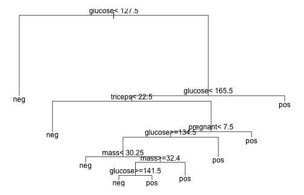
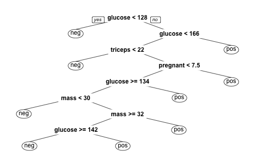
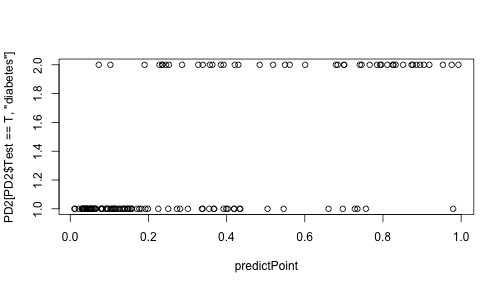

基礎醫學資料探勘應用
========================================================
author: 長庚資管 曾意儒 Yi-Ju Tseng
autosize: true
font-family: 'Microsoft JhengHei'
navigation: slide


大綱
====================================
type:sub-section 

- 什麼是資料探勘
- Regression 迴歸
- Decision Trees 決策樹
- 模型驗證
- 效能指標
- `caret` package

什麼是資料探勘
====================================

建立從**輸入資料**學習新資訊，變成智慧的**演算法**或**資料模式**，用來**預測事件**或**協助決策**

- 用人工智慧、機器學習、統計學等方法
- 在相對較大型的資料集中發現模式的計算過程
- 當資料太`少`或`太髒`的時候，資料探勘的效力會被影響

資料探勘條件
====================================
資料探勘要派上用場，必須有以下條件：

- 有一些模式/模型可`學`
- 很難定義這些模式/模型
- 有資料可`學`這些模式/模型

資料探勘可應用在
====================================

- 成效預測（是否會復發、恢復情形...等）
- 診斷模型（診斷模式學習...等）
- 趨勢預測（流感案例數預測...等）
- 疾病分群

資料探勘的分類
====================================

- **監督式**學習與**非監督式**學習
- 監督式學習的特點是訓練資料中有**正確答案**，由輸入物件和預期輸出所組成，而演算法可以由訓練資料中學到或建立一個模式，並依此模式推測新的實例
- 非監督式學習則不用提供**正確答案**，也就是不需要人力來輸入標籤，單純利用訓練資料的特性，將資料分群分組。

資料探勘的分類
====================================

- Supervised learning 監督式學習
    - Regression 迴歸：真實的'值'（流感案例數、恢復量表等）
    - Classification 分類：分兩類（P/N, Yes/No, M/F, Sick/Not sick）/分多類 (A/B/C/D)

- Unsupervised learning 非監督式學習
    - Clustering 分群
    - Association Rules 關聯式規則

監督式學習
====================================

在**監督式**學習中常見的資料探勘演算法如下： 
  - Linear Regression 線性迴歸
  - Logistic Regression 羅吉斯迴歸、邏輯迴歸
  - Support Vector Machines 支持向量機
  - Decision Trees 決策樹
  - K-Nearest Neighbor
  - Neural Networks 神經網路
  - Deep Learning 深度學習

非監督式學習
====================================

在**非監督式**學習中常見的資料探勘演算法如下： 
  - Hierarchical clustering 階層式分群
  - K-means clustering
  - Neural Networks 神經網路
  - Deep Learning 深度學習


Regression 迴歸
====================================

- 用在了解兩個或多個變數間`是否相關`、`相關方向與強度`
- 建立`數學模型`以便觀察特定變數來預測研究者感興趣的變數

常見的迴歸分析演算法包括：

- Linear Regression 線性迴歸
- Logistic Regression 羅吉斯迴歸、邏輯迴歸

Linear Regression 線性迴歸
====================================

- 嘗試將Linear Regression 線性迴歸用在天竺鼠牙齒長度的資料
- 做天竺鼠`牙齒長度`與`維他命C劑量`的線性迴歸觀察

```r
library(mlbench)
# The Effect of Vitamin C on Tooth Growth in Guinea Pigs
data("ToothGrowth")
knitr::kable(head(ToothGrowth))
```


|  len|supp | dose|
|----:|:----|----:|
|  4.2|VC   |  0.5|
| 11.5|VC   |  0.5|
|  7.3|VC   |  0.5|
|  5.8|VC   |  0.5|
|  6.4|VC   |  0.5|
| 10.0|VC   |  0.5|


lm()
====================================

- 在R中，最基本的簡單線性迴歸分析為`lm()`
- `lm(formula,data=資料名稱)`，搭配formula使用
- formula的撰寫方法為：依變項~自變項1＋自變項2＋....

```r
lm(len~dose,
   data =ToothGrowth)
```

```

Call:
lm(formula = len ~ dose, data = ToothGrowth)

Coefficients:
(Intercept)         dose  
      7.423        9.764  
```

len = `9.764` * dose `7.423`

glm()
====================================
- 更被廣泛使用的是廣義線性迴歸模型generalized linear models (glm)，`glm()`
- 使用方法與`lm()`類似
- 包括線性迴歸模型和邏輯迴歸模型
- 如果需要修改預設模型，可設定family參數：
    - `family="gaussian"` 線性模型模型
    - `family="binomial"` 邏輯迴歸模型
    - `family="poisson"` 卜瓦松迴歸模型
    
Gaussian distribution
====================================
Gaussian distribution高斯函數是`常態分布`的密度函數


Binomial distribution
====================================
Binomial distribution二項分布是`n個獨立的是/非試驗中成功的次數`的離散機率分布


Poisson distribution
====================================
Poisson distribution`次數`分佈：

- 某一服務設施在一定時間內受到的服務請求的次數
- 公車站的候客人數
- 自然災害發生的次數


廣義線性迴歸與NBA
====================================
分析天竺鼠`牙齒長度`與`維他命C劑量`以及`Supplement type`的關係範例

```r
glm(len ~ supp+dose,
    data =ToothGrowth)
```

```

Call:  glm(formula = len ~ supp + dose, data = ToothGrowth)

Coefficients:
(Intercept)       suppVC         dose  
      9.272       -3.700        9.764  

Degrees of Freedom: 59 Total (i.e. Null);  57 Residual
Null Deviance:	    3452 
Residual Deviance: 1023 	AIC: 348.4
```
len = `-3.700` * suppVC + `9.764` * dose + `9.272`

虛擬變項 Dummy Variable
====================================
- `Supplement type`的變項被轉為**虛擬變項 Dummy Variable**
- suppVC
- 如果是OJ(基準項)，會得到：

  - suppVC=0
  
線性迴歸練習
====================================
type:alert
- 用[BostonHousing](https://archive.ics.uci.edu/ml/datasets/Housing)資料
  - install.packages("mlbench")
  - library(mlbench)
  - data(BostonHousing)
- 使用crim、tax、dis欄位預測medv(Median value of owner-occupied homes in $1000's)
  - glm()廣義線性迴歸

線性迴歸總結
====================================
總結以上，多變量線性迴歸分析有下列特色：

- 假設：各變數相互獨立！
- 若自變項X是類別變項，需要建立`虛擬變項`
- 在R裡，`類別變項`請記得轉成factor，R會自動建立`虛擬變項`
- 用在`依變數為連續變數`，`自變數為連續變數或虛擬變數`的場合


Logistic Regression 羅吉斯迴歸
====================================

常用在`依變數為二元變數（非0即1）`的場合，如：
  - 生病/沒生病
  - 錄取/不錄取
  - `family="binomial"` 邏輯迴歸模型

Logistic Regression 羅吉斯迴歸
====================================
- 嘗試將Logistic Regression 羅吉斯迴歸用在糖尿病的資料
- 做`得糖尿病與否`與`BMI`的羅吉斯迴歸觀察

```r
library(mlbench)
data("PimaIndiansDiabetes2")
PimaIndiansDiabetes2<-
  PimaIndiansDiabetes2[complete.cases(PimaIndiansDiabetes2),]
```

分析是否會得糖尿病？
====================================

```r
head(PimaIndiansDiabetes2)
```

|   | pregnant| glucose| pressure| triceps| insulin| mass| pedigree| age|diabetes |
|:--|--------:|-------:|--------:|-------:|-------:|----:|--------:|---:|:--------|
|4  |        1|      89|       66|      23|      94| 28.1|    0.167|  21|neg      |
|5  |        0|     137|       40|      35|     168| 43.1|    2.288|  33|pos      |
|7  |        3|      78|       50|      32|      88| 31.0|    0.248|  26|pos      |
|9  |        2|     197|       70|      45|     543| 30.5|    0.158|  53|pos      |
|14 |        1|     189|       60|      23|     846| 30.1|    0.398|  59|pos      |
|15 |        5|     166|       72|      19|     175| 25.8|    0.587|  51|pos      |

分析是否會得糖尿病？
====================================

```r
mylogit <- 
  glm(diabetes ~ pregnant+glucose+triceps+mass,
      data = PimaIndiansDiabetes2, 
      family = "binomial")
sum<-summary(mylogit)
```

```r
sum$coefficients
```

|            |   Estimate| Std. Error|   z value| Pr(>&#124;z&#124;)|
|:-----------|----------:|----------:|---------:|------------------:|
|(Intercept) | -8.8083182|  0.9733009| -9.049944|          0.0000000|
|pregnant    |  0.1433008|  0.0406067|  3.528997|          0.0004171|
|glucose     |  0.0382373|  0.0048203|  7.932506|          0.0000000|
|triceps     |  0.0189975|  0.0165837|  1.145551|          0.2519809|
|mass        |  0.0635506|  0.0253800|  2.503965|          0.0122810|

羅吉斯迴歸練習
====================================
type:alert
- 用[PimaIndiansDiabetes2](https://archive.ics.uci.edu/ml/datasets/Pima+Indians+Diabetes)資料
  - install.packages("mlbench")
  - library(mlbench)
  - data(PimaIndiansDiabetes2)
  - PimaIndiansDiabetes2<-
  PimaIndiansDiabetes2[complete.cases(PimaIndiansDiabetes2),]
- 使用全部欄位預測diabetes
  - glm()廣義線性迴歸
  - family = "binomial"

最佳模型篩選
====================================

到底該用哪個模型來預測，會得到最準確的結果？在迴歸模型中，常用的判斷準則包括：

  - Akaike’s Information Criterion (AIC)
  - Bayesian Information Criterion (BIC)

AIC
====================================
AIC和BIC都是數值越小越好，以下建立三個模型，並比較其AIC

```r
OneVar<-glm(diabetes ~ mass,
               data = PimaIndiansDiabetes2, 
               family = "binomial")
TwoVar<-glm(diabetes ~ triceps+mass,
               data = PimaIndiansDiabetes2, 
               family = "binomial")
ThreeVar<-glm(diabetes ~ glucose+triceps+mass,
               data = PimaIndiansDiabetes2, 
               family = "binomial")
```

AIC
====================================

```r
c(OneVar$aic,TwoVar$aic,ThreeVar$aic)
```

```
[1] 473.0310 470.5486 377.4528
```

所有參數都有用嗎？
====================================
- 在建立迴歸模型時，常會遇到的問題：到底該放多少參數？
- 所有參數都有用嗎？
- 藉由觀察coefficients來判斷參數在模型中的"實用程度"

```r
sum2<-summary(TwoVar)
sum2$coefficients
```

|            |   Estimate| Std. Error|   z value| Pr(>&#124;z&#124;)|
|:-----------|----------:|----------:|---------:|------------------:|
|(Intercept) | -3.5327637|  0.5917333| -5.970196|          0.0000000|
|triceps     |  0.0298567|  0.0141633|  2.108036|          0.0350278|
|mass        |  0.0574192|  0.0215457|  2.664997|          0.0076989|

所有參數都有用嗎？
====================================

```r
sum3<-summary(ThreeVar)
sum3$coefficients
```

|            |   Estimate| Std. Error|   z value| Pr(>&#124;z&#124;)|
|:-----------|----------:|----------:|---------:|------------------:|
|(Intercept) | -8.2515186|  0.9307316| -8.865626|          0.0000000|
|glucose     |  0.0405379|  0.0048409|  8.374035|          0.0000000|
|triceps     |  0.0266201|  0.0162911|  1.634024|          0.1022537|
|mass        |  0.0469444|  0.0245083|  1.915454|          0.0554347|

Decision Trees 決策樹
====================================
- 在`樹狀目錄`中建立一系列分割，以建立模型
- 這些分割會表示成`「節點」(Node)`
- 每次發現輸入資料行與可預測資料行有明顯地相互關聯時，此演算法就會在模型中加入一個`節點`
- 演算法決定分岔的方式不同


Classification And Regression Tree (CART)
====================================
- 常見的Classification And Regression Tree (CART)
- 使用前須先安裝`rpart` packages


```r
install.packages("rpart")
```

CART
====================================
- 嘗試用用pregnant+glucose+triceps+mass來判斷是否得糖尿病
- 建立決策樹的函數為`rpart()`
- 使用方式為`rpart(formula, data)`

```r
library(rpart)
DT<-rpart(diabetes ~ pregnant+glucose+triceps+mass,
          data=PimaIndiansDiabetes2)
DT
```

```
n= 392 

node), split, n, loss, yval, (yprob)
      * denotes terminal node

  1) root 392 130 neg (0.6683673 0.3316327)  
    2) glucose< 127.5 241  36 neg (0.8506224 0.1493776) *
    3) glucose>=127.5 151  57 pos (0.3774834 0.6225166)  
      6) glucose< 165.5 105  52 pos (0.4952381 0.5047619)  
       12) triceps< 22.5 20   3 neg (0.8500000 0.1500000) *
       13) triceps>=22.5 85  35 pos (0.4117647 0.5882353)  
         26) pregnant< 7.5 64  31 pos (0.4843750 0.5156250)  
           52) glucose>=134.5 49  20 neg (0.5918367 0.4081633)  
            104) mass< 30.25 11   2 neg (0.8181818 0.1818182) *
            105) mass>=30.25 38  18 neg (0.5263158 0.4736842)  
              210) mass>=32.4 30  11 neg (0.6333333 0.3666667)  
                420) glucose>=141.5 22   6 neg (0.7272727 0.2727273) *
                421) glucose< 141.5 8   3 pos (0.3750000 0.6250000) *
              211) mass< 32.4 8   1 pos (0.1250000 0.8750000) *
           53) glucose< 134.5 15   2 pos (0.1333333 0.8666667) *
         27) pregnant>=7.5 21   4 pos (0.1904762 0.8095238) *
      7) glucose>=165.5 46   5 pos (0.1086957 0.8913043) *
```

CART
====================================

```r
par(mfrow=c(1,1), mar = rep(1,4)) #下,左,上,右
plot(DT)
text(DT, use.n=F, all=F, cex=1)
```



決策樹圖
====================================
改用`rpart.plot` package 裡面的`prp()`

```r
#第一次使用前須先安裝
install.packages("rpart.plot") 
```

```r
library(rpart.plot)
prp(DT)	
```



決策樹 節點
====================================
決策樹演算法決定`節點`的方式如下：

- Gini impurity
- Information gain
- Variance reduction

細節可參考[維基百科](https://en.wikipedia.org/wiki/Decision_tree_learning)


決策樹 練習
====================================
type:alert
- 用[PimaIndiansDiabetes2](https://archive.ics.uci.edu/ml/datasets/Pima+Indians+Diabetes)資料
  - install.packages("mlbench")
  - library(mlbench)
  - data(PimaIndiansDiabetes2)
- 使用所有欄位預測diabetes
  - diabetes~.
- 使用rpart.plot套件畫出決策樹
  - prp()


模型驗證
====================================
- 在完成模型訓練後，為了驗證模型訓練的好不好，需要用一組**獨立**的測試資料，來做模型的驗證
- 在訓練模型前，必須特別留意是否有保留一份**獨立的資料**，並確保在訓練模型時都不用到此獨立資料集。

因此，資料集可分為以下兩種：

- **訓練組** Training set, Development set: 讓演算法`學`到`知識`
- **測試組** Test set, Validation set: 驗證`學`的怎麼樣

模型驗證
====================================
- Training set和Test set通常會比例分配
  - 如2/3的資料設為`Training set`
  - 剩下的1/3做驗證`Test set`
- 以下圖的監督式學習流程圖為例，可以注意到綠色箭頭的資料集在訓練過程中從未被使用。

模型驗證
====================================


模型驗證
====================================
- 以Training set來`選看起來最好的模型`
- 用Test set來`驗證模型是不是真的很好`
- 想像.....訓練出來題庫答得好的學生，寫到新題目不一定會寫！？
- 訓練模型時，只能看Training set，用Training set來選一個最好的模型
- 訓練模型時，不能偷看Test set，才是真正的驗證


Regression 迴歸驗證
====================================

- 以PimaIndiansDiabetes資料為例，首先先將資料讀入
- 當答案有正反兩面時，建議`Level 2 放正面答案`-->有病/錄取...

```r
library(mlbench)
data("PimaIndiansDiabetes2")
PD2<-
  PimaIndiansDiabetes2[complete.cases(PimaIndiansDiabetes2),]
head(PD2$diabetes)
```

```
[1] neg pos pos pos pos pos
Levels: neg pos
```

Regression 迴歸驗證：資料分組
====================================
為分出訓練組與測試組，需使用隨機抽樣的方式

```r
sample(1:10,3) # 從1到10，隨機取三個數字
```

```
[1] 2 4 5
```

```r
#從第一列到最後一列，隨機取1/3列數
sample(1:nrow(PD2),nrow(PD2)/3) 
```

```
  [1]  71  23 132 189 212 106 371 272 119 150 222 342 291 264   5  53 377
 [18]   8   9 302 344 320 316 183 357  24  90  52 317 200 237  12  57 347
 [35] 201 259 233  36  93 314  88  18 191  64 341  30  74 284 255  62 319
 [52] 287 240 218 310  38 238 145 289 367 176 266 208 163  99  82 244 213
 [69] 350 193 129 152 151  75  16 269 178  89 203 339 196 230  43 251 338
 [86]  97 331  66 134 180  32  21 379 225 130 219  13 116 333 242 270 369
[103]  94 131   6 171 245 195 118 274 146 380 124 243  39 329 332 108  92
[120] 155 227 295  28 294  73 252   7  11  41 356
```

Regression 迴歸驗證：資料分組
====================================
使用隨機抽樣法，選出1/3的元素位置，把NBA的資料分成Training 和 Test set

```r
PD2$Test<-F #新增一個參數紀錄分組
#隨機取1/3當Test set
PD2[sample(1:nrow(PD2),
                            nrow(PD2)/3),]$Test<-T
# Training set : Test set球員數
c(sum(PD2$Test==F),
  sum(PD2$Test==T))
```

```
[1] 262 130
```

Regression 迴歸驗證：模型訓練
====================================
並用訓練組的資料（PD2$Test==F），訓練一個多變數羅吉斯迴歸模型

```r
fit<-glm(diabetes~.,
         data =PD2[PD2$Test==F,],
         family = "binomial")
summary(fit)$coefficients
```

```
                 Estimate  Std. Error    z value     Pr(>|z|)
(Intercept) -1.185872e+01 1.673784853 -7.0849741 1.390703e-12
pregnant     3.296113e-02 0.071865042  0.4586532 6.464833e-01
glucose      3.578074e-02 0.007157492  4.9990609 5.761022e-07
pressure     1.365068e-02 0.015274587  0.8936855 3.714902e-01
triceps     -7.918960e-04 0.020939160 -0.0378189 9.698321e-01
insulin     -8.006929e-05 0.001731966 -0.0462303 9.631267e-01
mass         9.860865e-02 0.035397918  2.7857188 5.340918e-03
pedigree     1.740402e+00 0.536235436  3.2455923 1.172066e-03
age          4.679623e-02 0.023200552  2.0170310 4.369228e-02
```

Regression 迴歸驗證：逐步選擇模型
====================================
逐步選擇模型 stepwise 後退學習：一開始先將所有參數加到模型裡，再一個一個拿掉

```r
library(MASS)
##根據AIC，做逐步選擇, 預設倒退學習 direction = "backward"
##trace=FALSE: 不要顯示步驟
finalModel_B<-
    stepAIC(fit,
            direction = "backward",
            trace=FALSE)
summary(finalModel_B)$coefficients
```

```
                Estimate  Std. Error   z value     Pr(>|z|)
(Intercept) -11.23404803 1.458902945 -7.700340 1.357051e-14
glucose       0.03584490 0.006327297  5.665120 1.469216e-08
mass          0.10062150 0.026663611  3.773739 1.608192e-04
pedigree      1.68311571 0.529137888  3.180864 1.468365e-03
age           0.05862978 0.016966361  3.455648 5.489707e-04
```

Regression 迴歸驗證：逐步選擇模型
====================================
逐步選擇模型 stepwise 雙向學習：參數加加減減

```r
##根據AIC，做逐步選擇, 雙向學習 direction = "both"
finalModel_Both<-
    stepAIC(fit,
            direction = "both",
            trace=FALSE)
summary(finalModel_Both)$coefficients
```

```
                Estimate  Std. Error   z value     Pr(>|z|)
(Intercept) -11.23404803 1.458902945 -7.700340 1.357051e-14
glucose       0.03584490 0.006327297  5.665120 1.469216e-08
mass          0.10062150 0.026663611  3.773739 1.608192e-04
pedigree      1.68311571 0.529137888  3.180864 1.468365e-03
age           0.05862978 0.016966361  3.455648 5.489707e-04
```

Regression 迴歸驗證：模型驗證
====================================
- 用Test set來評估模型好不好
- 使用predict函數，將測試組資料放入預測模型中

```r
predictPoint<-
    predict(finalModel_Both,
            PD2[PD2$Test==T,],
            type = "response")
DMAns<-factor(ifelse(predictPoint>0.5,1,0),
                 levels=c(0,1))
table(x=DMAns,
    y=PD2[PD2$Test==T,"diabetes"]) 
```

```
   y
x   neg pos
  0  75  13
  1  18  24
```

Regression 迴歸驗證：模型驗證
====================================
- 用Test set來評估模型好不好
- 使用predict函數，將測試組資料放入預測模型中

```r
plot(x=predictPoint,
     y=PD2[PD2$Test==T,"diabetes"])
```




效能指標
====================================
當答案是二元時：效能指標

- Sensitivity 敏感性
- Specificity 特異性
- Positive Predictive Value (PPV) 陽性預測值
- Negative Predictive Value (NPV) 陰性預測值


效能指標名詞解釋
====================================

- TP: 有病且預測也有病    FP: 沒病但是預測有病
- TN: 沒病且預測也沒病    FN: 有病但預測沒病

效能指標公式
====================================
當答案是二元時：效能指標公式
 
- Sensitivity 敏感性：所有`真的有病`的人，被`預測有病`的比例
- Specificity 特異性：所有`真的沒病`的人，被`預測沒病`的比例
- Positive Predictive Value (PPV) 陽性預測值：所有被`預測有病`的人，`真的有病`的比例
- Negative Predictive Value (NPV) 陰性預測值：所有被`預測沒病`的人，`真的沒病`的比例

效能指標
====================================
 回想一下剛剛的驗證結果

```r
table(x=DMAns,
    y=PD2[PD2$Test==T,"diabetes"]) 
```

```
   y
x   neg pos
  0  75  13
  1  18  24
```


效能指標
====================================
 計算預測效能參數

```r
predictPoint<-
    predict(finalModel_Both,
            PD2[PD2$Test==T,],
            type = "response")
DMAns<-factor(ifelse(predictPoint>0.5,"pos","neg"),
                 levels=c("pos","neg"))
```

效能指標
====================================
 計算預測效能參數

```r
# install.packages("caret") #計算參數的packages
library(caret)
sensitivity(DMAns,
            PD2[PD2$Test==T,"diabetes"],
            positive="pos")
```

```
[1] 0.6486486
```

```r
specificity(DMAns,
            PD2[PD2$Test==T,"diabetes"],
            negative="neg")
```

```
[1] 0.8064516
```

效能指標
====================================
 計算預測效能參數

```r
posPredValue(DMAns,
            PD2[PD2$Test==T,"diabetes"],
             positive="pos")
```

```
[1] 0.5714286
```

```r
negPredValue(DMAns,
            PD2[PD2$Test==T,"diabetes"],
             negative="neg")
```

```
[1] 0.8522727
```

預測模型建立與驗證綜合練習
====================================
type:alert

- Sonar資料記載礦物與石頭接受各個不同角度的聲波撞擊後，接收到的回聲數值
- 一共有60個參數，代表使用一特別角度的聲波撞擊礦石所得回聲
- 分類結果為二元分類，包括礦物 ( M ) 與石頭 ( R ) 
- 將資料隨機分為訓練組(2/3)與測試組(1/3)
- 訓練模型並驗證！

library(mlbench)
data(Sonar) 


caret package
====================================
type:sub-section

http://topepo.github.io/caret/index.html

- data splitting
- pre-processing
- feature selection
- model tuning using resampling
- evaluation
- variable importance estimation

caret: data splitting
====================================
`createDataPartition`

```r
library(caret)
set.seed(3456)
trainIndex <- 
  createDataPartition(iris$Species, 
                      p = .8, 
                      list = FALSE, 
                      times = 1)
head(trainIndex)
```

```
     Resample1
[1,]         1
[2,]         2
[3,]         4
[4,]         5
[5,]         6
[6,]         8
```

caret: data splitting
====================================
`createDataPartition`

```r
trainData<-iris[trainIndex,]
testData<-iris[-trainIndex,]
```

caret: model tuning using resampling
====================================

```r
fitControl <- 
  trainControl(## 10-fold CV
    method = "repeatedcv",
    number = 10,
    ## repeated ten times
    repeats = 10)
```

Cross-validation
====================================
- 先在一個子集上做分析， 而其它子集則用來做後續對此分析的確認及驗證


caret: model tuning using resampling
====================================

```r
set.seed(825)
DTFit1 <- 
  train(Species ~ ., data = trainData, 
        method = "rpart", 
        trControl = fitControl)
```

caret: model tuning using resampling
====================================

```r
DTFit1
```

```
CART 

120 samples
  4 predictor
  3 classes: 'setosa', 'versicolor', 'virginica' 

No pre-processing
Resampling: Cross-Validated (10 fold, repeated 10 times) 
Summary of sample sizes: 108, 108, 108, 108, 108, 108, ... 
Resampling results across tuning parameters:

  cp     Accuracy   Kappa
  0.000  0.9166667  0.875
  0.425  0.7833333  0.675
  0.500  0.3333333  0.000

Accuracy was used to select the optimal model using  the largest value.
The final value used for the model was cp = 0. 
```

caret: evaluation
====================================

```r
predict(DTFit1, 
        newdata = testData, 
        type = "prob")
```

```
    setosa versicolor virginica
3        1 0.00000000 0.0000000
7        1 0.00000000 0.0000000
12       1 0.00000000 0.0000000
14       1 0.00000000 0.0000000
21       1 0.00000000 0.0000000
23       1 0.00000000 0.0000000
41       1 0.00000000 0.0000000
44       1 0.00000000 0.0000000
48       1 0.00000000 0.0000000
49       1 0.00000000 0.0000000
54       0 0.88636364 0.1136364
55       0 0.88636364 0.1136364
61       0 0.88636364 0.1136364
64       0 0.88636364 0.1136364
70       0 0.88636364 0.1136364
82       0 0.88636364 0.1136364
91       0 0.88636364 0.1136364
95       0 0.88636364 0.1136364
96       0 0.88636364 0.1136364
100      0 0.88636364 0.1136364
101      0 0.02777778 0.9722222
102      0 0.02777778 0.9722222
109      0 0.02777778 0.9722222
110      0 0.02777778 0.9722222
111      0 0.02777778 0.9722222
125      0 0.02777778 0.9722222
129      0 0.02777778 0.9722222
138      0 0.02777778 0.9722222
147      0 0.02777778 0.9722222
149      0 0.02777778 0.9722222
```

caret: data splitting
====================================
`createDataPartition`

```r
library(caret)
set.seed(3456)
trainIndexBinary <- 
  createDataPartition(PD2$diabetes, 
                      p = .75, 
                      list = FALSE, 
                      times = 1)
head(trainIndexBinary)
```

```
     Resample1
[1,]         1
[2,]         2
[3,]         3
[4,]         4
[5,]         5
[6,]         6
```

caret: data splitting
====================================
`createDataPartition`

```r
trainDataBinary<-PD2[trainIndexBinary,]
testDataBinary<-PD2[-trainIndexBinary,]
```

caret: model tuning using resampling
====================================

```r
fitControlBinary <- 
  trainControl(method = "repeatedcv",
               number = 10,
               repeats = 10,
               ## Estimate class probabilities
               classProbs = TRUE,
               ## Evaluate performance using 
               ## the following function
               summaryFunction = twoClassSummary)
```

caret: model tuning using resampling
====================================

```r
set.seed(825)
DTFitBinary <- 
  train(diabetes ~ ., 
        data = trainDataBinary, 
        method = "rpart", 
        trControl = fitControlBinary,
        ## Specify which metric to optimize
        metric = "ROC")
```

caret: model tuning using resampling
====================================

```r
DTFitBinary
```

```
CART 

295 samples
  9 predictor
  2 classes: 'neg', 'pos' 

No pre-processing
Resampling: Cross-Validated (10 fold, repeated 10 times) 
Summary of sample sizes: 266, 266, 265, 265, 266, 266, ... 
Resampling results across tuning parameters:

  cp          ROC        Sens       Spec     
  0.05882353  0.7237455  0.8945263  0.5355455
  0.07843137  0.6864157  0.9060000  0.4621818
  0.36274510  0.5652632  0.9685263  0.1620000

ROC was used to select the optimal model using  the largest value.
The final value used for the model was cp = 0.05882353. 
```

caret: evaluation
====================================

```r
pred<-
  predict(DTFitBinary, 
          newdata = testDataBinary, 
          type = "prob")
knitr::kable(head(pred))
```


|   |       neg|       pos|
|:--|---------:|---------:|
|25 | 0.7956522| 0.2043478|
|36 | 0.7956522| 0.2043478|
|41 | 0.1636364| 0.8363636|
|52 | 0.7956522| 0.2043478|
|54 | 0.1636364| 0.8363636|
|70 | 0.7956522| 0.2043478|

效能指標名詞解釋
====================================

- TP: 有病且預測也有病    FP: 沒病但是預測有病
- TN: 沒病且預測也沒病    FN: 有病但預測沒病

caret: evaluation
====================================

```r
predClass<-
  ifelse(pred$pos>0.5,"pos","neg")
confusionMatrix(data = predClass, 
                reference = testDataBinary$diabetes)
```

```
Confusion Matrix and Statistics

          Reference
Prediction neg pos
       neg  58  20
       pos   6  13
                                          
               Accuracy : 0.732           
                 95% CI : (0.6324, 0.8168)
    No Information Rate : 0.6598          
    P-Value [Acc > NIR] : 0.07990         
                                          
                  Kappa : 0.3346          
 Mcnemar's Test P-Value : 0.01079         
                                          
            Sensitivity : 0.9062          
            Specificity : 0.3939          
         Pos Pred Value : 0.7436          
         Neg Pred Value : 0.6842          
             Prevalence : 0.6598          
         Detection Rate : 0.5979          
   Detection Prevalence : 0.8041          
      Balanced Accuracy : 0.6501          
                                          
       'Positive' Class : neg             
                                          
```

預測模型建立與驗證綜合練習
====================================
type:alert

- Sonar資料記載礦物與石頭接受各個不同角度的聲波撞擊後，接收到的回聲數值
- 一共有60個參數，代表使用一特別角度的聲波撞擊礦石所得回聲
- 分類結果為二元分類，包括礦物 ( M ) 與石頭 ( R ) 
- 將資料隨機分為訓練組(3/4)與測試組(1/4)
- 訓練模型並驗證！
- 用caret package提供的方法撰寫

library(mlbench)
data(Sonar) 

其他常用模型
====================================
- SVM
- Random Forest
- AdaBoost
- eXtreme Gradient Boosting (XGBoost)
- http://topepo.github.io/caret/available-models.html

參考資料
====================================
- caret官網 http://topepo.github.io/caret/index.html
- Applied Predictive Modeling 
  - By Max Kuhn and Kjell Johnson 
  - http://appliedpredictivemodeling.com/

