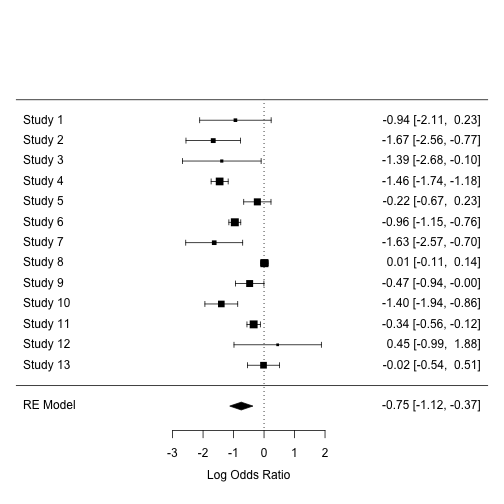
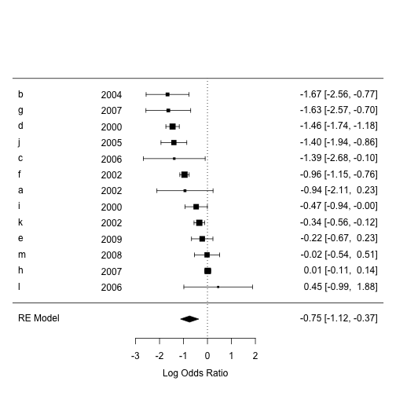

用R做統合分析
========================================================
author: 長庚資管 曾意儒 Yi-Ju Tseng / 黃詩茜
autosize: true
font-family: 'Microsoft JhengHei'
navigation: slide

大綱
====================================
type:sub-section 

- 統合分析使用套件
- 什麼是統合分析
- 統合分析步驟
  - 文獻搜尋
  - 文獻篩選
  - 統合分析
  
統合分析使用套件
====================================
- 統合分析相關
  - metagear
  - RISmed
  - metafor [官方文件](https://wviechtb.github.io/metafor/index.html)

- 資料處理相關
  - dplyr
  

什麼是Review？系統性回顧？
====================================


將某一個主題相關的文獻搜尋、統整，進一步做出結論。

文獻回顧的方式分成兩種：
- 敘述性綜論
- 系統性文獻回顧

什麼是系統性回顧？
====================================
- 依照標準的程序來作文獻搜尋、篩選，做出結論或建議
- 「系統性文獻回顧」是一個操作的過程
- meta-analysis是「系統性文獻回顧」中，可以利用的統計工具　　

什麼是統合分析meta-analysis？
====================================
- "The analysis of analyses"
  - Gene V. Glass Primary, secondary and meta-analysis of research, Educational Researcher, 1976.
- 大量蒐集個別研究的分析結果，作統計分析
- 使用相同的統計方法評論大量的研究結果

什麼是統合分析meta-analysis？
====================================
A meta-analysis is the synthesis of: 
- K compatible **effects** (Yi)
- Giving greater weight to studies with:
  - Less variance (Vi)
  - More precision (Wi = 1/Vi )

Compatible effects
====================================
Almost any aggregate statistic of interest:

- Mean, Mean difference, Mean change
- Risk ratio, Odds ratio, Risk difference
- Incidence rate, Prevalence, Proportion
- Correlation

統合分析步驟
====================================
- 文獻搜尋
- 研究品質評估
- 資料萃取
- 統計分析
- 出版偏差評估

文獻搜尋
====================================
type:sub-section
- Keywords
- Data-based exhausted search
- Abstract screening

Data-based exhausted search
====================================
- PubMed – `RISmed` package
- Scopus – 下載輸出
- Medline – 下載輸出
- Cochrane – 下載輸出

PubMed – `RISmed` package
====================================
`EUtilsSummary( [query], [db], [search.limits])`
- `query`: String query as given on PubMed site
- `db`: String name of NCBI database
- `search.limits`: Additional arguments to restrict search

PubMed – `RISmed` package
====================================

```r
library(RISmed)
fit <- EUtilsSummary("rofecoxib[ti]+British Medical Journal[jo]", db = "pubmed")
QueryTranslation(fit) # Extract the translated query
```

```
[1] "rofecoxib[ti] AND (\"Br Med J\"[Journal] OR \"Br Med J (Clin Res Ed)\"[Journal] OR \"BMJ\"[Journal])"
```

```r
QueryCount(fit) # Extract the number of matched records
```

```
[1] 16
```

```r
fetch <- EUtilsGet(fit)  # Medline Object
getSlots("Medline") # Available methods
```

```
               Query                 PMID         YearReceived 
         "character"          "character"            "numeric" 
       MonthReceived          DayReceived         HourReceived 
           "numeric"            "numeric"            "numeric" 
      MinuteReceived         YearAccepted        MonthAccepted 
           "numeric"            "numeric"            "numeric" 
         DayAccepted         HourAccepted       MinuteAccepted 
           "numeric"            "numeric"            "numeric" 
        YearEpublish        MonthEpublish          DayEpublish 
           "numeric"            "numeric"            "numeric" 
        HourEpublish       MinuteEpublish         YearPpublish 
           "numeric"            "numeric"            "numeric" 
       MonthPpublish          DayPpublish         HourPpublish 
           "numeric"            "numeric"            "numeric" 
      MinutePpublish              YearPmc             MonthPmc 
           "numeric"            "numeric"            "numeric" 
              DayPmc              HourPmc            MinutePmc 
           "numeric"            "numeric"            "numeric" 
          YearPubmed          MonthPubmed            DayPubmed 
           "numeric"            "numeric"            "numeric" 
          HourPubmed         MinutePubmed               Author 
           "numeric"            "numeric"               "list" 
                ISSN                Title         ArticleTitle 
         "character"          "character"          "character" 
         ELocationID         AbstractText          Affiliation 
         "character"          "character"               "list" 
            Language      PublicationType            MedlineTA 
         "character"               "list"          "character" 
         NlmUniqueID          ISSNLinking    PublicationStatus 
         "character"          "character"          "character" 
           ArticleId               Volume                Issue 
         "character"          "character"          "character" 
     ISOAbbreviation           MedlinePgn CopyrightInformation 
         "character"          "character"          "character" 
             Country              GrantID              Acronym 
         "character"          "character"          "character" 
              Agency       RegistryNumber            RefSource 
         "character"          "character"          "character" 
      CollectiveName                 Mesh 
         "character"               "list" 
```

```r
ArticleTitle(fetch)[1:5]
```

```
[1] "Merck pays $1bn penalty in relation to promotion of rofecoxib."      
[2] "Merck to pay $58m in settlement over rofecoxib advertising."         
[3] "94% of patients suing Merck over rofecoxib agree to company's offer."
[4] "Merck to pay $5bn in rofecoxib claims."                              
[5] "Merck appeals rofecoxib verdict."                                    
```

```r
Author(fetch)[[1]] ##
```

```
  LastName       ForeName Initials order
1    Tanne Janice Hopkins       JH     1
```

```r
#Year(fetch)
```

Scopus – 下載輸出
====================================

Medline – 下載輸出
====================================

Cochrane – 下載輸出
====================================

Abstract screening
====================================
- `metagear` package

研究品質評估
====================================
type:sub-section

- Quality assessment and control
- Inter-rater reliability

Quality assessment and control
====================================

PRISMA statement

Inter-rater reliability
====================================


資料萃取
====================================
type:sub-section

- Data collection


統計分析
====================================
type:sub-section

- Summary effect
- Assess heterogeneity
- Subgroup analysis
- Sensitivity analysis

載入練習用資料
====================================

```r
library(metafor)
# BCG meta-analytic dataset
data(dat.bcg) 
knitr::kable(dat.bcg) 
```


| trial|author               | year| tpos|  tneg| cpos|  cneg| ablat|alloc      |
|-----:|:--------------------|----:|----:|-----:|----:|-----:|-----:|:----------|
|     1|Aronson              | 1948|    4|   119|   11|   128|    44|random     |
|     2|Ferguson & Simes     | 1949|    6|   300|   29|   274|    55|random     |
|     3|Rosenthal et al      | 1960|    3|   228|   11|   209|    42|random     |
|     4|Hart & Sutherland    | 1977|   62| 13536|  248| 12619|    52|random     |
|     5|Frimodt-Moller et al | 1973|   33|  5036|   47|  5761|    13|alternate  |
|     6|Stein & Aronson      | 1953|  180|  1361|  372|  1079|    44|alternate  |
|     7|Vandiviere et al     | 1973|    8|  2537|   10|   619|    19|random     |
|     8|TPT Madras           | 1980|  505| 87886|  499| 87892|    13|random     |
|     9|Coetzee & Berjak     | 1968|   29|  7470|   45|  7232|    27|random     |
|    10|Rosenthal et al      | 1961|   17|  1699|   65|  1600|    42|systematic |
|    11|Comstock et al       | 1974|  186| 50448|  141| 27197|    18|systematic |
|    12|Comstock & Webster   | 1969|    5|  2493|    3|  2338|    33|systematic |
|    13|Comstock et al       | 1976|   27| 16886|   29| 17825|    33|systematic |

Summary effect
====================================
- Fixed effect model
  - Common true value

- Random effects model
  - Normal distribution


Summary effect
====================================
`rma(yi, vi, method,...) `
- yi effect size
- vi variances
- method type of model approach


```r
library(metafor)
result.ormr <- 
  rma(ai = tpos, bi = tneg, 
      ci = cpos, di = cneg, 
      data = dat.bcg, 
      measure = "OR", method = "DL")
```

Summary effect
====================================

```r
summary(result.ormr)
```

```

Random-Effects Model (k = 13; tau^2 estimator: DL)

  logLik  deviance       AIC       BIC      AICc  
-13.1398   37.3865   30.2795   31.4094   31.4795  

tau^2 (estimated amount of total heterogeneity): 0.3663 (SE = 0.2659)
tau (square root of estimated tau^2 value):      0.6053
I^2 (total heterogeneity / total variability):   92.65%
H^2 (total variability / sampling variability):  13.60

Test for Heterogeneity: 
Q(df = 12) = 163.1649, p-val < .0001

Model Results:

estimate      se     zval    pval    ci.lb    ci.ub     
 -0.7474  0.1923  -3.8873  0.0001  -1.1242  -0.3706  ***

---
Signif. codes:  0 '***' 0.001 '**' 0.01 '*' 0.05 '.' 0.1 ' ' 1 
```

Assess Heterogeneity
====================================
接著是評估「個別論文的效果」和「綜合性效果」是否有極大的差異性。異質性越高，資料的整合越難，可能會影響到分析的結論。（通常 p 值 < 0.1 ，就可以判定這些論文間存在有明顯的異質性）
0% to 30% Low
→ ·
30% to 60% Moderate
→ ·
50% to 90%
→ Substantial · 75% to 100% → Considerable
τ2 ·
Higgins'
I2
· H2 H
Index
,
·
Intra-class correlation (ICC)

```r
result.ormr$I2
```

```
[1] 92.64548
```

```r
result.ormr$H2
```

```
[1] 13.59708
```

```r
confint(result.ormr)
```

```

       estimate   ci.lb   ci.ub
tau^2    0.3663  0.1302  1.1812
tau      0.6053  0.3608  1.0868
I^2(%)  92.6455 81.7376 97.5971
H^2     13.5971  5.4757 41.6164
```

The Forest Plot
====================================

```r
forest(result.ormr) # DEFAULT PLOT
```


The Forest Plot
====================================
- order: Sort by "obs", "fit", "prec", etc.
- slab: Change study labels
- ilab: Add study information
- transf: Apply function to effects
- psize: Symbol sizes

```r
study.names <- 
  letters[1:result.ormr$k] 
study.year <- 
  2000 + sample(0:9, 
                result.ormr$k,
                replace = T)
forest(result.ormr, order = "obs", 
       slab = study.names, ilab = study.year, 
       ilab.xpos = -4)
```



The Forest Plot
====================================


```r
forest(result.ormr, 
       order = "obs", 
       slab = study.names, 
       ilab = study.year, 
       ilab.xpos = -4)
```



Subgroup analysis
====================================
檢驗綜合效果（例如：介入成效）是否因為某些變項不同而有所差異，例如：男性的介入效果是否優於女性的效果。

```
### fit random-effects model in the three subgroups
res.s <- rma(ai=tpos, bi=tneg, ci=cpos, di=cneg, data=dat.bcg, measure="RR",
             subset=(alloc=="systematic"), method="REML")
res.r <- rma(ai=tpos, bi=tneg, ci=cpos, di=cneg, data=dat.bcg, measure="RR",
             subset=(alloc=="random"), method="REML")
res.a <- rma(ai=tpos, bi=tneg, ci=cpos, di=cneg, data=dat.bcg, measure="RR",
             subset=(alloc=="alternate"), method="REML")
```
Sensitivity analysis
====================================
- 將某篇論文刪除後，看看剩餘論文的合併效果是否會不同，測試整體的穩定度
- 如果某篇論文被刪除後，造成綜合性效果明顯改變，就應該在論文的Discussion部分，說明這一篇論文對於分析的重要性

```r
cases <- leave1out(result.ormr) 
knitr::kable(cases)
```


|   estimate|        se|      zval|      pval|     ci.lb|      ci.ub|         Q| Qp|      tau2|       I2|        H2|
|----------:|---------:|---------:|---------:|---------:|----------:|---------:|--:|---------:|--------:|---------:|
| -0.7373485| 0.1982353| -3.719563| 0.0001996| -1.125882| -0.3488145| 162.45415|  0| 0.3702077| 93.22886| 14.768559|
| -0.6837433| 0.1964725| -3.480097| 0.0005012| -1.068822| -0.2986643| 155.83244|  0| 0.3562084| 92.94114| 14.166586|
| -0.7164282| 0.1968517| -3.639431| 0.0002732| -1.102250| -0.3306060| 161.07330|  0| 0.3662782| 93.17081| 14.643028|
| -0.6591438| 0.1795794| -3.670486| 0.0002421| -1.011113| -0.3071746| 106.97867|  0| 0.2711545| 89.71758|  9.725334|
| -0.8000960| 0.2063179| -3.877977| 0.0001053| -1.204472| -0.3957204| 162.22626|  0| 0.3889283| 93.21935| 14.747842|
| -0.7267500| 0.2083261| -3.488520| 0.0004857| -1.135062| -0.3184383| 129.60540|  0| 0.3933731| 91.51270| 11.782309|
| -0.6881416| 0.1966943| -3.498533| 0.0004678| -1.073656| -0.3026278| 156.79642|  0| 0.3581391| 92.98453| 14.254220|
| -0.8258572| 0.1750651| -4.717428| 0.0000024| -1.168979| -0.4827359|  72.71742|  0| 0.2514517| 84.87295|  6.610674|
| -0.7753965| 0.2062696| -3.759141| 0.0001705| -1.179677| -0.3711155| 163.14194|  0| 0.3892237| 93.25741| 14.831086|
| -0.6865009| 0.1976628| -3.473090| 0.0005145| -1.073913| -0.2990888| 150.51661|  0| 0.3522040| 92.69184| 13.683329|
| -0.7962835| 0.2240062| -3.554739| 0.0003784| -1.235327| -0.3572394| 162.31937|  0| 0.4705305| 93.22324| 14.756307|
| -0.7986358| 0.1965526| -4.063217| 0.0000484| -1.183872| -0.4133997| 161.70112|  0| 0.3673199| 93.19733| 14.700102|
| -0.8155773| 0.2036448| -4.004901| 0.0000620| -1.214714| -0.4164408| 160.65390|  0| 0.3786162| 93.15298| 14.604900|
Sensitivity analysis
====================================

```r
which(cases$I2 == min(cases$I2)) 
```

```
[1] 8
```

出版偏差評估
====================================
type:sub-section

- Funnel plot

Funnel plot
====================================
- 以漏斗圖偵測「出版偏差」
  - 研究人員通常傾向發表具有正向效果的文獻，而不傾向發表負向效果的文章
  - 某些應該存在的研究結果不容易被發現
-X軸代表風險差，Y軸代表標準差，黑點代表每一份研究，越上面的研究表示標準差越小（樣本數越大）。
- 漏斗圖如果呈現對稱，表示沒有出版偏差；若呈現不對稱，表示有出版偏差的情形，這部分要注意。

```r
funnel(result.ormr)
```


Funnel plot
====================================

```r
trimfill(result.ormr) # Only applicable for FE or RE objects
```

```

Estimated number of missing studies on the right side: 0 (SE = 2.3309)

Random-Effects Model (k = 13; tau^2 estimator: DL)

tau^2 (estimated amount of total heterogeneity): 0.3663 (SE = 0.2659)
tau (square root of estimated tau^2 value):      0.6053
I^2 (total heterogeneity / total variability):   92.65%
H^2 (total variability / sampling variability):  13.60

Test for Heterogeneity: 
Q(df = 12) = 163.1649, p-val < .0001

Model Results:

estimate      se     zval    pval    ci.lb    ci.ub     
 -0.7474  0.1923  -3.8873  0.0001  -1.1242  -0.3706  ***

---
Signif. codes:  0 '***' 0.001 '**' 0.01 '*' 0.05 '.' 0.1 ' ' 1 
```

```r
funnel(trimfill(result.ormr))
```


