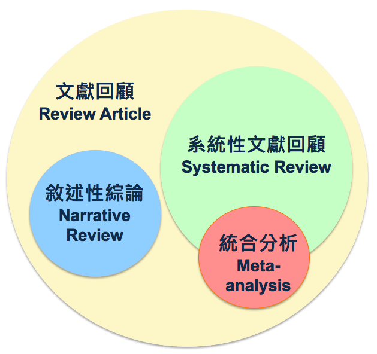

用R做統合分析
========================================================
author: 長庚資管 曾意儒 Yi-Ju Tseng / 黃詩茜
autosize: true
font-family: 'Microsoft JhengHei'
navigation: slide

大綱
====================================
type:sub-section 

- 統合分析使用套件
- 什麼是統合分析
- 統合分析步驟
  - 文獻搜尋
  - 文獻篩選
  - 統合分析
  
統合分析使用套件
====================================
- 統合分析相關
  - metagear
  - RISmed

- 資料處理相關
  - dplyr
  

什麼是Review？系統性回顧？
====================================

將某一個主題相關的文獻搜尋、統整，進一步做出結論。

文獻回顧的方式分成兩種：
- 敘述性綜論
- 系統性文獻回顧

什麼是系統性回顧？
====================================
- 依照標準的程序來作文獻搜尋、篩選，做出結論或建議
- 「系統性文獻回顧」是一個操作的過程
- meta-analysis是「系統性文獻回顧」中，可以利用的統計工具　　

什麼是統合分析meta-analysis？
====================================
- 大量蒐集個別研究的分析結果，作統計分析
- 使用相同的統計方法評論大量的研究結果

統合分析步驟
====================================
- 文獻搜尋
- 研究品質評估
- 資料萃取
- 統計分析
- 出版偏差評估

文獻搜尋
====================================
type:sub-section
- Keywords
- Data-based exhausted search
- Abstract screening

Data-based exhausted search
====================================
- PubMed – `RISmed` package
- Scopus – 下載輸出
- Medline – 下載輸出
- Cochrane – 下載輸出

PubMed – `RISmed` package
====================================

Scopus – 下載輸出
====================================

Medline – 下載輸出
====================================

Cochrane – 下載輸出
====================================

Abstract screening
====================================
- `metagear` package

研究品質評估
====================================
type:sub-section

- Quality assessment and control
- Inter-rater reliability

Quality assessment and control
====================================

PRISMA statement

Inter-rater reliability
====================================

資料萃取
====================================
type:sub-section

- Data collection

統計分析
====================================
type:sub-section

- Summary effect
- Assess heterogeneity
- Subgroup analysis
- Sensitivity analysis

Summary effect
====================================
Fixed effect model
Common true value

Random effects model
Normal distribution

Assess heterogeneity
====================================
接著是評估「個別論文的效果」和「綜合性效果」是否有極大的差異性。異質性越高，資料的整合越難，可能會影響到分析的結論。（通常 p 值 < 0.1 ，就可以判定這些論文間存在有明顯的異質性）

Subgroup analysis
====================================
檢驗綜合效果（例如：介入成效）是否因為某些變項不同而有所差異，例如：男性的介入效果是否優於女性的效果。

Sensitivity analysis
====================================
目的是將某些不合適的論文刪除後，看看剩餘論文的合併效果是否會因此更改，測試整體的穩定度。如果某篇論文被刪除後，造成綜合性效果明顯改變，就應該在論文的Discussion部分，說明這一篇論文對於整體綜合性效果的重要性。

出版偏差評估
====================================
type:sub-section

- Funnel plot

Funnel plot
====================================
Meta-analysis的最後一個步驟，通常會以漏斗圖偵測「出版偏差」。
出版偏差，研究人員通常傾向發表具有正向效果的文獻，而不傾向發表負向效果的文章。如此一來，形成了在收集文獻過程中，某些應該存在的研究結果不容易被發現的情況。

透過這張圖可以看到，X軸代表風險差，Y軸代表標準差，黑點代表每一份研究，越上面的研究表示標準差越小（樣本數越大）。漏斗圖如果呈現對稱，表示沒有出版偏差；若呈現不對稱，表示有出版偏差的情形，這部分要注意。

