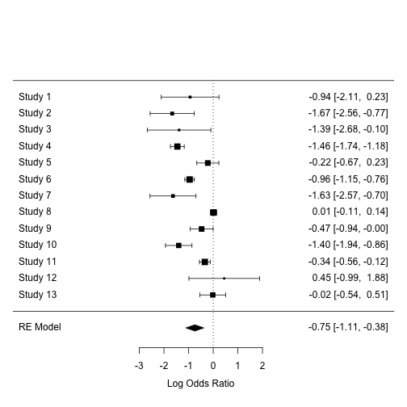

用R做統合分析
========================================================
author: 長庚資管 曾意儒 Yi-Ju Tseng / 黃詩茜
autosize: true
font-family: 'Microsoft JhengHei'
navigation: slide

大綱
====================================
type:sub-section 

- 統合分析使用套件
- 什麼是統合分析
- 統合分析步驟
  - 文獻搜尋
  - 文獻篩選
  - 統合分析
  
統合分析使用套件
====================================
- 統合分析相關
  - metagear [教學](http://lajeunesse.myweb.usf.edu/metagear/metagear_basic_vignette.html)
  - RISmed [教學](https://amunategui.github.io/pubmed-query/)
  - metafor [官方文件](https://wviechtb.github.io/metafor/index.html)

- 資料處理相關
  - dplyr [官方網站](https://dplyr.tidyverse.org/)
  

什麼是Review？系統性回顧？
====================================
將某一個主題相關的文獻搜尋、統整，進一步做出結論。


文獻回顧的方式分成兩種：
- 敘述性綜論
- 系統性文獻回顧

什麼是系統性回顧？
====================================
- 依照標準的程序來作文獻搜尋、篩選，做出結論或建議
- 「系統性文獻回顧」是一個操作的過程
- meta-analysis是「系統性文獻回顧」中，可以利用的統計工具　　

什麼是統合分析meta-analysis？
====================================
- "The analysis of analyses"
  - Gene V. Glass Primary, secondary and meta-analysis of research, Educational Researcher, 1976.
- 大量蒐集個別研究的分析結果，作統計分析
- 使用相同的統計方法評論大量的研究結果

什麼是統合分析meta-analysis？
====================================
A meta-analysis is the synthesis of: 
- `K` compatible **effects** 
  - Mean, Mean difference, Mean change
  - Risk ratio, Odds ratio, Risk difference
  - Incidence rate, Prevalence, Proportion
  - Correlation
- Giving greater weight to studies with:
  - Less variance 
  - More precision 

什麼是統合分析meta-analysis？
====================================


統合分析步驟
====================================
- 文獻搜尋
- 資料萃取
- 統計分析
- 出版偏差評估

文獻搜尋
====================================
type:sub-section
- Keywords
- Data-based exhausted search
- Abstract screening

Keywords
====================================
- (K1) and (K2)
- (K1 or A1) and (K2 or A2)
- 文章太多的話: (K1) and (K2) and (K3)

Data-based exhausted search
====================================
- PubMed – `RISmed` package
- Scopus – 下載輸出
- Medline – 下載輸出
- Cochrane – 下載輸出

PubMed – `RISmed` package
====================================
`EUtilsSummary( query, db, search.limits)`

- `query`: String query as given on PubMed site
- `db`: String name of NCBI database
- `search.limits`: Additional arguments to restrict search

PubMed – `RISmed` package
====================================

```r
library(RISmed)
fit <- EUtilsSummary("rofecoxib[ti]+British Medical Journal[jo]", db = "pubmed")
summary(fit)
```

```
Query:
rofecoxib[ti] AND ("Br Med J"[Journal] OR "Br Med J (Clin Res Ed)"[Journal] OR "BMJ"[Journal]) 

Result count:  16
```

```r
QueryTranslation(fit) 
```

```
[1] "rofecoxib[ti] AND (\"Br Med J\"[Journal] OR \"Br Med J (Clin Res Ed)\"[Journal] OR \"BMJ\"[Journal])"
```

```r
QueryCount(fit) 
```

```
[1] 16
```

PubMed – `RISmed` package
====================================

`EUtilsGet`: 取得查詢結果


```r
fetch <- EUtilsGet(fit) 
ArticleTitle(fetch)[1:3]
```

```
[1] "Merck pays $1bn penalty in relation to promotion of rofecoxib."      
[2] "Merck to pay $58m in settlement over rofecoxib advertising."         
[3] "94% of patients suing Merck over rofecoxib agree to company's offer."
```

```r
Author(fetch)[[1]] 
```

```
  LastName       ForeName Initials order
1    Tanne Janice Hopkins       JH     1
```

PubMed – `RISmed` package
====================================
將重要資訊整理成`data.frame`

```r
pubmed_data <-
  data.frame(Title=ArticleTitle(fetch),
             Abstract=AbstractText(fetch),
             PMID=PMID(fetch),
             ELocationID=ELocationID(fetch),
             Language=Language(fetch),
             stringsAsFactors = F)
knitr::kable(pubmed_data)
```


|Title                                                                                                                                                                |Abstract                                                                                                                                                                                                                                                                                                                                                                                                                                                                                                                                                                                                                                                                                                                                                                                                                                                                                                                                                                                                                                                                                                                                                                                                                                                                                                                                                                                                             |PMID     |ELocationID                 |Language |
|:--------------------------------------------------------------------------------------------------------------------------------------------------------------------|:--------------------------------------------------------------------------------------------------------------------------------------------------------------------------------------------------------------------------------------------------------------------------------------------------------------------------------------------------------------------------------------------------------------------------------------------------------------------------------------------------------------------------------------------------------------------------------------------------------------------------------------------------------------------------------------------------------------------------------------------------------------------------------------------------------------------------------------------------------------------------------------------------------------------------------------------------------------------------------------------------------------------------------------------------------------------------------------------------------------------------------------------------------------------------------------------------------------------------------------------------------------------------------------------------------------------------------------------------------------------------------------------------------------------|:--------|:---------------------------|:--------|
|Merck pays $1bn penalty in relation to promotion of rofecoxib.                                                                                                       |                                                                                                                                                                                                                                                                                                                                                                                                                                                                                                                                                                                                                                                                                                                                                                                                                                                                                                                                                                                                                                                                                                                                                                                                                                                                                                                                                                                                                     |22123916 |10.1136/bmj.d7702           |eng      |
|Merck to pay $58m in settlement over rofecoxib advertising.                                                                                                          |                                                                                                                                                                                                                                                                                                                                                                                                                                                                                                                                                                                                                                                                                                                                                                                                                                                                                                                                                                                                                                                                                                                                                                                                                                                                                                                                                                                                                     |18511780 |10.1136/bmj.39591.705231.DB |eng      |
|94% of patients suing Merck over rofecoxib agree to company's offer.                                                                                                 |                                                                                                                                                                                                                                                                                                                                                                                                                                                                                                                                                                                                                                                                                                                                                                                                                                                                                                                                                                                                                                                                                                                                                                                                                                                                                                                                                                                                                     |18340064 |10.1136/bmj.39513.541296.DB |eng      |
|Merck to pay $5bn in rofecoxib claims.                                                                                                                               |                                                                                                                                                                                                                                                                                                                                                                                                                                                                                                                                                                                                                                                                                                                                                                                                                                                                                                                                                                                                                                                                                                                                                                                                                                                                                                                                                                                                                     |18006982 |NA                          |eng      |
|Merck appeals rofecoxib verdict.                                                                                                                                     |                                                                                                                                                                                                                                                                                                                                                                                                                                                                                                                                                                                                                                                                                                                                                                                                                                                                                                                                                                                                                                                                                                                                                                                                                                                                                                                                                                                                                     |17379897 |NA                          |eng      |
|Court awards claimant 13.5m dollars in rofecoxib lawsuit.                                                                                                            |                                                                                                                                                                                                                                                                                                                                                                                                                                                                                                                                                                                                                                                                                                                                                                                                                                                                                                                                                                                                                                                                                                                                                                                                                                                                                                                                                                                                                     |16627492 |NA                          |eng      |
|Merck faces ongoing claims after Texan ruling on rofecoxib.                                                                                                          |                                                                                                                                                                                                                                                                                                                                                                                                                                                                                                                                                                                                                                                                                                                                                                                                                                                                                                                                                                                                                                                                                                                                                                                                                                                                                                                                                                                                                     |16141139 |NA                          |eng      |
|Differences in outcomes of patients with congestive heart failure prescribed celecoxib, rofecoxib, or non-steroidal anti-inflammatory drugs: population based study. |OBJECTIVES: To compare the risk of death and recurrent congestive heart failure in elderly patients prescribed celecoxib, rofecoxib, or non-steroidal anti-inflammatory drugs (NSAIDs) and to determine whether there are class differences between celecoxib and rofecoxib.DESIGN: Population based retrospective cohort study.SETTING: Databases of hospital discharge summaries and prescription drug claims in Quebec.PARTICIPANTS: 2256 patients aged 66 or more prescribed celecoxib, rofecoxib, or an NSAID after an index admission for congestive heart failure between April 2000 and March 2002.MAIN OUTCOME MEASURES: Time to all cause death and recurrent congestive heart failure, combined and separately.RESULTS: The risk of death and recurrent congestive heart failure combined was higher in patients prescribed NSAIDs or rofexocib than in those prescribed celecoxib (hazard ratio 1.26, 95% confidence interval 1.00 to 1.57 and 1.27, 1.09 to 1.49, respectively). The findings were similar when the outcomes were assessed separately. In pairwise analysis, the risks of death and recurrent congestive heart failure, combined and separate, were similar between patients prescribed NSAIDs and rofecoxib.CONCLUSIONS: Celecoxib seems safer than rofecoxib and NSAIDs in elderly patients with congestive heart failure. Differences were found among cyclo-oxygenase-2 inhibitors. |15947399 |NA                          |eng      |
|Lessons from the withdrawal of rofecoxib: Observational studies should not be forgotten.                                                                             |                                                                                                                                                                                                                                                                                                                                                                                                                                                                                                                                                                                                                                                                                                                                                                                                                                                                                                                                                                                                                                                                                                                                                                                                                                                                                                                                                                                                                     |15576749 |NA                          |eng      |
|Lessons from the withdrawal of rofecoxib: France has policy for overall assessment of public health impact of new drugs.                                             |                                                                                                                                                                                                                                                                                                                                                                                                                                                                                                                                                                                                                                                                                                                                                                                                                                                                                                                                                                                                                                                                                                                                                                                                                                                                                                                                                                                                                     |15576748 |NA                          |eng      |
|UK patients seek compensation after taking rofecoxib.                                                                                                                |                                                                                                                                                                                                                                                                                                                                                                                                                                                                                                                                                                                                                                                                                                                                                                                                                                                                                                                                                                                                                                                                                                                                                                                                                                                                                                                                                                                                                     |15576740 |NA                          |eng      |
|US government agency to investigate FDA over rofecoxib.                                                                                                              |                                                                                                                                                                                                                                                                                                                                                                                                                                                                                                                                                                                                                                                                                                                                                                                                                                                                                                                                                                                                                                                                                                                                                                                                                                                                                                                                                                                                                     |15499092 |NA                          |eng      |
|Lessons from the withdrawal of rofecoxib.                                                                                                                            |                                                                                                                                                                                                                                                                                                                                                                                                                                                                                                                                                                                                                                                                                                                                                                                                                                                                                                                                                                                                                                                                                                                                                                                                                                                                                                                                                                                                                     |15485938 |NA                          |eng      |
|Celecoxib, rofecoxib, and acute temporary visual impairment.                                                                                                         |                                                                                                                                                                                                                                                                                                                                                                                                                                                                                                                                                                                                                                                                                                                                                                                                                                                                                                                                                                                                                                                                                                                                                                                                                                                                                                                                                                                                                     |14630760 |NA                          |eng      |
|Are selective COX 2 inhibitors superior to traditional NSAIDs? Rofecoxib did not provide unequivocal benefit over traditional NSAIDs.                                |                                                                                                                                                                                                                                                                                                                                                                                                                                                                                                                                                                                                                                                                                                                                                                                                                                                                                                                                                                                                                                                                                                                                                                                                                                                                                                                                                                                                                     |12130617 |NA                          |eng      |
|FDA warns Merck over its promotion of rofecoxib.                                                                                                                     |                                                                                                                                                                                                                                                                                                                                                                                                                                                                                                                                                                                                                                                                                                                                                                                                                                                                                                                                                                                                                                                                                                                                                                                                                                                                                                                                                                                                                     |11588068 |NA                          |eng      |

PubMed – `RISmed` package
====================================
資料初步處理後備用

```r
library(dplyr)
#選擇語言為英文的文獻
pubmed_data <- 
  filter(pubmed_data, Language == "eng")
colnames(pubmed_data) <-
  c("TITLE","ABSTRACT",
    "PMID","DOI","Language")
pubmed_data$Source <- "PubMed"
```

Scopus – 下載輸出
====================================
檔案類型為csv檔


Scopus – 下載輸出
====================================
檔案類型為csv檔


Medline – 下載輸出
====================================
檔案類型為xls檔


Cochrane – 下載輸出
====================================
檔案類型為txt檔


整理所有資料庫搜尋結果
====================================
- 整理DOI與PMID的欄位，如去除前後空白等，方便進行比對重複文獻
- 去除TITLE或ABSTRACT為`NA`，PMID與DOI**皆為**`NA`的文獻
- 去除重複出現的文獻
- 最後將data.frame存起來供未來使用


Abstract Screening Tool
====================================
- 幫忙紀錄論文篩選結果
  - Excel
  - `metagear` package

metagear package
====================================

metagear使用範例，實際使用時應為上述步驟整理好的檔案

```r
library(metagear)
example<-example_references_metagear
knitr::kable(head(example))
```

- [Mac安裝metagear會遇到的問題](https://stackoverflow.com/questions/44013379/installing-rgtk2-on-macos-sierra-version-10-12-4-and-r-version-3-4-0)

metagear package
====================================

```r
#輸入審查者名稱
theTeam <- c("sch","yjt")
#載入檔案
paperScreened <-
  effort_initialize(example) 

#審查者的分工方式:平均分配
paperDistribute <-
  effort_distribute(paperScreened, 
                    initialize = FALSE,
                    reviewers = theTeam,
                    effort = c(50, 50),
                    save_split = TRUE) 
```

Abstract screening
====================================

```r
#所有文獻交由第一位審查者審查
paperTogether_1 <-
  effort_distribute(paperScreened, 
                    initialize = FALSE,
                    reviewers = theTeam,
                    effort = c(100, 0),
                    save_split = TRUE) 
#20%的文獻由第一位審查者審查；80%的文獻由第二位審查者審查
paperTogether_2 <-
  effort_distribute(paperScreened,
                    initialize = FALSE,
                    reviewers = theTeam,
                    effort = c(20, 80),
                    save_split = TRUE) 
```

metagear package
====================================

```r
#abstract_screener()開啟審查視窗
abstract_screener("effort_sch.csv", 
                  aReviewer = "sch")
```

metagear package
====================================


PRISMA statement
====================================

[PRISMA statement](http://www.prisma-statement.org/)


資料萃取
====================================

- 「人數、平均數、標準差」（介入性研究，Outcome為連續變項）
- 「人數、發生事件人數」（介入性研究，Outcome為二元變項）
- 「勝算比及信賴區間」（觀察型研究，Outcome為二元變項）

- 類別變項 (Odds ratio)
- 連續變項但單位不同 (SMD)
- 連續變項單位相同 (Diff in means)


統計分析
====================================
type:sub-section

- Summary effect
- Assess heterogeneity
- Subgroup analysis
- Sensitivity analysis

載入練習用資料
====================================
number of TB pos/neg cases

```r
library(metafor)
# BCG meta-analytic dataset
data(dat.bcg) 
knitr::kable(dat.bcg) 
```


| trial|author               | year| tpos|  tneg| cpos|  cneg| ablat|alloc      |
|-----:|:--------------------|----:|----:|-----:|----:|-----:|-----:|:----------|
|     1|Aronson              | 1948|    4|   119|   11|   128|    44|random     |
|     2|Ferguson & Simes     | 1949|    6|   300|   29|   274|    55|random     |
|     3|Rosenthal et al      | 1960|    3|   228|   11|   209|    42|random     |
|     4|Hart & Sutherland    | 1977|   62| 13536|  248| 12619|    52|random     |
|     5|Frimodt-Moller et al | 1973|   33|  5036|   47|  5761|    13|alternate  |
|     6|Stein & Aronson      | 1953|  180|  1361|  372|  1079|    44|alternate  |
|     7|Vandiviere et al     | 1973|    8|  2537|   10|   619|    19|random     |
|     8|TPT Madras           | 1980|  505| 87886|  499| 87892|    13|random     |
|     9|Coetzee & Berjak     | 1968|   29|  7470|   45|  7232|    27|random     |
|    10|Rosenthal et al      | 1961|   17|  1699|   65|  1600|    42|systematic |
|    11|Comstock et al       | 1974|  186| 50448|  141| 27197|    18|systematic |
|    12|Comstock & Webster   | 1969|    5|  2493|    3|  2338|    33|systematic |
|    13|Comstock et al       | 1976|   27| 16886|   29| 17825|    33|systematic |

其他範例資料
====================================
mean difference

```r
knitr::kable(dat.ishak2007) 
```


|study                        |   y1i|  v1i|   y2i|   v2i|   y3i|   v3i|   y4i|   v4i| mdur| mbase|
|:----------------------------|-----:|----:|-----:|-----:|-----:|-----:|-----:|-----:|----:|-----:|
|Alegret (2001)               | -33.4| 14.3|    NA|    NA|    NA|    NA|    NA|    NA| 16.1|  53.6|
|Barichella (2003)            | -20.0|  7.3|    NA|    NA| -30.0|   5.7|    NA|    NA| 13.5|  45.3|
|Berney (2002)                | -21.1|  7.3|    NA|    NA|    NA|    NA|    NA|    NA| 13.6|  45.6|
|Burchiel (1999)              | -20.0|  8.0| -20.0|   8.0| -18.0|   5.0|    NA|    NA| 13.6|  48.0|
|Chen (2003)                  |    NA|   NA| -32.9| 125.0|    NA|    NA|    NA|    NA| 12.1|  65.7|
|DBS for PD Study Grp. (2001) | -25.6|  4.2| -28.3|   4.6|    NA|    NA|    NA|    NA| 14.4|  54.0|
|Dujardin (2001)              | -30.3| 88.2|    NA|    NA| -24.5| 170.7|    NA|    NA| 13.1|  65.0|
|Esselink (2004)              |    NA|   NA| -25.0|  17.0|    NA|    NA|    NA|    NA| 12.0|  51.5|
|Funkiewiez (2003)            |    NA|   NA|    NA|    NA| -36.0|   5.0|    NA|    NA| 14.0|  56.0|
|Herzog (2003)                |    NA|   NA| -22.5|   6.8| -25.2|  11.0| -25.7|  15.4| 15.0|  44.9|
|Iansek (2002)                |    NA|   NA|  -8.6|  41.0|    NA|    NA|    NA|    NA| 13.0|  27.6|
|Just (2002)                  | -26.0| 22.4| -30.0|  20.6|    NA|    NA|    NA|    NA| 14.0|  44.0|
|Kleiner-Fisman (1999)        |    NA|   NA|    NA|    NA| -25.5|   8.2| -19.5|  13.0| 13.4|  50.1|
|Krack (2003)                 |    NA|   NA|    NA|    NA| -36.7|   5.8| -32.9|   6.1| 14.6|  55.7|
|Krause (2001)                | -27.5|  3.8| -23.5|   3.8| -29.0|   3.8|    NA|    NA| 13.7|  59.0|
|Krause (2004)                |    NA|   NA|    NA|    NA| -25.0|  13.0| -23.0|  15.4| 14.4|  60.0|
|Kumar (1998)                 |    NA|   NA| -36.3|  27.3|    NA|    NA|    NA|    NA| 14.3|  55.7|
|Lagrange (2002)              |    NA|   NA|    NA|    NA| -29.4|  10.7|    NA|    NA| 14.0|  53.7|
|Limousin (1998)              | -31.0|  2.6| -34.0|   2.0| -32.5|   2.0|    NA|    NA| 14.0|  57.0|
|Linazasoro (2003)            |    NA|   NA|    NA|    NA| -20.6|  25.3|    NA|    NA| 13.7|  47.7|
|Lopiano (2001)               | -33.9| 20.1|    NA|    NA|    NA|    NA|    NA|    NA| 15.4|  59.8|
|Macia (2004)                 |    NA|   NA|    NA|    NA| -35.4|  21.2|    NA|    NA| 15.0|  55.2|
|Martinez-Martin (2002)       |    NA|   NA| -34.9|  18.0|    NA|    NA|    NA|    NA| 16.4|  55.7|
|Molinuevo (2000)             |    NA|   NA| -32.7|  16.3|    NA|    NA|    NA|    NA| 15.8|  49.6|
|Moro (1999)                  | -23.0| 38.1| -24.1|  32.9| -27.8|  31.0| -28.3|  34.6| 15.4|  67.6|
|Ostergaard (2002)            | -31.2| 12.7|    NA|    NA| -33.0|   9.5|    NA|    NA| 15.0|  51.3|
|Pahwa (2003)                 | -16.2|  5.9|    NA|    NA| -16.3|   7.0| -11.5|  12.7| 12.1|  41.3|
|Patel (2003)                 |    NA|   NA|    NA|    NA| -29.2|   5.8|    NA|    NA| 10.0|  47.8|
|Perozzo (2001)               |    NA|   NA| -31.7|  12.4|    NA|    NA|    NA|    NA| 15.4|  59.7|
|Pinter (1999) - Long FU      | -32.2| 26.5|    NA|    NA| -32.9|  29.0|    NA|    NA| 11.3|  60.0|
|Pinter (1999) - Short FU     | -31.7| 19.1|    NA|    NA|    NA|    NA|    NA|    NA| 11.5|  59.7|
|Rodriguez-Oroz (2000)        | -29.3| 22.9| -32.0|  20.0| -36.7|  17.8|    NA|    NA| 16.5|  51.5|
|Romito (2003)                | -30.1|  9.4| -30.5|   8.7| -29.7|  10.4| -31.9|  13.3| 13.8|  63.9|
|Rousseaux (2004)             | -17.6| 28.4|    NA|    NA|    NA|    NA|    NA|    NA| 12.0|  52.3|
|Russman (2004) (21m)         |    NA|   NA|    NA|    NA|    NA|    NA| -22.9|  20.0| 15.9|  47.1|
|Schneider (2003)             |    NA|   NA|    NA|    NA| -36.0|  27.7|    NA|    NA| 17.0|  51.3|
|Seif (2004) (17.5m)          |    NA|   NA|    NA|    NA|    NA|    NA| -22.5|  20.3| 15.0|  44.2|
|Simuni (2002)                | -19.4|  1.6| -18.0|   1.7| -20.5|   1.5|    NA|    NA| 16.7|  43.5|
|Straits-Troster (2000)       |  -9.3| 85.2|    NA|    NA|    NA|    NA|    NA|    NA|  8.0|  47.4|
|Thobois (2002)               |    NA|   NA| -24.7|  15.5| -27.9|  17.1|    NA|    NA| 13.5|  44.9|
|Troster (2003)               | -16.7|  9.8|    NA|    NA|    NA|    NA|    NA|    NA|  9.5|  41.6|
|Valldeoriola (2002)          |    NA|   NA| -31.2| 196.0|    NA|    NA| -27.4| 201.6| 15.6|  49.0|
|Vesper (2002)                | -27.0|  5.5| -30.0|   3.5|    NA|    NA|    NA|    NA| 14.0|  53.0|
|Vingerhoets (2002)           | -19.7| 18.5| -22.1|  18.1| -24.3|  18.2| -21.9|  16.7| 16.0|  48.8|
|Volkman (2001)               |    NA|   NA| -37.8|  20.9| -34.0|  26.4|    NA|    NA| 13.1|  56.4|
|Weselburger (2002)           | -22.1| 40.8|    NA|    NA|    NA|    NA|    NA|    NA| 14.0|  50.3|

其他範例資料
====================================
- number of participants
- numeric	mean number of days off work/school

```r
knitr::kable(dat.gibson2002) 
```


|author         | year| n1i|   m1i|  sd1i| n2i|   m2i|  sd2i| ai| bi| ci| di| type|
|:--------------|----:|---:|-----:|-----:|---:|-----:|-----:|--:|--:|--:|--:|----:|
|Cote           | 1997|  50|  2.20| 12.73|  54|  5.20| 12.50| NA| NA| NA| NA|    1|
|Ghosh          | 1998| 140| 17.60| 24.20| 136| 34.10| 38.80| NA| NA| NA| NA|    1|
|Hayward        | 1996|  23|  0.38|  0.56|  19|  0.23|  0.29| NA| NA| NA| NA|    1|
|Heard          | 1999|  97|  2.09|  5.93|  94|  2.66|  4.95| 34| 63| 36| 58|    1|
|Ignacio-Garcia | 1995|  35|  4.92|  6.05|  35| 20.00| 26.34| 24| 11| 29|  6|    1|
|Knoell         | 1998|  45|  0.85|  4.75|  55|  2.31|  9.16| NA| NA| NA| NA|    1|
|Lahdensuo      | 1996|  56|  2.80|  9.00|  59|  4.80|  7.20| 13| 43| 25| 34|    1|
|Sommaruga      | 1995|  20| 24.10| 11.80|  20| 31.80| 17.90| NA| NA| NA| NA|    1|
|Zeiger         | 1991| 128|  1.40|  3.30| 143|  2.30|  7.60| NA| NA| NA| NA|    1|
|Garret         | 1994| 119|  6.23| 12.20| 100|  5.71|  8.57| 58| 42| 57| 33|    2|
|Neri           | 1996|  32|  2.10|  8.00|  33|  5.10| 14.00|  7| 25| 13| 20|    3|
|Hilton         | 1986|  86|  0.73|  1.48| 100|  0.47|  1.20| NA| NA| NA| NA|    4|
|Gallefoss      | 1999|  25|  8.00| 32.00|  24| 26.00| 70.00| NA| NA| NA| NA|    5|
|Yoon           | 1993|  28|    NA|    NA|  28|    NA|    NA|  5| 23|  4| 24|    1|
|Brewin         | 1995|  12|    NA|    NA|  33|    NA|    NA|  0| 12| 16| 17|    3|

Summary effect
====================================
- Fixed effect model
  - Common true value
  - 假設大家都一樣但是有觀察誤差
- Random effects model
  - Normal distribution
  - 假設每個人都不一樣，也同時存在觀察性誤差
  - 研究異質性大時要用這個模式

Fixed effect model
====================================


Random effects model
====================================


Summary effect
====================================
Random/mixed-effects models: `rma() `


```r
result.ormr <- 
  rma(ai = tpos, bi = tneg, 
      ci = cpos, di = cneg, 
      data = dat.bcg, 
      measure = "OR")
```
`?escalc`

rma() : method
====================================
Estimators for the amount of heterogeneity:
  - "DL" = DerSimonian-Laird estimator
  - "HE" = Hedges estimator
  - "HS" = Hunter-Schmidt estimator
  - "SJ" = Sidik-Jonkman estimator
  - "ML" = maximum-likelihood estimator
  - **"REML"** = restricted maximum-likelihood estimator
  - "EB" = empirical Bayes estimator
  - "PM" = Paule-Mandel estimator
  - "GENQ" = generalized Q-statistic estimator

Summary effect
====================================

```r
summary(result.ormr)
```

```

Random-Effects Model (k = 13; tau^2 estimator: REML)

  logLik  deviance       AIC       BIC      AICc  
-12.5757   25.1513   29.1513   30.1211   30.4847  

tau^2 (estimated amount of total heterogeneity): 0.3378 (SE = 0.1784)
tau (square root of estimated tau^2 value):      0.5812
I^2 (total heterogeneity / total variability):   92.07%
H^2 (total variability / sampling variability):  12.61

Test for Heterogeneity: 
Q(df = 12) = 163.1649, p-val < .0001

Model Results:

estimate      se     zval    pval    ci.lb    ci.ub     
 -0.7452  0.1860  -4.0057  <.0001  -1.1098  -0.3806  ***

---
Signif. codes:  0 '***' 0.001 '**' 0.01 '*' 0.05 '.' 0.1 ' ' 1 
```

Assess Heterogeneity
====================================
- 評估「個別論文的效果」和「綜合性效果」是否有差異性
- 異質性越高，資料的整合越難，可能會影響到分析的結論
- Higgins'I2
  - 0% to 30% Low
  - 30% to 60% Moderate
  - 50% to 90% Substantial
  - 75% to 100% Considerable


Intra-class correlation (ICC)
====================================

```r
result.ormr$I2
```

```
[1] 92.07269
```

```r
result.ormr$H2
```

```
[1] 12.61462
```

```r
confint(result.ormr)
```

```

       estimate   ci.lb   ci.ub
tau^2    0.3378  0.1302  1.1812
tau      0.5812  0.3608  1.0868
I^2(%)  92.0727 81.7376 97.5971
H^2     12.6146  5.4757 41.6164
```

The Forest Plot
====================================

```r
forest(result.ormr) # DEFAULT PLOT
```


The Forest Plot
====================================
- `order`: Sort by "obs", "fit", "prec", etc.
- `slab`: Change study labels
- `ilab`: Add study information
- `psize`: Symbol sizes

```r
study.names <- 
  letters[1:result.ormr$k] 
study.year <- 
  2000 + sample(0:9, 
                result.ormr$k,
                replace = T)
```

The Forest Plot
====================================


```r
forest(result.ormr, 
       order = "obs", 
       slab = study.names, 
       ilab = study.year, 
       ilab.xpos = -4)
```


Subgroup analysis
====================================
檢驗綜合效果（例如：介入成效）是否因為某些變項不同而有所差異


```r
### fit random-effects model in the three subgroups
res.s <- rma(ai=tpos, bi=tneg, 
             ci=cpos, di=cneg, 
             data=dat.bcg, measure="OR",
             subset=(alloc=="systematic"))
res.r <- rma(ai=tpos, bi=tneg, 
             ci=cpos, di=cneg, 
             data=dat.bcg, measure="OR",
             subset=(alloc=="random"))
res.a <- rma(ai=tpos, bi=tneg, 
             ci=cpos, di=cneg, 
             data=dat.bcg, measure="OR",
             subset=(alloc=="alternate"))
```

Subgroup analysis
====================================

```r
forest(res.s)
```


Subgroup analysis
====================================

```r
forest(res.r)
```


Subgroup analysis
====================================

```r
forest(res.a)
```


Sensitivity analysis
====================================
- 將某篇論文刪除後，看看剩餘論文的合併效果是否會不同，測試整體的穩定度
- 如果某篇論文被刪除後，造成綜合性效果明顯改變，就應該在論文的Discussion部分，說明這一篇論文對於分析的重要性

```r
cases <- leave1out(result.ormr) 
knitr::kable(cases)
```


|   estimate|        se|      zval|      pval|     ci.lb|      ci.ub|         Q| Qp|      tau2|       I2|        H2|
|----------:|---------:|---------:|---------:|---------:|----------:|---------:|--:|---------:|--------:|---------:|
| -0.7367722| 0.1963125| -3.753058| 0.0001747| -1.121538| -0.3520068| 162.45415|  0| 0.3616351| 93.07946| 14.449732|
| -0.6815577| 0.1866192| -3.652131| 0.0002601| -1.047325| -0.3157908| 155.83244|  0| 0.3142239| 92.07274| 12.614705|
| -0.7154986| 0.1923533| -3.719711| 0.0001995| -1.092504| -0.3384931| 161.07330|  0| 0.3464431| 92.80794| 13.904215|
| -0.6634357| 0.1860858| -3.565215| 0.0003636| -1.028157| -0.2987143| 106.97867|  0| 0.2971375| 90.53158| 10.561429|
| -0.7975190| 0.1980324| -4.027215| 0.0000564| -1.185655| -0.4093827| 162.22626|  0| 0.3515126| 92.55136| 13.425273|
| -0.7255622| 0.2052551| -3.534929| 0.0004079| -1.127855| -0.3232696| 129.60540|  0| 0.3790937| 91.22107| 11.390913|
| -0.6862593| 0.1878567| -3.653100| 0.0002591| -1.054452| -0.3180669| 156.79642|  0| 0.3202570| 92.21927| 12.852257|
| -0.8284272| 0.1859193| -4.455843| 0.0000084| -1.192822| -0.4640321|  72.71742|  0| 0.2941939| 86.78016|  7.564388|
| -0.7744138| 0.2031980| -3.811129| 0.0001383| -1.172675| -0.3761530| 163.14194|  0| 0.3751411| 93.02196| 14.330663|
| -0.6841357| 0.1916879| -3.569009| 0.0003583| -1.059837| -0.3084344| 150.51661|  0| 0.3264348| 92.16015| 12.755347|
| -0.7912461| 0.2020236| -3.916601| 0.0000898| -1.187205| -0.3952870| 162.31937|  0| 0.3646881| 91.42509| 11.661926|
| -0.7934176| 0.1882767| -4.214105| 0.0000251| -1.162433| -0.4244021| 161.70112|  0| 0.3310969| 92.50884| 13.349076|
| -0.8112970| 0.1916060| -4.234195| 0.0000229| -1.186838| -0.4357562| 160.65390|  0| 0.3257353| 92.12891| 12.704720|


出版偏差評估
====================================
type:sub-section

- Funnel plot
- Egger test 
- [參考閱讀 Meta-analyses: how to read a funnel plot](https://fhs.mcmaster.ca/anesthesiaresearch/documents/Sedgwick2013Meta-analyses-howtoreadafunnelplot.pdf)

Funnel plot
====================================
- 以漏斗圖偵測「出版偏差」
  - 研究人員通常傾向發表具有正向效果的文獻，而不傾向發表負向效果的文章
  - 某些應該存在的研究結果不容易被發現
-X軸代表風險差，Y軸代表標準差，黑點代表每一份研究，越上面的研究表示標準差越小（樣本數越大）。
- 漏斗圖如果呈現對稱，表示沒有出版偏差；若呈現不對稱，表示有出版偏差的情形，這部分要注意。

Funnel plot
====================================

```r
funnel(result.ormr)
```


Egger test 
====================================
P通常要0.10以下

```r
regtest(result.ormr)
```

```

Regression Test for Funnel Plot Asymmetry

model:     mixed-effects meta-regression model
predictor: standard error

test for funnel plot asymmetry: z = -0.7743, p = 0.4388
```

Trim and Fill Analysis
====================================
To estimate the number of studies missing from a meta-analysis due to the suppression of the most extreme results on one side of the funnel plot.

```r
# Only applicable for FE or RE objects
trimfill(result.ormr) 
```

```

Estimated number of missing studies on the right side: 0 (SE = 2.3309)

Random-Effects Model (k = 13; tau^2 estimator: REML)

tau^2 (estimated amount of total heterogeneity): 0.3378 (SE = 0.1784)
tau (square root of estimated tau^2 value):      0.5812
I^2 (total heterogeneity / total variability):   92.07%
H^2 (total variability / sampling variability):  12.61

Test for Heterogeneity: 
Q(df = 12) = 163.1649, p-val < .0001

Model Results:

estimate      se     zval    pval    ci.lb    ci.ub     
 -0.7452  0.1860  -4.0057  <.0001  -1.1098  -0.3806  ***

---
Signif. codes:  0 '***' 0.001 '**' 0.01 '*' 0.05 '.' 0.1 ' ' 1 
```

Funnel plot
====================================

```r
funnel(trimfill(result.ormr))
```


總結
====================================
- 題目才是最重要的
- 搜尋與整理文獻第二重要
- 分析輔助

