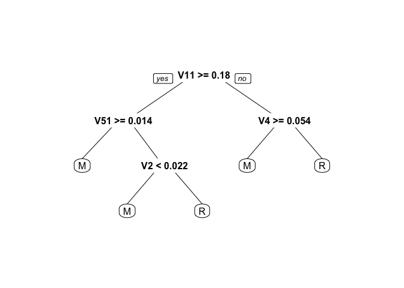

資料探勘綜合練習詳解
================

-   Sonar資料記載礦物與石頭接受各個不同角度的聲波撞擊後，接收到的回聲數值
-   一共有60個參數，代表使用一特別角度的聲波撞擊礦石所得回聲
-   分類結果為二元分類，包括礦物 ( M ) 與石頭 ( R )
-   將資料隨機分為訓練組(2/3)與測試組(1/3)
-   訓練模型並驗證！

``` r
library(mlbench)
library(rpart)
library(rpart.plot)
data(Sonar)
#分測試組及訓練組
Sonar$Test<-F
Sonar[sample(1:nrow(Sonar),nrow(Sonar)/3),]$Test<-T

#做決策樹
DT<-rpart(Class~.,data=Sonar[Sonar$Test==F,])
prp(DT)
```

    ## Warning: Bad 'data' field in model 'call'.
    ## To silence this warning:
    ##     Call prp with roundint=FALSE,
    ##     or rebuild the rpart model with model=TRUE.



``` r
#做預測
ClassPredicted<-predict(DT,newdata=Sonar[Sonar$Test==T,],type="class")
#比對預測結果與實際結果，並計算正確率
SonarResult<-data.frame(predict=ClassPredicted,real=Sonar[Sonar$Test==T,]$Class)
knitr::kable(SonarResult)
```

|     | predict | real |
|-----|:--------|:-----|
| 3   | R       | R    |
| 12  | R       | R    |
| 14  | M       | R    |
| 16  | M       | M    |
| 17  | R       | M    |
| 19  | M       | M    |
| 28  | M       | M    |
| 30  | M       | M    |
| 32  | R       | R    |
| 34  | M       | M    |
| 35  | M       | M    |
| 36  | M       | M    |
| 37  | M       | M    |
| 38  | M       | M    |
| 40  | M       | R    |
| 41  | R       | M    |
| 42  | M       | M    |
| 46  | R       | M    |
| 54  | M       | R    |
| 55  | M       | M    |
| 56  | R       | R    |
| 61  | R       | R    |
| 63  | R       | R    |
| 65  | R       | R    |
| 69  | R       | R    |
| 71  | R       | R    |
| 73  | R       | R    |
| 74  | R       | R    |
| 76  | M       | M    |
| 77  | R       | R    |
| 81  | R       | R    |
| 82  | R       | M    |
| 83  | M       | M    |
| 89  | M       | M    |
| 90  | M       | M    |
| 91  | M       | M    |
| 100 | M       | M    |
| 105 | M       | M    |
| 109 | M       | M    |
| 110 | R       | R    |
| 112 | M       | M    |
| 116 | M       | M    |
| 118 | M       | R    |
| 120 | M       | M    |
| 122 | R       | R    |
| 123 | M       | M    |
| 127 | R       | R    |
| 133 | R       | R    |
| 138 | M       | M    |
| 139 | M       | R    |
| 141 | R       | R    |
| 143 | M       | R    |
| 144 | M       | M    |
| 151 | M       | R    |
| 157 | M       | M    |
| 164 | R       | R    |
| 165 | R       | R    |
| 167 | M       | M    |
| 178 | M       | M    |
| 179 | M       | M    |
| 180 | R       | R    |
| 186 | R       | R    |
| 196 | R       | M    |
| 197 | M       | M    |
| 200 | R       | M    |
| 202 | M       | M    |
| 206 | M       | R    |
| 207 | M       | M    |
| 208 | M       | R    |

``` r
correctRate<-nrow(SonarResult[SonarResult$predict==SonarResult$real,])/nrow(SonarResult)
correctRate
```

    ## [1] 0.7826087
